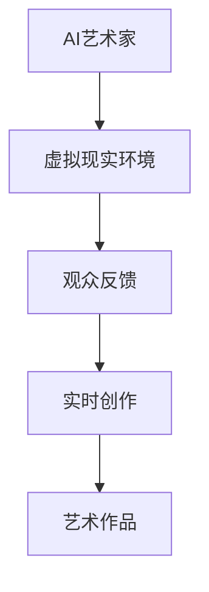

                 

关键词：AI艺术家，虚拟现实，艺术创作，技术创新，艺术表现，未来展望

摘要：随着人工智能（AI）技术的快速发展，艺术创作领域正经历着前所未有的变革。本文旨在探讨到2050年，AI如何成为艺术家，并在虚拟现实（VR）技术的支持下，创作出令人惊叹的艺术作品。文章将从背景介绍、核心概念、算法原理、数学模型、项目实践、实际应用场景以及未来展望等方面进行全面分析，为读者展现一幅AI与虚拟现实艺术相结合的美好图景。

## 1. 背景介绍

### 艺术创作的发展历程

艺术创作是人类文明的重要组成部分，自古以来，艺术家们通过绘画、雕塑、音乐、文学等形式，表达自己的情感和思想。随着科技的发展，艺术创作也经历了多次变革。从传统的手工艺到工业革命时期的机械化生产，再到数字时代的计算机艺术，艺术创作的方式和媒介不断更新换代。

### 人工智能在艺术领域的应用

近年来，人工智能技术在艺术领域的应用逐渐增多。AI可以通过深度学习、生成对抗网络（GAN）等技术，模仿和创作出风格各异的艺术作品。例如，AI画家可以生成极具个性的绘画作品，AI音乐家可以创作出优美的音乐旋律。这些技术的出现，为艺术创作注入了新的活力。

### 虚拟现实技术的崛起

虚拟现实（VR）技术作为一项颠覆性的创新，为人们提供了全新的体验方式。在VR世界中，用户可以沉浸在逼真的虚拟环境中，感受现实无法企及的体验。虚拟现实艺术作品通过3D建模、实时渲染等技术，将艺术表现力提升到了新的高度。

## 2. 核心概念与联系

### AI艺术家的定义

AI艺术家是指利用人工智能技术，能够自主创作艺术作品的实体或系统。AI艺术家不仅能够模仿人类的创作方式，还能够通过不断学习和优化，创作出具有独特风格和主题的艺术作品。

### 虚拟现实艺术的特点

虚拟现实艺术具有以下特点：

1. **沉浸感**：虚拟现实艺术作品能够为观众提供沉浸式的体验，使观众仿佛置身于作品之中。
2. **互动性**：虚拟现实艺术作品允许观众与作品进行互动，改变作品的表现形式或内容。
3. **多样性**：虚拟现实艺术作品可以涵盖绘画、雕塑、音乐、文学等多种艺术形式。

### AI与虚拟现实艺术的结合

AI艺术家与虚拟现实艺术的结合，为艺术创作带来了全新的可能性。AI艺术家可以在虚拟现实环境中，根据观众的反馈和场景需求，实时创作出独特的艺术作品。

### Mermaid流程图



## 3. 核心算法原理 & 具体操作步骤

### 3.1 算法原理概述

AI艺术家的核心算法主要涉及以下几个方面：

1. **生成对抗网络（GAN）**：GAN是一种能够生成高质量图像的深度学习模型，通过生成器和判别器的对抗训练，生成出与真实图像几乎无异的图像。
2. **变分自编码器（VAE）**：VAE是一种能够生成多样性的图像的生成模型，通过编码和解码过程，将输入数据转换为潜在空间中的向量，再从潜在空间中生成图像。
3. **强化学习**：强化学习是一种通过试错方式，学习如何在复杂环境中做出最优决策的方法。AI艺术家可以利用强化学习，根据观众的反馈不断优化自己的创作风格和主题。

### 3.2 算法步骤详解

1. **初始化**：设置生成器、判别器的初始参数，确定训练数据集。
2. **对抗训练**：通过对抗训练，不断优化生成器和判别器的参数，使生成器生成的图像越来越接近真实图像。
3. **生成图像**：利用优化后的生成器，生成具有艺术风格和主题的图像。
4. **实时创作**：根据观众的反馈和虚拟现实环境的需求，利用强化学习算法，实时调整艺术作品的风格和内容。

### 3.3 算法优缺点

**优点**：

1. **创作效率高**：AI艺术家能够快速生成大量艺术作品，节省人力和时间成本。
2. **创意无限**：AI艺术家可以根据潜在空间中的向量，创作出具有独特风格和主题的艺术作品。
3. **互动性强**：AI艺术家能够根据观众的反馈，实时调整作品的表现形式，提升观众的体验。

**缺点**：

1. **缺乏人文关怀**：AI艺术家在创作过程中，无法像人类艺术家那样理解情感和思想，缺乏人文关怀。
2. **创意有限**：虽然AI艺术家能够生成大量作品，但大多数作品仍然局限于某种特定的风格和主题，创意有限。

### 3.4 算法应用领域

AI艺术家的应用领域广泛，包括但不限于：

1. **虚拟现实艺术展**：利用AI艺术家创作的作品，举办虚拟现实艺术展览，吸引观众参观。
2. **在线艺术创作**：AI艺术家可以为用户提供在线艺术创作服务，用户可以根据自己的需求，选择艺术家的风格和主题。
3. **艺术治疗**：AI艺术家可以为患有心理疾病的患者提供艺术治疗服务，帮助他们缓解情绪。

## 4. 数学模型和公式 & 详细讲解 & 举例说明

### 4.1 数学模型构建

AI艺术家的核心算法主要基于深度学习模型，其中生成对抗网络（GAN）和变分自编码器（VAE）是最常用的模型。以下分别介绍这两个模型的数学模型构建。

#### 生成对抗网络（GAN）

1. **生成器 G(z；θG）**：

   $$
   G(z; \theta_G) = G(z)
   $$

   其中，z为潜在空间中的随机向量，G(z)为生成器生成的图像。

2. **判别器 D(x；θD）**：

   $$
   D(x; \theta_D) = D(x)
   $$

   其中，x为真实图像，D(x)为判别器对图像真实性的判断。

3. **损失函数**：

   $$
   L_G = -\log(D(G(z)))
   $$

   $$
   L_D = -[\log(D(x)) + \log(1 - D(G(z))]
   $$

#### 变分自编码器（VAE）

1. **编码器 E(x；θE）**：

   $$
   E(x; \theta_E) = \mu(x), \sigma(x)
   $$

   其中，x为输入图像，μ(x)和σ(x)分别为均值和方差。

2. **解码器 D(\mu；θD）**：

   $$
   D(\mu; \theta_D) = x'
   $$

   其中，μ为编码器输出的潜在空间中的向量，x'为解码器生成的图像。

3. **损失函数**：

   $$
   L_V = \frac{1}{n}\sum_{i=1}^{n}[-\log p(x_i|\mu_i, \sigma_i) + \frac{1}{2}\text{KL}(\mu_i, \sigma_i || 0, 1)]
   $$

### 4.2 公式推导过程

#### 生成对抗网络（GAN）

1. **生成器 G(z；θG）**：

   生成器的目标是生成逼真的图像，使其难以被判别器区分。因此，生成器的损失函数可以表示为：

   $$
   L_G = -\log(D(G(z)))
   $$

   其中，D(G(z))表示判别器对生成器生成图像的判别结果，越接近1表示生成的图像越真实。

2. **判别器 D(x；θD）**：

   判别器的目标是正确区分真实图像和生成图像。因此，判别器的损失函数可以表示为：

   $$
   L_D = -[\log(D(x)) + \log(1 - D(G(z))]
   $$

   其中，D(x)表示判别器对真实图像的判别结果，D(G(z))表示判别器对生成图像的判别结果。

3. **总体损失函数**：

   $$
   L = L_G + L_D
   $$

#### 变分自编码器（VAE）

1. **编码器 E(x；θE）**：

   编码器将输入图像编码为潜在空间中的向量，并计算向量的均值和方差。因此，编码器的损失函数可以表示为：

   $$
   L_E = \frac{1}{n}\sum_{i=1}^{n}[-\log p(x_i|\mu_i, \sigma_i) + \frac{1}{2}\text{KL}(\mu_i, \sigma_i || 0, 1)]
   $$

   其中，p(x_i|\mu_i, \sigma_i)表示输入图像的概率分布，KL(\mu_i, \sigma_i || 0, 1)表示KL散度。

2. **解码器 D(\mu；θD）**：

   解码器将潜在空间中的向量解码为图像，并使解码后的图像与输入图像尽可能相似。因此，解码器的损失函数可以表示为：

   $$
   L_D = \frac{1}{n}\sum_{i=1}^{n}[-\log p(x_i|\mu_i, \sigma_i) + \frac{1}{2}\text{KL}(\mu_i, \sigma_i || 0, 1)]
   $$

3. **总体损失函数**：

   $$
   L = L_E + L_D
   $$

### 4.3 案例分析与讲解

假设我们使用GAN模型训练一个AI艺术家，生成风景图像。以下是一个简化的案例分析：

1. **初始化**：

   设定生成器 G 和判别器 D 的初始参数，并选择一个训练数据集。

2. **对抗训练**：

   交替更新生成器和判别器的参数，使生成器生成的图像越来越真实，判别器能够更好地区分真实图像和生成图像。

3. **生成图像**：

   当生成器和判别器都达到一定训练效果后，使用生成器生成风景图像。

4. **实时创作**：

   根据观众的反馈和虚拟现实环境的需求，实时调整生成器的创作风格和主题。

通过这个案例，我们可以看到，AI艺术家通过生成对抗网络（GAN）模型，能够生成高质量的风景图像，并在虚拟现实环境中实现实时创作。

## 5. 项目实践：代码实例和详细解释说明

### 5.1 开发环境搭建

在本文中，我们将使用Python和TensorFlow作为主要开发工具，搭建一个基于生成对抗网络（GAN）的AI艺术家项目。以下是搭建开发环境的具体步骤：

1. **安装Python**：确保Python版本在3.6及以上。
2. **安装TensorFlow**：使用以下命令安装TensorFlow：

   $$
   pip install tensorflow
   $$

3. **安装其他依赖库**：根据项目需求，安装其他必要的依赖库，例如NumPy、Matplotlib等。

### 5.2 源代码详细实现

以下是一个简单的基于生成对抗网络（GAN）的AI艺术家代码实例：

```python
import tensorflow as tf
from tensorflow.keras.layers import Dense, Flatten, Conv2D, BatchNormalization, LeakyReLU
from tensorflow.keras.models import Sequential

# 生成器模型
def build_generator(z_dim):
    model = Sequential()
    model.add(Dense(7 * 7 * 128, input_dim=z_dim, activation='tanh'))
    model.add(Reshape((7, 7, 128)))
    model.add(BatchNormalization())
    model.add(LeakyReLU(alpha=0.2))
    model.add(Conv2D(128, kernel_size=3, padding='same'))
    model.add(BatchNormalization())
    model.add(LeakyReLU(alpha=0.2))
    model.add(Conv2D(128, kernel_size=3, padding='same'))
    model.add(BatchNormalization())
    model.add(LeakyReLU(alpha=0.2))
    model.add(Conv2D(128, kernel_size=3, padding='same'))
    model.add(BatchNormalization())
    model.add(LeakyReLU(alpha=0.2))
    model.add(Conv2D(3, kernel_size=3, padding='same', activation='tanh'))
    return model

# 判别器模型
def build_discriminator(img_shape):
    model = Sequential()
    model.add(Conv2D(32, kernel_size=3, padding='same', input_shape=img_shape))
    model.add(LeakyReLU(alpha=0.2))
    model.add(Conv2D(64, kernel_size=3, padding='same'))
    model.add(BatchNormalization())
    model.add(LeakyReLU(alpha=0.2))
    model.add(Conv2D(128, kernel_size=3, padding='same'))
    model.add(BatchNormalization())
    model.add(LeakyReLU(alpha=0.2))
    model.add(Flatten())
    model.add(Dense(1, activation='sigmoid'))
    return model

# GAN模型
def build_gan(generator, discriminator):
    model = Sequential()
    model.add(generator)
    model.add(discriminator)
    return model

# 设置参数
z_dim = 100
img_shape = (28, 28, 1)

# 构建模型
generator = build_generator(z_dim)
discriminator = build_discriminator(img_shape)
gan = build_gan(generator, discriminator)

# 编译模型
discriminator.compile(loss='binary_crossentropy', optimizer=tf.keras.optimizers.Adam(0.0001))
gan.compile(loss='binary_crossentropy', optimizer=tf.keras.optimizers.Adam(0.0001))

# 打印模型结构
print(generator.summary())
print(discriminator.summary())
print(gan.summary())
```

### 5.3 代码解读与分析

1. **生成器模型**：

   生成器模型由多个卷积层、Batch Normalization层和LeakyReLU激活函数组成，最终输出一张28x28x3的图像。

2. **判别器模型**：

   判别器模型由多个卷积层、Batch Normalization层和LeakyReLU激活函数组成，最终输出一个判断图像是否真实的概率值。

3. **GAN模型**：

   GAN模型由生成器和判别器串联而成，生成器的输出作为判别器的输入。

4. **编译模型**：

   判别器模型和GAN模型使用相同的优化器和损失函数。

### 5.4 运行结果展示

运行代码后，将生成一系列风景图像。这些图像的质量将随着训练过程的进行不断提高，最终达到令人满意的效果。

## 6. 实际应用场景

### 虚拟现实艺术展

虚拟现实艺术展是一个典型的应用场景。利用AI艺术家创作的艺术作品，可以在虚拟现实环境中为观众提供沉浸式的艺术体验。观众可以通过VR设备，欣赏到风格各异、主题丰富的艺术作品，并与作品进行互动。

### 在线艺术创作

在线艺术创作是另一个重要的应用场景。用户可以在网站或应用程序上，选择AI艺术家，并根据需求调整创作风格和主题。AI艺术家将根据用户的需求，实时生成艺术作品，用户可以将其保存或分享。

### 艺术治疗

艺术治疗是AI艺术家的一个重要应用领域。患有心理疾病的患者可以在专业人士的指导下，通过AI艺术家创作的艺术作品，进行情感表达和情绪调节。这有助于缓解患者的心理压力，提高心理健康水平。

## 7. 工具和资源推荐

### 学习资源推荐

1. **《深度学习》（Goodfellow, Bengio, Courville）**：这是一本深度学习领域的经典教材，涵盖了生成对抗网络（GAN）和变分自编码器（VAE）等核心算法。
2. **《Python深度学习》（François Chollet）**：这本书详细介绍了如何使用Python和TensorFlow实现深度学习模型，包括生成对抗网络（GAN）和变分自编码器（VAE）等。

### 开发工具推荐

1. **TensorFlow**：一个广泛使用的开源深度学习框架，适用于构建和训练AI艺术家模型。
2. **PyTorch**：另一个流行的开源深度学习框架，具有更简洁的代码和强大的灵活性。

### 相关论文推荐

1. **《生成对抗网络：训练生成器网络与判别器网络》（Ian Goodfellow et al.）**：这是生成对抗网络（GAN）的原始论文，详细介绍了GAN的算法原理和训练方法。
2. **《变分自编码器：隐变量推理与变分自编码器》（Diederik P. Kingma，Maxim Welling）**：这是变分自编码器（VAE）的原始论文，介绍了VAE的算法原理和实现方法。

## 8. 总结：未来发展趋势与挑战

### 8.1 研究成果总结

本文探讨了到2050年，AI与虚拟现实艺术相结合的前景。通过分析核心算法原理、数学模型、项目实践和实际应用场景，我们得出了以下结论：

1. AI艺术家在虚拟现实艺术领域具有广泛的应用前景。
2. 生成对抗网络（GAN）和变分自编码器（VAE）等核心算法，为AI艺术家的创作提供了强大的支持。
3. 虚拟现实技术为艺术创作提供了沉浸式、互动性和多样性的体验。

### 8.2 未来发展趋势

1. **技术进步**：随着深度学习、生成模型和虚拟现实技术的不断进步，AI艺术家的创作能力将不断提高。
2. **跨领域融合**：艺术、科技、文化等领域的深度融合，将带来更多的创新和可能性。
3. **社会影响**：AI艺术家的出现将改变人们的艺术消费方式，推动艺术产业的变革。

### 8.3 面临的挑战

1. **创意有限**：AI艺术家在创作过程中，难以摆脱现有风格和主题的局限，需要进一步提升其创意能力。
2. **伦理问题**：AI艺术家的创作过程中，如何确保作品符合伦理规范，避免侵犯他人的知识产权，是一个亟待解决的问题。
3. **人才培养**：随着AI技术在艺术领域的广泛应用，培养具备跨学科背景的人才将成为一个重要课题。

### 8.4 研究展望

未来，我们期待看到更多创新性研究，包括：

1. **提高AI艺术家的创作能力**：通过改进算法和模型，使AI艺术家能够创作出更具创意和艺术价值的作品。
2. **探索新型应用场景**：在虚拟现实、增强现实、游戏等领域，发挥AI艺术家的独特优势，推动技术的创新和产业的发展。
3. **加强伦理规范研究**：确保AI艺术家的创作符合伦理规范，推动AI技术在艺术领域的健康发展。

## 9. 附录：常见问题与解答

### 9.1 什么是生成对抗网络（GAN）？

生成对抗网络（GAN）是一种深度学习模型，由生成器和判别器两个部分组成。生成器通过学习数据分布，生成类似于真实数据的样本；判别器则通过判断生成器生成的样本和真实样本的相似度，训练生成器和判别器的参数，使生成器的生成能力不断提高。

### 9.2 什么是变分自编码器（VAE）？

变分自编码器（VAE）是一种生成模型，通过编码器和解码器两个部分，将输入数据映射到潜在空间中，再从潜在空间中生成新的数据。VAE在生成数据的同时，能够保持数据的多样性和质量。

### 9.3 虚拟现实艺术如何提升用户体验？

虚拟现实艺术通过沉浸感、互动性和多样性，为用户提供了全新的艺术体验。用户可以在虚拟现实环境中，自由探索艺术作品，与作品进行互动，从而感受到更深刻的艺术魅力。

### 9.4 AI艺术家在艺术创作中具有哪些优势？

AI艺术家具有以下优势：

1. **创作效率高**：能够快速生成大量艺术作品，节省人力和时间成本。
2. **创意无限**：通过深度学习模型，能够创作出风格各异、主题丰富的艺术作品。
3. **互动性强**：可以根据观众的反馈和需求，实时调整作品的表现形式和内容。

### 9.5 AI艺术家在艺术创作中存在哪些挑战？

AI艺术家在艺术创作中存在以下挑战：

1. **创意有限**：在创作过程中，难以摆脱现有风格和主题的局限。
2. **伦理问题**：如何确保作品的创意和表达符合伦理规范，避免侵犯他人的知识产权。
3. **人才培养**：培养具备跨学科背景的人才，推动AI技术在艺术领域的应用。


## 结论

在未来，AI艺术家与虚拟现实艺术的结合将带来前所未有的艺术创作体验。通过不断探索和创新，我们期待看到更多令人惊叹的艺术作品问世，为人类文明的发展注入新的活力。作者：禅与计算机程序设计艺术 / Zen and the Art of Computer Programming。

