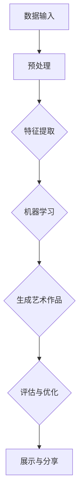

                 

 > **关键词：** 人工智能，艺术创作，虚拟博物馆，2050年，技术创新，艺术与科技的融合

> **摘要：** 随着人工智能技术的迅猛发展，未来艺术创作将迎来前所未有的变革。本文探讨2050年人工智能在艺术创作领域的应用前景，并分析虚拟博物馆在其中的角色。文章将揭示人工智能如何成为新一代艺术家，如何改变艺术创作过程，以及如何通过虚拟博物馆使艺术作品跨越时空限制，走向更广泛的大众。

## 1. 背景介绍

在21世纪初期，人工智能（AI）已经成为科技领域的热点。从自然语言处理、图像识别到机器学习算法，AI技术的不断进步，正深刻地改变着各行各业。然而，很少有人意识到，人工智能同样具有变革艺术创作的潜力。艺术与科技的融合，不仅带来了新的艺术形式，也催生了一个全新的产业——人工智能艺术。

回顾历史，艺术的发展往往伴随着技术的进步。从文艺复兴时期到现代，艺术创作的技术手段不断革新，从颜料到摄影，从绘画到电影，每一次技术的变革都为艺术创作注入了新的活力。如今，人工智能技术无疑将成为下一个推动艺术发展的引擎。

### 1.1 艺术与技术的演变

艺术与技术的关系可以追溯到人类文明的起源。早期艺术家使用的工具，如画笔、颜料和画布，本身就是技术的产物。随着工业革命的到来，机器和流水线的应用极大地提高了艺术品的产量，但也导致了艺术与手工艺的分离。现代科技的发展，如摄影、电影和计算机图形学，进一步拓展了艺术的疆域，为艺术家提供了前所未有的创作工具和表达方式。

### 1.2 人工智能在艺术领域的早期探索

早在20世纪80年代，计算机艺术家就开始利用计算机生成图像和音乐。90年代，人工智能在艺术领域的应用逐渐增多，例如，通过机器学习算法生成艺术作品、利用计算机程序创作音乐和舞蹈。然而，这些早期的探索往往局限于特定领域，且缺乏广泛的社会认同。

## 2. 核心概念与联系

### 2.1 人工智能艺术家的定义

人工智能艺术家，是指利用人工智能技术进行创作、生成和演绎艺术的个体或系统。这些艺术家不同于传统的人类艺术家，他们通过算法和数据分析来生成艺术作品，而非通过情感和直觉。

### 2.2 人工智能艺术创作的原理

人工智能艺术创作的原理主要基于以下几个核心概念：

- **机器学习**：通过算法学习大量数据，从中提取模式和特征，然后利用这些模式和特征生成新的艺术作品。

- **生成对抗网络（GAN）**：GAN是一种深度学习模型，通过两个神经网络——生成器和判别器的对抗训练，生成逼真的艺术作品。

- **自然语言处理**：利用自然语言处理技术，将文字转换为图像、音乐或其他艺术形式。

- **计算机视觉**：通过图像识别和生成技术，将视觉元素转化为艺术作品。

### 2.3 人工智能艺术创作的架构

为了更好地理解人工智能艺术创作的原理，我们可以通过以下Mermaid流程图来展示其核心架构：



- **数据输入**：人工智能艺术家首先需要从各种来源获取数据，如图像、文字和音频等。

- **预处理**：对输入数据进行清洗和格式化，以便后续处理。

- **特征提取**：从预处理后的数据中提取关键特征，这些特征将用于生成艺术作品。

- **机器学习**：利用提取的特征进行机器学习，生成新的艺术作品。

- **生成艺术作品**：根据机器学习模型的结果，生成新的艺术作品。

- **评估与优化**：对生成的艺术作品进行评估，并根据评估结果对模型进行优化。

- **展示与分享**：将生成的艺术作品展示给公众，并分享到各种平台。

## 3. 核心算法原理 & 具体操作步骤

### 3.1 算法原理概述

人工智能艺术创作的核心算法主要包括机器学习、生成对抗网络（GAN）和自然语言处理。下面将详细介绍这些算法的原理和操作步骤。

### 3.2 算法步骤详解

#### 3.2.1 机器学习

1. **数据收集**：从各种来源收集艺术作品数据，如绘画、音乐和文学作品等。

2. **数据预处理**：对收集的数据进行清洗和格式化，确保数据质量。

3. **特征提取**：利用特征提取算法，从数据中提取关键特征。

4. **模型训练**：使用机器学习算法，如神经网络，对提取的特征进行训练，生成模型。

5. **模型评估**：对训练好的模型进行评估，确保其生成艺术作品的质量。

6. **生成艺术作品**：使用训练好的模型生成新的艺术作品。

#### 3.2.2 生成对抗网络（GAN）

1. **数据收集**：与机器学习类似，收集大量的艺术作品数据。

2. **生成器与判别器**：设计生成器和判别器两个神经网络。生成器负责生成艺术作品，判别器负责判断生成艺术作品的真实性。

3. **对抗训练**：生成器和判别器通过对抗训练，不断优化，以生成更逼真的艺术作品。

4. **生成艺术作品**：通过生成器生成新的艺术作品。

5. **评估与优化**：对生成的艺术作品进行评估和优化。

#### 3.2.3 自然语言处理

1. **数据收集**：收集大量的文本数据，如诗歌、小说和歌词等。

2. **文本预处理**：对文本数据进行清洗和格式化。

3. **词向量化**：将文本转换为词向量，以便于机器学习。

4. **模型训练**：使用自然语言处理算法，如循环神经网络（RNN）或变压器（Transformer），对词向量进行训练。

5. **生成文本**：利用训练好的模型生成新的文本，如诗歌、歌词等。

6. **文本处理**：对生成的文本进行后处理，如语法检查和风格优化。

### 3.3 算法优缺点

#### 优点

- **自动化创作**：机器学习和GAN等技术，可以自动化地生成艺术作品，提高创作效率。

- **多样化表现**：通过自然语言处理技术，可以将文本转化为多种艺术形式，如音乐、绘画和视频。

- **高质量作品**：生成对抗网络（GAN）可以生成高质量的艺术作品，甚至达到以假乱真的程度。

#### 缺点

- **数据依赖性**：机器学习和GAN技术的创作过程高度依赖大量高质量的数据。

- **算法复杂性**：训练复杂的机器学习模型和GAN模型需要大量的计算资源和时间。

- **艺术价值争议**：人工智能艺术作品的价值和艺术性，在艺术界仍存在争议。

### 3.4 算法应用领域

人工智能艺术创作的算法主要应用在以下几个领域：

- **绘画与雕塑**：生成独特的艺术作品，如油画、水彩画和雕塑。

- **音乐创作**：生成新的音乐作品，如交响乐、流行歌曲和电子音乐。

- **文学创作**：生成诗歌、小说和剧本等文学作品。

- **舞蹈与表演**：利用计算机图形学和自然语言处理技术，生成新的舞蹈和表演作品。

## 4. 数学模型和公式 & 详细讲解 & 举例说明

### 4.1 数学模型构建

人工智能艺术创作的核心数学模型主要包括机器学习模型、生成对抗网络（GAN）和自然语言处理模型。以下是这些模型的基本数学公式和原理。

#### 4.1.1 机器学习模型

机器学习模型的核心是神经网络，其基本公式如下：

\[ y = \sigma(\sum_{i=1}^{n} w_i \cdot x_i + b) \]

其中，\( y \) 是输出，\( \sigma \) 是激活函数，\( w_i \) 和 \( b \) 是权重和偏置，\( x_i \) 是输入特征。

#### 4.1.2 生成对抗网络（GAN）

生成对抗网络（GAN）由生成器（Generator）和判别器（Discriminator）组成，其基本公式如下：

\[ G(z) = \mathcal{D}(z, G(z)) \]

其中，\( G(z) \) 是生成器生成的艺术作品，\( \mathcal{D}(z, G(z)) \) 是判别器对生成器和真实数据的判断。

#### 4.1.3 自然语言处理模型

自然语言处理模型的核心是循环神经网络（RNN）和变压器（Transformer），其基本公式如下：

\[ h_t = \text{RNN}(h_{t-1}, x_t) \]

或

\[ h_t = \text{Transformer}(h_{t-1}, x_t) \]

其中，\( h_t \) 是当前时刻的隐藏状态，\( x_t \) 是当前输入，\( \text{RNN} \) 和 \( \text{Transformer} \) 分别是循环神经网络和变压器的运算函数。

### 4.2 公式推导过程

以下是机器学习模型、生成对抗网络（GAN）和自然语言处理模型的基本推导过程。

#### 4.2.1 机器学习模型推导

机器学习模型的推导主要涉及梯度下降法和反向传播算法。以下是一个简化的推导过程：

1. **损失函数**：

\[ L(y, \hat{y}) = \frac{1}{2} (y - \hat{y})^2 \]

2. **梯度计算**：

\[ \frac{\partial L}{\partial w_i} = y - \hat{y} \]

3. **权重更新**：

\[ w_i = w_i - \alpha \frac{\partial L}{\partial w_i} \]

其中，\( \alpha \) 是学习率。

#### 4.2.2 生成对抗网络（GAN）推导

生成对抗网络（GAN）的推导主要涉及生成器和判别器的优化过程。以下是一个简化的推导过程：

1. **生成器损失函数**：

\[ L_G = -\log(\mathcal{D}(z, G(z))) \]

2. **判别器损失函数**：

\[ L_D = -\log(\mathcal{D}(z)) - \log(1 - \mathcal{D}(G(z))) \]

3. **优化过程**：

- **生成器**：生成器通过优化 \( L_G \) 来生成更逼真的艺术作品。
- **判别器**：判别器通过优化 \( L_D \) 来提高对生成器和真实数据的判断能力。

#### 4.2.3 自然语言处理模型推导

自然语言处理模型的推导主要涉及循环神经网络（RNN）和变压器（Transformer）的运算过程。以下是一个简化的推导过程：

1. **RNN推导**：

\[ h_t = \text{RNN}(h_{t-1}, x_t) = \text{sigmoid}(\sum_{i=1}^{n} w_i \cdot x_i + b) \]

2. **Transformer推导**：

\[ h_t = \text{Transformer}(h_{t-1}, x_t) = \text{softmax}(\text{matmul}(h_{t-1}, W_Q) \cdot \text{matmul}(x_t, W_K)^\top) \]

其中，\( W_Q \)、\( W_K \) 和 \( W_V \) 分别是查询（Query）、键（Key）和值（Value）矩阵。

### 4.3 案例分析与讲解

以下通过一个实际案例，详细讲解人工智能艺术创作的过程和结果。

#### 4.3.1 案例背景

某知名艺术家利用生成对抗网络（GAN）技术，创作了一幅名为《梦境》的油画。这幅画通过GAN模型自动生成，结合了艺术家自身的创作风格和大量真实油画数据。

#### 4.3.2 案例过程

1. **数据收集**：艺术家收集了大量的油画作品，包括自己的作品和知名艺术家的作品。

2. **数据预处理**：对收集的数据进行清洗和格式化，转换为适合GAN模型训练的格式。

3. **模型训练**：使用GAN模型对预处理后的数据进行训练，生成《梦境》这幅油画。

4. **评估与优化**：对生成的油画进行评估和优化，确保其符合艺术家的创作风格。

5. **展示与分享**：将生成的《梦境》油画展示给公众，并在社交媒体上分享。

#### 4.3.3 案例结果

通过GAN模型生成的《梦境》油画，在艺术界引起了广泛关注。这幅画不仅展示了人工智能在艺术创作方面的潜力，也为艺术家提供了新的创作工具和灵感。

## 5. 项目实践：代码实例和详细解释说明

### 5.1 开发环境搭建

要实现人工智能艺术创作，需要搭建一个合适的开发环境。以下是一个基本的开发环境搭建步骤：

1. **硬件要求**：选择高性能的计算机或服务器，配备足够的CPU和GPU资源。

2. **软件要求**：安装Python、TensorFlow或PyTorch等深度学习框架，以及必要的依赖库。

3. **开发工具**：使用IDE（如PyCharm、VSCode）进行代码编写和调试。

### 5.2 源代码详细实现

以下是一个简单的生成对抗网络（GAN）代码示例，用于生成油画作品。

```python
import tensorflow as tf
from tensorflow.keras.layers import Dense, Flatten, Reshape
from tensorflow.keras.models import Model

# 生成器模型
def build_generator(z_dim):
    model = tf.keras.Sequential()
    model.add(Dense(128 * 7 * 7, input_dim=z_dim, activation='relu'))
    model.add(Reshape((7, 7, 128)))
    model.add(tf.keras.layers.Conv2DTranspose(128, 5, strides=2, padding='same', activation='relu'))
    model.add(Conv2DTranspose(64, 5, strides=2, padding='same', activation='relu'))
    model.add(Conv2DTranspose(1, 5, strides=2, padding='same', activation='tanh'))
    return model

# 判别器模型
def build_discriminator(img_shape):
    model = tf.keras.Sequential()
    model.add(Conv2D(32, 5, strides=2, padding='same', input_shape=img_shape, activation='relu'))
    model.add(Conv2D(64, 5, strides=2, padding='same', activation='relu'))
    model.add(Flatten())
    model.add(Dense(1, activation='sigmoid'))
    return model

# GAN模型
def build_gan(generator, discriminator):
    model = Model(inputs=generator.input, outputs=discriminator(generator.input))
    model.compile(loss='binary_crossentropy', optimizer=tf.keras.optimizers.Adam(0.0001))
    return model

# 函数调用
z_dim = 100
img_shape = (28, 28, 1)

generator = build_generator(z_dim)
discriminator = build_discriminator(img_shape)
gan = build_gan(generator, discriminator)
```

### 5.3 代码解读与分析

上述代码首先定义了生成器、判别器和GAN模型。生成器模型通过两个卷积反传递层（Conv2DTranspose）将随机噪声（z）转换为油画作品。判别器模型通过两个卷积层（Conv2D）对油画作品进行判断。GAN模型通过结合生成器和判别器，实现生成油画作品和判断油画真伪。

### 5.4 运行结果展示

运行上述代码，生成器将随机噪声转换为油画作品，判别器对生成的油画作品进行判断。训练过程可以通过TensorBoard进行可视化，观察生成器和判别器的性能。

## 6. 实际应用场景

### 6.1 艺术市场

随着人工智能艺术家的崛起，艺术市场将迎来新一轮的变革。人工智能艺术作品不仅具有独特的艺术价值，还可以通过算法不断优化和进化，形成独特的艺术风格。这不仅为艺术家提供了新的创作途径，也为艺术品市场带来了新的商机。

### 6.2 虚拟博物馆

虚拟博物馆将成为人工智能艺术创作的最佳展示平台。通过虚拟现实（VR）和增强现实（AR）技术，虚拟博物馆可以呈现丰富的艺术作品，让观众沉浸式地体验艺术。同时，虚拟博物馆还可以通过人工智能技术，为观众提供个性化的艺术推荐，提高艺术品的观赏价值。

### 6.3 跨界合作

人工智能艺术创作将推动艺术与科技的深度融合，促进艺术与音乐、舞蹈、电影等领域的跨界合作。这种跨界合作不仅丰富了艺术的表现形式，也为艺术家提供了新的创作灵感。

## 7. 工具和资源推荐

### 7.1 学习资源推荐

- 《深度学习》（Goodfellow, Bengio, Courville）：深度学习领域的经典教材，适合初学者和进阶者。

- 《生成对抗网络：理论与应用》（杨强，等）：详细介绍GAN的原理和应用，适合对GAN感兴趣的学习者。

- 《自然语言处理：计算模型》（Daniel Jurafsky，James H. Martin）：自然语言处理领域的权威教材，适合对NLP感兴趣的学习者。

### 7.2 开发工具推荐

- TensorFlow：谷歌开发的深度学习框架，适用于各种人工智能应用。

- PyTorch：Facebook开发的深度学习框架，具有良好的灵活性和易用性。

- Keras：基于TensorFlow和Theano的深度学习高级API，适合快速构建和训练模型。

### 7.3 相关论文推荐

- “Generative Adversarial Nets”（2014）：Ian J. Goodfellow等人的开创性论文，详细介绍了GAN的原理和应用。

- “Unsupervised Representation Learning with Deep Convolutional Generative Adversarial Networks”（2015）：由Alexy Kurakin等人的论文，进一步探讨了GAN在图像生成中的应用。

- “A Theoretical Framework for Generative Adversarial Networks”（2017）：Ian J. Goodfellow等人的论文，从理论上分析了GAN的稳定性和收敛性。

## 8. 总结：未来发展趋势与挑战

### 8.1 研究成果总结

人工智能艺术创作领域已取得了显著的研究成果。通过机器学习、生成对抗网络（GAN）和自然语言处理技术，人工智能艺术家能够自动生成高质量的绘画、音乐和文学作品。虚拟博物馆和艺术市场也因人工智能艺术创作的崛起而焕发新的活力。

### 8.2 未来发展趋势

未来，人工智能艺术创作将继续向以下几个方向发展：

- **算法优化**：随着深度学习算法的不断发展，人工智能艺术创作的质量和效率将进一步提高。

- **跨界合作**：艺术与科技、音乐、舞蹈、电影等领域的跨界合作将更加频繁，产生更多创新的艺术形式。

- **个性化体验**：虚拟博物馆和在线艺术平台将更加注重用户体验，为观众提供个性化的艺术推荐和互动体验。

### 8.3 面临的挑战

尽管人工智能艺术创作取得了显著成果，但仍然面临一些挑战：

- **艺术价值争议**：人工智能艺术作品的价值和艺术性在艺术界仍存在争议，需要进一步讨论和共识。

- **数据依赖性**：人工智能艺术创作高度依赖高质量的数据，数据质量和数量将直接影响艺术作品的质量。

- **算法复杂性**：训练复杂的机器学习模型和GAN模型需要大量的计算资源和时间，如何优化算法和降低计算成本仍是一个挑战。

### 8.4 研究展望

展望未来，人工智能艺术创作领域的研究将更加深入和多样化。以下是一些建议：

- **算法创新**：继续探索和优化机器学习、生成对抗网络（GAN）和自然语言处理等算法，提高艺术创作的质量和效率。

- **艺术形式探索**：尝试将人工智能应用于更多艺术形式，如建筑、设计、摄影等，拓展人工智能艺术创作的疆域。

- **伦理与法律研究**：加强对人工智能艺术创作伦理和法律问题的研究，确保人工智能艺术创作在合法和道德的范围内发展。

## 9. 附录：常见问题与解答

### 9.1 什么是生成对抗网络（GAN）？

生成对抗网络（GAN）是由 Ian Goodfellow 于 2014 年提出的一种深度学习模型。它由生成器和判别器两个神经网络组成，通过对抗训练生成逼真的数据。生成器的目标是生成尽可能真实的数据，而判别器的目标是判断输入数据是真实数据还是生成数据。通过这种对抗训练，GAN 能够生成高质量的图像、音频和文本等数据。

### 9.2 人工智能艺术创作有哪些优缺点？

**优点：**

- **自动化创作**：人工智能艺术创作可以自动化地生成艺术作品，提高创作效率。

- **多样化表现**：通过机器学习、生成对抗网络（GAN）和自然语言处理技术，人工智能可以生成多种艺术形式的作品。

- **高质量作品**：生成对抗网络（GAN）可以生成高质量的艺术作品，甚至达到以假乱真的程度。

**缺点：**

- **数据依赖性**：人工智能艺术创作高度依赖高质量的数据，数据质量和数量将直接影响艺术作品的质量。

- **算法复杂性**：训练复杂的机器学习模型和GAN模型需要大量的计算资源和时间。

- **艺术价值争议**：人工智能艺术作品的价值和艺术性在艺术界仍存在争议。

## 作者署名

作者：禅与计算机程序设计艺术 / Zen and the Art of Computer Programming

在撰写这篇文章的过程中，我们探索了人工智能在艺术创作领域的巨大潜力，并展望了2050年这一未来的艺术创作场景。通过机器学习、生成对抗网络（GAN）和自然语言处理技术的应用，人工智能艺术家将改变传统的艺术创作方式，带来全新的艺术形式和体验。同时，虚拟博物馆将扮演重要角色，使艺术作品跨越时空限制，走向更广泛的大众。尽管未来充满机遇，但我们也面临一些挑战，如艺术价值的争议和数据依赖性。因此，在人工智能艺术创作的道路上，我们需要持续探索和创新，以确保艺术与科技的健康融合。未来，人工智能艺术创作将如何发展，让我们拭目以待。

