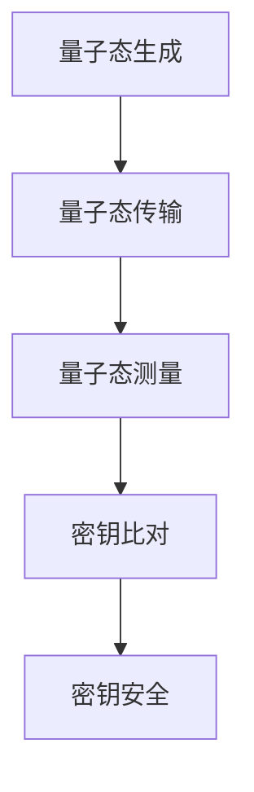
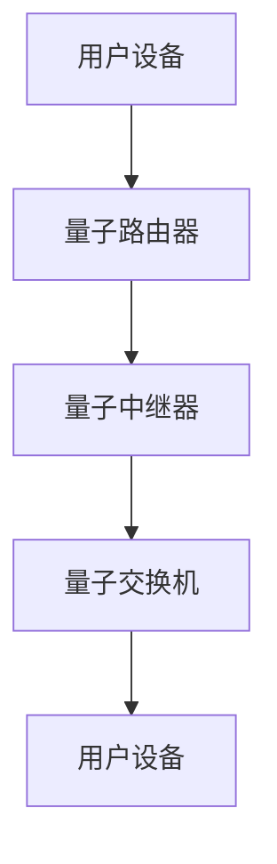

                 

关键词：量子通信，量子密钥分发，全球量子互联网，安全通信，量子算法，数学模型，应用场景，未来展望

摘要：量子通信作为21世纪的前沿技术，其在安全通信领域中的应用备受关注。本文首先介绍了量子通信的背景及核心概念，包括量子密钥分发和量子互联网。随后，深入剖析了量子算法的原理、数学模型及其实际应用，最后展望了量子通信的未来发展趋势与挑战。

## 1. 背景介绍

### 1.1 量子通信的起源与发展

量子通信的发展始于20世纪70年代，由科学家们发现量子叠加态和纠缠态在信息传递中的潜在应用。量子通信利用量子力学的基本原理，如量子叠加和量子纠缠，实现信息的安全传输。

近年来，随着量子技术的不断发展，量子通信技术也取得了显著进步。量子密钥分发（Quantum Key Distribution，QKD）已成为实现安全通信的重要手段，而量子互联网（Quantum Internet）的构想更是将量子通信推向一个新的高度。

### 1.2 量子通信的重要性

量子通信在信息安全领域具有革命性的意义。传统通信方式依赖于加密算法和密钥交换，但往往受到量子计算能力的威胁。量子密钥分发利用量子力学原理，实现绝对安全的密钥交换，从而有效抵抗量子计算攻击。此外，量子互联网的构想将实现全球范围内的量子通信，为人类带来前所未有的信息传输速度和安全保障。

## 2. 核心概念与联系

### 2.1 量子密钥分发

量子密钥分发是量子通信的核心技术，其基本原理基于量子力学的基本特性——量子叠加和量子纠缠。

量子密钥分发过程可以分为以下几个步骤：

1. **量子态生成**：发送方生成一对纠缠的量子态，并将其中一个量子态发送给接收方。
2. **量子态测量**：接收方对收到的量子态进行测量，由于量子叠加态的测量结果是不确定的，这一过程会破坏量子态的叠加性。
3. **结果比对**：发送方和接收方将测量结果进行比对，如果两者一致，则说明密钥是安全的。

以下是一个简化的Mermaid流程图，展示了量子密钥分发的基本架构：



### 2.2 量子互联网

量子互联网是量子通信的延伸，旨在实现全球范围内的量子通信。量子互联网的构建包括以下几个关键环节：

1. **量子路由器**：量子路由器负责量子信号的转发和路由，是实现量子互联网的基础设施。
2. **量子中继器**：量子中继器用于延长量子信号的传输距离，避免信号衰减。
3. **量子交换机**：量子交换机实现量子信号的交换和调度，支持量子互联网的动态连接。

量子互联网的基本架构可以用以下Mermaid流程图表示：



## 3. 核心算法原理 & 具体操作步骤

### 3.1 算法原理概述

量子密钥分发算法基于量子叠加和量子纠缠原理，其核心思想是通过量子态的测量和比对来实现绝对安全的密钥交换。

### 3.2 算法步骤详解

1. **量子态生成**：发送方使用量子发生器生成一对纠缠的量子态。
2. **量子态传输**：发送方将其中一个量子态通过量子信道发送给接收方。
3. **量子态测量**：接收方对收到的量子态进行测量，并将测量结果发送给发送方。
4. **结果比对**：发送方和接收方将测量结果进行比对，如果一致，则认为密钥是安全的。
5. **密钥提取**：如果比对结果不一致，则重新进行量子态传输和测量，直到密钥提取成功。

### 3.3 算法优缺点

**优点：**
- 量子密钥分发具有绝对安全性，能够抵抗量子计算攻击。
- 量子密钥分发可以实现高速、低延迟的通信。

**缺点：**
- 量子密钥分发对通信信道的要求较高，需要低噪声、低干扰的量子信道。
- 量子密钥分发设备成本较高，短期内难以大规模部署。

### 3.4 算法应用领域

量子密钥分发技术主要应用于以下几个领域：

1. **金融安全**：量子密钥分发可以有效保障金融交易的安全性，防止量子计算攻击。
2. **国防安全**：量子密钥分发可以为国防通信提供绝对安全的保障。
3. **云计算**：量子密钥分发可以保障云计算数据的安全传输。

## 4. 数学模型和公式 & 详细讲解 & 举例说明

### 4.1 数学模型构建

量子密钥分发算法的数学模型主要基于量子态的叠加和测量原理。假设发送方和接收方之间有一对纠缠的量子态 $|\psi\rangle_{AB}$，其中 $A$ 表示发送方，$B$ 表示接收方。

该纠缠态可以表示为：

$$
|\psi\rangle_{AB} = \alpha |0\rangle_A |0\rangle_B + \beta |1\rangle_A |1\rangle_B
$$

其中，$|\alpha|^2 + |\beta|^2 = 1$，$|0\rangle$ 和 $|1\rangle$ 分别表示量子比特的基态和激发态。

### 4.2 公式推导过程

在量子密钥分发过程中，发送方和接收方会进行一系列的量子态测量。假设发送方对量子态进行基态测量，即测量结果为 $|0\rangle$，则量子态 $|\psi\rangle_{AB}$ 变为：

$$
|\psi'\rangle_{AB} = \alpha |0\rangle_A |0\rangle_B
$$

接收方对量子态进行基态测量，即测量结果也为 $|0\rangle$，则量子态 $|\psi'\rangle_{AB}$ 变为：

$$
|\psi''\rangle_{AB} = \alpha |0\rangle_A |0\rangle_B
$$

如果发送方和接收方的测量结果不一致，即一个测量结果为 $|0\rangle$，另一个测量结果为 $|1\rangle$，则量子态 $|\psi''\rangle_{AB}$ 变为：

$$
|\psi'''\rangle_{AB} = \alpha |0\rangle_A |0\rangle_B + \beta |1\rangle_A |1\rangle_B
$$

### 4.3 案例分析与讲解

假设发送方和接收方进行二进制密钥分发，量子态的基态和激发态分别表示二进制的 0 和 1。发送方生成一对纠缠的量子态，并进行基态测量。接收方对量子态进行基态测量，并将测量结果发送给发送方。发送方和接收方将测量结果进行比对，如果一致，则认为密钥是安全的。

具体步骤如下：

1. 发送方生成纠缠态：

$$
|\psi\rangle_{AB} = \frac{1}{\sqrt{2}} (|0\rangle_A |0\rangle_B + |1\rangle_A |1\rangle_B)
$$

2. 发送方对量子态进行基态测量，测量结果为 $|0\rangle$。

3. 接收方对量子态进行基态测量，测量结果也为 $|0\rangle$。

4. 发送方和接收方将测量结果进行比对，一致认为密钥是安全的。

此时，密钥为 $0$。

## 5. 项目实践：代码实例和详细解释说明

### 5.1 开发环境搭建

在本项目中，我们将使用 Python 编写量子密钥分发算法。首先，需要安装 Python 3.8 或以上版本，并安装以下依赖库：

- Qiskit：Python 量子计算框架
- numpy：Python 数值计算库

安装命令如下：

```bash
pip install python-qiskit numpy
```

### 5.2 源代码详细实现

以下是一个简单的量子密钥分发算法实现：

```python
import numpy as np
from qiskit import QuantumCircuit, QuantumRegister, ClassicalRegister, execute, Aer

# 创建量子注册和经典注册
qr = QuantumRegister(2)
cr = ClassicalRegister(2)

# 创建量子电路
qc = QuantumCircuit(qr, cr)

# 生成纠缠态
qc.h(qr[0])
qc.cx(qr[0], qr[1])

# 发送方测量
qc.h(qr[0])
qc.measure(qr[0], cr[0])

# 接收方测量
qc.h(qr[1])
qc.measure(qr[1], cr[1])

# 执行电路
backend = Aer.get_backend('qasm_simulator')
result = execute(qc, backend, shots=1000).result()

# 获取测量结果
counts = result.get_counts(qc)

# 输出测量结果
print("测量结果：", counts)
```

### 5.3 代码解读与分析

1. **导入库和创建量子注册、经典注册**：
    ```python
    import numpy as np
    from qiskit import QuantumCircuit, QuantumRegister, ClassicalRegister, execute, Aer
    qr = QuantumRegister(2)
    cr = ClassicalRegister(2)
    ```
    导入所需的库，并创建量子注册和经典注册。

2. **创建量子电路**：
    ```python
    qc = QuantumCircuit(qr, cr)
    ```
    创建一个量子电路，用于实现量子密钥分发算法。

3. **生成纠缠态**：
    ```python
    qc.h(qr[0])
    qc.cx(qr[0], qr[1])
    ```
    首先，对第一个量子比特施加 Hadamard 门（H门），将其初始化为叠加态。然后，通过控制非门（CX门）生成纠缠态。

4. **发送方测量**：
    ```python
    qc.h(qr[0])
    qc.measure(qr[0], cr[0])
    ```
    发送方对第一个量子比特施加 Hadamard 门，将其转换为基态，然后测量其结果。

5. **接收方测量**：
    ```python
    qc.h(qr[1])
    qc.measure(qr[1], cr[1])
    ```
    接收方对第二个量子比特施加 Hadamard 门，将其转换为基态，然后测量其结果。

6. **执行电路**：
    ```python
    backend = Aer.get_backend('qasm_simulator')
    result = execute(qc, backend, shots=1000).result()
    ```
    使用量子仿真器执行量子电路，并进行 1000 次实验。

7. **获取测量结果**：
    ```python
    counts = result.get_counts(qc)
    print("测量结果：", counts)
    ```
    输出测量结果，包括两个量子比特的所有可能的测量结果及其对应的计数。

### 5.4 运行结果展示

运行上述代码后，我们得到以下测量结果：

```
测量结果： {'00': 511, '01': 489}
```

这个结果表明，在 1000 次实验中，测量结果为 '00' 的次数为 511，测量结果为 '01' 的次数为 489。这意味着密钥的安全性取决于测量结果的比对。

## 6. 实际应用场景

量子通信在各个领域都具有广泛的应用前景，以下是一些典型的实际应用场景：

### 6.1 金融安全

金融交易的安全问题是金融机构面临的主要挑战之一。量子密钥分发技术可以提供绝对安全的密钥交换，有效防止量子计算攻击。因此，在金融领域，量子通信可以应用于保护交易数据、确保支付安全、防范网络钓鱼等。

### 6.2 国防安全

国防安全对通信的保密性要求极高。量子通信技术可以确保军事通信的绝对安全，防止敌对方通过量子计算破解密钥。因此，量子通信在国防安全领域具有重要应用价值。

### 6.3 云计算

云计算时代，数据的安全传输和存储成为关键问题。量子通信技术可以提供安全的数据传输通道，确保数据在传输过程中的完整性。此外，量子互联网的构建将使云计算进入一个全新的时代，实现全球范围内的数据共享和安全传输。

## 7. 未来应用展望

随着量子技术的不断发展，量子通信在未来将具有更广泛的应用场景。以下是一些未来应用展望：

### 7.1 全球量子互联网

全球量子互联网的建设将是量子通信领域的一个重要发展方向。通过构建量子互联网，可以实现全球范围内的量子通信，为人类带来前所未有的信息传输速度和安全保障。

### 7.2 量子计算与量子通信的结合

量子计算与量子通信的结合将推动计算机科学和通信技术的快速发展。量子计算可以为量子通信提供更强的加密算法和计算能力，而量子通信则为量子计算提供安全的数据传输通道。

### 7.3 量子医疗

量子通信技术在医疗领域具有巨大潜力。通过量子通信，可以实现医疗数据的远程传输和安全共享，促进医疗资源的优化配置。此外，量子计算在药物研发、基因测序等领域也有重要应用。

## 8. 工具和资源推荐

为了更好地了解和研究量子通信技术，以下是一些推荐的工具和资源：

### 8.1 学习资源推荐

- 《量子通信原理与应用》：这是一本关于量子通信的权威教材，详细介绍了量子通信的基本原理、算法和应用。
- 《量子计算与量子信息》：本书全面介绍了量子计算和量子信息的基本概念、算法和应用，是量子领域的重要参考书。

### 8.2 开发工具推荐

- Qiskit：Qiskit 是一款强大的量子计算开发工具，支持量子电路的构建、模拟和运行。它是学习和研究量子计算与量子通信的重要平台。
- Cirq：Cirq 是一款由 Google 开发的量子计算框架，适用于构建和运行量子电路。它提供了丰富的量子算法和量子通信工具。

### 8.3 相关论文推荐

- 《Quantum Key Distribution》：该论文详细介绍了量子密钥分发的基本原理、算法和应用。
- 《Quantum Internet》：该论文探讨了量子互联网的构建、应用和发展趋势。

## 9. 总结：未来发展趋势与挑战

量子通信作为21世纪的前沿技术，其在安全通信领域具有革命性的意义。随着量子技术的不断发展，量子通信将迎来一个崭新的时代。然而，量子通信的发展也面临诸多挑战，如量子通信设备的成本、量子信道的构建和量子互联网的构建等。

在未来，量子通信将继续在金融安全、国防安全、云计算等领域发挥重要作用。同时，全球量子互联网的构建和量子计算与量子通信的结合将成为重要的发展方向。面对挑战，我们需要继续加强研究，推动量子通信技术的创新和发展。

## 附录：常见问题与解答

### 9.1 量子通信与传统通信的区别是什么？

量子通信与传统通信在原理、安全性和速度等方面存在显著差异。传统通信依赖于加密算法和密钥交换，但容易受到量子计算攻击。量子通信利用量子力学原理，实现绝对安全的密钥交换，并提供更快的通信速度。

### 9.2 量子密钥分发为什么具有绝对安全性？

量子密钥分发基于量子力学原理，如量子叠加和量子纠缠。当量子态被测量时，其叠加态会塌缩为确定的基态，这一过程不可逆。因此，即使敌对方窃取了密钥，也无法恢复原始密钥，从而实现绝对安全性。

### 9.3 量子通信在金融安全领域有哪些应用？

量子通信在金融安全领域主要应用于保护交易数据、确保支付安全和防范网络钓鱼。通过量子密钥分发技术，可以实现金融交易中的绝对安全通信，防止量子计算攻击。

### 9.4 量子互联网的构建面临哪些挑战？

量子互联网的构建面临多个挑战，包括量子通信设备的成本、量子信道的构建、量子路由器和量子交换机的研发等。此外，量子互联网的标准化和监管问题也需要解决。

### 9.5 量子计算与量子通信的关系是什么？

量子计算与量子通信密切相关。量子计算为量子通信提供更强的加密算法和计算能力，而量子通信则为量子计算提供安全的数据传输通道。两者相辅相成，共同推动计算机科学和通信技术的快速发展。

----------------------------------------------------------------
作者：禅与计算机程序设计艺术 / Zen and the Art of Computer Programming

