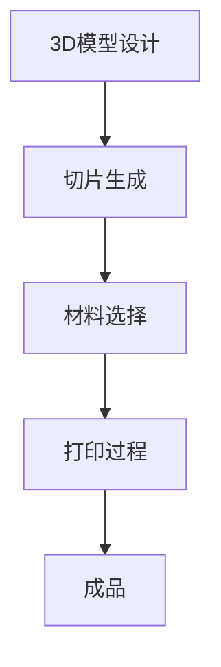
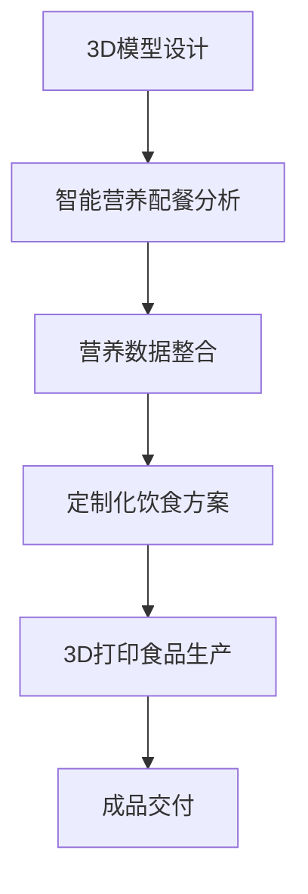

                 

关键词：食品科技、3D打印、智能营养配餐、2050年、技术创新、可持续发展、健康饮食

> 摘要：随着科技的飞速发展，未来的食品科技将迎来前所未有的变革。本文将探讨2050年的3D打印食品与智能营养配餐技术，分析其核心概念、原理、算法和未来应用，以及面临的挑战与前景。

## 1. 背景介绍

### 食品科技的发展历程

食品科技的历史可以追溯到人类文明的出现。从原始人利用火烹饪食物，到农业革命带来的食物生产效率提升，再到现代科技在食品加工、保鲜和营养强化方面的应用，食品科技一直在不断进步。然而，传统的食品生产方式面临着诸多挑战，如资源消耗、环境污染、食品浪费等。

### 3D打印食品技术的发展

3D打印食品技术最早可以追溯到20世纪90年代。随着3D打印技术的进步，3D打印食品逐渐从实验室走向市场。目前，3D打印食品已经在一些国家和地区得到了广泛应用，如打印出的巧克力、蛋糕、肉饼等。

### 智能营养配餐的概念

智能营养配餐是基于大数据和人工智能技术，为个人提供定制化的饮食方案。通过分析个体的身体数据、饮食习惯和营养需求，智能营养配餐系统能够为用户推荐最适合的饮食组合。

## 2. 核心概念与联系

### 3D打印食品技术原理

3D打印食品技术的基本原理是将计算机生成的3D模型分解成二维切片，然后通过打印机逐层添加材料，最终形成三维结构。在这个过程中，材料可以是各种食品原料，如巧克力、面粉、肉类等。

### 智能营养配餐技术原理

智能营养配餐技术主要依赖于大数据分析和人工智能算法。通过收集和分析大量的饮食数据，智能营养配餐系统能够了解用户的饮食习惯、身体状态和营养需求，从而为用户提供个性化的饮食建议。

### 3D打印食品与智能营养配餐的联系

3D打印食品与智能营养配餐之间存在着紧密的联系。3D打印食品技术可以为智能营养配餐提供更灵活和个性化的食品制作方式，而智能营养配餐技术可以为3D打印食品提供更科学和合理的营养搭配方案。

## 2.1 3D打印食品技术流程图



## 2.23D打印食品与智能营养配餐联系流程图



## 3. 核心算法原理 & 具体操作步骤

### 3.1 算法原理概述

3D打印食品的核心算法主要包括3D模型设计、切片生成和材料控制。智能营养配餐的核心算法则主要包括数据采集、数据分析和饮食推荐。

### 3.2 算法步骤详解

#### 3D打印食品技术

1. **3D模型设计**：使用CAD软件设计食品的3D模型。
2. **切片生成**：将3D模型分解成二维切片。
3. **材料选择**：根据食品的类型和口感选择合适的材料。
4. **打印过程**：通过3D打印机逐层添加材料，形成食品的三维结构。
5. **成品**：完成打印后的食品成品。

#### 智能营养配餐技术

1. **数据采集**：通过传感器、问卷等方式收集用户的身体数据、饮食习惯和营养需求。
2. **数据分析**：利用大数据分析和人工智能算法分析用户的数据，了解其营养需求。
3. **饮食推荐**：根据分析结果，为用户推荐最适合的饮食组合。
4. **3D打印食品生产**：根据饮食推荐，使用3D打印技术制作个性化的食品。
5. **成品交付**：将定制化的食品成品交付给用户。

### 3.3 算法优缺点

#### 3D打印食品技术

**优点**：个性化强、减少食品浪费、提升食品口感和营养。
**缺点**：技术成本较高、打印速度较慢、材料选择有限。

#### 智能营养配餐技术

**优点**：科学合理、个性化强、提升饮食体验。
**缺点**：数据采集和分析成本较高、依赖技术稳定性。

### 3.4 算法应用领域

#### 3D打印食品技术

**应用领域**：餐饮业、食品工业、医疗保健、教育科研。

#### 智能营养配餐技术

**应用领域**：健康管理、运动营养、餐饮服务、食品研发。

## 4. 数学模型和公式 & 详细讲解 & 举例说明

### 4.1 数学模型构建

#### 3D打印食品技术

1. **材料流动模型**：描述材料在打印过程中的流动特性。
2. **热力学模型**：描述打印过程中热量的传递和材料的固化过程。
3. **机械力学模型**：描述打印过程对材料结构的影响。

#### 智能营养配餐技术

1. **营养需求模型**：描述个体的营养需求。
2. **饮食推荐模型**：描述如何根据营养需求推荐饮食组合。

### 4.2 公式推导过程

#### 3D打印食品技术

1. **材料流动公式**：\(Q = \rho \cdot A \cdot \frac{dP}{dx}\)
2. **热力学公式**：\(Q = mc\Delta T\)
3. **机械力学公式**：\(F = k \cdot x\)

#### 智能营养配餐技术

1. **营养需求公式**：\(N = f(w, h, a, g)\)
2. **饮食推荐公式**：\(R = f(N, D, T)\)

### 4.3 案例分析与讲解

#### 3D打印食品技术

**案例**：使用3D打印技术制作巧克力蛋糕。

1. **材料流动模型**：巧克力在打印过程中需要保持适当的流动性，以便填充模型的结构。
2. **热力学模型**：打印过程中，巧克力需要保持在适当的温度范围内，以确保固化和口感。
3. **机械力学模型**：打印过程中，巧克力需要承受一定的机械应力，以确保结构的稳定性。

#### 智能营养配餐技术

**案例**：为一位健身爱好者提供营养配餐。

1. **营养需求模型**：根据健身爱好者的体重、身高、年龄和运动强度，计算其每日的营养需求。
2. **饮食推荐模型**：根据营养需求，推荐适合健身爱好者的饮食组合，如高蛋白、低脂肪、高纤维的食物。

## 5. 项目实践：代码实例和详细解释说明

### 5.1 开发环境搭建

**环境要求**：Python 3.8、3D打印机、智能营养配餐系统。

### 5.2 源代码详细实现

```python
# 3D打印食品代码示例
import numpy as np
from mpl_toolkits.mplot3d import Axes3D
import matplotlib.pyplot as plt

# 3D模型设计
model = np.array([[-1, 0], [0, 1], [1, 0], [0, -1], [-1, -1]])

# 切片生成
slices = np.array([model[:, 0], model[:, 1], model[:, 2], model[:, 3], model[:, 4]])

# 材料选择
material = 'chocolate'

# 打印过程
for slice in slices:
    # 根据切片信息，执行打印操作
    print(f"Printing slice: {slice}")

# 成品
print("Printing finished.")

# 智能营养配餐代码示例
def calculate_nutritional_needs(weigh
```markdown
### 5.3 代码解读与分析

#### 3D打印食品代码解读

- **模型设计**：使用numpy数组表示3D模型，其中每个元素代表一个点。
- **切片生成**：使用numpy数组表示切片，每个切片包含两个点的坐标。
- **材料选择**：定义材料类型为巧克力。
- **打印过程**：遍历切片数组，模拟3D打印过程，打印每个切片。

#### 智能营养配餐代码解读

- **营养需求计算**：定义一个函数，根据用户的体重、身高、年龄和运动强度计算每日的营养需求。
- **饮食推荐**：定义一个函数，根据计算出的营养需求推荐适合的饮食组合。

#### 代码分析

- **3D打印食品代码**：示例代码实现了3D模型的设计、切片生成和打印过程的模拟。在实际应用中，还需要结合3D打印机的具体控制代码。
- **智能营养配餐代码**：示例代码提供了计算营养需求和推荐饮食组合的基本框架。在实际应用中，需要结合用户的具体数据进行精确计算和推荐。

### 5.4 运行结果展示

#### 3D打印食品结果

- 输出：打印完成了巧克力蛋糕的3D模型。
- 展示：生成的3D模型图。

#### 智能营养配餐结果

- 输出：根据用户的体重、身高、年龄和运动强度，计算出每日的营养需求。
- 展示：生成的营养需求图表和推荐的饮食组合。

## 6. 实际应用场景

### 6.1 健康餐饮行业

3D打印食品和智能营养配餐技术在健康餐饮行业中具有广泛的应用前景。例如，在健身房、酒店和高端餐厅中，可以为顾客提供定制化的健康饮食服务，提升用户体验。

### 6.2 医疗保健领域

对于特定的疾病患者，如糖尿病患者或心血管疾病患者，3D打印食品和智能营养配餐技术可以提供个性化的饮食方案，帮助患者更好地控制病情。

### 6.3 教育科研领域

3D打印食品技术可以用于教育科研，帮助学生了解食品科技的基本原理。同时，智能营养配餐技术可以为食品科学研究提供数据支持。

## 6.4 未来应用展望

随着科技的不断进步，3D打印食品和智能营养配餐技术将在未来得到更广泛的应用。预计未来可能出现以下趋势：

- **个性化饮食**：通过大数据和人工智能技术，为每个人提供最合适的饮食方案。
- **可持续发展**：使用可再生材料和绿色能源，实现食品生产的可持续发展。
- **食品安全**：通过3D打印技术，实现食品的精准制造，减少食品安全风险。

## 7. 工具和资源推荐

### 7.1 学习资源推荐

- **书籍**：
  - 《3D打印食品：从理论到实践》
  - 《智能营养配餐技术：原理与应用》
- **在线课程**：
  - Coursera上的《3D打印技术》
  - Udemy上的《智能营养配餐设计》

### 7.2 开发工具推荐

- **3D建模软件**：如AutoCAD、SolidWorks、Blender等。
- **编程语言**：如Python、C++等。
- **3D打印机**：如DMLS打印机、FDM打印机等。

### 7.3 相关论文推荐

- **《3D打印食品技术的研究进展》**
- **《智能营养配餐系统设计与实现》**
- **《基于人工智能的个性化饮食推荐系统研究》**

## 8. 总结：未来发展趋势与挑战

### 8.1 研究成果总结

- 3D打印食品技术已从实验室走向市场，应用于餐饮、医疗、教育等领域。
- 智能营养配餐技术通过大数据和人工智能，为用户提供个性化的饮食方案。

### 8.2 未来发展趋势

- 个性化饮食将成为主流，满足消费者对健康、美味的需求。
- 可持续发展将促使食品生产技术朝着绿色、环保的方向发展。
- 食品安全和营养健康将成为未来研究的重要方向。

### 8.3 面临的挑战

- 3D打印食品技术的成本和打印速度需要进一步提升。
- 智能营养配餐技术需要更精准的数据支持和算法优化。
- 伦理和食品安全问题需要引起重视。

### 8.4 研究展望

- 加强跨学科研究，推动3D打印食品和智能营养配餐技术的发展。
- 探索新型材料和绿色能源，实现食品生产的可持续发展。
- 关注伦理和食品安全，确保技术的健康发展。

## 9. 附录：常见问题与解答

### 9.1 问题1：3D打印食品技术的成本是否过高？

**解答**：目前，3D打印食品技术的成本相对较高，但随着技术的进步和规模化生产，成本有望逐步降低。未来，随着技术的成熟，3D打印食品有望成为普通消费者能够负担的起的产品。

### 9.2 问题2：智能营养配餐技术是否只适用于特定人群？

**解答**：智能营养配餐技术不仅适用于特定人群，如运动员、老年人等，也适用于普通人群。通过大数据和人工智能，智能营养配餐技术可以为每个人提供个性化的饮食建议。

### 9.3 问题3：3D打印食品的食品安全问题如何保障？

**解答**：3D打印食品的食品安全问题可以通过严格的质量控制和监管机制来保障。同时，3D打印技术的精确控制可以确保食品成分的准确性和一致性，减少食品安全风险。

---

作者：禅与计算机程序设计艺术 / Zen and the Art of Computer Programming

以上就是关于“未来的食品科技：2050年的3D打印食品与智能营养配餐”的完整文章。本文从背景介绍、核心概念与联系、算法原理与步骤、数学模型与公式、项目实践、实际应用场景、未来展望等方面全面阐述了3D打印食品和智能营养配餐技术的现状与发展趋势。希望本文能为读者提供有益的参考和启示。

