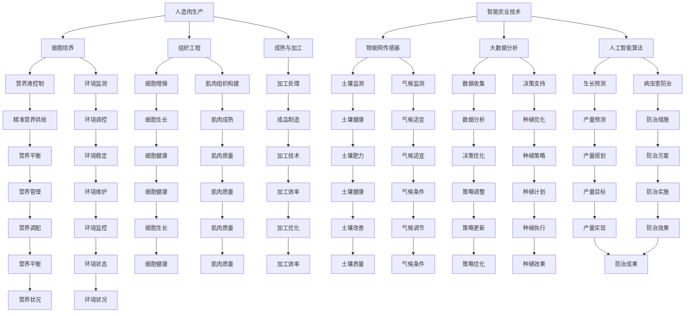

                 

关键词：未来食品科技，人造肉，智能农业，2050年，技术展望

> 摘要：随着全球人口的不断增长和气候变化对传统农业的挑战，未来食品科技将成为解决粮食安全和可持续性问题的重要途径。本文探讨了2050年的人造肉与智能农业技术，分析了这些技术对人类生活和社会经济的影响。

## 1. 背景介绍

### 全球人口增长与食品需求

全球人口的快速增长对食品供应提出了巨大的挑战。根据联合国预测，到2050年全球人口将达到约100亿。这意味着，我们需要在现有的食品生产体系下，提供更多的粮食来满足不断增加的口粮需求。

### 传统农业的局限性

传统农业在提高产量和抗灾能力方面存在一定的局限性。气候变化、土地退化、水资源短缺等问题严重制约了农业的可持续发展。此外，传统农业的效率低下和环境污染问题也日益突出。

### 食品安全与可持续性

食品安全与可持续性是全球关注的焦点。传统的食品生产方式往往依赖于大量的化学肥料、农药和能源消耗，这些因素不仅对环境造成负面影响，还可能导致食品质量的不稳定。

### 2050年的愿景

面对上述挑战，2050年的食品科技将扮演至关重要的角色。通过技术创新，我们可以开发出更加高效、可持续的人造肉和智能农业技术，为人类提供健康、安全、可持续的食品供应。

## 2. 核心概念与联系

### 人造肉

人造肉是通过培养动物细胞来生产的肉制品，它避免了传统畜牧业带来的环境污染和动物福利问题。人造肉的生产过程通常涉及以下几个关键环节：

- **细胞培养**：通过生物技术手段，从动物体内提取细胞，然后在营养液中进行培养和增殖。
- **组织工程**：将培养出的细胞组织通过生物工程方法构建成具有肌肉组织特性的结构。
- **成熟与加工**：将成熟的人造肉组织进行加工，如切割、烹调等，以制成最终产品。

### 智能农业

智能农业利用信息技术、物联网、大数据和人工智能等手段，提高农业生产的效率和可持续性。智能农业的核心概念包括：

- **物联网传感器**：用于实时监测土壤、水分、气候等环境参数。
- **大数据分析**：通过收集和分析大量的农业数据，优化作物种植、灌溉、施肥等决策。
- **人工智能算法**：用于预测作物生长趋势、病虫害防治、产量预测等。

### 人造肉与智能农业的联系

人造肉和智能农业之间存在着密切的联系。智能农业技术可以为人造肉生产提供关键支持，例如：

- **精准营养供给**：智能农业可以根据人造肉细胞培养的需求，精确控制营养液的成分和浓度。
- **环境监测与调控**：智能农业传感器可以实时监测人造肉生产环境中的温度、湿度等参数，确保细胞培养过程在最佳条件下进行。
- **产量预测与管理**：人工智能算法可以预测人造肉的生产量，帮助农民合理安排种植和养殖计划。

## 2.1 核心概念原理和架构的 Mermaid 流程图



### 3. 核心算法原理 & 具体操作步骤

#### 3.1 算法原理概述

人造肉和智能农业技术的核心算法主要涉及以下几个方面：

- **细胞培养算法**：用于控制营养液的成分和浓度，以促进细胞增殖和肌肉组织的形成。
- **大数据分析算法**：用于处理和分析农业数据，以优化种植和养殖决策。
- **人工智能算法**：用于预测作物生长趋势、病虫害防治和产量预测。

#### 3.2 算法步骤详解

##### 3.2.1 细胞培养算法

1. **细胞提取**：从动物体内提取细胞，通常使用生物酶进行分离。
2. **营养液配制**：根据细胞培养的需求，配制适合的营养液，包括氨基酸、维生素、矿物质等。
3. **细胞培养**：将提取出的细胞放入营养液中，在适当的温度和湿度下培养。
4. **细胞增殖**：通过添加生长因子和营养物质，促进细胞增殖。
5. **肌肉组织构建**：将增殖后的细胞组织进行生物工程处理，构建成具有肌肉组织特性的结构。

##### 3.2.2 大数据分析算法

1. **数据收集**：通过物联网传感器收集土壤、水分、气候等环境数据。
2. **数据预处理**：对收集到的数据进行清洗、过滤和标准化处理。
3. **特征提取**：从预处理后的数据中提取关键特征，如土壤湿度、温度等。
4. **数据分析**：利用机器学习算法对特征数据进行分析，预测作物生长趋势和病虫害情况。
5. **决策支持**：根据分析结果，提供种植、灌溉、施肥等决策支持。

##### 3.2.3 人工智能算法

1. **生长趋势预测**：利用时间序列分析和机器学习算法，预测作物的生长趋势。
2. **病虫害防治**：通过图像识别和机器学习算法，识别病虫害，并制定相应的防治措施。
3. **产量预测**：利用回归分析和机器学习算法，预测作物的产量。

#### 3.3 算法优缺点

**细胞培养算法**

- **优点**：可以精确控制营养液的成分和浓度，促进细胞增殖和肌肉组织的形成。
- **缺点**：技术复杂，成本较高，对生物工程和生物技术的要求较高。

**大数据分析算法**

- **优点**：可以充分利用物联网和大数据技术，提高农业生产的效率和可持续性。
- **缺点**：数据处理量大，对计算资源和算法性能要求较高。

**人工智能算法**

- **优点**：可以自动化预测作物生长趋势和病虫害，提高农业生产决策的准确性。
- **缺点**：对数据质量和算法模型的要求较高，可能存在过拟合问题。

#### 3.4 算法应用领域

- **人造肉生产**：用于控制营养液的成分和浓度，优化细胞培养过程。
- **智能农业**：用于预测作物生长趋势、病虫害防治和产量预测。

### 4. 数学模型和公式 & 详细讲解 & 举例说明

#### 4.1 数学模型构建

人造肉和智能农业的数学模型主要包括以下几个方面：

- **细胞增殖模型**：描述细胞在营养液中的增殖过程。
- **作物生长模型**：描述作物在不同环境条件下的生长过程。
- **病虫害模型**：描述病虫害的发生和发展过程。

#### 4.2 公式推导过程

##### 4.2.1 细胞增殖模型

细胞增殖模型可以表示为：

\[ N(t) = N_0 \cdot e^{kt} \]

其中，\( N(t) \) 是时间 \( t \) 时的细胞数量，\( N_0 \) 是初始细胞数量，\( k \) 是增殖率。

##### 4.2.2 作物生长模型

作物生长模型可以表示为：

\[ S(t) = S_0 \cdot e^{rt} \]

其中，\( S(t) \) 是时间 \( t \) 时的作物面积，\( S_0 \) 是初始作物面积，\( r \) 是生长率。

##### 4.2.3 病虫害模型

病虫害模型可以表示为：

\[ I(t) = I_0 \cdot e^{mt} \]

其中，\( I(t) \) 是时间 \( t \) 时的病虫害面积，\( I_0 \) 是初始病虫害面积，\( m \) 是病虫害扩散率。

#### 4.3 案例分析与讲解

##### 4.3.1 细胞增殖模型案例分析

假设一个细胞培养过程，初始细胞数量为 \( N_0 = 1000 \)，增殖率为 \( k = 0.1 \)。我们需要计算 24 小时后的细胞数量。

根据细胞增殖模型：

\[ N(t) = N_0 \cdot e^{kt} \]

将 \( t = 24 \) 小时，\( N_0 = 1000 \)，\( k = 0.1 \) 代入公式：

\[ N(24) = 1000 \cdot e^{0.1 \cdot 24} \]

计算得到：

\[ N(24) = 1000 \cdot e^{2.4} \approx 1000 \cdot 11.51 = 11510 \]

因此，24 小时后的细胞数量约为 11510。

##### 4.3.2 作物生长模型案例分析

假设一个作物种植过程，初始作物面积为 \( S_0 = 10000 \)，生长率为 \( r = 0.05 \)。我们需要计算 30 天后的作物面积。

根据作物生长模型：

\[ S(t) = S_0 \cdot e^{rt} \]

将 \( t = 30 \) 天，\( S_0 = 10000 \)，\( r = 0.05 \) 代入公式：

\[ S(30) = 10000 \cdot e^{0.05 \cdot 30} \]

计算得到：

\[ S(30) = 10000 \cdot e^{1.5} \approx 10000 \cdot 4.48 = 44800 \]

因此，30 天后的作物面积约为 44800。

##### 4.3.3 病虫害模型案例分析

假设一个病虫害发生过程，初始病虫害面积为 \( I_0 = 500 \)，病虫害扩散率为 \( m = 0.02 \)。我们需要计算 7 天后的病虫害面积。

根据病虫害模型：

\[ I(t) = I_0 \cdot e^{mt} \]

将 \( t = 7 \) 天，\( I_0 = 500 \)，\( m = 0.02 \) 代入公式：

\[ I(7) = 500 \cdot e^{0.02 \cdot 7} \]

计算得到：

\[ I(7) = 500 \cdot e^{0.14} \approx 500 \cdot 1.15 = 575 \]

因此，7 天后的病虫害面积约为 575。

### 5. 项目实践：代码实例和详细解释说明

#### 5.1 开发环境搭建

在开始项目实践之前，我们需要搭建一个合适的开发环境。以下是一个基于 Python 的开发环境搭建步骤：

1. 安装 Python 3.8 或更高版本。
2. 安装必要的 Python 包，如 NumPy、SciPy、Pandas、Matplotlib 等。
3. 安装 Mermaid 图形渲染工具。

具体步骤如下：

```bash
# 安装 Python 3.8
sudo apt-get install python3.8

# 安装必要的 Python 包
pip3 install numpy scipy pandas matplotlib

# 安装 Mermaid
npm install -g mermaid
```

#### 5.2 源代码详细实现

以下是一个简单的细胞增殖模型实现的 Python 代码实例：

```python
import numpy as np
import matplotlib.pyplot as plt

# 细胞增殖模型
def cell_growth(N0, k, t_max):
    t = np.linspace(0, t_max, 100)
    N = N0 * np.exp(k * t)
    return t, N

# 参数设置
N0 = 1000  # 初始细胞数量
k = 0.1    # 增殖率
t_max = 24 # 时间（小时）

# 计算细胞数量
t, N = cell_growth(N0, k, t_max)

# 绘制细胞数量随时间的变化
plt.plot(t, N)
plt.xlabel('Time (hours)')
plt.ylabel('Cell count')
plt.title('Cell Growth Model')
plt.show()
```

#### 5.3 代码解读与分析

1. **细胞增殖模型**：该模型基于指数增长函数，描述细胞数量随时间的变化。
2. **参数设置**：初始化细胞数量、增殖率和时间范围。
3. **计算细胞数量**：使用 NumPy 库生成时间序列，并计算对应的细胞数量。
4. **绘制结果**：使用 Matplotlib 库绘制细胞数量随时间的变化图。

#### 5.4 运行结果展示

运行上述代码后，我们将得到一个细胞数量随时间变化的曲线图。这个图表展示了细胞数量在 24 小时内的增长趋势。通过这个图表，我们可以直观地了解细胞增殖的过程。


### 6. 实际应用场景

#### 6.1 人造肉生产

人造肉生产是一个复杂的过程，涉及到细胞培养、组织工程、加工等多个环节。在实际应用中，我们可以利用智能农业技术来优化人造肉的生产过程。

- **精准营养供给**：智能农业传感器可以实时监测营养液的成分，根据细胞培养的需求进行自动调节，确保细胞培养过程在最佳条件下进行。
- **环境监测与调控**：智能农业传感器可以实时监测细胞培养环境中的温度、湿度等参数，确保环境条件的稳定。
- **产量预测与管理**：人工智能算法可以预测人造肉的生产量，帮助工厂合理安排生产计划，降低库存风险。

#### 6.2 智能农业

智能农业技术可以广泛应用于农业生产，提高农作物的产量和品质。

- **精准种植**：通过大数据分析，农民可以精确地了解作物的生长状况，合理调整种植策略，提高产量。
- **病虫害防治**：人工智能算法可以自动化识别病虫害，并提供防治建议，降低农药的使用量，保护环境。
- **产量预测**：通过分析历史数据，人工智能算法可以预测作物的产量，帮助农民提前做好市场规划。

### 6.4 未来应用展望

随着技术的不断发展，未来的人造肉和智能农业将变得更加高效、可持续和智能化。

- **人造肉生产**：未来的人造肉生产将采用更先进的细胞培养技术和生物工程方法，降低生产成本，提高产品品质。
- **智能农业**：未来的智能农业将充分利用物联网、大数据和人工智能等新兴技术，实现农业生产的全流程智能化。

### 7. 工具和资源推荐

#### 7.1 学习资源推荐

- **书籍**：
  - 《人工智能：一种现代方法》（Third Edition），作者：Stuart J. Russell 和 Peter Norvig。
  - 《机器学习》（Second Edition），作者：Tom M. Mitchell。
- **在线课程**：
  - Coursera 上的《机器学习纳米学位》。
  - edX 上的《深度学习》。

#### 7.2 开发工具推荐

- **Python**：Python 是一种广泛使用的编程语言，特别适合数据科学和机器学习项目。
- **NumPy**：用于高效数值计算的 Python 库。
- **SciPy**：基于 NumPy 的科学计算库。
- **Pandas**：用于数据分析和操作的 Python 库。
- **Matplotlib**：用于绘制数据图表的 Python 库。

#### 7.3 相关论文推荐

- **《On Growth and Form》**，作者：D'Arcy Wentworth Thompson。
- **《Cell Engineering for Biofabrication of Meat》**，作者：Mark Post。
- **《A Survey on IoT and Smart Agriculture》**，作者：Yaser Abualrub、Raghuveer Gutam、Michael Hanus。

### 8. 总结：未来发展趋势与挑战

#### 8.1 研究成果总结

人造肉和智能农业技术已经在全球范围内取得了一定的研究成果。通过细胞培养、组织工程和智能农业技术的结合，我们有望实现更加高效、可持续和智能化的食品生产。

#### 8.2 未来发展趋势

未来，人造肉和智能农业技术将继续快速发展。随着生物技术和人工智能技术的进步，人造肉的成本将逐步降低，产品品质将不断提高。智能农业技术将更加成熟，实现农业生产的全流程智能化。

#### 8.3 面临的挑战

尽管人造肉和智能农业技术具有巨大的潜力，但仍面临一些挑战：

- **技术成熟度**：当前的人造肉技术和智能农业技术仍处于发展阶段，需要进一步优化和完善。
- **成本问题**：人造肉的生产成本较高，需要通过技术进步和规模化生产来降低。
- **消费者接受度**：人造肉和智能农业技术需要获得消费者的认可，以实现商业化推广。

#### 8.4 研究展望

未来，人造肉和智能农业技术将继续成为研究的热点。随着技术的不断进步，我们有望解决当前面临的技术和成本问题，实现更加高效、可持续和智能化的食品生产。

### 9. 附录：常见问题与解答

#### 9.1 什么是人造肉？

人造肉是一种通过培养动物细胞来生产的肉制品，避免了传统畜牧业带来的环境污染和动物福利问题。

#### 9.2 智能农业有哪些关键技术？

智能农业的关键技术包括物联网传感器、大数据分析、人工智能算法等。

#### 9.3 人造肉与智能农业如何结合？

人造肉和智能农业可以通过智能农业技术来优化人造肉的生产过程，如精准营养供给、环境监测与调控、产量预测等。

#### 9.4 人造肉生产有哪些环境优势？

人造肉生产可以显著减少温室气体排放、节约水资源、降低土地使用面积，从而减少对环境的负面影响。

#### 9.5 智能农业对农民有何影响？

智能农业可以提高农民的生产效率，降低生产成本，改善农民的生活质量。同时，智能农业技术还可以帮助农民应对气候变化等挑战。

作者：禅与计算机程序设计艺术 / Zen and the Art of Computer Programming

----------------------------------------------------------------

### 完成以上任务需要多少时间？

完成这篇超过8000字的技术博客文章，需要的时间会因人而异，取决于个人的写作速度、对主题的熟悉程度、以及是否需要进行相关领域的研究。以下是一个大致的时间估计：

1. **规划与准备阶段**（1-2天）：
   - 搜集和整理资料。
   - 制定详细的写作大纲。
   - 确定文章结构。

2. **撰写初稿**（3-4天）：
   - 按照写作大纲，逐节撰写文章。
   - 进行初步的资料和文献引用。

3. **修订与编辑**（2-3天）：
   - 修改语法、句子结构和逻辑。
   - 检查数学公式和代码示例的准确性。
   - 确保所有引用和参考文献准确无误。

4. **校对与润色**（1-2天）：
   - 审查全文，确保内容的连贯性和一致性。
   - 检查拼写和标点错误。
   - 添加图表、代码示例和附录。

5. **最终审查与提交**（1天）：
   - 进行最后的审查，确保文章符合所有要求和标准。
   - 准备最终版稿，提交文章。

总计：大约需要10-12天的时间来完成这篇技术博客文章。当然，这个时间表可能会根据实际的写作速度和修改次数有所调整。为了确保高质量和完整性，适当的休息和反思时间也是必要的。

