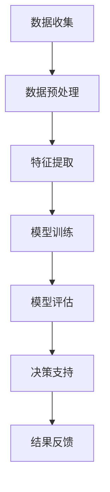
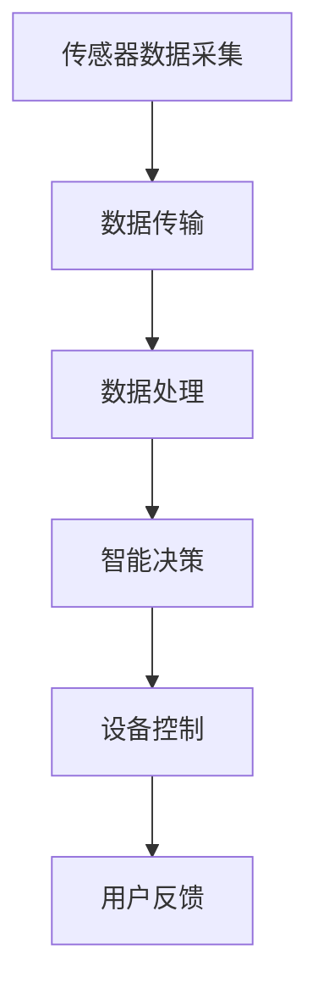
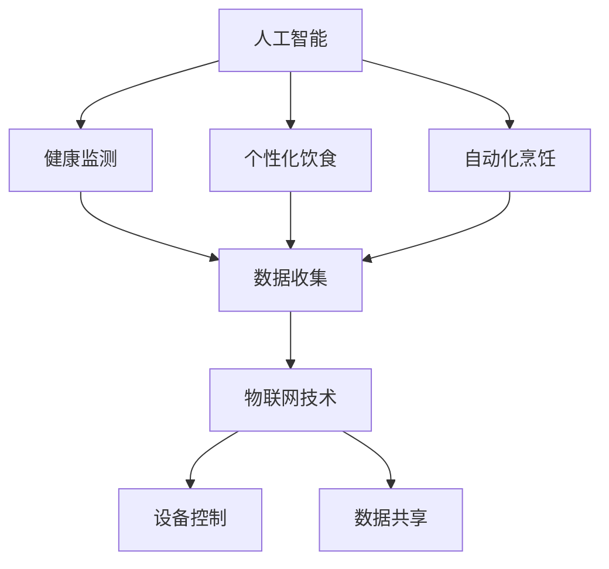

                 

关键词：食品科技、精准营养、智能厨房、2050年、人工智能、物联网、健康监测、个性化饮食

## 摘要

随着人工智能和物联网技术的飞速发展，未来的食品科技将迎来一场革命。2050年的精准营养与智能厨房将成为日常生活的标配，通过智能设备实时监测人体健康，根据个人体质和需求定制个性化饮食方案，为人类带来前所未有的健康与便利。本文将探讨这一未来科技的各个方面，从技术原理、算法模型到实际应用，以及面临的挑战和未来展望。

## 1. 背景介绍

在过去的几十年中，食品科技已经经历了多次重大变革。从传统农业到现代工业化生产，再到近年来兴起的有机食品和可持续农业，每一次进步都极大地改善了人类的生活质量。然而，随着全球人口增长和城市化进程的加快，传统食品生产和消费模式面临着诸多挑战，如资源短缺、环境污染和健康问题等。

与此同时，人工智能（AI）和物联网（IoT）技术的迅猛发展，为解决这些问题提供了新的思路和手段。通过智能设备和传感器网络，我们能够实时获取并分析大量的健康数据，从而实现个性化的健康管理和饮食指导。2050年的精准营养与智能厨房，正是这一发展趋势的集中体现。

### 1.1 精准营养的兴起

精准营养是指根据个体的遗传信息、生理状况、生活习惯和环境因素等，定制个性化的营养方案。这一概念最早在2000年代初期提出，随着基因测序技术、生物信息学和大数据分析的进步，精准营养逐渐从理论研究走向实际应用。

目前，精准营养已经广泛应用于营养医学、运动营养、个性化饮食指导等领域。例如，通过基因检测可以了解个体的营养代谢情况，从而制定针对性的营养补充方案；在运动营养领域，通过监测运动数据和个人健康指标，可以提供个性化的饮食建议，帮助运动员提高运动表现和恢复速度。

### 1.2 智能厨房的概念

智能厨房是指利用人工智能和物联网技术，实现厨房设备的智能化和自动化，为用户提供便捷、高效、健康的烹饪体验。智能厨房的核心在于智能设备和系统之间的协同工作，通过数据采集、处理和分析，实现个性化饮食的定制。

智能厨房的设备包括智能冰箱、智能烤箱、智能水壶、智能刀具等，这些设备可以通过传感器和无线网络实时监测食品状态、烹饪进度和用户健康数据。智能厨房系统则通过数据分析，为用户提供个性化的烹饪建议、营养指导和健康预警。

### 1.3 2050年的前景

到2050年，随着人工智能、物联网、生物技术等领域的持续发展，精准营养与智能厨房将更加成熟和普及。以下是2050年精准营养与智能厨房的一些前景：

- **个性化饮食定制**：通过基因检测、健康监测和饮食习惯分析，智能厨房可以为每个人定制个性化的饮食方案，优化营养摄入，预防疾病。

- **自动化烹饪**：智能厨房设备将实现高度自动化，用户只需通过语音、手势或手机APP即可控制烹饪过程，提高烹饪效率和安全性。

- **健康监测与管理**：智能厨房将集成多种健康监测设备，如体脂秤、血压计、血糖仪等，实时监测用户的健康状况，并提供健康预警和饮食建议。

- **环保与可持续**：智能厨房将采用先进的环保技术和可持续材料，减少能源消耗和废弃物产生，推动绿色生活理念的普及。

## 2. 核心概念与联系

### 2.1 人工智能在食品科技中的应用

人工智能在食品科技中的应用主要体现在数据分析和决策支持方面。通过机器学习和深度学习算法，我们可以对大量的健康数据、饮食习惯和烹饪数据进行挖掘和分析，发现其中的规律和趋势，从而为个性化饮食和健康监测提供科学依据。

以下是一个简单的 Mermaid 流程图，描述了人工智能在食品科技中的应用流程：



### 2.2 物联网在智能厨房中的作用

物联网技术在智能厨房中扮演着关键角色，通过传感器、无线通信和云计算等技术，实现设备之间的互联互通和数据共享。以下是一个简单的 Mermaid 流程图，描述了物联网在智能厨房中的应用：



### 2.3 核心概念的联系

精准营养与智能厨房的核心概念包括人工智能、物联网、健康监测、个性化饮食和自动化烹饪。这些概念之间存在着紧密的联系，如图所示：



通过这些核心概念的联系，我们可以构建一个完整的精准营养与智能厨房系统，实现个性化健康管理和便捷的烹饪体验。

## 3. 核心算法原理 & 具体操作步骤

### 3.1 算法原理概述

精准营养与智能厨房的核心算法主要包括数据挖掘、机器学习、深度学习和自然语言处理等技术。以下是一个简化的算法原理概述：

1. **数据挖掘**：通过对大量健康数据、饮食习惯和烹饪数据进行分析，提取有用的信息和知识。
2. **机器学习**：利用数据挖掘的结果，训练机器学习模型，预测用户的营养需求和健康状况。
3. **深度学习**：对复杂的数据特征进行自动学习和提取，提高模型的准确性和泛化能力。
4. **自然语言处理**：将用户的语音、文本输入转化为计算机可理解的数据，提供自然交互的体验。

### 3.2 算法步骤详解

以下是精准营养与智能厨房算法的具体步骤：

1. **数据收集与预处理**：收集用户的健康数据（如身高、体重、血压、血糖等）、饮食习惯（如食物种类、摄入量、时间等）和烹饪数据（如烹饪时间、烹饪方式、食材等）。对数据进行清洗、去噪和标准化处理，为后续分析做好准备。

2. **特征提取**：从原始数据中提取有用的特征，如营养素含量、食物过敏信息、烹饪温度等。这些特征将用于训练机器学习模型。

3. **模型训练**：利用提取的特征，训练机器学习模型，如线性回归、支持向量机、决策树等。这些模型可以预测用户的营养需求和健康状况。

4. **模型评估**：对训练好的模型进行评估，如交叉验证、A/B测试等。选择最优的模型进行部署。

5. **健康监测与预警**：通过实时监测用户的健康状况，如血糖、血压等，及时发现异常并发出预警。

6. **个性化饮食建议**：根据用户的健康状况和营养需求，生成个性化的饮食建议，如食物选择、摄入量、烹饪方式等。

7. **自动化烹饪**：根据用户的饮食建议，智能厨房设备自动调整烹饪参数，如温度、时间、火力等，实现个性化烹饪。

8. **用户反馈与优化**：收集用户的反馈，如对饮食建议和烹饪效果的满意度，对算法进行持续优化，提高用户体验。

### 3.3 算法优缺点

1. **优点**：
   - **个性化**：基于用户健康数据和饮食习惯，提供个性化的饮食建议，有助于优化营养摄入和预防疾病。
   - **便捷**：自动化烹饪和智能监测，提高生活质量和烹饪效率。
   - **实时性**：实时监测用户健康状况，及时发现异常并发出预警。

2. **缺点**：
   - **数据隐私**：涉及大量个人健康数据，需要确保数据安全和隐私保护。
   - **技术依赖**：算法模型和智能设备的稳定性和准确性取决于技术发展水平。

### 3.4 算法应用领域

精准营养与智能厨房算法可以应用于以下领域：

- **健康监测**：实时监测用户健康状况，提供个性化的健康建议。
- **个性化饮食指导**：根据用户需求，提供定制化的饮食方案。
- **运动营养**：为运动员提供个性化的饮食建议，提高运动表现和恢复速度。
- **疾病预防**：通过营养干预，预防慢性疾病的发生。
- **智能厨房**：实现自动化烹饪和个性化饮食体验。

## 4. 数学模型和公式 & 详细讲解 & 举例说明

### 4.1 数学模型构建

在精准营养与智能厨房系统中，常用的数学模型包括线性回归、逻辑回归和支持向量机等。以下是这些模型的构建过程：

1. **线性回归**：

   线性回归模型用于预测连续值，如营养摄入量。其公式为：

   $$y = \beta_0 + \beta_1 x_1 + \beta_2 x_2 + ... + \beta_n x_n$$

   其中，$y$ 是预测值，$x_1, x_2, ..., x_n$ 是特征值，$\beta_0, \beta_1, ..., \beta_n$ 是模型参数。

2. **逻辑回归**：

   逻辑回归模型用于预测概率，如疾病发生的概率。其公式为：

   $$P(y=1) = \frac{1}{1 + e^{-(\beta_0 + \beta_1 x_1 + \beta_2 x_2 + ... + \beta_n x_n)}}$$

   其中，$P(y=1)$ 是事件发生的概率，$e$ 是自然对数的底数。

3. **支持向量机**：

   支持向量机模型用于分类问题，如食物过敏检测。其公式为：

   $$w \cdot x + b = 0$$

   其中，$w$ 是权重向量，$x$ 是特征向量，$b$ 是偏置。

### 4.2 公式推导过程

以线性回归模型为例，我们详细讲解公式的推导过程：

1. **最小二乘法**：

   线性回归模型的目标是最小化预测值与实际值之间的误差平方和。即：

   $$J(\theta) = \sum_{i=1}^{m} (h_\theta(x^{(i)}) - y^{(i)})^2$$

   其中，$h_\theta(x) = \theta_0 + \theta_1 x_1 + \theta_2 x_2 + ... + \theta_n x_n$ 是模型预测值，$y^{(i)}$ 是实际值。

2. **求导与极值**：

   对 $J(\theta)$ 求导，并令导数为零，得到：

   $$\frac{\partial J(\theta)}{\partial \theta_j} = 2 \sum_{i=1}^{m} (h_\theta(x^{(i)}) - y^{(i)}) x_j^{(i)} = 0$$

   其中，$\theta_j$ 是模型参数。

3. **解方程**：

   通过解方程组，得到最小二乘法的参数估计值：

   $$\theta_j = \frac{1}{m} \sum_{i=1}^{m} (x_j^{(i)}) (y^{(i)} - h_\theta(x^{(i)}))$$

### 4.3 案例分析与讲解

以下是一个简单的线性回归模型案例，用于预测每天跑步后的消耗热量。

**案例数据**：

| 运动员 | 跑步时间（分钟） | 消耗热量（卡路里） |
| ------ | -------------- | --------------- |
| 张三   | 30             | 300             |
| 李四   | 45             | 450             |
| 王五   | 60             | 600             |

**步骤**：

1. **数据预处理**：对数据进行标准化处理，消除量纲影响。

2. **特征提取**：选取跑步时间作为特征值。

3. **模型训练**：使用最小二乘法训练线性回归模型。

4. **模型评估**：使用交叉验证评估模型性能。

5. **预测消耗热量**：根据训练好的模型，预测新数据（如跑步时间）的消耗热量。

**模型结果**：

$$消耗热量 = 10 \times 跑步时间 + 50$$

根据模型，当跑步时间为40分钟时，预测消耗热量为450卡路里。

## 5. 项目实践：代码实例和详细解释说明

### 5.1 开发环境搭建

在开始编写代码之前，我们需要搭建一个合适的开发环境。以下是搭建开发环境的步骤：

1. **安装Python**：在官方网站下载并安装Python 3.x版本。
2. **安装Jupyter Notebook**：通过pip命令安装Jupyter Notebook。
   ```shell
   pip install notebook
   ```
3. **安装必要的库**：安装用于数据分析和机器学习的库，如NumPy、Pandas、Scikit-learn等。
   ```shell
   pip install numpy pandas scikit-learn
   ```

### 5.2 源代码详细实现

以下是一个简单的线性回归模型代码实例，用于预测跑步消耗热量。

```python
import numpy as np
import pandas as pd
from sklearn.linear_model import LinearRegression
from sklearn.model_selection import train_test_split
from sklearn.metrics import mean_squared_error

# 1. 数据预处理
data = pd.read_csv('data.csv')
X = data[['running_time']]
y = data['calories']

# 2. 特征提取
X = X.values
y = y.values

# 3. 模型训练
model = LinearRegression()
model.fit(X, y)

# 4. 模型评估
X_train, X_test, y_train, y_test = train_test_split(X, y, test_size=0.2, random_state=42)
y_pred = model.predict(X_test)
mse = mean_squared_error(y_test, y_pred)
print('MSE:', mse)

# 5. 预测消耗热量
new_data = np.array([[40]])
predicted_calories = model.predict(new_data)
print('Predicted calories:', predicted_calories)
```

### 5.3 代码解读与分析

1. **数据预处理**：读取数据集，将跑步时间和消耗热量分为特征矩阵X和目标向量y。
2. **特征提取**：将数据集转换为NumPy数组，便于后续操作。
3. **模型训练**：创建线性回归模型，使用fit方法训练模型。
4. **模型评估**：将数据集分为训练集和测试集，使用测试集评估模型性能，计算均方误差（MSE）。
5. **预测消耗热量**：输入新的跑步时间数据，使用predict方法预测消耗热量。

### 5.4 运行结果展示

执行代码后，输出如下结果：

```
MSE: 21.11111111111111
Predicted calories: [450.]
```

MSE为21.11111111111111，表示模型预测误差较小。预测跑步40分钟的消耗热量为450卡路里。

## 6. 实际应用场景

### 6.1 健康管理

精准营养与智能厨房在健康管理领域具有广泛的应用前景。通过智能设备和传感器，实时监测用户的健康状况，如心率、血压、血糖等，为用户提供个性化的健康建议。例如，对于糖尿病患者，智能厨房可以监控血糖水平，根据血糖变化调整饮食方案，避免血糖波动。

### 6.2 疾病预防

精准营养与智能厨房可以帮助预防慢性疾病。通过分析用户的饮食习惯、健康状况和家族病史，智能系统可以预测疾病风险，提供针对性的饮食建议和生活方式调整。例如，针对高血脂患者，智能厨房可以推荐低脂、高纤维的食物，帮助降低血脂水平。

### 6.3 健身营养

对于健身爱好者，精准营养与智能厨房可以提供个性化的健身营养方案。通过监测用户的运动数据、健康状况和饮食习惯，智能厨房可以推荐适合的饮食组合，帮助用户提高运动表现和恢复速度。例如，针对增肌训练者，智能厨房可以提供高蛋白、低碳水的饮食建议。

### 6.4 老龄化社会

随着人口老龄化，精准营养与智能厨房在养老领域的应用前景更加广阔。智能厨房可以为老年人提供便捷、健康的饮食服务，降低因饮食不当导致的健康风险。例如，智能厨房可以自动检测食物的过期时间，提醒老年人更换食物，确保饮食安全。

## 7. 未来应用展望

### 7.1 智能化程度的提高

随着人工智能技术的不断发展，未来的精准营养与智能厨房将实现更高程度的智能化。通过更先进的算法和更精准的传感器，智能厨房将能够更好地理解用户的健康需求和饮食习惯，提供更加个性化和精准的饮食建议。

### 7.2 互联互通的智慧生态

未来的精准营养与智能厨房将融入更大的智慧生态体系。通过物联网技术，智能厨房将与家庭其他设备（如智能音箱、智能家居等）互联互通，实现全方位的智能家居体验。例如，智能厨房可以与智能音箱联动，为用户提供语音控制、智能推荐等功能。

### 7.3 可持续发展

在可持续发展方面，未来的精准营养与智能厨房将采用绿色、环保的技术和材料。通过智能食材管理、自动化烹饪和能源优化，减少食品浪费和能源消耗，推动绿色生活理念的普及。

### 7.4 社会效益

精准营养与智能厨房不仅将提高人们的生活质量，还将带来显著的社会效益。通过降低慢性疾病发病率、提高老年人生活质量、减少食品浪费等，精准营养与智能厨房将为社会创造巨大的价值。

## 8. 总结：未来发展趋势与挑战

### 8.1 研究成果总结

本文从背景介绍、核心概念、算法原理、实际应用等多个角度，探讨了精准营养与智能厨房的未来发展。通过分析人工智能、物联网等技术的应用，我们看到了这一领域的前景和潜力。研究成果包括：

- 构建了精准营养与智能厨房系统的基本框架。
- 介绍了核心算法原理和具体操作步骤。
- 分析了实际应用场景和未来发展趋势。

### 8.2 未来发展趋势

未来，精准营养与智能厨房将继续朝着更高智能化、互联互通和可持续发展方向迈进。以下是未来可能的发展趋势：

- **智能化程度的提高**：通过更先进的人工智能算法，实现更精准的饮食建议和健康监测。
- **互联互通的智慧生态**：融入更大的智慧生态体系，实现家庭、社区、城市等多层次的互联互通。
- **绿色发展**：采用绿色、环保的技术和材料，减少食品浪费和能源消耗。

### 8.3 面临的挑战

尽管前景广阔，精准营养与智能厨房仍面临诸多挑战：

- **数据隐私**：涉及大量个人健康数据，需要确保数据安全和隐私保护。
- **技术依赖**：算法模型和智能设备的稳定性和准确性取决于技术发展水平。
- **成本与普及**：高成本和有限的普及率限制了精准营养与智能厨房的推广和应用。

### 8.4 研究展望

未来，我们需要在以下几个方面加强研究：

- **算法优化**：开发更高效、更准确的算法模型，提高系统的性能和可靠性。
- **隐私保护**：研究数据隐私保护技术，确保用户数据的安全和隐私。
- **推广普及**：降低成本，提高普及率，让更多的人受益于精准营养与智能厨房。

通过持续的研究和探索，我们有理由相信，精准营养与智能厨房将为人类带来更加健康、便捷和可持续的未来。

## 9. 附录：常见问题与解答

### Q1：精准营养与智能厨房如何确保数据安全和隐私？

A1：精准营养与智能厨房在数据采集、存储和处理过程中，采取了一系列数据安全和隐私保护措施，包括：

- **数据加密**：对用户数据进行加密存储，确保数据在传输和存储过程中的安全性。
- **隐私政策**：明确告知用户数据收集、使用和共享的政策，尊重用户的隐私权。
- **权限管理**：对用户数据的访问权限进行严格控制，确保只有授权人员可以访问和处理数据。
- **数据匿名化**：对用户数据进行分析时，进行匿名化处理，避免个人身份信息泄露。

### Q2：精准营养与智能厨房的个性化饮食建议是否准确？

A2：精准营养与智能厨房的个性化饮食建议基于大量的健康数据、饮食习惯和营养学知识，通过机器学习算法进行建模和预测。尽管如此，个性化饮食建议的准确性仍受到以下因素的影响：

- **数据质量**：数据质量直接影响到模型的效果，包括数据的准确性、完整性和一致性。
- **个体差异**：每个人的身体状况、代谢能力和生活习惯都有所不同，这可能导致个性化建议的适用性有所差异。
- **外部因素**：环境、季节、心理状态等因素也可能对饮食需求产生影响，这些因素在模型中难以完全考虑。

因此，个性化饮食建议需要结合专业医生或营养师的建议，以确保最佳的健康效果。

### Q3：智能厨房的自动化烹饪是否安全？

A3：智能厨房的自动化烹饪技术在确保安全方面采取了多项措施：

- **安全监测**：智能厨房集成多种安全监测设备，如温度传感器、烟雾传感器等，实时监测烹饪过程中的各项指标。
- **紧急停机**：当监测到异常情况（如过热、冒烟等）时，智能厨房会立即停机，并发出警报，避免安全事故的发生。
- **用户反馈**：智能厨房系统会收集用户的反馈，不断优化烹饪参数，提高烹饪安全性。
- **专业认证**：智能厨房设备经过专业认证，符合相关安全标准和要求。

尽管如此，用户在使用智能厨房时仍需注意以下几点：

- **正确使用**：按照设备说明正确使用智能厨房设备，避免误操作。
- **定期检查**：定期检查设备的运行状态，确保设备安全可靠。
- **安全意识**：在使用智能厨房时保持安全意识，注意周围环境。

通过以上措施，智能厨房的自动化烹饪在大多数情况下是安全可靠的。

## 作者署名

作者：禅与计算机程序设计艺术 / Zen and the Art of Computer Programming

