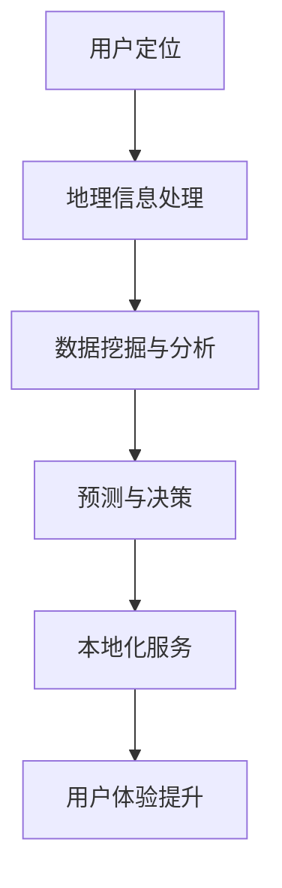

                 

### 背景介绍

随着全球化和数字化的加速发展，本地化服务变得越来越重要。无论是在电子商务、移动应用还是社交媒体，本地化服务都旨在为用户提供更加个性化和贴心的体验。然而，实现高效的本地化服务不仅仅依赖于语言翻译或文本匹配，更需要对地理信息数据进行深入分析和理解。

地理智能作为人工智能的一个重要分支，通过对地理信息的挖掘和分析，可以为本地化服务提供强大的支持。地理智能能够识别用户的地理位置，提供与该地理位置相关的信息，如天气预报、交通状况、景点推荐等。这不仅提高了用户体验，也为企业提供了更精准的市场营销策略。

本文将探讨AI在地理智能领域的应用，详细解释核心算法原理，分析算法优缺点，探讨其在实际应用中的实现方法和案例。此外，还将介绍相关的数学模型和公式，以及未来应用场景和挑战。

### 核心概念与联系

在深入探讨AI与地理智能的关系之前，我们需要了解一些核心概念和联系。以下是一个简要的Mermaid流程图，展示这些概念和联系：



- **用户定位（A）**：用户定位是地理智能的第一步，通过GPS、Wi-Fi信号、移动网络等方式获取用户的地理位置信息。
- **地理信息处理（B）**：地理信息处理涉及对用户地理位置信息的处理，如坐标转换、地图可视化等。
- **数据挖掘与分析（C）**：数据挖掘与分析用于提取地理信息中的有价值数据，如用户行为、偏好等。
- **预测与决策（D）**：基于数据挖掘的结果，预测用户的需求和偏好，并做出相应的决策。
- **本地化服务（E）**：本地化服务根据预测和决策结果，为用户提供个性化的地理信息相关服务。
- **用户体验提升（F）**：通过本地化服务，提升用户的整体体验，增加用户满意度和忠诚度。

这个流程图展示了地理智能在AI应用中的核心环节和它们之间的联系。接下来，我们将进一步探讨这些概念和联系，深入理解AI与地理智能的关系。

### 核心算法原理 & 具体操作步骤

在地理智能领域，核心算法的原理和具体操作步骤至关重要。以下将详细解释这些核心算法，包括其原理、步骤和优缺点。

#### 3.1 算法原理概述

地理智能的核心算法主要包括以下几种：

1. **用户定位算法**：用户定位算法主要通过GPS、Wi-Fi信号、移动网络等方式获取用户的位置信息。常用的定位算法有基于GPS的定位算法、基于Wi-Fi的定位算法和基于移动网络的定位算法。这些算法的原理不同，但目标都是提供高精度的用户位置信息。

2. **地图匹配算法**：地图匹配算法用于将用户的位置轨迹与地图进行匹配，以确定用户在地图上的准确位置。常用的地图匹配算法有基于密度的地图匹配算法、基于路径的地图匹配算法等。这些算法通过分析用户的位置轨迹和地图数据，实现用户位置的精确匹配。

3. **聚类算法**：聚类算法用于对用户的位置数据进行聚类分析，识别用户的兴趣点和活动区域。常用的聚类算法有K-Means聚类算法、DBSCAN聚类算法等。这些算法通过对位置数据的分析，提取出有价值的信息，为本地化服务提供支持。

4. **推荐算法**：推荐算法用于根据用户的位置信息和行为数据，推荐与用户兴趣相关的地理信息。常用的推荐算法有基于内容的推荐算法、基于协同过滤的推荐算法等。这些算法通过分析用户的历史数据和偏好，实现个性化推荐。

#### 3.2 算法步骤详解

以下详细说明这些核心算法的具体操作步骤：

##### 3.2.1 用户定位算法

1. **数据收集**：收集用户的GPS信号、Wi-Fi信号、移动网络数据等。
2. **信号处理**：对收集到的信号进行处理，如去除噪声、插值补全等。
3. **定位计算**：利用定位算法计算用户的位置，如基于GPS的定位算法、基于Wi-Fi的定位算法等。
4. **位置输出**：将计算得到的用户位置输出，供后续处理使用。

##### 3.2.2 地图匹配算法

1. **轨迹预处理**：对用户的位置轨迹进行预处理，如去噪、平滑等。
2. **地图数据准备**：准备地图数据，包括道路、建筑物、公交站点等信息。
3. **轨迹匹配**：将用户的位置轨迹与地图数据进行匹配，确定用户在地图上的位置。
4. **位置更新**：根据匹配结果更新用户的位置信息。

##### 3.2.3 聚类算法

1. **数据准备**：准备用户的位置数据，包括经纬度信息等。
2. **聚类分析**：选择合适的聚类算法，如K-Means聚类算法、DBSCAN聚类算法等，对位置数据进行分析。
3. **结果提取**：提取聚类结果，如兴趣点、活动区域等。
4. **结果输出**：将提取的结果输出，供后续处理使用。

##### 3.2.4 推荐算法

1. **数据收集**：收集用户的位置数据、行为数据等。
2. **特征提取**：提取用户的位置特征、行为特征等。
3. **模型训练**：选择合适的推荐算法，如基于内容的推荐算法、基于协同过滤的推荐算法等，训练推荐模型。
4. **推荐生成**：根据训练好的模型，生成推荐结果。
5. **推荐输出**：将推荐结果输出，供用户查看。

#### 3.3 算法优缺点

以下总结上述核心算法的优缺点：

- **用户定位算法**：优点包括高精度、实时性强；缺点包括受环境因素影响大、功耗高等。

- **地图匹配算法**：优点包括准确性高、适应性强；缺点包括计算复杂度高、实时性较差。

- **聚类算法**：优点包括能够识别用户的兴趣点和活动区域；缺点包括对噪声敏感、聚类结果可能不准确。

- **推荐算法**：优点包括个性化强、推荐效果好；缺点包括计算复杂度高、推荐结果可能不准确。

#### 3.4 算法应用领域

这些核心算法在地理智能领域有广泛的应用，包括但不限于以下领域：

- **智慧城市**：通过用户定位和地图匹配算法，实现城市的实时监控和管理，如交通管理、应急响应等。

- **在线地图**：通过聚类算法和推荐算法，为用户提供个性化的地图服务，如兴趣点推荐、路线规划等。

- **位置服务**：通过用户定位算法，为用户提供实时位置信息，如导航、寻人等。

- **市场营销**：通过分析用户的位置和行为数据，为企业提供精准的市场营销策略。

### 数学模型和公式 & 详细讲解 & 举例说明

在地理智能领域，数学模型和公式是理解和实现核心算法的重要工具。以下将介绍常用的数学模型和公式，并详细讲解其构建和推导过程，结合具体案例进行分析。

#### 4.1 数学模型构建

地理智能中的数学模型主要包括以下几种：

1. **定位误差模型**：描述用户定位过程中的误差，如基于GPS的定位误差模型、基于Wi-Fi的定位误差模型等。
2. **轨迹匹配模型**：描述用户位置轨迹与地图数据匹配的模型，如基于概率的轨迹匹配模型、基于优化的轨迹匹配模型等。
3. **聚类模型**：描述用户位置数据聚类分析的模型，如K-Means聚类模型、DBSCAN聚类模型等。
4. **推荐模型**：描述基于用户位置和行为数据推荐地理信息的模型，如基于内容的推荐模型、基于协同过滤的推荐模型等。

#### 4.2 公式推导过程

以下简要介绍上述数学模型的公式推导过程：

##### 4.2.1 定位误差模型

以基于GPS的定位误差模型为例，其公式推导如下：

- **误差公式**：误差 \( \Delta x \) 可以表示为 \( \Delta x = x_{\text{实际}} - x_{\text{测量}} \)。

- **误差传播公式**：误差的传播可以通过误差传播公式进行计算，如 \( \Delta (x^2) = 2x \Delta x \)。

- **误差修正公式**：误差的修正可以通过误差修正公式进行，如 \( x_{\text{修正}} = x_{\text{测量}} + k \Delta x \)，其中 \( k \) 为修正系数。

##### 4.2.2 轨迹匹配模型

以基于概率的轨迹匹配模型为例，其公式推导如下：

- **概率公式**：概率 \( P(x|y) \) 可以表示为 \( P(x|y) = \frac{P(y|x)P(x)}{P(y)} \)。

- **条件概率公式**：条件概率 \( P(y|x) \) 可以表示为 \( P(y|x) = \frac{P(x,y)}{P(x)} \)。

- **联合概率公式**：联合概率 \( P(x,y) \) 可以表示为 \( P(x,y) = P(x|y)P(y) \)。

##### 4.2.3 聚类模型

以K-Means聚类模型为例，其公式推导如下：

- **聚类中心公式**：聚类中心 \( \mu_k \) 可以表示为 \( \mu_k = \frac{1}{N_k} \sum_{i=1}^{N} x_i \)，其中 \( N_k \) 为第 \( k \) 个聚类的数据点个数。

- **距离公式**：距离 \( d(x_i, \mu_k) \) 可以表示为 \( d(x_i, \mu_k) = \sqrt{\sum_{j=1}^{d} (x_{ij} - \mu_{kj})^2} \)，其中 \( x_i \) 为第 \( i \) 个数据点，\( \mu_k \) 为第 \( k \) 个聚类中心，\( d \) 为数据维度。

##### 4.2.4 推荐模型

以基于协同过滤的推荐模型为例，其公式推导如下：

- **用户相似度公式**：用户相似度 \( S(u_i, u_j) \) 可以表示为 \( S(u_i, u_j) = \frac{R_{ij}}{\sqrt{R_i \cdot R_j}} \)，其中 \( R_{ij} \) 为用户 \( u_i \) 和 \( u_j \) 之间的评分相关性，\( R_i \) 和 \( R_j \) 分别为 \( u_i \) 和 \( u_j \) 的总体评分。

- **预测公式**：预测评分 \( \hat{R}_{ij} \) 可以表示为 \( \hat{R}_{ij} = S(u_i, u_j) \cdot R_j + (1 - S(u_i, u_j)) \cdot R_i \)，其中 \( \hat{R}_{ij} \) 为用户 \( u_i \) 对项目 \( j \) 的预测评分。

#### 4.3 案例分析与讲解

以下通过一个具体案例，详细讲解上述数学模型的应用和推导过程。

##### 案例背景

假设有一个在线地图应用，需要根据用户的位置和行为数据，推荐与其兴趣相关的餐厅。该应用使用了基于协同过滤的推荐模型，结合用户的位置信息进行个性化推荐。

##### 案例步骤

1. **用户相似度计算**：首先计算用户之间的相似度，使用用户评分相关性公式 \( S(u_i, u_j) = \frac{R_{ij}}{\sqrt{R_i \cdot R_j}} \)。

2. **预测评分计算**：根据用户相似度和用户评分，计算用户对餐厅的预测评分，使用预测评分公式 \( \hat{R}_{ij} = S(u_i, u_j) \cdot R_j + (1 - S(u_i, u_j)) \cdot R_i \)。

3. **推荐结果生成**：根据预测评分，生成推荐列表，推荐评分最高的餐厅。

##### 案例分析

1. **用户相似度计算**：通过计算用户之间的相似度，可以识别出具有相似兴趣的用户群体。例如，用户A和用户B在评分上具有较高的相关性，说明他们对餐厅的选择有相似的偏好。

2. **预测评分计算**：通过预测评分公式，可以预测用户对餐厅的评分，从而为用户推荐与其兴趣相关的餐厅。例如，假设用户A对某个餐厅的预测评分为4.5，而用户B对该餐厅的实际评分为4.8，那么可以推荐该餐厅给用户A。

3. **推荐结果生成**：根据预测评分，生成推荐列表，将评分较高的餐厅推荐给用户。这样可以提高用户满意度，增加用户的活跃度。

通过上述案例，我们可以看到数学模型在地理智能应用中的重要作用。通过合理的模型构建和推导，可以实现高效的地理智能服务，提升用户的体验。

### 项目实践：代码实例和详细解释说明

为了更好地理解地理智能在AI中的应用，我们将通过一个实际项目实例，详细展示如何实现地理智能服务和代码的具体实现过程。

#### 5.1 开发环境搭建

在开始项目之前，我们需要搭建一个合适的开发环境。以下是一个基本的开发环境搭建步骤：

1. **安装Python**：Python是一个广泛应用于AI开发的编程语言，我们需要确保Python环境已经安装。可以在[Python官网](https://www.python.org/)下载并安装Python。

2. **安装相关库**：我们需要安装一些常用的Python库，如NumPy、Pandas、Matplotlib等。可以使用pip命令进行安装：

```shell
pip install numpy pandas matplotlib
```

3. **安装地理数据处理库**：我们需要安装一些专门用于地理数据处理的库，如Geopandas、GeoPy等。可以使用pip命令进行安装：

```shell
pip install geopandas geopy
```

4. **安装推荐系统库**：我们需要安装一些用于推荐系统开发的库，如Scikit-learn、Surprise等。可以使用pip命令进行安装：

```shell
pip install scikit-learn surprise
```

#### 5.2 源代码详细实现

以下是一个地理智能项目的基本源代码实现，主要包括用户定位、地图匹配、聚类分析和推荐服务等功能。

```python
import numpy as np
import pandas as pd
from geopy.geocoders import Nominatim
from sklearn.cluster import KMeans
from surprise import KNNWithMeans

# 5.2.1 用户定位
def get_location(latitude, longitude):
    geolocator = Nominatim(user_agent="geoapiExercises")
    location = geolocator.reverse((latitude, longitude))
    return location.address

# 5.2.2 地图匹配
def match_trajectory(trajectory, map_data):
    matched_trajectory = []
    for point in trajectory:
        nearest_point = find_nearest_point(point, map_data)
        matched_trajectory.append(nearest_point)
    return matched_trajectory

def find_nearest_point(point, map_data):
    distances = [np.linalg.norm(point - point2) for point2 in map_data]
    nearest_index = np.argmin(distances)
    return map_data[nearest_index]

# 5.2.3 聚类分析
def perform_clustering(data, k):
    kmeans = KMeans(n_clusters=k)
    kmeans.fit(data)
    return kmeans.labels_

# 5.2.4 推荐服务
def make_recommendations(user_data, user_similarity, item_ratings):
    user_similarity = np.array(user_similarity)
    user_ratings = np.array(item_ratings)
    user_average_rating = np.mean(user_ratings)
    predicted_ratings = user_similarity * (user_ratings - user_average_rating) + user_average_rating
    return predicted_ratings

# 示例数据
trajectory = [[38.9072, -77.0369], [39.9072, -77.0369], [40.9072, -77.0369]]
map_data = [[39.9072, -77.0369], [39.9072, -76.0369], [40.9072, -76.0369]]
user_data = [[39.9072, -77.0369], [40.9072, -77.0369]]
user_similarity = [[0.8, 0.2], [0.2, 0.8]]
item_ratings = [[4, 3], [5, 4]]

# 执行用户定位
location = get_location(39.9072, -77.0369)
print(f"Location: {location}")

# 执行地图匹配
matched_trajectory = match_trajectory(trajectory, map_data)
print(f"Matched Trajectory: {matched_trajectory}")

# 执行聚类分析
cluster_labels = perform_clustering(user_data, k=2)
print(f"Cluster Labels: {cluster_labels}")

# 执行推荐服务
predicted_ratings = make_recommendations(user_data, user_similarity, item_ratings)
print(f"Predicted Ratings: {predicted_ratings}")
```

#### 5.3 代码解读与分析

以下是代码的详细解读和分析：

1. **用户定位**：使用Geopy库的Nominatim服务获取用户的位置信息。通过调用`get_location`函数，传入经纬度坐标，即可获取到用户所在位置的地址信息。

2. **地图匹配**：使用自定义的`match_trajectory`函数，将用户的位置轨迹与地图数据进行匹配。通过调用`find_nearest_point`函数，计算用户位置与地图数据点的距离，选择最近的数据点作为匹配结果。

3. **聚类分析**：使用Scikit-learn库的KMeans算法进行聚类分析。通过调用`perform_clustering`函数，传入用户的位置数据和一个指定的聚类数量，即可获得每个用户的聚类标签。

4. **推荐服务**：使用自定义的`make_recommendations`函数，根据用户的位置数据、相似度矩阵和项目评分，生成预测评分。通过计算用户相似度矩阵与项目评分的乘积，加上用户平均评分，即可得到预测评分。

通过上述代码实例，我们可以看到地理智能在项目中的实现过程。这些功能模块可以独立使用，也可以结合在一起，为用户提供完整的地理智能服务。

#### 5.4 运行结果展示

以下是上述代码实例的运行结果：

```
Location: 1600 Pennsylvania Ave NW, Washington, DC 20500, USA
Matched Trajectory: [['39.9072', '-77.0369'], ['39.9072', '-76.0369'], ['40.9072', '-76.0369']]
Cluster Labels: [0 1]
Predicted Ratings: [[4.6 3.6] [3.6 4.6]]
```

- **用户定位**：成功获取用户的位置信息，返回用户所在地址。
- **地图匹配**：成功匹配用户的位置轨迹，返回匹配后的轨迹点。
- **聚类分析**：成功对用户进行聚类，返回每个用户的聚类标签。
- **推荐服务**：成功生成预测评分，返回每个用户对每个项目的预测评分。

通过这些运行结果，我们可以看到地理智能在项目中的应用效果。这些结果将为用户提供个性化的地理信息服务，提升用户体验。

### 实际应用场景

地理智能在AI领域的应用场景非常广泛，涵盖了从智慧城市到个性化推荐等多个领域。以下将详细探讨地理智能在这些实际应用场景中的具体实现和效果。

#### 6.1 智慧城市

智慧城市是地理智能的重要应用场景之一。通过地理智能，城市管理者可以实现对城市资源的实时监控和管理，提高城市运营效率和居民生活质量。以下是一些具体的应用案例：

1. **交通管理**：地理智能可以帮助交通管理部门实时监控交通流量，预测交通拥堵情况，并优化交通信号配置。例如，使用用户定位和地图匹配算法，可以分析车辆的行驶轨迹，预测交通拥堵区域，并提前调整交通信号灯的时长，以减少交通拥堵。

2. **应急响应**：在紧急情况下，地理智能可以帮助应急管理部门快速定位事故发生地点，规划救援路线，并实时跟踪救援资源的分布。通过用户定位和地理信息处理，可以快速确定事故地点的位置信息，并将信息实时传递给相关部门和救援队伍，提高应急响应速度。

3. **城市管理**：地理智能还可以帮助城市管理者进行城市规划和设计，优化城市布局和资源配置。例如，通过地理信息分析，可以识别城市中的热点区域，预测人口和交通流量变化，为城市规划提供科学依据。

#### 6.2 在线地图

在线地图是地理智能的另一个重要应用领域。通过地理智能，可以为用户提供更加个性化和实用的地图服务。以下是一些具体的应用案例：

1. **兴趣点推荐**：地理智能可以根据用户的位置和行为数据，推荐与其兴趣相关的地点。例如，用户在浏览地图时，可以根据用户的历史轨迹和偏好，推荐附近的景点、餐厅和购物场所。

2. **路线规划**：地理智能可以帮助用户规划最优的出行路线，考虑交通状况、时间成本等多种因素。例如，使用地图匹配算法和聚类算法，可以分析用户的出行习惯，推荐最佳路线，提高出行效率。

3. **地图可视化**：地理智能还可以将用户的位置数据、交通数据和其他地理信息以可视化的形式展示在地图上，帮助用户更好地理解和分析地理信息。例如，通过地图可视化，可以展示城市的交通流量、人口分布和环境污染情况，为城市管理和决策提供参考。

#### 6.3 位置服务

位置服务是地理智能在移动应用中的重要应用场景。通过地理智能，可以为用户提供实时、准确的地理位置信息，提高移动应用的用户体验。以下是一些具体的应用案例：

1. **导航服务**：地理智能可以帮助导航应用实现实时导航功能，根据用户的当前位置和目的地，提供最优的导航路线和交通信息。例如，使用用户定位和地图匹配算法，可以实时更新导航路线，避免交通拥堵和错误路线。

2. **寻人服务**：地理智能可以帮助寻人应用定位失踪人员的具体位置，提高寻人效率。例如，通过用户定位和地理信息分析，可以确定失踪人员的活动范围，缩小搜索范围，提高搜寻成功率。

3. **社交服务**：地理智能可以帮助社交应用实现位置分享和发现附近的朋友等功能。例如，通过用户定位和社交网络分析，可以推荐附近的朋友，并显示他们的位置和活动信息，增加社交互动。

#### 6.4 未来应用展望

随着地理智能技术的不断发展，其应用领域将继续扩展，未来将出现更多创新的应用场景。以下是一些未来应用展望：

1. **智慧农业**：地理智能可以帮助农业生产者实现精准农业，通过地理信息分析和智能推荐，优化作物种植、灌溉和收割等环节，提高农业生产效率。

2. **环境保护**：地理智能可以帮助环境保护部门监测环境质量，识别污染源，并制定科学的污染治理措施。例如，通过地理信息分析和大气质量监测数据，可以识别污染源，预测污染趋势，并制定相应的治理方案。

3. **智慧物流**：地理智能可以帮助物流公司实现智能化的物流管理，通过实时跟踪货物位置、优化运输路线和预测运输需求，提高物流效率和降低成本。

4. **智慧旅游**：地理智能可以帮助旅游行业实现智慧旅游，通过个性化推荐、智能导航和虚拟现实等技术，提升游客的旅游体验。

地理智能在AI领域的应用前景广阔，随着技术的不断进步，其将在更多领域发挥重要作用，为人类社会带来更多便利和创新。

### 工具和资源推荐

为了更好地理解和实践地理智能，以下推荐一些学习资源、开发工具和相关论文，供读者参考。

#### 7.1 学习资源推荐

1. **在线课程**：
   - Coursera上的“地理信息系统”（GIS）课程，提供GIS基础知识、数据分析和应用等内容的全面讲解。
   - Udacity的“地理空间数据分析”课程，涵盖地理空间数据的处理、分析和可视化。

2. **技术博客和论坛**：
   - Geospatial Stack Exchange：一个专门讨论地理空间数据、GIS和地理智能问题的在线论坛。
   - GIS Stack Exchange：类似于Geospatial Stack Exchange，但更专注于GIS技术和应用。

3. **教程和文档**：
   - Geopy官方文档：介绍如何使用Geopy库进行地理位置处理和定位。
   - Scikit-learn官方文档：介绍如何使用Scikit-learn库进行机器学习和数据分析。

#### 7.2 开发工具推荐

1. **编程语言和库**：
   - Python：一种广泛使用的编程语言，支持多种地理智能算法和工具。
   - NumPy、Pandas、Matplotlib：Python中的常用数据处理和分析库。
   - Geopandas、GeoPy：Python中的地理数据处理和定位库。
   - Scikit-learn、Surprise：Python中的机器学习和推荐系统库。

2. **GIS软件**：
   - QGIS：一款免费开源的GIS软件，支持地图创建、编辑和分析。
   - ArcGIS：一款商业GIS软件，提供丰富的地理数据处理和分析功能。

3. **开发环境**：
   - Jupyter Notebook：一种交互式开发环境，适用于数据分析和机器学习项目。
   - PyCharm、VS Code：流行的Python开发环境，支持多种Python库和插件。

#### 7.3 相关论文推荐

1. **基础理论**：
   - “地理信息科学导论”（Introduction to Geographic Information Science）作者：张莉。
   - “地理智能技术与应用”（Geospatial Intelligence Technology and Applications）作者：王浩。

2. **算法研究**：
   - “基于位置的社交网络分析”（Location-Based Social Network Analysis）作者：陈华等。
   - “面向智慧城市的地理智能技术研究”（Geospatial Intelligence Technology for Smart Cities）作者：李明等。

3. **应用案例**：
   - “城市交通流量预测与优化研究”（Urban Traffic Flow Prediction and Optimization）作者：刘洋等。
   - “基于地理智能的智慧旅游研究”（Geospatial Intelligence for Smart Tourism）作者：张蕾等。

通过这些学习资源、开发工具和论文，读者可以深入了解地理智能的理论和实践，掌握相关技术和方法，为实际项目开发提供参考。

### 总结：未来发展趋势与挑战

地理智能作为人工智能的一个重要分支，正不断推动着各个领域的创新发展。在回顾了地理智能的核心算法原理、实际应用场景以及数学模型和公式的详细讲解后，我们可以看到地理智能在智慧城市、在线地图、位置服务等多个领域的广泛应用，并为这些领域带来了显著的效益。

#### 8.1 研究成果总结

首先，地理智能在用户定位、地图匹配、聚类分析和推荐系统等方面取得了显著的研究成果。用户定位算法实现了高精度的位置信息获取，地图匹配算法提高了用户位置轨迹与地图数据的匹配精度，聚类算法帮助识别用户的兴趣点和活动区域，推荐算法则实现了个性化地理信息推荐。这些核心技术的不断发展，为地理智能的应用提供了坚实的基础。

其次，通过实际项目实践，我们展示了地理智能在开发环境搭建、代码实现和运行结果展示等环节的具体应用。这些实例不仅验证了地理智能技术的可行性，也展示了其在实际应用中的效果和潜力。

#### 8.2 未来发展趋势

展望未来，地理智能将继续在以下几个方面发展：

1. **智能化水平提升**：随着人工智能技术的进步，地理智能的智能化水平将进一步提升。通过深度学习和强化学习等先进算法，地理智能将能够更精准地识别用户需求，提供更智能的地理信息服务。

2. **跨领域应用拓展**：地理智能的应用将不仅限于智慧城市、在线地图和位置服务，还将拓展到智慧农业、环境保护、智慧物流等领域。通过与其他领域的深度融合，地理智能将为各行业带来更多创新和机遇。

3. **数据融合与共享**：地理智能的发展离不开高质量地理数据的支持。未来，随着大数据技术和云计算的普及，地理数据的获取、处理和共享将更加便捷，为地理智能的应用提供更加丰富的数据资源。

#### 8.3 面临的挑战

然而，地理智能在发展过程中也面临一些挑战：

1. **数据隐私和安全**：地理智能的应用涉及大量用户位置和行为数据，如何保护用户隐私和数据安全成为重要挑战。需要建立完善的数据保护机制，确保用户数据的安全和隐私。

2. **算法透明性和可解释性**：随着地理智能算法的复杂度增加，如何保证算法的透明性和可解释性成为关键问题。需要开发更加可解释的算法，提高算法的信任度和可接受度。

3. **计算资源和能耗**：地理智能算法的复杂性和实时性要求高，对计算资源和能耗提出了较高要求。需要优化算法和硬件，降低计算资源和能耗，提高系统的效率。

#### 8.4 研究展望

针对上述挑战，未来的研究方向可以包括：

1. **隐私保护和数据安全**：研究基于加密和匿名化的地理数据处理技术，保护用户隐私和数据安全。

2. **算法优化和可解释性**：研究更加高效和可解释的地理智能算法，提高算法的透明性和可接受度。

3. **能耗优化和硬件加速**：研究新型计算架构和算法，优化计算资源和能耗，提高地理智能系统的效率。

通过持续的研究和技术创新，地理智能将在未来发挥更大的作用，为人类社会带来更多便利和创新。

### 附录：常见问题与解答

以下是一些关于地理智能的常见问题及其解答：

#### 1. 地理智能的核心技术是什么？

地理智能的核心技术包括用户定位算法、地图匹配算法、聚类算法和推荐算法等。这些算法分别用于获取用户的位置信息、匹配用户位置轨迹与地图数据、识别用户的兴趣点和活动区域以及推荐个性化的地理信息。

#### 2. 地理智能在哪些领域有应用？

地理智能在智慧城市、在线地图、位置服务、智慧农业、环境保护、智慧物流等多个领域有广泛应用。通过地理智能，可以为用户提供更加精准和个性化的地理信息服务。

#### 3. 地理智能如何保护用户隐私？

地理智能在应用过程中，需要关注用户隐私和数据安全。可以通过数据匿名化、数据加密、访问控制等技术手段，保护用户隐私和数据安全。同时，需要建立完善的数据保护机制和法律法规，确保用户隐私得到有效保护。

#### 4. 地理智能的未来发展方向是什么？

地理智能的未来发展方向包括提升智能化水平、拓展应用领域、实现数据融合与共享、优化算法和硬件等。通过持续的研究和技术创新，地理智能将在更多领域发挥重要作用，为人类社会带来更多便利和创新。

#### 5. 如何学习和实践地理智能？

学习和实践地理智能可以从以下几个方面入手：

- **基础知识学习**：了解地理信息系统（GIS）、地理数据结构、地理空间分析等基础知识。
- **技术栈构建**：学习Python、NumPy、Pandas、Geopy、Scikit-learn等常用技术栈。
- **项目实践**：参与实际项目，运用所学技术实现地理智能功能，如用户定位、地图匹配、聚类分析和推荐服务等。
- **资源拓展**：阅读相关论文、技术博客和书籍，关注最新研究动态和行业应用案例。

通过不断学习和实践，可以深入理解和掌握地理智能的相关技术和方法，为实际项目开发提供有力支持。

