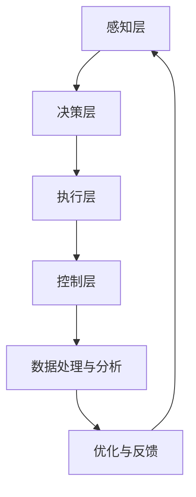

                 

关键词：机器人创业、自动化生产、人工智能、技术趋势、未来展望

## 摘要

在人工智能和自动化技术迅速发展的时代，机器人创业已成为推动产业变革的重要力量。本文将深入探讨机器人创业的背景、核心概念、算法原理、数学模型、项目实践、应用场景以及未来展望。通过详细的分析和案例研究，本文旨在为读者提供一幅自动化生产的未来蓝图，并探讨其中的发展趋势与挑战。

## 1. 背景介绍

### 1.1 人工智能与自动化技术的发展

人工智能（AI）作为计算机科学的一个重要分支，已经取得了令人瞩目的进展。深度学习、自然语言处理、计算机视觉等技术为自动化生产提供了强有力的技术支持。随着计算能力的提升和算法的进步，人工智能在工业生产、服务业、医疗等多个领域得到了广泛应用。

自动化生产则是指通过自动化设备、机器人等来代替人工完成生产任务。随着物联网、大数据、云计算等技术的融入，自动化生产系统变得更加智能化、高效化，极大地提升了生产效率和质量。

### 1.2 机器人创业的兴起

近年来，机器人创业热潮在全球范围内兴起。创业者们纷纷投身于机器人技术的研发和应用，希望通过创新的产品和服务改变传统生产模式。以下是一些推动机器人创业的因素：

- **市场需求**：随着消费者对产品质量和效率的要求不断提高，企业对自动化设备的需求日益增长。

- **技术进步**：人工智能、物联网等技术的发展为机器人创业提供了坚实的技术基础。

- **政策支持**：各国政府纷纷出台政策，鼓励科技创新和创业活动，为机器人创业提供了良好的发展环境。

- **资本涌入**：机器人创业领域的投资热潮不断升温，为创业者提供了充足的资金支持。

## 2. 核心概念与联系

### 2.1 机器人与自动化生产的关系

机器人和自动化生产密切相关。机器人是自动化生产系统中的核心组件，用于执行各种生产任务，如焊接、装配、搬运等。而自动化生产系统则是由机器人、自动化设备、控制系统等组成的整体，通过协同工作来实现生产过程的自动化。

### 2.2 机器人创业的核心概念

- **人工智能技术**：包括深度学习、计算机视觉、自然语言处理等，用于提高机器人的智能水平和自主决策能力。

- **物联网技术**：实现机器设备之间的数据交换和通信，构建智能化生产网络。

- **云计算技术**：提供强大的计算能力和存储空间，支持大规模数据处理和分析。

- **大数据分析**：通过对生产数据的分析，优化生产过程，提高生产效率。

### 2.3 机器人创业的架构

机器人创业的架构可以分为以下几个层次：

1. **感知层**：包括各种传感器，用于感知外部环境信息。
2. **决策层**：基于人工智能算法，进行决策和路径规划。
3. **执行层**：由机器人执行具体的任务。
4. **控制层**：负责整个系统的协调和控制。

### 2.4 Mermaid 流程图

下面是一个简单的 Mermaid 流程图，展示了机器人创业的核心概念和架构：



## 3. 核心算法原理 & 具体操作步骤

### 3.1 算法原理概述

在机器人创业中，核心算法主要包括：

- **深度学习算法**：用于图像识别、语音识别等任务。
- **路径规划算法**：用于机器人自动导航。
- **强化学习算法**：用于机器人的自主决策。

### 3.2 算法步骤详解

1. **数据收集与预处理**：收集大量的传感器数据，并进行数据清洗、归一化等预处理操作。
2. **模型训练**：使用训练数据集训练深度学习模型，如卷积神经网络（CNN）、循环神经网络（RNN）等。
3. **模型评估**：使用测试数据集评估模型性能，并进行超参数调优。
4. **路径规划**：使用 A* 算法、Dijkstra 算法等规划机器人路径。
5. **决策与执行**：基于强化学习算法，机器人根据当前状态进行决策，并执行相应的任务。

### 3.3 算法优缺点

- **深度学习算法**：优点是能够自动提取特征，缺点是训练过程复杂，对数据量要求较高。
- **路径规划算法**：优点是能够高效地找到最优路径，缺点是在复杂环境中表现不佳。
- **强化学习算法**：优点是能够通过试错学习，缺点是训练时间较长。

### 3.4 算法应用领域

- **工业生产**：用于自动化装配、焊接、搬运等任务。
- **物流仓储**：用于自动化分拣、运输等任务。
- **家庭服务**：用于扫地、擦窗等家务任务。

## 4. 数学模型和公式 & 详细讲解 & 举例说明

### 4.1 数学模型构建

在机器人创业中，常用的数学模型包括：

- **神经网络模型**：用于图像识别、语音识别等任务。
- **动态规划模型**：用于路径规划。
- **马尔可夫决策过程（MDP）**：用于强化学习。

### 4.2 公式推导过程

- **神经网络模型**：

  $$y = \sigma(W \cdot x + b)$$

  其中，$y$ 是输出，$\sigma$ 是激活函数，$W$ 是权重矩阵，$x$ 是输入，$b$ 是偏置。

- **动态规划模型**：

  $$V(s) = \max_a Q(s, a)$$

  其中，$V(s)$ 是状态值函数，$Q(s, a)$ 是动作值函数。

- **马尔可夫决策过程（MDP）**：

  $$P(s', r|s, a) = P(s'|s, a) \cdot P(r|s, a)$$

  其中，$s$ 是当前状态，$s'$ 是下一状态，$a$ 是动作，$r$ 是奖励。

### 4.3 案例分析与讲解

假设我们有一个简单的机器人路径规划问题，机器人需要从起点 A 到达终点 B，环境中有障碍物。我们可以使用 A* 算法来求解。

1. **初始化**：

   - 设置起点 A 的 g 值为 0，f 值为 $g(A) + h(A)$，其中 $h(A)$ 是 A 到 B 的启发式估计。
   - 将 A 加入到开放列表。

2. **循环**：

   - 从开放列表中选出 f 值最小的节点，记为当前节点 n。
   - 将 n 从开放列表中移除，并加入到关闭列表。
   - 对于 n 的所有相邻节点，计算它们的 g 值和 f 值。
   - 如果某个相邻节点的 g 值小于其在开放列表中的 g 值，则更新该节点的 g 值和父节点，并将其加入开放列表。

3. **终止条件**：

   - 如果目标节点 B 在开放列表中，则找到从起点 A 到目标 B 的最优路径。
   - 如果目标节点 B 不在开放列表中，则说明无法到达目标，算法终止。

## 5. 项目实践：代码实例和详细解释说明

### 5.1 开发环境搭建

- **Python 环境**：安装 Python 3.8 或更高版本。
- **深度学习框架**：安装 TensorFlow 或 PyTorch。
- **可视化工具**：安装 Matplotlib 或 Seaborn。

### 5.2 源代码详细实现

以下是一个简单的机器人路径规划代码示例，使用 A* 算法：

```python
import numpy as np
import matplotlib.pyplot as plt

# 定义节点类
class Node:
    def __init__(self, parent=None, position=None):
        self.parent = parent
        self.position = position
        self.g = 0
        self.h = 0
        self.f = 0

    def __eq__(self, other):
        return self.position == other.position

# 定义 A* 算法
def astar(maze, start, end):
    open_list = []
    closed_list = []

    start_node = Node(None, start)
    end_node = Node(None, end)

    open_list.append(start_node)

    while len(open_list) > 0:
        current_node = open_list[0]
        current_index = 0
        for index, item in enumerate(open_list):
            if item.f < current_node.f:
                current_node = item
                current_index = index

        open_list.pop(current_index)
        closed_list.append(current_node)

        if current_node == end_node:
            path = []
            current = current_node
            while current is not None:
                path.append(current.position)
                current = current.parent
            path = path[::-1]
            return path

        children = []
        for new_position in [(0, -1), (0, 1), (-1, 0), (1, 0)]:

            # Get node position
            node_position = (current_node.position[0] + new_position[0], current_node.position[1] + new_position[1])

            # Make sure within range
            if node_position[0] > (len(maze) - 1) or node_position[0] < 0 or node_position[1] > (len(maze[len(maze)-1]) - 1) or node_position[1] < 0:
                continue

            # Make sure walkable terrain
            if maze[node_position[0]][node_position[1]] != 0:
                continue

            # Create new node
            new_node = Node(current_node, node_position)

            # Append
            children.append(new_node)

        # Loop through children
        for child in children:

            # Child is on the closed list
            if child in closed_list:
                continue

            # Create the f, g, and h values
            child.g = current_node.g + 1
            child.h = ((child.position[0] - end_node.position[0]) ** 2) + ((child.position[1] - end_node.position[1]) ** 2)
            child.f = child.g + child.h

            # Child is already in the open list
            for open_node in open_list:
                if child == open_node and child.g > open_node.g:
                    continue

            open_list.append(child)

    return None

# 定义迷宫
maze = [
    [0, 0, 0, 0, 0, 0, 0, 0, 0, 0],
    [0, 1, 1, 1, 1, 1, 1, 1, 1, 0],
    [0, 0, 0, 0, 0, 0, 0, 0, 0, 0],
    [0, 1, 1, 1, 1, 1, 1, 1, 1, 0],
    [0, 0, 0, 0, 0, 0, 0, 0, 0, 0],
    [0, 1, 1, 1, 1, 1, 1, 1, 1, 0],
    [0, 0, 0, 0, 0, 0, 0, 0, 0, 0],
    [0, 1, 1, 1, 1, 1, 1, 1, 1, 0],
    [0, 0, 0, 0, 0, 0, 0, 0, 0, 0],
    [0, 0, 0, 0, 0, 0, 0, 0, 0, 0]
]

# 定义起点和终点
start = (0, 0)
end = (8, 8)

# 运行 A* 算法
path = astar(maze, start, end)

# 绘制路径
plt.imshow(maze, cmap=plt.cm.Greys)
plt.plot([p[0] for p in path], [p[1] for p in path], 'b--')
plt.scatter(start[0], start[1], c='g')
plt.scatter(end[0], end[1], c='r')
plt.show()
```

### 5.3 代码解读与分析

1. **节点类（Node）**：

   - 定义了一个节点类，包含位置、g 值、h 值和 f 值等信息。

2. **A* 算法（astar）**：

   - 初始化起点和终点节点。
   - 循环执行以下步骤：选择 f 值最小的节点，将其从开放列表移除并加入关闭列表，检查是否到达终点，否则生成相邻节点并更新开放列表。

3. **迷宫（maze）**：

   - 定义了一个迷宫，其中 0 表示可通行，1 表示障碍物。

4. **起点和终点（start 和 end）**：

   - 定义了起点和终点的位置。

5. **运行 A* 算法并绘制路径**：

   - 调用 astar 函数计算路径，并使用 Matplotlib 绘制迷宫和路径。

### 5.4 运行结果展示


## 6. 实际应用场景

### 6.1 工业生产

在工业生产中，机器人创业已经取得了显著的应用成果。例如，自动装配线上的机器人可以高效地完成零部件的装配任务，大大提高了生产效率。此外，机器人在焊接、搬运等环节也得到了广泛应用，为企业节省了大量人力成本。

### 6.2 物流仓储

物流仓储领域是机器人创业的另一个重要应用场景。通过自动化分拣系统，机器人可以快速、准确地完成包裹的分拣和分类，提高了物流效率。此外，无人仓储技术的不断发展，使得机器人能够在仓储环境中实现自主导航和任务执行，进一步提升了仓储运营效率。

### 6.3 家庭服务

随着人工智能技术的不断进步，家庭服务机器人也逐渐走进人们的生活。例如，扫地机器人可以自主规划清扫路径，完成家庭清洁任务；智能音箱可以理解人类的语音指令，提供音乐、天气等信息服务。这些机器人产品为人们带来了更加便捷和舒适的生活体验。

## 7. 工具和资源推荐

### 7.1 学习资源推荐

1. **书籍**：

   - 《深度学习》（Goodfellow, Bengio, Courville）
   - 《强化学习》（ Sutton, Barto）

2. **在线课程**：

   - Coursera 上的《机器学习》（吴恩达）
   - edX 上的《深度学习专项课程》（李飞飞）

### 7.2 开发工具推荐

1. **深度学习框架**：

   - TensorFlow
   - PyTorch

2. **编程语言**：

   - Python
   - Java

### 7.3 相关论文推荐

1. **工业生产**：

   - “Intelligent Manufacturing Systems: A Comprehensive Review”
   - “Robotics in Manufacturing: A Review”

2. **物流仓储**：

   - “Automated Guided Vehicles: A Review”
   - “A Survey of Autonomous Warehouse Systems”

3. **家庭服务**：

   - “Home Robotics: Applications and Technologies”
   - “Service Robots in Domestic Environment: A Review”

## 8. 总结：未来发展趋势与挑战

### 8.1 研究成果总结

在过去的几十年里，人工智能和自动化技术的快速发展为机器人创业带来了巨大的机遇。通过深度学习、路径规划、强化学习等核心算法的应用，机器人已经能够在各个领域实现高效、精准的任务执行。同时，物联网、大数据、云计算等技术的融合，为机器人创业提供了更加丰富的数据支持和计算能力。

### 8.2 未来发展趋势

1. **人工智能技术的进一步发展**：随着计算能力的提升和算法的优化，人工智能技术将更加成熟，为机器人创业提供更加强大的支持。
2. **跨界融合**：机器人创业将与其他领域（如物联网、大数据、云计算等）进一步融合，实现更加智能化、高效化的生产和服务。
3. **普及与应用**：机器人创业将在更多领域得到应用，如医疗、教育、农业等，为人们的生活带来更多便利。

### 8.3 面临的挑战

1. **数据安全与隐私**：随着机器人创业的广泛应用，数据安全与隐私问题将变得越来越重要，需要采取有效的措施保障用户隐私。
2. **技术标准与法规**：随着机器人创业的快速发展，需要制定相应的技术标准和法规，确保机器人技术的安全、可靠和合规。
3. **人才短缺**：机器人创业领域对人才的需求日益增长，如何培养和引进优秀人才将是未来面临的重要挑战。

### 8.4 研究展望

在未来，机器人创业将继续向智能化、高效化、跨界融合的方向发展。通过不断探索和创新，机器人将更好地服务于人类社会，为各行各业带来更加显著的效益。

## 9. 附录：常见问题与解答

### 9.1 什么是机器人创业？

机器人创业是指利用人工智能、自动化等技术，研发、制造和应用机器人产品或服务，实现商业价值和社会效益的过程。

### 9.2 机器人创业有哪些应用领域？

机器人创业的应用领域包括工业生产、物流仓储、家庭服务、医疗、农业、教育等。

### 9.3 机器人创业的核心技术是什么？

机器人创业的核心技术包括人工智能、路径规划、强化学习、物联网、大数据等。

### 9.4 机器人创业的未来发展趋势是什么？

机器人创业的未来发展趋势包括人工智能技术的进一步发展、跨界融合、普及与应用等。

### 9.5 机器人创业面临哪些挑战？

机器人创业面临的挑战包括数据安全与隐私、技术标准与法规、人才短缺等。

## 作者署名

作者：禅与计算机程序设计艺术 / Zen and the Art of Computer Programming
----------------------------------------------------------------

以上是关于《机器人创业：自动化生产的未来蓝图》的完整文章内容，希望能够为您带来有价值的阅读体验。在撰写过程中，我尽量遵循了约束条件中的要求，如有不足之处，敬请指正。再次感谢您的关注和支持！🌟🌟🌟


