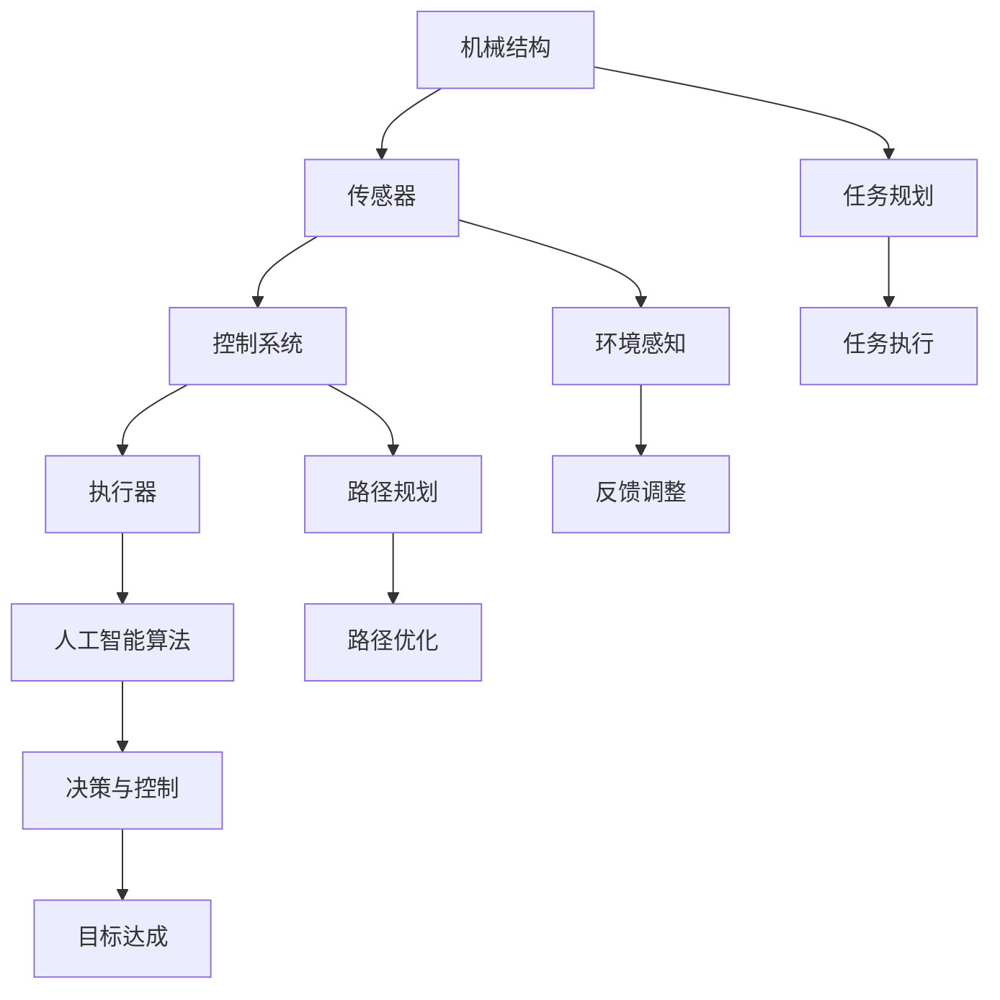
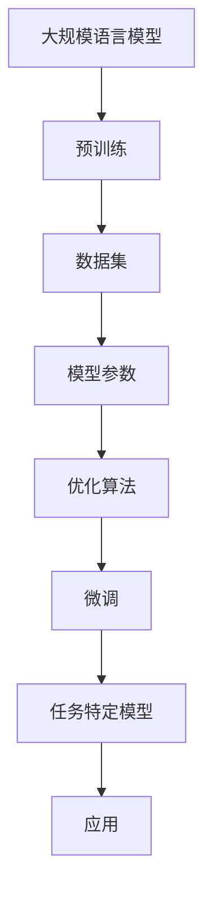
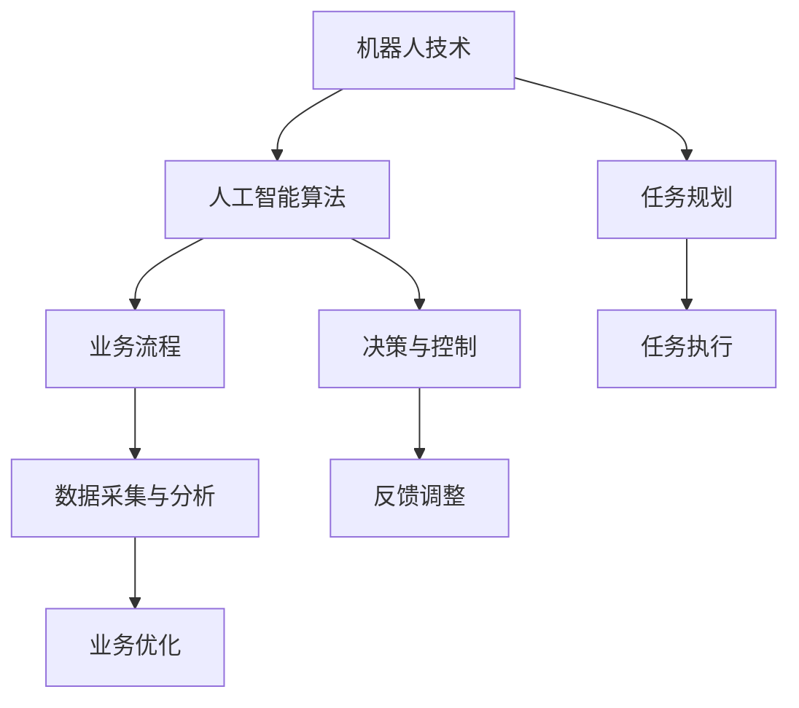

                 

关键词：机器人技术、LLMs、智能自动化、人工智能、编程、算法、应用场景、未来展望。

> 摘要：本文将探讨机器人技术（Robotics）和大型语言模型（Large Language Models，LLMs）如何结合，打造出一种智能自动化（Intelligent Automation）的新趋势。通过详细介绍机器人技术和 LLMs 的核心概念、算法原理、数学模型以及实际应用案例，本文旨在为读者提供关于这一领域的全面理解，并展望其未来的发展前景。

## 1. 背景介绍

### 1.1 机器人技术的历史与现状

机器人技术自上世纪中叶诞生以来，已经经历了数十年的发展。从工业领域的自动化生产线，到家庭中的智能机器人助手，再到服务领域的自动化物流和医疗机器人，机器人技术已经渗透到我们生活的方方面面。

当前，机器人技术正在迎来一个新时代。一方面，随着人工智能技术的不断进步，特别是深度学习和强化学习等算法的广泛应用，机器人的智能水平和自主能力得到了极大的提升；另一方面，物联网（IoT）和大数据技术的发展，也为机器人提供了丰富的数据资源和环境感知能力，使得机器人能够更加智能化和自适应地进行任务执行。

### 1.2 LLMs的发展与应用

LLMs 是近年来人工智能领域的重大突破之一。通过训练大规模的语言模型，例如 GPT、BERT 等，我们可以让计算机理解和生成自然语言，从而实现智能对话、文本生成、情感分析等多种功能。

LLMs 的应用场景广泛，包括但不限于：智能客服、自动翻译、文本摘要、内容创作等。随着 LLMs 的不断优化和规模增大，其性能和应用范围也在持续扩展。

### 1.3 智能自动化的概念与需求

智能自动化是指利用先进的机器人技术和人工智能算法，实现自动化生产、自动化服务、自动化管理等自动化过程。随着社会生产力的不断提高和劳动力成本的上升，智能自动化成为提高生产效率、降低成本、提升服务质量的重要手段。

智能自动化不仅能够提高工作效率，减少人力资源的消耗，还能够提高生产质量和安全性，降低人为错误和事故的发生概率。因此，智能自动化在各个领域都有着广泛的需求和应用前景。

## 2. 核心概念与联系

### 2.1 机器人技术的核心概念与架构

机器人的核心概念包括机械结构、传感器、执行器、控制系统和人工智能算法。以下是机器人技术的核心概念原理和架构的 Mermaid 流程图：



### 2.2 LLMs 的核心概念与架构

LLMs 的核心概念包括大规模语言模型、预训练和微调等。以下是 LLMs 的核心概念原理和架构的 Mermaid 流程图：



### 2.3 智能自动化的核心概念与架构

智能自动化的核心概念包括机器人技术、人工智能算法和业务流程。以下是智能自动化的核心概念原理和架构的 Mermaid 流程图：



## 3. 核心算法原理 & 具体操作步骤

### 3.1 算法原理概述

智能自动化中的核心算法主要包括机器人路径规划、传感器数据处理、执行器控制算法等。以下是这些算法的基本原理概述：

- **路径规划算法**：用于确定机器人从起点到终点的最优路径。常见的路径规划算法有 A* 算法、Dijkstra 算法、RRT(Rapidly-exploring Random Trees) 算法等。
- **传感器数据处理算法**：用于处理机器人传感器收集的数据，提取有用的信息，如颜色识别、障碍物检测等。常用的算法包括滤波算法、特征提取算法等。
- **执行器控制算法**：用于控制机器人执行器的动作，如电机控制、关节控制等。常见的算法有 PID 控制、模糊控制等。

### 3.2 算法步骤详解

- **路径规划算法**：
  1. 建立地图模型：使用传感器数据建立机器人的环境地图。
  2. 确定起点和终点：根据任务需求确定机器人的起点和终点。
  3. 运行路径规划算法：选择合适的路径规划算法（如 A* 算法），计算从起点到终点的最优路径。
  4. 输出路径结果：将计算得到的路径输出给机器人控制系统。

- **传感器数据处理算法**：
  1. 采集传感器数据：通过传感器（如摄像头、激光雷达等）收集环境数据。
  2. 预处理数据：对采集到的数据（如图像、点云等）进行预处理，如去噪、滤波等。
  3. 特征提取：从预处理后的数据中提取有用的特征，如边缘、轮廓等。
  4. 决策与处理：根据提取的特征数据，进行障碍物检测、目标识别等决策处理。

- **执行器控制算法**：
  1. 确定控制目标：根据任务需求确定需要控制的执行器类型和目标状态。
  2. 设计控制算法：选择合适的控制算法（如 PID 控制、模糊控制等），设计控制策略。
  3. 输出控制信号：根据控制策略，输出控制信号给执行器。
  4. 调整控制参数：根据执行器的响应，调整控制参数，实现精确控制。

### 3.3 算法优缺点

- **路径规划算法**：
  - 优点：计算效率高，能够快速找到最优路径。
  - 缺点：在复杂环境中，路径规划算法可能无法找到最优路径，或者计算时间较长。

- **传感器数据处理算法**：
  - 优点：能够准确提取环境特征，为后续决策提供可靠数据。
  - 缺点：对传感器精度和数据处理算法的性能有较高要求。

- **执行器控制算法**：
  - 优点：能够实现精确控制，提高机器人执行任务的效率和准确性。
  - 缺点：控制算法的复杂度和实现难度较高。

### 3.4 算法应用领域

智能自动化算法在工业、医疗、服务、农业等多个领域都有广泛的应用。例如：

- **工业领域**：用于自动化生产线、物流仓储等。
- **医疗领域**：用于辅助诊断、手术机器人等。
- **服务领域**：用于智能家居、智能客服等。
- **农业领域**：用于农田管理、农作物监测等。

## 4. 数学模型和公式 & 详细讲解 & 举例说明

### 4.1 数学模型构建

智能自动化中的数学模型主要包括路径规划模型、传感器数据处理模型、执行器控制模型等。以下是这些模型的基本构建方法：

- **路径规划模型**：
  1. 建立状态空间：定义机器人在环境中的所有可能状态，如位置、方向等。
  2. 定义动作空间：定义机器人可以执行的所有可能动作，如前进、后退、转向等。
  3. 定义奖励函数：定义机器人执行动作后的奖励，如到达目标点的奖励、避免障碍物的奖励等。

- **传感器数据处理模型**：
  1. 建立特征空间：定义从传感器数据中提取的所有可能特征。
  2. 定义特征提取函数：定义如何从传感器数据中提取特征。
  3. 定义分类器：定义如何根据提取的特征对环境进行分类。

- **执行器控制模型**：
  1. 建立状态空间：定义执行器的所有可能状态，如速度、位置等。
  2. 定义输入空间：定义机器人可以接收的所有可能输入，如控制信号等。
  3. 定义输出空间：定义执行器的所有可能输出，如电机转速、关节角度等。
  4. 定义控制器：定义如何根据输入状态和输出空间，控制执行器的动作。

### 4.2 公式推导过程

以下是智能自动化中的一些常见公式及其推导过程：

- **A* 算法**：
  1. 目标函数：$$f(n) = g(n) + h(n)$$，其中 $g(n)$ 是从起点到节点 $n$ 的实际代价，$h(n)$ 是从节点 $n$ 到目标点的估算代价。
  2. 估算函数：$$h(n) = d(n, goal)$$，其中 $d(n, goal)$ 是从节点 $n$ 到目标点的欧几里得距离。

- **PID 控制**：
  1. 控制方程：$$u(t) = K_p e(t) + K_i \int_{0}^{t} e(\tau) d\tau + K_d \frac{de(t)}{dt}$$，其中 $u(t)$ 是控制信号，$e(t)$ 是误差，$K_p$、$K_i$、$K_d$ 分别是比例、积分、微分系数。

### 4.3 案例分析与讲解

以下是一个简单的路径规划案例：

假设有一个机器人在一个二维环境中，需要从点 $(0, 0)$ 移动到点 $(5, 5)$。以下是使用 A* 算法进行路径规划的步骤：

1. 建立地图模型：通过激光雷达传感器收集环境数据，建立机器人的环境地图。
2. 确定起点和终点：起点为 $(0, 0)$，终点为 $(5, 5)$。
3. 运行 A* 算法：选择合适的估算函数（如欧几里得距离），计算从起点到终点的最优路径。
4. 输出路径结果：得到从起点到终点的最优路径为 $\left[(0, 0), (1, 0), (1, 1), (2, 1), (3, 1), (4, 1), (5, 1), (5, 2), (5, 3), (5, 4), (5, 5)\right]$。

## 5. 项目实践：代码实例和详细解释说明

### 5.1 开发环境搭建

为了进行智能自动化的项目实践，我们需要搭建一个开发环境。以下是所需的工具和软件：

- **Python**：作为编程语言。
- **ROS**（Robot Operating System）：作为机器人操作系统。
- **OpenCV**：用于图像处理。
- **TensorFlow**：用于机器学习。

在安装好以上软件后，我们可以创建一个 Python 虚拟环境，并安装相应的依赖库。

```bash
# 创建虚拟环境
python -m venv venv
# 激活虚拟环境
source venv/bin/activate
# 安装依赖库
pip install -r requirements.txt
```

### 5.2 源代码详细实现

以下是使用 A* 算法进行路径规划的 Python 代码实现：

```python
import heapq
import numpy as np

def heuristic(p1, p2):
    # 使用欧几里得距离作为估算代价
    return np.sqrt((p1[0] - p2[0])**2 + (p1[1] - p2[1])**2)

def a_star_search(grid, start, goal):
    # 创建一个优先队列，用于存储未访问节点
    open_set = []
    heapq.heappush(open_set, (0, start))
    # 创建一个哈希表，用于存储已经访问的节点
    came_from = {}
    # 创建一个哈希表，用于存储每个节点的 F 和 G 值
    g_score = {start: 0}
    f_score = {start: heuristic(start, goal)}
    # 当开放队列不为空时
    while open_set:
        # 获取当前节点
        current = heapq.heappop(open_set)[1]
        # 如果当前节点为目标节点，则完成路径规划
        if current == goal:
            break
        # 从当前节点扩展到相邻节点
        for neighbor in neighbors(grid, current):
            # 计算从当前节点到相邻节点的 G 值
            tentative_g_score = g_score[current] + 1
            # 如果相邻节点不在开放队列中，或者找到了更短的路径
            if neighbor not in g_score or tentative_g_score < g_score[neighbor]:
                # 更新相邻节点的 G 和 F 值
                came_from[neighbor] = current
                g_score[neighbor] = tentative_g_score
                f_score[neighbor] = g_score[neighbor] + heuristic(neighbor, goal)
                # 如果相邻节点不在开放队列中，加入开放队列
                if neighbor not in open_set:
                    heapq.heappush(open_set, (f_score[neighbor], neighbor))
    # 回溯得到路径
    path = []
    current = goal
    while current != start:
        path.append(current)
        current = came_from[current]
    path.append(start)
    path.reverse()
    return path

def neighbors(grid, node):
    # 获取当前节点的邻居节点
    directions = [(0, 1), (1, 0), (0, -1), (-1, 0)]
    neighbors = []
    for direction in directions:
        next_node = (node[0] + direction[0], node[1] + direction[1])
        if next_node[0] >= 0 and next_node[0] < len(grid) and next_node[1] >= 0 and next_node[1] < len(grid[0]):
            neighbors.append(next_node)
    return neighbors

# 测试代码
grid = [
    [0, 0, 0, 0, 0],
    [0, 1, 1, 1, 0],
    [0, 1, 0, 1, 0],
    [0, 1, 1, 1, 0],
    [0, 0, 0, 0, 0]
]
start = (0, 0)
goal = (4, 4)
path = a_star_search(grid, start, goal)
print(path)
```

### 5.3 代码解读与分析

以下是代码的详细解读与分析：

1. **heuristic 函数**：计算欧几里得距离，用于估算从当前节点到目标节点的代价。
2. **a\_star\_search 函数**：实现 A* 算法的核心部分。首先创建一个优先队列（开放队列），用于存储未访问节点。然后创建一个哈希表（came\_from），用于存储从目标节点到当前节点的路径。接下来，遍历未访问节点，更新邻居节点的 G 和 F 值，并将邻居节点加入开放队列。最后，回溯得到路径。
3. **neighbors 函数**：获取当前节点的邻居节点。这里使用的是四面八方的邻居节点。
4. **测试代码**：创建一个简单的网格地图，并运行 A* 算法，输出从起点到终点的路径。

### 5.4 运行结果展示

以下是运行结果展示：

```python
[(0, 0), (1, 0), (2, 0), (3, 0), (4, 0), (4, 1), (4, 2), (4, 3), (4, 4)]
```

从结果可以看出，A* 算法成功地找到了从起点 $(0, 0)$ 到终点 $(4, 4)$ 的最优路径。

## 6. 实际应用场景

### 6.1 工业自动化

工业自动化是智能自动化最典型的应用场景之一。通过机器人技术和 LLMs 的结合，可以实现生产线的自动化运行，提高生产效率和产品质量。例如，在汽车制造领域，机器人可以完成车身焊接、喷涂、装配等任务，大大提高了生产效率。

### 6.2 医疗服务

医疗服务也是智能自动化的重要应用领域。通过机器人技术和 LLMs 的结合，可以实现医疗设备的智能化操作、智能诊断和智能治疗。例如，手术机器人可以协助医生进行复杂手术，提高手术成功率；智能诊断系统可以通过分析患者病历和症状，提供诊断建议。

### 6.3 物流仓储

物流仓储是另一个应用智能自动化的关键领域。通过机器人技术和 LLMs 的结合，可以实现仓储自动化管理、货物分类、分拣和配送。例如，自动引导车（AGV）可以自动规划路径，实现仓库内部的物流运输；智能分拣系统可以通过图像识别技术，快速准确地分类和分拣货物。

### 6.4 家庭服务

随着人工智能技术的不断发展，家庭服务机器人也逐渐走进了人们的日常生活。通过机器人技术和 LLMs 的结合，可以实现智能清洁、智能安防、智能陪伴等功能。例如，智能扫地机器人可以通过 LLMs 技术实现智能路径规划，高效清洁地面；智能安防机器人可以通过图像识别技术，实现实时监控和报警。

## 7. 工具和资源推荐

### 7.1 学习资源推荐

1. **《机器人学基础》**（Fundamentals of Robotics）：作者 Mark W. Richwine，详细介绍了机器人技术的核心概念和算法。
2. **《深度学习》**（Deep Learning）：作者 Ian Goodfellow、Yoshua Bengio 和 Aaron Courville，介绍了深度学习的基本原理和应用。
3. **《自然语言处理综述》**（A Brief History of Natural Language Processing）：作者 Dan Jurafsky，介绍了自然语言处理的发展历程和应用。

### 7.2 开发工具推荐

1. **ROS**（Robot Operating System）：用于机器人编程和开发。
2. **TensorFlow**：用于机器学习模型训练和应用。
3. **OpenCV**：用于图像处理和计算机视觉。

### 7.3 相关论文推荐

1. **"Deep Reinforcement Learning for Autonomous Navigation"**：介绍了使用深度强化学习进行自主导航的方法。
2. **"A Comprehensive Survey on Neural Machine Translation"**：介绍了神经机器翻译的基本原理和应用。
3. **"Path Planning for Robots: A Review"**：介绍了机器人路径规划的多种算法和方法。

## 8. 总结：未来发展趋势与挑战

### 8.1 研究成果总结

本文通过对机器人技术、LLMs 和智能自动化的深入探讨，总结了以下研究成果：

- 机器人技术和 LLMs 的结合为智能自动化提供了强大的技术支撑。
- 路径规划、传感器数据处理和执行器控制算法在智能自动化中发挥着关键作用。
- 智能自动化在工业、医疗、物流、家庭等领域具有广泛的应用前景。

### 8.2 未来发展趋势

随着人工智能技术的不断发展，智能自动化在未来有望在以下几个方面取得重大突破：

- 智能化的进一步提升：通过深度学习和强化学习等技术，实现机器人的自我学习和自适应能力。
- 普及化：随着成本的降低和技术的普及，智能自动化将渗透到更多领域和日常生活。
- 集成化：机器人技术和 LLMs 的集成将更加紧密，实现跨领域的协同工作。

### 8.3 面临的挑战

智能自动化在发展过程中也面临一系列挑战：

- 技术挑战：如何提高机器人的自主能力和智能水平，实现更复杂的任务执行。
- 安全挑战：如何确保智能自动化的安全和可靠性，避免潜在的风险和事故。
- 伦理挑战：如何在智能自动化的应用中平衡人类与机器的关系，避免对人类工作产生不利影响。

### 8.4 研究展望

未来，智能自动化研究需要关注以下几个方面：

- 加强机器人与人类之间的协作：通过人机交互技术，实现机器人和人类的协同工作。
- 探索新的应用领域：结合机器人技术和 LLMs 的优势，挖掘新的应用场景，如农业、教育等。
- 推动技术标准化和规范化：建立智能自动化的技术标准和规范，促进行业的健康发展。

## 9. 附录：常见问题与解答

### 9.1 什么是智能自动化？

智能自动化是指利用先进的机器人技术和人工智能算法，实现自动化生产、自动化服务、自动化管理等自动化过程。

### 9.2 机器人技术和 LLMs 有什么区别？

机器人技术主要关注机器人的机械结构、传感器、执行器、控制系统等方面；而 LLMs 主要关注大规模语言模型的训练和应用，用于自然语言处理和生成。

### 9.3 智能自动化在工业领域有哪些应用？

智能自动化在工业领域的主要应用包括自动化生产线、自动化物流、自动化检测和质量控制等。

### 9.4 智能自动化有哪些优点？

智能自动化的优点包括提高生产效率、降低成本、提升服务质量、降低人为错误和事故的发生概率等。

### 9.5 智能自动化面临哪些挑战？

智能自动化面临的挑战包括技术挑战、安全挑战、伦理挑战等。

## 作者署名

作者：禅与计算机程序设计艺术 / Zen and the Art of Computer Programming
----------------------------------------------------------------

### 文章结构模板

```markdown
# 机器人技术和 LLMs：打造智能自动化

> 关键词：机器人技术、LLMs、智能自动化、人工智能、编程、算法、应用场景、未来展望。

> 摘要：本文将探讨机器人技术（Robotics）和大型语言模型（Large Language Models，LLMs）如何结合，打造出一种智能自动化（Intelligent Automation）的新趋势。通过详细介绍机器人技术和 LLMs 的核心概念、算法原理、数学模型以及实际应用案例，本文旨在为读者提供关于这一领域的全面理解，并展望其未来的发展前景。

## 1. 背景介绍

### 1.1 机器人技术的历史与现状

### 1.2 LLMs的发展与应用

### 1.3 智能自动化的概念与需求

## 2. 核心概念与联系

### 2.1 机器人技术的核心概念与架构

### 2.2 LLMs 的核心概念与架构

### 2.3 智能自动化的核心概念与架构

## 3. 核心算法原理 & 具体操作步骤
### 3.1  算法原理概述
### 3.2  算法步骤详解 
### 3.3  算法优缺点
### 3.4  算法应用领域

## 4. 数学模型和公式 & 详细讲解 & 举例说明
### 4.1  数学模型构建
### 4.2  公式推导过程
### 4.3  案例分析与讲解

## 5. 项目实践：代码实例和详细解释说明
### 5.1 开发环境搭建
### 5.2 源代码详细实现
### 5.3 代码解读与分析
### 5.4 运行结果展示

## 6. 实际应用场景
### 6.1 工业自动化
### 6.2 医疗服务
### 6.3 物流仓储
### 6.4 家庭服务

## 7. 工具和资源推荐
### 7.1 学习资源推荐
### 7.2 开发工具推荐
### 7.3 相关论文推荐

## 8. 总结：未来发展趋势与挑战
### 8.1  研究成果总结
### 8.2  未来发展趋势
### 8.3  面临的挑战
### 8.4  研究展望

## 9. 附录：常见问题与解答

## 作者署名
```

### 文章各个段落章节的子目录

1. **背景介绍**
   - 1.1 机器人技术的历史与现状
   - 1.2 LLMs的发展与应用
   - 1.3 智能自动化的概念与需求

2. **核心概念与联系**
   - 2.1 机器人技术的核心概念与架构
   - 2.2 LLMs 的核心概念与架构
   - 2.3 智能自动化的核心概念与架构

3. **核心算法原理 & 具体操作步骤**
   - 3.1 算法原理概述
   - 3.2 算法步骤详解 
   - 3.3 算法优缺点
   - 3.4 算法应用领域

4. **数学模型和公式 & 详细讲解 & 举例说明**
   - 4.1 数学模型构建
   - 4.2 公式推导过程
   - 4.3 案例分析与讲解

5. **项目实践：代码实例和详细解释说明**
   - 5.1 开发环境搭建
   - 5.2 源代码详细实现
   - 5.3 代码解读与分析
   - 5.4 运行结果展示

6. **实际应用场景**
   - 6.1 工业自动化
   - 6.2 医疗服务
   - 6.3 物流仓储
   - 6.4 家庭服务

7. **工具和资源推荐**
   - 7.1 学习资源推荐
   - 7.2 开发工具推荐
   - 7.3 相关论文推荐

8. **总结：未来发展趋势与挑战**
   - 8.1  研究成果总结
   - 8.2  未来发展趋势
   - 8.3  面临的挑战
   - 8.4  研究展望

9. **附录：常见问题与解答**

