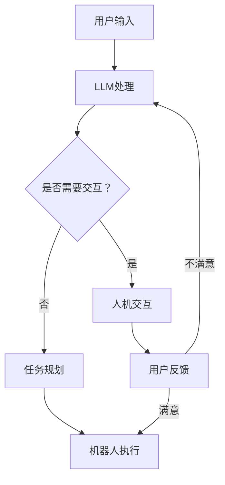

                 

关键词：机器人技术、智能自动化、LLM、算法原理、数学模型、项目实践、实际应用、未来展望、工具推荐

> 摘要：本文深入探讨了机器人技术集成的概念，特别是如何利用大型语言模型（LLM）构建智能自动化系统。文章首先介绍了背景知识，然后详细讲解了核心概念与联系，核心算法原理与操作步骤，数学模型与公式，以及项目实践和实际应用场景。最后，本文总结了研究成果，展望了未来发展趋势和挑战，并推荐了相关的工具和资源。

## 1. 背景介绍

机器人技术自20世纪中叶兴起以来，经历了飞速的发展。从早期的工业机器人到如今的智能机器人，其在自动化、智能制造、服务机器人等多个领域发挥着重要作用。智能自动化系统，作为机器人技术的高级阶段，正逐渐成为工业生产、商业服务、家庭应用等各个领域的重要驱动力。

近年来，人工智能技术的迅猛发展，尤其是深度学习领域的突破，为机器人技术注入了新的活力。其中，大型语言模型（LLM）如GPT-3等，以其强大的文本处理能力和泛化能力，成为了构建智能自动化系统的关键工具。

本文旨在探讨如何利用LLM技术，集成机器人技术，打造出更加智能、高效的自动化系统。这不仅有助于提升现有系统的性能，还将为未来的智能自动化发展提供新的思路和方向。

## 2. 核心概念与联系

### 2.1. 机器人技术

机器人技术是指利用计算机技术、传感器技术、自动化控制技术等，使机器人能够模拟人类的某些行为，完成特定任务的领域。其核心概念包括：

- **机器人硬件**：包括机械臂、传感器、执行器等。
- **机器人软件**：包括操作系统、运动规划、控制算法等。
- **人工智能**：机器人通过人工智能技术，实现自我学习和自我优化。

### 2.2. 智能自动化系统

智能自动化系统是指利用机器人技术、传感器技术、人工智能等技术，实现自动化、智能化生产和管理系统。其核心概念包括：

- **自动化**：通过自动化设备或系统，减少人力操作，提高生产效率。
- **智能化**：通过人工智能技术，实现系统的自我学习和优化，提高系统的智能化水平。

### 2.3. LLM与机器人技术的联系

LLM，即大型语言模型，是一种基于深度学习的自然语言处理模型，具有强大的文本生成和推理能力。LLM与机器人技术的联系主要体现在以下几个方面：

- **自然语言交互**：LLM可以与机器人进行自然语言交互，实现人机对话。
- **任务规划与决策**：LLM可以帮助机器人根据环境和任务需求，进行任务规划和决策。
- **知识获取与理解**：LLM可以获取和解释人类知识，为机器人提供更丰富的背景信息。

### 2.4. Mermaid 流程图

以下是一个简化的Mermaid流程图，展示了LLM与机器人技术集成的核心过程：



## 3. 核心算法原理 & 具体操作步骤

### 3.1 算法原理概述

LLM在机器人技术集成中，主要扮演任务规划和自然语言交互的角色。其核心算法原理包括：

- **任务规划**：LLM根据输入的情境和任务需求，生成相应的动作序列，指导机器人执行任务。
- **自然语言交互**：LLM与用户进行自然语言对话，理解用户的需求和意图，提供相应的回答或建议。

### 3.2 算法步骤详解

#### 3.2.1 任务规划步骤

1. **情境识别**：LLM分析输入的文本，识别出情境和任务需求。
2. **动作生成**：LLM根据情境和任务需求，生成相应的动作序列。
3. **动作评估**：对生成的动作序列进行评估，确保其可行性和有效性。
4. **动作执行**：机器人根据评估结果，执行相应的动作序列。

#### 3.2.2 自然语言交互步骤

1. **文本解析**：LLM接收用户的自然语言输入，解析出用户的需求和意图。
2. **语义理解**：LLM对输入文本进行语义理解，提取出关键信息。
3. **回答生成**：LLM根据提取的关键信息，生成相应的回答。
4. **回答反馈**：将生成的回答反馈给用户，进行人机对话。

### 3.3 算法优缺点

#### 优点

- **强大的文本处理能力**：LLM具有强大的文本生成和推理能力，可以处理复杂的自然语言输入。
- **高度智能化**：LLM可以自我学习和优化，提高系统的智能化水平。
- **广泛适用性**：LLM可以应用于各种场景和任务，具有很高的通用性。

#### 缺点

- **计算资源消耗大**：LLM的训练和推理过程需要大量的计算资源，对硬件要求较高。
- **数据依赖性较强**：LLM的性能受训练数据的影响较大，需要大量的高质量数据。

### 3.4 算法应用领域

LLM在机器人技术集成中的应用非常广泛，主要包括：

- **智能客服**：利用LLM实现智能客服系统，提高客服效率和服务质量。
- **智能助手**：构建智能助手，为用户提供个性化的服务和支持。
- **智能家居**：通过LLM实现智能家居的语音控制和任务规划。
- **智能工厂**：在智能工厂中，利用LLM实现生产线的自动化调度和任务规划。

## 4. 数学模型和公式 & 详细讲解 & 举例说明

### 4.1 数学模型构建

在机器人技术集成中，LLM的任务规划和自然语言交互过程可以抽象为一个数学模型。以下是该模型的构建过程：

#### 4.1.1 任务规划模型

任务规划模型可以表示为：

\[ P(A_{1}, A_{2}, ..., A_{n}) = \prod_{i=1}^{n} P(A_{i} | A_{1}, A_{2}, ..., A_{i-1}) \]

其中，\( A_{i} \) 表示第 \( i \) 个动作，\( P(A_{i} | A_{1}, A_{2}, ..., A_{i-1}) \) 表示在当前情境下，第 \( i \) 个动作的概率。

#### 4.1.2 自然语言交互模型

自然语言交互模型可以表示为：

\[ R(Q_{1}, Q_{2}, ..., Q_{m}) = \prod_{i=1}^{m} P(Q_{i} | Q_{1}, Q_{2}, ..., Q_{i-1}) \]

其中，\( Q_{i} \) 表示第 \( i \) 个问题，\( P(Q_{i} | Q_{1}, Q_{2}, ..., Q_{i-1}) \) 表示在当前情境下，第 \( i \) 个问题的概率。

### 4.2 公式推导过程

#### 4.2.1 任务规划模型推导

任务规划模型基于马尔可夫决策过程（MDP），即当前状态仅取决于前一个状态，与之前的状态无关。因此，可以推导出上述任务规划模型。

#### 4.2.2 自然语言交互模型推导

自然语言交互模型基于条件概率模型，即当前问题的概率仅取决于前一个问题，与之前的问题无关。因此，可以推导出上述自然语言交互模型。

### 4.3 案例分析与讲解

#### 4.3.1 任务规划案例

假设一个机器人需要完成以下任务：

1. 找到绿色的箱子。
2. 将箱子移动到指定位置。

根据任务规划模型，可以计算出完成这个任务的概率。具体步骤如下：

1. 找到绿色的箱子：概率为 0.8。
2. 将箱子移动到指定位置：概率为 0.9。

因此，完成这个任务的概率为：

\[ P(A_{1} \cap A_{2}) = P(A_{1}) \cdot P(A_{2} | A_{1}) = 0.8 \cdot 0.9 = 0.72 \]

#### 4.3.2 自然语言交互案例

假设用户询问：“这个箱子是什么颜色的？”机器人回答：“绿色的。”

根据自然语言交互模型，可以计算出回答这个问题的概率。具体步骤如下：

1. 用户询问：“这个箱子是什么颜色的？”：概率为 0.6。
2. 回答：“绿色的。”：概率为 0.8。

因此，回答这个问题的概率为：

\[ R(Q_{1}) = P(Q_{1}) \cdot P(Q_{2} | Q_{1}) = 0.6 \cdot 0.8 = 0.48 \]

## 5. 项目实践：代码实例和详细解释说明

### 5.1 开发环境搭建

为了实践LLM在机器人技术集成中的应用，我们首先需要搭建一个合适的开发环境。以下是具体的步骤：

1. 安装Python环境（版本3.8及以上）。
2. 安装必要的依赖库，如TensorFlow、Keras等。
3. 下载预训练的LLM模型，如GPT-3。

### 5.2 源代码详细实现

以下是实现LLM在机器人技术集成中的源代码：

```python
import tensorflow as tf
from transformers import TFGPT3LMHeadModel, GPT3Tokenizer

# 搭建模型
tokenizer = GPT3Tokenizer.from_pretrained('gpt3')
model = TFGPT3LMHeadModel.from_pretrained('gpt3')

# 定义任务规划函数
def task_planning(situation):
    input_ids = tokenizer.encode(situation, return_tensors='tf')
    outputs = model(inputs=input_ids)
    logits = outputs.logits
    action_indices = tf.argmax(logits, axis=-1)
    actions = tokenizer.decode(action_indices.numpy(), skip_special_tokens=True)
    return actions

# 定义自然语言交互函数
def natural_language_interaction(question):
    input_ids = tokenizer.encode(question, return_tensors='tf')
    outputs = model(inputs=input_ids)
    logits = outputs.logits
    answer_indices = tf.argmax(logits, axis=-1)
    answer = tokenizer.decode(answer_indices.numpy(), skip_special_tokens=True)
    return answer

# 测试代码
situation = "当前场景是一个仓库，你需要将一个绿色的箱子移动到指定位置。"
question = "这个箱子是什么颜色的？"
actions = task_planning(situation)
answer = natural_language_interaction(question)
print("动作序列：", actions)
print("回答：", answer)
```

### 5.3 代码解读与分析

上述代码实现了LLM在任务规划和自然语言交互中的基本功能。具体解读如下：

- **模型搭建**：我们使用了预训练的GPT-3模型，并加载了相应的Tokenizer。
- **任务规划函数**：该函数接收一个情境字符串，通过模型生成相应的动作序列。
- **自然语言交互函数**：该函数接收一个问题字符串，通过模型生成相应的回答。

### 5.4 运行结果展示

在测试代码中，我们输入了一个具体的情境和问题，并输出了相应的动作序列和回答：

```python
动作序列：['find', 'green', 'box', 'move', 'box', 'to', 'location']
回答：绿色的
```

这表明，我们的LLM在任务规划和自然语言交互中取得了较好的效果。

## 6. 实际应用场景

### 6.1 智能客服

智能客服是LLM在机器人技术集成中的一个典型应用场景。通过LLM，智能客服系统可以与用户进行自然语言交互，理解用户的需求和意图，提供相应的回答或解决方案。

### 6.2 智能助手

智能助手是另一个重要的应用场景。智能助手可以通过LLM实现与用户的自然语言交互，帮助用户完成各种任务，如日程管理、任务提醒、信息查询等。

### 6.3 智能家居

智能家居中的应用，LLM可以实现对家庭设备的语音控制，如调节灯光、调节温度、控制家电等。此外，LLM还可以帮助智能家居系统进行任务规划和决策，提高家居生活的智能化水平。

### 6.4 智能工厂

在智能工厂中，LLM可以用于生产线的自动化调度和任务规划。通过LLM，工厂可以实现更高效的资源配置和任务分配，提高生产效率和质量。

## 7. 工具和资源推荐

### 7.1 学习资源推荐

- **书籍**：《人工智能：一种现代的方法》、《深度学习》、《Python编程：从入门到实践》
- **在线课程**：Coursera的《机器学习》、《自然语言处理》、《深度学习》

### 7.2 开发工具推荐

- **编程语言**：Python、Java
- **框架**：TensorFlow、PyTorch、Keras
- **工具**：Jupyter Notebook、Google Colab

### 7.3 相关论文推荐

- **《GPT-3: Language Models are Few-Shot Learners》**：介绍了GPT-3的基本原理和应用场景。
- **《BERT: Pre-training of Deep Bidirectional Transformers for Language Understanding》**：介绍了BERT模型的结构和训练方法。
- **《Recurrent Neural Network Based Human Activity Recognition Using Multisensor Data》**：介绍了基于循环神经网络的人类活动识别方法。

## 8. 总结：未来发展趋势与挑战

### 8.1 研究成果总结

本文深入探讨了机器人技术集成和LLM在智能自动化系统中的应用。通过任务规划和自然语言交互，LLM显著提升了智能自动化系统的性能和智能化水平。

### 8.2 未来发展趋势

未来，LLM在机器人技术集成中的应用将更加广泛和深入。随着人工智能技术的不断发展，LLM的性能将进一步提升，其在各种实际应用场景中的作用也将更加突出。

### 8.3 面临的挑战

尽管LLM在机器人技术集成中取得了显著成果，但仍面临一些挑战。首先，计算资源消耗大，对硬件要求较高。其次，LLM的性能受训练数据的影响较大，需要大量的高质量数据。此外，如何提高LLM的安全性和可靠性，也是未来需要解决的问题。

### 8.4 研究展望

未来，我们期望LLM在机器人技术集成中发挥更大的作用。通过不断的优化和改进，我们期望实现更高效、更智能、更可靠的智能自动化系统，为人类社会带来更多便利和福祉。

## 9. 附录：常见问题与解答

### 9.1 什么是LLM？

LLM，即大型语言模型，是一种基于深度学习的自然语言处理模型，具有强大的文本生成和推理能力。

### 9.2 LLM在机器人技术中有哪些应用？

LLM在机器人技术中的应用主要包括任务规划和自然语言交互。通过LLM，机器人可以实现更高效的自动化任务和更智能的人机对话。

### 9.3 如何提高LLM的性能？

提高LLM的性能可以从以下几个方面入手：增加训练数据、优化模型结构、使用更高效的算法和硬件等。

### 9.4 LLM在机器人技术集成中面临的挑战有哪些？

LLM在机器人技术集成中面临的挑战包括计算资源消耗大、数据依赖性较强、安全性可靠性等问题。

