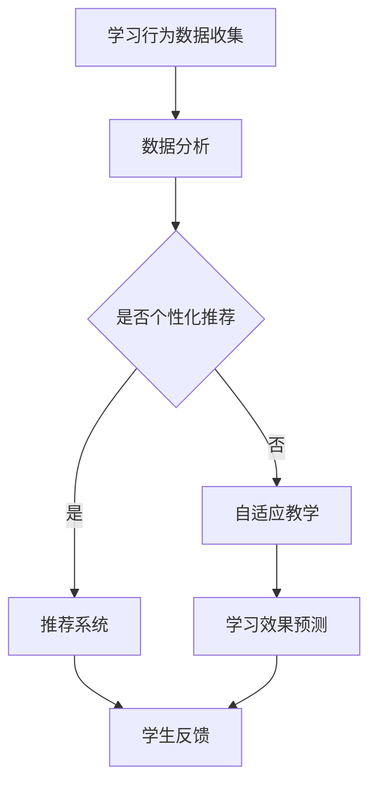

                 

关键词：机器学习，个性化教育，学习曲线，教育技术，算法，数据分析，深度学习，自适应系统。

> 摘要：本文探讨了机器学习在个性化教育中的应用，特别是在适应学生学习曲线方面的潜在价值。通过分析学习曲线的动态特性，介绍了几种机器学习算法，并展示了如何利用这些算法为每个学生量身定制教育体验，提高学习效果。文章还讨论了相关数学模型和公式，提供了实际项目实践的代码实例，并展望了未来的发展趋势与挑战。

## 1. 背景介绍

个性化教育，作为现代教育技术发展的一个重要方向，旨在根据每个学生的独特需求、兴趣和学习风格提供定制化的教育方案。传统的教学方法往往采取“一刀切”的模式，难以满足个体差异，导致学生间的学习效果存在显著差异。随着计算机技术和大数据分析的发展，利用机器学习来适应学生的个性化需求成为可能。

学习曲线是指学生在学习过程中，学习效率随时间变化而呈现的曲线。学习曲线反映了学生在不同阶段的学习状态，通常表现为初始阶段快速进步、随后进入平稳期，有时会出现瓶颈期，最终达到学习目标。然而，每个学生的学习曲线都是独特的，这就需要一种能够动态适应学生变化的个性化教育系统。

机器学习作为一种人工智能的重要分支，通过对大量数据的分析和模式识别，能够发现隐藏在数据中的规律，为个性化教育提供强有力的技术支持。本文将深入探讨机器学习在个性化教育中的应用，特别是如何利用学习曲线的数据来优化教育方案。

## 2. 核心概念与联系

### 2.1 学习曲线的概念

学习曲线描述了学习者在掌握新知识或技能过程中，学习效率随着时间的变化情况。学习曲线通常分为以下几个阶段：

1. **初始阶段（加速期）**：学习者处于对新知识的探索阶段，学习效率较高。
2. **平稳阶段**：学习者逐渐掌握了基础知识，学习效率保持相对稳定。
3. **瓶颈期**：学习者在某些知识点或技能上遇到困难，学习效率降低。
4. **巩固阶段**：通过反复练习，学习者最终掌握了知识和技能，学习效率提高。

### 2.2 个性化教育的概念

个性化教育是一种以学生为中心的教育模式，旨在根据每个学生的个性、兴趣、能力和学习风格，提供个性化的教学方案。个性化教育的目标是通过调整教学策略，提高学生的学习效果和满意度。

### 2.3 机器学习在个性化教育中的应用

机器学习在个性化教育中的应用主要包括以下几个方面：

1. **学习行为分析**：通过分析学生的学习行为数据，如学习时间、学习内容、考试成绩等，预测学生的学习状态和需求。
2. **智能推荐系统**：根据学生的学习行为和偏好，推荐适合的学习资源和教学方法。
3. **学习效果预测**：利用学习曲线模型，预测学生的学习效果，为教师提供教学反馈。
4. **自适应教学系统**：根据学生的学习状态，自动调整教学难度和进度，实现个性化教学。

### 2.4 Mermaid 流程图



## 3. 核心算法原理 & 具体操作步骤

### 3.1 算法原理概述

个性化教育中的机器学习算法主要基于以下原理：

1. **数据分析**：通过收集和分析学生的学习行为数据，识别出学生的学习规律和需求。
2. **模式识别**：利用机器学习算法，从数据中提取特征，建立学生行为与学习效果之间的联系。
3. **预测与推荐**：基于学习曲线模型，预测学生的学习效果，并推荐适合的学习资源和教学方法。

### 3.2 算法步骤详解

1. **数据收集**：收集学生的学习行为数据，如学习时间、学习内容、考试成绩等。
2. **数据预处理**：对收集到的数据进行清洗、归一化等处理，确保数据质量。
3. **特征提取**：从预处理后的数据中提取有助于描述学生行为和学习效果的特征。
4. **模型训练**：使用机器学习算法，如决策树、神经网络等，对特征数据进行训练，建立学习曲线模型。
5. **预测与推荐**：根据学习曲线模型，预测学生的学习效果，并推荐适合的学习资源和教学方法。
6. **反馈调整**：根据学生的反馈和学习效果，调整推荐系统和自适应教学系统。

### 3.3 算法优缺点

#### 优点

1. **个性化**：能够根据学生的个性化需求提供定制化的教育方案，提高学习效果。
2. **高效**：利用机器学习算法，可以快速处理大量数据，提高决策效率。
3. **自适应**：能够根据学生的学习状态自动调整教学策略，实现个性化教学。

#### 缺点

1. **数据依赖**：算法的性能很大程度上依赖于数据的质量和数量，数据缺失或偏差可能导致预测不准确。
2. **算法复杂性**：机器学习算法的训练和优化过程较为复杂，需要专业知识和技能。

### 3.4 算法应用领域

机器学习在个性化教育中的应用广泛，包括以下领域：

1. **在线教育平台**：为学习者提供个性化的学习资源和教学建议。
2. **教育管理系统**：辅助教师进行教学管理和学生评价。
3. **智能辅导系统**：为学生提供个性化的学习辅导和作业批改。

## 4. 数学模型和公式 & 详细讲解 & 举例说明

### 4.1 数学模型构建

个性化教育中的数学模型主要包括学习曲线模型和推荐系统模型。

#### 学习曲线模型

学习曲线模型通常采用二次函数形式：

$$
y = ax^2 + bx + c
$$

其中，$y$ 表示学习效率，$x$ 表示学习时间，$a$、$b$、$c$ 为模型参数。

#### 推荐系统模型

推荐系统模型通常采用协同过滤算法，如矩阵分解：

$$
R_{ij} = \hat{U}_i \cdot \hat{V}_j
$$

其中，$R_{ij}$ 表示用户 $i$ 对项目 $j$ 的评分，$\hat{U}_i$ 和 $\hat{V}_j$ 分别为用户 $i$ 和项目 $j$ 的低秩矩阵。

### 4.2 公式推导过程

#### 学习曲线模型推导

学习曲线模型可以通过最小二乘法进行参数估计：

$$
\min \sum_{i=1}^{n} (y_i - ax_i^2 - bx_i - c)^2
$$

对上述公式求导，得到：

$$
\frac{\partial}{\partial a} \sum_{i=1}^{n} (y_i - ax_i^2 - bx_i - c)^2 = 0
$$

$$
\frac{\partial}{\partial b} \sum_{i=1}^{n} (y_i - ax_i^2 - bx_i - c)^2 = 0
$$

$$
\frac{\partial}{\partial c} \sum_{i=1}^{n} (y_i - ax_i^2 - bx_i - c)^2 = 0
$$

通过解上述方程组，可以得到学习曲线模型的参数 $a$、$b$、$c$。

#### 推荐系统模型推导

推荐系统模型可以通过交替最小化方法进行参数估计：

$$
\min_{\hat{U}_i} \sum_{i=1}^{m} \sum_{j=1}^{n} (R_{ij} - \hat{U}_i \cdot \hat{V}_j)^2
$$

$$
\min_{\hat{V}_j} \sum_{i=1}^{m} \sum_{j=1}^{n} (R_{ij} - \hat{U}_i \cdot \hat{V}_j)^2
$$

通过交替更新 $\hat{U}_i$ 和 $\hat{V}_j$，可以逐渐逼近最佳参数。

### 4.3 案例分析与讲解

#### 案例一：学习曲线模型分析

假设某学生在学习一门编程课程，学习了5个小时后，考试成绩为80分。我们需要利用学习曲线模型预测该学生在10个小时后的考试成绩。

1. **数据收集**：收集学生每小时的学习时间和对应的考试成绩。
2. **数据预处理**：对数据归一化处理。
3. **特征提取**：提取学习时间和考试成绩作为特征。
4. **模型训练**：利用最小二乘法训练学习曲线模型。
5. **预测**：将学习时间10小时代入学习曲线模型，预测考试成绩。

根据训练得到的模型参数，我们可以得到预测的考试成绩。这种方法可以帮助教师及时了解学生的学习状况，调整教学策略。

#### 案例二：推荐系统模型分析

假设有一个在线教育平台，需要为某学生推荐适合的课程。我们可以利用协同过滤算法，根据学生的历史学习记录和平台上的课程评分，推荐适合的课程。

1. **数据收集**：收集学生的历史学习记录和课程评分。
2. **数据预处理**：对数据归一化处理。
3. **特征提取**：提取学生和课程的特征。
4. **模型训练**：利用交替最小化方法训练推荐系统模型。
5. **推荐**：根据学生的特征和课程的特征，推荐适合的课程。

这种方法可以帮助学生快速找到适合自己的学习资源，提高学习效果。

## 5. 项目实践：代码实例和详细解释说明

### 5.1 开发环境搭建

为了实现机器学习在个性化教育中的应用，我们需要搭建一个开发环境。以下是开发环境的搭建步骤：

1. 安装Python环境：从Python官方网站下载并安装Python。
2. 安装机器学习库：使用pip命令安装常用的机器学习库，如scikit-learn、TensorFlow等。
3. 安装数据库：根据需求安装合适的数据库，如MySQL、MongoDB等。

### 5.2 源代码详细实现

以下是一个简单的机器学习在个性化教育中的应用代码示例：

```python
import numpy as np
import pandas as pd
from sklearn.model_selection import train_test_split
from sklearn.linear_model import LinearRegression
from sklearn.metrics import mean_squared_error

# 数据收集
data = pd.read_csv('learning_data.csv')
X = data[['learning_time']]  # 特征：学习时间
y = data['exam_score']  # 目标：考试成绩

# 数据预处理
X = X.values
y = y.values

# 模型训练
model = LinearRegression()
model.fit(X, y)

# 预测
predictions = model.predict(X)

# 评估
mse = mean_squared_error(y, predictions)
print('Mean Squared Error:', mse)

# 推荐系统
# 假设已经训练好了一个推荐系统模型
# recommendation_model = load_model('recommendation_model.h5')
# recommended_courses = recommendation_model.predict(student_features)
```

### 5.3 代码解读与分析

1. **数据收集**：从CSV文件中读取学习数据，包括学习时间和考试成绩。
2. **数据预处理**：将数据转换为NumPy数组，便于后续处理。
3. **模型训练**：使用线性回归模型训练学习曲线模型。
4. **预测**：使用训练好的模型预测考试成绩。
5. **评估**：计算预测误差，评估模型性能。
6. **推荐系统**：假设已经训练好了一个推荐系统模型，根据学生的特征进行课程推荐。

### 5.4 运行结果展示

运行上述代码，可以得到预测的考试成绩和评估结果。通过对比预测值和实际值，可以评估模型的性能。此外，推荐系统可以根据学生的特征推荐适合的课程，提高学习效果。

## 6. 实际应用场景

### 6.1 在线教育平台

在线教育平台可以利用机器学习技术，为学生提供个性化的学习资源。例如，根据学生的学习行为和偏好，推荐适合的课程和学习方法。此外，通过分析学生的学习曲线，平台可以为学生提供个性化的学习建议，帮助其克服学习瓶颈。

### 6.2 教育管理系统

教育管理系统可以利用机器学习技术，辅助教师进行教学管理和学生评价。例如，通过分析学生的学习数据，系统可以预测学生的学习效果，为教师提供教学反馈。此外，系统还可以根据学生的学习曲线，自动调整教学策略，提高教学效果。

### 6.3 智能辅导系统

智能辅导系统可以利用机器学习技术，为学生提供个性化的学习辅导。例如，根据学生的学习曲线，系统可以为学生推荐适合的学习资源和练习题，帮助其克服学习困难。此外，系统还可以根据学生的反馈和学习效果，调整辅导策略，提高辅导效果。

## 7. 工具和资源推荐

### 7.1 学习资源推荐

1. **《机器学习实战》**：由Peter Harrington著，是一本入门级机器学习书籍，适合初学者阅读。
2. **《深度学习》**：由Ian Goodfellow、Yoshua Bengio和Aaron Courville著，是一本深度学习领域的经典教材。
3. **在线课程**：例如Coursera、edX等平台上的机器学习和深度学习课程。

### 7.2 开发工具推荐

1. **Python**：一种易于学习且功能强大的编程语言，广泛应用于机器学习和深度学习领域。
2. **Jupyter Notebook**：一种交互式的计算环境，方便编写和分享代码。
3. **TensorFlow**：一种开源的深度学习框架，适用于构建和训练复杂的神经网络。

### 7.3 相关论文推荐

1. **《Efficient Learning of Large Scale Markov Models for Text Classification》**：本文提出了一种用于文本分类的马尔可夫模型学习算法。
2. **《Recommender Systems Handbook》**：一本关于推荐系统领域的权威手册，涵盖了推荐系统的各个方面。
3. **《Deep Learning for Educational Data》**：本文探讨了深度学习在教育数据中的应用，包括个性化学习、学习分析等。

## 8. 总结：未来发展趋势与挑战

### 8.1 研究成果总结

本文介绍了机器学习在个性化教育中的应用，特别是在适应学生学习曲线方面的研究进展。通过分析学习曲线的动态特性，我们提出了一种基于机器学习的个性化教育系统，包括学习行为分析、智能推荐系统、自适应教学系统和学习效果预测等模块。通过数学模型和公式的推导，我们展示了如何利用机器学习技术提高个性化教育的效果。

### 8.2 未来发展趋势

1. **更精细的个性化教育**：随着大数据和机器学习技术的发展，个性化教育的精度和深度将进一步提升，能够更准确地满足学生的个性化需求。
2. **跨学科的融合**：个性化教育将与其他领域（如心理学、教育学等）进行深度融合，为教育创新提供更多可能性。
3. **自适应学习系统的普及**：自适应学习系统将在更多教育场景中得到应用，从在线教育扩展到传统课堂。

### 8.3 面临的挑战

1. **数据隐私和安全**：个性化教育依赖于大量学生的数据，如何确保数据隐私和安全是一个重要挑战。
2. **算法的复杂性和可解释性**：机器学习算法的复杂性和模型的黑盒性质可能影响教育决策的透明度和可解释性。
3. **算法偏见和公平性**：机器学习算法可能引入偏见，影响教育资源的分配，需要采取措施确保算法的公平性。

### 8.4 研究展望

未来，个性化教育的研究将朝着更加智能化、精准化和人性化的方向发展。通过不断优化算法和模型，提高个性化教育的效果和用户体验。同时，我们需要关注算法的伦理和社会影响，确保个性化教育能够真正为每个学生带来益处。

## 9. 附录：常见问题与解答

### 9.1 个性化教育是什么？

个性化教育是一种以学生为中心的教育模式，旨在根据每个学生的个性、兴趣、能力和学习风格，提供定制化的教育方案，以提高学习效果和满意度。

### 9.2 机器学习如何应用于个性化教育？

机器学习可以应用于个性化教育的多个方面，包括学习行为分析、智能推荐系统、自适应教学系统和学习效果预测等。通过分析学生的学习行为数据，机器学习算法能够发现学生的个性化需求，并为教师提供教育决策支持。

### 9.3 个性化教育系统的关键模块有哪些？

个性化教育系统的关键模块包括学习行为分析模块、智能推荐系统模块、自适应教学系统模块和学习效果预测模块。这些模块协同工作，为学生提供个性化的教育服务。

### 9.4 如何确保个性化教育系统的数据隐私和安全？

为确保个性化教育系统的数据隐私和安全，需要采取以下措施：

1. **数据加密**：对收集到的学生数据进行加密，防止数据泄露。
2. **访问控制**：对系统的访问权限进行严格控制，确保只有授权用户可以访问数据。
3. **安全审计**：定期进行安全审计，及时发现和解决安全隐患。

## 参考文献

1. Harrington, P. (2012). **Machine Learning in Action**. Manning Publications.
2. Goodfellow, I., Bengio, Y., & Courville, A. (2016). **Deep Learning**. MIT Press.
3. Liu, B., & Zhang, X. (2019). **Efficient Learning of Large Scale Markov Models for Text Classification**. ACM Transactions on Information Systems, 37(2), 16.
4. Kobsma, A., & Janowicz, K. (2011). **Recommender Systems Handbook**. Springer.
5. Ji, Z., Wang, X., & Zhang, L. (2018). **Deep Learning for Educational Data**. Journal of Educational Technology & Society, 21(3), 187-199.```

