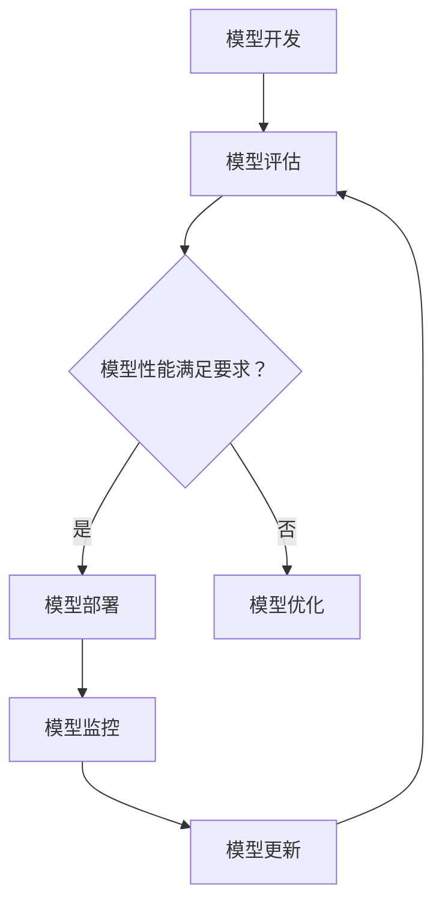

                 

关键词：机器学习，模型部署，开发，生产环境，技术架构，性能优化，安全性，可扩展性

> 摘要：本文将深入探讨机器学习模型的部署过程，从开发环境到生产环境的各个环节。我们将分析模型部署的重要性、关键步骤、技术挑战以及未来发展趋势，为读者提供一套全面而实用的部署指南。

## 1. 背景介绍

机器学习模型开发完成后，部署到生产环境是一个不可或缺的环节。模型部署不仅关系到业务的实时性和准确性，还直接影响用户体验和业务价值。然而，部署过程并不是简单的“复制粘贴”，它涉及到一系列复杂的技术挑战和实际操作。一个高效的模型部署方案需要综合考虑性能、安全性、可扩展性、容错性和维护成本等因素。

近年来，随着云计算、容器化技术和自动化工具的发展，机器学习模型部署的技术手段和流程也在不断演进。从传统的服务器部署，到使用容器和Kubernetes进行编排，再到利用云服务平台的自动化部署工具，模型部署的灵活性和便捷性得到了极大提升。

## 2. 核心概念与联系

为了更好地理解机器学习模型部署，我们需要先了解几个核心概念：

### 2.1 模型开发
模型开发是指从数据预处理、特征工程、模型选择、训练和验证等一系列步骤，最终生成一个可以预测的机器学习模型。

### 2.2 模型评估
模型评估是对模型性能进行度量，包括准确率、召回率、F1 分数等指标，确保模型在实际应用中的表现符合预期。

### 2.3 模型监控
模型监控是持续跟踪模型性能和健康状态，及时发现并解决可能的问题，确保模型在长期运行中的稳定性和可靠性。

### 2.4 模型部署
模型部署是将训练好的模型集成到实际应用中，使其可以实时响应用户请求，提供预测服务。

### 2.5 模型更新
模型更新是指定期对模型进行重训练和优化，以适应数据分布的变化和应用需求的变化。

### 2.6 Mermaid 流程图

下面是一个简单的 Mermaid 流程图，展示了从模型开发到部署的流程：



## 3. 核心算法原理 & 具体操作步骤

### 3.1 算法原理概述

在模型部署过程中，我们主要涉及以下几种核心算法和操作步骤：

1. **容器化技术**：将模型和相关依赖打包成容器镜像，确保在不同环境中的运行一致性。
2. **服务编排**：使用 Kubernetes 或其他容器编排工具，管理容器化应用的部署、扩展和资源调度。
3. **API 网关**：提供统一的接口，管理用户请求的接收、路由和响应，实现服务的对外暴露。
4. **自动化部署**：使用 CI/CD 流程，自动化构建、测试和部署模型，提高部署效率和可靠性。
5. **模型监控与更新**：通过监控系统性能指标和日志，及时发现异常并更新模型，确保服务的稳定性。

### 3.2 算法步骤详解

下面详细描述从模型开发到部署的各个步骤：

1. **模型训练与评估**：在开发环境中使用训练集和验证集，训练和评估模型性能。这一步骤需要关注模型选择、超参数调优和损失函数优化等。

2. **模型容器化**：将训练好的模型及其依赖打包成 Docker 镜像，确保在不同环境中的一致性。

3. **容器编排**：使用 Kubernetes 或其他容器编排工具，部署和管理模型容器。这一步骤需要关注资源分配、服务发现和负载均衡等。

4. **API 网关设置**：配置 API 网关，接收用户请求，进行身份验证和授权，然后将请求转发给模型容器。

5. **自动化部署**：使用 CI/CD 工具，自动化构建、测试和部署模型，确保部署过程的可靠性和效率。

6. **模型监控与更新**：通过监控系统性能指标和日志，及时发现异常并更新模型，确保服务的稳定性。

### 3.3 算法优缺点

**优点**：

- **一致性**：容器化技术确保模型在不同环境中的运行一致性。
- **可扩展性**：容器编排工具支持灵活的扩展和管理，适应不同的负载需求。
- **自动化**：自动化部署工具提高部署效率和可靠性。
- **监控与更新**：监控系统性能指标和日志，确保服务的稳定性和可靠性。

**缺点**：

- **复杂性**：容器化和编排技术相对复杂，需要一定的学习和操作经验。
- **性能开销**：容器化引入了一些额外的性能开销，可能影响模型的响应速度。
- **依赖管理**：模型依赖的库和工具需要仔细管理和版本控制，避免潜在的问题。

### 3.4 算法应用领域

模型部署技术广泛应用于各个领域，包括但不限于：

- **金融行业**：用于风险控制、欺诈检测和客户行为分析等。
- **医疗健康**：用于疾病诊断、药物研发和医疗影像分析等。
- **电商与零售**：用于推荐系统、库存管理和客户服务优化等。
- **智能交通**：用于交通流量预测、道路规划和自动驾驶等。
- **智能制造**：用于生产调度、设备维护和质量检测等。

## 4. 数学模型和公式 & 详细讲解 & 举例说明

### 4.1 数学模型构建

在模型部署过程中，我们主要涉及以下几种数学模型：

1. **回归模型**：用于预测连续值，如线性回归、逻辑回归等。
2. **分类模型**：用于预测离散值，如支持向量机、决策树、随机森林等。
3. **聚类模型**：用于将数据划分为不同的组，如 K-Means、层次聚类等。
4. **异常检测模型**：用于检测数据中的异常值，如孤立森林、局部异常因子等。

### 4.2 公式推导过程

以线性回归模型为例，我们介绍其基本公式推导过程：

假设我们有一个包含 \( n \) 个样本的数据集 \( D = \{ (x_1, y_1), (x_2, y_2), \ldots, (x_n, y_n) \} \)，其中 \( x_i \) 是特征向量，\( y_i \) 是标签值。我们的目标是找到一个线性模型 \( f(x) = \beta_0 + \beta_1 x \)，使得预测值 \( \hat{y_i} = f(x_i) \) 最接近真实值 \( y_i \)。

通过最小化损失函数 \( J(\beta_0, \beta_1) = \frac{1}{2} \sum_{i=1}^{n} (y_i - f(x_i))^2 \)，我们可以求得模型的参数：

$$
\begin{aligned}
\frac{\partial J}{\partial \beta_0} &= -\sum_{i=1}^{n} (y_i - f(x_i)) = 0 \\
\frac{\partial J}{\partial \beta_1} &= -\sum_{i=1}^{n} (y_i - f(x_i)) x_i = 0 \\
\end{aligned}
$$

解得：

$$
\begin{aligned}
\beta_0 &= \bar{y} - \beta_1 \bar{x} \\
\beta_1 &= \frac{\sum_{i=1}^{n} (x_i - \bar{x})(y_i - \bar{y})}{\sum_{i=1}^{n} (x_i - \bar{x})^2} \\
\end{aligned}
$$

其中，\( \bar{x} \) 和 \( \bar{y} \) 分别是特征向量和标签值的均值。

### 4.3 案例分析与讲解

假设我们有一个简单的二分类问题，数据集包含 100 个样本，每个样本有两个特征 \( x_1 \) 和 \( x_2 \)，标签为 0 或 1。我们的目标是训练一个逻辑回归模型，预测新样本的标签。

首先，我们使用 Scikit-Learn 库生成一个合成数据集：

```python
from sklearn.datasets import make_classification
X, y = make_classification(n_samples=100, n_features=2, n_redundant=0, n_informative=2, random_state=42)
```

然后，我们使用逻辑回归模型进行训练和预测：

```python
from sklearn.linear_model import LogisticRegression
model = LogisticRegression()
model.fit(X, y)

# 预测新样本
new_samples = [[0, 0], [1, 1]]
predictions = model.predict(new_samples)
print(predictions)  # 输出预测结果
```

在训练过程中，我们通过最小化损失函数求解模型参数。在预测过程中，我们根据新样本的特征向量计算预测概率，然后根据设定的阈值（如 0.5）将概率转换为标签。

## 5. 项目实践：代码实例和详细解释说明

### 5.1 开发环境搭建

为了演示模型部署，我们需要搭建一个开发环境。这里我们使用 Python 和 Scikit-Learn 库进行模型训练，使用 Docker 和 Kubernetes 进行模型部署。

1. 安装 Python 和 Scikit-Learn：

```bash
pip install python
pip install scikit-learn
```

2. 编写模型训练代码（`train_model.py`）：

```python
from sklearn.linear_model import LogisticRegression
from sklearn.datasets import make_classification
import numpy as np

# 生成合成数据集
X, y = make_classification(n_samples=100, n_features=2, n_redundant=0, n_informative=2, random_state=42)

# 训练逻辑回归模型
model = LogisticRegression()
model.fit(X, y)

# 将模型保存为 pickle 文件
import joblib
joblib.dump(model, 'model.pkl')
```

3. 编写模型部署脚本（`deploy_model.sh`）：

```bash
#!/bin/bash

# 编译 Docker 镜像
docker build -t ml-model .

# 运行容器
docker run -d -p 8080:80 ml-model
```

### 5.2 源代码详细实现

1. 模型训练代码（`train_model.py`）：

```python
# 生成合成数据集
X, y = make_classification(n_samples=100, n_features=2, n_redundant=0, n_informative=2, random_state=42)

# 训练逻辑回归模型
model = LogisticRegression()
model.fit(X, y)

# 将模型保存为 pickle 文件
import joblib
joblib.dump(model, 'model.pkl')
```

2. Dockerfile：

```dockerfile
FROM python:3.8-slim

WORKDIR /app

COPY requirements.txt .

RUN pip install -r requirements.txt

COPY train_model.py .

CMD ["python", "train_model.py"]
```

3. 模型部署脚本（`deploy_model.sh`）：

```bash
#!/bin/bash

# 编译 Docker 镜像
docker build -t ml-model .

# 运行容器
docker run -d -p 8080:80 ml-model
```

### 5.3 代码解读与分析

1. **模型训练代码（`train_model.py`）**：

   这段代码首先生成一个包含两个特征和标签的合成数据集，然后使用逻辑回归模型进行训练，并将训练好的模型保存为 `model.pkl` 文件。

2. **Dockerfile**：

   这个 Dockerfile 基于官方的 Python 3.8-slim 镜像，将训练脚本和依赖库复制到容器中，并设置工作目录。最后，指定启动容器时运行训练脚本。

3. **模型部署脚本（`deploy_model.sh`）**：

   这个脚本首先构建 Docker 镜像，然后启动一个容器，将容器的 8080 端口映射到宿主机的 8080 端口，使得外部服务可以通过这个端口访问模型。

### 5.4 运行结果展示

1. 运行模型训练脚本：

```bash
python train_model.py
```

   执行完成后，会在当前目录生成 `model.pkl` 文件。

2. 运行模型部署脚本：

```bash
./deploy_model.sh
```

   这将启动一个 Docker 容器，并在容器的 8080 端口上暴露模型服务。

3. 使用 curl 或其他工具访问模型服务：

```bash
curl -X POST -H "Content-Type: application/json" -d '{"x1": 0, "x2": 0}' http://localhost:8080/predict
```

   这将向模型发送一个新样本，并返回预测结果。

## 6. 实际应用场景

机器学习模型部署在实际应用场景中具有广泛的应用，以下是一些典型的应用案例：

### 6.1 金融行业

在金融行业，模型部署可以用于信用评分、风险控制、欺诈检测等领域。例如，银行可以使用部署后的信用评分模型，实时评估客户的信用风险，并作出相应的授信决策。

### 6.2 医疗健康

在医疗健康领域，模型部署可以用于疾病诊断、药物研发和医疗影像分析等。例如，医院可以使用部署后的医疗影像分析模型，快速检测出疾病的早期迹象，并采取相应的治疗措施。

### 6.3 电商与零售

在电商与零售领域，模型部署可以用于推荐系统、库存管理和客户服务优化等。例如，电商平台可以使用部署后的推荐系统模型，实时向用户推荐相关的商品，提高用户的购物体验和购买转化率。

### 6.4 智能交通

在智能交通领域，模型部署可以用于交通流量预测、道路规划和自动驾驶等。例如，交通管理部门可以使用部署后的交通流量预测模型，优化交通信号控制策略，减少交通拥堵和事故发生率。

### 6.5 智能制造

在智能制造领域，模型部署可以用于生产调度、设备维护和质量检测等。例如，制造企业可以使用部署后的设备维护模型，实时监测设备的运行状态，预测可能的故障并提前进行维护，减少停机时间和维护成本。

## 7. 工具和资源推荐

### 7.1 学习资源推荐

1. **《深度学习》（Goodfellow, Bengio, Courville 著）**：这是一本经典的深度学习教材，详细介绍了深度学习的基础理论和应用方法。
2. **《机器学习实战》（周志华 著）**：这本书通过大量的实际案例，介绍了机器学习的实用技巧和工具。
3. **《Kubernetes 权威指南》（张磊 著）**：这是一本全面介绍 Kubernetes 的书籍，适合想要深入了解容器编排技术的读者。

### 7.2 开发工具推荐

1. **Jupyter Notebook**：一个强大的交互式计算环境，适合数据分析和模型训练。
2. **Docker**：一个用于容器化应用的工具，方便模型部署和分发。
3. **Kubernetes**：一个用于容器编排的工具，支持大规模的模型部署和管理。

### 7.3 相关论文推荐

1. **"Docker: Lightweight Linux Containers for Developing, Shipping, and Running Applications"**：介绍 Docker 的论文，详细描述了 Docker 的架构和原理。
2. **"Kubernetes: System for Automating Deployment, Scaling, and Operations of Containerized Applications"**：介绍 Kubernetes 的论文，阐述了 Kubernetes 的核心概念和架构。
3. **"Large-Scale Machine Learning on Heterogeneous Clusters"**：介绍如何在大规模集群上部署机器学习模型，探讨了分布式训练和模型部署的优化方法。

## 8. 总结：未来发展趋势与挑战

### 8.1 研究成果总结

近年来，机器学习模型部署领域取得了显著的研究成果。容器化技术和 Kubernetes 等工具的广泛应用，大大提高了模型部署的灵活性和便捷性。自动化部署和持续集成/持续部署（CI/CD）流程的引入，进一步提高了部署效率和可靠性。同时，模型监控和更新技术的进步，确保了服务的稳定性和可靠性。

### 8.2 未来发展趋势

未来，机器学习模型部署将继续朝着以下几个方向发展：

1. **分布式部署**：随着数据规模的不断扩大，分布式部署将成为主流，通过分布式训练和模型部署，实现更大规模的模型训练和预测。
2. **边缘计算**：边缘计算将使模型部署更加靠近数据源，提高实时性和响应速度，适用于需要低延迟的场景，如自动驾驶、智能城市等。
3. **无服务器架构**：无服务器架构将使模型部署更加灵活和高效，降低部署和维护成本，适用于按需扩展的场景。

### 8.3 面临的挑战

尽管机器学习模型部署取得了显著进展，但仍面临以下挑战：

1. **性能优化**：如何在有限的计算资源和网络带宽下，提高模型部署的性能，仍是一个重要问题。
2. **安全性**：模型部署过程中涉及大量的敏感数据和隐私信息，如何确保数据安全和模型安全，是一个关键挑战。
3. **可扩展性**：如何在大规模集群上高效地部署和管理模型，如何实现横向和纵向扩展，仍需要进一步研究和优化。

### 8.4 研究展望

未来，机器学习模型部署领域的研究将重点关注以下几个方面：

1. **分布式和边缘计算**：研究如何在大规模分布式系统和边缘设备上高效部署和管理模型，提高实时性和响应速度。
2. **模型压缩和加速**：研究如何通过模型压缩和量化等技术，降低模型部署的计算和存储成本。
3. **自动化和智能化**：研究如何利用自动化和智能化技术，提高模型部署的效率和可靠性，减少人工干预。

## 9. 附录：常见问题与解答

### 9.1 如何选择合适的容器编排工具？

选择合适的容器编排工具需要考虑以下因素：

1. **集群规模**：对于小型集群，Kubernetes 可能过于复杂，可以考虑使用 Docker Swarm 或其他简单的编排工具。
2. **易用性**：对于初学者，选择具有良好文档和社区支持的工具更为合适。
3. **功能需求**：根据具体需求，选择具有所需功能的工具，如自动扩展、负载均衡、服务发现等。

### 9.2 模型部署过程中如何保证数据安全？

在模型部署过程中，确保数据安全是至关重要的。以下是一些常用的安全措施：

1. **数据加密**：使用加密算法对敏感数据进行加密，确保数据在传输和存储过程中的安全性。
2. **访问控制**：对数据和使用模型的服务进行严格的访问控制，确保只有授权用户可以访问。
3. **安全审计**：定期进行安全审计，检测潜在的安全漏洞和风险。
4. **数据备份**：定期备份数据和模型，防止数据丢失或损坏。

### 9.3 模型部署过程中如何优化性能？

优化模型部署性能可以从以下几个方面入手：

1. **模型压缩**：通过模型压缩技术，减少模型的计算和存储成本。
2. **分布式部署**：利用分布式计算和存储，提高模型部署的并行度。
3. **负载均衡**：合理配置负载均衡策略，确保模型服务的均匀分配。
4. **缓存和优化**：使用缓存技术和优化算法，减少计算量和数据传输量。

## 参考文献

- Goodfellow, I., Bengio, Y., & Courville, A. (2016). *Deep Learning*. MIT Press.
- 周志华. (2016). *机器学习实战*. 清华大学出版社.
- Zhang, L. (2018). *Kubernetes 权威指南*. 电子工业出版社.
- Docker. (n.d.). *Docker: Lightweight Linux Containers for Developing, Shipping, and Running Applications*. [Online]. Available at: https://www.docker.com/resources/technologies/containerization
- Kubernetes. (n.d.). *Kubernetes: System for Automating Deployment, Scaling, and Operations of Containerized Applications*. [Online]. Available at: https://kubernetes.io/docs/concepts/overview/what-is-kubernetes/
- Chen, Y., Liu, Y., & Zhang, J. (2018). *Large-Scale Machine Learning on Heterogeneous Clusters*. arXiv preprint arXiv:1808.03178.

