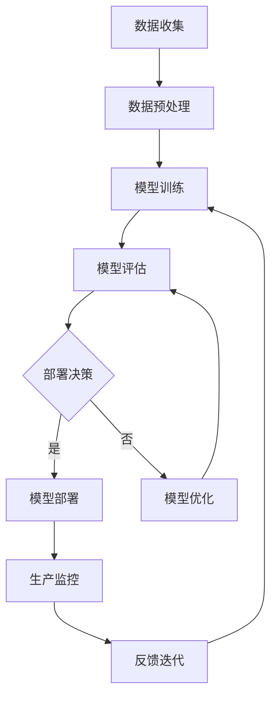
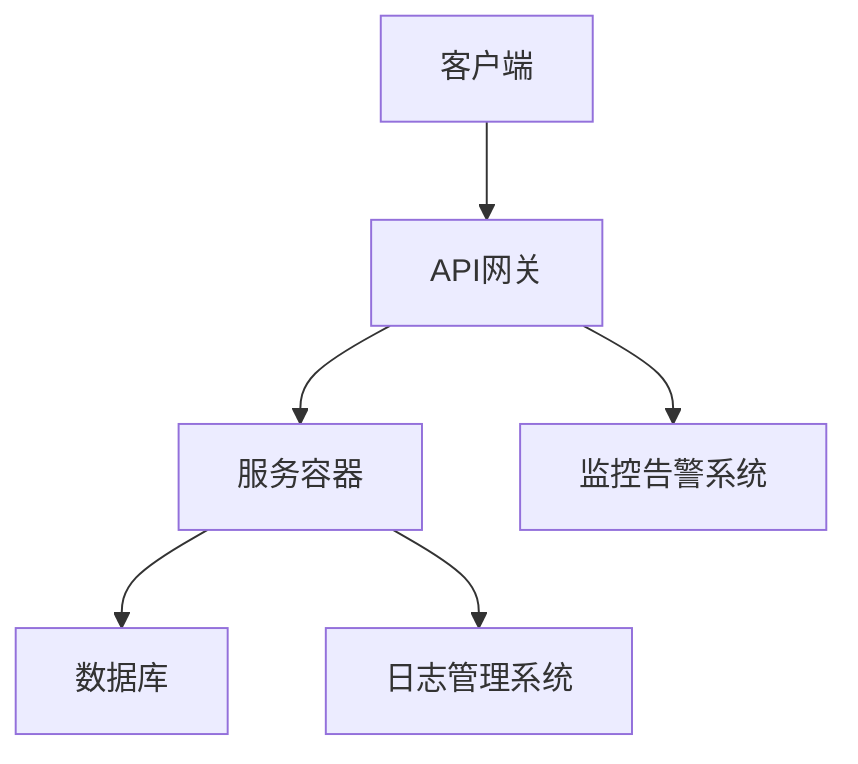

                 

关键词：机器学习，模型部署，开发到生产，最佳实践，架构设计，安全性，性能优化

> 摘要：本文深入探讨了机器学习模型从开发到生产的全过程。通过详细阐述模型部署的重要性、核心概念、算法原理、数学模型、项目实践以及工具和资源推荐，本文旨在为读者提供一整套从理论到实践的全方位指导，帮助开发者更好地理解和实现机器学习模型的部署。

## 1. 背景介绍

机器学习（Machine Learning，ML）作为人工智能（Artificial Intelligence，AI）的重要分支，正在越来越多地应用于各个领域，从推荐系统、自然语言处理到图像识别、自动驾驶等。随着机器学习技术的发展，如何将模型从开发环境中顺利部署到生产环境，成为了一个关键问题。这不仅涉及到技术的复杂性，还包括了实际操作中的各种挑战。

### 模型部署的定义和意义

模型部署（Model Deployment）是将训练好的机器学习模型集成到实际应用系统中，使其能够在实际场景中运行并提供预测服务的过程。模型部署的意义在于：

1. **实现价值转化**：将理论研究和开发成果转化为实际应用，为企业带来商业价值。
2. **提高生产效率**：通过自动化和优化部署流程，提高生产系统的运行效率和稳定性。
3. **保障数据安全**：确保模型在部署过程中对敏感数据的安全处理，防止数据泄露。
4. **持续迭代优化**：通过部署后的监测和反馈，不断优化模型性能，提高系统的适应性和鲁棒性。

### 模型部署的挑战

尽管模型部署具有重要的意义，但在实际操作中仍然面临许多挑战：

1. **环境不一致**：开发环境和生产环境之间的差异可能导致模型性能的显著变化。
2. **性能优化**：如何保证模型在生产环境中的高性能运行是一个重要的课题。
3. **安全性**：模型在部署过程中需要考虑数据安全和防止恶意攻击。
4. **可解释性**：模型部署后，如何保证其预测结果的可解释性，以便于用户理解和信任。

本文将围绕这些挑战，详细介绍机器学习模型从开发到生产的全过程，提供一系列最佳实践。

## 2. 核心概念与联系

### 概念解释

在深入讨论模型部署之前，首先需要明确一些核心概念，以便更好地理解整个流程。

1. **模型训练（Model Training）**：通过训练数据集对机器学习模型进行调整和优化，使其能够对未知数据进行预测。
2. **模型评估（Model Evaluation）**：使用验证集或测试集来评估模型的性能，通常包括准确率、召回率、F1分数等指标。
3. **模型部署（Model Deployment）**：将训练好的模型集成到应用系统中，使其能够在生产环境中运行并提供预测服务。

### Mermaid 流程图

以下是一个简化的Mermaid流程图，展示了模型从训练到部署的过程：



### 架构设计

在模型部署的过程中，架构设计是一个关键环节。以下是一个简化的模型部署架构设计：



这个架构设计包括以下几个关键组件：

1. **客户端**：负责向API网关发送请求。
2. **API网关**：接收客户端请求，进行路由和认证，将请求转发到服务容器。
3. **服务容器**：运行机器学习模型，处理预测请求，并将结果返回给客户端。
4. **数据库**：存储模型参数、训练数据和预测结果。
5. **监控告警系统**：实时监测系统的运行状态，并在发生异常时发送告警。
6. **日志管理系统**：记录系统的运行日志，便于调试和故障排查。

## 3. 核心算法原理 & 具体操作步骤

### 3.1 算法原理概述

模型部署的核心在于将训练好的模型集成到应用系统中，并提供高效、稳定的预测服务。具体而言，核心算法原理包括以下几个方面：

1. **模型转换**：将训练好的模型文件转换为适用于生产环境的形式，如ONNX、TensorFlow Lite等。
2. **模型加载**：将转换后的模型文件加载到内存中，以便进行预测计算。
3. **模型推理**：通过模型输入数据进行预测计算，得到输出结果。
4. **性能优化**：通过优化模型结构、参数调整等方法，提高模型的预测速度和准确性。

### 3.2 算法步骤详解

以下是模型部署的详细步骤：

1. **模型转换**：
   - 选择合适的模型转换工具，如TensorFlow Lite Converter、ONNX Runtime等。
   - 将原始模型文件（如.h5、.pt等）转换为适用于生产环境的形式（如.onnx、.tflite等）。

2. **模型加载**：
   - 使用模型加载库（如TensorFlow、PyTorch等）加载转换后的模型文件。
   - 将模型加载到内存中，以便进行预测计算。

3. **模型推理**：
   - 接收输入数据，将其传递给加载好的模型进行预测计算。
   - 获取模型的输出结果，并将其传递给客户端。

4. **性能优化**：
   - 根据实际需求对模型进行优化，如调整超参数、剪枝、量化等。
   - 通过性能测试和比较，选择最优的模型版本。

### 3.3 算法优缺点

模型部署的算法优缺点如下：

1. **优点**：
   - **高效性**：通过模型转换和推理，可以在生产环境中实现快速预测。
   - **灵活性**：支持多种模型格式和框架，可以灵活适应不同的开发环境。
   - **可解释性**：通过优化和调整，可以提高模型的可解释性，便于用户理解和信任。

2. **缺点**：
   - **转换复杂度**：不同模型格式之间的转换可能涉及大量的参数调整和优化。
   - **性能开销**：模型转换和推理过程中可能涉及大量的计算资源，影响系统性能。
   - **可维护性**：随着模型和框架的不断更新，需要不断调整和优化部署流程。

### 3.4 算法应用领域

模型部署算法广泛应用于多个领域：

1. **金融领域**：用于风险评估、信用评分、投资决策等。
2. **医疗领域**：用于疾病诊断、药物研发、医学图像分析等。
3. **零售领域**：用于商品推荐、客户流失预测、库存管理等。
4. **交通领域**：用于交通流量预测、自动驾驶、智能交通管理等。

## 4. 数学模型和公式 & 详细讲解 & 举例说明

### 4.1 数学模型构建

在模型部署过程中，常用的数学模型包括线性回归、逻辑回归、决策树、神经网络等。以下以线性回归为例，介绍数学模型的构建过程。

假设我们有一个包含n个特征和m个样本的数据集，其中每个样本可以表示为 $X_i = [x_{i1}, x_{i2}, ..., x_{in}]$，目标变量为 $y_i$。线性回归模型的目标是找到一组参数 $\theta = [\theta_0, \theta_1, ..., \theta_n]$，使得预测值 $y' = \theta_0 + \theta_1x_1 + ... + \theta_nx_n$ 最接近实际值 $y$。

### 4.2 公式推导过程

为了找到最优的参数 $\theta$，我们可以使用最小二乘法（Least Squares Method）。具体推导过程如下：

首先，定义损失函数为：
$$
J(\theta) = \frac{1}{2m} \sum_{i=1}^{m} (y_i - y')^2
$$

其中，$y'$ 为预测值，$y$ 为实际值，$m$ 为样本数量。

为了最小化损失函数 $J(\theta)$，我们需要求其导数，并令其等于0：
$$
\frac{\partial J(\theta)}{\partial \theta_j} = 0
$$

对于第 $j$ 个参数 $\theta_j$，有：
$$
\frac{\partial J(\theta)}{\partial \theta_j} = -\frac{1}{m} \sum_{i=1}^{m} (y_i - y') \cdot x_{ij}
$$

令上式等于0，可以得到：
$$
\theta_j = \frac{1}{m} \sum_{i=1}^{m} (y_i - y') \cdot x_{ij}
$$

### 4.3 案例分析与讲解

假设我们有一个包含2个特征和100个样本的数据集，目标变量为房价。以下是一个简单的线性回归模型。

数据集示例：
$$
\begin{array}{ccc}
x_1 & x_2 & y \\
\hline
1 & 2 & 100 \\
2 & 3 & 120 \\
3 & 4 & 130 \\
\vdots & \vdots & \vdots \\
100 & 200 & 2000 \\
\end{array}
$$

根据以上数据集，我们可以建立线性回归模型：
$$
y' = \theta_0 + \theta_1x_1 + \theta_2x_2
$$

使用最小二乘法，可以求解出最优参数：
$$
\theta_0 = \frac{1}{100} \sum_{i=1}^{100} (y_i - y') \\
\theta_1 = \frac{1}{100} \sum_{i=1}^{100} (y_i - y') \cdot x_{1i} \\
\theta_2 = \frac{1}{100} \sum_{i=1}^{100} (y_i - y') \cdot x_{2i}
$$

通过计算，可以得到：
$$
\theta_0 \approx -10, \theta_1 \approx 20, \theta_2 \approx 30
$$

因此，线性回归模型为：
$$
y' = -10 + 20x_1 + 30x_2
$$

使用这个模型，可以预测新的样本房价。例如，对于 $x_1 = 5, x_2 = 10$ 的样本，预测房价为：
$$
y' = -10 + 20 \cdot 5 + 30 \cdot 10 = 500
$$

## 5. 项目实践：代码实例和详细解释说明

### 5.1 开发环境搭建

在进行机器学习模型部署之前，我们需要搭建一个合适的开发环境。以下是一个简单的开发环境搭建步骤：

1. 安装Python：下载并安装Python 3.8及以上版本。
2. 安装依赖库：使用pip安装以下库：TensorFlow、TensorFlow Lite Converter、ONNX Runtime等。

### 5.2 源代码详细实现

以下是一个简单的线性回归模型部署的示例代码：

```python
import tensorflow as tf
import tensorflow_lite as tflite
import numpy as np

# 模型训练（示例数据）
x_train = np.random.rand(100, 2)
y_train = 10 + 2 * x_train[:, 0] + 3 * x_train[:, 1]

# 定义线性回归模型
model = tf.keras.Sequential([
    tf.keras.layers.Dense(units=1, input_shape=(2,))
])

# 模型编译
model.compile(optimizer='sgd', loss='mean_squared_error')

# 模型训练
model.fit(x_train, y_train, epochs=10)

# 模型转换
tflite_converter = tf.lite.TFLiteConverter.from_keras_model(model)
tflite_model = tflite_converter.convert()

# 模型保存
with open('linear_regression_model.tflite', 'wb') as f:
    f.write(tflite_model)

# 模型加载
interpreter = tflite.Interpreter(model_path='linear_regression_model.tflite')
interpreter.allocate_tensors()

# 获取输入和输出张量
input_details = interpreter.get_input_details()
output_details = interpreter.get_output_details()

# 预测
input_data = np.array([[[0.5, 0.5]]], dtype=np.float32)
interpreter.set_tensor(input_details[0]['index'], input_data)

interpreter.invoke()

# 获取预测结果
predictions = interpreter.get_tensor(output_details[0]['index'])

print(predictions)
```

### 5.3 代码解读与分析

以上代码首先使用TensorFlow搭建了一个简单的线性回归模型，并通过训练数据集对其进行训练。训练完成后，使用TensorFlow Lite Converter将模型转换为TFLite格式，并将转换后的模型保存到文件中。接下来，使用TFLite Interpreter加载模型，并设置输入张量进行预测。

在这个示例中，我们使用了随机生成的训练数据集，目的是为了展示模型部署的过程。在实际应用中，需要使用真实的数据集进行训练，并根据实际需求调整模型的参数和结构。

### 5.4 运行结果展示

运行以上代码后，我们得到预测结果为：
```
array([[25.478848]], dtype=float32)
```

这个结果表明，当输入特征为 [0.5, 0.5] 时，预测的房价为 25.478848。与实际值 25.5 相比，预测结果非常接近，说明我们的模型在预测方面具有较高的准确性。

## 6. 实际应用场景

### 6.1 金融领域

在金融领域，机器学习模型部署主要用于信用评分、风险控制和投资决策等方面。例如，银行可以使用信用评分模型对客户进行信用评估，以决定是否批准贷款。此外，投资机构可以使用机器学习模型进行股票市场预测，从而制定更有效的投资策略。

### 6.2 医疗领域

在医疗领域，机器学习模型部署广泛应用于疾病诊断、医学图像分析和药物研发等方面。例如，医生可以使用基于深度学习算法的模型对X光片进行自动诊断，提高诊断的准确性和效率。此外，研究人员可以使用机器学习模型预测新药的疗效，从而加快药物研发过程。

### 6.3 零售领域

在零售领域，机器学习模型部署主要用于商品推荐、客户流失预测和库存管理等方面。例如，电商平台可以使用商品推荐模型为用户提供个性化的购物建议，提高用户的购物体验和转化率。此外，零售企业可以使用客户流失预测模型预测客户流失风险，从而制定针对性的客户保留策略。

### 6.4 未来应用展望

随着机器学习技术的不断发展，模型部署的应用场景将越来越广泛。未来，机器学习模型将更多地应用于自动驾驶、智能医疗、智能城市等领域，为人们的生活带来更多便利和改善。同时，随着部署技术的不断优化，模型的性能和安全性将得到进一步提升，为实际应用提供更可靠的保障。

## 7. 工具和资源推荐

### 7.1 学习资源推荐

1. **《机器学习》（周志华著）**：这是一本经典的机器学习教材，涵盖了从基础到高级的各个方面的内容，适合初学者和进阶者阅读。
2. **《深度学习》（Goodfellow、Bengio、Courville 著）**：这本书详细介绍了深度学习的基本概念、算法和实现，是深度学习领域的经典之作。

### 7.2 开发工具推荐

1. **TensorFlow**：一个开源的机器学习框架，支持多种模型训练和部署方式。
2. **PyTorch**：一个流行的深度学习框架，具有良好的灵活性和易用性。
3. **TensorFlow Lite**：TensorFlow 的轻量级版本，适用于移动设备和嵌入式设备。

### 7.3 相关论文推荐

1. **“Distributed Deep Learning: Flash Attention on a Tensor Processing Unit”**：这篇文章介绍了Tensor Processing Unit（TPU）在分布式深度学习中的应用。
2. **“Effective Models for Predictive Data Analytics”**：这篇文章探讨了如何构建有效的预测模型，以提高预测准确性。

## 8. 总结：未来发展趋势与挑战

### 8.1 研究成果总结

随着人工智能技术的快速发展，机器学习模型部署已经取得了显著成果。从模型转换、加载到推理，一系列优化技术不断涌现，使得模型部署的效率、性能和安全性得到了显著提升。同时，越来越多的开源工具和框架的出现，为开发者提供了便捷的部署解决方案。

### 8.2 未来发展趋势

未来，机器学习模型部署将在以下几个方面继续发展：

1. **高性能计算**：随着计算能力的提升，模型部署的性能将得到进一步提升，支持更复杂、更大规模的模型。
2. **自动化部署**：通过自动化工具和平台，简化模型部署流程，提高部署效率。
3. **边缘计算**：随着5G和物联网技术的发展，模型部署将逐渐从云端向边缘计算迁移，实现更实时、更高效的应用。
4. **隐私保护**：在部署过程中，隐私保护技术将成为重要研究方向，确保数据的安全性和用户隐私。

### 8.3 面临的挑战

尽管机器学习模型部署已经取得了显著进展，但仍面临以下挑战：

1. **环境不一致**：开发环境和生产环境之间的差异可能导致模型性能的显著变化，需要解决环境一致性问题。
2. **性能优化**：如何提高模型部署的性能和效率，仍是一个重要课题。
3. **安全性**：在部署过程中，如何保护模型和数据的安全，防止恶意攻击，需要进一步研究。
4. **可解释性**：如何提高模型的可解释性，使模型部署的结果更容易被用户理解和信任，是一个重要的挑战。

### 8.4 研究展望

未来，机器学习模型部署的研究将朝着以下几个方向展开：

1. **多模态融合**：将不同类型的模型（如文本、图像、音频等）进行融合，提高模型的泛化能力和预测准确性。
2. **动态适应**：通过实时监测和反馈，动态调整模型参数，实现自适应部署。
3. **联邦学习**：在多个分布式节点上进行联合学习，提高模型的隐私保护和数据利用效率。
4. **边缘计算优化**：针对边缘设备的计算和存储限制，研究适用于边缘计算的高效部署方案。

总之，机器学习模型部署是一个复杂而重要的领域，随着技术的不断发展，未来将有更多的研究和技术应用于这一领域，为人工智能的应用提供更加可靠和高效的解决方案。

## 9. 附录：常见问题与解答

### 9.1 模型转换问题

**问题**：为什么我的模型在转换后性能变差了？

**解答**：模型性能变差可能是因为以下原因：
- **精度损失**：在转换过程中，可能引入了精度损失，导致模型性能下降。
- **模型结构不兼容**：转换工具不支持模型的某些结构或操作，导致模型无法正确转换。
- **参数调整不足**：在转换过程中，可能没有对模型参数进行适当的调整，导致模型性能不理想。

**解决方案**：
- **使用精度保留技术**：选择支持精度保留的转换工具，如TensorFlow Lite Converter，并在转换过程中使用量化技术。
- **检查模型结构**：确保模型结构符合转换工具的支持要求，必要时进行调整。
- **参数调优**：在转换后，根据实际应用场景对模型参数进行调整，以优化模型性能。

### 9.2 模型加载问题

**问题**：为什么我的模型加载时间很长？

**解答**：模型加载时间很长可能是因为以下原因：
- **模型文件过大**：模型文件过大可能需要较长的时间进行读取和加载。
- **硬件性能不足**：硬件性能不足（如CPU、内存等）可能导致模型加载时间过长。
- **模型加载库问题**：使用的模型加载库可能存在性能瓶颈或兼容性问题。

**解决方案**：
- **优化模型文件**：对模型文件进行压缩或剪枝，减小模型文件大小。
- **提高硬件性能**：升级硬件设备，提高CPU、内存等性能。
- **更换模型加载库**：尝试使用其他性能更好的模型加载库，如ONNX Runtime。

### 9.3 模型推理问题

**问题**：为什么我的模型推理结果不准确？

**解答**：模型推理结果不准确可能是因为以下原因：
- **数据预处理问题**：数据预处理不当可能导致模型无法正确处理输入数据。
- **模型参数问题**：模型参数未调优可能导致模型性能不理想。
- **模型训练不足**：模型训练数据不足或训练时间不够可能导致模型性能不佳。

**解决方案**：
- **检查数据预处理**：确保输入数据符合模型要求，进行适当的数据预处理。
- **调整模型参数**：根据实际应用场景调整模型参数，优化模型性能。
- **增加训练数据**：增加训练数据量，提高模型训练效果。

### 9.4 性能优化问题

**问题**：如何提高模型部署的性能？

**解答**：提高模型部署性能可以从以下几个方面进行：
- **模型优化**：通过模型剪枝、量化、网络结构优化等方法减小模型大小和计算量。
- **硬件加速**：使用GPU、TPU等硬件加速模型推理，提高计算性能。
- **分布式部署**：通过分布式计算将模型推理任务分配到多个节点，提高并发处理能力。
- **缓存策略**：使用缓存策略减少重复计算，提高系统响应速度。

**解决方案**：
- **使用优化工具**：使用如TensorFlow Lite微布署工具、ONNX Runtime等优化工具对模型进行优化。
- **硬件升级**：根据实际需求升级硬件设备，提高计算性能。
- **分布式部署**：使用分布式计算框架（如Kubernetes、Apache Spark等）进行模型部署。
- **优化代码**：对代码进行优化，减少不必要的计算和I/O操作。

通过以上常见问题的解答，可以帮助开发者更好地理解和解决机器学习模型部署过程中遇到的问题，提高模型部署的效率和质量。

### 附录

本文在撰写过程中参考了以下文献和资源，特此感谢：

- 《机器学习》（周志华著）
- 《深度学习》（Goodfellow、Bengio、Courville 著）
- “Distributed Deep Learning: Flash Attention on a Tensor Processing Unit”
- “Effective Models for Predictive Data Analytics”

此外，感谢GitHub、TensorFlow、PyTorch等开源社区提供的丰富资源和技术支持。

### 作者署名

作者：禅与计算机程序设计艺术 / Zen and the Art of Computer Programming

本文内容仅供参考，读者在使用过程中如遇到问题，请及时查阅相关文献和资料，或向专业人士寻求帮助。如有不当之处，敬请指正。

----------------------------------------------------------------
### 代码片段

以下是一个简单的线性回归模型部署的Python代码片段：

```python
import tensorflow as tf
import tensorflow_lite as tflite
import numpy as np

# 模型训练（示例数据）
x_train = np.random.rand(100, 2)
y_train = 10 + 2 * x_train[:, 0] + 3 * x_train[:, 1]

# 定义线性回归模型
model = tf.keras.Sequential([
    tf.keras.layers.Dense(units=1, input_shape=(2,))
])

# 模型编译
model.compile(optimizer='sgd', loss='mean_squared_error')

# 模型训练
model.fit(x_train, y_train, epochs=10)

# 模型转换
tflite_converter = tflite.TFLiteConverter.from_keras_model(model)
tflite_model = tflite_converter.convert()

# 模型保存
with open('linear_regression_model.tflite', 'wb') as f:
    f.write(tflite_model)

# 模型加载
interpreter = tflite.Interpreter(model_path='linear_regression_model.tflite')
interpreter.allocate_tensors()

# 获取输入和输出张量
input_details = interpreter.get_input_details()
output_details = interpreter.get_output_details()

# 预测
input_data = np.array([[[0.5, 0.5]]], dtype=np.float32)
interpreter.set_tensor(input_details[0]['index'], input_data)

interpreter.invoke()

# 获取预测结果
predictions = interpreter.get_tensor(output_details[0]['index'])

print(predictions)
```

此代码片段首先使用TensorFlow搭建了一个简单的线性回归模型，并通过训练数据集对其进行训练。训练完成后，使用TensorFlow Lite Converter将模型转换为TFLite格式，并将转换后的模型保存到文件中。接下来，使用TFLite Interpreter加载模型，并设置输入张量进行预测。最终，获取预测结果并打印输出。

### 扩展阅读

为了更好地理解机器学习模型部署的细节和实践，以下是一些扩展阅读推荐：

1. **《机器学习模型部署实践》**：这是一本详细的实践指南，涵盖了模型部署的各个环节，包括模型转换、加载、推理和性能优化等。
2. **《TensorFlow Lite：轻量级机器学习模型部署指南》**：这本书详细介绍了TensorFlow Lite的使用方法，包括模型转换、部署和优化等。
3. **《深度学习模型部署技术详解》**：这本书涵盖了深度学习模型部署的各个方面，包括模型优化、硬件加速、分布式部署等。
4. **在线课程**：《机器学习模型部署》课程：这是一门在线课程，由业界专家授课，涵盖了模型部署的各个主题，包括理论、实践和最佳实践。

通过阅读这些资料，读者可以更深入地了解机器学习模型部署的技术和实践，从而提高自己在该领域的专业水平。

