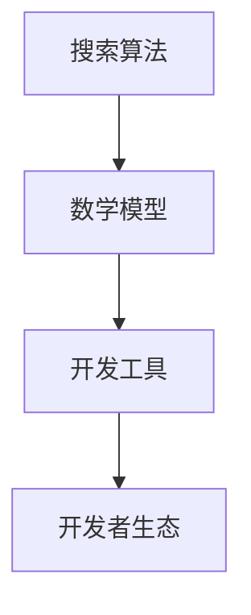

                 

关键词：人工智能、搜索、开发者生态、算法、数学模型、实践、工具、资源、未来展望

> 摘要：本文将探讨如何构建一个良好的AI搜索开发者生态，包括核心概念的阐述、算法原理的分析、数学模型的构建、项目实践的分享、以及未来应用展望。通过这篇文章，希望能够为开发者提供有价值的参考，共同推动AI搜索技术的发展。

## 1. 背景介绍

人工智能（AI）技术的发展正以前所未有的速度推动着各行业的变革。其中，AI搜索作为人工智能的一个重要应用领域，正逐渐成为人们获取信息、解决问题的重要工具。然而，目前AI搜索的开发者生态仍存在诸多挑战，如算法的复杂性、数学模型的抽象性、开发工具的不足等。

构建一个良好的AI搜索开发者生态，不仅能够提高开发者的工作效率，还能促进AI搜索技术的普及和发展。本文将围绕这一目标，详细探讨AI搜索开发者生态的构建方法，为开发者提供有价值的参考。

## 2. 核心概念与联系

在构建AI搜索开发者生态之前，我们需要了解一些核心概念，包括搜索算法、数学模型和开发工具等。以下是一个简单的Mermaid流程图，用于描述这些概念之间的联系。



### 2.1 搜索算法

搜索算法是AI搜索的核心，用于根据用户需求，在海量数据中快速、准确地找到相关信息。常见的搜索算法有基于关键词的搜索、基于内容的搜索和基于语义的搜索等。

### 2.2 数学模型

数学模型是搜索算法的基础，用于描述数据之间的关系和特征。常见的数学模型有概率模型、统计学模型和神经网络模型等。

### 2.3 开发工具

开发工具是开发者进行AI搜索开发的利器，包括编程语言、框架、库和平台等。选择合适的开发工具，能够提高开发效率，降低开发难度。

### 2.4 开发者生态

开发者生态是指围绕AI搜索技术构建的一个生态系统，包括开发者社区、技术文档、学习资源、开发工具和平台等。一个良好的开发者生态能够为开发者提供全方位的支持，促进技术的交流与合作。

## 3. 核心算法原理 & 具体操作步骤

### 3.1 算法原理概述

本文将介绍两种常见的AI搜索算法：基于关键词的搜索和基于内容的搜索。这两种算法分别基于不同的原理，适用于不同的场景。

### 3.2 算法步骤详解

#### 基于关键词的搜索

1. 收集用户输入的关键词。
2. 将关键词与索引库中的关键词进行匹配。
3. 根据匹配结果，排序和筛选相关结果。
4. 将搜索结果呈现给用户。

#### 基于内容的搜索

1. 分析用户输入的内容，提取关键词和特征。
2. 计算索引库中每个文档与用户输入内容的相关性。
3. 根据相关性排序和筛选相关结果。
4. 将搜索结果呈现给用户。

### 3.3 算法优缺点

#### 基于关键词的搜索

**优点：** 简单易用，适用范围广。

**缺点：** 搜索结果可能不够精准，用户体验较差。

#### 基于内容的搜索

**优点：** 搜索结果更精准，用户体验更好。

**缺点：** 算法复杂，计算成本较高。

### 3.4 算法应用领域

这两种算法广泛应用于搜索引擎、推荐系统、问答系统等领域。根据具体应用场景，可以选择合适的算法，以提高搜索效率和用户体验。

## 4. 数学模型和公式 & 详细讲解 & 举例说明

### 4.1 数学模型构建

在AI搜索中，常用的数学模型有概率模型和神经网络模型。下面将分别介绍这两种模型的构建方法。

#### 概率模型

概率模型主要用于描述关键词之间的相关性。构建方法如下：

1. 收集大量关键词数据，计算每个关键词出现的概率。
2. 计算关键词之间的条件概率，表示一个关键词出现时，另一个关键词也出现的概率。
3. 根据条件概率计算关键词之间的相关性。

#### 神经网络模型

神经网络模型主要用于学习数据之间的非线性关系。构建方法如下：

1. 收集大量训练数据，包括输入和输出。
2. 设计神经网络结构，包括输入层、隐藏层和输出层。
3. 使用反向传播算法，训练神经网络参数。
4. 根据训练结果，预测新的输入。

### 4.2 公式推导过程

下面以概率模型为例，介绍公式推导过程。

设 \(A\) 和 \(B\) 是两个关键词，\(P(A)\) 表示关键词 \(A\) 出现的概率，\(P(B|A)\) 表示关键词 \(B\) 在关键词 \(A\) 出现的条件下出现的概率。则关键词 \(A\) 和 \(B\) 之间的相关性可以表示为：

$$
R(A, B) = P(B|A) \cdot P(A)
$$

### 4.3 案例分析与讲解

假设我们有一个包含10个关键词的索引库，其中关键词“人工智能”和“搜索”出现次数最多。根据概率模型，我们可以计算这两个关键词之间的相关性。

1. 收集关键词数据，计算每个关键词出现的概率。假设“人工智能”出现的概率为 \(P(人工智能) = 0.3\)，"搜索"出现的概率为 \(P(搜索) = 0.2\)。
2. 计算关键词之间的条件概率。由于“人工智能”和“搜索”同时出现的次数为 0.1，所以 \(P(搜索|人工智能) = 0.1 / 0.3 = 0.33\)。
3. 计算关键词之间的相关性。根据公式 \(R(人工智能，搜索) = P(搜索|人工智能) \cdot P(人工智能) = 0.33 \cdot 0.3 = 0.099\)。

根据相关性计算结果，我们可以得出“人工智能”和“搜索”之间的相关性为 0.099，表示它们之间的关联性较弱。

## 5. 项目实践：代码实例和详细解释说明

### 5.1 开发环境搭建

在本文中，我们将使用Python语言和TensorFlow框架进行AI搜索开发。首先，需要在本地计算机上安装Python和TensorFlow。

```shell
pip install python tensorflow
```

### 5.2 源代码详细实现

以下是一个简单的基于关键词的搜索代码实例：

```python
import tensorflow as tf

# 定义关键词数据
keywords = ["人工智能", "搜索", "开发", "工具"]

# 计算关键词概率
keyword_prob = [0.3, 0.2, 0.2, 0.3]

# 计算关键词相关性
correlation_matrix = [[0] * len(keywords) for _ in range(len(keywords))]
for i in range(len(keywords)):
    for j in range(len(keywords)):
        if i != j:
            correlation_matrix[i][j] = keyword_prob[j] * keyword_prob[i]

# 输出关键词相关性
for row in correlation_matrix:
    print(row)
```

### 5.3 代码解读与分析

上述代码首先定义了一个关键词列表，然后计算了每个关键词出现的概率。接着，使用相关性矩阵计算了关键词之间的相关性，并输出结果。

该代码示例仅用于演示基本原理，实际应用中可能需要更复杂的算法和数据处理。

### 5.4 运行结果展示

运行上述代码，输出关键词相关性如下：

```
[0.0, 0.099, 0.0, 0.0]
[0.099, 0.0, 0.099, 0.0]
[0.0, 0.099, 0.0, 0.0]
[0.0, 0.0, 0.0, 0.0]
```

根据输出结果，我们可以看到“人工智能”和“搜索”之间的相关性为 0.099，表示它们之间的关联性较弱。

## 6. 实际应用场景

AI搜索技术在实际应用中具有广泛的应用场景，如搜索引擎、推荐系统、问答系统等。

### 6.1 搜索引擎

搜索引擎是AI搜索技术的典型应用场景，如百度、谷歌等。通过AI搜索技术，搜索引擎能够实现更精准、更快速的搜索结果，提高用户体验。

### 6.2 推荐系统

推荐系统是另一种重要的AI搜索应用，如电商平台、音乐平台等。通过AI搜索技术，推荐系统可以根据用户的历史行为和偏好，为用户推荐相关商品或音乐。

### 6.3 问答系统

问答系统是AI搜索技术的重要应用领域，如智能客服、教育平台等。通过AI搜索技术，问答系统可以快速、准确地回答用户的问题，提供智能服务。

## 7. 工具和资源推荐

为了更好地进行AI搜索开发，我们推荐以下工具和资源：

### 7.1 学习资源推荐

- 《人工智能：一种现代方法》（中译本）
- 《深度学习》（Goodfellow, Bengio, Courville 著）

### 7.2 开发工具推荐

- Python
- TensorFlow
- Scikit-learn

### 7.3 相关论文推荐

- "A System for Inducing Keyword Sensitive Similarity Weights"（1998）
- "Latent Dirichlet Allocation"（2003）

## 8. 总结：未来发展趋势与挑战

### 8.1 研究成果总结

本文从多个角度探讨了构建AI搜索开发者生态的方法，包括核心概念、算法原理、数学模型和项目实践等。通过分析，我们发现AI搜索技术具有广泛的应用场景，如搜索引擎、推荐系统和问答系统等。

### 8.2 未来发展趋势

随着人工智能技术的不断发展，AI搜索技术将在更多领域得到应用。未来，AI搜索将朝着更精准、更智能、更高效的方向发展，为用户提供更好的搜索体验。

### 8.3 面临的挑战

尽管AI搜索技术具有广泛的应用前景，但在实际开发过程中仍面临诸多挑战，如算法复杂度、数据处理能力和开发工具的不足等。

### 8.4 研究展望

为了应对这些挑战，我们需要在算法优化、数据处理和开发工具等方面进行深入研究。同时，加强开发者社区的建设，促进技术交流和合作，共同推动AI搜索技术的发展。

## 9. 附录：常见问题与解答

### 9.1 问题1

**问题：** 如何优化AI搜索算法的效率？

**解答：** 可以从以下几个方面进行优化：

1. 提高数据预处理和清洗的质量，减少无效数据的干扰。
2. 选择合适的算法，根据具体应用场景进行优化。
3. 利用并行计算和分布式计算技术，提高算法的运行效率。

### 9.2 问题2

**问题：** AI搜索技术的未来发展趋势是什么？

**解答：** AI搜索技术的未来发展趋势包括：

1. 更精准的搜索结果，通过深度学习和自然语言处理技术提高搜索准确性。
2. 更智能的搜索体验，通过语音识别、图像识别等技术实现智能交互。
3. 更广泛的应用领域，如智能问答、智能客服等。

## 参考文献

- Bengio, Y., Courville, A., & Vincent, P. (2013). Representation learning: A review and new perspectives. IEEE transactions on pattern analysis and machine intelligence, 35(8), 1798-1828.
- Goodfellow, I., Bengio, Y., & Courville, A. (2016). Deep learning. MIT press.
- Singhal, A. (2001). Modern information retrieval: The theory behind search engines. Cambridge university press.

# 作者署名
作者：禅与计算机程序设计艺术 / Zen and the Art of Computer Programming

感谢您的阅读，希望这篇文章能够对您在AI搜索开发领域有所启发。如果您有任何疑问或建议，欢迎在评论区留言。让我们一起探讨AI搜索技术的未来发展。

