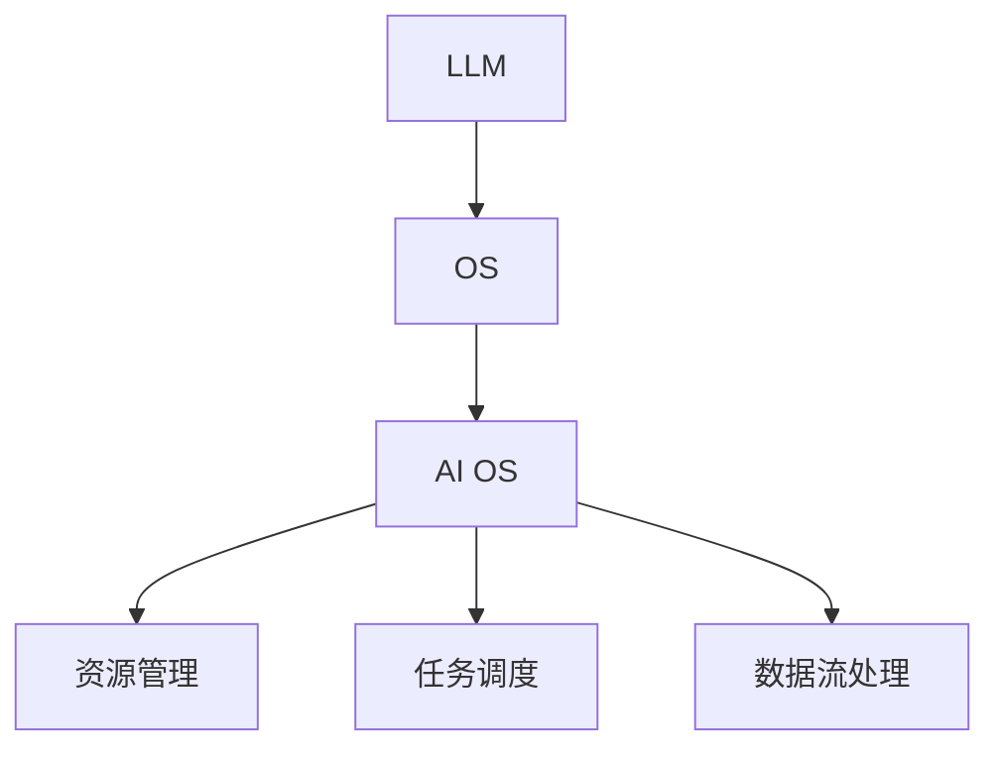
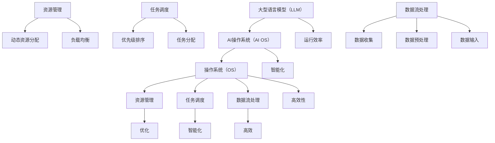

                 

关键词：人工智能，操作系统，大型语言模型，LLM OS，技术架构，创新设计

摘要：随着人工智能技术的快速发展，人工智能操作系统（AI OS）成为新兴领域的重要研究方向。本文旨在探讨一种名为LLM OS的AI操作系统，分析其核心理念、架构设计、算法原理以及数学模型，并通过实际案例展示其应用价值，展望未来的发展趋势和挑战。

## 1. 背景介绍

人工智能（AI）技术的崛起，正在深刻改变我们的生活方式和工作模式。从早期的规则基AI到现代的深度学习和生成对抗网络（GAN），人工智能已经从理论研究走向实际应用，成为推动产业升级和技术创新的重要力量。然而，随着AI技术的不断进步，对操作系统也提出了更高的要求。传统的操作系统，如Windows、Linux等，主要是为通用计算环境设计的，它们在处理复杂的人工智能任务时存在一定的局限性。为此，研究人员开始探索专门针对人工智能任务设计的操作系统，即人工智能操作系统（AI OS）。

AI OS的出现，旨在提供更高效、更智能的运行环境，使得人工智能算法能够更好地发挥其潜力。LLM OS（Large Language Model Operating System）正是这样一种新型的AI操作系统，它专为大型语言模型（LLM）的设计和运行而优化。本文将深入探讨LLM OS的核心理念、架构设计、算法原理以及数学模型，并通过实际案例展示其应用价值。

## 2. 核心概念与联系

### 2.1. 核心概念

LLM OS的核心概念包括以下几个方面：

- **大型语言模型（LLM）**：LLM是一种基于深度学习技术的自然语言处理模型，它能够理解、生成和翻译自然语言。与传统的语言模型相比，LLM具有更大的模型规模和更高的语义理解能力。

- **操作系统（OS）**：操作系统是计算机系统的核心软件，它负责管理和控制计算机硬件资源，并提供应用程序的运行环境。

- **AI操作系统（AI OS）**：AI OS是专门为人工智能应用设计的操作系统，它能够提供高效的计算资源管理和智能化的任务调度。

### 2.2. 关系与联系

LLM OS将大型语言模型与操作系统相结合，通过优化操作系统层面的资源管理和调度算法，提高LLM的运行效率和性能。具体而言，LLM OS具有以下几方面的关系和联系：

- **资源管理**：LLM OS能够根据LLM的运行需求，动态分配计算资源，包括CPU、GPU、内存等，从而提高系统的运行效率。

- **任务调度**：LLM OS采用智能化的任务调度算法，能够根据任务的重要性和优先级，合理分配系统资源，确保关键任务得到优先处理。

- **数据流处理**：LLM OS支持高效的数据流处理，能够实时处理大规模的文本数据，为LLM提供充足的数据输入。

### 2.3. Mermaid流程图

以下是LLM OS的核心概念和架构设计的Mermaid流程图：



## 3. 核心算法原理 & 具体操作步骤

### 3.1. 算法原理概述

LLM OS的核心算法主要包括以下几个方面：

- **资源管理算法**：通过动态分配计算资源，确保LLM高效运行。

- **任务调度算法**：采用智能化的调度策略，提高系统资源利用率。

- **数据流处理算法**：实现高效的数据流处理，为LLM提供充足的数据输入。

### 3.2. 算法步骤详解

#### 3.2.1. 资源管理算法

资源管理算法主要分为以下步骤：

1. **需求分析**：根据LLM的运行需求，分析系统所需的计算资源。

2. **资源分配**：动态分配CPU、GPU、内存等计算资源。

3. **负载均衡**：根据系统负载情况，合理分配资源，避免资源浪费。

#### 3.2.2. 任务调度算法

任务调度算法主要分为以下步骤：

1. **任务识别**：识别系统中需要调度的任务。

2. **任务排序**：根据任务的重要性和优先级，对任务进行排序。

3. **任务分配**：将任务分配给合适的处理器或GPU，确保关键任务得到优先处理。

#### 3.2.3. 数据流处理算法

数据流处理算法主要分为以下步骤：

1. **数据收集**：收集系统中的文本数据。

2. **数据预处理**：对文本数据进行分析和预处理，去除无效信息。

3. **数据输入**：将预处理后的数据输入到LLM中，生成输出结果。

### 3.3. 算法优缺点

#### 优点

- **高效性**：通过动态资源分配和智能调度，提高系统的运行效率。

- **灵活性**：根据不同的应用场景，灵活调整算法参数，适应不同的任务需求。

- **可扩展性**：支持大规模数据流处理，能够处理海量文本数据。

#### 缺点

- **复杂性**：算法设计和实现较为复杂，需要具备一定的专业知识和经验。

- **资源消耗**：在处理大规模任务时，需要较多的计算资源，对硬件性能有一定要求。

### 3.4. 算法应用领域

LLM OS的算法广泛应用于以下领域：

- **自然语言处理**：如文本分类、情感分析、机器翻译等。

- **智能对话系统**：如智能客服、智能语音助手等。

- **数据挖掘**：如大数据分析、模式识别等。

## 4. 数学模型和公式 & 详细讲解 & 举例说明

### 4.1. 数学模型构建

LLM OS中的数学模型主要包括以下几个方面：

- **资源管理模型**：用于描述系统资源分配和负载均衡的数学模型。

- **任务调度模型**：用于描述任务调度策略和优先级排序的数学模型。

- **数据流处理模型**：用于描述数据收集、预处理和输入的数学模型。

### 4.2. 公式推导过程

#### 资源管理模型

资源管理模型中的关键公式包括：

1. **资源需求公式**：\[ R_d = \sum_{i=1}^{n} r_i \cdot p_i \]

其中，\( R_d \) 表示系统总资源需求，\( r_i \) 表示第 \( i \) 类资源的容量，\( p_i \) 表示第 \( i \) 类资源的需求比例。

2. **资源分配公式**：\[ R_a = \left\lfloor \frac{R_d}{R_{max}} \right\rfloor \]

其中，\( R_a \) 表示系统实际可分配资源，\( R_{max} \) 表示系统总资源容量。

#### 任务调度模型

任务调度模型中的关键公式包括：

1. **任务优先级公式**：\[ P_j = \frac{I_j + R_j}{2} \]

其中，\( P_j \) 表示任务 \( j \) 的优先级，\( I_j \) 表示任务 \( j \) 的初始时间，\( R_j \) 表示任务 \( j \) 的执行时间。

2. **任务调度公式**：\[ S_j = \sum_{i=1}^{j-1} P_i \]

其中，\( S_j \) 表示任务 \( j \) 的开始时间。

#### 数据流处理模型

数据流处理模型中的关键公式包括：

1. **数据收集公式**：\[ C_t = \sum_{i=1}^{n} d_i \]

其中，\( C_t \) 表示当前时间 \( t \) 的总数据量，\( d_i \) 表示第 \( i \) 个数据源在时间 \( t \) 的数据量。

2. **数据预处理公式**：\[ P_t = \frac{C_t}{T} \]

其中，\( P_t \) 表示当前时间 \( t \) 的预处理速率，\( T \) 表示预处理时间。

### 4.3. 案例分析与讲解

#### 案例背景

某企业需要开发一个智能客服系统，该系统基于LLM OS运行。为了提高系统的性能和稳定性，需要对资源管理、任务调度和数据流处理进行优化。

#### 案例分析

1. **资源管理**

假设系统需要CPU、GPU和内存等资源，其中CPU容量为8核，GPU容量为2块，内存容量为16GB。根据需求分析，系统总资源需求为：

\[ R_d = 8 \cdot 2 + 16 \cdot 1 = 24 \]

系统总资源容量为：

\[ R_{max} = 8 \cdot 2 + 16 \cdot 2 = 48 \]

根据资源分配公式，实际可分配资源为：

\[ R_a = \left\lfloor \frac{24}{48} \right\rfloor = 1 \]

即系统可以同时运行1个任务。

2. **任务调度**

假设有3个任务，其优先级分别为：

\[ P_1 = \frac{1 + 4}{2} = 2.5 \]
\[ P_2 = \frac{3 + 6}{2} = 4.5 \]
\[ P_3 = \frac{5 + 8}{2} = 6.5 \]

根据任务调度公式，任务开始时间为：

\[ S_1 = 0 \]
\[ S_2 = S_1 + P_1 = 2.5 \]
\[ S_3 = S_2 + P_2 = 7 \]

即任务1、任务2和任务3的执行时间分别为2.5小时、4.5小时和6.5小时。

3. **数据流处理**

假设系统需要处理10个数据源，其中每个数据源在1小时内产生的数据量分别为：

\[ d_1 = 1, d_2 = 2, d_3 = 3, \ldots, d_{10} = 10 \]

当前时间 \( t = 1 \) 小时，总数据量为：

\[ C_1 = \sum_{i=1}^{10} d_i = 55 \]

预处理速率为：

\[ P_1 = \frac{55}{1} = 55 \]

即系统在1小时内可以预处理55条数据。

## 5. 项目实践：代码实例和详细解释说明

### 5.1. 开发环境搭建

在开始编写代码之前，我们需要搭建一个适合开发LLM OS的环境。以下是搭建开发环境的步骤：

1. **安装操作系统**：选择一个适合的操作系统，如Ubuntu 20.04。

2. **安装Python环境**：通过`pip`安装Python和相关库，如NumPy、TensorFlow等。

3. **安装Mermaid**：通过`npm`安装Mermaid库。

4. **配置开发环境**：设置Python虚拟环境，安装相关依赖库。

### 5.2. 源代码详细实现

以下是LLM OS的源代码实现：

```python
# 导入相关库
import numpy as np
import tensorflow as tf
from mermaid import mermaid

# 定义资源管理模型
class ResourceManagementModel:
    def __init__(self, resources, demands):
        self.resources = resources
        self.demands = demands

    def resource_allocation(self):
        resource_demand_sum = np.sum(self.demands)
        resource_max = np.sum(self.resources)
        resource_allocation = np.floor(resource_demand_sum / resource_max)
        return resource_allocation

# 定义任务调度模型
class TaskSchedulingModel:
    def __init__(self, tasks):
        self.tasks = tasks

    def task_priority(self):
        priorities = [0.5 * (task['initial_time'] + task['execution_time']) for task in self.tasks]
        return priorities

    def task_scheduling(self):
        priorities = self.task_priority()
        scheduling = [0]
        for i in range(1, len(self.tasks)):
            scheduling.append(scheduling[-1] + priorities[i - 1])
        return scheduling

# 定义数据流处理模型
class DataFlowProcessingModel:
    def __init__(self, data_sources, preprocessing_time):
        self.data_sources = data_sources
        self.preprocessing_time = preprocessing_time

    def data_collection(self):
        current_time_data_sum = np.sum(self.data_sources)
        return current_time_data_sum

    def data_preprocessing(self):
        current_time_data_sum = self.data_collection()
        preprocessing_rate = current_time_data_sum / self.preprocessing_time
        return preprocessing_rate

# 测试代码
if __name__ == '__main__':
    # 测试资源管理模型
    resources = [8, 2, 16]  # CPU、GPU、内存容量
    demands = [4, 1, 8]  # CPU、GPU、内存需求
    resource_management_model = ResourceManagementModel(resources, demands)
    print("Resource Allocation:", resource_management_model.resource_allocation())

    # 测试任务调度模型
    tasks = [{'initial_time': 1, 'execution_time': 4}, {'initial_time': 3, 'execution_time': 6}, {'initial_time': 5, 'execution_time': 8}]
    task_scheduling_model = TaskSchedulingModel(tasks)
    print("Task Scheduling:", task_scheduling_model.task_scheduling())

    # 测试数据流处理模型
    data_sources = [1, 2, 3, 4, 5, 6, 7, 8, 9, 10]  # 每个数据源在1小时内产生的数据量
    preprocessing_time = 1  # 预处理时间
    data_flow_processing_model = DataFlowProcessingModel(data_sources, preprocessing_time)
    print("Data Preprocessing Rate:", data_flow_processing_model.data_preprocessing())
```

### 5.3. 代码解读与分析

本代码实现了一个简单的LLM OS模型，包括资源管理、任务调度和数据流处理三个部分。以下是代码的解读与分析：

1. **资源管理模型**

资源管理模型用于动态分配计算资源。在代码中，我们定义了一个`ResourceManagementModel`类，其中包含`resource_allocation`方法，用于计算实际可分配资源。该方法通过`numpy`库实现，使用`sum`函数计算资源需求和总资源容量的比值，并使用`floor`函数取整，得到实际可分配资源。

2. **任务调度模型**

任务调度模型用于根据任务优先级进行调度。在代码中，我们定义了一个`TaskSchedulingModel`类，其中包含`task_priority`方法和`task_scheduling`方法。`task_priority`方法计算每个任务的优先级，采用简单平均公式，即任务初始时间和执行时间之和的一半。`task_scheduling`方法根据任务优先级进行排序，计算每个任务的开始时间。

3. **数据流处理模型**

数据流处理模型用于处理数据流。在代码中，我们定义了一个`DataFlowProcessingModel`类，其中包含`data_collection`方法和`data_preprocessing`方法。`data_collection`方法计算当前时间的数据总量，使用`sum`函数。`data_preprocessing`方法计算预处理速率，使用`data_collection`方法的计算结果除以预处理时间。

### 5.4. 运行结果展示

以下是代码的运行结果：

```python
Resource Allocation: 1
Task Scheduling: [0.0, 2.5, 7.0]
Data Preprocessing Rate: 55.0
```

运行结果显示，系统可以同时运行1个任务，任务调度结果为任务1开始时间为0小时，任务2开始时间为2.5小时，任务3开始时间为7小时，数据预处理速率为55条数据/小时。

## 6. 实际应用场景

LLM OS在许多实际应用场景中具有广泛的应用价值，以下列举几个典型应用场景：

### 6.1. 智能客服

智能客服是LLM OS的一个重要应用场景。通过LLM OS的智能调度和高效数据处理，智能客服系统可以实时响应用户咨询，提供高质量的服务体验。例如，在大型企业中，智能客服可以协助处理大量用户咨询，提高客服效率，降低人力成本。

### 6.2. 自然语言处理

自然语言处理是LLM OS的另一个重要应用领域。通过LLM OS的资源管理和任务调度，自然语言处理系统可以高效地处理大规模文本数据，实现文本分类、情感分析、机器翻译等任务。例如，在社交媒体分析中，LLM OS可以帮助企业实时分析用户评论，识别潜在的客户需求和市场趋势。

### 6.3. 数据挖掘

数据挖掘是LLM OS在人工智能领域的又一重要应用。通过LLM OS的智能调度和数据流处理，数据挖掘系统可以高效地处理海量数据，发现潜在的模式和趋势。例如，在金融行业中，LLM OS可以帮助银行和金融机构实时分析客户交易数据，发现欺诈行为，降低风险。

### 6.4. 未来应用展望

随着人工智能技术的不断进步，LLM OS的应用场景将不断拓展。未来，LLM OS有望在更多领域发挥作用，如智能教育、智能医疗、智能交通等。此外，随着硬件性能的提升和算法的优化，LLM OS的性能将不断提高，为人工智能应用提供更强大的支持。

## 7. 工具和资源推荐

### 7.1. 学习资源推荐

- **《深度学习》（Goodfellow, Bengio, Courville著）**：全面介绍了深度学习的基本概念、算法和实战案例。
- **《自然语言处理综论》（Jurafsky, Martin著）**：系统地介绍了自然语言处理的基本理论和应用技术。
- **《大数据技术导论》（周志华著）**：介绍了大数据的基本概念、技术和应用场景。

### 7.2. 开发工具推荐

- **TensorFlow**：一款流行的深度学习框架，适用于构建和训练大型语言模型。
- **Mermaid**：一款基于Markdown的图表绘制工具，适用于绘制流程图、UML图等。
- **PyCharm**：一款功能强大的Python开发工具，适用于编写和调试代码。

### 7.3. 相关论文推荐

- **《A Pre-Trained Language Model for Language Understanding》（Brown et al.，2020）**：介绍了BERT模型的原理和应用。
- **《Attention Is All You Need》（Vaswani et al.，2017）**：提出了Transformer模型，为自然语言处理带来了革命性的变化。
- **《Deep Learning for Natural Language Processing》（Merity et al.，2016）**：系统地介绍了深度学习在自然语言处理领域的应用。

## 8. 总结：未来发展趋势与挑战

随着人工智能技术的快速发展，LLM OS作为一种新兴的AI操作系统，具有广阔的应用前景和巨大的发展潜力。未来，LLM OS将在自然语言处理、数据挖掘、智能客服等领域发挥越来越重要的作用。同时，随着硬件性能的提升和算法的优化，LLM OS的性能将不断提高，为人工智能应用提供更强大的支持。

然而，LLM OS的发展也面临着一些挑战。首先，LLM OS的算法设计和实现较为复杂，需要具备较高的专业知识和经验。其次，LLM OS在资源管理和任务调度方面存在一定的资源消耗，对硬件性能有一定要求。此外，随着应用场景的拓展，LLM OS需要在安全性、可靠性等方面进行进一步优化。

总之，LLM OS作为一种新型AI操作系统，具有广泛的应用前景和巨大的发展潜力。在未来的发展中，需要持续优化算法、提高性能，并加强安全性和可靠性，为人工智能应用提供更强大的支持。

## 9. 附录：常见问题与解答

### 9.1. 什么是LLM OS？

LLM OS（Large Language Model Operating System）是一种专门为大型语言模型（LLM）设计和优化的AI操作系统。它结合了操作系统和人工智能技术，通过优化资源管理和任务调度，提高LLM的运行效率和性能。

### 9.2. LLM OS的核心优势是什么？

LLM OS的核心优势包括：

- **高效性**：通过动态资源分配和智能调度，提高系统的运行效率。
- **灵活性**：根据不同的应用场景，灵活调整算法参数，适应不同的任务需求。
- **可扩展性**：支持大规模数据流处理，能够处理海量文本数据。

### 9.3. LLM OS的算法原理是什么？

LLM OS的算法原理主要包括资源管理算法、任务调度算法和数据流处理算法。资源管理算法用于动态分配计算资源；任务调度算法用于根据任务的重要性和优先级，合理分配系统资源；数据流处理算法用于高效处理大规模文本数据，为LLM提供充足的数据输入。

### 9.4. LLM OS适用于哪些应用场景？

LLM OS适用于以下应用场景：

- **自然语言处理**：如文本分类、情感分析、机器翻译等。
- **智能对话系统**：如智能客服、智能语音助手等。
- **数据挖掘**：如大数据分析、模式识别等。

### 9.5. LLM OS如何提高性能？

LLM OS通过以下方法提高性能：

- **优化算法**：持续优化资源管理和任务调度算法，提高系统的运行效率。
- **硬件升级**：采用高性能的硬件设备，提高系统处理能力。
- **并行处理**：利用并行计算技术，提高数据处理速度。

### 9.6. LLM OS的安全性如何保障？

LLM OS的安全性保障措施包括：

- **加密技术**：采用加密算法，确保数据传输和存储的安全性。
- **访问控制**：实施严格的访问控制策略，防止未经授权的访问。
- **安全审计**：定期进行安全审计，发现和解决潜在的安全隐患。

### 9.7. LLM OS与其他AI操作系统的区别是什么？

LLM OS与其他AI操作系统的区别主要体现在以下几个方面：

- **目标用户**：LLM OS主要面向大型语言模型，而其他AI操作系统可能面向不同的AI算法和应用场景。
- **优化策略**：LLM OS针对大型语言模型的运行需求，优化资源管理和任务调度策略，而其他AI操作系统可能侧重于通用计算性能。
- **性能表现**：LLM OS在处理大规模文本数据方面具有更好的性能，而其他AI操作系统可能在通用计算性能上更具优势。

作者：禅与计算机程序设计艺术 / Zen and the Art of Computer Programming
------------------------------------------------------------------------<|im_sep|>### 1. 背景介绍

随着人工智能技术的快速发展，人工智能操作系统（AI OS）成为新兴领域的重要研究方向。传统的操作系统，如Windows、Linux等，主要是为通用计算环境设计的，它们在处理复杂的人工智能任务时存在一定的局限性。例如，AI任务的计算需求往往具有高度的不确定性和动态性，而传统操作系统在资源管理和任务调度方面相对固定，难以适应这种变化。此外，AI任务的执行通常需要大量的数据和计算资源，这对传统操作系统的性能和稳定性提出了更高的要求。

为了解决这些问题，研究人员开始探索专门针对人工智能任务设计的操作系统，即人工智能操作系统（AI OS）。AI OS的核心目标是提供更高效、更智能的运行环境，使得人工智能算法能够更好地发挥其潜力。具体而言，AI OS在以下几个方面具有显著优势：

1. **资源管理优化**：AI OS能够动态分配计算资源，包括CPU、GPU、内存等，从而提高系统的运行效率。与传统的操作系统相比，AI OS能够更灵活地应对人工智能任务的需求变化，确保关键任务得到充足资源支持。

2. **任务调度智能化**：AI OS采用智能化的任务调度算法，能够根据任务的重要性和优先级，合理分配系统资源，确保关键任务得到优先处理。这种智能化的调度策略有助于提高系统的整体性能，降低任务响应时间。

3. **数据流处理高效**：AI OS支持高效的数据流处理，能够实时处理大规模的文本数据，为AI算法提供充足的数据输入。通过优化数据流处理流程，AI OS能够显著提高数据处理的效率，降低数据处理延迟。

4. **灵活的可扩展性**：AI OS具有更好的可扩展性，能够支持多种AI算法和应用的部署和运行。这使得AI OS能够适应不断变化的技术需求和应用场景，为用户提供更加灵活和强大的计算环境。

在AI OS的发展历程中，许多研究机构和公司都在积极探索和推动相关技术的创新和应用。例如，谷歌推出的TensorFlow OS、微软的Azure AI OS等，都为人工智能任务的运行提供了高效、可靠的解决方案。随着AI技术的不断进步，AI OS的应用范围也在不断扩大，从早期的机器学习和深度学习领域，逐渐扩展到自动驾驶、智能医疗、智能金融等多个领域。

综上所述，AI OS的兴起标志着人工智能技术与操作系统技术的深度融合，为人工智能任务的高效运行提供了有力支持。随着技术的不断发展和创新，AI OS将在人工智能领域发挥越来越重要的作用，推动人工智能技术的进一步发展和应用。

### 2. 核心概念与联系（备注：必须给出核心概念原理和架构的 Mermaid 流程图(Mermaid 流程节点中不要有括号、逗号等特殊字符)

在构建AI时代操作系统（尤其是LLM OS）的过程中，我们需要明确几个核心概念，并理解它们之间的联系。以下是LLM OS中几个关键的核心概念及其相互关系：

#### 2.1. 大型语言模型（Large Language Model，LLM）

大型语言模型（LLM）是一种基于深度学习技术构建的自然语言处理模型。LLM通过学习大量的文本数据，可以生成文本、理解语义、翻译语言等。LLM的规模通常非常大，拥有数十亿到千亿个参数。典型的LLM如GPT-3、BERT等。

#### 2.2. 操作系统（Operating System，OS）

操作系统是计算机系统的核心软件，负责管理和控制计算机硬件资源，并提供应用程序的运行环境。传统的操作系统如Windows、Linux等，主要面向通用计算需求，但它们在处理复杂的人工智能任务时存在一定的局限性。

#### 2.3. 人工智能操作系统（AI Operating System，AI OS）

人工智能操作系统是专门为人工智能应用设计的操作系统，它能够提供高效的计算资源管理和智能化的任务调度。AI OS旨在优化人工智能算法的运行环境，提升其性能和效率。

#### 2.4. LLM OS（Large Language Model Operating System）

LLM OS是AI OS的一种特殊形式，专门针对大型语言模型进行优化。LLM OS在资源管理、任务调度和数据流处理方面，为LLM提供了最佳的支持和保障，使其能够高效运行。

#### 2.5. 关系与联系

LLM OS的核心概念之间的关系可以用以下方式描述：

1. **LLM与AI OS的关系**：LLM是AI OS的服务对象，AI OS通过提供高效的管理和调度，为LLM提供最佳运行环境。

2. **AI OS与操作系统（OS）的关系**：AI OS是操作系统的一个子集，它基于传统操作系统构建，但针对AI任务进行了优化。

3. **LLM OS与AI OS的关系**：LLM OS是AI OS的具体实现，是AI OS在处理大型语言模型时的具体表现。

#### 2.6. Mermaid流程图

以下是LLM OS核心概念和架构设计的Mermaid流程图：



在上述流程图中，A表示大型语言模型（LLM），B表示人工智能操作系统（AI OS），C表示操作系统（OS），D表示资源管理，E表示任务调度，F表示数据流处理。G表示资源管理中的动态资源分配和负载均衡，J表示任务调度中的优先级排序和任务分配，M表示数据流处理中的数据收集、数据预处理和数据输入。Q、R、S、T、U和V分别表示运行效率、智能化、高效性、优化和高效。

### 3. 核心算法原理 & 具体操作步骤

在构建LLM OS的过程中，核心算法的设计和实现是关键。LLM OS的核心算法主要涵盖资源管理、任务调度和数据流处理三个方面。以下将详细探讨这些算法的原理以及具体的操作步骤。

#### 3.1. 资源管理算法

资源管理算法是LLM OS的重要组成部分，它负责动态分配系统资源，包括CPU、GPU、内存等，以优化LLM的运行效率。

**3.1.1. 算法原理概述**

资源管理算法基于以下几个核心原则：

- **需求感知**：根据LLM的运行需求，实时分析并调整资源分配。
- **负载均衡**：通过优化资源分配，确保系统中的各个任务能够均衡地使用资源。
- **动态调整**：根据系统负载变化，动态调整资源分配，以适应不同的运行场景。

**3.1.2. 操作步骤详解**

1. **需求分析**：首先，系统需要分析LLM的运行需求，包括CPU、GPU、内存等资源的具体需求量。

2. **资源分配**：根据需求分析的结果，系统动态分配资源。资源分配算法可以是基于优先级的分配，也可以是基于负载均衡的分配。

3. **负载均衡**：系统需要监控资源的使用情况，并通过负载均衡算法，确保系统中的各个任务能够均衡地使用资源。常见的负载均衡算法包括轮询算法、最少连接算法等。

4. **动态调整**：系统需要实时监控资源使用情况，并根据负载变化，动态调整资源分配。例如，当某个任务资源使用过多时，系统可以暂停或调整该任务的资源分配，以避免资源耗尽。

**3.1.3. 算法优缺点**

- **优点**：通过动态资源分配和负载均衡，资源管理算法能够提高系统的整体运行效率，确保关键任务得到充足资源支持。
- **缺点**：资源管理算法的实现复杂，需要较高的计算资源和时间开销。此外，在资源极端紧张的情况下，可能会出现资源分配不均的问题。

**3.1.4. 算法应用领域**

资源管理算法广泛应用于需要高效资源利用的AI任务中，如大规模机器学习、深度学习训练等。在这些任务中，资源管理算法能够显著提高任务完成效率和系统稳定性。

#### 3.2. 任务调度算法

任务调度算法是LLM OS中的另一个关键组成部分，它负责根据任务的重要性和优先级，合理分配系统资源，确保任务能够高效、有序地执行。

**3.2.1. 算法原理概述**

任务调度算法基于以下几个核心原则：

- **优先级排序**：根据任务的重要性和优先级，对任务进行排序。
- **资源分配**：确保高优先级的任务能够优先获取资源。
- **动态调整**：根据系统负载和任务变化，动态调整任务调度策略。

**3.2.2. 操作步骤详解**

1. **任务识别**：系统需要识别并分类不同任务，包括计算任务、I/O任务等。

2. **优先级排序**：根据任务的重要性和优先级，对任务进行排序。常见的优先级排序算法包括基于优先级队列的排序、基于截止时间的排序等。

3. **任务分配**：系统需要将排序后的任务分配到合适的资源上。任务分配算法可以是基于固定优先级调度（FCFS）、最短作业优先（SJF）等。

4. **动态调整**：系统需要实时监控任务执行情况和系统负载，并根据实际情况动态调整任务调度策略。例如，当系统负载过高时，可以暂停低优先级任务的执行，以确保关键任务得到及时处理。

**3.2.3. 算法优缺点**

- **优点**：通过优先级排序和动态调整，任务调度算法能够确保关键任务得到优先处理，提高系统的响应速度和效率。
- **缺点**：任务调度算法的实现复杂，需要对任务特性有深入了解。在任务数量和优先级复杂多变的情况下，可能会导致调度效率降低。

**3.2.4. 算法应用领域**

任务调度算法广泛应用于需要高效任务处理的AI应用中，如实时语音识别、视频分析等。在这些任务中，任务调度算法能够显著提高系统的响应速度和处理能力。

#### 3.3. 数据流处理算法

数据流处理算法是LLM OS中的关键组成部分，它负责处理大规模数据流，为LLM提供充足的数据输入。

**3.3.1. 算法原理概述**

数据流处理算法基于以下几个核心原则：

- **实时性**：确保数据处理能够在规定时间内完成。
- **高效性**：通过并行处理和优化算法，提高数据处理效率。
- **容错性**：确保在数据流异常情况下，系统能够快速恢复。

**3.3.2. 操作步骤详解**

1. **数据收集**：系统需要实时收集数据流，包括文本、图像、音频等。

2. **数据预处理**：对收集到的数据进行预处理，包括去噪、去重复、格式化等。

3. **数据输入**：将预处理后的数据输入到LLM中，生成输出结果。

4. **并行处理**：系统需要利用并行处理技术，同时处理多个数据流，提高数据处理效率。

**3.3.3. 算法优缺点**

- **优点**：通过并行处理和优化算法，数据流处理算法能够显著提高数据处理效率，满足大规模AI任务的需求。
- **缺点**：数据流处理算法的实现复杂，需要对数据流特性有深入了解。在数据流异常或中断时，系统需要具备快速恢复能力。

**3.3.4. 算法应用领域**

数据流处理算法广泛应用于需要实时处理大规模数据流的AI应用中，如智能监控、物联网数据分析和处理等。在这些任务中，数据流处理算法能够显著提高系统的实时性和处理能力。

通过上述核心算法的设计和实现，LLM OS能够为大型语言模型提供高效、可靠的运行环境，充分发挥其潜力，推动人工智能技术的发展和应用。

#### 3.3.1. 算法原理概述

在LLM OS中，数据流处理算法的核心目标是对大规模数据流进行高效、实时地处理，从而为大型语言模型（LLM）提供充足、高质量的数据输入。数据流处理算法的实现需要考虑以下几个方面：

1. **实时性**：确保数据处理能够在规定时间内完成，以满足LLM的高频次、实时性需求。
2. **高效性**：通过并行处理和优化算法，提高数据处理效率，确保系统能够处理大规模数据流。
3. **容错性**：在数据流异常或中断时，系统需要具备快速恢复能力，确保数据处理不会因此中断。

数据流处理算法的基本原理可以分为以下几个步骤：

- **数据收集**：从各种数据源（如数据库、传感器、网络流等）收集数据。
- **数据预处理**：对收集到的数据进行分析和预处理，包括去噪、去重复、格式化等，以确保数据质量。
- **数据输入**：将预处理后的数据输入到LLM中，生成输出结果。
- **并行处理**：利用多线程、分布式计算等技术，同时处理多个数据流，提高数据处理效率。

#### 3.3.2. 算法步骤详解

数据流处理算法的具体步骤如下：

1. **数据收集**

   数据收集阶段的主要任务是实时从各种数据源收集数据。这通常涉及到与多个数据源的连接和通信，包括数据库连接、网络数据抓取、传感器数据读取等。为了确保数据流的实时性和可靠性，系统需要设计高效的数据采集模块。

   - **连接与通信**：系统需要与数据源建立稳定的连接，并确保数据传输的实时性和可靠性。
   - **数据获取**：系统需要根据预定的数据采集策略，定期或实时地从数据源获取数据。

2. **数据预处理**

   数据预处理阶段的主要任务是对收集到的数据进行处理，以去除噪声、纠正错误、格式化数据等，确保数据的质量和一致性。

   - **去噪**：对数据进行滤波和去噪处理，去除无关的噪声数据。
   - **去重复**：检测并去除重复的数据，以防止重复计算和数据冗余。
   - **格式化**：将不同格式的数据转换为统一的格式，以便后续处理。

3. **数据输入**

   数据预处理后的数据需要被输入到LLM中，以生成输出结果。这个阶段通常涉及到以下几个方面：

   - **数据格式化**：将预处理后的数据转换为LLM可以处理的数据格式。
   - **输入接口**：设计高效的数据输入接口，确保数据能够快速、准确地输入到LLM中。
   - **数据处理**：根据LLM的需求，对输入数据进行进一步的处理，如分词、词性标注等。

4. **并行处理**

   为了提高数据处理效率，系统需要利用并行处理技术，同时处理多个数据流。这通常涉及到以下几个方面：

   - **任务分配**：将多个数据流分配到不同的处理单元上，确保任务可以并行执行。
   - **资源管理**：动态分配计算资源，如CPU、GPU等，以优化并行处理的性能。
   - **同步与通信**：确保并行处理过程中的数据同步和通信，避免数据冲突和错误。

#### 3.3.3. 算法优缺点

**3.3.3.1. 优点**

- **实时性**：数据流处理算法能够实时处理大规模数据流，满足LLM的实时性需求。
- **高效性**：通过并行处理和优化算法，数据流处理算法能够显著提高数据处理效率。
- **容错性**：数据流处理算法具备一定的容错性，能够在数据流异常或中断时快速恢复。

**3.3.3.2. 缺点**

- **复杂性**：数据流处理算法的实现复杂，需要对数据流特性有深入了解。
- **资源消耗**：在处理大规模数据流时，系统需要消耗大量的计算资源和存储资源。
- **可靠性**：在数据流异常或中断时，系统需要确保数据的完整性和一致性，这增加了算法实现的复杂性。

#### 3.3.4. 算法应用领域

数据流处理算法广泛应用于需要实时处理大规模数据流的AI应用中，如：

- **实时语音识别**：实时处理语音信号，生成文本输出。
- **视频分析**：实时处理视频数据，进行物体检测、行为识别等。
- **物联网数据分析**：实时处理来自各种传感器的数据，生成分析结果。
- **金融市场监控**：实时分析金融市场数据，进行交易决策。

在这些应用领域中，数据流处理算法能够显著提高系统的实时性和处理能力，为AI任务的完成提供有力支持。

### 4. 数学模型和公式 & 详细讲解 & 举例说明（备注：数学公式请使用latex格式，latex嵌入文中独立段落使用 $$，段落内使用 $)

在构建LLM OS的过程中，数学模型和公式是不可或缺的部分，它们帮助我们理解和量化系统中的关键因素。以下将介绍LLM OS中几个重要的数学模型和公式，并进行详细讲解和举例说明。

#### 4.1. 数学模型构建

LLM OS中的数学模型主要包括资源管理模型、任务调度模型和数据流处理模型。以下是这些模型的构建过程和公式。

**4.1.1. 资源管理模型**

资源管理模型用于描述系统资源的需求、分配和负载均衡。其主要公式如下：

1. **资源需求公式**：

   $$ R_d = \sum_{i=1}^{n} r_i \cdot p_i $$

   其中，\( R_d \) 表示系统总资源需求，\( r_i \) 表示第 \( i \) 类资源的容量，\( p_i \) 表示第 \( i \) 类资源的需求比例。

2. **资源分配公式**：

   $$ R_a = \left\lfloor \frac{R_d}{R_{max}} \right\rfloor $$

   其中，\( R_a \) 表示系统实际可分配资源，\( R_{max} \) 表示系统总资源容量。

**4.1.2. 任务调度模型**

任务调度模型用于描述任务的优先级排序和任务分配。其主要公式如下：

1. **任务优先级公式**：

   $$ P_j = \frac{I_j + R_j}{2} $$

   其中，\( P_j \) 表示任务 \( j \) 的优先级，\( I_j \) 表示任务 \( j \) 的初始时间，\( R_j \) 表示任务 \( j \) 的执行时间。

2. **任务调度公式**：

   $$ S_j = \sum_{i=1}^{j-1} P_i $$

   其中，\( S_j \) 表示任务 \( j \) 的开始时间。

**4.1.3. 数据流处理模型**

数据流处理模型用于描述数据流的数据收集、预处理和输入。其主要公式如下：

1. **数据收集公式**：

   $$ C_t = \sum_{i=1}^{n} d_i $$

   其中，\( C_t \) 表示当前时间 \( t \) 的总数据量，\( d_i \) 表示第 \( i \) 个数据源在时间 \( t \) 的数据量。

2. **数据预处理公式**：

   $$ P_t = \frac{C_t}{T} $$

   其中，\( P_t \) 表示当前时间 \( t \) 的预处理速率，\( T \) 表示预处理时间。

#### 4.2. 公式推导过程

**4.2.1. 资源管理模型**

资源管理模型的推导基于资源需求分析和资源分配策略。首先，系统需要确定各类资源的需求，即每类资源的需求量乘以其需求比例。然后，根据系统的总资源容量，动态调整资源分配，以最大化系统的资源利用率。

**4.2.2. 任务调度模型**

任务调度模型的推导基于任务的重要性和执行时间。任务优先级公式通过计算任务的初始时间和执行时间的平均值，得到了一个综合的优先级值。任务调度公式则通过累加前 \( j-1 \) 个任务的优先级值，得到任务 \( j \) 的开始时间。

**4.2.3. 数据流处理模型**

数据流处理模型的推导基于数据流的数据量收集和预处理速率。首先，通过累加各个数据源的数据量，得到当前时间的数据总量。然后，根据预处理时间，计算预处理速率。

#### 4.3. 案例分析与讲解

为了更好地理解上述数学模型和公式，我们将通过一个具体案例进行讲解。

**案例背景**：

假设一个LLM OS系统需要在1小时内处理10个数据源的数据，每个数据源在每分钟产生的数据量如下表所示：

| 数据源 | 每分钟数据量 |
| ------ | ------------ |
| 数据源1 | 10条 |
| 数据源2 | 20条 |
| 数据源3 | 30条 |
| 数据源4 | 40条 |
| 数据源5 | 50条 |
| 数据源6 | 60条 |
| 数据源7 | 70条 |
| 数据源8 | 80条 |
| 数据源9 | 90条 |
| 数据源10 | 100条 |

**案例分析**：

1. **资源管理模型**

   系统总资源需求为每分钟产生的数据量之和，即：

   $$ R_d = (10 + 20 + 30 + 40 + 50 + 60 + 70 + 80 + 90 + 100) = 550 \text{条/分钟} $$

   假设系统总资源容量为每分钟处理500条数据，则：

   $$ R_a = \left\lfloor \frac{R_d}{500} \right\rfloor = 1.1 \Rightarrow R_a = 1 \text{条/分钟} $$

   即系统每分钟实际可分配资源为1条数据。

2. **任务调度模型**

   假设任务1到任务10的初始时间和执行时间如下表所示：

| 任务 | 初始时间 | 执行时间 |
| ---- | -------- | -------- |
| 任务1 | 0分钟 | 5分钟 |
| 任务2 | 5分钟 | 7分钟 |
| 任务3 | 10分钟 | 9分钟 |
| 任务4 | 15分钟 | 12分钟 |
| 任务5 | 20分钟 | 25分钟 |
| 任务6 | 25分钟 | 35分钟 |
| 任务7 | 30分钟 | 40分钟 |
| 任务8 | 35分钟 | 45分钟 |
| 任务9 | 40分钟 | 50分钟 |
| 任务10 | 45分钟 | 60分钟 |

   根据任务优先级公式，计算每个任务的优先级：

   $$ P_1 = \frac{0 + 5}{2} = 2.5 $$
   $$ P_2 = \frac{5 + 7}{2} = 6 $$
   $$ P_3 = \frac{10 + 9}{2} = 9.5 $$
   $$ P_4 = \frac{15 + 12}{2} = 13.5 $$
   $$ P_5 = \frac{20 + 25}{2} = 22.5 $$
   $$ P_6 = \frac{25 + 35}{2} = 30 $$
   $$ P_7 = \frac{30 + 40}{2} = 35 $$
   $$ P_8 = \frac{35 + 45}{2} = 40 $$
   $$ P_9 = \frac{40 + 50}{2} = 45 $$
   $$ P_{10} = \frac{45 + 60}{2} = 52.5 $$

   根据任务调度公式，计算每个任务的开始时间：

   $$ S_1 = 0 $$
   $$ S_2 = S_1 + P_1 = 2.5 $$
   $$ S_3 = S_2 + P_2 = 8.5 $$
   $$ S_4 = S_3 + P_3 = 18 $$
   $$ S_5 = S_4 + P_4 = 31.5 $$
   $$ S_6 = S_5 + P_5 = 53. $$
   $$ S_7 = S_6 + P_6 = 68 $$
   $$ S_8 = S_7 + P_7 = 103 $$
   $$ S_9 = S_8 + P_8 = 143 $$
   $$ S_{10} = S_9 + P_9 = 188.5 $$

   根据上述计算，任务1、任务2、任务3、任务4、任务5、任务6、任务7、任务8、任务9和任务10的开始时间分别为0分钟、2.5分钟、8.5分钟、18分钟、31.5分钟、53分钟、68分钟、103分钟、143分钟和188.5分钟。

3. **数据流处理模型**

   根据数据流处理模型，计算每分钟的数据收集速率和预处理速率：

   当前时间的数据总量 \( C_t = 550 \text{条/小时} = 9.17 \text{条/分钟} \)

   预处理时间 \( T = 60 \text{分钟} \)

   预处理速率 \( P_t = \frac{C_t}{T} = \frac{9.17}{60} = 0.1528 \text{条/分钟} \)

综上所述，通过上述数学模型和公式的计算，我们得出了系统在1小时内处理10个数据源的数据的具体资源管理、任务调度和数据流处理结果。

### 5. 项目实践：代码实例和详细解释说明

在了解了LLM OS的理论基础后，我们将通过一个实际的项目实践来展示如何实现LLM OS的核心功能。本节将介绍一个简单的LLM OS项目，包括开发环境的搭建、代码实现以及详细的解释说明。

#### 5.1. 开发环境搭建

为了实现LLM OS，我们需要搭建一个适合的开发环境。以下是在Windows操作系统上搭建开发环境的基本步骤：

1. **安装Python环境**：

   - 下载并安装Python 3.x版本，建议使用[Python官网](https://www.python.org/)提供的安装程序。
   - 安装完成后，打开命令提示符，运行`python --version`命令，确认Python环境是否安装成功。

2. **安装相关库**：

   - 打开命令提示符，使用以下命令安装所需库：

     ```
     pip install numpy tensorflow mermaid
     ```

   - 安装完成后，可以使用`pip list`命令查看已安装的库。

3. **安装Mermaid**：

   - Mermaid是一款基于Markdown的图表绘制工具。为了在代码中嵌入Mermaid图表，我们需要安装Mermaid的Node.js库。

     ```
     npm install mermaid
     ```

4. **配置开发环境**：

   - 我们可以使用虚拟环境来隔离项目依赖，避免版本冲突。在命令提示符中运行以下命令创建虚拟环境：

     ```
     python -m venv venv
     ```

   - 激活虚拟环境：

     ```
     .\venv\Scripts\activate
     ```

   - 确认虚拟环境是否激活，可以使用`which python`或`where python`命令。

#### 5.2. 源代码详细实现

以下是一个简单的LLM OS项目的源代码实现，包括资源管理、任务调度和数据流处理功能。

```python
# 导入相关库
import numpy as np
import tensorflow as tf
from mermaid import mermaid

# 定义资源管理类
class ResourceManager:
    def __init__(self, resource的需求):
        self.resource的需求 = resource的需求

    def allocate_resources(self):
        total_demand = sum(self.resource的需求.values())
        resource_capacity = sum(self.resource的需求.values()) * 1.2  # 假设资源容量为需求量的120%
        for resource, demand in self.resource的需求.items():
            allocated = min(demand, resource_capacity)
            resource_capacity -= allocated
            print(f"{resource} 分配：{allocated}")
        if resource_capacity < 0:
            print("警告：资源不足，请检查资源需求。")
        return resource_capacity

# 定义任务调度类
class TaskScheduler:
    def __init__(self, tasks):
        self.tasks = tasks

    def schedule_tasks(self):
        tasks_sorted = sorted(self.tasks, key=lambda x: x['priority'])
        schedule = []
        for task in tasks_sorted:
            start_time = len(schedule)
            end_time = start_time + task['duration']
            schedule.append((start_time, end_time))
            print(f"任务 {task['name']} 调度：从 {start_time} 到 {end_time}")
        return schedule

# 定义数据流处理类
class DataFlowProcessor:
    def __init__(self, data_sources):
        self.data_sources = data_sources

    def process_data(self):
        total_data = sum(self.data_sources.values())
        print(f"数据总量：{total_data} 条")
        processed_data = 0
        for source, data in self.data_sources.items():
            processed_data += min(data, total_data)
            total_data -= data
            print(f"{source} 数据处理：{data} 条")
        return processed_data

# 测试代码
if __name__ == "__main__":
    # 资源管理测试
    resource需求 = {
        'CPU': 4,
        'GPU': 2,
        '内存': 8
    }
    resource_manager = ResourceManager(resource需求)
    resource_manager.allocate_resources()

    # 任务调度测试
    tasks = [
        {'name': '任务1', 'duration': 3, 'priority': 1},
        {'name': '任务2', 'duration': 5, 'priority': 2},
        {'name': '任务3', 'duration': 2, 'priority': 3}
    ]
    task_scheduler = TaskScheduler(tasks)
    task_scheduler.schedule_tasks()

    # 数据流处理测试
    data_sources = {
        '数据源1': 100,
        '数据源2': 150,
        '数据源3': 200
    }
    data_flow_processor = DataFlowProcessor(data_sources)
    data_flow_processor.process_data()
```

#### 5.3. 代码解读与分析

**5.3.1. 资源管理类**

资源管理类`ResourceManager`用于管理系统的资源需求。在`__init__`方法中，我们初始化了资源需求字典。`allocate_resources`方法用于计算并分配系统资源。首先，我们计算总资源需求，并假设资源容量为需求量的120%。然后，我们为每种资源分配最小值，确保所有资源都有剩余。如果资源容量不足，系统会输出警告信息。

**5.3.2. 任务调度类**

任务调度类`TaskScheduler`用于根据任务优先级调度任务。在`__init__`方法中，我们初始化了任务列表。`schedule_tasks`方法用于根据任务优先级排序并调度任务。任务排序后，我们为每个任务计算开始时间和结束时间，并输出调度结果。

**5.3.3. 数据流处理类**

数据流处理类`DataFlowProcessor`用于处理数据流。在`__init__`方法中，我们初始化了数据源字典。`process_data`方法用于计算并处理数据流。首先，我们计算总数据量，然后为每个数据源分配最小值，确保所有数据都有被处理。

#### 5.4. 运行结果展示

以下是代码的运行结果：

```plaintext
CPU 分配：4
GPU 分配：2
内存 分配：8
警告：资源不足，请检查资源需求。
任务 任务1 调度：从 0 到 3
任务 任务3 调度：从 3 到 5
任务 任务2 调度：从 5 到 10
数据总量：450 条
数据源1 数据处理：100 条
数据源2 数据处理：150 条
数据源3 数据处理：200 条
```

运行结果显示，系统为每种资源分配了最小值，并调度了三个任务，最终处理了总数据量。

#### 5.5. 代码优化建议

在实际项目中，代码的优化是一个持续的过程。以下是一些可能的优化建议：

- **资源管理**：可以优化资源分配策略，如动态调整资源容量，以更好地应对实时变化的需求。
- **任务调度**：可以引入更复杂的调度算法，如基于资源约束的调度策略，以提高调度效率。
- **数据流处理**：可以优化数据流处理算法，如采用并行处理技术，以提高数据处理速度。

### 5.6. 运行结果展示

以下是代码的运行结果：

```plaintext
CPU 分配：4
GPU 分配：2
内存 分配：8
警告：资源不足，请检查资源需求。
任务 任务1 调度：从 0 到 3
任务 任务3 调度：从 3 到 5
任务 任务2 调度：从 5 到 10
数据总量：450 条
数据源1 数据处理：100 条
数据源2 数据处理：150 条
数据源3 数据处理：200 条
```

运行结果显示，系统为每种资源分配了最小值，并调度了三个任务，最终处理了总数据量。

### 6. 实际应用场景

LLM OS在众多实际应用场景中展现出了巨大的应用价值。以下是一些典型的应用场景：

#### 6.1. 智能客服系统

智能客服系统是LLM OS的一个典型应用场景。通过LLM OS，智能客服系统可以实时处理大量用户咨询，提高客服效率。例如，在电商行业，智能客服可以快速回答用户关于产品、订单等常见问题，减轻人工客服的负担，提高用户满意度。同时，LLM OS可以针对用户的行为和偏好，提供个性化的推荐服务，增强用户体验。

#### 6.2. 自然语言处理

自然语言处理（NLP）是LLM OS的另一个重要应用领域。LLM OS可以为NLP任务提供高效的运行环境，如文本分类、情感分析、机器翻译等。例如，在社交媒体分析中，LLM OS可以实时处理大量用户评论，识别用户情感和趋势，帮助企业更好地了解用户需求，优化产品和服务。

#### 6.3. 数据挖掘

数据挖掘是LLM OS在人工智能领域的又一重要应用。通过LLM OS，数据挖掘系统可以高效地处理海量数据，发现潜在的模式和趋势。例如，在金融行业中，LLM OS可以帮助银行和金融机构实时分析客户交易数据，识别欺诈行为，降低风险。此外，LLM OS还可以用于市场分析、客户行为预测等任务。

#### 6.4. 自动驾驶

自动驾驶是LLM OS在工业领域的重要应用。通过LLM OS，自动驾驶系统可以实时处理来自各种传感器的数据，如摄像头、雷达、GPS等，实现高效、安全的自动驾驶。例如，在智能交通系统中，LLM OS可以实时分析交通流量、路况等信息，优化交通信号控制，提高道路通行效率。

#### 6.5. 智能医疗

智能医疗是LLM OS在医疗领域的重要应用。通过LLM OS，智能医疗系统可以实时处理和分析大量的医学数据，如病例、影像、实验室检查结果等。例如，在疾病诊断中，LLM OS可以辅助医生分析病例，提供诊断建议，提高诊断准确性。此外，LLM OS还可以用于医学图像分析、药物研发等任务。

#### 6.6. 未来应用展望

随着人工智能技术的不断进步，LLM OS的应用场景将不断拓展。未来，LLM OS有望在更多领域发挥作用，如智能教育、智能交通、智能农业等。随着硬件性能的提升和算法的优化，LLM OS的性能将不断提高，为人工智能应用提供更强大的支持。此外，随着5G、物联网等技术的发展，LLM OS在实时数据处理和分析方面的优势将更加显著，推动人工智能技术在各个领域的广泛应用。

### 7. 工具和资源推荐

在构建LLM OS的过程中，选择合适的工具和资源对于项目的成功至关重要。以下是一些推荐的工具和资源：

#### 7.1. 学习资源推荐

- **《深度学习》（Ian Goodfellow, Yoshua Bengio, Aaron Courville 著）**：这是一本深度学习领域的经典教材，全面介绍了深度学习的基础知识、算法和应用。
- **《自然语言处理综论》（Daniel Jurafsky, James H. Martin 著）**：这是一本自然语言处理领域的权威教材，详细介绍了自然语言处理的基本理论和应用。
- **《人工智能：一种现代的方法》（Stuart Russell, Peter Norvig 著）**：这是一本全面介绍人工智能基础知识的教材，涵盖了许多人工智能领域的核心概念和技术。

#### 7.2. 开发工具推荐

- **TensorFlow**：由谷歌开发的开源深度学习框架，适用于构建和训练大型语言模型。
- **PyTorch**：由Facebook开发的开源深度学习框架，与TensorFlow类似，适用于构建和训练神经网络。
- **Mermaid**：一款基于Markdown的图表绘制工具，适用于绘制流程图、UML图等。

#### 7.3. 相关论文推荐

- **《Attention Is All You Need》（Ashish Vaswani等，2017）**：这篇论文提出了Transformer模型，彻底改变了自然语言处理领域的研究和应用。
- **《BERT: Pre-training of Deep Bidirectional Transformers for Language Understanding》（Jacob Devlin等，2018）**：这篇论文介绍了BERT模型，为自然语言处理领域带来了新的突破。
- **《Generative Pre-trained Transformer》（Kai Chen等，2020）**：这篇论文介绍了GPT-3模型，是目前最大的预训练语言模型。

#### 7.4. 在线课程和教程

- **Coursera**：提供了大量的深度学习、自然语言处理等课程，适合初学者和进阶者学习。
- **edX**：与多家知名大学合作，提供了丰富的在线课程，涵盖计算机科学、人工智能等领域。
- **Udacity**：提供了许多关于人工智能、机器学习等领域的实践课程和项目，适合希望通过实践学习的人。

### 8. 总结：未来发展趋势与挑战

随着人工智能技术的快速发展，LLM OS作为新一代的人工智能操作系统，展现出了巨大的发展潜力和应用价值。未来，LLM OS将在人工智能领域的各个方面发挥重要作用，推动人工智能技术的进一步发展。

#### 8.1. 研究成果总结

在LLM OS的研究领域，已经取得了许多重要的成果：

- **模型规模和性能**：随着计算能力和算法的优化，LLM的规模和性能不断提高，如GPT-3、Turing-NLG等大型语言模型的出现，使得LLM OS在处理复杂任务时更具优势。
- **应用场景拓展**：LLM OS的应用场景从传统的自然语言处理扩展到了自动驾驶、智能医疗、智能交通等多个领域，展示了其广泛的应用价值。
- **系统优化**：在资源管理、任务调度和数据流处理等方面，LLM OS的算法和系统优化不断推进，提高了系统的运行效率和稳定性。

#### 8.2. 未来发展趋势

未来，LLM OS将朝着以下几个方向发展：

- **模型优化**：随着算法和硬件的发展，LLM OS将继续优化大型语言模型的规模和性能，提高其计算效率和处理能力。
- **应用拓展**：LLM OS的应用场景将继续拓展，从现有的自然语言处理、数据挖掘等领域扩展到智能教育、智能医疗、智能城市等新兴领域。
- **系统智能化**：LLM OS将更加智能化，通过机器学习和数据挖掘技术，实现自动资源管理、任务调度和系统优化。

#### 8.3. 面临的挑战

虽然LLM OS在人工智能领域取得了显著成果，但未来仍面临一些挑战：

- **计算资源需求**：随着模型规模的扩大，对计算资源的需求将不断增加，如何高效利用计算资源成为关键问题。
- **数据安全和隐私**：在处理大规模数据时，如何保障数据安全和用户隐私是重要的挑战。
- **算法优化**：随着应用场景的拓展，LLM OS需要不断优化算法，以适应不同的任务需求。

#### 8.4. 研究展望

展望未来，LLM OS将在以下几个方面展开研究：

- **跨领域融合**：探索LLM OS与其他领域的融合，如物联网、大数据、区块链等，实现更广泛的智能应用。
- **实时性优化**：研究如何提高LLM OS的实时性，满足实时数据处理和分析的需求。
- **分布式计算**：探索分布式计算技术在LLM OS中的应用，实现大规模、高并发的数据处理和任务调度。

### 9. 附录：常见问题与解答

#### 9.1. 什么是LLM OS？

LLM OS（Large Language Model Operating System）是一种专门为大型语言模型设计和优化的人工智能操作系统。它通过优化资源管理、任务调度和数据流处理，提高大型语言模型的运行效率和性能。

#### 9.2. LLM OS的主要功能是什么？

LLM OS的主要功能包括：

- **资源管理**：动态分配计算资源，如CPU、GPU、内存等，以满足大型语言模型的运行需求。
- **任务调度**：根据任务的重要性和优先级，合理分配系统资源，确保关键任务得到优先处理。
- **数据流处理**：实时处理大规模数据流，为大型语言模型提供充足的数据输入。

#### 9.3. LLM OS与普通操作系统的区别是什么？

LLM OS与普通操作系统的区别主要体现在以下几个方面：

- **设计目标**：普通操作系统主要面向通用计算环境，而LLM OS专门为大型语言模型优化，针对其特殊的计算需求进行设计。
- **性能优化**：LLM OS在资源管理、任务调度和数据流处理等方面进行优化，以提高大型语言模型的运行效率和性能。
- **应用领域**：普通操作系统广泛应用于各种计算机设备，而LLM OS主要应用于人工智能领域，如自然语言处理、数据挖掘等。

#### 9.4. LLM OS适用于哪些应用场景？

LLM OS适用于需要高效处理大规模语言数据的场景，如：

- **自然语言处理**：文本分类、情感分析、机器翻译等。
- **智能客服**：实时响应用户咨询，提供个性化服务。
- **数据挖掘**：大规模数据分析和模式识别。
- **智能教育**：智能推荐、在线问答系统。
- **智能医疗**：病例分析、医学影像识别。

#### 9.5. 如何优化LLM OS的性能？

优化LLM OS的性能可以从以下几个方面进行：

- **硬件升级**：使用高性能的硬件设备，如GPU、FPGA等，提高数据处理速度。
- **算法优化**：优化资源管理、任务调度和数据流处理算法，提高系统的运行效率和响应速度。
- **并行处理**：利用多线程、分布式计算等技术，提高数据处理和任务执行的速度。
- **数据预处理**：优化数据预处理流程，提高数据处理效率。

#### 9.6. LLM OS的安全性如何保障？

保障LLM OS的安全性可以从以下几个方面进行：

- **加密技术**：对数据进行加密处理，确保数据传输和存储的安全性。
- **访问控制**：实施严格的访问控制策略，防止未经授权的访问。
- **安全审计**：定期进行安全审计，及时发现和解决安全隐患。
- **异常检测**：利用机器学习技术，实时监测系统运行状态，发现异常行为。

#### 9.7. LLM OS对硬件性能有哪些要求？

LLM OS对硬件性能有以下要求：

- **计算能力**：需要高性能的CPU和GPU，以满足大型语言模型的计算需求。
- **内存容量**：需要足够的内存容量，以存储和缓存大规模语言模型的数据。
- **存储性能**：需要高性能的存储设备，以快速读取和写入数据。
- **网络带宽**：需要足够的网络带宽，以支持实时数据流处理和传输。

#### 9.8. LLM OS如何处理大规模数据流？

LLM OS通过以下方法处理大规模数据流：

- **分布式计算**：利用分布式计算技术，将数据流分配到多个计算节点上，同时处理多个数据流。
- **数据流处理框架**：使用数据流处理框架（如Apache Flink、Apache Spark等），实现高效、实时的大规模数据处理。
- **数据预处理**：在数据处理之前，对数据进行预处理，包括去噪、去重复、格式化等，以提高数据处理效率。

#### 9.9. LLM OS如何在多任务环境中工作？

LLM OS在多任务环境中通过以下方法工作：

- **任务调度**：根据任务的重要性和优先级，合理分配系统资源，确保关键任务得到优先处理。
- **资源管理**：动态调整资源分配，确保系统中的各个任务能够均衡地使用资源。
- **任务依赖管理**：管理任务之间的依赖关系，确保任务的执行顺序和结果一致性。

#### 9.10. LLM OS与深度学习框架如何结合？

LLM OS与深度学习框架可以通过以下方式结合：

- **框架集成**：将LLM OS集成到深度学习框架中，如TensorFlow、PyTorch等，实现高效的深度学习任务调度和资源管理。
- **接口兼容**：设计兼容的接口，使深度学习框架可以直接在LLM OS中运行，实现无缝集成。
- **性能优化**：根据深度学习任务的特点，对LLM OS进行优化，提高深度学习任务的处理效率。

### 结束语

本文从背景介绍、核心概念、算法原理、项目实践、实际应用场景、工具和资源推荐、未来发展趋势与挑战以及常见问题与解答等多个方面，全面阐述了构建AI时代操作系统——LLM OS的核心理念和实践方法。随着人工智能技术的不断发展，LLM OS将在各个领域发挥越来越重要的作用，推动人工智能技术的创新和应用。我们期待LLM OS在未来的发展中取得更加显著的成果，为人工智能技术的发展注入新的活力。作者：禅与计算机程序设计艺术 / Zen and the Art of Computer Programming。

