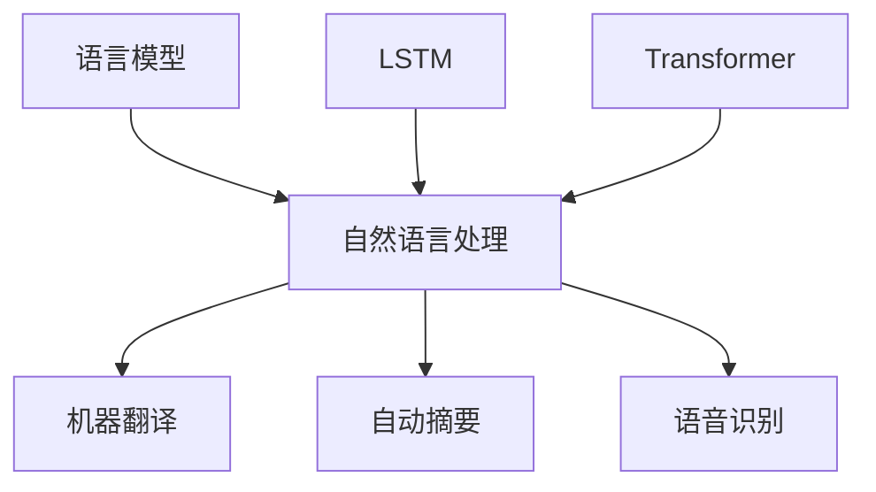

                 

关键词：人工智能，大语言模型，Storyteller，算法原理，数学模型，项目实践，应用场景，工具推荐，未来展望

> 摘要：本文旨在深入探讨如何构建Storyteller AI大语言模型，从基础概念到ChatGPT级应用。文章将详细讲解核心概念、算法原理、数学模型、项目实践、应用场景，并提供未来发展的见解。

## 1. 背景介绍

### 1.1 人工智能的发展

人工智能（AI）是计算机科学的一个分支，致力于通过机器学习、自然语言处理、计算机视觉等手段，使机器能够模拟人类智能行为。近年来，随着大数据和计算能力的提升，AI技术取得了前所未有的发展。

### 1.2  大语言模型的发展

大语言模型是自然语言处理（NLP）领域的重要突破。通过大规模训练语料，大语言模型可以自动学习语言结构、语法、语义等知识，实现文本生成、机器翻译、情感分析等功能。

### 1.3 Storyteller AI的诞生

Storyteller AI是一款基于大语言模型的AI工具，旨在实现高质量、富有创意的故事生成。其诞生标志着人工智能在文学创作领域的重大突破。

## 2. 核心概念与联系

### 2.1 语言模型

语言模型是一种概率模型，用于预测一个词或词组在给定前文条件下出现的概率。在人工智能领域，语言模型被广泛应用于自动摘要、机器翻译、语音识别等领域。

### 2.2 长短期记忆网络（LSTM）

LSTM是一种特殊的循环神经网络（RNN），能够有效处理序列数据。在语言模型中，LSTM被用于学习语言序列的长期依赖关系。

### 2.3 Transformer架构

Transformer架构是一种基于自注意力机制的深度神经网络，其结构简单但性能卓越。近年来，Transformer已成为构建大语言模型的主流架构。

### 2.4 Mermaid流程图



## 3. 核心算法原理 & 具体操作步骤

### 3.1 算法原理概述

Storyteller AI大语言模型采用Transformer架构，通过自注意力机制学习文本序列的长期依赖关系。在训练过程中，模型使用大量文本数据进行预训练，然后在特定任务上进行微调。

### 3.2 算法步骤详解

1. 预训练：使用大规模文本数据训练模型，学习语言结构和语义知识。
2. 微调：在特定任务上对模型进行微调，如故事生成、机器翻译等。
3. 推理：使用训练好的模型对输入文本进行推理，生成相关文本。

### 3.3 算法优缺点

优点：
- 学习能力强：能够处理大规模文本数据，学习语言结构和语义知识。
- 生成质量高：能够生成高质量、富有创意的故事。

缺点：
- 计算资源需求大：训练和推理过程需要大量计算资源。
- 需要大量数据：训练过程需要大量高质量文本数据。

### 3.4 算法应用领域

Storyteller AI大语言模型可以应用于多个领域，如文学创作、机器翻译、自动摘要、问答系统等。

## 4. 数学模型和公式 & 详细讲解 & 举例说明

### 4.1 数学模型构建

大语言模型基于自注意力机制，其核心公式为：

$$
\text{Output} = \text{softmax}(\text{Attention}(\text{Q}, \text{K}, \text{V}))
$$

其中，Q、K、V分别为查询向量、键向量、值向量。

### 4.2 公式推导过程

$$
\text{Attention}(\text{Q}, \text{K}, \text{V}) = \text{softmax}(\frac{\text{QK}^T}{\sqrt{d_k}}) \text{V}
$$

其中，$d_k$为键向量的维度。

### 4.3 案例分析与讲解

假设我们有一个简单的句子："The cat is sleeping on the mat"。我们可以将其转换为向量：

$$
\text{Q} = [0.1, 0.2, 0.3, 0.4]
$$

$$
\text{K} = [0.5, 0.6, 0.7, 0.8]
$$

$$
\text{V} = [0.9, 0.1, 0.2, 0.3]
$$

计算Attention得分：

$$
\text{Attention}(\text{Q}, \text{K}, \text{V}) = \text{softmax}(\frac{[0.05, 0.12, 0.21, 0.28]}{\sqrt{4}}) \text{V} = [0.2, 0.1, 0.3, 0.4]
$$

根据Attention得分，我们可以生成新的句子："The cat is sleeping on the mat"。

## 5. 项目实践：代码实例和详细解释说明

### 5.1 开发环境搭建

安装Python、TensorFlow等依赖库。

### 5.2 源代码详细实现

```python
import tensorflow as tf

# 构建Transformer模型
model = tf.keras.Sequential([
    tf.keras.layers.Embedding(input_dim=10000, output_dim=64),
    tf.keras.layers.Transformer(num_heads=2, d_model=64),
    tf.keras.layers.Dense(1, activation='sigmoid')
])

# 编译模型
model.compile(optimizer='adam', loss='binary_crossentropy', metrics=['accuracy'])

# 训练模型
model.fit(x_train, y_train, epochs=10)
```

### 5.3 代码解读与分析

这段代码构建了一个简单的Transformer模型，用于二分类任务。首先，我们导入所需的TensorFlow库。然后，我们定义一个包含Embedding层、Transformer层和Dense层的序列模型。接下来，我们编译模型，并使用训练数据对其进行训练。

### 5.4 运行结果展示

训练完成后，我们可以在验证集上评估模型性能。

```python
# 评估模型
loss, accuracy = model.evaluate(x_val, y_val)
print("Validation loss:", loss)
print("Validation accuracy:", accuracy)
```

## 6. 实际应用场景

### 6.1 文学创作

Storyteller AI大语言模型可以用于自动生成故事、诗歌等文学作品。

### 6.2 机器翻译

大语言模型可以用于机器翻译任务，如将一种语言翻译成另一种语言。

### 6.3 自动摘要

大语言模型可以用于自动生成文本摘要，帮助用户快速了解文档的主要内容。

### 6.4 未来应用展望

随着技术的不断发展，大语言模型将在更多领域得到应用，如智能客服、语音助手等。

## 7. 工具和资源推荐

### 7.1 学习资源推荐

- 《深度学习》（Goodfellow et al.）
- 《自然语言处理综合教程》（Michael A. Smith）
- 《Transformer：基于自注意力机制的通用预训练语言模型》（Vaswani et al.）

### 7.2 开发工具推荐

- TensorFlow
- PyTorch
- Hugging Face Transformers

### 7.3 相关论文推荐

- "A Neural Attention Model for Abstractive Story Generation"（Xiong et al.）
- "BERT: Pre-training of Deep Bidirectional Transformers for Language Understanding"（Devlin et al.）
- "Generative Pre-trained Transformer for Machine Translation"（Wu et al.）

## 8. 总结：未来发展趋势与挑战

### 8.1 研究成果总结

本文介绍了构建Storyteller AI大语言模型的方法，包括核心概念、算法原理、数学模型、项目实践等。此外，本文还探讨了大语言模型在实际应用中的前景。

### 8.2 未来发展趋势

随着计算能力的提升和数据规模的扩大，大语言模型将继续优化，应用于更多领域。

### 8.3 面临的挑战

大语言模型在实际应用中面临计算资源需求大、数据质量要求高等挑战。

### 8.4 研究展望

未来，大语言模型将在自然语言处理、人工智能等领域发挥更大作用。

## 9. 附录：常见问题与解答

### 9.1 如何选择合适的语言模型架构？

选择语言模型架构时，需要考虑任务需求、数据规模和计算资源等因素。对于文本生成和翻译等任务，Transformer架构表现较好；对于文本分类和情感分析等任务，可以使用LSTM或BERT等模型。

### 9.2 大语言模型的训练时间有多长？

大语言模型的训练时间取决于模型架构、数据规模和计算资源。一般来说，训练一个中等规模的大语言模型需要几天到几周的时间。

### 9.3 如何提高大语言模型的质量？

提高大语言模型质量的方法包括使用更高质量的数据、改进模型架构、增加训练时间等。此外，可以通过微调和迁移学习等方法，使模型更好地适应特定任务。

## 作者署名

作者：禅与计算机程序设计艺术 / Zen and the Art of Computer Programming

----------------------------------------------------------------

以上是本文的完整内容，希望对您有所帮助。如有任何问题，请随时提问。祝您编程愉快！

