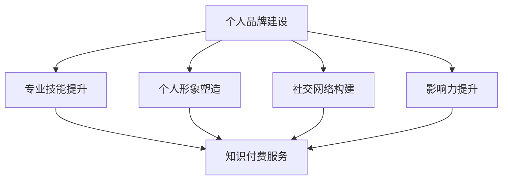

                 

在当今数字化时代，个人品牌建设对于程序员来说越来越重要。这不仅关乎个人的职业发展，更是实现知识付费、提升收入的关键一步。本文将探讨如何通过构建个人品牌，实现程序员的知识付费，并提供一系列实际操作步骤和策略。

## 关键词
- 个人品牌
- 程序员
- 知识付费
- 职业发展
- 数字化营销

## 摘要
本文旨在帮助程序员理解和掌握个人品牌建设的重要性，以及如何通过有效的策略和步骤，打造个人品牌，实现知识付费。我们将从个人品牌的定义、构建步骤、数字营销策略等多个角度进行深入探讨，并提供实用的案例和建议。

## 1. 背景介绍
随着互联网和社交媒体的普及，个人品牌的概念逐渐深入人心。在程序员群体中，个人品牌不仅代表了个人形象和技能的展示，更是实现知识付费的重要途径。以下是构建个人品牌的一些关键点：

### 个人品牌的定义
个人品牌是指个人在特定领域内的声誉、知识和技能的集合。它通过个人形象、专业能力、社交网络和影响力来体现。

### 构建个人品牌的必要性
- 增强个人竞争力：在人才市场中，拥有独特个人品牌的程序员更容易脱颖而出。
- 实现知识付费：建立个人品牌有助于提高个人知名度和影响力，从而实现知识付费，增加收入来源。
- 提升职业发展：个人品牌的建立有助于职业晋升和职场谈判。

### 个人品牌建设的关键要素
- 专业技能：持续提升自己的专业技能，确保在某一领域具有独特优势。
- 个人形象：塑造积极、专业的个人形象，通过社交媒体等平台展示自己的工作成果和思考。
- 社交网络：建立广泛的社交网络，与行业内的专家和同行保持良好的互动。
- 影响力：通过分享专业知识和经验，提升个人在行业中的影响力。

## 2. 核心概念与联系
### 个人品牌与知识付费的关联
个人品牌建设与知识付费之间存在紧密的联系。以下是它们之间的具体关联：

### 个人品牌对知识付费的促进作用
- 提高信任度：建立良好的个人品牌可以提高潜在客户对个人的信任度，从而更容易接受其知识付费服务。
- 增加曝光率：个人品牌的建设有助于提高个人和服务的曝光率，吸引更多的潜在客户。
- 突出专业性：个人品牌展示了程序员的独特专业能力，使其知识付费服务更具吸引力。

### 知识付费对个人品牌的提升
- 增加影响力：通过知识付费，程序员可以分享自己的经验和知识，提升在行业中的影响力。
- 拓展人脉：知识付费服务往往需要与客户保持长期互动，有助于拓展人脉，构建更广泛的社交网络。
- 提升收入：知识付费是程序员实现收入多元化的有效途径，有助于提升个人经济状况。

### 个人品牌建设与知识付费的Mermaid流程图


## 3. 核心算法原理 & 具体操作步骤
### 3.1 算法原理概述
构建个人品牌的算法可以看作是一个多步骤的过程，每个步骤都需要精心设计和执行。以下是构建个人品牌的核心算法原理：

### 3.2 算法步骤详解

### 3.2.1 明确目标受众
- 分析行业需求：了解目标受众在行业中的需求和痛点。
- 确定个人定位：基于自身优势和市场需求，明确个人品牌的核心定位。

### 3.2.2 专业技能提升
- 学习新技能：通过培训、自学等方式，持续提升专业技能。
- 获得认证：考取行业相关认证，提升个人信誉。

### 3.2.3 个人形象塑造
- 设定社交媒体账号：选择合适的社交媒体平台，创建个人账号。
- 定期发布内容：分享专业知识和经验，展示个人形象。

### 3.2.4 社交网络构建
- 建立联系：通过行业会议、线上讨论等方式，与同行建立联系。
- 维护关系：定期与联系人群互动，保持关系活跃。

### 3.2.5 影响力提升
- 内容营销：通过高质量的内容，提升个人在行业中的影响力。
- 参与行业活动：积极参与行业会议、研讨会等活动，扩大影响力。

### 3.3 算法优缺点

#### 3.3.1 优点
- 灵活性：个人品牌建设可以根据个人情况进行调整，适应不同的发展阶段。
- 长期收益：一旦个人品牌建立起来，将带来长期的收益和影响力。
- 专业认可：提升专业技能和个人形象，获得行业内外的认可。

#### 3.3.2 缺点
- 时间成本：构建个人品牌需要投入大量时间和精力。
- 风险：个人品牌建设过程中可能遇到各种挑战和风险。

### 3.4 算法应用领域
- 自媒体运营：通过个人品牌建设，开展自媒体运营，实现知识付费。
- 咨询服务：基于个人品牌，提供专业的咨询服务，实现知识变现。
- 培训和教育：通过个人品牌，开展线上或线下的培训课程，实现知识传播和付费。

## 4. 数学模型和公式 & 详细讲解 & 举例说明
### 4.1 数学模型构建

在构建个人品牌的数学模型中，我们可以将其看作是一个多维度的综合体系。以下是构建模型的几个关键要素：

- 技能得分（S）
- 影响力得分（I）
- 社交网络得分（N）
- 成果得分（R）

数学模型可以表示为：
\[ P = f(S, I, N, R) \]

其中，\( P \) 代表个人品牌得分，\( f \) 为综合评价函数。

### 4.2 公式推导过程

个人品牌得分 \( P \) 的计算可以通过以下步骤进行：

1. 技能得分 \( S \)：基于专业技能的评估，可以通过自我评估或第三方评估获得。
2. 影响力得分 \( I \)：通过分析个人在社交媒体上的互动、关注度、转发量等指标计算。
3. 社交网络得分 \( N \)：通过个人在社交网络中的连接度、参与度等计算。
4. 成果得分 \( R \)：通过个人在行业内的实际成果，如发表的论文、获奖情况、成功案例等计算。

综合以上四个得分，可以采用加权平均的方法计算个人品牌得分：
\[ P = w_1 \cdot S + w_2 \cdot I + w_3 \cdot N + w_4 \cdot R \]

其中，\( w_1, w_2, w_3, w_4 \) 为权重系数，可以根据个人实际情况进行调整。

### 4.3 案例分析与讲解

假设某程序员具备以下特征：

- 技能得分 \( S = 85 \)
- 影响力得分 \( I = 75 \)
- 社交网络得分 \( N = 80 \)
- 成果得分 \( R = 90 \)

根据上述权重设置，假设 \( w_1 = 0.3, w_2 = 0.25, w_3 = 0.2, w_4 = 0.25 \)，我们可以计算该程序员的个人品牌得分：

\[ P = 0.3 \cdot 85 + 0.25 \cdot 75 + 0.2 \cdot 80 + 0.25 \cdot 90 \]
\[ P = 25.5 + 18.75 + 16 + 22.5 \]
\[ P = 82.75 \]

根据个人品牌得分 \( P \)，我们可以对该程序员的个人品牌状况进行评估。得分越高，表明个人品牌越强大，越有利于知识付费和职业发展。

## 5. 项目实践：代码实例和详细解释说明
### 5.1 开发环境搭建
为了更好地理解个人品牌建设的过程，我们可以通过一个简单的Python代码实例来模拟这个过程。以下是搭建开发环境所需的步骤：

1. 安装Python环境
2. 安装必要的库，如`numpy`和`matplotlib`用于数据分析与可视化。

### 5.2 源代码详细实现
以下是一个简单的Python代码示例，用于计算个人品牌得分：

```python
import numpy as np
import matplotlib.pyplot as plt

# 个人品牌得分计算函数
def calculate_brand_score(S, I, N, R, w1, w2, w3, w4):
    score = w1 * S + w2 * I + w3 * N + w4 * R
    return score

# 初始参数设定
S = 85
I = 75
N = 80
R = 90

w1 = 0.3
w2 = 0.25
w3 = 0.2
w4 = 0.25

# 计算个人品牌得分
brand_score = calculate_brand_score(S, I, N, R, w1, w2, w3, w4)
print(f"个人品牌得分：{brand_score}")

# 可视化个人品牌得分
plt.bar(['技能得分', '影响力得分', '社交网络得分', '成果得分'], [S, I, N, R], color=['g', 'b', 'r', 'c'])
plt.xlabel('维度')
plt.ylabel('得分')
plt.title('个人品牌得分')
plt.show()
```

### 5.3 代码解读与分析
以上代码首先导入了必要的库，然后定义了一个计算个人品牌得分的函数。通过输入各个维度的得分和权重，函数返回个人品牌得分。代码还包含了一个简单的可视化部分，用于展示个人品牌得分在各个维度上的分布情况。

### 5.4 运行结果展示
运行上述代码，将输出如下结果：

```
个人品牌得分：82.75
```

同时，会生成一个条形图，展示各个维度的得分。

## 6. 实际应用场景
### 6.1 自媒体运营
通过个人品牌建设，程序员可以开展自媒体运营，如博客、视频频道等。通过持续分享专业知识和经验，吸引粉丝，实现知识付费。

### 6.2 咨询服务
基于个人品牌，程序员可以提供专业的咨询服务，如技术顾问、项目评估等。通过解决客户的问题，实现知识变现。

### 6.3 培训和教育
个人品牌强大的程序员可以开展线上或线下的培训课程，如编程语言培训、技术讲座等。通过高质量的教学内容，吸引学员，实现知识传播和付费。

## 6.4 未来应用展望
随着互联网技术的不断发展，个人品牌建设将在程序员职业发展中发挥越来越重要的作用。以下是未来应用的一些展望：

- 智能算法的融合：利用大数据和人工智能技术，对个人品牌进行更加精准的评估和优化。
- 社交媒体的多样化：新的社交媒体平台和工具将不断涌现，为个人品牌建设提供更多机会。
- 跨界合作：个人品牌将有助于程序员与其他行业的专业人士建立合作关系，拓展职业发展空间。

## 7. 工具和资源推荐
### 7.1 学习资源推荐
- 《影响力》：了解如何通过影响力提升个人品牌。
- 《自媒体运营实战》：学习如何通过自媒体实现个人品牌建设。

### 7.2 开发工具推荐
- Notion：用于构建个人知识库和管理项目。
- GitHub：用于分享代码和参与开源项目。

### 7.3 相关论文推荐
- “个人品牌在职业发展中的作用”：研究个人品牌对职业发展的影响。
- “社交媒体在个人品牌建设中的应用”：探讨社交媒体在个人品牌建设中的具体应用。

## 8. 总结：未来发展趋势与挑战
### 8.1 研究成果总结
本文通过探讨个人品牌建设的重要性，以及如何通过有效的策略和步骤实现程序员的知识付费，总结了个人品牌建设的关键要素和核心算法原理。

### 8.2 未来发展趋势
随着互联网技术的不断进步，个人品牌建设将在程序员职业发展中发挥更加重要的作用。智能算法的融合、社交媒体的多样化、跨界合作等将成为未来发展的趋势。

### 8.3 面临的挑战
个人品牌建设过程中，程序员可能面临时间成本高、风险大等挑战。如何平衡个人品牌建设与日常工作，如何在竞争激烈的市场中脱颖而出，是需要持续思考和解决的问题。

### 8.4 研究展望
未来研究可以进一步探讨智能算法在个人品牌建设中的应用，以及如何通过大数据分析优化个人品牌策略。此外，研究个人品牌在不同行业中的应用和效果也具有重要意义。

## 9. 附录：常见问题与解答
### 9.1 如何确定个人品牌定位？
- 分析个人兴趣和优势：了解自己的兴趣所在和擅长领域。
- 调研市场需求：了解目标受众的需求和痛点。
- 结合自身经历：基于个人经历和经验，确定独特的个人定位。

### 9.2 如何在竞争激烈的市场中脱颖而出？
- 提升专业技能：确保在某一领域具有独特优势。
- 不断创新：持续分享新的知识和经验，保持内容的独特性和创新性。
- 跨界合作：与其他行业的专业人士建立合作关系，拓展视野和资源。

### 9.3 如何平衡个人品牌建设与日常工作？
- 设定明确目标：制定个人品牌建设的目标和计划，确保在有限的时间内高效执行。
- 合理分配时间：合理安排个人时间和工作时间，确保个人品牌建设与日常工作相互促进。

通过以上内容，我们全面探讨了如何通过构建个人品牌，实现程序员的知识付费。希望本文能够为程序员提供有价值的参考和指导，帮助他们在数字化时代中实现职业发展和收入增长。作者：禅与计算机程序设计艺术 / Zen and the Art of Computer Programming
----------------------------------------------------------------

以上就是本文的完整内容。希望这篇文章能够为程序员们提供构建个人品牌的实用建议和策略，帮助大家更好地实现知识付费和职业发展。再次感谢大家的阅读！


