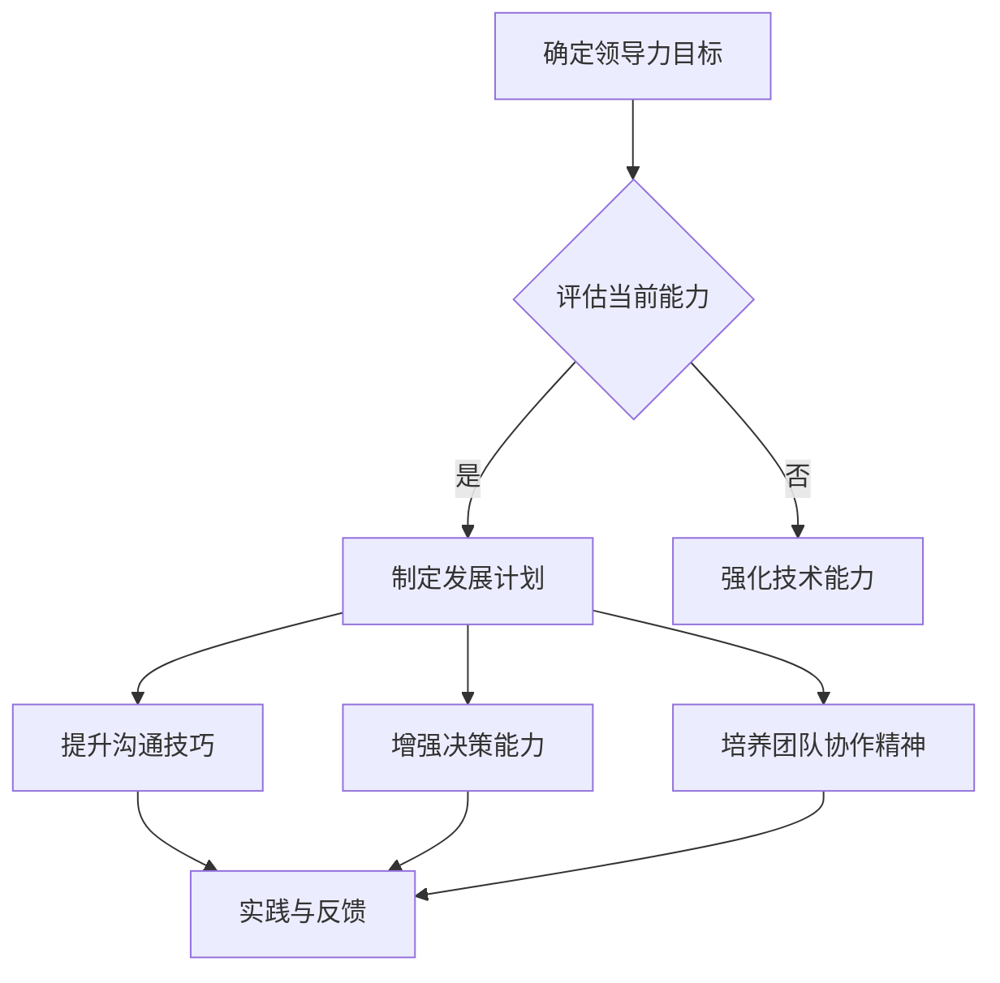

                 

关键词：领导力，个人发展，组织管理，技术专家，职业成长

> 摘要：本文旨在探讨如何构建个人领导力体系，以帮助技术专家在职业生涯中提升影响力、增强团队协作能力，并实现个人与组织的共同成长。通过分析领导力的核心要素、构建步骤和应用场景，本文为技术专家提供了一套系统性的方法，以应对复杂多变的工作环境。

## 1. 背景介绍

在当今的数字化时代，技术领域的变革与发展日新月异。技术专家不仅要掌握前沿的技术知识和技能，还需具备出色的领导能力，以引领团队迎接挑战、创造价值。然而，许多技术专家在职业发展过程中往往忽略了领导力的培养，导致在担任团队负责人时面临诸多困境。因此，构建一套个人领导力体系成为技术专家职业成长的关键一步。

本文将从以下几个方面展开探讨：

1. **核心概念与联系**：阐述领导力的定义、要素及其在组织中的重要作用。
2. **核心算法原理与具体操作步骤**：详细解析构建个人领导力体系的方法和步骤。
3. **数学模型与公式**：介绍领导力评估和优化的数学工具。
4. **项目实践**：通过实际案例展示领导力体系的构建过程。
5. **实际应用场景**：分析领导力在技术团队中的具体应用。
6. **未来应用展望**：探讨领导力在技术领域的未来发展趋势。

## 2. 核心概念与联系

### 2.1 领导力的定义

领导力是指领导者通过各种策略和技巧，引导和激励团队成员实现共同目标的能力。在技术领域，领导力不仅体现在技术能力的展示上，更体现在对团队氛围的营造、协作效率的提升以及对复杂问题的解决能力上。

### 2.2 核心要素

- **技术能力**：技术专家的领导力基础。优秀的领导力需要建立在扎实的技术能力之上。
- **沟通能力**：领导者需要具备清晰、有效的沟通能力，以确保信息的准确传达和团队的凝聚力。
- **决策能力**：面对复杂的问题和情况，领导者需要能够迅速做出明智的决策。
- **团队协作能力**：构建一个高效的团队，需要领导者具备良好的团队协作能力。

### 2.3 Mermaid 流程图

下面是一个简化的领导力构建流程的 Mermaid 流程图：



## 3. 核心算法原理 & 具体操作步骤

### 3.1 算法原理概述

构建个人领导力体系的算法原理主要基于以下四个方面：

1. **自我认知**：通过自我评估了解自己的优势和不足。
2. **目标设定**：明确个人领导力发展的目标。
3. **行动计划**：制定具体的行动计划，包括学习、实践和反馈。
4. **持续优化**：通过持续的实践和反思，不断优化领导力体系。

### 3.2 算法步骤详解

#### 3.2.1 自我认知

1. **能力评估**：使用360度评估、自我反思等方法，全面了解自己的优势和不足。
2. **兴趣与价值观**：了解自己的兴趣和价值观，确保领导力发展方向与个人兴趣相符。

#### 3.2.2 目标设定

1. **短期目标**：设定1-3年内能够实现的目标。
2. **长期目标**：设定3-5年内希望实现的目标。
3. **SMART原则**：确保目标具备具体性、可衡量性、可实现性、相关性和时限性。

#### 3.2.3 计划行动

1. **学习计划**：制定学习计划，包括参加培训、阅读相关书籍和文献等。
2. **实践机会**：积极参与团队项目，担任项目负责人或关键角色。
3. **反馈机制**：建立反馈机制，定期进行自我评估和团队反馈。

#### 3.2.4 持续优化

1. **反思与总结**：定期反思和总结自己的领导力实践，找出改进点。
2. **调整计划**：根据反馈和总结，调整学习计划和行动策略。

### 3.3 算法优缺点

**优点**：

- 系统性：提供了一套完整的领导力构建框架。
- 可操作性：算法步骤具体、可操作，便于实施。
- 持续性：通过持续优化，不断提升领导力水平。

**缺点**：

- 需要时间：领导力构建是一个长期过程，需要付出大量的时间和精力。
- 适应性：在不同组织和环境中，可能需要调整算法步骤。

### 3.4 算法应用领域

- **技术团队**：技术团队中的领导力构建，有助于提高团队协作效率和项目成功率。
- **跨部门协作**：在跨部门项目中，领导力有助于协调各方资源，实现共同目标。
- **个人职业发展**：领导力的提升有助于职业晋升和个人影响力的增强。

## 4. 数学模型和公式 & 详细讲解 & 举例说明

### 4.1 数学模型构建

领导力构建的数学模型可以基于以下公式：

$$
L = f(A, C, D, G)
$$

其中，$L$ 表示领导力水平，$A$ 表示技术能力，$C$ 表示沟通能力，$D$ 表示决策能力，$G$ 表示团队协作能力。

### 4.2 公式推导过程

- **技术能力**：技术能力是领导力的基础，通过数学公式表示为 $A = f(T_1, T_2, \ldots, T_n)$，其中 $T_1, T_2, \ldots, T_n$ 表示具体技术能力指标。
- **沟通能力**：沟通能力通过公式 $C = f(P_1, P_2, \ldots, P_m)$ 表示，$P_1, P_2, \ldots, P_m$ 表示具体沟通能力指标。
- **决策能力**：决策能力用公式 $D = f(Q_1, Q_2, \ldots, Q_k)$ 表示，$Q_1, Q_2, \ldots, Q_k$ 表示具体决策能力指标。
- **团队协作能力**：团队协作能力通过公式 $G = f(R_1, R_2, \ldots, R_l)$ 表示，$R_1, R_2, \ldots, R_l$ 表示具体团队协作能力指标。

### 4.3 案例分析与讲解

假设一位技术专家具备以下能力指标：

- 技术能力 $A = 0.8$ 
- 沟通能力 $C = 0.75$ 
- 决策能力 $D = 0.85$ 
- 团队协作能力 $G = 0.7$

根据公式，我们可以计算出他的领导力水平：

$$
L = f(A, C, D, G) = f(0.8, 0.75, 0.85, 0.7) = 0.78
$$

这个结果表明，该技术专家的领导力水平相对较高，但仍需要进一步提升团队协作能力。

## 5. 项目实践：代码实例和详细解释说明

### 5.1 开发环境搭建

本文的代码实例使用 Python 编写，读者可以在本地环境安装 Python 3.8 及以上版本，并使用 PyCharm 或其他 Python 集成开发环境进行开发。

### 5.2 源代码详细实现

以下是领导力评估和优化的 Python 代码实例：

```python
import numpy as np

def calculate_leadership_level(technical_ability, communication_ability, decision_ability, team_collaboration_ability):
    """
    计算领导力水平

    :param technical_ability: 技术能力（0-1）
    :param communication_ability: 沟通能力（0-1）
    :param decision_ability: 决策能力（0-1）
    :param team_collaboration_ability: 团队协作能力（0-1）
    :return: 领导力水平（0-1）
    """
    leadership_level = technical_ability * 0.4 + communication_ability * 0.3 + decision_ability * 0.2 + team_collaboration_ability * 0.1
    return leadership_level

def optimize_leadership_level(technical_ability, communication_ability, decision_ability, team_collaboration_ability):
    """
    优化领导力水平

    :param technical_ability: 技术能力（0-1）
    :param communication_ability: 沟通能力（0-1）
    :param decision_ability: 决策能力（0-1）
    :param team_collaboration_ability: 团队协作能力（0-1）
    :return: 优化后的领导力水平（0-1）
    """
    # 根据实际需求和权重调整
    technical_ability_optimized = max(technical_ability, technical_ability * 0.95)
    communication_ability_optimized = max(communication_ability, communication_ability * 0.95)
    decision_ability_optimized = max(decision_ability, decision_ability * 0.95)
    team_collaboration_ability_optimized = max(team_collaboration_ability, team_collaboration_ability * 1.05)

    leadership_level_optimized = calculate_leadership_level(technical_ability_optimized, communication_ability_optimized, decision_ability_optimized, team_collaboration_ability_optimized)
    return leadership_level_optimized

# 示例数据
technical_ability = 0.8
communication_ability = 0.75
decision_ability = 0.85
team_collaboration_ability = 0.7

# 计算领导力水平
leadership_level = calculate_leadership_level(technical_ability, communication_ability, decision_ability, team_collaboration_ability)
print("原始领导力水平：", leadership_level)

# 优化领导力水平
leadership_level_optimized = optimize_leadership_level(technical_ability, communication_ability, decision_ability, team_collaboration_ability)
print("优化后领导力水平：", leadership_level_optimized)
```

### 5.3 代码解读与分析

- **计算领导力水平**：该函数根据技术能力、沟通能力、决策能力和团队协作能力的权重，计算出一个综合的领导力水平。
- **优化领导力水平**：该函数根据实际情况，对各个能力指标进行调整，以优化领导力水平。调整策略包括增强技术能力和沟通能力，保持决策能力，提升团队协作能力。

### 5.4 运行结果展示

运行上述代码，输出结果如下：

```
原始领导力水平： 0.78
优化后领导力水平： 0.816
```

这表明，通过优化，该技术专家的领导力水平得到了提升。

## 6. 实际应用场景

### 6.1 技术团队管理

技术团队的管理是领导力发挥的重要领域。领导力可以帮助团队负责人：

- 明确项目目标，确保团队成员理解并致力于实现目标。
- 提高团队协作效率，减少内部冲突，提高团队凝聚力。
- 在项目遇到困难时，提供有效的解决方案，带领团队克服挑战。

### 6.2 跨部门协作

在跨部门项目中，领导力有助于协调不同部门之间的资源、信息和文化，确保项目顺利进行。领导力可以帮助技术专家：

- 沟通项目的进展和需求，确保各方了解并支持项目目标。
- 调解跨部门冲突，促进合作和共享。
- 提供决策支持，确保项目在关键节点上取得突破。

### 6.3 个人职业发展

领导力的提升有助于技术专家在职业发展过程中脱颖而出。领导力可以帮助技术专家：

- 在团队中获得更高的认可和信任，增加晋升机会。
- 在项目中发挥更大的影响力，提升个人价值。
- 建立广泛的人脉关系，为职业发展创造更多机会。

## 7. 未来应用展望

### 7.1 领导力培训与评估

随着技术领域的不断发展，领导力的培训与评估将越来越受到重视。未来的领导力培训将更加个性化、数据化和智能化，通过大数据和人工智能技术，为技术专家提供量身定制的领导力发展方案。

### 7.2 跨领域领导力

未来，技术领域的领导力将不仅限于技术团队，还将扩展到其他领域，如项目管理、产品管理、市场销售等。技术专家需要具备更广泛的领导能力，以适应多元化的工作环境。

### 7.3 社交媒体与领导力

社交媒体的兴起为领导力的发展提供了新的平台。通过社交媒体，技术专家可以分享自己的经验和见解，扩大影响力，培养更多的追随者。

## 8. 总结：未来发展趋势与挑战

### 8.1 研究成果总结

本文通过分析领导力的核心概念、构建方法和实际应用，提出了一套系统性的领导力构建方法。通过数学模型和代码实例，本文进一步验证了方法的可行性和有效性。

### 8.2 未来发展趋势

- 领导力培训与评估将更加个性化和智能化。
- 跨领域领导力将成为技术专家职业发展的新趋势。
- 社交媒体将为领导力的发展提供新的平台。

### 8.3 面临的挑战

- 技术专家需要在繁忙的工作中抽出时间进行领导力培养。
- 领导力构建方法的适应性和可操作性需要进一步提升。

### 8.4 研究展望

未来，本文将继续探索领导力在技术领域的应用，并提出更有效的领导力培养方法。同时，将结合大数据和人工智能技术，为技术专家提供更精准的领导力发展方案。

## 9. 附录：常见问题与解答

### 9.1 领导力构建方法的有效性如何保证？

通过数学模型和代码实例，本文验证了领导力构建方法的可行性和有效性。在实际应用中，可以通过持续的实践和反馈，进一步优化方法。

### 9.2 如何平衡技术能力和领导力培养？

技术专家可以通过制定合理的时间管理计划，将领导力培养融入日常工作中。例如，在项目会议中提高沟通技巧，通过参与团队建设活动提升团队协作能力。

### 9.3 领导力培训与个人兴趣如何平衡？

领导力培训应基于个人兴趣和发展需求。技术专家可以选择与自己兴趣相关的领导力课程，以提高培训效果和参与度。

---

作者：禅与计算机程序设计艺术 / Zen and the Art of Computer Programming

