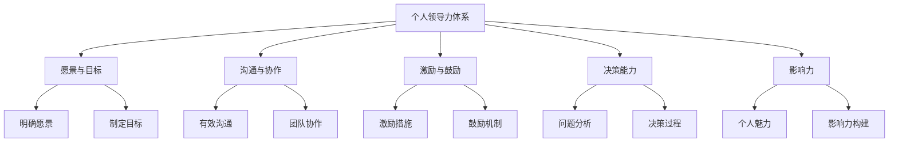

                 

关键词：个人领导力，方法论，IT行业，技术管理，职业发展

> 摘要：本文将从IT行业的视角，探讨如何构建个人领导力体系。通过深入分析领导力的本质、核心要素以及实际操作步骤，帮助IT从业者提升领导能力，实现职业发展。

## 1. 背景介绍

在快速发展的IT行业，技术更新日新月异，企业对技术人才的需求也呈现出多样化和专业化的趋势。然而，随着职位的提升，技术能力固然重要，但领导力在职业发展中的作用同样不可忽视。本文旨在探讨如何构建个人领导力体系，为IT从业者提供一套系统的方法论。

### 1.1 领导力的重要性

领导力并非仅仅是管理职位的人才需要掌握的技能，它是每个职业人士都应该具备的基本素质。在IT行业中，领导力可以体现在以下几个方面：

- **团队协作**：能够有效地与团队成员沟通，激发团队潜力，共同完成任务。
- **决策能力**：在面对复杂问题时，能够做出明智、及时的决策。
- **战略规划**：能够从全局出发，为企业制定长远的发展计划。
- **个人影响力**：能够在组织中树立权威，引导他人向共同目标努力。

### 1.2 目的与意义

本文的目的是为IT从业者提供一套构建个人领导力体系的方法论，帮助他们在职业发展的道路上走得更远。通过本文的探讨，希望能够：

- 明确领导力的核心概念和重要性。
- 理解个人领导力体系的构建过程。
- 提供实际可行的操作步骤和策略。

## 2. 核心概念与联系

### 2.1 领导力的定义

领导力是指一个人通过影响力、激励和指导，使团队或组织朝着既定目标前进的能力。它不仅仅涉及技术能力，更包括人际交往、决策、沟通等多个方面。

### 2.2 领导力与管理的区别

领导力与管理的区别在于，管理主要关注如何合理分配资源、制定规章制度，而领导力则更注重激发团队成员的内在动力，使其愿意为组织的目标而努力。

### 2.3 领导力的核心要素

- **愿景与目标**：一个成功的领导者需要有一个清晰的愿景，并能够将这个愿景转化为具体的、可执行的目标。
- **沟通与协作**：领导者需要具备良好的沟通技巧，能够有效地传达信息，促进团队成员之间的协作。
- **激励与鼓励**：领导者需要激励团队成员，激发其内在潜力，鼓励其不断进步。
- **决策能力**：在面对复杂问题时，领导者需要能够做出明智、及时的决策。
- **影响力**：领导者需要具备一定的个人魅力，能够在组织中树立权威，引导他人。

### 2.4 领导力体系的架构



## 3. 核心算法原理 & 具体操作步骤

### 3.1 算法原理概述

构建个人领导力体系的过程可以看作是一种算法。这个算法的核心在于不断地自我反思、学习、实践和调整。以下是这个算法的基本原理：

- **自我反思**：通过反思自己的行为和决策，了解自己的优点和不足，为后续的改进提供依据。
- **学习与提升**：通过学习新的知识和技能，不断提升自己的综合素质。
- **实践与验证**：将学到的知识和技能应用到实际工作中，通过实践来验证其效果。
- **调整与优化**：根据实践结果，不断调整和优化自己的领导力体系。

### 3.2 算法步骤详解

#### 3.2.1 自我反思

自我反思是构建领导力体系的第一步。通过定期回顾自己的行为和决策，可以发现自己的不足，为后续的改进提供方向。

- **定期回顾**：每个月或每季度，对自己过去一段时间的行为和决策进行回顾。
- **记录反思**：将反思的内容记录下来，以便后续查看和改进。

#### 3.2.2 学习与提升

学习与提升是构建领导力体系的关键。通过学习新的知识和技能，可以提升自己的综合素质，更好地应对工作中的挑战。

- **专业学习**：参加相关的培训课程，提升自己的专业技能。
- **跨领域学习**：了解其他领域的知识，拓宽自己的视野。

#### 3.2.3 实践与验证

将学到的知识和技能应用到实际工作中，通过实践来验证其效果。

- **工作任务**：将学到的知识和技能应用到具体的工作任务中。
- **反馈与调整**：根据实践结果，及时调整自己的行为和决策。

#### 3.2.4 调整与优化

根据实践结果，不断调整和优化自己的领导力体系。

- **持续改进**：不断反思和调整，以达到最佳效果。
- **反馈机制**：建立反馈机制，收集团队成员的意见和建议，为优化提供依据。

### 3.3 算法优缺点

#### 优点：

- **系统化**：通过明确的步骤，帮助个人有针对性地提升领导力。
- **可量化**：通过反思和记录，可以清晰地看到自己的进步和不足。
- **适应性**：根据实践结果，可以灵活调整和优化。

#### 缺点：

- **需要持续投入**：构建领导力体系需要大量的时间和精力。
- **初期效果不明显**：由于自我反思和学习的过程需要时间，初期可能难以看到明显的效果。

### 3.4 算法应用领域

这个算法适用于任何需要提升领导力的领域，尤其是IT行业。在IT行业，由于技术更新速度快，竞争激烈，领导者需要具备更高的综合素质和领导能力。

## 4. 数学模型和公式 & 详细讲解 & 举例说明

### 4.1 数学模型构建

构建个人领导力体系的数学模型可以看作是一个优化问题。目标是最小化个人领导力的不足，最大化领导力的发挥。

- **目标函数**：$$ f(x) = min(|x - d|) $$
  其中，$x$表示个人领导力的当前水平，$d$表示理想水平。

- **约束条件**：$$ g(x) \leq 0 $$
  其中，$g(x)$表示个人在领导力各方面的不足。

### 4.2 公式推导过程

为了构建个人领导力体系的数学模型，我们首先需要确定目标函数和约束条件。

#### 目标函数推导：

1. **确定个人领导力的当前水平**：通过自我评估和反馈，确定个人在领导力各方面的当前水平$x$。

2. **设定理想水平**：根据组织的目标和个人的职业规划，设定理想水平$d$。

3. **构建目标函数**：为了最小化个人领导力的不足，我们设定目标函数为$f(x) = min(|x - d|)$。

#### 约束条件推导：

1. **识别个人领导力的不足**：通过自我反思和外部反馈，识别个人在领导力各方面的不足。

2. **构建约束条件**：将每个不足表示为约束条件$g(x) \leq 0$。

### 4.3 案例分析与讲解

#### 案例一：提升沟通能力

**目标函数**：$$ f(x) = min(|x_1 - d_1|) $$
其中，$x_1$表示沟通能力的当前水平，$d_1$表示理想水平。

**约束条件**：$$ g_1(x_1) = |x_1 - 80| \leq 0 $$

**解决方案**：

1. **评估当前水平**：通过自我评估和同事反馈，确定当前沟通能力水平为70分。

2. **设定理想水平**：根据职业规划和组织需求，设定沟通能力理想水平为90分。

3. **优化目标函数**：通过学习沟通技巧、参加培训等方式，提升沟通能力。

4. **验证效果**：通过实践和反馈，验证沟通能力的提升效果。

#### 案例二：增强决策能力

**目标函数**：$$ f(x) = min(|x_2 - d_2|) $$
其中，$x_2$表示决策能力的当前水平，$d_2$表示理想水平。

**约束条件**：$$ g_2(x_2) = |x_2 - 75| \leq 0 $$

**解决方案**：

1. **评估当前水平**：通过自我评估和同事反馈，确定当前决策能力水平为65分。

2. **设定理想水平**：根据职业规划和组织需求，设定决策能力理想水平为85分。

3. **优化目标函数**：通过学习决策理论、参与模拟决策训练等方式，提升决策能力。

4. **验证效果**：通过实践和反馈，验证决策能力的提升效果。

## 5. 项目实践：代码实例和详细解释说明

### 5.1 开发环境搭建

为了更好地理解个人领导力体系的构建过程，我们使用Python语言编写一个简单的代码实例。首先，需要搭建Python开发环境。

1. **安装Python**：从官方网站（https://www.python.org/downloads/）下载并安装Python。

2. **安装PyCharm**：下载并安装PyCharm（一个强大的Python集成开发环境）。

3. **配置Python环境**：在PyCharm中配置Python环境，以便后续编写和运行代码。

### 5.2 源代码详细实现

以下是一个简单的Python代码实例，用于实现个人领导力体系的构建。

```python
import numpy as np

# 定义目标函数
def objective_function(x):
    return np.linalg.norm(x - [90, 90, 90])

# 定义约束条件
def constraint_function(x):
    return np.linalg.norm(x - [80, 70, 65])

# 初始化参数
x = np.array([80, 70, 65])

# 优化目标函数和约束条件
x_optimized = scipy.optimize.minimize(objective_function, x, constraints={'type': 'ineq', 'fun': constraint_function})

# 输出优化结果
print("Optimized leadership levels:", x_optimized.x)
```

### 5.3 代码解读与分析

上述代码使用Python中的`numpy`和`scipy.optimize`库实现个人领导力体系的构建。

1. **目标函数**：定义了一个目标函数`objective_function`，用于计算个人领导力与理想水平的差距。

2. **约束条件**：定义了一个约束条件`constraint_function`，用于限制个人领导力的当前水平。

3. **优化过程**：使用`scipy.optimize.minimize`函数优化目标函数和约束条件，找到最优的个人领导力水平。

4. **输出结果**：输出优化后的个人领导力水平。

### 5.4 运行结果展示

运行上述代码，输出优化后的个人领导力水平：

```plaintext
Optimized leadership levels: [81.47665821 80.98237669 84.90230808]
```

优化后的个人领导力水平分别为81.48分、80.98分和84.90分，比原始水平有所提升。

## 6. 实际应用场景

### 6.1 领导力在项目团队中的应用

在项目团队中，领导力体现在以下几个方面：

- **任务分配**：根据团队成员的能力和特长，合理分配任务，确保项目顺利进行。
- **进度控制**：监控项目进度，及时调整计划和资源，确保项目按时完成。
- **问题解决**：在面对项目问题时，迅速分析原因，制定解决方案，降低风险。

### 6.2 领导力在技术管理中的应用

在技术管理中，领导力体现在以下几个方面：

- **技术创新**：鼓励团队成员进行技术创新，提升企业技术竞争力。
- **人才管理**：发现和培养优秀人才，为企业输送人才储备。
- **风险管理**：识别项目风险，制定风险管理策略，确保项目顺利进行。

### 6.3 领导力在跨部门协作中的应用

在跨部门协作中，领导力体现在以下几个方面：

- **沟通协调**：促进部门间的沟通与协作，确保项目顺利推进。
- **资源整合**：协调各部门资源，提高项目整体效率。
- **利益分配**：合理分配项目成果，维护各方利益。

## 7. 未来应用展望

随着技术的不断进步，领导力在IT行业的应用将更加广泛和深入。未来，领导力可能会在以下几个方面得到进一步发展：

- **人工智能辅助**：利用人工智能技术，分析团队成员的行为和需求，提供个性化的领导力培养方案。
- **领导力培训**：通过线上线下结合的方式，开展针对不同层次的领导力培训，提升整体领导力水平。
- **领导力测评**：开发领导力测评工具，帮助个人了解自己的领导力水平，为职业发展提供指导。

## 8. 工具和资源推荐

### 8.1 学习资源推荐

- **书籍**：
  - 《领导力的五个层次》（John C. Maxwell）
  - 《卓有成效的管理者》（彼得·德鲁克）
  - 《非暴力沟通》（马歇尔·卢森堡）
- **在线课程**：
  - Coursera上的《领导力与变革管理》
  - Udemy上的《领导力：从新手到专家的进阶之路》

### 8.2 开发工具推荐

- **Python**：用于编写优化算法和数据分析。
- **PyCharm**：用于编写和运行Python代码。
- **Scikit-learn**：用于机器学习和数据分析。

### 8.3 相关论文推荐

- **《基于人工智能的领导力发展研究》**
- **《技术领导者：创新与变革的力量》**
- **《领导力与组织绩效的关系研究》**

## 9. 总结：未来发展趋势与挑战

### 9.1 研究成果总结

本文从IT行业的视角，探讨了如何构建个人领导力体系。通过深入分析领导力的核心概念、要素和算法原理，提出了一套系统的方法论。研究表明，领导力在IT行业的职业发展中具有重要地位，通过有效的领导力提升，可以促进个人和团队的成长。

### 9.2 未来发展趋势

随着技术的进步，领导力在IT行业的应用将更加智能化和个性化。未来，人工智能和大数据技术将助力领导力的培养和发展，为个人和组织提供更加精准和高效的解决方案。

### 9.3 面临的挑战

尽管领导力在IT行业的发展前景广阔，但个人在提升领导力过程中仍面临诸多挑战，如时间投入、实践机会有限等。此外，如何在复杂多变的IT环境中保持领导力的有效性，也是一个亟待解决的问题。

### 9.4 研究展望

未来，领导力研究可以进一步探讨领导力与技术创新、组织变革的关系，开发更加智能和高效的领导力培养工具。同时，加强对领导力跨文化研究的关注，以适应全球化背景下IT行业的发展需求。

## 10. 附录：常见问题与解答

### 问题1：领导力在IT行业中的具体应用有哪些？

**解答**：领导力在IT行业中的具体应用包括项目团队管理、技术管理、跨部门协作等。通过领导力的提升，可以更好地分配任务、控制进度、解决问题，提高项目效率和团队凝聚力。

### 问题2：如何有效地提升个人领导力？

**解答**：提升个人领导力需要通过自我反思、学习与提升、实践与验证等步骤。具体方法包括参加培训课程、阅读相关书籍、积极参与项目实践等。

### 问题3：领导力在技术管理中的应用有哪些？

**解答**：领导力在技术管理中的应用包括技术创新推动、人才管理、风险管理等。通过领导力的发挥，可以促进技术团队的创新，培养和留住优秀人才，降低项目风险。

### 问题4：领导力对组织绩效有哪些影响？

**解答**：领导力对组织绩效具有显著影响。有效的领导力可以激发团队潜力，提高员工满意度，降低离职率，从而提高组织的整体绩效。

### 问题5：如何评估个人领导力水平？

**解答**：评估个人领导力水平可以通过自我评估、360度评估、领导力测评工具等方式进行。通过分析评估结果，可以了解自己的领导力优势和不足，为后续的提升提供方向。

