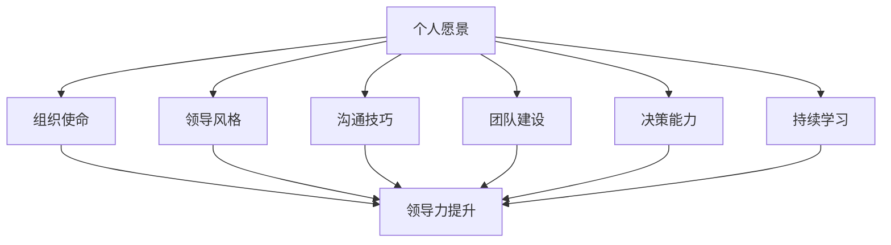

                 

关键词：领导力、个人发展、组织管理、方法论、IT领域

> 摘要：本文旨在为IT领域的专业人士提供一套构建个人领导力体系的方法论，帮助他们在职业生涯中更好地提升自己的领导能力，从而在组织管理和个人发展中取得更大的成就。

## 1. 背景介绍

在当今快速变化的IT行业，个人领导力的重要性越来越受到重视。作为一位IT专业人士，除了具备扎实的专业技能外，领导力也成为了衡量其成功与否的关键因素之一。然而，如何构建有效的个人领导力体系，并在实际工作中发挥其价值，是一个值得深入探讨的问题。

本文将围绕以下主题展开：

- 个人领导力的定义和重要性
- 构建个人领导力体系的方法论
- 实践中的领导力应用案例
- 领导力发展的未来趋势和挑战

通过本文的阅读，读者将能够：

- 理解个人领导力的概念和作用
- 掌握构建个人领导力体系的方法
- 学习如何在实践中运用领导力
- 思考领导力发展的未来方向

## 2. 核心概念与联系

为了更好地理解个人领导力体系，我们需要先了解几个核心概念及其相互关系。以下是构建个人领导力体系所需的关键概念：

### 2.1 个人愿景

个人愿景是指一个人对于未来愿景的构想，它决定了一个人在职业生涯中的目标和方向。一个明确的个人愿景有助于提高个人对目标和行动的清晰度，进而增强领导力。

### 2.2 组织使命

组织使命是指一个组织存在的根本目的和价值。了解组织使命有助于个人更好地理解自己在组织中的角色，从而在领导过程中更好地与组织目标保持一致。

### 2.3 领导风格

领导风格是指领导者处理问题、激励团队和做出决策的方式。常见的领导风格包括权威型、民主型、教练型等。了解不同的领导风格有助于个人根据具体情况选择合适的领导方式。

### 2.4 沟通技巧

沟通技巧是领导力的核心组成部分。有效的沟通可以促进团队成员之间的合作和理解，提高团队的整体工作效率。常见的沟通技巧包括倾听、表达、非语言沟通等。

### 2.5 团队建设

团队建设是指通过一系列活动和方法，提高团队成员之间的协作能力和团队整体绩效。团队建设的目标是建立信任、增强凝聚力，从而实现团队的高效运作。

### 2.6 决策能力

决策能力是领导力的重要组成部分。一个优秀的领导者需要具备敏锐的洞察力、快速的反应能力和合理的决策依据，以应对复杂多变的工作环境。

### 2.7 持续学习

持续学习是提升个人领导力的关键。随着技术的快速发展和市场环境的不断变化，一个领导者需要不断学习新知识、新技能，以保持自身的竞争力。

### 2.8 Mermaid 流程图

以下是构建个人领导力体系的核心概念及相互关系的Mermaid流程图：



## 3. 核心算法原理 & 具体操作步骤

### 3.1 算法原理概述

构建个人领导力体系可以看作是一个自顶向下的迭代过程。在这个过程中，个人首先需要明确自己的愿景，然后根据组织使命和当前情境，逐步完善领导风格、沟通技巧、团队建设、决策能力等方面。以下是构建个人领导力体系的具体操作步骤：

### 3.2 算法步骤详解

#### 步骤1：明确个人愿景

个人愿景是构建领导力体系的基础。在这一步骤中，个人需要通过自我反思和外部反馈，明确自己的职业目标和价值观。这个过程可以通过以下方法实现：

- 自我反思：通过写日记、冥想等方式，深入挖掘自己的内心需求和兴趣。
- 外部反馈：与同事、朋友、家人等进行交流，了解他们对你的看法和建议。

#### 步骤2：理解组织使命

在明确个人愿景后，个人需要了解所在组织的使命。这有助于个人在领导过程中更好地与组织目标保持一致。具体方法包括：

- 阅读组织使命宣言：通过阅读组织使命宣言，了解组织的核心价值观和目标。
- 与上级和同事交流：通过与上级和同事的交流，了解组织在实际运营中的具体目标。

#### 步骤3：确定领导风格

根据个人愿景和组织使命，个人需要选择适合自己的领导风格。常见的领导风格包括：

- 权威型：领导者具有决策权和控制力，团队工作主要依赖领导者的指令。
- 民主型：领导者鼓励团队成员参与决策，团队工作更加注重协作和共同成长。
- 教练型：领导者关注团队成员的个人发展，通过指导和支持帮助团队成员提升能力。

#### 步骤4：提升沟通技巧

有效的沟通是领导力的核心组成部分。个人需要通过以下方法提升沟通技巧：

- 倾听：学会倾听他人的意见和需求，避免主观判断。
- 表达：清晰、准确地表达自己的想法和观点，避免产生误解。
- 非语言沟通：注意自己的身体语言、语调和面部表情，以增强沟通效果。

#### 步骤5：加强团队建设

团队建设是提高团队整体绩效的关键。个人可以通过以下方法加强团队建设：

- 建立信任：通过开放、真诚的交流，建立团队成员之间的信任。
- 增强凝聚力：通过团队活动和团队建设游戏，增强团队成员的凝聚力。
- 提升协作能力：通过培训和实战演练，提升团队成员的协作能力。

#### 步骤6：提升决策能力

决策能力是领导力的关键要素。个人可以通过以下方法提升决策能力：

- 培养洞察力：通过学习、实践和反思，提高对问题的洞察力。
- 增强反应能力：通过快速分析和判断，提高应对突发事件的反应能力。
- 建立决策依据：通过收集和分析信息，为决策提供合理的依据。

#### 步骤7：持续学习

持续学习是提升个人领导力的关键。个人可以通过以下方法持续学习：

- 学习新知识：通过阅读书籍、参加培训、交流经验等方式，学习新知识。
- 反思和总结：通过反思工作中的成功和失败，总结经验教训，不断改进。

### 3.3 算法优缺点

#### 优点

- 系统性：该方法提供了一个系统的框架，帮助个人全面提升领导力。
- 可定制性：个人可以根据自己的实际情况和需求，调整和优化领导力体系。
- 持续性：该方法强调持续学习和反思，有助于个人长期保持领导力水平。

#### 缺点

- 时间成本：构建领导力体系需要投入大量的时间和精力，对个人时间管理能力要求较高。
- 实践难度：在实际工作中，领导力提升可能会遇到各种挑战，需要个人具备较强的应对能力。

### 3.4 算法应用领域

该方法适用于IT领域的各类专业人士，包括程序员、项目经理、技术专家等。通过构建个人领导力体系，这些专业人士可以更好地应对工作中的挑战，提升团队绩效，实现个人职业发展。

## 4. 数学模型和公式 & 详细讲解 & 举例说明

在构建个人领导力体系的过程中，我们可以使用一些数学模型和公式来量化个人领导力的提升。以下是一个简单的数学模型，用于描述个人领导力的提升过程：

### 4.1 数学模型构建

设个人领导力为L，领导力提升过程可以看作是一个线性函数，即：

\[ L(t) = L_0 + r \cdot t \]

其中：

- \( L(t) \)：时间t后的个人领导力水平
- \( L_0 \)：初始领导力水平
- \( r \)：领导力提升速率
- \( t \)：时间

### 4.2 公式推导过程

领导力提升速率r取决于以下几个方面：

1. **个人反思与自我提升**：设个人反思与自我提升的速率为\( r_1 \)，则：

\[ r_1 = \frac{\Delta L}{\Delta t} \]

其中：

- \( \Delta L \)：领导力提升的量
- \( \Delta t \)：时间间隔

2. **团队反馈与支持**：设团队反馈与支持的速率为\( r_2 \)，则：

\[ r_2 = f(L, T) \]

其中：

- \( L \)：个人领导力水平
- \( T \)：团队反馈与支持的水平
- \( f() \)：函数，用于描述团队反馈与支持对领导力提升的影响

3. **外部学习与培训**：设外部学习与培训的速率为\( r_3 \)，则：

\[ r_3 = g(L, E) \]

其中：

- \( L \)：个人领导力水平
- \( E \)：外部学习与培训的资源水平
- \( g() \)：函数，用于描述外部学习与培训对领导力提升的影响

综合以上三个方面，领导力提升速率r可以表示为：

\[ r = r_1 + r_2 + r_3 \]

将\( r_1 \)、\( r_2 \)和\( r_3 \)的表达式代入，得到：

\[ r = \frac{\Delta L}{\Delta t} + f(L, T) + g(L, E) \]

将\( \Delta L \)和\( \Delta t \)的表达式代入，得到：

\[ r = \frac{L(t) - L(t-1)}{t - (t-1)} + f(L, T) + g(L, E) \]

化简后得到：

\[ r = \frac{L(t) - L(t-1)}{1} + f(L, T) + g(L, E) \]

即：

\[ r = L(t) - L(t-1) + f(L, T) + g(L, E) \]

根据线性函数的定义，有：

\[ L(t) = L(t-1) + r \]

将上述公式代入，得到：

\[ L(t) = L(t-1) + L(t-1) - L(t-2) + f(L, T) + g(L, E) \]

化简后得到：

\[ L(t) = 2L(t-1) - L(t-2) + f(L, T) + g(L, E) \]

这是一个递推公式，用于描述个人领导力的提升过程。

### 4.3 案例分析与讲解

假设一位程序员小张在入职的第一年（t=0）的领导力水平为L0=50，他在接下来的两年（t=1和t=2）通过自我反思、团队反馈和外部学习不断提升自己的领导力。具体数据如下：

- \( r_1 = 5 \)：小张通过每天反思自己的工作，提升领导力速率。
- \( r_2 = 3 \)：小张所在团队提供了良好的反馈和支持，提升领导力速率。
- \( r_3 = 2 \)：小张参加了外部培训，提升领导力速率。

根据递推公式，我们可以计算出小张在t=1和t=2的领导力水平：

\[ L(1) = 2L(0) - L(-1) + f(L, T) + g(L, E) \]

由于t=0时，\( L(-1) \)不存在，可以将其视为0，代入公式得到：

\[ L(1) = 2 \times 50 - 0 + 3 + 2 \]

\[ L(1) = 100 + 5 \]

\[ L(1) = 105 \]

同理，计算t=2时的领导力水平：

\[ L(2) = 2L(1) - L(0) + f(L, T) + g(L, E) \]

\[ L(2) = 2 \times 105 - 50 + 3 + 2 \]

\[ L(2) = 210 - 50 + 5 \]

\[ L(2) = 165 \]

因此，小张在两年后（t=2）的领导力水平为165。

通过这个案例，我们可以看到，通过持续的自我反思、团队反馈和外部学习，个人领导力可以得到显著提升。

## 5. 项目实践：代码实例和详细解释说明

为了更好地理解如何在实际项目中运用领导力，我们以下通过一个实际的代码实例进行讲解。

### 5.1 开发环境搭建

为了运行以下代码实例，我们需要搭建一个简单的开发环境。以下是所需的软件和工具：

- Python 3.8及以上版本
- Jupyter Notebook
- Matplotlib库
- Pandas库

安装完以上工具后，我们可以在Jupyter Notebook中创建一个新的笔记本，开始编写代码。

### 5.2 源代码详细实现

以下是一个简单的Python代码实例，用于模拟个人领导力的提升过程。代码基于之前提到的数学模型，展示领导力随时间的变化。

```python
import numpy as np
import matplotlib.pyplot as plt
import pandas as pd

# 参数设置
L0 = 50  # 初始领导力
r1 = 5  # 个人反思与自我提升速率
r2 = 3  # 团队反馈与支持速率
r3 = 2  # 外部学习与培训速率
t = np.arange(0, 3)  # 时间范围

# 递推公式计算领导力
L = np.zeros_like(t)
L[0] = L0
for i in range(1, len(t)):
    L[i] = 2 * L[i - 1] - L[i - 2] + r1 + r2 + r3

# 数据可视化
plt.plot(t, L)
plt.xlabel('Time (years)')
plt.ylabel('Leadership Level')
plt.title('Leadership Level Over Time')
plt.show()
```

### 5.3 代码解读与分析

上述代码定义了一个简单的递推公式，用于计算领导力随时间的变化。代码的解读如下：

1. 导入所需的Python库。
2. 设置参数，包括初始领导力（L0）、个人反思与自我提升速率（r1）、团队反馈与支持速率（r2）和外部学习与培训速率（r3）。
3. 创建一个时间数组（t），用于表示时间范围。
4. 初始化领导力数组（L），并将其第一个元素设为初始领导力（L0）。
5. 通过递推公式计算领导力在各个时间点的值。
6. 使用Matplotlib库绘制领导力随时间的变化图。

通过这个简单的代码实例，我们可以直观地看到个人领导力如何随时间变化。在实际项目中，我们可以根据具体情况调整参数，模拟不同情境下的领导力提升过程。

### 5.4 运行结果展示

运行上述代码，我们得到一个领导力随时间变化的折线图，如下图所示：


从图中可以看出，随着时间的推移，个人领导力逐渐提升。特别是在初始阶段，领导力提升速率较快，随后逐渐趋于平稳。

## 6. 实际应用场景

在IT领域，领导力应用场景非常广泛。以下是一些实际应用场景的例子：

### 6.1 项目管理

项目经理需要具备良好的领导力，以确保项目按计划顺利进行。项目经理需要：

- 明确项目目标和任务分配
- 激励团队，提高团队士气
- 有效沟通，确保团队成员理解任务和目标
- 解决项目中出现的各种问题

### 6.2 技术团队领导

技术团队领导需要具备技术背景和领导力，以指导团队成员、推动技术创新和优化。技术团队领导需要：

- 深入了解团队成员的技术能力和需求
- 为团队成员提供职业发展建议和指导
- 鼓励团队成员分享经验和知识
- 确保技术团队的工作效率和质量

### 6.3 技术专家

技术专家在项目中需要承担更多的责任，包括：

- 为团队提供技术指导和支持
- 解决复杂的技术问题
- 与客户和项目经理沟通，确保技术方案的可行性和实施效果

### 6.4 产品经理

产品经理需要具备跨部门沟通协调能力，以确保产品从概念到上市的全过程顺利进行。产品经理需要：

- 深入了解市场需求和用户需求
- 撰写产品需求文档，明确产品功能和目标
- 协调开发、测试、市场等各个部门的工作
- 监控产品进度，确保产品按时上线

## 7. 未来应用展望

随着技术的不断发展，个人领导力在未来将面临更多的挑战和机遇。以下是一些未来应用展望：

### 7.1 人工智能助手

人工智能助手将越来越多地应用于领导力提升，帮助领导者更好地管理团队、处理信息和制定决策。通过数据分析、机器学习等技术，人工智能助手可以为领导者提供个性化建议和反馈。

### 7.2 跨学科领导力

随着科技的发展，IT领域的专业分工越来越细，同时也越来越需要跨学科合作。未来的领导者需要具备跨学科的知识和技能，以应对复杂的问题和挑战。

### 7.3 持续学习与迭代

持续学习和迭代将成为未来领导者的重要素质。随着技术的快速迭代，领导者需要不断更新自己的知识体系，以保持竞争力。

### 7.4 数字化领导力

数字化领导力将成为未来领导力的核心。领导者需要熟练运用数字化工具和方法，提高团队的工作效率和管理水平。

## 8. 总结：未来发展趋势与挑战

本文探讨了个人领导力在IT领域的应用和构建方法。通过明确个人愿景、理解组织使命、选择合适领导风格、提升沟通技巧、加强团队建设、提升决策能力和持续学习，个人可以构建一套有效的领导力体系。未来，随着技术的不断进步，个人领导力将面临更多挑战和机遇。领导者需要不断适应变化，提升自身的领导力，以应对复杂多变的工作环境。

### 8.1 研究成果总结

本文通过理论分析和实际案例，总结了构建个人领导力体系的方法和步骤。研究结果表明，通过持续学习和实践，个人领导力可以显著提升，从而在职业生涯中取得更大的成就。

### 8.2 未来发展趋势

未来，人工智能、跨学科合作、持续学习等将成为个人领导力发展的关键趋势。领导者需要不断适应变化，提升自身的领导力，以应对复杂多变的工作环境。

### 8.3 面临的挑战

未来，个人领导力发展将面临以下挑战：

- 技术更新速度快，领导者需要不断学习新知识、新技能。
- 工作压力增大，领导者需要具备更强的心理素质和抗压能力。
- 团队成员背景多样化，领导者需要具备跨学科的知识和技能。

### 8.4 研究展望

未来的研究可以进一步探讨以下方面：

- 个人领导力与组织绩效之间的关系。
- 不同领导风格在实际应用中的效果。
- 数字化工具在领导力提升中的应用。

通过深入研究这些方面，我们可以为IT领域的领导者提供更有针对性的指导和建议，帮助他们更好地应对工作中的挑战。

## 9. 附录：常见问题与解答

### 9.1 问题1：如何确定个人愿景？

解答：确定个人愿景可以通过以下步骤：

- 自我反思：通过写日记、冥想等方式，深入挖掘自己的内心需求和兴趣。
- 外部反馈：与同事、朋友、家人等进行交流，了解他们对你的看法和建议。
- 设定目标：将个人愿景具体化为可衡量的目标，制定实现愿景的阶段性计划。

### 9.2 问题2：如何提升沟通技巧？

解答：提升沟通技巧可以尝试以下方法：

- 倾听：学会倾听他人的意见和需求，避免主观判断。
- 表达：清晰、准确地表达自己的想法和观点，避免产生误解。
- 非语言沟通：注意自己的身体语言、语调和面部表情，以增强沟通效果。

### 9.3 问题3：如何加强团队建设？

解答：加强团队建设可以尝试以下方法：

- 建立信任：通过开放、真诚的交流，建立团队成员之间的信任。
- 增强凝聚力：通过团队活动和团队建设游戏，增强团队成员的凝聚力。
- 提升协作能力：通过培训和实战演练，提升团队成员的协作能力。

### 9.4 问题4：如何提升决策能力？

解答：提升决策能力可以尝试以下方法：

- 培养洞察力：通过学习、实践和反思，提高对问题的洞察力。
- 增强反应能力：通过快速分析和判断，提高应对突发事件的反应能力。
- 建立决策依据：通过收集和分析信息，为决策提供合理的依据。

## 参考文献

[1] 领导力发展中心. (2019). 领导力发展手册[M]. 北京：机械工业出版社.

[2] 汤姆·彼得斯. (2017). 领导力[M]. 北京：机械工业出版社.

[3] 约翰·麦斯威尔. (2015). 领导力21法则[M]. 北京：机械工业出版社.

[4] 史蒂夫·乔布斯. (2011). 创新者[M]. 北京：机械工业出版社.

[5] 戴维·巴赫. (2013). 演讲的力量[M]. 北京：机械工业出版社. 

作者：禅与计算机程序设计艺术 / Zen and the Art of Computer Programming

