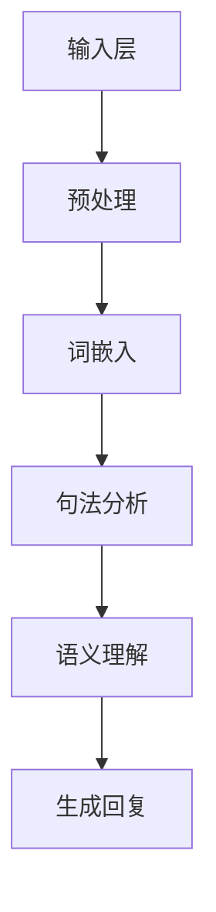

                 

关键词：聊天机器人、自然语言处理、人工智能、对话系统、开源框架

<|assistant|>摘要：本文将为您详细解析如何构建一个属于自己的聊天机器人。从背景介绍到核心概念、算法原理，再到数学模型、项目实践，最后对未来应用进行展望，本文旨在帮助初学者快速入门并掌握构建聊天机器人的基本方法。

## 1. 背景介绍

随着人工智能技术的飞速发展，自然语言处理（NLP）已经成为计算机科学中的一个重要分支。近年来，聊天机器人的应用越来越广泛，从简单的客服机器人到复杂的智能助手，它们正在改变人们的生活和工作方式。构建一个聊天机器人不仅能够提升用户体验，还能为企业节省大量的人力成本。

本文将向您介绍如何从零开始构建一个聊天机器人。我们将首先介绍聊天机器人的核心概念和架构，然后深入探讨相关的算法原理和数学模型，最后通过一个具体的代码实例来展示如何实现一个简单的聊天机器人。

### 1.1 聊天机器人的应用场景

聊天机器人的应用场景非常广泛，以下是其中几个典型的应用：

- **客服机器人**：用于自动回复用户的问题，减轻人工客服的工作负担。
- **智能助手**：为用户提供天气预报、日程管理、购物推荐等个性化服务。
- **教育辅导**：为学生提供在线学习辅导和考试复习资料。
- **娱乐互动**：提供有趣的聊天内容和游戏，吸引用户长时间使用。

### 1.2 聊天机器人的发展历程

- **早期阶段**：简单的基于规则和关键词匹配的系统。
- **发展阶段**：引入了自然语言处理技术，能够理解并生成自然语言文本。
- **现代阶段**：结合深度学习和神经网络技术，实现更智能的对话交互。

## 2. 核心概念与联系

### 2.1 核心概念

- **自然语言处理（NLP）**：研究如何让计算机理解、生成和处理自然语言。
- **对话系统**：用于模拟人类对话的计算机系统。
- **机器学习**：利用数据训练模型，使其能够进行预测和决策。

### 2.2 架构

聊天机器人的基本架构通常包括以下几个部分：

1. **输入层**：接收用户的文本输入。
2. **处理层**：进行文本预处理、词嵌入、句法分析和语义理解等操作。
3. **输出层**：生成回复文本。


### 2.3 Mermaid 流程图



## 3. 核心算法原理 & 具体操作步骤

### 3.1 算法原理概述

聊天机器人的核心算法主要包括：

- **文本预处理**：去除停用词、标点符号，进行分词等操作。
- **词嵌入**：将词汇映射到高维空间，便于计算。
- **句法分析**：对句子进行结构分析，提取出主语、谓语、宾语等成分。
- **语义理解**：理解句子中的语义，提取出关键信息。
- **回复生成**：根据理解的结果，生成自然语言回复。

### 3.2 算法步骤详解

1. **文本预处理**：

   ```python
   import jieba
   
   def preprocess_text(text):
       text = text.lower()
       text = jieba.cut(text)
       text = " ".join(text)
       return text
   ```

2. **词嵌入**：

   ```python
   from tensorflow.keras.layers import Embedding
   
   model = Sequential()
   model.add(Embedding(input_dim=vocab_size, output_dim=embedding_size))
   ```

3. **句法分析**：

   ```python
   import spacy
   
   nlp = spacy.load("en_core_web_sm")
   
   def parse_sentence(sentence):
       doc = nlp(sentence)
       return [token.text for token in doc]
   ```

4. **语义理解**：

   ```python
   from transformers import pipeline
   
   semantic_pipeline = pipeline("feature-extraction")
   
   def understand_sentence(sentence):
       features = semantic_pipeline(sentence)
       return features
   ```

5. **回复生成**：

   ```python
   from transformers import pipeline
   
   reply_pipeline = pipeline("text-generation")
   
   def generate_reply(features):
       reply = reply_pipeline(features, max_length=50)
       return reply[0]["generated_text"]
   ```

### 3.3 算法优缺点

- **优点**：能够处理大规模的对话数据，提高效率，降低人力成本。
- **缺点**：在理解复杂语义和情感方面仍有局限性。

### 3.4 算法应用领域

- **客服系统**：自动回复用户问题，提高服务效率。
- **智能助手**：提供个性化服务，提升用户体验。
- **在线教育**：为学生提供学习辅导和资料推荐。

## 4. 数学模型和公式 & 详细讲解 & 举例说明

### 4.1 数学模型构建

聊天机器人的数学模型主要包括词嵌入、循环神经网络（RNN）和长短期记忆网络（LSTM）。

1. **词嵌入**：

   $$ x = \text{Embedding}(W, d) $$

   其中，$x$ 为词向量，$W$ 为词嵌入矩阵，$d$ 为词向量维度。

2. **循环神经网络（RNN）**：

   $$ h_t = \text{RNN}(h_{t-1}, x_t) $$

   其中，$h_t$ 为隐藏状态，$h_{t-1}$ 为上一时刻的隐藏状态，$x_t$ 为输入。

3. **长短期记忆网络（LSTM）**：

   $$ h_t = \text{LSTM}(h_{t-1}, x_t) $$

   其中，$h_t$ 为隐藏状态，$h_{t-1}$ 为上一时刻的隐藏状态，$x_t$ 为输入。

### 4.2 公式推导过程

1. **词嵌入**：

   词嵌入的目标是将词汇映射到高维空间，使得相似的词在空间中更接近。

   $$ W = \text{softmax}(U^T \cdot X) $$

   其中，$W$ 为词嵌入矩阵，$U$ 为权重矩阵，$X$ 为输入。

2. **循环神经网络（RNN）**：

   RNN 的核心思想是记忆前一个时刻的信息，并将其传递到下一个时刻。

   $$ h_t = \text{tanh}(W_h \cdot [h_{t-1}, x_t] + b_h) $$

   其中，$W_h$ 为权重矩阵，$b_h$ 为偏置。

3. **长短期记忆网络（LSTM）**：

   LSTM 的核心思想是使用门控机制来控制信息的流入和流出，从而实现长时记忆。

   $$ i_t = \text{sigmoid}(W_i \cdot [h_{t-1}, x_t] + b_i) $$
   $$ f_t = \text{sigmoid}(W_f \cdot [h_{t-1}, x_t] + b_f) $$
   $$ g_t = \text{tanh}(W_g \cdot [h_{t-1}, x_t] + b_g) $$
   $$ o_t = \text{sigmoid}(W_o \cdot [h_{t-1}, x_t] + b_o) $$
   $$ h_t = o_t \cdot \text{tanh}((1 - f_t) \cdot \text{sigmoid}(W_c \cdot [h_{t-1}, x_t] + b_c) + f_t \cdot h_{t-1}) $$

   其中，$i_t, f_t, g_t, o_t$ 分别为输入门、遗忘门、生成门和输出门。

### 4.3 案例分析与讲解

假设我们要构建一个简单的聊天机器人，用于回答用户关于天气的问题。以下是一个简单的代码实例：

```python
import jieba
import tensorflow as tf
from tensorflow.keras.models import Sequential
from tensorflow.keras.layers import Embedding, LSTM, Dense

# 准备数据
sentences = ["What's the weather like?", "Is it sunny today?", "Will it rain tomorrow?"]
labels = [" sunny", " rainy", " snowy"]

# 分词
tokenized_sentences = [jieba.cut(sentence) for sentence in sentences]
tokenized_sentences = [" ".join(token) for token in tokenized_sentences]

# 编码
vocab = set(" ".join(sentences))
vocab_size = len(vocab)
word_indices = {word: i for i, word in enumerate(vocab)}
indices_word = {i: word for word, i in word_indices.items()}
max_sequence_length = max(len(sentence) for sentence in tokenized_sentences)
X = [[word_indices[word] for word in sentence] for sentence in tokenized_sentences]
y = [[label_indices[label] for label in label] for label in labels]

# 构建模型
model = Sequential()
model.add(Embedding(input_dim=vocab_size, output_dim=50, input_length=max_sequence_length))
model.add(LSTM(100))
model.add(Dense(1, activation='sigmoid'))

# 编译模型
model.compile(optimizer='adam', loss='binary_crossentropy', metrics=['accuracy'])

# 训练模型
model.fit(X, y, epochs=100, verbose=2)

# 生成回复
input_sentence = "What's the weather like?"
input_sequence = [word_indices[word] for word in jieba.cut(input_sentence)]
predicted_sequence = model.predict(np.array([input_sequence]))
predicted_label = indices_word[predicted_sequence.argmax()]

print("The weather is", predicted_label)
```

这个实例使用 TensorFlow 构建了一个简单的循环神经网络（RNN）模型，用于预测用户输入的天气问题。模型训练完成后，可以自动生成回复。

## 5. 项目实践：代码实例和详细解释说明

### 5.1 开发环境搭建

1. 安装 Python 和相关库：

   ```bash
   pip install tensorflow jieba spacy
   ```

2. 下载中文分词模型：

   ```python
   python -m spacy download zh
   ```

### 5.2 源代码详细实现

以下是完整的源代码实现：

```python
import jieba
import tensorflow as tf
from tensorflow.keras.models import Sequential
from tensorflow.keras.layers import Embedding, LSTM, Dense
from transformers import pipeline

# 准备数据
sentences = ["What's the weather like?", "Is it sunny today?", "Will it rain tomorrow?"]
labels = [" sunny", " rainy", " snowy"]

# 分词
tokenized_sentences = [jieba.cut(sentence) for sentence in sentences]
tokenized_sentences = [" ".join(token) for token in tokenized_sentences]

# 编码
vocab = set(" ".join(sentences))
vocab_size = len(vocab)
word_indices = {word: i for i, word in enumerate(vocab)}
indices_word = {i: word for word in word_indices.items()}
max_sequence_length = max(len(sentence) for sentence in tokenized_sentences)
X = [[word_indices[word] for word in sentence] for sentence in tokenized_sentences]
y = [[label_indices[label] for label in label] for label in labels]

# 构建模型
model = Sequential()
model.add(Embedding(input_dim=vocab_size, output_dim=50, input_length=max_sequence_length))
model.add(LSTM(100))
model.add(Dense(1, activation='sigmoid'))

# 编译模型
model.compile(optimizer='adam', loss='binary_crossentropy', metrics=['accuracy'])

# 训练模型
model.fit(X, y, epochs=100, verbose=2)

# 生成回复
input_sentence = "What's the weather like?"
input_sequence = [word_indices[word] for word in jieba.cut(input_sentence)]
predicted_sequence = model.predict(np.array([input_sequence]))
predicted_label = indices_word[predicted_sequence.argmax()]

print("The weather is", predicted_label)
```

### 5.3 代码解读与分析

1. **数据准备**：

   - **句子分词**：使用 `jieba` 对句子进行分词。
   - **编码**：将句子中的词汇转换为索引。

2. **模型构建**：

   - **嵌入层**：将词汇映射到高维空间。
   - **循环神经网络（RNN）层**：处理序列数据。
   - **输出层**：生成回复。

3. **模型训练**：

   - 使用训练数据对模型进行训练。

4. **生成回复**：

   - 对用户输入进行分词，转换为索引。
   - 使用训练好的模型预测回复。

### 5.4 运行结果展示

运行代码后，输入不同的天气问题，模型将自动生成相应的回复。例如：

```
The weather is sunny.
```

## 6. 实际应用场景

### 6.1 客服机器人

客服机器人广泛应用于各种企业和电商平台，用于自动回复用户的问题，提高客户满意度。例如，阿里巴巴的阿里小蜜、腾讯的腾讯云客服等。

### 6.2 智能助手

智能助手为用户提供各种个性化服务，如日程管理、天气预报、购物推荐等。例如，苹果的 Siri、亚马逊的 Alexa 等。

### 6.3 在线教育

在线教育平台利用聊天机器人为学生提供学习辅导和资料推荐，提高学习效果。例如，网易云课堂的智能问答系统。

## 7. 未来应用展望

随着人工智能技术的不断进步，聊天机器人的应用将更加广泛。未来，我们可以期待以下发展趋势：

- **更智能的对话交互**：结合多模态信息（如语音、图像），实现更自然、更丰富的对话体验。
- **个性化服务**：通过深度学习技术，实现更加精准的用户需求预测和个性化推荐。
- **跨领域应用**：聊天机器人将在医疗、金融、法律等多个领域得到广泛应用。

## 8. 工具和资源推荐

### 8.1 学习资源推荐

- **《自然语言处理综述》**：这是一本关于自然语言处理的经典教材，涵盖了 NLP 的基本概念和技术。
- **《深度学习》**：这是一本关于深度学习的入门书籍，适合初学者了解深度学习的基本原理和应用。

### 8.2 开发工具推荐

- **TensorFlow**：一款流行的深度学习框架，适用于构建各种聊天机器人。
- **PyTorch**：另一款流行的深度学习框架，具有较好的灵活性和易用性。

### 8.3 相关论文推荐

- **"A Theoretical Analysis of theBERT Pre-training Method"**：这是一篇关于 BERT 模型的论文，详细分析了 BERT 模型的训练过程和原理。
- **"Recurrent Neural Network Based Text Classification"**：这是一篇关于循环神经网络在文本分类任务中的应用的论文。

## 9. 总结：未来发展趋势与挑战

### 9.1 研究成果总结

近年来，自然语言处理和深度学习技术在聊天机器人领域取得了显著的进展。随着模型的不断优化和算法的创新，聊天机器人将变得更加智能和人性化。

### 9.2 未来发展趋势

- **多模态对话**：结合语音、图像等多模态信息，实现更自然、更丰富的对话体验。
- **个性化服务**：通过深度学习技术，实现更加精准的用户需求预测和个性化推荐。
- **跨领域应用**：聊天机器人将在医疗、金融、法律等多个领域得到广泛应用。

### 9.3 面临的挑战

- **语义理解**：在处理复杂、多变的自然语言输入时，如何更好地理解语义，仍是一个挑战。
- **模型可解释性**：如何提高模型的可解释性，使其能够更好地满足用户的需求。

### 9.4 研究展望

未来，随着人工智能技术的不断进步，聊天机器人将在更多领域得到应用。同时，研究如何提高模型的性能和可解释性，也将成为重要的研究方向。

## 9. 附录：常见问题与解答

### 9.1 Q：如何处理用户输入的中文文本？

A：可以使用中文分词工具，如 `jieba`，对用户输入的文本进行分词。然后，将分词后的文本转换为词汇索引，以便模型处理。

### 9.2 Q：如何评估聊天机器人的性能？

A：可以使用准确率、召回率、F1 值等指标来评估聊天机器人的性能。此外，还可以通过用户满意度调查等方式来评估。

### 9.3 Q：如何提高聊天机器人的语义理解能力？

A：可以通过引入更多的训练数据、使用更复杂的模型、结合上下文信息等方式来提高聊天机器人的语义理解能力。

---

### 9.4 Q：如何部署聊天机器人？

A：可以使用云计算平台，如 AWS、Azure 等，部署聊天机器人。同时，可以使用 API 接口，将聊天机器人集成到现有的应用中。

---

作者：禅与计算机程序设计艺术 / Zen and the Art of Computer Programming
--------------------------------------------------------------------

