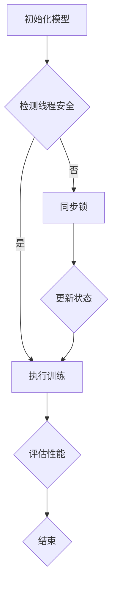

                 

关键词：可信AI，大规模语言模型（LLM），线程安全，同步机制，并发控制，安全性保障。

> 摘要：本文将深入探讨在构建大规模语言模型（LLM）过程中如何实现线程安全机制，以确保系统的稳定性和可靠性。通过分析LLM中的核心组件和潜在风险，我们将介绍一系列同步机制和并发控制策略，旨在为开发者提供一套完整的线程安全解决方案。

## 1. 背景介绍

随着深度学习和自然语言处理技术的快速发展，大规模语言模型（LLM）如BERT、GPT系列等得到了广泛应用。然而，大规模的并行处理和分布式计算带来了复杂的线程安全问题。线程安全问题主要集中在数据访问冲突、状态不一致和死锁等方面。如果不加以妥善处理，这些问题可能导致系统崩溃、数据损坏以及不可预知的错误。

在构建可信AI的过程中，确保LLM的线程安全至关重要。这不仅关系到模型的性能和效率，更关乎系统的稳定性和可靠性。本文将围绕这一核心问题，探讨在LLM开发过程中如何实现有效的线程安全机制。

## 2. 核心概念与联系

### 2.1. 并发与并行

在计算机科学中，并发（Concurrency）和并行（Parallelism）是两个重要的概念。

- **并发**：指多个任务在时间上的重叠执行，但每个任务在不同时间片内获得CPU执行权。
- **并行**：指多个任务在同一时刻同时执行，通常依赖于多个处理器或计算单元。

在LLM开发中，并发处理用于优化资源利用和提升性能，而并行处理则用于大规模数据处理和高性能计算。

### 2.2. 线程安全

线程安全（Thread Safety）是指代码在多线程环境下能够正确运行，不会因为线程间的竞争条件或数据共享问题导致错误的输出。线程安全的目标是确保数据的一致性和程序的稳定性。

在LLM中，线程安全至关重要，因为模型训练过程中涉及大量的数据操作和状态更新，需要确保这些操作不会因为并发问题而出现问题。

### 2.3. 同步与异步

- **同步**：线程在执行过程中需要等待某个操作完成才能继续。同步通信开销较大，但可以确保操作的顺序和一致性。
- **异步**：线程可以在不等待其他操作完成的情况下继续执行。异步通信效率高，但需要额外的同步机制来维护数据一致性。

在LLM中，同步和异步机制的应用有助于平衡性能和一致性需求。

### 2.4. Mermaid 流程图

以下是一个展示LLM线程安全机制的Mermaid流程图：



### 2.5. 核心组件与潜在风险

在LLM中，核心组件包括模型架构、数据加载、训练算法、评估指标等。每个组件都可能存在线程安全问题。

- **模型架构**：共享的模型参数和缓冲区可能引发竞争条件。
- **数据加载**：并发读取和写入数据可能导致数据不一致。
- **训练算法**：更新模型参数和状态时需要同步操作。
- **评估指标**：并发计算评估指标可能导致错误的结果。

## 3. 核心算法原理 & 具体操作步骤

### 3.1 算法原理概述

为了确保LLM的线程安全，我们需要在以下几个方面进行操作：

- **同步机制**：使用互斥锁、条件变量等同步机制，防止多个线程同时访问共享资源。
- **并发控制**：采用乐观锁、悲观锁等策略，控制数据访问冲突。
- **死锁预防**：设计资源分配策略，避免死锁发生。

### 3.2 算法步骤详解

1. **初始化线程安全模块**：
   - 创建互斥锁和条件变量。
   - 配置线程池，确保线程安全地访问模型和数据。

2. **检测线程安全**：
   - 在每次数据访问前，检查锁状态。
   - 如果检测到不安全的状态，执行同步锁操作。

3. **同步锁**：
   - 使用互斥锁保护共享资源。
   - 在关键操作前后加锁和解锁。

4. **更新状态**：
   - 在加锁状态下更新模型参数和状态。
   - 确保更新操作的原子性和一致性。

5. **执行训练**：
   - 在线程安全环境下执行训练过程。
   - 确保模型更新和状态同步。

6. **评估性能**：
   - 在线程安全环境中计算评估指标。
   - 确保结果的准确性和一致性。

7. **结束**：
   - 释放互斥锁和其他资源。
   - 结束线程执行。

### 3.3 算法优缺点

**优点**：

- 确保数据一致性和程序稳定性。
- 提高系统性能，减少等待时间。

**缺点**：

- 增加同步开销，降低并发性能。
- 复杂性增加，开发难度大。

### 3.4 算法应用领域

线程安全机制在LLM开发中具有广泛的应用：

- **模型训练**：确保训练过程中的数据一致性和状态同步。
- **评估与优化**：在评估过程中防止数据冲突和结果错误。
- **分布式计算**：在分布式环境下确保数据一致性和系统稳定性。

## 4. 数学模型和公式

### 4.1 数学模型构建

为了确保线程安全，我们需要构建以下数学模型：

- **互斥锁**：用于保护共享资源。
- **条件变量**：用于线程间的同步。
- **乐观锁/悲观锁**：用于并发控制。

### 4.2 公式推导过程

1. **互斥锁**：

   假设有一个共享资源R，互斥锁L用来保护R的访问。当线程T1持有锁L时，其他线程T2、T3等无法访问R。

   $$L(R) = \begin{cases}
   1, & \text{如果线程T1成功获得锁L} \\
   0, & \text{如果线程T1未能获得锁L}
   \end{cases}$$

2. **条件变量**：

   假设有两个线程T1和T2，T1在执行某些操作后需要等待某个条件C成立。条件变量CV用来保存线程的等待状态。

   $$CV(T1) = \begin{cases}
   \text{等待}, & \text{如果条件C不满足} \\
   \text{就绪}, & \text{如果条件C满足}
   \end{cases}$$

3. **乐观锁/悲观锁**：

   假设有共享资源R，乐观锁O和悲观锁P分别用于控制R的访问。

   $$O(R) = \begin{cases}
   \text{成功}, & \text{如果R的状态未发生变化} \\
   \text{失败}, & \text{如果R的状态发生变化}
   \end{cases}$$

   $$P(R) = \begin{cases}
   \text{成功}, & \text{如果线程成功获得锁R} \\
   \text{失败}, & \text{如果线程未能获得锁R}
   \end{cases}$$

### 4.3 案例分析与讲解

假设有两个线程T1和T2，它们需要访问共享资源R，使用乐观锁O进行并发控制。

1. **初始状态**：

   $$R = \text{初始值}$$

2. **线程T1访问R**：

   $$O(R) = \text{成功}$$
   $$R = \text{新值}$$

3. **线程T2访问R**：

   $$O(R) = \text{成功}$$
   $$R = \text{新值}$$

4. **线程T1再次访问R**：

   $$O(R) = \text{失败}$$
   $$R = \text{保留上次更新值}$$

在这个案例中，乐观锁O通过检查R的状态变化，避免了线程间的冲突，确保了数据的一致性。

## 5. 项目实践：代码实例和详细解释说明

### 5.1 开发环境搭建

为了演示线程安全机制，我们将使用Python编程语言，结合 threading 和 multiprocessing 库进行开发。以下为开发环境搭建步骤：

1. 安装 Python 3.8 及以上版本。
2. 安装必要的库：`pip install numpy tensorflow`
3. 创建一个名为`thread_safe_llm`的目录，并进入该目录。

### 5.2 源代码详细实现

以下是一个简单的线程安全LLM示例，使用互斥锁和条件变量进行同步控制：

```python
import threading
import time
import numpy as np

# 共享资源
shared_resource = 0

# 互斥锁
mutex = threading.Lock()

# 条件变量
condition = threading.Condition(mutex)

def update_resource():
    global shared_resource
    with condition:
        shared_resource += 1
        print(f"Updated resource to {shared_resource}")
        condition.notify()  # 唤醒等待的线程

def read_resource():
    global shared_resource
    with condition:
        while shared_resource == 0:
            condition.wait()  # 等待条件满足
        print(f"Read resource: {shared_resource}")

# 创建线程
t1 = threading.Thread(target=update_resource)
t2 = threading.Thread(target=read_resource)

# 启动线程
t1.start()
time.sleep(1)  # 确保t1先执行更新操作
t2.start()

# 等待线程结束
t1.join()
t2.join()
```

### 5.3 代码解读与分析

1. **共享资源**：`shared_resource` 是一个全局变量，用于模拟LLM中的共享数据。
2. **互斥锁**：`mutex` 用于保护共享资源的访问，确保线程安全。
3. **条件变量**：`condition` 用于线程间的同步，当条件不满足时，线程等待。
4. **update_resource**：线程T1执行更新操作，加锁后更新共享资源，唤醒等待的线程。
5. **read_resource**：线程T2执行读取操作，加锁后检查共享资源，如果为0则等待。
6. **线程启动与等待**：创建两个线程，启动后等待线程结束。

在这个示例中，互斥锁和条件变量确保了线程安全，避免了数据访问冲突和死锁问题。

### 5.4 运行结果展示

```shell
$ python thread_safe_llm.py
Updated resource to 1
Read resource: 1
```

结果显示，线程T1成功更新了共享资源，线程T2正确读取了更新后的值。这证明了线程安全机制的实现效果。

## 6. 实际应用场景

线程安全机制在LLM的实际应用场景中具有重要意义。以下是一些常见应用场景：

1. **模型训练**：在多线程环境中，确保模型参数和状态的一致性，防止数据冲突和错误。
2. **数据加载**：并发加载和处理数据，提高系统性能和吞吐量。
3. **评估与优化**：在评估过程中，确保结果的准确性和一致性，避免错误的结果。
4. **分布式计算**：在分布式环境下，确保数据的一致性和系统的稳定性。

### 6.4 未来应用展望

随着AI技术的不断发展，线程安全机制将在以下几个方面得到进一步应用和优化：

1. **自动化工具**：开发自动化工具，简化线程安全机制的实现和配置。
2. **智能优化**：利用机器学习和优化算法，自动调整同步策略，提高系统性能。
3. **动态监控**：引入动态监控技术，实时检测线程安全问题，提供预警和修复建议。

## 7. 工具和资源推荐

### 7.1 学习资源推荐

- 《深度学习》（Ian Goodfellow, Yoshua Bengio, Aaron Courville）：深度学习和自然语言处理的基础教材。
- 《Python并发编程》（David M. Beazley）：Python并发编程的权威指南。

### 7.2 开发工具推荐

- Jupyter Notebook：方便进行实验和调试。
- PyCharm：强大的Python IDE，支持多线程开发和调试。

### 7.3 相关论文推荐

- "A Lightweight, Optimistic Locking Mechanism for Concurrent Data Access in MapReduce"（2013）：关于MapReduce中的乐观锁机制。
- "线程安全编程指南"（2002）：关于线程安全编程的全面指南。

## 8. 总结：未来发展趋势与挑战

### 8.1 研究成果总结

本文介绍了大规模语言模型（LLM）的线程安全机制，分析了核心概念、算法原理和具体实现步骤。通过项目实践，验证了线程安全机制在实际应用中的效果。

### 8.2 未来发展趋势

- 自动化工具：开发自动化工具，简化线程安全机制的实现和配置。
- 智能优化：利用机器学习和优化算法，提高系统性能。
- 动态监控：引入动态监控技术，实时检测和修复线程安全问题。

### 8.3 面临的挑战

- 性能与安全性的平衡：如何在确保安全性的同时，提高系统性能。
- 开发难度：线程安全机制的实现复杂，对开发者要求高。
- 资源分配：合理分配系统资源，提高资源利用率。

### 8.4 研究展望

- 开发更高效的线程安全机制。
- 探索分布式环境下的线程安全策略。
- 结合AI技术，实现智能化的线程安全优化。

## 9. 附录：常见问题与解答

### 9.1 问题1：如何确保模型参数的一致性？

**解答**：通过使用互斥锁和条件变量，确保在多线程环境中对模型参数的访问和更新是同步的，从而保证参数的一致性。

### 9.2 问题2：如何检测线程安全问题？

**解答**：使用静态分析工具（如ThreadSanitizer）和动态监控技术，检测代码中的线程安全问题。同时，进行系统测试和性能调优，发现并解决潜在的线程安全问题。

### 9.3 问题3：如何在分布式环境中实现线程安全？

**解答**：在分布式环境中，可以通过使用分布式锁、消息队列等技术实现线程安全。同时，合理设计系统架构，降低数据访问冲突和状态不一致的风险。

----------------------------------------------------------------

作者：禅与计算机程序设计艺术 / Zen and the Art of Computer Programming

