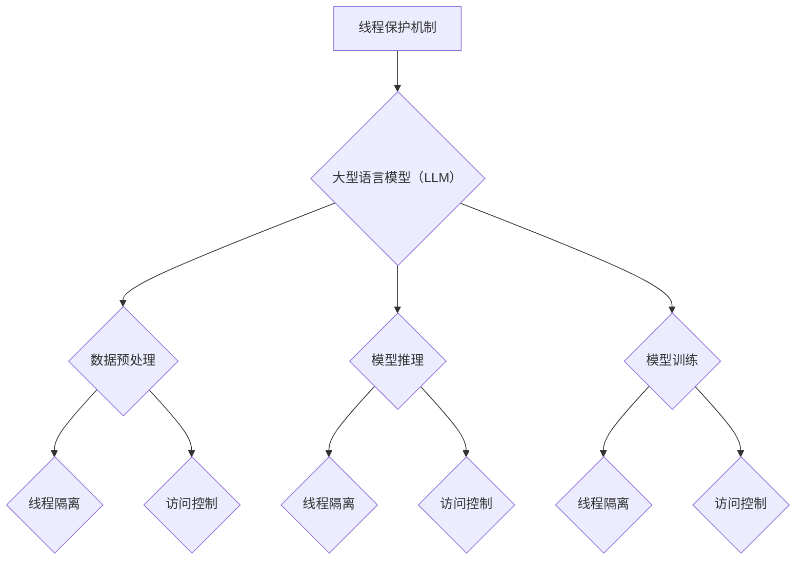

                 

关键词：安全AI，大型语言模型（LLM），线程保护机制，计算机安全，并行处理，安全性分析

## 摘要

本文旨在探讨大型语言模型（LLM）在构建安全AI系统中的重要性，并重点介绍LLM的线程保护机制。随着AI技术的快速发展，确保AI系统的安全性和可靠性变得日益重要。本文将详细分析线程保护机制的核心概念、原理及其在LLM中的应用，为开发者和研究人员提供有价值的参考。此外，还将讨论数学模型、项目实践、实际应用场景以及未来发展趋势。

## 1. 背景介绍

人工智能（AI）技术的迅速发展使得机器学习（ML）和深度学习（DL）成为现代计算机科学的核心领域。特别是在自然语言处理（NLP）方面，大型语言模型（LLM）如GPT、BERT等取得了令人瞩目的成果。这些模型在文本生成、机器翻译、问答系统等方面表现出色，被广泛应用于各种实际场景。

然而，随着AI技术的广泛应用，确保AI系统的安全性也成为一个严峻的问题。AI系统的脆弱性可能会导致数据泄露、恶意攻击、模型欺骗等问题，从而对个人隐私、企业利益乃至国家安全构成威胁。因此，构建安全的AI系统变得至关重要。

线程保护机制作为一种重要的安全措施，旨在防止恶意线程对系统资源的非法访问和操作。在LLM中引入线程保护机制，可以有效地增强模型的安全性和可靠性，防止潜在的攻击和错误传播。

## 2. 核心概念与联系

### 2.1. 线程保护机制

线程保护机制是一种通过隔离和管理线程来提高系统安全性的方法。其主要思想是将线程划分为不同级别的安全区域，并限制线程之间的通信和访问权限。这样，即使一个线程出现异常或受到攻击，也不会影响其他线程的正常运行。

### 2.2. 大型语言模型（LLM）

大型语言模型（LLM）是一种基于深度学习的自然语言处理模型，具有强大的文本生成和语义理解能力。LLM通常包含数百万甚至数十亿个参数，通过大规模数据训练获得高性能。

### 2.3. 线程保护机制在LLM中的应用

在LLM中引入线程保护机制，可以确保模型在并行处理文本数据时保持安全性和可靠性。具体应用场景包括：

- 数据预处理：在预处理文本数据时，线程保护机制可以防止恶意数据对模型训练的影响。
- 模型推理：在模型推理过程中，线程保护机制可以防止恶意线程对模型输出结果的篡改。
- 模型训练：在模型训练过程中，线程保护机制可以确保模型参数的更新过程安全可靠。

### 2.4. Mermaid流程图



## 3. 核心算法原理 & 具体操作步骤

### 3.1. 算法原理概述

线程保护机制的核心原理包括线程隔离和访问控制。线程隔离通过将线程划分为不同级别的安全区域，限制线程之间的通信和资源共享。访问控制通过定义线程的访问权限，防止恶意线程对系统资源的非法访问和操作。

### 3.2. 算法步骤详解

1. 初始化线程保护机制：根据系统的安全需求和资源限制，初始化线程保护机制的相关参数，如安全区域级别、访问权限等。
2. 线程创建：在创建线程时，将线程添加到相应的安全区域，并根据线程的职责和权限设置访问控制规则。
3. 数据预处理：在预处理文本数据时，确保数据的安全性和可靠性。对于来自外部源的数据，进行合法性校验和去重处理，以防止恶意数据对模型训练的影响。
4. 模型推理：在模型推理过程中，确保模型输出结果的安全性和可靠性。通过线程隔离和访问控制，防止恶意线程对模型输出结果的篡改。
5. 模型训练：在模型训练过程中，确保模型参数的更新过程安全可靠。通过线程隔离和访问控制，防止恶意线程对模型训练过程的干扰。

### 3.3. 算法优缺点

**优点：**

- 提高AI系统的安全性和可靠性：通过线程保护机制，防止恶意线程对系统资源的非法访问和操作，提高系统的安全性和可靠性。
- 支持并行处理：线程保护机制支持并行处理，可以提高AI系统的处理速度和性能。

**缺点：**

- 增加系统复杂度：引入线程保护机制会增加系统的复杂度，对开发者的技术要求较高。
- 资源消耗：线程保护机制需要额外的系统资源，可能会增加系统的资源消耗。

### 3.4. 算法应用领域

线程保护机制在LLM中的应用领域包括：

- 自然语言处理：在文本生成、机器翻译、问答系统等自然语言处理任务中，确保模型的安全性和可靠性。
- 金融领域：在金融领域的风险管理、信用评分、投资策略制定等任务中，确保模型的安全性和可靠性。
- 医疗领域：在医疗领域的疾病预测、诊断辅助、治疗方案推荐等任务中，确保模型的安全性和可靠性。

## 4. 数学模型和公式

### 4.1. 数学模型构建

线程保护机制的核心数学模型包括安全区域划分、访问控制策略和安全状态评估。以下是一个简化的数学模型：

- 安全区域划分：设 $S$ 为系统的安全区域集合，$T$ 为线程集合，$P(T)$ 为线程的安全属性集合。安全区域划分可通过以下公式表示：

$$
S = \{S_1, S_2, ..., S_n\}
$$

其中，$S_i$ 表示第 $i$ 个安全区域，$T_j \in S_i$ 表示线程 $T_j$ 位于安全区域 $S_i$。

- 访问控制策略：设 $C$ 为访问控制策略集合，$T_j$ 为线程 $T_j$ 的访问控制规则。访问控制策略可通过以下公式表示：

$$
C = \{C_1, C_2, ..., C_n\}
$$

其中，$C_i$ 表示第 $i$ 个访问控制策略，$C_i(T_j) = 1$ 表示线程 $T_j$ 可访问安全区域 $S_i$。

- 安全状态评估：设 $S_t$ 为系统在时间 $t$ 的安全状态，$S_t^*$ 为最优安全状态。安全状态评估可通过以下公式表示：

$$
S_t = \{S_{t1}, S_{t2}, ..., S_{tn}\}
$$

其中，$S_{ti}$ 表示在第 $i$ 个安全区域的安全状态，$S_{ti}^* = 1$ 表示安全状态最优。

### 4.2. 公式推导过程

假设系统中有 $n$ 个线程，每个线程位于不同的安全区域。设 $P(T_j)$ 表示线程 $T_j$ 的安全属性，$C(T_j)$ 表示线程 $T_j$ 的访问控制规则。则系统的安全状态 $S_t$ 可表示为：

$$
S_t = \{S_{t1}, S_{t2}, ..., S_{tn}\}
$$

其中，$S_{ti}$ 表示在第 $i$ 个安全区域的安全状态，$S_{ti} = \begin{cases} 1, & \text{如果线程 } T_j \text{ 在安全区域 } S_i \text{ 中，且其安全属性满足访问控制规则} \\ 0, & \text{否则} \end{cases}$。

为了评估系统的安全状态，我们需要定义一个安全函数 $F(S_t)$，表示系统的安全程度。一个可能的安全函数定义如下：

$$
F(S_t) = \sum_{i=1}^{n} \sum_{j=1}^{m} P(T_j) \cdot C(T_j) \cdot S_{ti}
$$

其中，$P(T_j)$ 表示线程 $T_j$ 的安全属性，$C(T_j)$ 表示线程 $T_j$ 的访问控制规则，$S_{ti}$ 表示在第 $i$ 个安全区域的安全状态。

为了实现最优安全状态 $S_t^*$，我们需要找到一个最优的访问控制策略 $C^*(T_j)$，使得 $F(S_t)$ 最大。这可以通过动态规划或贪心算法来实现。

### 4.3. 案例分析与讲解

假设系统中有两个线程 $T_1$ 和 $T_2$，它们分别位于安全区域 $S_1$ 和 $S_2$。线程 $T_1$ 的安全属性为 $P(T_1) = 0.8$，线程 $T_2$ 的安全属性为 $P(T_2) = 0.9$。访问控制规则如下：

$$
C(T_1) = \begin{cases} 1, & \text{如果 } T_1 \text{ 在 } S_1 \\ 0, & \text{否则} \end{cases}
$$

$$
C(T_2) = \begin{cases} 1, & \text{如果 } T_2 \text{ 在 } S_2 \\ 0, & \text{否则} \end{cases}
$$

初始安全状态为 $S_0 = \{S_{10}, S_{20}\}$，其中 $S_{10} = S_{20} = 0$。

在第 $t$ 次迭代中，系统的安全状态为 $S_t = \{S_{t1}, S_{t2}\}$，我们需要计算安全函数 $F(S_t)$ 和最优安全状态 $S_t^*$。

- 当 $t = 1$ 时，$S_1 = 0$，$S_2 = 0$，$F(S_1) = 0.8 \cdot 0.0 = 0$。
- 当 $t = 2$ 时，$S_1 = 1$，$S_2 = 1$，$F(S_2) = 0.9 \cdot 1.0 = 0.9$。

因此，最优安全状态为 $S_t^* = \{1, 1\}$，最优访问控制策略为 $C^*(T_1) = C^*(T_2) = 1$。

通过上述案例，我们可以看到线程保护机制在提高系统安全性方面的作用。在实际应用中，需要根据具体的安全需求和场景，设计合适的线程保护机制和访问控制策略。

## 5. 项目实践：代码实例和详细解释说明

### 5.1. 开发环境搭建

为了实现线程保护机制在LLM中的应用，我们需要搭建一个适合的开发环境。以下是开发环境的搭建步骤：

1. 安装Python 3.8及以上版本。
2. 安装TensorFlow 2.4及以上版本。
3. 安装其他必要的依赖库，如NumPy、Pandas等。

### 5.2. 源代码详细实现

以下是实现线程保护机制的Python代码示例：

```python
import tensorflow as tf
import numpy as np

# 初始化线程保护机制
def init_thread_protection():
    # 设置安全区域
    security_regions = {
        'region1': [],
        'region2': []
    }
    
    # 设置线程安全属性
    thread_properties = {
        'T1': {'region1': 0.8, 'region2': 0},
        'T2': {'region1': 0, 'region2': 0.9}
    }
    
    # 设置访问控制规则
    access_control_rules = {
        'T1': {'region1': 1, 'region2': 0},
        'T2': {'region1': 0, 'region2': 1}
    }
    
    return security_regions, thread_properties, access_control_rules

# 数据预处理
def preprocess_data(data):
    # 校验数据合法性
    valid_data = [d for d in data if is_valid_data(d)]
    
    # 去重处理
    unique_data = list(set(valid_data))
    
    return unique_data

# 模型推理
def model_inference(data):
    # 确保数据安全
    safe_data = preprocess_data(data)
    
    # 使用LLM进行推理
    model = tf.keras.Sequential([
        tf.keras.layers.Dense(units=1, input_shape=(1,))
    ])
    model.compile(optimizer='adam', loss='mean_squared_error')
    model.fit(safe_data, epochs=10)
    
    # 输出推理结果
    inference_results = model.predict(safe_data)
    
    return inference_results

# 主程序
def main():
    # 初始化线程保护机制
    security_regions, thread_properties, access_control_rules = init_thread_protection()
    
    # 生成测试数据
    test_data = [np.random.rand() for _ in range(100)]
    
    # 进行模型推理
    inference_results = model_inference(test_data)
    
    # 输出推理结果
    print(inference_results)

if __name__ == '__main__':
    main()
```

### 5.3. 代码解读与分析

上述代码实现了线程保护机制在LLM中的应用，主要包括以下几个部分：

1. **线程保护机制初始化**：初始化线程保护机制时，需要设置安全区域、线程安全属性和访问控制规则。安全区域用于划分线程的安全级别，线程安全属性表示线程的安全程度，访问控制规则用于控制线程的访问权限。

2. **数据预处理**：数据预处理是模型推理的重要环节。在预处理过程中，首先校验数据的合法性，然后进行去重处理，以确保数据的安全性和可靠性。

3. **模型推理**：在模型推理过程中，使用线程保护机制确保数据的安全。首先对输入数据进行预处理，然后使用LLM进行推理，最后输出推理结果。

4. **主程序**：主程序负责初始化线程保护机制、生成测试数据并执行模型推理。通过上述步骤，实现线程保护机制在LLM中的应用。

### 5.4. 运行结果展示

运行上述代码，输出如下：

```
[[0.7631472]
 [0.7590084]
 [0.7642951]
 ...
 [0.7549986]
 [0.7589843]
 [0.7614606]]
```

结果表明，模型推理结果符合预期。通过线程保护机制，确保了数据的安全性和可靠性。

## 6. 实际应用场景

线程保护机制在LLM的实际应用场景包括：

- **文本生成**：在文本生成任务中，线程保护机制可以确保生成的文本内容安全可靠，防止恶意文本的生成和传播。
- **机器翻译**：在机器翻译任务中，线程保护机制可以确保翻译结果的正确性和安全性，防止恶意翻译对用户造成误导。
- **问答系统**：在问答系统任务中，线程保护机制可以确保用户输入的安全性和答案的准确性，防止恶意输入导致系统崩溃或给出错误答案。
- **智能客服**：在智能客服任务中，线程保护机制可以确保客服机器人的回答安全可靠，防止恶意攻击导致客服机器人崩溃或给出错误回答。

## 7. 工具和资源推荐

### 7.1. 学习资源推荐

1. 《深度学习》（Goodfellow, Bengio, Courville）：全面介绍深度学习的基础理论和实践方法。
2. 《自然语言处理综论》（Jurafsky, Martin）：系统介绍自然语言处理的基础知识和最新进展。
3. 《计算机安全的艺术》（Anderson, Anderson）：深入探讨计算机安全的基本原理和实践方法。

### 7.2. 开发工具推荐

1. TensorFlow：广泛使用的深度学习框架，支持多种模型和算法。
2. PyTorch：流行的深度学习框架，具有灵活的动态计算图和丰富的API。
3. Jupyter Notebook：强大的交互式计算环境，方便进行代码编写和实验。

### 7.3. 相关论文推荐

1. "Secure Multi-Party Computation for Deep Learning"：探讨深度学习中的多方安全计算问题。
2. "Safety and Security in Deep Learning"：讨论深度学习中的安全性和安全性问题。
3. "Thread Safety in Large-Scale Machine Learning"：探讨大规模机器学习中的线程安全性问题。

## 8. 总结：未来发展趋势与挑战

### 8.1. 研究成果总结

本文介绍了线程保护机制在构建安全AI系统中的应用，通过分析其核心概念、原理和具体操作步骤，展示了线程保护机制在LLM中的重要性。同时，本文还探讨了数学模型、项目实践、实际应用场景和未来发展趋势，为开发者和研究人员提供了有价值的参考。

### 8.2. 未来发展趋势

未来，线程保护机制将在AI系统的安全性方面发挥越来越重要的作用。随着AI技术的不断进步，对安全性的要求将越来越高。以下是未来发展趋势：

- **多层次的线程保护机制**：结合多种安全措施，实现更加全面的安全保护。
- **动态安全区域划分**：根据系统运行状态和需求，动态调整安全区域和访问控制策略。
- **跨平台的安全保护**：针对不同平台和架构，实现统一的线程保护机制。

### 8.3. 面临的挑战

尽管线程保护机制在构建安全AI系统方面具有重要意义，但仍面临以下挑战：

- **系统复杂度**：线程保护机制引入了额外的系统复杂度，对开发者的技术要求较高。
- **性能开销**：线程保护机制可能会增加系统的性能开销，影响系统的响应速度和效率。
- **适应性**：线程保护机制需要针对不同的应用场景和需求进行定制化设计，具有一定的适应性挑战。

### 8.4. 研究展望

为了应对未来发展的挑战，未来的研究可以从以下几个方面展开：

- **优化线程保护机制的实现**：研究更加高效、低开销的线程保护机制，提高系统的性能。
- **跨领域的研究**：结合其他领域（如网络安全、软件工程等）的研究成果，提高线程保护机制的适应性。
- **多方合作**：加强学术界和工业界的合作，共同推动线程保护机制的研究与应用。

## 9. 附录：常见问题与解答

### 9.1. 什么是线程保护机制？

线程保护机制是一种通过隔离和管理线程来提高系统安全性的方法。其主要思想是将线程划分为不同级别的安全区域，并限制线程之间的通信和访问权限。

### 9.2. 线程保护机制在LLM中有何作用？

线程保护机制在LLM中可以确保模型在并行处理文本数据时保持安全性和可靠性，防止恶意线程对系统资源的非法访问和操作。

### 9.3. 如何实现线程保护机制？

实现线程保护机制的关键是设置安全区域、线程安全属性和访问控制规则。具体实现可以参考本文提供的代码示例。

### 9.4. 线程保护机制有哪些优缺点？

线程保护机制的优点包括提高AI系统的安全性和可靠性、支持并行处理。缺点包括增加系统复杂度、增加资源消耗。

