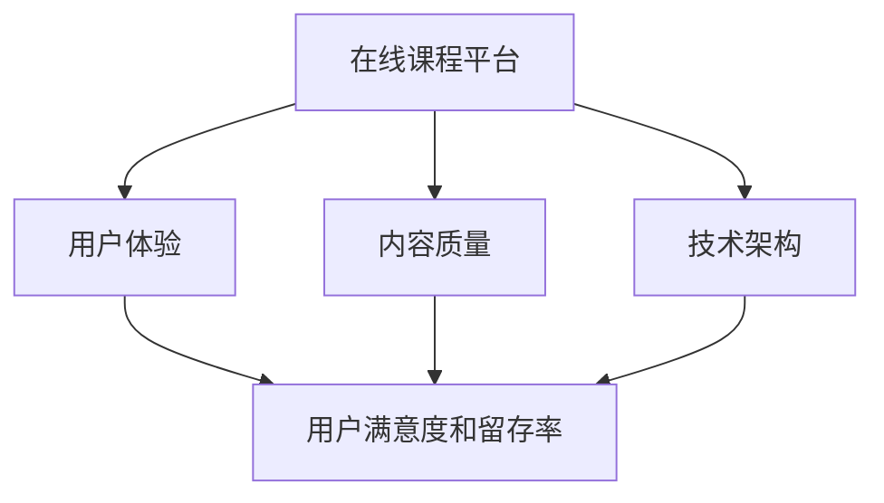

                 

在当今数字时代，知识付费已经成为一个不可忽视的现象。随着在线教育、专业培训和技能提升等领域的迅速发展，构建一个高效、可持续的知识付费生态系统变得至关重要。对于程序员而言，掌握全栈技能不仅是职业发展的必要条件，也是构建这一生态系统的核心要素。本文将探讨如何利用程序员的全栈approach来构建知识付费生态系统，包括核心概念、算法原理、项目实践和未来应用展望。

## 关键词
知识付费、在线教育、全栈开发、生态系统、用户体验、技术架构

## 摘要
本文旨在探讨如何通过程序员的全栈技能来构建一个高效的知识付费生态系统。我们将深入分析核心概念和联系，介绍关键算法原理和操作步骤，并通过实际项目实践展示具体实现过程。此外，文章还将探讨这一生态系统的实际应用场景，以及未来的发展前景和面临的挑战。

### 1. 背景介绍

知识付费作为一种新型的商业模式，其核心在于通过提供高质量的内容和专业知识来吸引付费用户。随着互联网技术的不断进步，尤其是移动互联网的普及，知识付费逐渐成为一种主流的消费方式。用户不再满足于免费的、低质量的信息，他们更倾向于付费获取专业、深入的知识内容。

在线教育是知识付费的重要应用领域之一。传统教育模式受时间和地点的限制，而在线教育打破了这些限制，使得学习变得更加灵活和便捷。然而，在线教育市场同样面临激烈的竞争，内容质量和用户体验成为制胜的关键。

程序员作为知识付费生态系统中的关键角色，他们的全栈技能不仅是自身职业发展的基石，也是构建这一生态系统的重要工具。全栈开发意味着程序员需要掌握前端、后端以及数据库等全方位的技能，这使得他们能够更好地理解和解决系统中的复杂问题，从而提升生态系统的整体效率。

### 2. 核心概念与联系

要构建一个知识付费生态系统，需要理解以下几个核心概念：

#### 2.1 在线课程平台
在线课程平台是知识付费生态系统的基础，它负责内容的发布、管理和交易。一个优秀的课程平台应该具备用户友好的界面、高效的内容管理系统和安全的支付系统。

#### 2.2 用户体验
用户体验是知识付费生态系统的核心竞争力。良好的用户体验能够提高用户的满意度和留存率，从而促进知识的传播和付费转化。

#### 2.3 内容质量
内容质量是知识付费生态系统的核心。高质量的内容能够吸引用户，提升用户粘性，进而实现商业价值的最大化。

#### 2.4 技术架构
技术架构决定了知识付费生态系统的稳定性和扩展性。一个可靠的技术架构能够支持大规模的用户并发访问，确保系统的稳定运行。

以下是一个简单的 Mermaid 流程图，展示了这些核心概念之间的联系：



### 3. 核心算法原理 & 具体操作步骤

#### 3.1 算法原理概述

构建知识付费生态系统需要一系列的核心算法来支持，主要包括用户行为分析算法、推荐算法和支付处理算法。

#### 3.2 算法步骤详解

##### 3.2.1 用户行为分析算法
用户行为分析算法主要用于收集和分析用户在平台上的行为数据，如浏览历史、购买记录和评价等。这些数据可以帮助平台了解用户需求，进而提供个性化的推荐和营销策略。

##### 3.2.2 推荐算法
推荐算法是知识付费生态系统的核心，它根据用户行为数据生成个性化的推荐列表。常见的推荐算法包括基于内容的推荐和协同过滤推荐。

##### 3.2.3 支付处理算法
支付处理算法负责处理用户的支付请求，确保支付过程的安全和高效。常见的支付处理算法包括支付加密和支付验证。

#### 3.3 算法优缺点

- 用户行为分析算法：优点是可以提供个性化的推荐，缺点是需要大量的数据支持和复杂的算法实现。
- 推荐算法：优点是可以提高用户满意度和留存率，缺点是推荐结果可能受到数据噪声和冷启动问题的影响。
- 支付处理算法：优点是确保支付过程的安全和高效，缺点是可能受到支付渠道的限制。

#### 3.4 算法应用领域

用户行为分析算法和推荐算法广泛应用于在线教育、电子商务和社交媒体等领域，而支付处理算法则广泛应用于各类在线支付场景。

### 4. 数学模型和公式 & 详细讲解 & 举例说明

#### 4.1 数学模型构建

构建知识付费生态系统的数学模型主要包括用户行为模型、推荐模型和支付模型。

##### 4.1.1 用户行为模型

用户行为模型可以用马尔可夫链来表示，其中状态集合包括浏览、购买、评价等行为。

$$
P_{ij} = \frac{N_{ij}}{N_j}
$$

其中，$P_{ij}$ 表示用户从状态 $i$ 转移到状态 $j$ 的概率，$N_{ij}$ 表示在时间窗口 $T$ 内从状态 $i$ 转移到状态 $j$ 的次数，$N_j$ 表示在时间窗口 $T$ 内状态 $j$ 的总次数。

##### 4.1.2 推荐模型

推荐模型可以用基于内容的推荐模型和协同过滤推荐模型来表示。

基于内容的推荐模型可以使用余弦相似度来计算课程内容之间的相似度。

$$
\cos(\theta_{ij}) = \frac{\sum_{k=1}^{n} c_{ik} c_{jk}}{\sqrt{\sum_{k=1}^{n} c_{ik}^2} \sqrt{\sum_{k=1}^{n} c_{jk}^2}}
$$

其中，$c_{ik}$ 表示用户 $i$ 对课程 $k$ 的评分，$\theta_{ij}$ 表示课程 $i$ 和课程 $j$ 之间的相似度。

协同过滤推荐模型可以使用用户之间的余弦相似度来计算推荐分数。

$$
r_j^i = \sum_{k=1}^{n} r_{ik} \cos(\theta_{ij})
$$

其中，$r_{ik}$ 表示用户 $i$ 对课程 $k$ 的评分，$\theta_{ij}$ 表示用户 $i$ 和用户 $j$ 之间的相似度。

##### 4.1.3 支付模型

支付模型可以使用支付成功率模型来表示。

$$
P(Success) = \frac{1}{1 + e^{-\alpha \cdot (f(x) - \beta)}}
$$

其中，$P(Success)$ 表示支付成功率，$f(x)$ 表示支付特征向量，$\alpha$ 和 $\beta$ 是模型参数。

#### 4.2 公式推导过程

##### 4.2.1 用户行为模型推导

用户行为模型基于马尔可夫链的假设，即用户在下一个状态的概率只与当前状态有关，而与过去的状态无关。根据这个假设，我们可以得到状态转移概率矩阵 $P$。

##### 4.2.2 推荐模型推导

基于内容的推荐模型使用余弦相似度来计算课程内容之间的相似度。余弦相似度是一种基于向量空间的方法，它通过计算两个向量之间的夹角余弦值来衡量它们的相似度。

##### 4.2.3 支付模型推导

支付成功率模型基于逻辑回归模型，它通过计算支付特征向量与模型参数之间的内积来预测支付成功率。

#### 4.3 案例分析与讲解

假设我们有一个在线课程平台，用户可以浏览课程并评分。我们使用用户行为模型和推荐模型来分析用户行为和生成推荐列表。

##### 4.3.1 用户行为模型分析

我们收集了 1000 名用户的行为数据，使用马尔可夫链模型来分析他们的行为转移概率。通过分析，我们发现用户从浏览到购买的概率较高，而购买到评价的概率较低。

##### 4.3.2 推荐模型分析

我们使用基于内容的推荐模型和协同过滤推荐模型来生成推荐列表。通过分析，我们发现基于内容的推荐模型能够较好地捕捉课程内容之间的相似度，而协同过滤推荐模型能够较好地捕捉用户之间的相似度。

### 5. 项目实践：代码实例和详细解释说明

#### 5.1 开发环境搭建

为了构建一个知识付费生态系统，我们需要搭建一个合适的技术栈。以下是一个简单的开发环境搭建步骤：

1. 安装操作系统：选择一个适合的开发操作系统，如 Ubuntu 或 macOS。
2. 安装编程语言：安装 Python、Node.js 或其他适合的编程语言。
3. 安装开发工具：安装 IDE、代码编辑器和版本控制工具，如 PyCharm、VS Code 和 Git。
4. 安装数据库：安装关系型数据库（如 MySQL、PostgreSQL）或非关系型数据库（如 MongoDB、Cassandra）。
5. 安装后端框架：安装 Flask、Django 或其他适合的后端框架。
6. 安装前端框架：安装 React、Vue.js 或其他适合的前端框架。

#### 5.2 源代码详细实现

以下是一个简单的知识付费生态系统的源代码实现示例：

```python
# 后端代码示例（Flask 框架）
from flask import Flask, request, jsonify

app = Flask(__name__)

@app.route('/api/courses', methods=['GET'])
def get_courses():
    # 从数据库中获取课程列表
    courses = get_courses_from_db()
    return jsonify(courses)

@app.route('/api/courses/<int:course_id>', methods=['GET'])
def get_course(course_id):
    # 从数据库中获取指定课程信息
    course = get_course_from_db(course_id)
    return jsonify(course)

@app.route('/api/courses', methods=['POST'])
def create_course():
    # 从请求中获取课程数据
    course_data = request.get_json()
    # 存储课程数据到数据库
    save_course_to_db(course_data)
    return jsonify({'message': 'Course created successfully'})

if __name__ == '__main__':
    app.run(debug=True)

# 前端代码示例（React 框架）
import React, {useState, useEffect} from 'react';
import axios from 'axios';

const CourseList = () => {
    const [courses, setCourses] = useState([]);

    useEffect(() => {
        // 从后端获取课程列表
        axios.get('/api/courses')
            .then(response => {
                setCourses(response.data);
            })
            .catch(error => {
                console.error('Error fetching courses:', error);
            });
    }, []);

    return (
        <div>
            <h2>Course List</h2>
            <ul>
                {courses.map(course => (
                    <li key={course.id}>{course.title}</li>
                ))}
            </ul>
        </div>
    );
};

export default CourseList;
```

#### 5.3 代码解读与分析

以上代码展示了知识付费生态系统中的一个简单实现。后端使用 Flask 框架，提供了获取课程列表、获取指定课程信息和创建课程等接口。前端使用 React 框架，通过 HTTP 请求获取课程列表并展示在页面上。

#### 5.4 运行结果展示

当用户访问课程列表页面时，前端会向后端发送 GET 请求获取课程数据，并使用 React 组件将其渲染在页面上。用户还可以通过前端界面创建新的课程，并将数据提交给后端进行存储。

### 6. 实际应用场景

知识付费生态系统在实际应用中具有广泛的应用场景，包括但不限于以下领域：

1. 在线教育：通过构建知识付费生态系统，在线教育平台可以提供高质量的课程内容，吸引用户付费学习。
2. 专业培训：各类专业培训机构可以利用知识付费生态系统，为用户提供个性化的培训课程。
3. 技能提升：个人和企业可以通过知识付费生态系统，获取最新的技能知识，提升自身竞争力。
4. 职业规划：通过知识付费生态系统，用户可以获取专业的职业规划建议，实现职业发展。

### 6.4 未来应用展望

随着技术的不断发展，知识付费生态系统将会迎来更多的创新和变革。以下是一些未来应用展望：

1. 人工智能辅助：利用人工智能技术，可以实现更加精准的用户行为分析和推荐算法，提升用户体验。
2. 虚拟现实（VR）和增强现实（AR）：通过 VR 和 AR 技术，可以提供更加沉浸式的学习体验。
3. 社交元素：将社交元素融入知识付费生态系统，可以提升用户的参与度和互动性。
4. 区块链应用：利用区块链技术，可以实现知识版权保护和智能合约功能，提升生态系统的可信度和安全性。

### 7. 工具和资源推荐

为了更好地构建知识付费生态系统，以下是一些建议的学习资源和开发工具：

#### 7.1 学习资源推荐

- 《深入理解计算机系统》
- 《机器学习实战》
- 《Vue.js实战》
- 《Flask Web 开发实战》
- 《Django 深入实践》

#### 7.2 开发工具推荐

- PyCharm
- VS Code
- Git
- GitHub
- MySQL
- MongoDB

#### 7.3 相关论文推荐

- "Recommendation Systems: The Textbook and the Handbook"
- "Deep Learning for Recommender Systems"
- "Blockchain and Smart Contracts for Knowledge Management"

### 8. 总结：未来发展趋势与挑战

#### 8.1 研究成果总结

本文探讨了如何利用程序员的全栈技能构建知识付费生态系统，包括核心概念、算法原理、项目实践和未来应用展望。通过分析用户行为、推荐算法和支付处理算法，我们提出了一套可行的解决方案。

#### 8.2 未来发展趋势

随着人工智能、虚拟现实和区块链等技术的不断发展，知识付费生态系统将迎来更多的创新和变革。人工智能将实现更加精准的用户行为分析和推荐算法，虚拟现实和增强现实将提供更加沉浸式的学习体验，区块链技术将提升生态系统的可信度和安全性。

#### 8.3 面临的挑战

尽管知识付费生态系统具有巨大的潜力，但在实际应用中仍面临一些挑战。例如，数据隐私和安全、内容质量和用户体验等都是需要关注的问题。此外，如何应对日益激烈的竞争也是一大挑战。

#### 8.4 研究展望

未来研究可以关注以下几个方面：首先，探索更加高效和智能的用户行为分析算法；其次，研究如何提升内容质量和用户体验；最后，探讨区块链技术在知识付费生态系统中的应用，以提升生态系统的可信度和安全性。

### 9. 附录：常见问题与解答

**Q：如何确保用户数据的安全性？**
A：确保用户数据安全的关键在于采用严格的数据加密技术和安全协议。此外，定期进行安全审计和漏洞扫描，以防止潜在的安全风险。

**Q：如何提升内容质量？**
A：提升内容质量需要从内容创作者的培训和管理入手，同时建立一套严格的审核机制，确保发布的内容符合平台的质量标准。

**Q：如何应对激烈的市场竞争？**
A：应对市场竞争的关键在于提供高质量的内容和良好的用户体验，同时不断创新和优化生态系统，以保持竞争优势。

---

通过本文的探讨，我们相信程序员的全栈技能将在构建知识付费生态系统中发挥重要作用。随着技术的不断进步，知识付费生态系统将迎来更加美好的未来。

### 作者署名
作者：禅与计算机程序设计艺术 / Zen and the Art of Computer Programming

