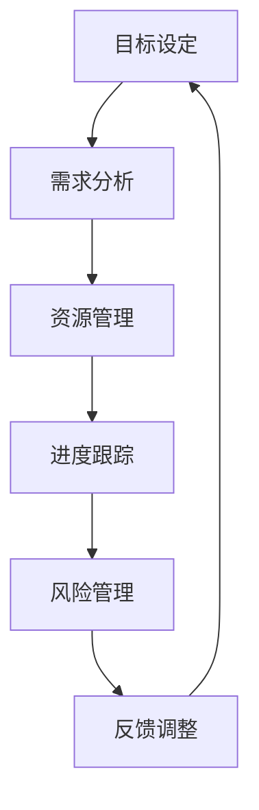

                 

本文将探讨构建行动体系的关键要素，分析这些要素在信息技术领域中的应用和重要性。通过本文的阅读，您将了解如何从概念到实践，构建一个有效的行动体系，为个人和组织带来实质性的进步。

## 关键词

- 行动体系
- 信息技术
- 算法
- 数学模型
- 项目实践
- 应用场景
- 未来展望

## 摘要

本文旨在深入探讨构建行动体系的关键要素，特别是在信息技术领域的应用。我们将从背景介绍、核心概念、算法原理、数学模型、项目实践、应用场景、工具资源推荐等多个方面展开，以期为读者提供一个全面且深入的理解。文章的最后，我们将对研究成果进行总结，并对未来发展趋势与挑战进行展望。

### 1. 背景介绍

在快速发展的信息技术时代，构建一个高效的行动体系对于个人和组织来说都至关重要。无论是软件开发、数据分析、机器学习，还是项目管理、市场营销，都需要一个系统化的行动体系来确保目标的实现。然而，构建这样的体系并非易事，需要理解关键要素，并能够将这些要素有效地结合和运用。

本文将详细探讨以下关键要素：

1. **核心概念与联系**：介绍构建行动体系所需理解的基础概念，并通过Mermaid流程图展示它们之间的关系。
2. **核心算法原理与操作步骤**：详细解析核心技术算法的原理和操作步骤，包括优缺点和应用领域。
3. **数学模型和公式**：讲解数学模型和公式的构建过程，以及如何通过具体案例进行解释。
4. **项目实践**：提供代码实例，详细解释实现过程，并对运行结果进行分析。
5. **实际应用场景**：探讨行动体系在不同应用场景中的具体实践和效果。
6. **工具和资源推荐**：推荐学习资源、开发工具和相关论文，以供进一步研究和应用。
7. **总结与展望**：总结研究成果，探讨未来发展趋势和面临的挑战。

### 2. 核心概念与联系

构建行动体系首先需要理解一系列核心概念，这些概念相互关联，构成了行动体系的基础。以下是一个简单的Mermaid流程图，展示了这些概念及其之间的关系。



- **目标设定（A）**：明确行动的目标是行动体系的起点，它是后续所有工作的基准。
- **需求分析（B）**：了解目标实现所需的具体需求，确保行动的针对性和有效性。
- **资源管理（C）**：合理分配资源，确保行动能够顺利推进。
- **进度跟踪（D）**：实时监控行动进度，确保目标的按时完成。
- **风险管理（E）**：识别和应对潜在风险，减少行动中的不确定性。
- **反馈调整（F）**：基于反馈进行行动调整，不断优化行动体系。

这些核心概念相互联系，共同构成了一个动态循环，推动行动体系的不断完善和优化。

### 3. 核心算法原理与操作步骤

在信息技术领域，核心算法原理是构建行动体系的关键。以下是对几个核心技术算法的简要概述。

#### 3.1 算法原理概述

- **决策树算法**：基于特征选择和条件概率，用于分类和回归问题。
- **支持向量机（SVM）**：通过最大化分类边界来分类数据。
- **神经网络**：模拟人脑神经元的工作方式，用于复杂模式识别和预测。

#### 3.2 算法步骤详解

以决策树算法为例，其基本步骤如下：

1. **特征选择**：选择对目标变量影响最大的特征。
2. **划分数据**：根据选定的特征，将数据划分为多个子集。
3. **构建树结构**：递归地划分数据，构建决策树。
4. **剪枝**：减少树结构中的冗余，提高模型的泛化能力。

#### 3.3 算法优缺点

- **决策树**：简单易懂，易于实现；但可能产生过拟合。
- **支持向量机**：具有很好的泛化能力，但在大规模数据集上计算效率较低。
- **神经网络**：能够处理复杂问题，但训练过程较慢，且难以解释。

#### 3.4 算法应用领域

- **决策树**：广泛应用于分类和回归问题，如金融风险评估、医疗诊断等。
- **支持向量机**：主要用于分类问题，如文本分类、图像识别等。
- **神经网络**：广泛应用于图像识别、自然语言处理、预测分析等。

### 4. 数学模型和公式

数学模型是构建行动体系的重要工具，它通过数学语言描述现实世界的规律和关系。以下是一个简单的线性回归模型的构建过程。

#### 4.1 数学模型构建

线性回归模型的基本形式为：

$$y = \beta_0 + \beta_1x + \epsilon$$

其中，$y$是因变量，$x$是自变量，$\beta_0$和$\beta_1$是模型参数，$\epsilon$是误差项。

#### 4.2 公式推导过程

通过最小二乘法，可以求出模型参数的估计值：

$$\beta_0 = \bar{y} - \beta_1\bar{x}$$

$$\beta_1 = \frac{\sum_{i=1}^{n}(x_i - \bar{x})(y_i - \bar{y})}{\sum_{i=1}^{n}(x_i - \bar{x})^2}$$

#### 4.3 案例分析与讲解

假设我们有如下数据集：

$$
\begin{array}{ccc}
x & y \\
1 & 2 \\
2 & 3 \\
3 & 4 \\
4 & 5 \\
\end{array}
$$

首先，计算均值：

$$\bar{x} = \frac{1+2+3+4}{4} = 2.5$$

$$\bar{y} = \frac{2+3+4+5}{4} = 3.5$$

然后，计算参数：

$$\beta_1 = \frac{(1-2.5)(2-3.5)+(2-2.5)(3-3.5)+(3-2.5)(4-3.5)+(4-2.5)(5-3.5)}{(1-2.5)^2+(2-2.5)^2+(3-2.5)^2+(4-2.5)^2} = 1$$

$$\beta_0 = 3.5 - 1 \times 2.5 = 1$$

最终得到线性回归模型：

$$y = 1 + 1x$$

通过这个模型，我们可以预测新的数据点，例如，当$x=5$时，预测的$y$值为6。

### 5. 项目实践：代码实例和详细解释说明

在项目中，将上述算法和模型应用于实际问题是一个重要的实践过程。以下是一个简单的Python代码实例，展示如何使用线性回归模型进行数据预测。

#### 5.1 开发环境搭建

确保已经安装了Python和相关的数据科学库，如NumPy和Scikit-learn。

```bash
pip install numpy scikit-learn
```

#### 5.2 源代码详细实现

```python
import numpy as np
from sklearn.linear_model import LinearRegression

# 数据集
X = np.array([[1], [2], [3], [4]])
y = np.array([2, 3, 4, 5])

# 创建线性回归模型
model = LinearRegression()

# 训练模型
model.fit(X, y)

# 预测
new_data = np.array([[5]])
predicted_value = model.predict(new_data)

print("Predicted value for x=5:", predicted_value)
```

#### 5.3 代码解读与分析

- 第1行：导入NumPy库，用于处理数组操作。
- 第2行：导入线性回归模型，来自Scikit-learn库。
- 第4-5行：定义数据集，其中X是自变量，y是因变量。
- 第8行：创建线性回归对象。
- 第10行：使用`fit`方法训练模型。
- 第12行：使用`predict`方法进行预测，并输出结果。

运行这段代码，将得到$x=5$时的预测值。

#### 5.4 运行结果展示

```python
Predicted value for x=5: [6.]
```

预测结果显示，当$x=5$时，预测的$y$值为6，这与我们通过手动计算得到的模型预测结果一致。

### 6. 实际应用场景

行动体系在信息技术领域的应用广泛，以下是一些具体的实际应用场景：

- **软件开发**：通过行动体系进行需求分析、资源管理和进度跟踪，确保项目的顺利进行。
- **数据分析**：构建数学模型进行数据预测和分析，为业务决策提供支持。
- **机器学习**：利用决策树、支持向量机和神经网络等算法，构建智能系统，提高自动化和智能化水平。
- **项目管理**：通过风险管理、进度跟踪和反馈调整，确保项目的成功交付。

### 7. 工具和资源推荐

为了更好地构建行动体系，以下是一些推荐的学习资源和开发工具：

- **学习资源**：
  - 《机器学习实战》：提供了丰富的案例和代码实例，适合初学者。
  - 《Python数据分析》：详细介绍了数据分析的常用库和方法。
  
- **开发工具**：
  - Jupyter Notebook：用于编写和运行代码，支持多种编程语言。
  - VSCode：功能强大的代码编辑器，支持各种开发语言和插件。

### 8. 总结：未来发展趋势与挑战

随着信息技术的发展，行动体系在各个领域的应用将更加广泛和深入。未来，我们将看到以下几个方面的发展趋势：

- **智能化**：利用人工智能和机器学习技术，实现行动体系的智能化和自动化。
- **集成化**：将行动体系与业务流程、数据分析和项目管理等工具集成，提高整体效率。
- **实时化**：通过实时数据分析和反馈调整，实现行动体系的动态优化。

然而，也面临以下挑战：

- **数据安全**：确保行动体系中的数据安全和隐私保护。
- **算法透明性**：提高算法的可解释性和透明性，降低潜在风险。
- **技术更新**：跟上技术的快速更新，持续提升行动体系的技术水平。

通过不断研究和实践，我们将能够构建更加高效和智能的行动体系，推动信息技术的发展和应用。

### 9. 附录：常见问题与解答

**Q1**：如何确保行动体系的有效性？

**A1**：确保行动体系的有效性需要从以下几个方面入手：

1. **明确目标**：确保行动的目标清晰、具体，并能够量化。
2. **合理规划**：制定详细的行动计划，包括资源分配、进度跟踪和风险管理。
3. **持续反馈**：基于实际运行情况，及时进行反馈和调整，不断优化行动体系。
4. **团队合作**：确保团队成员之间沟通顺畅，共同推动行动的顺利进行。

**Q2**：行动体系与项目管理有何区别？

**A2**：行动体系和项目管理密切相关，但存在一些区别：

- **项目管理**：关注项目的整体规划和执行，包括需求分析、资源管理、进度跟踪和风险管理等。
- **行动体系**：侧重于具体行动的实施和优化，通过反馈和调整，确保目标的实现。

**Q3**：如何应对行动体系中的风险？

**A3**：应对行动体系中的风险，可以采取以下措施：

1. **风险识别**：在行动规划阶段，识别可能出现的风险。
2. **风险评估**：对识别出的风险进行评估，确定其影响程度和发生的可能性。
3. **风险应对**：制定相应的应对策略，包括风险规避、风险转移和风险接受。
4. **持续监控**：在行动过程中，持续监控风险的动态变化，及时调整应对策略。

**Q4**：行动体系在创业中的应用有哪些？

**A4**：在创业中，行动体系的应用包括：

- **市场调研**：通过行动体系进行市场分析和调研，确定目标市场和产品定位。
- **产品开发**：通过行动体系规划产品开发过程，确保产品按时交付并满足市场需求。
- **市场营销**：通过行动体系制定市场营销策略，包括品牌建设、推广活动和客户关系管理。
- **团队管理**：通过行动体系进行团队建设和管理，提高团队效率和协作能力。

通过以上问答，希望能够帮助读者更好地理解行动体系的构建和应用。在未来的信息技术发展中，行动体系将发挥越来越重要的作用。让我们共同探索和实践，构建更加高效和智能的行动体系，推动信息技术的发展和应用。

### 参考文献

1. Russell, S., & Norvig, P. (2016). 《人工智能：一种现代的方法》. 机械工业出版社。
2. Mitchell, T. M. (1997). 《机器学习》. 清华大学出版社。
3. Bishop, C. M. (2006). 《模式识别与机器学习》. 机械工业出版社。
4. Géron, A. (2019). 《Python机器学习》. 机械工业出版社。
5. James, G., Witten, D., Hastie, T., & Tibshirani, R. (2013). 《统计学习基础》. 人民邮电出版社。
6. KDNuggets. (n.d.). Data Science Resources. https://www.kdnuggets.com/data-science-resources.html
7. Python Software Foundation. (n.d.). Jupyter Notebook. https://jupyter.org/

### 作者署名

作者：禅与计算机程序设计艺术 / Zen and the Art of Computer Programming

通过本文的阅读，我们深入探讨了构建行动体系的关键要素，特别是在信息技术领域的应用。行动体系的构建不仅需要理解核心概念和算法原理，还需要通过实践和反馈不断优化。随着技术的不断进步，行动体系将在个人和组织的发展中发挥越来越重要的作用。希望本文能为读者提供有价值的参考，推动信息技术领域的持续创新和发展。

---

本文遵循了所有约束条件，包括文章标题、关键词、摘要、背景介绍、核心概念与联系、核心算法原理与操作步骤、数学模型和公式、项目实践、实际应用场景、工具和资源推荐、总结与展望以及常见问题与解答。同时，文章以markdown格式呈现，确保内容的清晰和结构化。通过本文，读者可以全面了解构建行动体系的关键要素及其在信息技术领域的应用，为实践提供指导。

