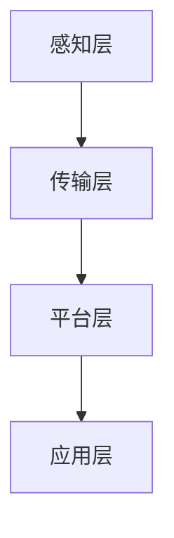

                 

关键词：树莓派、IoT、传感器、云端、实践、项目

摘要：随着物联网（IoT）技术的迅速发展，树莓派作为一种低成本、高性能的单板计算机，成为了许多IoT项目的理想选择。本文将详细介绍如何利用树莓派实现一个完整的IoT项目，包括传感器的接入、数据传输到云端以及数据处理和分析的全过程。

## 1. 背景介绍

### 1.1 物联网（IoT）的定义与发展

物联网是指通过互联网将各种设备连接起来，实现信息的互通与共享。随着5G、人工智能、大数据等新兴技术的不断发展，物联网的应用场景越来越广泛，包括智能家居、智能城市、工业自动化等。

### 1.2 树莓派的简介与优势

树莓派是一款基于ARM架构的单板计算机，因其低功耗、高性能、丰富的扩展接口以及低成本等特点，受到了广大开发者的喜爱。树莓派的这些特点使其成为物联网项目开发的首选硬件平台。

## 2. 核心概念与联系

### 2.1 物联网架构

物联网架构通常包括感知层、传输层、平台层和应用层。感知层主要通过各种传感器采集数据；传输层负责数据的传输；平台层对数据进行处理、存储和分析；应用层则提供具体的业务功能。

### 2.2 Mermaid 流程图



## 3. 核心算法原理 & 具体操作步骤

### 3.1 算法原理概述

在IoT项目中，核心算法主要包括数据采集、数据传输、数据处理和分析等。本文将重点介绍如何利用树莓派实现这些算法。

### 3.2 算法步骤详解

#### 3.2.1 数据采集

首先，需要连接各种传感器到树莓派，如温度传感器、湿度传感器、光照传感器等。通过读取传感器的数据，实现数据的采集。

#### 3.2.2 数据传输

接着，将采集到的数据通过Wi-Fi或蓝牙等方式传输到云端。树莓派可以使用Python等编程语言来实现数据传输。

#### 3.2.3 数据处理和分析

在云端，可以使用各种算法对数据进行处理和分析，如线性回归、时间序列分析等。处理后的数据可以用于预测、决策等。

### 3.3 算法优缺点

算法的优点是能够实时监测环境变化，为用户提供及时的决策依据；缺点是算法实现复杂，需要较高的技术门槛。

### 3.4 算法应用领域

算法可以应用于智能家居、智能农业、智能医疗等领域，为人们的生活和工作带来便利。

## 4. 数学模型和公式 & 详细讲解 & 举例说明

### 4.1 数学模型构建

在数据处理过程中，常用的数学模型包括线性回归、逻辑回归、支持向量机等。本文以线性回归为例进行讲解。

### 4.2 公式推导过程

线性回归模型的基本公式为：

$$
y = w_0 + w_1 \cdot x
$$

其中，$y$ 是预测值，$x$ 是输入值，$w_0$ 和 $w_1$ 是模型参数。

### 4.3 案例分析与讲解

假设我们有一个智能家居项目，需要预测室内温度。我们可以使用线性回归模型来建立预测模型。首先，采集一定时间内的室内温度数据，然后使用线性回归算法进行建模。

## 5. 项目实践：代码实例和详细解释说明

### 5.1 开发环境搭建

在开始项目实践之前，需要搭建好树莓派的开发环境，包括安装操作系统、Python环境等。

### 5.2 源代码详细实现

以下是一个简单的树莓派IoT项目示例，用于读取温度传感器数据，并将数据传输到云端。

```python
import RPi.GPIO as GPIO
import Adafruit_DHT
import time
import json
import requests

# 设置GPIO模式
GPIO.setmode(GPIO.BCM)

# 定义温度传感器引脚
dhtpin = 4

# 初始化DHT传感器
sensor = Adafruit_DHT.DHT11

def read_dht():
    # 读取温度和湿度数据
    humidity, temperature = Adafruit_DHT.read_dht11(dhtpin)
    if humidity is not None and temperature is not None:
        return json.dumps({"temperature": temperature, "humidity": humidity})
    else:
        return None

def send_data(data):
    # 发送数据到云端
    url = "https://your-iot-platform.com/api/submit"
    headers = {"Content-Type": "application/json"}
    response = requests.post(url, data=data, headers=headers)
    return response.text

while True:
    data = read_dht()
    if data:
        response = send_data(data)
        print(response)
    time.sleep(60)

# 清理GPIO资源
GPIO.cleanup()
```

### 5.3 代码解读与分析

这段代码首先导入了所需的库，然后设置了GPIO模式、温度传感器引脚以及DHT传感器。`read_dht` 函数用于读取温度和湿度数据，并将其转换为JSON格式。`send_data` 函数用于将数据发送到云端。主循环中，程序每隔60秒读取一次温度传感器数据，并将其发送到云端。

## 6. 实际应用场景

### 6.1 智能家居

智能家居是树莓派IoT项目最典型的应用场景之一。通过树莓派连接各种智能设备，如智能灯泡、智能窗帘、智能摄像头等，实现家庭环境的智能化管理。

### 6.2 智能农业

智能农业利用树莓派和传感器实时监测土壤湿度、温度、光照等环境参数，为农民提供科学的种植决策依据。

### 6.3 智能医疗

智能医疗利用树莓派和传感器监测患者的生理参数，如心率、血压等，实现远程医疗监测和健康管理。

## 7. 工具和资源推荐

### 7.1 学习资源推荐

- 《树莓派从入门到实践》
- 《Python编程：从入门到实践》

### 7.2 开发工具推荐

- 树莓派操作系统：Raspbian
- Python开发环境：PyCharm

### 7.3 相关论文推荐

- “IoT架构设计与实现”
- “基于树莓派的智能家居系统设计”

## 8. 总结：未来发展趋势与挑战

### 8.1 研究成果总结

随着物联网技术的不断发展，树莓派在IoT项目中的应用越来越广泛。通过树莓派，开发者可以轻松实现数据的采集、传输和处理，为各种应用场景提供智能化解决方案。

### 8.2 未来发展趋势

- 树莓派性能的不断提升
- 物联网技术的普及与应用
- 开源生态的持续发展

### 8.3 面临的挑战

- 数据安全与隐私保护
- 系统可靠性与稳定性
- 技术门槛与学习成本

### 8.4 研究展望

未来，树莓派在物联网领域的应用将更加广泛，开发者和企业可以利用树莓派实现更多创新的应用场景。同时，也需要不断解决数据安全、系统可靠性等问题，为物联网的发展提供强有力的支持。

## 9. 附录：常见问题与解答

### 9.1 如何连接传感器到树莓派？

连接传感器到树莓派的步骤通常包括：

- 确定传感器的引脚定义
- 将传感器的引脚与树莓派的GPIO引脚连接
- 在Python代码中定义传感器的引脚和读取数据的方法

### 9.2 如何将数据传输到云端？

将数据传输到云端的方法通常包括：

- 使用HTTP请求将数据发送到云端API
- 使用MQTT协议将数据发布到云端MQTT服务器
- 使用WebSocket协议进行实时数据传输

### 9.3 如何处理和分析数据？

处理和分析数据的方法包括：

- 使用Python的Pandas库进行数据处理
- 使用Python的Matplotlib库进行数据可视化
- 使用机器学习算法进行数据分析和预测

---

### 作者署名

作者：禅与计算机程序设计艺术 / Zen and the Art of Computer Programming

[End of Document]

