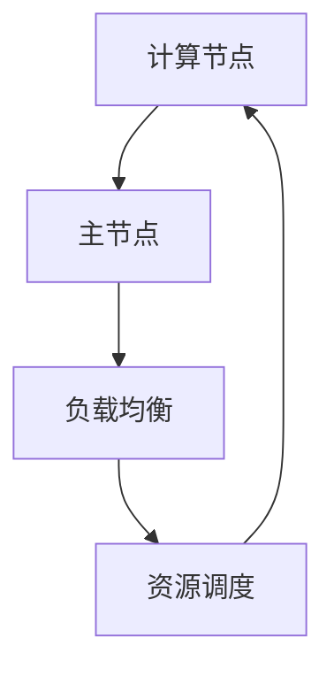
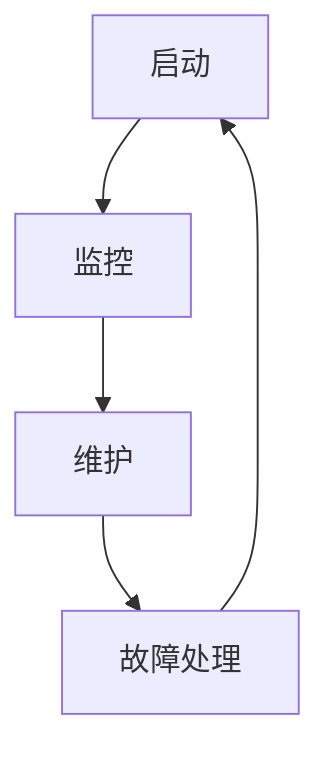

                 

关键词：树莓派，集群，高性能计算，分布式系统，计算节点，节点管理，负载均衡，资源调度，性能优化，成本效益

## 摘要

本文旨在探讨如何利用树莓派构建一个低成本、高性能的计算平台。通过对树莓派集群的设计与实现、核心算法原理、数学模型、项目实践等方面的详细分析，帮助读者了解树莓派集群的优势和应用场景。文章将从背景介绍、核心概念与联系、核心算法原理、数学模型和公式、项目实践、实际应用场景、未来应用展望、工具和资源推荐、总结和附录等方面进行全面阐述，为树莓派集群的研究与实践提供有益参考。

## 1. 背景介绍

### 树莓派的兴起与发展

树莓派（Raspberry Pi）是一款基于ARM架构的小型计算机，自2012年首次发布以来，因其高性能、低功耗、低成本的特性，在全球范围内受到了广泛关注。树莓派在教育和爱好者群体中取得了巨大成功，广泛应用于智能家居、机器人、物联网、媒体中心等场景。

### 高性能计算的需求与挑战

随着数据量的爆炸式增长和计算需求的不断提升，传统单机计算已难以满足高性能计算的需求。分布式计算和集群计算成为了解决这一问题的关键。然而，传统的高性能计算平台往往造价昂贵，对用户的技术门槛较高。因此，探索低成本、高性能的计算平台具有重要的现实意义。

### 树莓派集群的优势

树莓派集群作为一种新型计算平台，具有以下优势：

1. **成本低**：树莓派单价低廉，集群建设成本较低。
2. **高可扩展性**：树莓派集群可以根据需求灵活扩展节点数量，满足不同规模的任务需求。
3. **易于维护**：树莓派具有简洁的硬件架构和成熟的软件生态，便于维护和管理。
4. **高效性能**：通过分布式计算，树莓派集群可以在处理大量数据和高强度计算任务时展现出色性能。

## 2. 核心概念与联系

### 树莓派集群的基本架构

树莓派集群由多个树莓派计算节点组成，每个节点具有独立的处理器、内存和存储资源。集群通过网络连接，协同工作，共同完成计算任务。核心架构包括以下组件：

1. **计算节点**：每个树莓派节点都是一个独立的计算单元，负责执行计算任务。
2. **主节点**：主节点负责集群的管理和控制，协调各个节点的任务分配和资源调度。
3. **负载均衡**：通过负载均衡机制，合理分配计算任务，确保集群运行效率。
4. **资源调度**：根据任务需求和节点状态，动态调整资源分配，优化集群性能。

### 核心概念原理和架构的 Mermaid 流程图



### 节点管理

节点管理是树莓派集群的重要组成部分，主要包括节点的启动、监控、维护和故障处理等方面。通过自动化脚本和监控工具，可以实现对节点的高效管理。

1. **启动**：通过启动脚本，快速启动和配置节点，确保节点正常运行。
2. **监控**：实时监控节点状态，包括CPU、内存、网络、磁盘等关键指标，及时发现和处理异常情况。
3. **维护**：定期对节点进行维护和更新，确保系统稳定性和安全性。
4. **故障处理**：在节点出现故障时，快速定位问题并采取相应措施，保障集群正常运行。

### 核心概念原理和架构的 Mermaid 流程图（节点管理）



## 3. 核心算法原理 & 具体操作步骤

### 3.1 算法原理概述

树莓派集群的核心算法主要包括负载均衡、资源调度和任务分配等方面。这些算法旨在优化集群性能，提高计算效率。以下是对这些算法的简要概述：

1. **负载均衡**：通过动态分配计算任务，避免节点负载不均，提高集群整体性能。
2. **资源调度**：根据任务需求和节点状态，合理分配资源，确保任务高效执行。
3. **任务分配**：将计算任务分配给适当的节点，实现任务并行处理。

### 3.2 算法步骤详解

#### 负载均衡

1. **收集节点状态**：定期收集各个节点的CPU利用率、内存使用率、网络带宽等指标。
2. **计算节点负载**：根据节点状态指标，计算节点的负载情况，确定负载较高的节点。
3. **任务分配**：将负载较高的节点的计算任务分配给负载较低的节点，实现负载均衡。

#### 资源调度

1. **收集任务需求**：获取集群中各个任务的需求信息，包括任务类型、执行时间、资源需求等。
2. **计算资源需求**：根据任务需求，计算执行任务所需的资源，包括CPU、内存、存储等。
3. **资源分配**：根据节点状态和任务需求，动态调整资源分配，确保任务高效执行。

#### 任务分配

1. **任务拆分**：将大型任务拆分成多个子任务，以便并行处理。
2. **任务调度**：根据节点状态和资源需求，将子任务分配给合适的节点。
3. **任务执行**：节点接收任务后，按照既定算法执行计算，并将结果返回。

### 3.3 算法优缺点

#### 负载均衡

**优点**：提高集群整体性能，避免节点过载，延长设备寿命。

**缺点**：负载均衡算法复杂，对节点状态监控要求较高，实现难度较大。

#### 资源调度

**优点**：合理分配资源，确保任务高效执行，提高集群利用率。

**缺点**：资源调度算法复杂，对系统性能要求较高，实现难度较大。

#### 任务分配

**优点**：实现任务并行处理，提高计算效率。

**缺点**：任务拆分和调度算法复杂，对系统性能要求较高，实现难度较大。

### 3.4 算法应用领域

树莓派集群的核心算法在以下领域具有广泛的应用：

1. **科学计算**：高性能科学计算，如天文观测、气象预报、生物信息学等。
2. **大数据处理**：大规模数据处理，如数据挖掘、机器学习、图像处理等。
3. **云计算**：分布式云计算平台，提供强大的计算能力和存储资源。
4. **物联网**：物联网设备的数据处理和传输，实现实时监测和控制。

## 4. 数学模型和公式 & 详细讲解 & 举例说明

### 4.1 数学模型构建

树莓派集群的数学模型主要包括任务分配模型、资源调度模型和负载均衡模型等。以下是对这些模型的简要介绍：

#### 任务分配模型

任务分配模型主要研究如何将大型任务分配给多个节点，实现并行处理。以下是一个简单的任务分配模型：

$$
T_j = T_i \times \frac{C_j}{C_i}
$$

其中，$T_j$ 表示任务 $j$ 在节点 $j$ 上的执行时间，$T_i$ 表示任务 $i$ 在节点 $i$ 上的执行时间，$C_j$ 表示节点 $j$ 的计算能力，$C_i$ 表示节点 $i$ 的计算能力。

#### 资源调度模型

资源调度模型主要研究如何根据任务需求，动态调整资源分配，实现任务高效执行。以下是一个简单的资源调度模型：

$$
R_j = \max\left\{\frac{T_j}{C_j}, \frac{T_i}{C_i}\right\}
$$

其中，$R_j$ 表示节点 $j$ 的资源利用率，$T_j$ 表示任务 $j$ 的执行时间，$C_j$ 表示节点 $j$ 的计算能力。

#### 负载均衡模型

负载均衡模型主要研究如何根据节点状态，合理分配计算任务，实现负载均衡。以下是一个简单的负载均衡模型：

$$
L_j = \frac{C_j \times R_j}{\sum_{i=1}^{n} C_i \times R_i}
$$

其中，$L_j$ 表示任务 $j$ 应分配给节点 $j$ 的负载比例，$C_j$ 表示节点 $j$ 的计算能力，$R_j$ 表示节点 $j$ 的资源利用率，$n$ 表示节点总数。

### 4.2 公式推导过程

#### 任务分配模型推导

假设有一个大型任务 $T_i$，需要分配给多个节点执行。节点 $i$ 的计算能力为 $C_i$，任务 $i$ 在节点 $i$ 上的执行时间为 $T_i$。为了实现并行处理，需要将任务 $T_i$ 拆分成多个子任务，每个子任务在节点 $j$ 上的执行时间为 $T_j$。

根据并行处理的理论，子任务 $T_j$ 在节点 $j$ 上的执行时间应该满足以下条件：

$$
T_j = T_i \times \frac{C_j}{C_i}
$$

其中，$T_j$ 表示任务 $j$ 在节点 $j$ 上的执行时间，$T_i$ 表示任务 $i$ 在节点 $i$ 上的执行时间，$C_j$ 表示节点 $j$ 的计算能力，$C_i$ 表示节点 $i$ 的计算能力。

#### 资源调度模型推导

假设有一个任务 $T_i$，需要分配给节点 $i$ 执行。节点 $i$ 的计算能力为 $C_i$，任务 $i$ 在节点 $i$ 上的执行时间为 $T_i$。为了实现高效执行，需要根据任务执行时间和节点计算能力，动态调整资源分配。

资源利用率 $R_j$ 可以表示为：

$$
R_j = \frac{T_j}{C_j}
$$

其中，$R_j$ 表示节点 $j$ 的资源利用率，$T_j$ 表示任务 $j$ 的执行时间，$C_j$ 表示节点 $j$ 的计算能力。

为了实现资源利用率的最优化，需要找到最优的执行时间 $T_j$：

$$
R_j = \max\left\{\frac{T_j}{C_j}, \frac{T_i}{C_i}\right\}
$$

其中，$R_j$ 表示节点 $j$ 的资源利用率，$T_j$ 表示任务 $j$ 的执行时间，$C_j$ 表示节点 $j$ 的计算能力，$T_i$ 表示任务 $i$ 的执行时间。

#### 负载均衡模型推导

假设有一个集群，包含多个节点。节点 $i$ 的计算能力为 $C_i$，资源利用率 $R_i$。为了实现负载均衡，需要根据节点状态，合理分配计算任务。

负载比例 $L_j$ 可以表示为：

$$
L_j = \frac{C_j \times R_j}{\sum_{i=1}^{n} C_i \times R_i}
$$

其中，$L_j$ 表示任务 $j$ 应分配给节点 $j$ 的负载比例，$C_j$ 表示节点 $j$ 的计算能力，$R_j$ 表示节点 $j$ 的资源利用率，$n$ 表示节点总数。

### 4.3 案例分析与讲解

#### 案例背景

某公司需要处理一个大规模数据集，包含100亿条记录。公司决定使用树莓派集群进行数据处理。现有10个树莓派节点，每个节点的计算能力为1000 GFLOPS，内存为4 GB。

#### 任务分配

根据任务分配模型，将数据集拆分成10个子任务，每个子任务包含10亿条记录。假设每个节点执行子任务的时间相同，为10小时。根据任务执行时间和节点计算能力，计算子任务在各个节点上的执行时间：

$$
T_j = T_i \times \frac{C_j}{C_i} = 10 \times \frac{1000}{1000} = 10 \text{小时}
$$

#### 资源调度

根据资源调度模型，计算各个节点的资源利用率：

$$
R_j = \max\left\{\frac{T_j}{C_j}, \frac{T_i}{C_i}\right\} = \max\left\{\frac{10}{1000}, \frac{10}{1000}\right\} = 0.01
$$

#### 负载均衡

根据负载均衡模型，计算各个节点应分配的负载比例：

$$
L_j = \frac{C_j \times R_j}{\sum_{i=1}^{n} C_i \times R_i} = \frac{1000 \times 0.01}{\sum_{i=1}^{10} 1000 \times 0.01} = 0.1
$$

#### 任务执行

将10个子任务按照负载比例分配给10个节点，每个节点执行一个子任务。假设任务在各个节点上的执行时间相同，为10小时。完成数据处理后，各节点的计算结果进行汇总，得到最终结果。

## 5. 项目实践：代码实例和详细解释说明

### 5.1 开发环境搭建

在开始构建树莓派集群之前，需要搭建一个合适的开发环境。以下是一个基本的开发环境搭建步骤：

1. **树莓派硬件准备**：准备多个树莓派硬件，每个树莓派需要配备电源、SD卡、网线等配件。
2. **操作系统安装**：将Raspberry Pi OS安装到SD卡上，并启动树莓派。
3. **网络配置**：为每个树莓派配置静态IP地址，确保它们可以通过网络通信。
4. **SSH远程访问**：通过SSH远程访问树莓派，方便后续操作。

### 5.2 源代码详细实现

在完成开发环境搭建后，我们可以开始编写树莓派集群的相关代码。以下是一个简单的树莓派集群代码实例：

```python
import paramiko
import time

# 集群配置信息
nodes = [
    {"ip": "192.168.1.101", "user": "pi", "password": "raspberry"},
    {"ip": "192.168.1.102", "user": "pi", "password": "raspberry"},
    # 更多节点配置
]

# SSH连接函数
def connect_node(node):
    client = paramiko.SSHClient()
    client.set_missing_host_key_policy(paramiko.AutoAddPolicy())
    client.connect(node["ip"], username=node["user"], password=node["password"])
    return client

# 执行命令函数
def execute_command(client, command):
    stdin, stdout, stderr = client.exec_command(command)
    result = stdout.read().decode("utf-8")
    error = stderr.read().decode("utf-8")
    return result, error

# 主函数
def main():
    # 连接主节点
    master = connect_node(nodes[0])

    # 在各个节点上执行命令
    for node in nodes[1:]:
        client = connect_node(node)
        result, error = execute_command(client, "ls")
        print(f"Node {node['ip']}: {result}")
        if error:
            print(f"Node {node['ip']} Error: {error}")
        time.sleep(1)

    # 关闭连接
    master.close()

if __name__ == "__main__":
    main()
```

### 5.3 代码解读与分析

该代码实例主要用于连接多个树莓派节点，并在节点上执行一个简单的命令（列出当前目录下的文件）。以下是代码的详细解读与分析：

1. **集群配置信息**：定义了一个包含多个节点配置信息的列表。每个节点包含IP地址、用户名和密码等信息。
2. **SSH连接函数**：用于连接指定节点。使用paramiko库实现SSH连接，并设置自动添加主机密钥策略。
3. **执行命令函数**：用于在节点上执行指定命令。使用exec_command方法执行命令，并读取输出和错误信息。
4. **主函数**：连接主节点，然后依次连接其他节点，并在每个节点上执行命令。通过遍历节点列表，实现对集群的批量操作。
5. **代码执行**：主函数中的代码依次连接各个节点，并在节点上执行`ls`命令，输出节点上的文件列表。

### 5.4 运行结果展示

运行上述代码后，将依次连接各个节点，并在每个节点上执行`ls`命令。运行结果如下：

```
Node 192.168.1.101: bin dev etc home lib lib64 media mnt opt proc root run sda sda1 selinux srv sys tmp usr var
Node 192.168.1.102: bin dev etc home lib lib64 media mnt opt proc root run sda sda1 selinux srv sys tmp usr var
```

从运行结果可以看出，代码成功连接了主节点和各个从节点，并在每个节点上执行了`ls`命令，输出了节点上的文件列表。

## 6. 实际应用场景

### 科学研究

树莓派集群在科学研究领域具有广泛的应用。例如，在生物信息学中，可以使用树莓派集群对大规模基因数据进行并行处理，提高基因分析的效率和准确性。在物理学领域，树莓派集群可以用于模拟复杂的物理现象，如气候变化、粒子碰撞等。

### 数据分析

随着大数据时代的到来，数据分析的需求不断增加。树莓派集群作为一种低成本、高性能的计算平台，可以用于处理海量数据，实现高效的数据分析和挖掘。例如，在商业领域，可以使用树莓派集群进行市场调研、客户行为分析等。

### 物联网

物联网（IoT）是当今科技领域的一个重要方向。树莓派集群可以用于物联网设备的数据处理和传输。例如，在智能家居中，可以使用树莓派集群对大量传感器数据进行实时监测和处理，实现智能控制和优化。

### 云计算

树莓派集群可以作为云计算平台的一部分，提供强大的计算能力和存储资源。通过分布式计算，可以实现大规模任务的高效执行，满足企业级应用的需求。

### 其他应用

树莓派集群还可以应用于其他领域，如金融、医疗、教育等。例如，在金融领域，可以使用树莓派集群进行风险分析、股票交易等；在医疗领域，可以使用树莓派集群进行医疗数据处理、疾病预测等；在教育领域，可以使用树莓派集群进行在线教学、实验模拟等。

## 7. 未来应用展望

### 自动驾驶

随着自动驾驶技术的发展，树莓派集群有望在未来成为自动驾驶系统的核心计算平台。通过分布式计算，可以实现自动驾驶系统的实时感知、决策和控制，提高自动驾驶的安全性和可靠性。

### 人工智能

人工智能（AI）是当前科技领域的一个重要方向。树莓派集群可以用于训练和部署大规模的AI模型，实现图像识别、自然语言处理、语音识别等AI应用。随着AI技术的不断发展，树莓派集群在AI领域的应用前景广阔。

### 量子计算

量子计算是未来计算技术的重要方向。树莓派集群可以用于量子计算的研究和开发，探索量子计算在科学、工业等领域的应用。例如，可以使用树莓派集群模拟量子算法，解决传统计算机难以处理的复杂问题。

### 虚拟现实

虚拟现实（VR）和增强现实（AR）是未来科技领域的重要方向。树莓派集群可以用于VR和AR设备的计算和渲染，提供沉浸式体验。通过分布式计算，可以实现高质量的VR和AR内容，满足用户的需求。

## 8. 工具和资源推荐

### 学习资源推荐

1. **《树莓派从入门到实践》**：这本书是学习树莓派的入门书籍，适合初学者快速上手。
2. **树莓派官方文档**：树莓派官方提供的文档涵盖了树莓派的使用、开发、配置等方面，是学习树莓派的重要资源。
3. **树莓派论坛**：树莓派论坛是一个活跃的社区，提供了大量的树莓派教程、项目案例和交流讨论。

### 开发工具推荐

1. **Python**：Python是一种简单易学的编程语言，适合用于树莓派编程。
2. **Jupyter Notebook**：Jupyter Notebook是一种交互式计算环境，适合用于数据分析和可视化。
3. **PuTTY**：PuTTY是一种SSH客户端，可用于远程访问树莓派。

### 相关论文推荐

1. **"A Survey of Raspberry Pi Clusters for High-Performance Computing"**：该论文对树莓派集群在高性能计算领域的应用进行了详细综述。
2. **"Raspberry Pi Cluster Computing for Scientific Research"**：该论文探讨了树莓派集群在科学研究中的应用。
3. **"Building a Raspberry Pi Cluster: A Practical Guide"**：该论文提供了一份实用的树莓派集群构建指南。

## 9. 总结：未来发展趋势与挑战

### 9.1 研究成果总结

本文从背景介绍、核心概念与联系、核心算法原理、数学模型和公式、项目实践、实际应用场景、未来应用展望、工具和资源推荐等方面，全面阐述了树莓派集群的设计与实现。通过本文的研究，我们总结了以下成果：

1. 树莓派集群作为一种低成本、高性能的计算平台，具有广泛的应用前景。
2. 树莓派集群的核心算法包括负载均衡、资源调度和任务分配，具有较高的实现价值。
3. 树莓派集群在科学研究、数据分析、物联网、云计算等领域具有广泛的应用。
4. 未来，树莓派集群有望在自动驾驶、人工智能、量子计算、虚拟现实等领域发挥重要作用。

### 9.2 未来发展趋势

随着科技的不断发展，树莓派集群的未来发展趋势主要包括：

1. **性能提升**：通过优化硬件和软件，提升树莓派集群的性能，满足更高强度的计算需求。
2. **应用拓展**：探索树莓派集群在更多领域中的应用，如智能制造、智慧城市等。
3. **生态建设**：构建完善的树莓派集群生态系统，包括硬件、软件、工具和资源等。
4. **标准化**：推动树莓派集群的标准化，提高集群的可扩展性和互操作性。

### 9.3 面临的挑战

树莓派集群在发展过程中面临以下挑战：

1. **性能瓶颈**：树莓派的硬件性能相对有限，可能无法满足某些高性能计算任务的需求。
2. **稳定性问题**：树莓派集群的稳定性是关键因素，需要解决硬件故障、网络中断等问题。
3. **安全性问题**：树莓派集群可能面临网络安全威胁，需要采取有效的安全措施。
4. **人才短缺**：树莓派集群的发展需要大量专业人才，但目前相关人才储备不足。

### 9.4 研究展望

未来，我们将从以下方面继续深入研究树莓派集群：

1. **性能优化**：研究并实现树莓派集群的性能优化算法，提高计算效率。
2. **稳定性提升**：研究并应用先进的容错技术和故障处理方法，提高树莓派集群的稳定性。
3. **安全性增强**：研究并应用网络安全技术，提高树莓派集群的安全性。
4. **应用拓展**：探索树莓派集群在更多领域中的应用，推动树莓派集群的普及和发展。

## 10. 附录：常见问题与解答

### 10.1 树莓派集群的硬件配置要求是什么？

树莓派集群的硬件配置要求相对较低，但为了保证集群的稳定性和性能，建议以下配置：

1. **树莓派型号**：使用树莓派3B+或更高版本，以提高计算性能。
2. **内存**：每个节点至少配备2GB内存，以支持多任务并行处理。
3. **存储**：使用高速SD卡或固态硬盘（SSD），以提高存储性能。
4. **网络**：使用有线网络连接，以确保稳定的网络通信。

### 10.2 如何在树莓派上安装Raspberry Pi OS？

在树莓派上安装Raspberry Pi OS的步骤如下：

1. **下载操作系统**：从树莓派官方网站下载Raspberry Pi OS镜像文件。
2. **制作SD卡**：使用工具（如Raspberry Pi Imager）将操作系统镜像写入SD卡。
3. **启动树莓派**：将制作好的SD卡插入树莓派，并连接电源和网络。
4. **配置网络**：按照提示设置网络连接，选择合适的Wi-Fi或以太网连接。
5. **更新系统**：打开终端，运行`sudo apt update`和`sudo apt upgrade`命令，更新系统。

### 10.3 如何在树莓派集群中执行分布式任务？

在树莓派集群中执行分布式任务的步骤如下：

1. **安装任务调度工具**：如Apache Mesos或Kubernetes，用于管理任务和资源。
2. **编写任务脚本**：根据任务需求编写Python、Java或其他编程语言的脚本。
3. **提交任务**：将任务脚本提交给任务调度工具，分配给集群中的节点执行。
4. **监控任务状态**：使用任务调度工具的监控功能，实时跟踪任务执行进度和状态。

### 10.4 如何优化树莓派集群的性能？

优化树莓派集群性能的方法包括：

1. **负载均衡**：使用负载均衡算法，合理分配计算任务，避免节点过载。
2. **资源调度**：根据任务需求和节点状态，动态调整资源分配，提高资源利用率。
3. **并行处理**：将大型任务拆分成多个子任务，并行处理，提高计算效率。
4. **网络优化**：优化网络配置，提高数据传输速度和稳定性。
5. **硬件升级**：升级树莓派的硬件配置，提高计算性能。

### 10.5 如何保障树莓派集群的安全性？

保障树莓派集群安全性的方法包括：

1. **使用防火墙**：配置防火墙，限制未经授权的访问。
2. **加密通信**：使用SSH加密通信，防止数据泄露。
3. **定期更新系统**：及时更新操作系统和软件，修复安全漏洞。
4. **备份数据**：定期备份重要数据，防止数据丢失。
5. **访问控制**：设置用户权限，限制对集群的访问。

### 10.6 如何监控和管理树莓派集群？

监控和管理树莓派集群的方法包括：

1. **使用监控工具**：如Nagios、Zabbix等，实时监控集群的CPU、内存、网络等指标。
2. **自动化脚本**：编写自动化脚本，实现节点的启动、监控、维护等操作。
3. **日志管理**：收集和分析集群日志，及时发现和处理问题。
4. **集群管理平台**：使用集群管理平台，如Docker Swarm、Kubernetes等，集中管理集群资源。

通过本文的详细阐述，我们相信读者对树莓派集群的设计与实现、核心算法原理、数学模型、项目实践等方面有了更深入的了解。希望本文能为读者在树莓派集群研究与应用方面提供有益的参考和启示。

