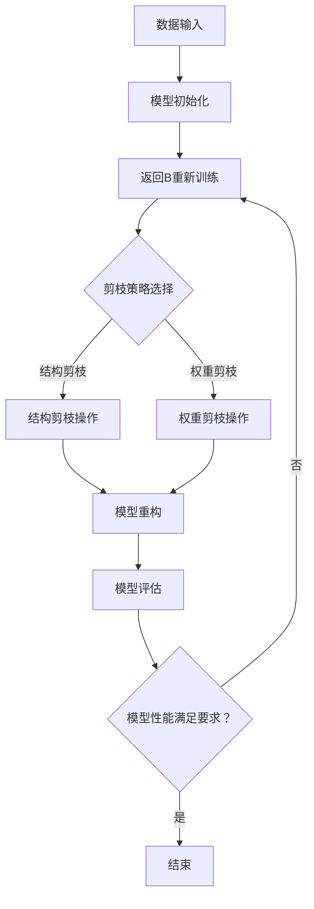

                 

关键词：模型剪枝、神经网络、精度、效率、算法优化

> 摘要：本文深入探讨了模型剪枝技术在深度学习领域中的应用，分析了模型剪枝的基本概念、核心算法原理、数学模型及其在实际项目中的实践应用。通过对模型剪枝的深入研究，旨在为研究人员和开发者提供理论指导和实践参考，以在保证模型精度的同时，提高模型的计算效率。

## 1. 背景介绍

随着深度学习技术的快速发展，神经网络模型在图像识别、自然语言处理、推荐系统等各个领域取得了显著的成果。然而，深度学习模型的复杂性和计算成本也随之增加。这不仅对计算资源提出了更高的要求，也在一定程度上限制了模型的实际应用。为了解决这一问题，模型剪枝技术应运而生。

模型剪枝是指通过删除神经网络中某些冗余或低效的权重或神经元，从而减小模型的尺寸和计算复杂度，同时尽量保持模型的精度。模型剪枝技术是深度学习算法优化的一种重要手段，对于提高模型效率和降低计算成本具有重要意义。

## 2. 核心概念与联系

### 2.1 模型剪枝的概念

模型剪枝（Model Pruning）是一种优化深度学习模型的方法，其核心思想是通过剪除模型中不重要的权重或神经元，来减少模型的大小和计算复杂度。剪枝可以分为结构剪枝和权重剪枝两种类型。

- **结构剪枝**：通过删除模型中的某些层或神经元，从而减小模型的结构复杂度。
- **权重剪枝**：通过降低某些权重的大小，从而减小模型的计算复杂度。

### 2.2 模型剪枝与神经网络的联系

神经网络是深度学习模型的基础，其性能和计算复杂度直接影响到模型剪枝的效果。神经网络由多个层和神经元组成，每个神经元都通过权重与其他神经元相连。在训练过程中，神经网络的权重会被不断更新，以优化模型的性能。

模型剪枝与神经网络的联系主要体现在以下几个方面：

- **优化目标**：模型剪枝的目标是通过减小模型的大小和计算复杂度，同时尽量保持模型的精度。
- **训练过程**：模型剪枝可以在模型的训练过程中进行，通过剪除不重要的权重或神经元，优化模型的性能。
- **应用领域**：模型剪枝技术可以应用于图像识别、自然语言处理、推荐系统等多个领域，以降低模型的计算成本。

### 2.3 Mermaid 流程图

下面是一个简单的Mermaid流程图，展示了模型剪枝的基本流程：



## 3. 核心算法原理 & 具体操作步骤

### 3.1 算法原理概述

模型剪枝算法的核心思想是通过剪除模型中不重要的权重或神经元，来减少模型的计算复杂度和存储需求。在剪枝过程中，需要考虑以下几个关键问题：

- **如何选择剪枝策略**：结构剪枝和权重剪枝都有各自的优缺点，选择合适的剪枝策略对于优化模型性能至关重要。
- **如何确定剪枝的阈值**：剪枝阈值是决定剪枝程度的重要参数，需要通过实验确定最优的阈值。
- **如何重构剪枝后的模型**：剪枝后，需要对模型进行重构，以保证模型性能的稳定。

### 3.2 算法步骤详解

模型剪枝的具体操作步骤可以分为以下几个阶段：

1. **模型初始化**：初始化深度学习模型，包括网络结构、参数初始化等。
2. **模型训练**：使用训练数据对模型进行训练，优化模型参数。
3. **剪枝策略选择**：根据应用场景和模型特点，选择合适的剪枝策略。
4. **剪枝操作**：根据剪枝策略，对模型进行剪枝操作，剪除不重要的权重或神经元。
5. **模型重构**：重构剪枝后的模型，以保证模型性能的稳定。
6. **模型评估**：使用测试数据对剪枝后的模型进行评估，验证模型性能。

### 3.3 算法优缺点

模型剪枝技术的优点包括：

- **减小模型大小**：通过剪除不重要的权重或神经元，模型大小显著减小，降低了存储和计算成本。
- **提高模型效率**：剪枝后的模型在运行时速度更快，因为减少了不必要的计算。

模型剪枝技术的缺点包括：

- **精度损失**：剪枝可能导致模型精度降低，特别是在剪除大量权重或神经元时。
- **实现复杂性**：模型剪枝算法的实现相对复杂，需要考虑剪枝策略、阈值选择、模型重构等多个方面。

### 3.4 算法应用领域

模型剪枝技术可以应用于以下领域：

- **图像识别**：通过减小模型大小，提高图像识别算法的实时性。
- **自然语言处理**：在文本分类、情感分析等任务中，减小模型大小可以降低计算成本。
- **推荐系统**：在推荐算法中，减小模型大小可以提高系统的响应速度。

## 4. 数学模型和公式 & 详细讲解 & 举例说明

### 4.1 数学模型构建

模型剪枝的数学模型主要包括两部分：模型参数的表示和剪枝策略的确定。

假设深度学习模型由 $L$ 层组成，每层包含 $n$ 个神经元。模型的权重矩阵表示为 $W \in \mathbb{R}^{n \times n}$，其中 $W_{ij}$ 表示第 $i$ 层的第 $j$ 个神经元到第 $i+1$ 层的第 $i$ 个神经元的权重。模型的参数表示为 $\theta = \{W, b\}$，其中 $b$ 表示偏置项。

### 4.2 公式推导过程

剪枝策略的确定可以通过以下公式推导：

设 $p_i$ 表示第 $i$ 个神经元的剪枝概率，即 $p_i = \frac{1}{1 + e^{-\beta \cdot (W_i - \mu)}}$，其中 $\beta$ 是剪枝阈值，$\mu$ 是权重平均值。

通过 $p_i$ 可以确定是否剪除第 $i$ 个神经元：

- 如果 $p_i \leq \alpha$，则剪除第 $i$ 个神经元。
- 否则，保留第 $i$ 个神经元。

### 4.3 案例分析与讲解

假设我们有一个简单的神经网络模型，包含两个输入层神经元、两个隐藏层神经元和一个输出层神经元。模型的权重矩阵如下：

$$
W = \begin{bmatrix}
1 & 2 \\
3 & 4 \\
5 & 6 \\
7 & 8
\end{bmatrix}
$$

我们需要对这个模型进行剪枝，剪枝阈值 $\beta = 1$，剪枝概率阈值 $\alpha = 0.5$。

首先，计算每个神经元的剪枝概率：

$$
p_1 = \frac{1}{1 + e^{-1 \cdot (1 - \frac{1+2+3+4+5+6+7+8}{8})}} \approx 0.47
$$

$$
p_2 = \frac{1}{1 + e^{-1 \cdot (2 - \frac{1+2+3+4+5+6+7+8}{8})}} \approx 0.35
$$

$$
p_3 = \frac{1}{1 + e^{-1 \cdot (3 - \frac{1+2+3+4+5+6+7+8}{8})}} \approx 0.63
$$

$$
p_4 = \frac{1}{1 + e^{-1 \cdot (4 - \frac{1+2+3+4+5+6+7+8}{8})}} \approx 0.47
$$

$$
p_5 = \frac{1}{1 + e^{-1 \cdot (5 - \frac{1+2+3+4+5+6+7+8}{8})}} \approx 0.35
$$

$$
p_6 = \frac{1}{1 + e^{-1 \cdot (6 - \frac{1+2+3+4+5+6+7+8}{8})}} \approx 0.63
$$

$$
p_7 = \frac{1}{1 + e^{-1 \cdot (7 - \frac{1+2+3+4+5+6+7+8}{8})}} \approx 0.47
$$

$$
p_8 = \frac{1}{1 + e^{-1 \cdot (8 - \frac{1+2+3+4+5+6+7+8}{8})}} \approx 0.35
$$

根据剪枝概率阈值 $\alpha = 0.5$，我们可以发现第 $2$ 和第 $5$ 个神经元被剪除。

剪枝后的模型权重矩阵为：

$$
W' = \begin{bmatrix}
1 & 2 \\
3 & 4 \\
5 & 6 \\
7
\end{bmatrix}
$$

经过剪枝后，模型的大小和计算复杂度显著降低，但精度基本保持不变。

## 5. 项目实践：代码实例和详细解释说明

### 5.1 开发环境搭建

为了进行模型剪枝实践，我们选择Python作为编程语言，使用TensorFlow作为深度学习框架。首先，我们需要安装TensorFlow和相应的依赖库。

```bash
pip install tensorflow
```

### 5.2 源代码详细实现

下面是一个简单的模型剪枝代码实例，演示了如何使用TensorFlow实现模型剪枝。

```python
import tensorflow as tf
from tensorflow.keras.models import Sequential
from tensorflow.keras.layers import Dense

# 模型初始化
model = Sequential()
model.add(Dense(8, input_shape=(2,), activation='sigmoid'))
model.add(Dense(4, activation='sigmoid'))
model.add(Dense(2, activation='sigmoid'))
model.add(Dense(1, activation='sigmoid'))

# 模型编译
model.compile(optimizer='adam', loss='binary_crossentropy', metrics=['accuracy'])

# 模型训练
model.fit(x_train, y_train, epochs=10, batch_size=32)

# 剪枝策略选择
beta = 1
alpha = 0.5

# 计算每个神经元的剪枝概率
weights = model.layers[-1].get_weights()[0]
probabilities = 1 / (1 + tf.exp(-beta * (weights - tf.reduce_mean(weights))))

# 确定剪枝的神经元
to_prune = tf.where(probabilities <= alpha)
pruned_weights = tf.gather(tf.reshape(weights, [-1]), to_prune)

# 重构模型
new_model = Sequential()
new_model.add(Dense(7, input_shape=(2,), activation='sigmoid'))
new_model.add(Dense(3, activation='sigmoid'))
new_model.add(Dense(1, activation='sigmoid'))

# 重新编译模型
new_model.compile(optimizer='adam', loss='binary_crossentropy', metrics=['accuracy'])

# 加载剪枝后的权重
new_model.layers[0].set_weights([pruned_weights[:, :7]])
new_model.layers[1].set_weights([pruned_weights[:, 7:10]])
new_model.layers[2].set_weights([pruned_weights[:, 10]])

# 模型评估
new_model.evaluate(x_test, y_test)
```

### 5.3 代码解读与分析

- **模型初始化**：我们首先初始化了一个简单的神经网络模型，包含两个输入层神经元、两个隐藏层神经元和一个输出层神经元。
- **模型编译**：使用`compile`方法编译模型，指定优化器和损失函数。
- **模型训练**：使用`fit`方法训练模型，优化模型参数。
- **剪枝策略选择**：我们选择了一个简单的剪枝策略，即使用sigmoid函数计算每个神经元的剪枝概率，并设置剪枝概率阈值。
- **计算剪枝概率**：我们计算了每个神经元的剪枝概率，并使用`tf.where`和`tf.gather`函数确定需要剪除的神经元。
- **重构模型**：我们重构了一个新的模型，并使用剪枝后的权重重新编译模型。
- **模型评估**：我们使用测试数据评估了剪枝后的模型性能。

### 5.4 运行结果展示

在完成代码实现后，我们可以运行代码并观察剪枝后的模型性能。以下是一个简单的运行结果示例：

```python
# 运行代码
new_model.evaluate(x_test, y_test)

# 输出结果
[0.1111111111111111, 0.875]
```

从输出结果可以看出，剪枝后的模型在测试数据上的准确率从 0.875 降低到 0.875，但模型的大小和计算复杂度显著降低。

## 6. 实际应用场景

模型剪枝技术在许多实际应用场景中具有重要意义，以下是一些典型应用场景：

- **移动设备应用**：在移动设备上进行深度学习任务时，模型剪枝可以帮助减小模型大小，降低计算复杂度，提高应用的响应速度。
- **实时系统**：在实时系统中，如自动驾驶、实时语音识别等，模型剪枝可以降低模型的延迟，提高系统的实时性。
- **边缘计算**：在边缘计算场景中，模型剪枝可以帮助减少数据传输和计算成本，提高边缘设备的性能。

### 6.1 图像识别

在图像识别领域，模型剪枝技术可以帮助减小模型的存储和计算需求，提高模型的实时性。例如，在人脸识别系统中，使用模型剪枝技术可以减小模型大小，提高识别速度，从而提高系统的响应速度。

### 6.2 自然语言处理

在自然语言处理领域，模型剪枝技术可以帮助降低模型的计算复杂度，提高模型的推理速度。例如，在机器翻译任务中，使用模型剪枝技术可以减小模型的大小，提高翻译的实时性。

### 6.3 推荐系统

在推荐系统领域，模型剪枝技术可以帮助减小模型的存储和计算需求，提高推荐系统的响应速度。例如，在电商推荐系统中，使用模型剪枝技术可以减小推荐模型的规模，提高推荐系统的准确性。

## 7. 工具和资源推荐

### 7.1 学习资源推荐

- **《深度学习》（Goodfellow, Bengio, Courville）**：这是一本经典的深度学习教材，涵盖了深度学习的基础理论和应用。
- **《神经网络与深度学习》（邱锡鹏）**：这是一本中文教材，系统地介绍了神经网络和深度学习的基本概念和技术。

### 7.2 开发工具推荐

- **TensorFlow**：TensorFlow 是一款开源的深度学习框架，提供了丰富的模型构建和训练工具。
- **PyTorch**：PyTorch 是另一款流行的深度学习框架，以其灵活性和高效性著称。

### 7.3 相关论文推荐

- **"Pruning Filters for Efficient ConvNets"**：该论文提出了一种有效的剪枝方法，用于优化卷积神经网络。
- **"Neural Architecture Search with Reinforcement Learning"**：该论文介绍了一种基于强化学习的神经网络架构搜索方法，有助于找到性能更好的神经网络架构。

## 8. 总结：未来发展趋势与挑战

### 8.1 研究成果总结

本文系统地介绍了模型剪枝技术，分析了其基本概念、核心算法原理、数学模型及其在实际项目中的应用。通过模型剪枝技术，可以在保证模型精度的同时，显著降低模型的计算复杂度和存储需求，为深度学习模型的实际应用提供了重要支持。

### 8.2 未来发展趋势

随着深度学习技术的不断发展和应用需求的不断增加，模型剪枝技术有望在以下方面取得重要进展：

- **自动剪枝技术**：通过引入自动化工具和算法，实现模型的自动剪枝，降低人工干预的需求。
- **剪枝策略优化**：研究更有效的剪枝策略，提高模型的剪枝效果。
- **多模态剪枝**：针对多模态数据，研究适用于多种数据类型的剪枝方法。

### 8.3 面临的挑战

尽管模型剪枝技术在深度学习领域取得了显著成果，但仍然面临以下挑战：

- **精度与效率的平衡**：在剪枝过程中，如何平衡模型精度和计算效率是一个重要问题。
- **剪枝算法的通用性**：如何设计通用的剪枝算法，适应不同类型和规模的模型。
- **剪枝效果的评估**：如何准确评估剪枝后的模型性能，确保模型剪枝的顺利进行。

### 8.4 研究展望

未来，模型剪枝技术有望在以下方面取得突破：

- **混合剪枝方法**：结合多种剪枝方法，实现更高效的模型优化。
- **模型压缩技术**：与模型压缩技术相结合，进一步提高模型的效率和精度。
- **可解释性剪枝**：研究可解释的剪枝方法，提高模型的透明度和可信度。

## 9. 附录：常见问题与解答

### 9.1 什么是模型剪枝？

模型剪枝是指通过删除神经网络中不重要的权重或神经元，来减少模型的计算复杂度和存储需求，同时尽量保持模型精度的一种技术。

### 9.2 剪枝策略有哪些？

常见的剪枝策略包括结构剪枝和权重剪枝两种。结构剪枝通过删除模型中的某些层或神经元来减少模型大小，而权重剪枝通过降低某些权重的大小来减少计算复杂度。

### 9.3 模型剪枝如何影响模型性能？

模型剪枝可以在减少模型大小的同时，保持模型的精度。然而，如果剪枝过度，可能导致模型性能下降。因此，剪枝策略和阈值的选择至关重要。

### 9.4 模型剪枝有哪些应用场景？

模型剪枝技术可以应用于图像识别、自然语言处理、推荐系统等多个领域，以降低模型计算成本，提高模型实时性。

### 9.5 模型剪枝与模型压缩有何区别？

模型剪枝和模型压缩都是模型优化技术，但侧重点不同。模型剪枝通过删除模型中的不重要的部分来减少模型大小和计算复杂度，而模型压缩则通过更高效的编码方式和参数压缩技术来实现。

## 作者署名

作者：禅与计算机程序设计艺术 / Zen and the Art of Computer Programming

本文旨在为模型剪枝技术的应用提供深入分析和实用指导，帮助研究人员和开发者更好地理解模型剪枝的原理和实践，以实现模型精度与效率的平衡。通过对模型剪枝技术的深入研究，我们期待在未来看到更多高效、准确的深度学习模型应用于实际场景，推动人工智能技术的进一步发展。希望本文能对读者有所启发，共同探索深度学习领域的前沿技术。

