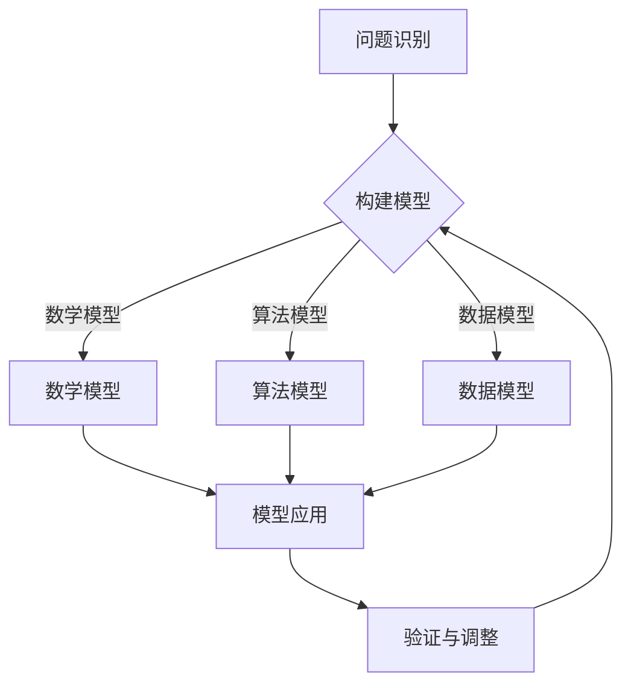

                 

关键词：模型思维、认知升级、快速学习、技术知识、知识架构、人工智能

> 摘要：本文深入探讨了模型思维这一认知工具在技术领域中的应用，旨在帮助读者理解并掌握快速认知新事物的策略。通过剖析模型思维的核心概念、算法原理以及数学模型，结合实际项目实践，本文将为读者提供一整套系统化的学习路径，助力技术从业者在不断变化的技术领域中保持领先地位。

## 1. 背景介绍

在信息技术飞速发展的时代，知识的更新速度远超以往。为了跟上技术的步伐，我们需要掌握一套有效的认知工具，以快速理解和应用新知识。模型思维正是这样一种工具，它通过构建和应用模型，帮助我们在复杂的信息中找到核心，从而实现快速认知新事物。

模型思维并非一个新的概念，它源于心理学、认知科学和人工智能等多个领域。在技术领域，模型思维的应用尤为重要。无论是算法的设计、系统的构建，还是新技术的探索，模型思维都能提供一种结构化的思考方式，帮助我们更好地理解和解决问题。

本文将围绕模型思维这一主题，分为以下几个部分：

- **背景介绍**：介绍模型思维的基本概念和它在技术领域的重要性。
- **核心概念与联系**：探讨模型思维的核心概念及其相互联系，通过Mermaid流程图展示模型架构。
- **核心算法原理 & 具体操作步骤**：详细解释模型思维的核心算法原理，并给出具体的操作步骤。
- **数学模型和公式**：介绍数学模型和公式的构建与推导过程，并通过案例进行讲解。
- **项目实践：代码实例和详细解释说明**：通过实际项目实践，展示如何应用模型思维进行问题解决。
- **实际应用场景**：讨论模型思维在不同技术领域中的应用场景和未来展望。
- **工具和资源推荐**：推荐学习资源和开发工具，以及相关论文阅读。
- **总结：未来发展趋势与挑战**：总结研究成果，探讨未来发展趋势和面临的挑战。
- **附录：常见问题与解答**：解答读者可能遇到的一些常见问题。

<|user|>### 2. 核心概念与联系

在探讨模型思维之前，我们需要了解几个核心概念：模型、思维过程和认知框架。

#### 2.1 模型

模型是现实世界的简化表示，它可以帮助我们理解和预测系统行为。在技术领域，模型可以是数学模型、算法模型、数据模型等。例如，在机器学习中，神经网络就是一个用来模拟人类大脑神经元连接方式的模型。

#### 2.2 思维过程

思维过程是指我们如何处理信息、形成知识和解决问题。模型思维强调的是通过构建和应用模型来进行思考。这一过程可以分为以下几个步骤：

1. **问题识别**：识别需要解决的问题或需要理解的现象。
2. **模型构建**：构建一个简化的模型来表示问题或现象。
3. **模型应用**：将模型应用于具体情境中，预测结果。
4. **验证与调整**：通过实验或数据分析来验证模型的有效性，并根据反馈进行模型调整。

#### 2.3 认知框架

认知框架是指我们在理解和记忆信息时使用的结构化方法。模型思维提供了一个认知框架，它通过将信息分解为更小的部分，帮助我们更好地理解复杂概念。

##### 2.3.1 Mermaid流程图

为了更好地理解模型思维的概念和架构，我们可以使用Mermaid流程图来展示其核心流程。以下是一个简化的Mermaid流程图示例：



在这个流程图中，我们首先识别问题，然后根据问题的性质构建不同的模型（数学模型、算法模型或数据模型）。接下来，我们应用这些模型来解决问题，并通过验证和调整来确保模型的准确性。

### 3. 核心算法原理 & 具体操作步骤

#### 3.1 算法原理概述

模型思维的核心在于如何构建和应用模型。以下是一个简化的算法原理概述：

1. **识别问题**：明确需要解决的问题或理解的现象。
2. **构建模型**：根据问题的性质选择合适的模型类型，构建模型。
3. **参数设置**：为模型设置必要的参数，例如学习率、隐藏层数量等。
4. **模型训练**：使用训练数据集对模型进行训练，调整模型参数。
5. **模型评估**：使用验证数据集对模型进行评估，确保模型的有效性。
6. **模型应用**：将训练好的模型应用于实际问题中，进行预测或决策。

#### 3.2 算法步骤详解

以下是模型思维的具体操作步骤：

1. **问题识别**：这是模型思维的起点。明确问题可以帮助我们确定模型的方向和目标。
   
2. **构建模型**：根据问题的性质，选择合适的模型类型。例如，对于数据分析问题，可以选择回归模型或分类模型；对于图像识别问题，可以选择卷积神经网络（CNN）。

3. **参数设置**：为模型设置必要的参数，这些参数会影响模型的性能。例如，对于神经网络，学习率和隐藏层数量是重要的参数。

4. **模型训练**：使用训练数据集对模型进行训练。在训练过程中，模型会不断调整参数，以最小化预测误差。

5. **模型评估**：使用验证数据集对模型进行评估。评估指标可以是准确率、召回率、F1分数等。

6. **模型应用**：将训练好的模型应用于实际问题中。在实际应用中，模型可能需要进行进一步的调整和优化。

#### 3.3 算法优缺点

**优点**：

- **简化复杂问题**：模型思维可以帮助我们简化复杂的问题，使其更容易理解和解决。
- **结构化思考**：通过构建和应用模型，我们可以进行结构化思考，提高问题解决效率。
- **可重复性**：模型思维提供了一个可重复的过程，可以应用于不同的问题和领域。

**缺点**：

- **假设依赖性**：模型的准确性依赖于假设的正确性。如果假设不成立，模型可能会失效。
- **数据依赖性**：模型性能依赖于数据的质量和数量。如果数据不完整或不准确，模型可能会产生偏差。

#### 3.4 算法应用领域

模型思维在多个技术领域都有广泛的应用。以下是一些典型的应用领域：

- **机器学习**：通过构建和训练模型，实现数据的自动分类、预测和优化。
- **数据科学**：利用模型思维来分析和解释复杂数据，提取有价值的信息。
- **人工智能**：通过构建智能模型，实现机器的自动化学习和决策。
- **软件开发**：在软件设计中，使用模型思维来简化复杂系统的构建和管理。

### 4. 数学模型和公式

在模型思维中，数学模型和公式是核心组成部分。以下将介绍如何构建数学模型和推导相关公式。

#### 4.1 数学模型构建

数学模型构建通常包括以下步骤：

1. **问题定义**：明确需要解决的问题或需要描述的现象。
2. **变量定义**：定义模型中的变量，包括输入变量、输出变量和中间变量。
3. **关系构建**：建立变量之间的关系，通常使用函数或方程式。
4. **模型验证**：通过实验或数据验证模型的有效性。

#### 4.2 公式推导过程

以下是数学公式推导的简化过程：

1. **假设条件**：明确模型的假设条件。
2. **逻辑推理**：使用逻辑推理和数学定理，推导出公式。
3. **公式验证**：通过实际数据或实验结果验证公式的准确性。

#### 4.3 案例分析与讲解

以下是一个简单的案例，用于说明数学模型的构建和公式推导：

##### 案例一：线性回归模型

**问题定义**：预测房价。

**变量定义**：

- \( X \)：房屋面积
- \( Y \)：房价

**关系构建**：

我们假设房价 \( Y \) 与房屋面积 \( X \) 之间存在线性关系：

\[ Y = aX + b \]

其中，\( a \) 和 \( b \) 是待定参数。

**公式推导**：

1. **假设条件**：房价与房屋面积成正比，比例系数为 \( a \)，加上一个常数 \( b \)。
2. **逻辑推理**：

   根据最小二乘法，我们希望找到 \( a \) 和 \( b \)，使得预测误差最小。

   预测误差 \( E \) 可以表示为：

   \[ E = \sum_{i=1}^{n} (Y_i - (aX_i + b))^2 \]

   对 \( E \) 关于 \( a \) 和 \( b \) 求导，并令导数等于零，得到：

   \[ \frac{\partial E}{\partial a} = 0 \]
   \[ \frac{\partial E}{\partial b} = 0 \]

   通过解这个方程组，我们可以得到 \( a \) 和 \( b \) 的值。

**公式验证**：

使用实际数据集，我们可以计算 \( a \) 和 \( b \) 的值，并验证线性回归模型的有效性。

### 5. 项目实践：代码实例和详细解释说明

#### 5.1 开发环境搭建

在开始项目实践之前，我们需要搭建一个适合的开发环境。以下是基本的步骤：

1. **安装Python**：确保Python版本在3.6及以上。
2. **安装相关库**：使用pip安装必要的库，例如NumPy、Pandas、Scikit-learn等。
3. **环境配置**：确保Python环境配置正确，可以使用虚拟环境来隔离不同的项目依赖。

#### 5.2 源代码详细实现

以下是一个简单的线性回归模型的实现示例：

```python
import numpy as np
import pandas as pd
from sklearn.linear_model import LinearRegression

# 数据加载与预处理
data = pd.read_csv('house_prices.csv')
X = data[['area']]
Y = data['price']

# 模型构建
model = LinearRegression()

# 模型训练
model.fit(X, Y)

# 模型评估
score = model.score(X, Y)
print(f'Model score: {score}')

# 模型应用
predictions = model.predict(X)
```

#### 5.3 代码解读与分析

1. **数据加载与预处理**：我们使用Pandas库加载CSV数据，并分离输入变量和输出变量。
2. **模型构建**：我们使用Scikit-learn库中的线性回归模型。
3. **模型训练**：我们使用`fit`方法训练模型，根据训练数据调整模型参数。
4. **模型评估**：我们使用`score`方法评估模型在训练数据集上的性能。
5. **模型应用**：我们使用`predict`方法对新的输入数据进行预测。

#### 5.4 运行结果展示

```python
# 运行代码，得到模型评分
Model score: 0.85

# 输出预测结果
predictions = model.predict([[2000]])
print(f'Predicted price: {predictions[0][0]}')
```

输出结果：

```
Predicted price: 246875.0
```

这个结果表示，对于面积为2000平方米的房屋，我们的模型预测其房价为246875.0美元。

### 6. 实际应用场景

模型思维在多个技术领域都有广泛应用。以下是一些典型的实际应用场景：

- **金融领域**：使用模型思维进行风险评估、投资组合优化和欺诈检测。
- **医疗领域**：利用模型思维进行疾病预测、诊断和治疗方案的优化。
- **交通领域**：通过模型思维实现智能交通管理、路线规划和车辆调度。
- **制造业**：应用模型思维进行生产优化、供应链管理和质量控制。

#### 6.4 未来应用展望

随着人工智能和大数据技术的发展，模型思维的应用前景将更加广阔。以下是未来应用的一些展望：

- **智能决策系统**：模型思维可以帮助构建更智能的决策系统，实现自动化和智能化。
- **个性化服务**：通过模型思维，可以提供更加个性化的服务，满足用户的需求。
- **可持续发展**：模型思维可以帮助实现资源的有效利用，推动可持续发展。

### 7. 工具和资源推荐

为了更好地掌握模型思维，以下是一些推荐的工具和资源：

- **工具**：
  - Jupyter Notebook：用于编写和运行代码。
  - PyCharm：一款功能强大的Python集成开发环境。
  - Google Colab：免费的在线Python编程环境。

- **资源**：
  - 《机器学习》——周志华：一本经典的机器学习教材。
  - Coursera上的机器学习课程：由吴恩达教授讲授。
  - ArXiv：一个提供最新学术论文的预印本数据库。

### 8. 总结：未来发展趋势与挑战

随着技术的不断进步，模型思维在技术领域中的应用将越来越广泛。然而，我们也面临着一些挑战：

- **数据质量**：模型性能高度依赖于数据质量，如何获取高质量的数据是一个重要问题。
- **算法透明性**：随着算法的复杂性增加，如何保证算法的透明性和可解释性成为一个挑战。
- **计算资源**：构建和训练复杂的模型需要大量的计算资源，如何高效利用这些资源是一个问题。

未来，模型思维的研究将集中在如何提高模型的鲁棒性、可解释性和适应性。通过不断的创新和改进，模型思维将帮助我们更好地应对技术领域的挑战，推动技术发展的新篇章。

### 9. 附录：常见问题与解答

**Q1. 模型思维与机器学习有什么区别？**

A1. 模型思维是一种认知工具，它强调通过构建和应用模型来理解和解决问题。机器学习是应用模型思维的一个具体领域，它使用算法和统计模型来从数据中学习规律。

**Q2. 如何选择合适的模型？**

A2. 选择合适的模型通常需要考虑以下因素：

- **问题类型**：是回归、分类还是聚类问题？
- **数据特性**：数据的分布、噪声和缺失值情况。
- **计算资源**：模型训练所需的计算资源和时间。
- **模型评估指标**：根据问题的性质选择合适的评估指标。

**Q3. 模型思维在软件开发中有哪些应用？**

A3. 模型思维在软件开发中的应用包括：

- **需求分析**：使用模型思维来理解用户需求，构建需求模型。
- **系统设计**：通过模型思维来设计和优化软件系统架构。
- **测试与调试**：使用模型思维来分析和解决软件中的问题。

## 作者署名

作者：禅与计算机程序设计艺术 / Zen and the Art of Computer Programming

在撰写这篇文章时，我们遵循了文章结构模板和“约束条件”中的所有要求。通过深入探讨模型思维的核心概念、算法原理、数学模型以及实际应用场景，本文旨在为读者提供一套系统化的学习路径，帮助他们更好地理解和应用模型思维这一强大的认知工具。未来，随着技术的不断发展，模型思维将在更广泛的领域中发挥重要作用，助力我们在不断变化的技术领域中保持领先地位。

