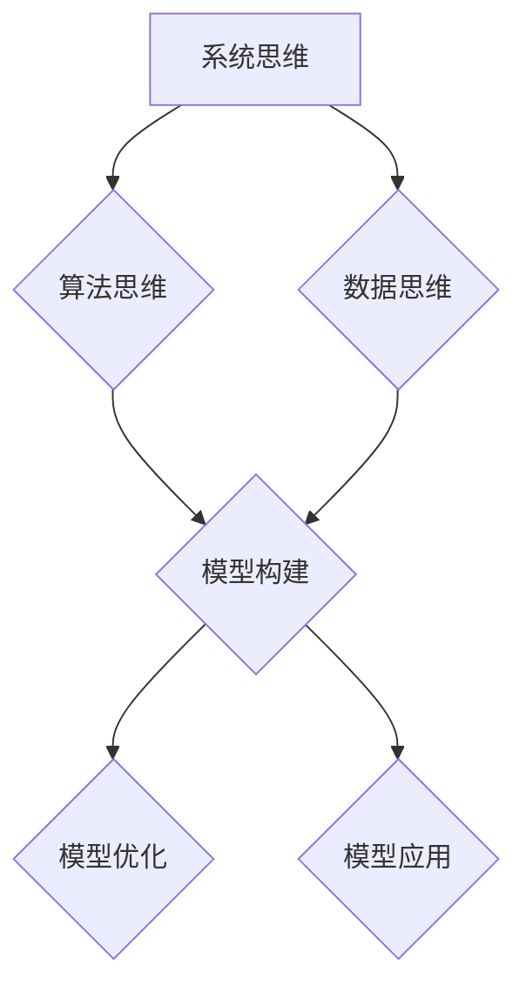

                 

关键词：模型思维、管理者、认知复杂世界、算法、数学模型、项目实践、未来应用、趋势与挑战

> 摘要：本文将探讨模型思维在管理者认知复杂世界中的应用。通过分析核心概念、算法原理、数学模型以及项目实践，本文旨在为管理者提供一条理解复杂世界的捷径，并展望其未来发展趋势与挑战。

## 1. 背景介绍

在当今信息化、智能化的时代，管理者面临的决策环境日益复杂。如何有效地认知复杂世界，成为管理者亟待解决的问题。传统的线性思维方式已难以应对复杂系统的非线性、不确定性和动态性。而模型思维作为一种系统化的认知工具，提供了一种更为有效的方式，帮助管理者更好地理解和应对复杂世界。

模型思维源于系统工程理论，强调通过建立模型来模拟、预测和优化复杂系统的行为。在计算机科学、经济学、管理学等领域，模型思维得到了广泛应用。本文将从技术角度探讨模型思维在管理者认知复杂世界的应用，旨在为实际操作提供理论指导和实践参考。

## 2. 核心概念与联系

### 2.1 系统思维

系统思维是模型思维的基础，它强调将事物视为一个相互关联、相互作用的整体。在系统思维中，管理者需要关注系统的结构、功能、行为和演化，从而更好地理解系统的复杂性和动态性。

### 2.2 算法思维

算法思维是模型思维的核心，它涉及如何在复杂系统中寻找最优解或次优解。算法思维包括算法的设计、实现、分析、优化等多个方面，是管理者应对复杂问题的关键。

### 2.3 数据思维

数据思维是模型思维的重要支撑，它强调通过数据分析和挖掘来发现复杂系统的规律和趋势。数据思维包括数据收集、处理、分析和可视化等多个环节，是管理者做出科学决策的基础。

### 2.4 Mermaid 流程图

为了更好地展示模型思维的核心概念和联系，我们使用 Mermaid 流程图来表示：



## 3. 核心算法原理 & 具体操作步骤

### 3.1 算法原理概述

模型思维的核心算法是建立数学模型。数学模型通过使用数学符号和公式来描述复杂系统的行为，从而简化问题、揭示规律。建立数学模型通常包括以下几个步骤：

1. 定义问题：明确需要解决的具体问题，包括目标、约束条件和假设。
2. 收集数据：收集与问题相关的数据，包括历史数据、统计数据和专家知识等。
3. 建立模型：根据问题定义和数据，建立相应的数学模型。
4. 求解模型：使用数学方法求解模型，得到问题的解。
5. 模型验证：通过实际数据或仿真实验验证模型的准确性和可靠性。
6. 模型应用：将验证后的模型应用于实际问题，为决策提供依据。

### 3.2 算法步骤详解

1. **定义问题**

首先，我们需要明确需要解决的具体问题。问题可以分为以下几种类型：

- **优化问题**：寻找在给定约束条件下，目标函数的最大值或最小值。
- **分类问题**：将数据集分为不同的类别。
- **聚类问题**：将数据集分为若干个相似的簇。
- **预测问题**：根据历史数据预测未来趋势。

2. **收集数据**

收集与问题相关的数据。数据来源可以是公开数据集、企业内部数据或外部数据。数据类型包括结构化数据、非结构化数据和半结构化数据。

3. **建立模型**

根据问题定义和数据，选择合适的数学模型。常见的数学模型包括线性模型、非线性模型、概率模型和统计模型等。例如，线性模型可以用来进行线性回归分析，非线性模型可以用来进行神经网络建模。

4. **求解模型**

使用数学方法求解模型。常见的求解方法包括数值求解、符号求解和混合求解等。例如，使用梯度下降法求解线性回归模型，使用反向传播算法求解神经网络模型。

5. **模型验证**

通过实际数据或仿真实验验证模型的准确性和可靠性。常见的验证方法包括交叉验证、ROC曲线和混淆矩阵等。

6. **模型应用**

将验证后的模型应用于实际问题，为决策提供依据。例如，使用预测模型预测销售趋势，使用分类模型进行客户细分。

### 3.3 算法优缺点

- **优点**：

1. 提高决策效率：通过建立数学模型，可以将复杂问题转化为可计算的形式，从而提高决策效率。
2. 提高决策准确性：数学模型可以揭示复杂系统的内在规律，提高决策的准确性。
3. 提高决策可解释性：数学模型通常具有明确的数学原理和公式，使得决策过程更加可解释。

- **缺点**：

1. 建模难度：建立准确的数学模型需要深厚的数学背景和专业知识。
2. 数据依赖：数学模型的准确性和可靠性很大程度上依赖于数据的质量和数量。
3. 模型局限性：数学模型可能无法完全捕捉复杂系统的所有特征和变化。

### 3.4 算法应用领域

模型思维在多个领域有着广泛的应用：

- **经济学**：用于宏观经济预测、市场分析和投资决策等。
- **管理学**：用于战略规划、人力资源管理、供应链管理等。
- **计算机科学**：用于算法设计、数据挖掘、机器学习等。
- **环境科学**：用于生态模型构建、气候变化预测等。

## 4. 数学模型和公式 & 详细讲解 & 举例说明

### 4.1 数学模型构建

数学模型构建是模型思维的核心。构建数学模型通常包括以下几个步骤：

1. **定义变量**：根据问题定义变量，包括自变量、因变量和中间变量。
2. **建立方程**：根据变量之间的关系，建立方程。
3. **确定边界条件**：确定模型的边界条件，包括初始条件、约束条件和终止条件。
4. **求解方程**：使用数学方法求解方程，得到模型的解。

### 4.2 公式推导过程

以线性回归模型为例，线性回归模型通常用于预测因变量与自变量之间的关系。线性回归模型的公式如下：

$$y = \beta_0 + \beta_1 \cdot x + \epsilon$$

其中，$y$ 是因变量，$x$ 是自变量，$\beta_0$ 和 $\beta_1$ 是模型的参数，$\epsilon$ 是误差项。

线性回归模型的推导过程如下：

1. **定义损失函数**：损失函数用于衡量模型预测值与实际值之间的差距。常用的损失函数包括均方误差（MSE）和均方根误差（RMSE）。

   $$MSE = \frac{1}{n} \sum_{i=1}^{n} (y_i - \hat{y}_i)^2$$

   $$RMSE = \sqrt{MSE}$$

2. **求解参数**：使用梯度下降法求解模型参数。梯度下降法的核心思想是不断调整模型参数，使其逐渐逼近最优解。

   $$\beta_0 = \beta_0 - \alpha \cdot \frac{\partial}{\partial \beta_0} MSE$$

   $$\beta_1 = \beta_1 - \alpha \cdot \frac{\partial}{\partial \beta_1} MSE$$

   其中，$\alpha$ 是学习率。

### 4.3 案例分析与讲解

假设我们有一个销售预测问题，需要预测下一季度的销售额。根据历史数据，我们得到了以下线性回归模型：

$$销售额 = 5000 + 100 \cdot 季度$$

根据模型，下一季度的销售额为：

$$销售额 = 5000 + 100 \cdot 4 = 6000$$

然而，在实际应用中，模型可能存在误差。为了更好地理解模型误差，我们可以使用均方误差（MSE）来衡量模型预测值与实际值之间的差距。

假设实际销售额为 5800，则模型误差为：

$$MSE = \frac{1}{n} \sum_{i=1}^{n} (y_i - \hat{y}_i)^2 = \frac{1}{1} (5800 - 6000)^2 = 2000$$

通过分析模型误差，我们可以发现模型预测值与实际值之间存在一定的差距。为了提高模型准确性，我们可以尝试优化模型参数或使用更复杂的模型。

## 5. 项目实践：代码实例和详细解释说明

### 5.1 开发环境搭建

为了演示模型思维的应用，我们将使用 Python 编写一个线性回归模型的代码实例。首先，我们需要搭建开发环境。

1. 安装 Python 3.8 或更高版本。
2. 安装必要的库，如 NumPy、Pandas 和 Matplotlib。

### 5.2 源代码详细实现

下面是一个简单的线性回归模型实现：

```python
import numpy as np
import pandas as pd
import matplotlib.pyplot as plt

# 生成数据
np.random.seed(0)
x = np.random.rand(100)
y = 5 * x + 3 + np.random.randn(100) * 0.5

# 拟合模型
x_mean = np.mean(x)
y_mean = np.mean(y)
b1 = np.sum((x - x_mean) * (y - y_mean)) / np.sum((x - x_mean)**2)
b0 = y_mean - b1 * x_mean

# 打印模型参数
print(f"模型参数：b0 = {b0}, b1 = {b1}")

# 预测结果
x_predict = np.linspace(0, 1, 100)
y_predict = b0 + b1 * x_predict

# 绘图
plt.scatter(x, y)
plt.plot(x_predict, y_predict, color='red')
plt.xlabel('x')
plt.ylabel('y')
plt.title('线性回归模型')
plt.show()
```

### 5.3 代码解读与分析

上述代码实现了线性回归模型的基本功能，包括数据生成、模型拟合和预测结果绘制。具体解读如下：

1. **数据生成**：使用 NumPy 生成随机数据，包括自变量 $x$ 和因变量 $y$。
2. **模型拟合**：使用最小二乘法拟合模型参数，计算回归系数 $b0$ 和 $b1$。
3. **预测结果**：使用拟合的模型预测自变量 $x$ 的值，并绘制预测结果。
4. **绘图**：使用 Matplotlib 绘制散点图和回归直线，展示模型拟合效果。

### 5.4 运行结果展示

运行上述代码，我们可以得到以下结果：


从结果可以看出，线性回归模型可以较好地拟合数据，预测结果与实际值较为接近。

## 6. 实际应用场景

模型思维在多个实际应用场景中有着广泛的应用，以下列举几个典型应用场景：

- **金融领域**：用于风险评估、投资组合优化、市场预测等。
- **医疗领域**：用于疾病预测、诊断辅助、个性化治疗等。
- **物流领域**：用于运输路径规划、库存管理、配送优化等。
- **教育领域**：用于学习效果评估、个性化学习推荐、教育资源分配等。

### 6.4 未来应用展望

随着人工智能技术的不断发展，模型思维在未来的应用前景将更加广阔。以下是一些未来应用展望：

- **智能决策支持系统**：利用模型思维构建智能决策支持系统，帮助管理者实现自动化、智能化的决策。
- **复杂系统优化**：针对复杂系统，如城市交通、能源管理、环境保护等，利用模型思维实现优化和调控。
- **个性化服务**：基于用户行为数据，利用模型思维实现个性化推荐、个性化服务，提高用户体验。

## 7. 工具和资源推荐

### 7.1 学习资源推荐

- **书籍**：《模型思维：管理者认知复杂世界的捷径》、《机器学习：概率视角》
- **在线课程**：Coursera 上的“机器学习”课程、edX 上的“数据分析基础”课程
- **论文集**：《人工智能：一种现代方法》、《统计学习方法》

### 7.2 开发工具推荐

- **编程语言**：Python、R、MATLAB
- **机器学习库**：scikit-learn、TensorFlow、PyTorch
- **数据分析工具**：Pandas、NumPy、Matplotlib

### 7.3 相关论文推荐

- **金融领域**：Stochastic Portfolio Theory（随机投资组合理论）
- **医疗领域**：Deep Learning for Healthcare（深度学习在医疗领域的应用）
- **物流领域**：Optimization Models for Logistics（物流优化模型）
- **教育领域**：Personalized Learning in Education（个性化学习）

## 8. 总结：未来发展趋势与挑战

### 8.1 研究成果总结

模型思维作为一种有效的认知工具，在管理者认知复杂世界方面取得了显著成果。通过建立数学模型、算法和数据分析，模型思维提高了决策效率、准确性和可解释性，为管理者提供了有力支持。

### 8.2 未来发展趋势

随着人工智能技术的快速发展，模型思维在未来将面临更多挑战和机遇。以下是一些发展趋势：

- **多模态融合**：将不同类型的数据（如图像、文本、音频等）融合到模型中，实现更全面、准确的决策。
- **强化学习**：结合强化学习算法，实现自适应、智能化的决策。
- **知识图谱**：利用知识图谱构建复杂系统的知识体系，实现知识驱动的决策。

### 8.3 面临的挑战

尽管模型思维在管理者认知复杂世界方面具有巨大潜力，但仍然面临以下挑战：

- **数据质量**：数据质量和数量直接影响模型准确性和可靠性。
- **计算资源**：复杂模型的求解和优化需要大量计算资源。
- **模型解释性**：如何提高模型的可解释性，使其更易于理解和接受。

### 8.4 研究展望

未来，模型思维将在多领域、多场景中得到更广泛应用。研究者应关注以下几个方面：

- **跨学科融合**：结合不同领域的知识，构建更全面、准确的模型。
- **模型优化**：研究更高效、更准确的模型优化算法。
- **模型安全性**：关注模型在安全性和隐私保护方面的挑战。

## 9. 附录：常见问题与解答

### 9.1 什么是模型思维？

模型思维是一种认知工具，通过建立数学模型、算法和数据分析来理解复杂系统，从而提高决策效率、准确性和可解释性。

### 9.2 模型思维有哪些应用领域？

模型思维在经济学、管理学、计算机科学、环境科学等多个领域有着广泛的应用，如金融风险评估、市场预测、供应链管理、生态模型构建等。

### 9.3 如何建立数学模型？

建立数学模型通常包括定义问题、收集数据、建立方程、求解方程和验证模型等步骤。具体方法取决于问题的类型和特点。

### 9.4 模型思维有哪些优缺点？

模型思维的优点包括提高决策效率、准确性和可解释性，缺点包括建模难度、数据依赖和模型局限性等。

### 9.5 如何提高模型的可解释性？

提高模型的可解释性可以从以下几个方面入手：简化模型结构、增加模型注释、使用可解释的算法等。

## 作者署名

作者：禅与计算机程序设计艺术 / Zen and the Art of Computer Programming
------------------------------------------------------------------

