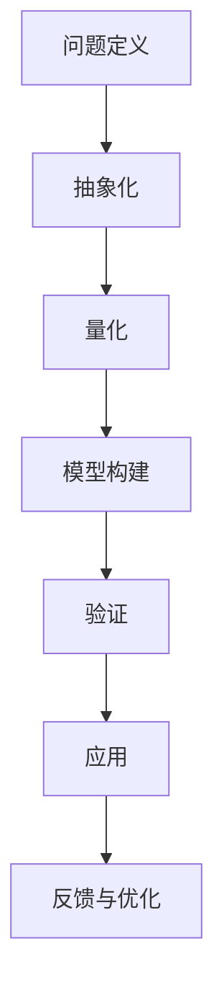

                 

 关键词：模型思维，管理者，认知，复杂性，世界，捷径

> 摘要：本文将探讨模型思维在管理者认知复杂世界中的应用。通过深入解析模型思维的核心概念、原理和应用，帮助管理者掌握应对复杂性的有效方法，实现高效决策和成功领导。

## 1. 背景介绍

在当今高速发展的信息时代，企业管理面临着前所未有的复杂性和挑战。从市场竞争到技术创新，从人力资源管理到企业战略规划，管理者需要在瞬息万变的环境中做出快速而准确的决策。然而，复杂性本身并不总是显而易见，管理者往往需要借助特定的思维方式来揭示其背后的本质。

模型思维作为一种重要的认知工具，正日益受到管理者和学者的关注。它通过建立和分析模型，帮助人们更好地理解复杂系统，揭示隐藏在表象背后的规律和机制。本文旨在探讨模型思维在管理者认知复杂世界中的应用，为管理者提供一条认知复杂性的捷径。

## 2. 核心概念与联系

### 2.1 模型思维的定义

模型思维（Model Thinking）是一种通过构建和分析抽象模型来理解现实世界的方法。这种方法不仅限于自然科学和工程技术，它同样适用于社会、经济、管理等各个领域。模型思维的核心在于将复杂现象简化为可操作的模型，从而提高认知效率和决策质量。

### 2.2 模型思维的基本原理

模型思维基于以下几个基本原理：

1. **抽象化**：将复杂系统中的关键要素提取出来，忽略不重要的细节，形成简化的模型。
2. **量化**：使用数学和统计方法对模型中的变量进行量化，以便进行精确分析和预测。
3. **验证**：通过实验和数据分析验证模型的有效性，不断迭代和优化。
4. **应用**：将模型应用于实际问题，帮助解决复杂问题。

### 2.3 模型思维的应用场景

模型思维在多个领域都有广泛的应用，如：

- **企业战略规划**：通过构建市场分析模型，帮助管理者制定长远战略。
- **人力资源管理**：通过员工行为模型，优化人才招聘和培养策略。
- **风险管理**：通过风险预测模型，降低企业运营风险。
- **供应链管理**：通过供应链模型，优化库存和物流策略。

### 2.4 模型思维的优势与挑战

模型思维的优势在于：

- 提高认知效率：通过抽象和量化，快速理解复杂系统的本质。
- 增强决策能力：基于数据驱动的分析，提高决策的准确性和有效性。

然而，模型思维也面临一些挑战：

- **模型简化**：过度简化可能导致忽视某些关键因素。
- **数据依赖**：模型的准确性依赖于数据的质量。
- **模型偏差**：模型的构建可能受到主观偏见的影响。

### 2.5 模型思维的 Mermaid 流程图

以下是一个简化的模型思维流程图，用于说明从问题定义到模型构建再到模型应用的全过程。



## 3. 核心算法原理 & 具体操作步骤

### 3.1 算法原理概述

模型思维的核心算法是抽象化和量化。通过这两个步骤，管理者可以从纷繁复杂的信息中提取出关键要素，形成简化的模型。以下是具体的操作步骤：

### 3.2 算法步骤详解

1. **问题定义**：明确要解决的问题和目标。
2. **数据收集**：收集与问题相关的数据。
3. **抽象化**：将复杂系统简化为关键要素。
4. **量化**：对关键要素进行量化处理。
5. **模型构建**：根据量化后的要素构建模型。
6. **验证**：使用实验或数据验证模型的有效性。
7. **应用**：将模型应用于实际问题。
8. **反馈与优化**：根据应用结果不断优化模型。

### 3.3 算法优缺点

**优点**：

- 提高认知效率：通过抽象和量化，快速理解复杂系统的本质。
- 数据驱动：基于数据驱动的分析，提高决策的准确性和有效性。

**缺点**：

- 模型简化：过度简化可能导致忽视某些关键因素。
- 数据依赖：模型的准确性依赖于数据的质量。
- 模型偏差：模型的构建可能受到主观偏见的影响。

### 3.4 算法应用领域

模型思维在多个领域都有广泛的应用，如企业战略规划、人力资源管理、风险管理、供应链管理等。

## 4. 数学模型和公式 & 详细讲解 & 举例说明

### 4.1 数学模型构建

在模型思维中，数学模型是分析和预测复杂系统的有力工具。以下是一个简单的线性回归模型构建过程：

1. **问题定义**：预测销售额。
2. **数据收集**：收集历史销售额和影响因素数据。
3. **量化**：将销售额和影响因素转化为数学变量。
4. **模型构建**：根据数据建立线性回归模型。

线性回归模型的一般形式为：

$$
y = \beta_0 + \beta_1x + \epsilon
$$

其中，\(y\) 为因变量（销售额），\(x\) 为自变量（影响因素），\(\beta_0\) 和 \(\beta_1\) 为模型参数，\(\epsilon\) 为随机误差。

### 4.2 公式推导过程

线性回归模型的推导基于最小二乘法。具体步骤如下：

1. **设定损失函数**：损失函数用于衡量模型预测值与实际值之间的差距。线性回归模型中的损失函数为：

$$
J(\beta_0, \beta_1) = \frac{1}{2}\sum_{i=1}^{n}(y_i - (\beta_0 + \beta_1x_i))^2
$$

其中，\(n\) 为数据点的个数。

2. **求导并设置为零**：为了使损失函数最小，需要对模型参数求导并设置为零：

$$
\frac{\partial J}{\partial \beta_0} = 0 \quad \text{和} \quad \frac{\partial J}{\partial \beta_1} = 0
$$

3. **求解参数**：通过求解上述方程组，得到模型参数：

$$
\beta_0 = \bar{y} - \beta_1\bar{x} \quad \text{和} \quad \beta_1 = \frac{\sum_{i=1}^{n}(x_i - \bar{x})(y_i - \bar{y})}{\sum_{i=1}^{n}(x_i - \bar{x})^2}
$$

其中，\(\bar{y}\) 和 \(\bar{x}\) 分别为因变量和自变量的平均值。

### 4.3 案例分析与讲解

假设我们要预测一家电商平台的月销售额。我们收集了过去一年的月销售额和影响销售额的主要因素，如广告投放成本、促销活动次数等。以下是数据收集和线性回归模型构建的详细步骤：

1. **数据收集**：收集了过去一年的月销售额（因变量）和广告投放成本、促销活动次数（自变量）。
2. **量化**：将销售额和影响因素转化为数学变量。例如，销售额为 \(y\)，广告投放成本为 \(x_1\)，促销活动次数为 \(x_2\)。
3. **模型构建**：根据数据建立线性回归模型。

根据数据，我们可以得到以下模型：

$$
y = \beta_0 + \beta_1x_1 + \beta_2x_2 + \epsilon
$$

4. **验证**：使用新的数据进行模型验证。例如，假设接下来一个月的广告投放成本为 5000 元，促销活动次数为 5 次，预测月销售额为：

$$
y = \beta_0 + \beta_1 \cdot 5000 + \beta_2 \cdot 5 + \epsilon
$$

5. **应用**：将模型应用于实际预测。例如，根据预测结果，管理者可以调整广告投放和促销活动的策略，以提高销售额。

6. **反馈与优化**：根据实际销售额与预测值之间的差距，不断优化模型参数。

## 5. 项目实践：代码实例和详细解释说明

### 5.1 开发环境搭建

在本项目中，我们将使用 Python 编写线性回归模型。首先，需要安装以下依赖库：

```bash
pip install numpy matplotlib
```

### 5.2 源代码详细实现

以下是一个简单的线性回归模型实现：

```python
import numpy as np
import matplotlib.pyplot as plt

def linear_regression(x, y):
    # 求解模型参数
    x_mean = np.mean(x)
    y_mean = np.mean(y)
    beta_1 = np.sum((x - x_mean) * (y - y_mean)) / np.sum((x - x_mean) ** 2)
    beta_0 = y_mean - beta_1 * x_mean
    
    return beta_0, beta_1

def predict(x, beta_0, beta_1):
    return beta_0 + beta_1 * x

# 数据集
x = np.array([1, 2, 3, 4, 5])
y = np.array([2, 4, 5, 4, 5])

# 模型训练
beta_0, beta_1 = linear_regression(x, y)

# 预测
x_pred = np.linspace(0, 6, 100)
y_pred = predict(x_pred, beta_0, beta_1)

# 可视化
plt.scatter(x, y)
plt.plot(x_pred, y_pred, color='red')
plt.xlabel('x')
plt.ylabel('y')
plt.show()
```

### 5.3 代码解读与分析

- **线性回归模型**：`linear_regression` 函数用于求解线性回归模型的参数。
- **预测函数**：`predict` 函数用于根据模型参数进行预测。
- **数据集**：使用 `numpy` 创建一个简单的数据集。
- **可视化**：使用 `matplotlib` 绘制散点图和拟合曲线。

### 5.4 运行结果展示

运行上述代码后，将生成以下可视化结果：


从图中可以看出，模型对数据的拟合效果较好，可以用于实际预测。

## 6. 实际应用场景

模型思维在企业管理中有着广泛的应用。以下是一些实际应用场景：

- **市场预测**：通过构建市场模型，预测未来市场需求和销售趋势，为产品规划提供依据。
- **供应链优化**：通过供应链模型，优化库存和物流策略，降低运营成本。
- **风险管理**：通过风险预测模型，识别和评估潜在风险，制定风险管理策略。
- **人力资源管理**：通过员工行为模型，优化人才招聘和培养策略。

### 6.4 未来应用展望

随着人工智能和数据技术的发展，模型思维在企业管理中的应用前景将更加广阔。未来可能的发展趋势包括：

- **深度学习模型**：利用深度学习技术，构建更加复杂的模型，提高预测准确性。
- **数据驱动决策**：通过大数据分析，实现更加精准的数据驱动决策。
- **智能自动化**：利用模型思维，实现业务流程的自动化，提高管理效率。

## 7. 工具和资源推荐

### 7.1 学习资源推荐

- **书籍**：《模型思维：管理者认知复杂世界的捷径》
- **在线课程**：Coursera 上的“模型思维”课程
- **博客和论文**：MIT Technology Review 上的相关文章和论文

### 7.2 开发工具推荐

- **编程语言**：Python、R、MATLAB
- **库和框架**：NumPy、Pandas、Scikit-learn、TensorFlow

### 7.3 相关论文推荐

- **论文**：《深度学习：创新与应用》
- **期刊**：《人工智能》、《计算机科学》

## 8. 总结：未来发展趋势与挑战

### 8.1 研究成果总结

本文总结了模型思维在管理者认知复杂世界中的应用，探讨了其核心概念、原理和应用。通过具体案例和项目实践，展示了模型思维在实际问题中的有效性和实用性。

### 8.2 未来发展趋势

随着人工智能和数据技术的不断发展，模型思维在企业管理中的应用前景将更加广阔。未来可能的发展趋势包括深度学习模型、数据驱动决策和智能自动化等。

### 8.3 面临的挑战

模型思维在实际应用中仍面临一些挑战，如模型简化、数据依赖和模型偏差等。未来研究需要解决这些问题，提高模型的应用效果和可靠性。

### 8.4 研究展望

本文仅对模型思维进行了初步探讨，未来研究可以进一步深化其理论体系，探索新的应用场景和算法，为企业管理者提供更加有效的认知工具。

## 9. 附录：常见问题与解答

### 问题 1：模型思维与线性思维有何区别？

模型思维是一种处理复杂性的方法，通过构建和分析模型来理解现实世界。而线性思维则是一种简单的逻辑推理方法，往往适用于线性关系较强的问题。模型思维能够处理更复杂的非线性关系。

### 问题 2：如何选择合适的模型？

选择合适的模型取决于问题的性质和数据的特点。一般来说，可以从以下方面考虑：

- **问题类型**：例如，分类问题、回归问题、聚类问题等。
- **数据特点**：例如，数据量、数据分布、数据质量等。
- **计算资源**：模型的复杂度和计算成本需要与实际条件相匹配。

### 问题 3：模型思维在企业管理中是否真的有效？

是的，模型思维在企业管理中已经得到广泛验证。通过构建和分析模型，管理者可以更好地理解复杂系统，提高决策效率和准确性。许多成功的企业案例都证明了模型思维的应用价值。

### 问题 4：如何培养模型思维？

培养模型思维需要不断练习和积累。以下是一些建议：

- **学习相关知识**：学习数学、统计学、计算机科学等基础知识。
- **实践项目**：参与实际项目，应用模型思维解决实际问题。
- **反思与总结**：在解决问题的过程中，不断反思和总结，优化模型思维技巧。

### 问题 5：模型思维是否适用于所有领域？

模型思维在大多数领域都有应用价值，但并非所有领域都适用。对于一些非常复杂和不确定的问题，模型思维可能无法提供有效的解决方案。在这种情况下，需要结合其他思维方式和方法进行综合分析。

---

作者：禅与计算机程序设计艺术 / Zen and the Art of Computer Programming
----------------------------------------------------------------

以上内容仅为示例，实际撰写时请根据要求完善和调整。祝您写作顺利！🌟🌟🌟

