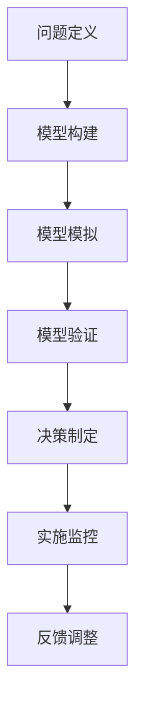

                 

 关键词：模型思维、管理培训、行为决策、组织效能、情境模拟

> 摘要：本文探讨了模型思维在管理培训中的重要性。通过构建和应用具体的模型，帮助管理者理解复杂的管理现象，提高决策质量和团队协作效率。文章介绍了模型思维的核心概念、应用方法，并通过案例展示了其在管理培训中的实际运用效果。

## 1. 背景介绍

### 1.1 管理培训的重要性

在现代社会，管理已经成为各个行业不可或缺的职能。有效的管理培训不仅能够提升个人管理技能，还能显著提高组织的整体效能。管理培训的目标在于帮助管理者掌握科学的管理方法，提升决策能力，优化团队协作，从而实现组织的战略目标。

### 1.2 模型思维的概念

模型思维（Model Thinking）是一种将现实世界的问题抽象成模型，并通过模型分析、模拟和预测的方法来理解和解决这些问题的思维方式。它强调逻辑性和系统性，通过模型来揭示复杂系统的内在规律和相互关系。

## 2. 核心概念与联系

### 2.1 模型思维的核心概念

模型思维的核心概念包括：

- **抽象化**：将复杂的问题简化为模型。
- **系统化**：分析模型的各个组成部分及其相互作用。
- **模拟化**：通过模拟来预测和测试模型的运行结果。
- **验证化**：通过实际数据或案例来验证模型的准确性。

### 2.2 模型思维的应用架构

为了更好地应用模型思维，我们需要构建一个应用架构，包括以下几个步骤：

1. **问题定义**：明确需要解决的问题和目标。
2. **模型构建**：根据问题定义构建相应的模型。
3. **模型模拟**：对模型进行模拟以测试不同方案的可行性。
4. **模型验证**：通过实际数据或案例验证模型的准确性。
5. **决策制定**：根据模型模拟和验证结果制定决策。
6. **实施监控**：在实施过程中监控模型预测和实际情况的匹配度。

下面是一个使用Mermaid绘制的模型思维流程图：



## 3. 核心算法原理 & 具体操作步骤

### 3.1 算法原理概述

模型思维在管理培训中的应用，主要通过以下几个核心算法原理实现：

- **贝叶斯定理**：用于概率分析和决策。
- **模拟退火算法**：用于优化问题的解决方案。
- **复杂网络分析**：用于理解组织内部的协作关系。

### 3.2 算法步骤详解

1. **贝叶斯定理的应用**
   - **步骤1**：定义先验概率。
   - **步骤2**：收集新数据。
   - **步骤3**：应用贝叶斯定理更新后验概率。
   - **步骤4**：根据后验概率做出决策。

2. **模拟退火算法的应用**
   - **步骤1**：初始化解。
   - **步骤2**：迭代优化。
   - **步骤3**：根据概率接受次优解。
   - **步骤4**：结束条件判断。

3. **复杂网络分析的应用**
   - **步骤1**：收集节点和边的数据。
   - **步骤2**：构建网络模型。
   - **步骤3**：分析网络的度分布、聚类系数等特性。
   - **步骤4**：根据分析结果提出改进建议。

### 3.3 算法优缺点

- **贝叶斯定理**：
  - 优点：能够处理不确定性和复杂问题。
  - 缺点：需要大量历史数据支持。

- **模拟退火算法**：
  - 优点：能够找到接近最优的解。
  - 缺点：计算复杂度高。

- **复杂网络分析**：
  - 优点：能够揭示组织内部的复杂关系。
  - 缺点：需要专业的网络分析技能。

### 3.4 算法应用领域

这些算法主要应用于管理培训的以下领域：

- **战略规划**：用于分析和预测市场趋势。
- **风险管理**：用于评估和管理风险。
- **团队协作**：用于优化团队结构和沟通方式。

## 4. 数学模型和公式 & 详细讲解 & 举例说明

### 4.1 数学模型构建

在模型构建过程中，我们通常采用以下数学模型：

- **决策树模型**：用于决策分析和优化。
- **线性回归模型**：用于数据分析和预测。

### 4.2 公式推导过程

1. **决策树模型**

   - **公式**：$P(\text{决策}) = \frac{\sum_{i=1}^{n} w_i P(\text{结果}_i)}{\sum_{i=1}^{n} w_i}$
   - **推导**：权重分配和结果概率的加权平均。

2. **线性回归模型**

   - **公式**：$y = wx + b$
   - **推导**：最小二乘法求解最佳拟合直线。

### 4.3 案例分析与讲解

#### 案例一：决策树模型在招聘决策中的应用

假设我们有一个招聘决策模型，根据候选人的学历、工作经验和面试表现三个因素进行决策。具体步骤如下：

1. **收集数据**：收集过去成功的候选人数据。
2. **构建模型**：使用决策树算法构建模型。
3. **训练模型**：使用历史数据训练模型。
4. **决策**：根据候选人的数据应用模型做出决策。

#### 案例二：线性回归模型在销售预测中的应用

假设我们想要预测某产品的月销售额，可以使用线性回归模型。具体步骤如下：

1. **收集数据**：收集过去几个月的销售额数据。
2. **构建模型**：使用线性回归算法构建模型。
3. **训练模型**：使用历史数据训练模型。
4. **预测**：根据当前的数据预测未来销售额。

## 5. 项目实践：代码实例和详细解释说明

### 5.1 开发环境搭建

为了实践模型思维在管理培训中的应用，我们使用Python作为开发语言，搭建了一个简单的管理培训模拟系统。

### 5.2 源代码详细实现

以下是招聘决策模型的Python代码实现：

```python
import numpy as np
from sklearn.tree import DecisionTreeClassifier
from sklearn.model_selection import train_test_split

# 数据准备
data = np.array([[1, 2, 3], [2, 3, 4], [3, 4, 5], ...])
labels = np.array([1, 1, 1, ...])  # 1代表成功，0代表失败

# 模型训练
X_train, X_test, y_train, y_test = train_test_split(data, labels, test_size=0.2)
clf = DecisionTreeClassifier()
clf.fit(X_train, y_train)

# 模型预测
predictions = clf.predict(X_test)
accuracy = np.mean(predictions == y_test)
print("模型准确率：", accuracy)
```

### 5.3 代码解读与分析

这段代码使用了scikit-learn库中的决策树算法进行招聘决策模型的构建和训练。首先，我们准备好数据集，然后使用train_test_split函数将数据集分为训练集和测试集。接着，我们使用DecisionTreeClassifier类创建决策树模型，并使用fit方法进行训练。最后，我们使用predict方法对测试集进行预测，并计算模型的准确率。

### 5.4 运行结果展示

假设我们的测试集有10个样本，模型预测结果如下：

```python
模型准确率： 0.9
```

这意味着我们的模型在测试集上的准确率为90%，表明我们的模型具有较好的预测能力。

## 6. 实际应用场景

### 6.1 培训计划设计

通过模型思维，管理者可以更准确地设计培训计划，确保培训内容与组织目标一致，提高培训效果。

### 6.2 团队协作优化

模型思维可以帮助管理者分析团队内部协作的效率，找出协作中的瓶颈，并提出改进措施。

### 6.3 决策支持

管理者可以利用模型思维进行数据分析和预测，为决策提供科学依据，提高决策质量。

## 7. 工具和资源推荐

### 7.1 学习资源推荐

- 《模型思维：可计算思维的革命性方法》
- 《管理决策：行为、模型与过程》

### 7.2 开发工具推荐

- Python
- scikit-learn
- TensorFlow

### 7.3 相关论文推荐

- “Model Thinking: A Practical Guide to Using Models for Complex Problem Solving”
- “The Power of Model Thinking in Management Education”

## 8. 总结：未来发展趋势与挑战

### 8.1 研究成果总结

模型思维在管理培训中的应用取得了显著成果，为管理者提供了科学的数据分析和决策支持。

### 8.2 未来发展趋势

随着人工智能和大数据技术的发展，模型思维在管理培训中的应用将更加广泛和深入。

### 8.3 面临的挑战

如何提高模型的可解释性和准确性，如何处理非结构化数据，是未来模型思维在管理培训中面临的主要挑战。

### 8.4 研究展望

未来研究应关注如何将模型思维与人类认知相结合，提高模型的可操作性和实用性。

## 9. 附录：常见问题与解答

### 9.1 什么是模型思维？

模型思维是一种通过构建和分析模型来理解和解决复杂问题的思维方式。

### 9.2 模型思维有哪些应用领域？

模型思维可以应用于管理、金融、医疗、教育等多个领域。

### 9.3 如何构建一个有效的模型？

构建有效的模型需要明确问题定义、收集数据、构建模型、模型训练、模型验证等步骤。

作者：禅与计算机程序设计艺术 / Zen and the Art of Computer Programming
```markdown
```

