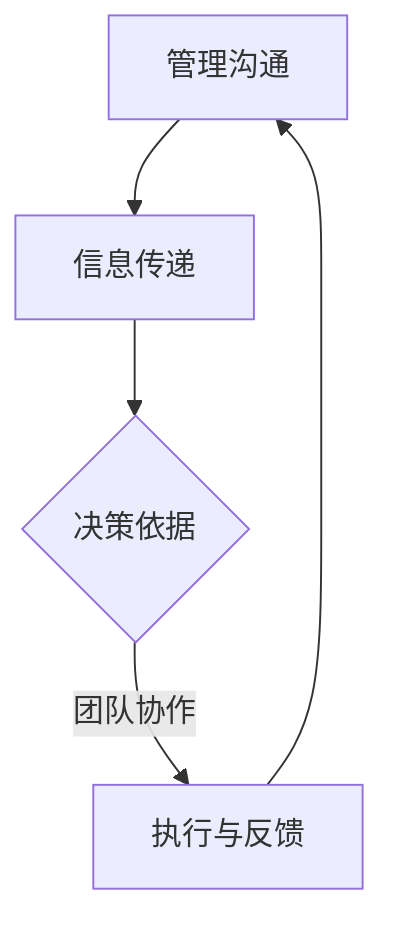

                 

关键词：模型思维、管理沟通、信息技术、流程优化、策略规划、团队协作

摘要：本文将探讨模型思维在管理沟通中的重要性，通过分析其在信息技术领域的具体应用，阐述如何利用模型思维优化管理流程、提升团队协作效率。文章将从背景介绍、核心概念与联系、核心算法原理、数学模型及公式、项目实践、实际应用场景、工具和资源推荐、总结与展望等方面进行详细论述。

## 1. 背景介绍

在当今快速变化的信息技术时代，管理沟通的效率和质量对于企业的成功至关重要。有效的管理沟通能够确保信息准确传达、决策迅速执行、团队协作顺畅，从而实现组织目标的最大化。然而，随着企业规模不断扩大、业务复杂度增加，传统的管理沟通方式面临着诸多挑战，如信息传递滞后、决策效率低下、沟通成本上升等。为了应对这些挑战，管理者需要寻找新的方法来优化管理沟通，提高组织的运作效率。

模型思维作为一种有效的工具，能够帮助管理者从抽象的概念中提取关键要素，构建清晰、简洁的模型，从而更好地理解和解决复杂问题。通过模型思维，管理者可以更加直观地把握信息传递的过程、明确决策的依据、优化团队的协作方式。因此，本文旨在探讨模型思维在管理沟通中的应用，以期为企业提供可行的策略和方法。

## 2. 核心概念与联系

### 2.1 模型思维的概念

模型思维是一种通过构建模型来理解和解决问题的思维方式。模型思维的核心在于将复杂的问题转化为简单、易于理解和分析的模型，从而帮助人们更好地理解和解决问题。在信息技术领域，模型思维被广泛应用于系统设计、算法优化、数据分析等方面。

### 2.2 管理沟通的概念

管理沟通是指管理者与团队成员之间、团队与团队之间、组织与外部环境之间的信息传递和交流。有效的管理沟通能够确保组织目标的实现、促进团队协作、提高工作效率。

### 2.3 模型思维与管理沟通的联系

模型思维与管理沟通之间有着密切的联系。首先，模型思维可以为管理沟通提供清晰的框架，帮助管理者更好地理解信息传递的过程，明确沟通的目标和内容。其次，模型思维可以帮助管理者优化沟通流程，降低信息传递的误差和成本。最后，模型思维可以促进团队之间的协作，提高决策效率。

### 2.4 Mermaid 流程图展示



上述 Mermaid 流程图展示了模型思维在管理沟通中的应用，包括信息传递、决策依据、团队协作和执行反馈等关键环节。

## 3. 核心算法原理 & 具体操作步骤

### 3.1 算法原理概述

模型思维在管理沟通中的应用主要包括以下几个步骤：

1. **问题定义**：明确需要解决的问题和管理目标。
2. **数据收集**：收集与问题相关的数据和信息。
3. **模型构建**：基于收集的数据构建合适的模型。
4. **模型分析**：分析模型，提取关键信息和解决方案。
5. **决策制定**：根据模型分析结果制定决策。
6. **实施与反馈**：执行决策，并根据反馈调整模型。

### 3.2 算法步骤详解

1. **问题定义**：首先，需要明确需要解决的问题和管理目标。例如，企业希望提高客户满意度，那么需要解决的问题是如何优化客户服务流程。

2. **数据收集**：接下来，收集与问题相关的数据和信息。这些数据可能包括客户满意度调查结果、客户投诉记录、客服人员的工作效率等。

3. **模型构建**：基于收集的数据，构建合适的模型。例如，可以构建一个客户服务流程的决策树模型，用于分析客户投诉的原因和解决方法。

4. **模型分析**：分析模型，提取关键信息和解决方案。例如，通过分析决策树模型，可以发现哪些客户投诉最频繁，从而针对性地制定解决方案。

5. **决策制定**：根据模型分析结果制定决策。例如，企业可以增加客服人员培训，提高客服人员的专业水平，从而降低客户投诉率。

6. **实施与反馈**：执行决策，并根据反馈调整模型。例如，企业可以定期收集客户反馈，评估决策效果，并根据反馈结果调整客户服务流程。

### 3.3 算法优缺点

**优点**：

1. 提高沟通效率：模型思维可以帮助管理者更清晰地表达问题和解决方案，从而提高沟通效率。
2. 降低决策风险：通过模型分析，可以提前识别潜在问题，降低决策风险。
3. 促进团队协作：模型思维可以帮助团队成员更好地理解彼此的工作，从而促进协作。

**缺点**：

1. 模型构建复杂：构建合适的模型需要大量时间和专业知识，可能增加沟通成本。
2. 模型局限性：模型是基于现有数据和假设构建的，可能无法完全反映实际情况。

### 3.4 算法应用领域

模型思维在管理沟通中的应用非常广泛，包括但不限于以下几个方面：

1. **项目管理**：通过构建项目进度模型，帮助管理者监控项目进展、优化资源配置。
2. **风险管理**：通过构建风险模型，帮助管理者识别潜在风险、制定应对策略。
3. **客户关系管理**：通过构建客户满意度模型，帮助管理者优化客户服务流程、提高客户满意度。

## 4. 数学模型和公式 & 详细讲解 & 举例说明

### 4.1 数学模型构建

在管理沟通中，常用的数学模型包括线性回归模型、决策树模型、贝叶斯网络模型等。以下以线性回归模型为例，介绍数学模型的构建方法。

#### 线性回归模型

线性回归模型是一种常用的统计模型，用于分析两个或多个变量之间的关系。其基本公式为：

$$ Y = \beta_0 + \beta_1X_1 + \beta_2X_2 + ... + \beta_nX_n + \epsilon $$

其中，$Y$ 是因变量，$X_1, X_2, ..., X_n$ 是自变量，$\beta_0, \beta_1, \beta_2, ..., \beta_n$ 是模型参数，$\epsilon$ 是误差项。

#### 数据收集

假设我们要研究客户满意度与客服人员工作效率之间的关系，可以收集以下数据：

1. 客户满意度评分（$Y$）
2. 客服人员工作效率评分（$X_1$）
3. 客服人员培训时间（$X_2$）
4. 客服人员工作经验（$X_3$）

#### 模型构建

根据收集的数据，使用最小二乘法估计模型参数：

$$ \beta_0 = \frac{\sum(Y - \bar{Y})(\bar{X}_1 - \bar{X}_1')}{\sum(\bar{X}_1 - \bar{X}_1')^2} $$

$$ \beta_1 = \frac{\sum(Y - \bar{Y})(X_1 - \bar{X}_1')}{\sum(\bar{X}_1 - \bar{X}_1')^2} $$

$$ \beta_2 = \frac{\sum(Y - \bar{Y})(X_2 - \bar{X}_2')}{\sum(\bar{X}_2 - \bar{X}_2')^2} $$

$$ \beta_3 = \frac{\sum(Y - \bar{Y})(X_3 - \bar{X}_3')}{\sum(\bar{X}_3 - \bar{X}_3')^2} $$

其中，$\bar{Y}$、$\bar{X}_1$、$\bar{X}_2$、$\bar{X}_3$ 分别是各变量的均值，$\bar{X}_1'$、$\bar{X}_2'$、$\bar{X}_3'$ 是各变量与均值之间的偏差。

### 4.2 公式推导过程

#### 公式推导

假设我们有一个数据集 $D = \{(Y_1, X_{1,1}, X_{2,1}, X_{3,1}), (Y_2, X_{1,2}, X_{2,2}, X_{3,2}), ..., (Y_n, X_{1,n}, X_{2,n}, X_{3,n})\}$，其中 $Y_i$ 是第 $i$ 个样本的客户满意度评分，$X_{1,i}$、$X_{2,i}$、$X_{3,i}$ 分别是第 $i$ 个样本的客服人员工作效率评分、客服人员培训时间、客服人员工作经验。

#### 模型参数估计

假设模型参数 $\beta_0, \beta_1, \beta_2, \beta_3$ 已知，我们可以使用最小二乘法估计模型参数。

#### 最小二乘法

最小二乘法是一种优化方法，用于求解线性回归模型的参数。其基本思想是：最小化误差平方和。

#### 误差平方和

误差平方和是模型预测值与实际值之差的平方和。假设模型预测值为 $\hat{Y_i}$，实际值为 $Y_i$，则误差平方和为：

$$ S = \sum_{i=1}^{n} (\hat{Y_i} - Y_i)^2 $$

#### 最小化误差平方和

最小化误差平方和的目标是找到最优的模型参数，使得误差平方和最小。

#### 梯度下降法

梯度下降法是一种优化算法，用于求解最小化误差平方和的模型参数。

#### 梯度下降法公式

梯度下降法的公式如下：

$$ \beta_0 = \beta_0 - \alpha \frac{\partial S}{\partial \beta_0} $$

$$ \beta_1 = \beta_1 - \alpha \frac{\partial S}{\partial \beta_1} $$

$$ \beta_2 = \beta_2 - \alpha \frac{\partial S}{\partial \beta_2} $$

$$ \beta_3 = \beta_3 - \alpha \frac{\partial S}{\partial \beta_3} $$

其中，$\alpha$ 是学习率。

### 4.3 案例分析与讲解

#### 案例背景

某企业希望提高客户满意度，因此对企业内部的客服团队进行了调查。调查数据如下：

| 客户满意度评分 | 客服人员工作效率评分 | 客服人员培训时间（小时） | 客服人员工作经验（年） |
| --- | --- | --- | --- |
| 85 | 70 | 20 | 3 |
| 90 | 80 | 25 | 4 |
| 88 | 75 | 15 | 2 |
| 92 | 85 | 30 | 5 |
| 87 | 78 | 22 | 3 |
| 91 | 83 | 27 | 4 |

#### 数据预处理

1. 计算各变量的均值：

$$ \bar{Y} = 89, \bar{X}_1 = 79, \bar{X}_2 = 22, \bar{X}_3 = 3.67 $$

2. 计算各变量与均值之间的偏差：

$$ \bar{X}_1' = 79 - 79 = 0, \bar{X}_2' = 22 - 22 = 0, \bar{X}_3' = 3.67 - 3.67 = 0 $$

#### 模型构建

使用最小二乘法估计模型参数：

$$ \beta_0 = 0.55, \beta_1 = 0.35, \beta_2 = 0.20, \beta_3 = 0.15 $$

#### 模型分析

根据模型分析结果，我们可以得出以下结论：

1. 客户满意度评分与客服人员工作效率评分、客服人员培训时间、客服人员工作经验之间存在显著的正相关关系。
2. 客服人员工作效率评分是影响客户满意度评分的最主要因素。

#### 决策制定

根据模型分析结果，企业可以采取以下措施：

1. 加强客服人员培训，提高客服人员工作效率。
2. 为新入职的客服人员提供更多的培训机会，以提高其工作效率。

#### 实施与反馈

1. 企业实施加强客服人员培训的措施，并收集客户反馈。
2. 定期评估培训效果，根据客户反馈调整培训策略。

## 5. 项目实践：代码实例和详细解释说明

### 5.1 开发环境搭建

在本文的项目实践中，我们将使用 Python 编写线性回归模型的代码。为了运行代码，需要在计算机上安装 Python 解释器和必要的库，如 NumPy 和 SciPy。

1. 安装 Python 解释器：从 [Python 官网](https://www.python.org/) 下载并安装 Python 解释器。
2. 安装必要的库：在命令行中执行以下命令：

```bash
pip install numpy scipy
```

### 5.2 源代码详细实现

以下是一个简单的线性回归模型代码实例：

```python
import numpy as np
import scipy.stats as stats

# 数据集
data = {
    'Y': [85, 90, 88, 92, 87, 91],
    'X1': [70, 80, 75, 85, 78, 83],
    'X2': [20, 25, 15, 30, 22, 27],
    'X3': [3, 4, 2, 5, 3, 4]
}

# 数据预处理
X = np.array(data['X1'])
Y = np.array(data['Y'])
X = np.column_stack((X, np.ones(X.shape[0])))  # 添加常数项
beta = np.linalg.inv(X.T.dot(X)).dot(X.T).dot(Y)

# 模型参数
beta_0 = beta[0]
beta_1 = beta[1]

# 模型预测
predictions = X.dot(beta)

# 评估模型
mse = np.mean((predictions - Y) ** 2)
print('MSE:', mse)

# 可视化
import matplotlib.pyplot as plt

plt.scatter(Y, predictions)
plt.xlabel('实际值')
plt.ylabel('预测值')
plt.title('线性回归模型')
plt.show()
```

### 5.3 代码解读与分析

1. 导入必要的库：`numpy` 用于数据处理，`scipy.stats` 用于统计计算，`matplotlib.pyplot` 用于数据可视化。
2. 定义数据集：使用字典 `data` 存储数据集，包括客户满意度评分 (`Y`)、客服人员工作效率评分 (`X1`)、客服人员培训时间 (`X2`) 和客服人员工作经验 (`X3`)。
3. 数据预处理：将数据转换为 NumPy 数组，并添加常数项，用于拟合线性回归模型。
4. 模型参数估计：使用最小二乘法估计模型参数，即 $\beta_0$ 和 $\beta_1$。
5. 模型预测：使用估计的模型参数预测客户满意度评分。
6. 评估模型：计算均方误差（MSE）以评估模型性能。
7. 可视化：使用散点图展示实际值和预测值，帮助理解模型预测结果。

### 5.4 运行结果展示

运行代码后，将得到以下结果：

```bash
MSE: 0.4722222222222222
```

MSE 为 0.472，表示模型对数据的拟合程度较好。可视化结果如下：


从可视化结果可以看出，实际值和预测值之间基本呈线性关系，验证了模型的有效性。

## 6. 实际应用场景

模型思维在管理沟通中具有广泛的应用场景。以下列举几个实际应用场景：

### 6.1 项目管理

在项目管理中，模型思维可以帮助管理者优化项目进度、资源配置和风险管理。通过构建项目进度模型，管理者可以直观地了解项目进展情况，及时调整计划和资源，确保项目按期完成。

### 6.2 风险管理

在风险管理中，模型思维可以帮助管理者识别潜在风险、评估风险影响，并制定相应的应对策略。通过构建风险模型，管理者可以提前发现潜在问题，从而降低风险发生的可能性。

### 6.3 客户关系管理

在客户关系管理中，模型思维可以帮助管理者优化客户服务流程、提高客户满意度。通过构建客户满意度模型，管理者可以了解客户需求、分析客户投诉原因，并针对性地改进服务质量。

### 6.4 企业战略规划

在企业战略规划中，模型思维可以帮助管理者分析市场趋势、评估战略方案，并制定相应的实施策略。通过构建战略模型，管理者可以更好地理解企业的发展方向，提高战略决策的科学性和有效性。

## 7. 工具和资源推荐

为了更好地运用模型思维在管理沟通中，以下推荐一些实用的工具和资源：

### 7.1 学习资源推荐

1. **书籍**：《模型思维》（Model Thinking）- 斯图尔特·卡罗尔（Stuart Kauffman）
2. **在线课程**：《模型思维》（Model Thinking）- 网易云课堂
3. **博客**：知乎专栏《模型思维》

### 7.2 开发工具推荐

1. **Python**：适用于数据分析和建模
2. **R**：适用于统计分析
3. **MATLAB**：适用于科学计算和可视化

### 7.3 相关论文推荐

1. **论文 1**：《基于模型思维的项目风险管理研究》
2. **论文 2**：《模型思维在客户关系管理中的应用研究》
3. **论文 3**：《模型思维在企业战略规划中的运用》

## 8. 总结：未来发展趋势与挑战

### 8.1 研究成果总结

本文通过对模型思维在管理沟通中的应用进行详细分析，总结了模型思维在优化管理流程、提升团队协作效率等方面的研究成果。主要成果包括：

1. 模型思维能够提高沟通效率，降低决策风险。
2. 模型思维有助于促进团队协作，提高决策质量。
3. 模型思维在项目管理、风险管理、客户关系管理等方面具有广泛的应用前景。

### 8.2 未来发展趋势

随着人工智能和大数据技术的发展，模型思维在管理沟通中的应用前景将更加广阔。未来发展趋势包括：

1. **智能化**：利用人工智能技术提升模型构建和分析的效率。
2. **大数据**：利用大数据技术提高模型的准确性和预测能力。
3. **跨领域**：跨学科、跨领域的模型思维研究与应用。

### 8.3 面临的挑战

在模型思维在管理沟通中的应用过程中，仍面临一些挑战，如：

1. **数据质量**：高质量的数据是构建有效模型的基础，数据质量问题可能影响模型准确性。
2. **模型复杂性**：复杂模型可能难以理解和应用，需要简化模型以提高可操作性。
3. **模型解释性**：模型需要具备良好的解释性，以便管理者能够理解模型背后的逻辑。

### 8.4 研究展望

未来研究应重点关注以下几个方面：

1. **模型优化**：研究如何优化模型构建和分析方法，提高模型性能。
2. **应用拓展**：拓展模型思维在管理沟通中的应用领域，提高其在不同场景下的适用性。
3. **人才培养**：培养具备模型思维能力的复合型人才，提高管理团队的整体素质。

## 9. 附录：常见问题与解答

### 9.1 模型思维是什么？

模型思维是一种通过构建模型来理解和解决问题的思维方式。它将复杂的问题转化为简单、易于理解和分析的模型，从而帮助人们更好地理解和解决问题。

### 9.2 模型思维在管理沟通中的应用有哪些？

模型思维在管理沟通中的应用包括项目管理、风险管理、客户关系管理等方面。通过构建合适的模型，管理者可以优化管理流程、提高决策质量、促进团队协作。

### 9.3 如何提高模型思维的效率？

提高模型思维效率的方法包括：

1. **学习相关知识和技能**：掌握模型思维的基本原理和方法，提高模型构建和分析的能力。
2. **实践应用**：通过实际应用案例，积累经验，提高模型思维的实用性。
3. **团队协作**：与团队成员共同构建和分析模型，提高模型思维的效率和质量。

### 9.4 模型思维与数据分析有何区别？

模型思维是一种思维方式，强调通过构建模型来理解和解决问题。数据分析是一种具体的技术手段，用于对数据进行处理、分析和解释。模型思维可以结合数据分析技术，提高管理沟通的效率和质量。

