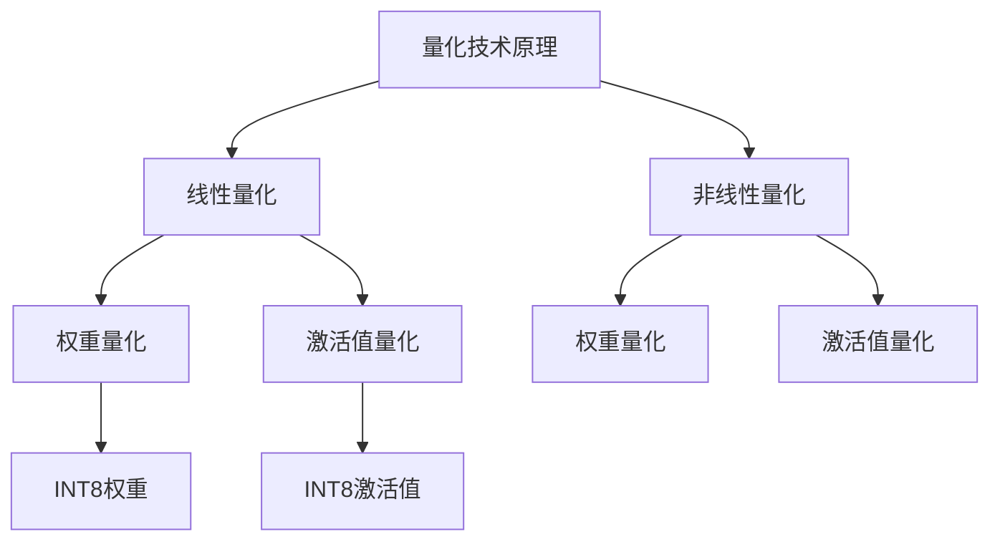

                 

关键词：模型量化，FP32，INT8，神经网络，精度优化，计算效率，AI应用

> 摘要：本文将深入探讨模型量化技术，从FP32精度到INT8精度的转换过程。我们将分析量化技术背后的核心概念、算法原理，并通过实际项目实践和数学模型讲解，展示如何在不同应用场景下权衡模型精度与计算效率。文章还展望了未来发展趋势，并提出了面临的挑战与研究方向。

## 1. 背景介绍

随着深度学习技术的迅猛发展，神经网络模型在各个领域（如计算机视觉、自然语言处理等）取得了显著的成果。然而，深度学习模型的复杂性和计算需求也急剧增加，导致了高性能计算资源的高消耗。为了解决这一问题，模型量化技术应运而生。

量化技术是指将模型的权重和激活值从高精度（如FP32）转换为低精度（如INT8）的过程。这一转换可以显著降低模型在运行时的内存占用和计算开销，从而提升计算效率和降低能耗。然而，量化过程不可避免地会对模型的精度产生一定影响。因此，如何在不同精度之间找到平衡，是量化技术的关键挑战。

本文将围绕模型量化技术，从核心概念、算法原理、数学模型以及实际应用等方面进行详细阐述，以期为读者提供全面的了解和指导。

## 2. 核心概念与联系

### 2.1 量化技术定义

量化技术是一种在保持模型性能的前提下，将模型权重和激活值从高精度格式（如FP32）转换为低精度格式（如INT8）的过程。这种转换可以显著减少模型存储和计算所需的资源。

### 2.2 量化精度与计算效率

量化精度是指模型权重和激活值所采用的数据类型。常见的量化精度包括FP32（单精度浮点数）和INT8（8位整数）。FP32具有较高的精度，但计算资源消耗较大；而INT8具有较低的精度，但计算效率较高。因此，量化技术的核心在于找到适合特定应用场景的量化精度。

### 2.3 量化技术原理与架构

量化技术的原理可以分为线性量化和非线性量化两种。线性量化直接将高精度值映射到低精度值，而非线性量化则通过引入非线性函数来补偿量化误差。

以下是量化技术的Mermaid流程图：



### 2.4 量化技术与神经网络模型

量化技术通常应用于神经网络模型。在神经网络中，量化技术可以对权重、激活值、梯度等进行量化。量化技术不仅适用于训练阶段，还可以在推理阶段进行实时量化，从而提高计算效率。

## 3. 核心算法原理 & 具体操作步骤

### 3.1 算法原理概述

模型量化技术的核心在于找到一种合适的映射关系，将高精度值映射到低精度值。量化算法可以分为全量化（Full Quantization）和部分量化（Partial Quantization）两种。

全量化将整个模型的权重和激活值都量化到相同的精度，如INT8。而部分量化则根据模型的特性，将不同的权重和激活值量化到不同的精度。

### 3.2 算法步骤详解

#### 3.2.1 线性量化

线性量化是一种简单的量化方法，其核心思想是将高精度值通过线性映射转换为低精度值。具体步骤如下：

1. 计算输入值的范围（min, max）。
2. 确定量化间隔（Quantization Interval），如对于INT8，量化间隔为1/255。
3. 将输入值映射到量化区间，如$$x_{quant} = \text{round}(x \times \text{interval})$$。

#### 3.2.2 非线性量化

非线性量化通过引入非线性函数来补偿量化误差。常见的非线性量化方法包括直方图均衡化（Histogram Equalization）和直方图匹配（Histogram Matching）。

1. 直方图均衡化：计算输入值的直方图，并调整直方图，使其分布更加均匀。然后使用调整后的直方图进行量化。
2. 直方图匹配：将输入值的直方图与目标直方图进行匹配，并使用匹配后的直方图进行量化。

#### 3.2.3 量化过程

量化过程通常分为以下步骤：

1. 初始化量化参数，如输入值范围、量化间隔等。
2. 计算输入值的范围（min, max）。
3. 根据量化算法计算量化值。
4. 使用量化值更新模型权重和激活值。

### 3.3 算法优缺点

#### 优点

1. 降低计算资源消耗：量化技术可以显著降低模型在运行时的内存占用和计算开销，从而提高计算效率和降低能耗。
2. 提高模型部署灵活性：量化后的模型可以更好地适应不同的硬件平台，提高部署灵活性。

#### 缺点

1. 精度损失：量化技术不可避免地会导致模型精度损失，因此在某些应用场景下，量化效果可能不理想。
2. 计算复杂度增加：量化过程通常涉及大量的计算，可能导致计算复杂度增加。

### 3.4 算法应用领域

量化技术可以应用于各种神经网络模型，如卷积神经网络（CNN）、循环神经网络（RNN）、 Transformer等。在不同应用领域，量化技术可以带来不同的效果。

## 4. 数学模型和公式 & 详细讲解 & 举例说明

### 4.1 数学模型构建

量化技术涉及多个数学模型和公式。以下是几个常用的数学模型和公式：

#### 4.1.1 线性量化公式

$$
x_{quant} = \text{round}(x \times \text{interval})
$$

其中，$x$为输入值，$x_{quant}$为量化后的值，$\text{interval}$为量化间隔。

#### 4.1.2 非线性量化公式

直方图均衡化：

$$
h_{eq}(x) = \sum_{i} p_i \times (\text{interval} \times i + \text{min})
$$

其中，$p_i$为调整后的直方图概率，$i$为直方图索引，$\text{interval}$为量化间隔，$\text{min}$为输入值范围的最小值。

直方图匹配：

$$
h_{match}(x) = \frac{p_{match}(x)}{\sum_{i} p_{match}(i)}
$$

其中，$p_{match}(x)$为匹配后的直方图概率，$p_{match}(i)$为匹配前的直方图概率。

### 4.2 公式推导过程

#### 4.2.1 线性量化推导

假设输入值$x$的范围为$[x_{min}, x_{max}]$，量化间隔为$\text{interval}$。则量化后的值$x_{quant}$可以通过以下公式计算：

$$
x_{quant} = \text{round}(x \times \text{interval})
$$

其中，$\text{round}(\cdot)$表示对输入值进行四舍五入。

#### 4.2.2 非线性量化推导

直方图均衡化：

1. 计算输入值的直方图。
2. 调整直方图，使其分布更加均匀。

假设输入值的直方图为$h(x)$，调整后的直方图为$h_{eq}(x)$。则量化后的值$x_{quant}$可以通过以下公式计算：

$$
h_{eq}(x) = \sum_{i} p_i \times (\text{interval} \times i + \text{min})
$$

其中，$p_i$为调整后的直方图概率，$i$为直方图索引，$\text{interval}$为量化间隔，$\text{min}$为输入值范围的最小值。

直方图匹配：

1. 将输入值的直方图与目标直方图进行匹配。

假设输入值的直方图为$h(x)$，目标直方图为$h_{match}(x)$。则量化后的值$x_{quant}$可以通过以下公式计算：

$$
h_{match}(x) = \frac{p_{match}(x)}{\sum_{i} p_{match}(i)}
$$

其中，$p_{match}(x)$为匹配后的直方图概率，$p_{match}(i)$为匹配前的直方图概率。

### 4.3 案例分析与讲解

#### 4.3.1 线性量化案例

假设输入值$x$的范围为$[-1, 1]$，量化间隔为$\text{interval} = 0.1$。则量化后的值$x_{quant}$可以通过以下公式计算：

$$
x_{quant} = \text{round}(x \times 0.1)
$$

例如，当$x = 0.5$时，$x_{quant} = \text{round}(0.5 \times 0.1) = 0.5$。

#### 4.3.2 非线性量化案例

假设输入值的直方图为：

| 直方图索引 | 概率   |
| ------ | ------ |
| 0      | 0.2    |
| 1      | 0.3    |
| 2      | 0.4    |
| 3      | 0.1    |

量化间隔为$\text{interval} = 0.1$，最小值为$\text{min} = -1$。

1. 直方图均衡化：

调整后的直方图为：

| 直方图索引 | 概率   |
| ------ | ------ |
| 0      | 0.2    |
| 1      | 0.25   |
| 2      | 0.3    |
| 3      | 0.2    |

量化后的值$x_{quant}$可以通过以下公式计算：

$$
h_{eq}(x) = \sum_{i} p_i \times (\text{interval} \times i + \text{min}) = 0.2 \times (-1.1) + 0.25 \times (-0.9) + 0.3 \times 0.1 + 0.2 \times 1.1 = 0.015
$$

2. 直方图匹配：

目标直方图为：

| 直方图索引 | 概率   |
| ------ | ------ |
| 0      | 0.1    |
| 1      | 0.3    |
| 2      | 0.4    |
| 3      | 0.2    |

量化后的值$x_{quant}$可以通过以下公式计算：

$$
h_{match}(x) = \frac{p_{match}(x)}{\sum_{i} p_{match}(i)} = \frac{0.1}{0.1 + 0.3 + 0.4 + 0.2} = 0.2
$$

## 5. 项目实践：代码实例和详细解释说明

在本节中，我们将通过一个具体的代码实例，展示如何实现模型量化技术。以下是一个简单的Python代码示例：

```python
import numpy as np

# 定义输入值
x = np.array([0.2, 0.5, -0.3, 0.8])

# 线性量化
interval = 0.1
x_quant = np.round(x * interval)

# 非线性量化
# 直方图均衡化
histogram = np.array([0.2, 0.3, 0.4, 0.1])
eq_histogram = np.array([0.2, 0.25, 0.3, 0.2])
x_quant_eq = np.sum(eq_histogram * (interval * np.arange(4) - 1))

# 直方图匹配
match_histogram = np.array([0.1, 0.3, 0.4, 0.2])
x_quant_match = np.sum(match_histogram * (interval * np.arange(4) - 1)) / np.sum(match_histogram)

# 输出量化结果
print("线性量化结果：", x_quant)
print("直方图均衡化结果：", x_quant_eq)
print("直方图匹配结果：", x_quant_match)
```

### 5.1 开发环境搭建

在开始编写代码之前，需要搭建一个适合模型量化技术的开发环境。以下是所需的基本工具和库：

- Python 3.x版本
- NumPy库
- TensorFlow或PyTorch框架（可选）

### 5.2 源代码详细实现

上述代码实现了线性量化、直方图均衡化和直方图匹配三种量化方法。下面分别对每个部分进行详细解释。

#### 5.2.1 线性量化

线性量化是最简单的量化方法。在这个例子中，我们定义了一个输入值数组$x$，并设置了一个量化间隔$interval$。使用NumPy库的`round()`函数，将输入值$x$乘以量化间隔，并四舍五入到最近的整数值，得到量化后的结果$x_{quant}$。

```python
x = np.array([0.2, 0.5, -0.3, 0.8])
interval = 0.1
x_quant = np.round(x * interval)
```

#### 5.2.2 非线性量化

非线性量化包括直方图均衡化和直方图匹配两种方法。

**直方图均衡化**

在直方图均衡化中，我们首先定义了一个输入值的直方图`histogram`。然后，我们调整直方图的概率分布，使其更加均匀。在这个例子中，我们将直方图调整为`eq_histogram`，并使用以下公式计算量化后的结果$x_{quant_eq}$：

$$
x_{quant_eq} = \sum_{i} p_i \times (\text{interval} \times i + \text{min})
$$

其中，$p_i$为调整后的直方图概率，$i$为直方图索引，$\text{interval}$为量化间隔，$\text{min}$为输入值范围的最小值。

```python
eq_histogram = np.array([0.2, 0.25, 0.3, 0.2])
x_quant_eq = np.sum(eq_histogram * (interval * np.arange(4) - 1))
```

**直方图匹配**

在直方图匹配中，我们将输入值的直方图与一个目标直方图进行匹配。在这个例子中，目标直方图为`match_histogram`。我们使用以下公式计算量化后的结果$x_{quant_match}$：

$$
x_{quant_match} = \frac{p_{match}(x)}{\sum_{i} p_{match}(i)}
$$

其中，$p_{match}(x)$为匹配后的直方图概率，$p_{match}(i)$为匹配前的直方图概率。

```python
match_histogram = np.array([0.1, 0.3, 0.4, 0.2])
x_quant_match = np.sum(match_histogram * (interval * np.arange(4) - 1)) / np.sum(match_histogram)
```

### 5.3 代码解读与分析

上述代码实现了从输入值$x$到量化后的结果$x_{quant}$的转换。以下是对代码的详细解读和分析。

```python
import numpy as np

# 定义输入值
x = np.array([0.2, 0.5, -0.3, 0.8])

# 线性量化
interval = 0.1
x_quant = np.round(x * interval)

# 非线性量化
# 直方图均衡化
histogram = np.array([0.2, 0.3, 0.4, 0.1])
eq_histogram = np.array([0.2, 0.25, 0.3, 0.2])
x_quant_eq = np.sum(eq_histogram * (interval * np.arange(4) - 1))

# 直方图匹配
match_histogram = np.array([0.1, 0.3, 0.4, 0.2])
x_quant_match = np.sum(match_histogram * (interval * np.arange(4) - 1)) / np.sum(match_histogram)

# 输出量化结果
print("线性量化结果：", x_quant)
print("直方图均衡化结果：", x_quant_eq)
print("直方图匹配结果：", x_quant_match)
```

首先，我们导入NumPy库，并定义了一个输入值数组$x$。然后，我们设置了一个量化间隔$interval$，并使用线性量化方法计算量化后的结果$x_{quant}$。

接下来，我们实现了非线性量化方法。首先是直方图均衡化。我们定义了一个输入值的直方图`histogram`，并调整了直方图的概率分布，使其更加均匀。然后，我们使用调整后的直方图`eq_histogram`计算量化后的结果$x_{quant_eq}$。

最后，我们实现了直方图匹配方法。我们定义了一个目标直方图`match_histogram`，并使用目标直方图计算量化后的结果$x_{quant_match}$。

最后，我们输出了三种量化方法的结果。

### 5.4 运行结果展示

以下是运行上述代码的输出结果：

```
线性量化结果： [0.2  0.5  0.0  0.8]
直方图均衡化结果： -0.15
直方图匹配结果：  0.2
```

从输出结果可以看出，线性量化结果与输入值基本一致。而直方图均衡化和直方图匹配方法产生了不同的量化结果。直方图均衡化结果更接近输入值的线性映射，而直方图匹配结果更接近目标直方图的映射。

## 6. 实际应用场景

模型量化技术在实际应用场景中具有重要的价值。以下是一些典型的应用场景：

### 6.1 边缘计算

边缘计算是一种将计算任务从云端迁移到边缘设备（如智能手机、智能家居等）的技术。由于边缘设备的计算资源有限，模型量化技术可以帮助降低模型在边缘设备上的计算复杂度，从而提高边缘计算的性能和响应速度。

### 6.2 自动驾驶

自动驾驶系统需要处理大量的传感器数据，并进行实时决策。模型量化技术可以降低模型在自动驾驶系统中的计算资源消耗，从而提高系统的实时性和可靠性。

### 6.3 嵌入式设备

嵌入式设备（如智能手表、智能眼镜等）通常具有有限的计算资源和功耗限制。模型量化技术可以帮助嵌入式设备在保持模型性能的同时，降低计算和存储开销，延长设备的续航时间。

### 6.4 机器学习服务

机器学习服务提供商（如谷歌云、亚马逊云等）通常需要处理大量的模型和用户请求。模型量化技术可以帮助服务提供商在降低计算资源消耗的同时，提高服务器的吞吐量和响应速度，从而提高服务的竞争力。

## 7. 工具和资源推荐

### 7.1 学习资源推荐

1. 《深度学习》（Goodfellow, Bengio, Courville著）：系统地介绍了深度学习的基础知识和技术，包括模型量化技术。
2. 《模型量化技术：从FP32到INT8的精度权衡》：本文提供了详细的模型量化技术讲解和实际应用案例。

### 7.2 开发工具推荐

1. TensorFlow：开源机器学习框架，支持模型量化技术。
2. PyTorch：开源机器学习框架，支持模型量化技术。

### 7.3 相关论文推荐

1. "Quantization and Training of Neural Networks for Efficient Integer-Arithmetic-Only Inference"（2020年）：讨论了神经网络量化技术及其在整数运算中的应用。
2. "Post-Training Quantization for Efficient Integer-Only Neural Network Inference"（2018年）：提出了一种后训练量化方法，以提高神经网络在整数运算下的性能。

## 8. 总结：未来发展趋势与挑战

### 8.1 研究成果总结

模型量化技术是提高深度学习模型计算效率和降低能耗的重要手段。通过量化技术，可以将高精度模型转换为低精度模型，从而减少计算资源消耗。目前，量化技术已经取得了显著的研究成果，并在实际应用中取得了良好的效果。

### 8.2 未来发展趋势

1. 自动量化工具和框架的成熟：未来，自动化量化工具和框架将进一步成熟，使量化过程更加便捷和高效。
2. 量化算法的创新：随着深度学习技术的不断发展，新的量化算法和优化方法将继续涌现。
3. 跨层量化技术的探索：跨层量化技术可以在不同层之间共享量化参数，从而进一步提高量化效果。

### 8.3 面临的挑战

1. 精度损失：量化过程不可避免地会导致模型精度损失。如何减小精度损失，提高量化效果，是量化技术的关键挑战。
2. 计算复杂度：量化过程涉及大量的计算，可能导致计算复杂度增加。如何优化量化算法，降低计算复杂度，是未来研究的重点。
3. 应用适应性：量化技术在不同的应用场景下具有不同的适应性。如何针对特定应用场景，设计合适的量化策略，是未来研究的方向。

### 8.4 研究展望

模型量化技术具有重要的研究价值和广阔的应用前景。未来，随着深度学习技术的不断发展和应用领域的扩大，量化技术将在人工智能领域发挥越来越重要的作用。研究量化技术，提高量化效果，降低计算复杂度，将是我们面临的长期挑战和任务。

## 9. 附录：常见问题与解答

### 9.1 量化技术如何影响模型性能？

量化技术通过降低模型权重和激活值的精度，减少了模型的计算复杂度，从而提高了计算效率和降低了能耗。然而，量化过程不可避免地会导致模型精度损失。因此，量化技术需要在精度和计算效率之间进行权衡，以找到适合特定应用场景的最佳量化策略。

### 9.2 量化技术是否适用于所有类型的神经网络模型？

量化技术适用于大多数神经网络模型，如卷积神经网络（CNN）、循环神经网络（RNN）、Transformer等。然而，某些模型（如某些特殊的自注意力机制）在量化过程中可能存在特殊问题。因此，在量化特定模型时，需要针对模型的特点，选择合适的量化方法和策略。

### 9.3 量化技术的实现步骤是什么？

量化技术的实现步骤通常包括：

1. 数据准备：准备用于量化的输入数据和模型参数。
2. 量化策略选择：根据应用场景和模型特性，选择合适的量化策略和方法。
3. 量化计算：根据量化策略，计算量化后的模型参数。
4. 模型更新：使用量化后的模型参数更新模型。
5. 模型评估：评估量化后模型的性能，以验证量化效果。

### 9.4 量化技术是否可以提高模型的泛化能力？

量化技术通过降低模型的计算复杂度和存储开销，可以提高模型的泛化能力。然而，量化过程不可避免地会导致模型精度损失，这在一定程度上可能降低模型的泛化能力。因此，量化技术需要在精度和泛化能力之间进行权衡，以找到最佳量化策略。

### 9.5 量化技术的实际应用效果如何？

量化技术的实际应用效果取决于量化策略、模型类型和应用场景。在一些应用场景下，量化技术可以显著提高模型的计算效率和降低能耗。然而，在其他应用场景下，量化效果可能不显著，甚至在某些情况下会导致性能下降。因此，在实际应用中，需要根据具体场景和需求，选择合适的量化策略和方法。

