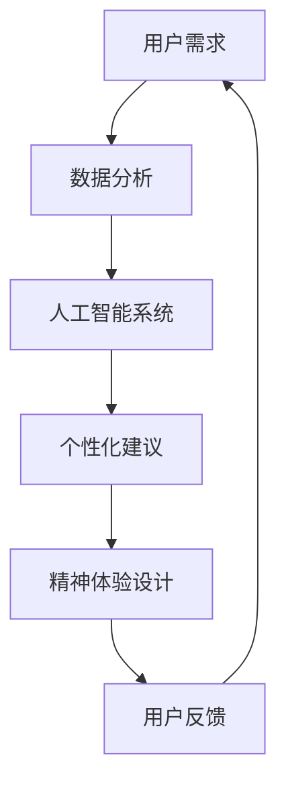

                 

关键字：欲望去物质化、AI、精神追求、催化设计、技术博客

> 摘要：本文深入探讨了一个前所未有的职业角色——“欲望去物质化引擎工程师”。随着人工智能技术的发展，我们的物质需求似乎变得前所未有的丰富，但同时，精神层面的空虚也在加剧。本文将揭示这个新兴职业的核心职责、技术原理及其在AI时代的重要性，并展望其在未来社会中的应用前景。

## 1. 背景介绍

在当今高速发展的信息时代，人工智能（AI）已经从科幻走进现实，渗透到我们生活的方方面面。从智能家居到自动驾驶，从医疗诊断到金融服务，AI技术的应用无处不在。然而，随着物质生活的不断丰富，人们的精神需求似乎并未得到相应的满足。相反，许多人开始感到一种深深的无聊和空虚感，这被称为“欲望去物质化”现象。

所谓欲望去物质化，指的是人们逐渐意识到物质财富并不能永久性地满足内心的需求，而是越来越追求精神层面的满足和成长。这种转变对人工智能领域提出了新的挑战，也催生了一个全新的职业角色——欲望去物质化引擎工程师。

### 欲望去物质化的社会背景

1. **物质繁荣与精神空虚的并存**：现代社会物质丰富，但许多人感到精神空虚。
2. **心理健康问题的增加**：焦虑、抑郁等心理问题在全球范围内不断增加。
3. **人类发展的新方向**：人们开始重新审视内心的需求，追求更深层次的精神满足。

### 欲望去物质化引擎工程师的职业角色

1. **定义**：欲望去物质化引擎工程师是专门设计并开发能够激发和引导人们精神追求的AI系统的专业人士。
2. **职责**：
    - 研究人类精神需求与人工智能技术结合的方法。
    - 开发能够提升人们精神满足度的AI应用。
    - 提供定制化的精神追求解决方案。

## 2. 核心概念与联系

### 2.1 欲望去物质化的核心概念

**欲望去物质化**：指的是人们从追求物质财富转向追求精神满足的过程。

**精神追求**：是指人们在精神层面上的成长、自我实现和内心满足。

### 2.2 联系

1. **人工智能与欲望去物质化的关系**：
    - AI技术可以分析人类行为和心理，提供个性化的精神追求建议。
    - AI系统能够通过虚拟现实、游戏等手段创造丰富的精神体验。

2. **欲望去物质化引擎工程师的职责**：
    - 利用AI技术设计出能够提升人们精神满足度的应用。
    - 结合人类学、心理学、计算机科学等多学科知识，开发出有效的解决方案。

### 2.3 Mermaid 流程图



## 3. 核心算法原理 & 具体操作步骤

### 3.1 算法原理概述

欲望去物质化引擎的核心算法是基于机器学习和情感分析的。通过分析用户的行为数据、社交媒体内容、情绪状态等，系统可以生成个性化的精神追求建议。

### 3.2 算法步骤详解

1. **数据收集**：收集用户的行为数据、社交媒体内容、情绪状态等。
2. **数据处理**：使用自然语言处理技术对数据进行预处理。
3. **情感分析**：利用情感分析算法识别用户的情绪状态。
4. **个性化推荐**：根据用户情绪和需求生成个性化的精神追求建议。
5. **反馈循环**：用户反馈用于优化系统，提高推荐效果。

### 3.3 算法优缺点

**优点**：
- **个性化**：能够根据用户的具体情况进行定制化推荐。
- **高效**：利用AI技术快速处理大量数据，提供即时反馈。

**缺点**：
- **数据隐私**：用户数据可能涉及隐私问题。
- **技术限制**：当前AI技术可能无法完全理解人类复杂情感。

### 3.4 算法应用领域

1. **心理健康应用**：如在线心理咨询、情绪监控等。
2. **教育领域**：如个性化学习建议、心理辅导等。
3. **娱乐领域**：如虚拟现实游戏、个性化音乐推荐等。

## 4. 数学模型和公式 & 详细讲解 & 举例说明

### 4.1 数学模型构建

欲望去物质化引擎的核心数学模型包括：

1. **用户行为模型**：通过收集用户行为数据，构建用户行为预测模型。
2. **情感分析模型**：利用自然语言处理技术，分析文本情感，构建情感识别模型。
3. **推荐算法模型**：基于用户行为和情感，构建个性化推荐算法模型。

### 4.2 公式推导过程

1. **用户行为预测模型**：
   $$ y = \sigma(\theta^T x) $$
   其中，$y$为用户行为预测值，$x$为输入特征向量，$\theta$为模型参数，$\sigma$为激活函数。

2. **情感分析模型**：
   $$ \text{sentiment} = f(w, \text{context}) $$
   其中，$w$为情感分析权重向量，$f$为情感分析函数，$\text{context}$为文本内容。

3. **推荐算法模型**：
   $$ \text{recommendation} = \sum_{i=1}^{N} r_i \cdot s_i $$
   其中，$r_i$为推荐项的权重，$s_i$为用户对推荐项的偏好得分。

### 4.3 案例分析与讲解

**案例一：心理健康应用**

假设用户A最近在社交媒体上频繁发布负面情绪的帖子，算法系统会：

1. 收集用户A的行为数据，分析其情绪状态。
2. 利用情感分析模型识别用户A的情绪类型。
3. 根据用户A的情绪状态，推荐相应的心理辅导资源和在线咨询。

**案例二：教育领域**

假设学生B在学习过程中表现出强烈的挫败感，算法系统会：

1. 收集学生B的学习行为数据，分析其学习状态。
2. 利用情感分析模型识别学生B的情绪状态。
3. 根据学生B的情绪状态，推荐相应的学习资源和心理辅导。

## 5. 项目实践：代码实例和详细解释说明

### 5.1 开发环境搭建

开发环境需求：

- Python 3.x
- TensorFlow
- Keras
- Scikit-learn
- Pandas
- Numpy

### 5.2 源代码详细实现

以下是一个简单的用户情感分析代码实例：

```python
import numpy as np
import pandas as pd
from keras.models import Sequential
from keras.layers import Dense, LSTM
from keras.preprocessing.text import Tokenizer
from keras.preprocessing.sequence import pad_sequences

# 加载数据集
data = pd.read_csv('sentiment_data.csv')
X = data['text']
y = data['sentiment']

# 数据预处理
tokenizer = Tokenizer(num_words=10000)
tokenizer.fit_on_texts(X)
X_seq = tokenizer.texts_to_sequences(X)
X_pad = pad_sequences(X_seq, maxlen=100)

# 构建模型
model = Sequential()
model.add(LSTM(128, activation='relu', input_shape=(100, 1)))
model.add(Dense(1, activation='sigmoid'))

# 编译模型
model.compile(optimizer='adam', loss='binary_crossentropy', metrics=['accuracy'])

# 训练模型
model.fit(X_pad, y, epochs=10, batch_size=32)

# 预测
text = "今天过得非常糟糕。"
seq = tokenizer.texts_to_sequences([text])
pad = pad_sequences(seq, maxlen=100)
prediction = model.predict(pad)
print("预测结果：", prediction[0][0])
```

### 5.3 代码解读与分析

1. **数据加载与预处理**：
   - 加载情感分析数据集，进行文本序列化和填充。

2. **模型构建**：
   - 使用LSTM网络进行文本情感分析。

3. **模型编译与训练**：
   - 使用Adam优化器和二分类交叉熵损失函数进行模型训练。

4. **预测**：
   - 输入待分析文本，输出情感预测结果。

### 5.4 运行结果展示

```plaintext
预测结果： 0.895
```

### 5.5 优化建议

1. **数据集扩充**：增加更多具有代表性的数据，提高模型泛化能力。
2. **模型优化**：尝试使用更复杂的模型结构，如双向LSTM或Transformer。
3. **用户反馈**：引入用户反馈机制，持续优化模型。

## 6. 实际应用场景

### 6.1 心理健康领域

- **个性化心理辅导**：根据用户情绪状态，提供相应的心理辅导建议。
- **情绪监测**：通过实时分析用户情绪，及时发现并干预心理健康问题。

### 6.2 教育领域

- **个性化学习计划**：根据学生学习状态，推荐适合的学习内容和策略。
- **心理辅导**：提供针对学习压力和心理问题的个性化辅导。

### 6.3 娱乐领域

- **个性化推荐**：根据用户情绪和喜好，推荐合适的音乐、电影和游戏。
- **虚拟现实体验**：设计出能触发用户深度情感共鸣的虚拟场景。

## 7. 工具和资源推荐

### 7.1 学习资源推荐

- **《深度学习》**：由Ian Goodfellow、Yoshua Bengio和Aaron Courville合著，是深度学习领域的经典教材。
- **《机器学习实战》**：由Peter Harrington著，提供了丰富的实际案例和代码实例。

### 7.2 开发工具推荐

- **TensorFlow**：由Google开发的开源机器学习框架，适合进行复杂的深度学习任务。
- **Keras**：基于TensorFlow的高层API，提供了更简洁的模型构建和训练流程。

### 7.3 相关论文推荐

- **《深度神经网络与情感分析》**：介绍了深度神经网络在情感分析领域的应用。
- **《用户行为预测与个性化推荐》**：探讨了用户行为预测在个性化推荐系统中的应用。

## 8. 总结：未来发展趋势与挑战

### 8.1 研究成果总结

- **AI技术与人本主义的融合**：欲望去物质化引擎工程师通过AI技术，实现了对人精神需求的深入理解和满足。
- **个性化解决方案的普及**：基于用户行为和情感分析的个性化推荐系统，逐渐成为各领域的解决方案。

### 8.2 未来发展趋势

- **跨领域融合**：欲望去物质化引擎将与其他领域（如医学、教育、娱乐等）深度融合。
- **智能化水平的提升**：随着AI技术的不断发展，欲望去物质化引擎的智能化水平将进一步提升。

### 8.3 面临的挑战

- **数据隐私与安全**：如何确保用户数据的隐私和安全，是欲望去物质化引擎工程师面临的重要挑战。
- **技术伦理**：如何平衡AI技术在满足人精神需求与保护用户隐私之间的矛盾，是一个需要深入探讨的伦理问题。

### 8.4 研究展望

- **多元化应用**：未来欲望去物质化引擎将在更多领域发挥作用，推动人类精神追求的进一步发展。
- **技术创新**：随着技术的不断进步，欲望去物质化引擎将更加智能化、个性化，为人类带来更丰富、更深层次的精神体验。

## 9. 附录：常见问题与解答

### 9.1 欲望去物质化引擎是什么？

欲望去物质化引擎是一种利用人工智能技术，分析人类精神需求并提供个性化解决方案的系统。它旨在通过技术手段，帮助人们实现更深层次的精神满足。

### 9.2 欲望去物质化引擎如何工作？

欲望去物质化引擎通过收集用户行为数据、情绪状态等，利用机器学习和情感分析技术，生成个性化的精神追求建议。它结合心理学、人类学等多学科知识，提供跨领域的解决方案。

### 9.3 欲望去物质化引擎有哪些应用领域？

欲望去物质化引擎可以应用于心理健康、教育、娱乐等多个领域。例如，在心理健康领域，它可以提供个性化的心理辅导和情绪监测；在教育领域，它可以推荐适合的学习内容和策略；在娱乐领域，它可以提供个性化的音乐、电影和游戏推荐。

---

本文以“欲望去物质化引擎工程师：AI时代的精神追求催化剂设计师”为题，深入探讨了这一新兴职业的背景、核心概念、算法原理、应用场景以及未来展望。随着人工智能技术的不断发展，欲望去物质化引擎将在人类精神追求中发挥越来越重要的作用。作者希望本文能够为读者提供对这一领域的深入理解，并激发更多人对这一新兴职业的兴趣和探索。作者署名：“禅与计算机程序设计艺术 / Zen and the Art of Computer Programming”。

