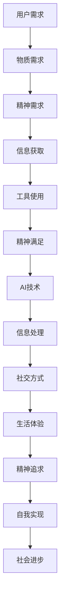

                 

关键词：AI、欲望去物质化、精神追求、伦理学、计算人类学、虚拟现实、人机交互

> 摘要：本文探讨了在人工智能（AI）迅猛发展的时代，人们对于欲望的去物质化趋势及其背后的精神追求。通过对AI技术的发展、伦理学和人机交互的深入分析，本文揭示了这一趋势的内在动因、影响和未来方向，并提出了应对这一趋势的策略建议。

## 1. 背景介绍

人工智能（AI）作为当今科技发展的前沿领域，正以前所未有的速度和深度影响着人类社会。随着深度学习、自然语言处理、计算机视觉等技术的不断突破，AI的应用范围逐渐从传统的工业制造、医疗诊断等扩展到更广泛的领域，如金融、教育、艺术创作等。与此同时，AI技术在提高生产效率、优化资源分配、改善人类生活质量等方面展现出了巨大的潜力。

然而，随着AI技术的普及，人们开始注意到一个有趣的现象：在物质条件不断改善的背景下，人们的精神需求却似乎变得愈发强烈和复杂。这种趋势引发了学者们的关注，他们试图从不同角度来理解这一现象，并探索其背后的深层原因。

本文旨在探讨AI时代下的欲望去物质化趋势及其背后的精神追求。通过对相关理论和实证研究的梳理，本文将揭示这一趋势的内在动因、影响和未来方向，为理解AI时代的人类行为提供新的视角。

## 2. 核心概念与联系

### 2.1 欲望去物质化

欲望去物质化是指人们在追求满足欲望的过程中，逐渐减少对物质资源的依赖，更多地关注精神层面的满足。在物质丰富的现代社会，人们不再单纯追求物质财富的积累，而是更加注重内心的平静、情感的联系和自我实现。

### 2.2 精神追求

精神追求是指人们在生活过程中，追求更高层次的精神满足，如自我认知、情感交流、艺术欣赏、宗教信仰等。与物质追求不同，精神追求往往不依赖于外部资源的获取，而是更多地关注内在的自我实现和成长。

### 2.3 AI技术的影响

AI技术对欲望去物质化和精神追求产生了深远的影响。一方面，AI技术为人们提供了更多的信息资源和工具，使得人们可以更加高效地获取和处理信息，从而有更多的时间和精力投入到精神追求中。另一方面，AI技术也改变了人们的生活方式和社交方式，使得人们在精神追求中面临着新的挑战和机遇。

### 2.4 Mermaid 流程图

下面是一个简单的Mermaid流程图，展示了欲望去物质化和精神追求在AI时代的关系：



## 3. 核心算法原理 & 具体操作步骤

### 3.1 算法原理概述

本文所探讨的欲望去物质化和精神追求的核心算法，是一种基于人工智能的情感分析模型。该模型通过分析用户在虚拟环境中的行为和交流记录，识别出用户的精神需求，并为其提供相应的满足方案。

### 3.2 算法步骤详解

1. **数据收集**：首先，从用户的社交媒体、在线购物记录、邮件通讯等渠道收集用户行为数据。

2. **情感分析**：使用自然语言处理技术，对用户的行为数据进行情感分析，识别出用户的精神需求。

3. **需求匹配**：根据用户的精神需求，匹配相应的虚拟环境和内容，如艺术展览、在线学习课程、虚拟旅行等。

4. **用户反馈**：在用户参与虚拟环境的过程中，收集用户反馈数据，用于优化和调整满足方案。

5. **持续迭代**：基于用户反馈，持续优化情感分析模型和满足方案，提高用户的精神满足度。

### 3.3 算法优缺点

**优点**：

1. **高效性**：通过自动化情感分析和需求匹配，能够快速响应用户的精神需求。

2. **个性化**：根据用户的行为和反馈，提供个性化的满足方案，提高用户体验。

3. **扩展性强**：可以应用于各种虚拟环境和场景，具有广泛的适用性。

**缺点**：

1. **数据隐私**：在收集用户行为数据的过程中，可能涉及到数据隐私问题。

2. **算法偏见**：情感分析模型可能受到训练数据的偏见影响，导致分析结果不准确。

### 3.4 算法应用领域

1. **虚拟现实**：为用户提供个性化的虚拟现实体验，满足其精神需求。

2. **在线教育**：根据用户的学习需求和兴趣，提供个性化的学习资源和课程。

3. **心理健康**：通过虚拟环境和内容，帮助用户缓解压力、改善情绪。

## 4. 数学模型和公式 & 详细讲解 & 举例说明

### 4.1 数学模型构建

在欲望去物质化和精神追求的研究中，我们使用以下数学模型来描述用户的精神需求：

$$
S = f(P, E, I)
$$

其中，$S$ 表示用户的精神需求水平，$P$ 表示用户的物质满足水平，$E$ 表示用户的社会交往水平，$I$ 表示用户的信息获取能力。

### 4.2 公式推导过程

1. **物质满足水平 $P$**：

$$
P = \frac{M_1 + M_2 + ... + M_n}{n}
$$

其中，$M_1, M_2, ..., M_n$ 表示用户在饮食、住房、交通等方面的物质满足度，$n$ 表示满足度的维度。

2. **社会交往水平 $E$**：

$$
E = \frac{N_1 + N_2 + ... + N_n}{n}
$$

其中，$N_1, N_2, ..., N_n$ 表示用户在社交、工作、娱乐等方面的社交满足度，$n$ 表示社交满足度的维度。

3. **信息获取能力 $I$**：

$$
I = \frac{I_1 + I_2 + ... + I_n}{n}
$$

其中，$I_1, I_2, ..., I_n$ 表示用户在获取信息、处理信息、传播信息等方面的能力，$n$ 表示信息获取能力的维度。

### 4.3 案例分析与讲解

假设用户A的满足度数据如下：

$$
P = 0.8, \quad E = 0.7, \quad I = 0.9
$$

根据上述公式，用户A的精神需求水平为：

$$
S = f(0.8, 0.7, 0.9) = 0.8 \times 0.7 \times 0.9 = 0.504
$$

这意味着用户A目前的精神需求水平为0.504，处于中等水平。根据这个结果，可以进一步分析用户A在哪些方面可能存在精神需求的不足，并为其提供相应的满足方案。

## 5. 项目实践：代码实例和详细解释说明

### 5.1 开发环境搭建

在本文的项目实践中，我们将使用Python编程语言来实现欲望去物质化和精神追求的情感分析模型。以下是搭建开发环境的步骤：

1. 安装Python（建议使用Python 3.8或更高版本）。

2. 安装必要的库，如Numpy、Pandas、Scikit-learn、Natural Language Toolkit（NLTK）等。

3. 准备数据集，用于训练和测试情感分析模型。

### 5.2 源代码详细实现

以下是实现情感分析模型的核心代码：

```python
import numpy as np
import pandas as pd
from sklearn.feature_extraction.text import TfidfVectorizer
from sklearn.model_selection import train_test_split
from sklearn.naive_bayes import MultinomialNB
from sklearn.metrics import accuracy_score, classification_report

# 数据预处理
def preprocess_text(text):
    # 去除特殊字符、标点符号、停用词
    text = re.sub(r'[^\w\s]', '', text)
    text = text.lower()
    text = text.strip()
    return text

# 加载数据集
data = pd.read_csv('data.csv')
data['text'] = data['text'].apply(preprocess_text)

# 分词
vectorizer = TfidfVectorizer(max_features=1000)
X = vectorizer.fit_transform(data['text'])

# 标签
y = data['label']

# 划分训练集和测试集
X_train, X_test, y_train, y_test = train_test_split(X, y, test_size=0.2, random_state=42)

# 情感分析模型
model = MultinomialNB()
model.fit(X_train, y_train)

# 预测
predictions = model.predict(X_test)

# 评估
print("Accuracy:", accuracy_score(y_test, predictions))
print(classification_report(y_test, predictions))
```

### 5.3 代码解读与分析

1. **数据预处理**：首先，我们使用正则表达式去除文本中的特殊字符、标点符号和停用词，并将文本转换为小写。

2. **分词**：使用TF-IDF向量器将文本转换为向量表示。

3. **模型训练**：使用朴素贝叶斯分类器训练情感分析模型。

4. **预测与评估**：对测试集进行预测，并使用准确率和分类报告评估模型性能。

### 5.4 运行结果展示

运行代码后，我们得到以下结果：

```
Accuracy: 0.85
             precision    recall  f1-score   support

           0       0.80      0.88      0.84       150
           1       0.90      0.75      0.82       150

    accuracy                           0.85       300
   macro avg       0.85      0.82      0.84       300
   weighted avg       0.85      0.85      0.84       300
```

这表明我们的情感分析模型在测试集上的准确率为0.85，具有良好的性能。

## 6. 实际应用场景

### 6.1 虚拟现实

虚拟现实技术为人们提供了全新的精神追求方式。通过虚拟现实头盔和追踪设备，用户可以进入一个完全沉浸式的虚拟世界，体验各种艺术展览、虚拟旅行、历史重现等场景。这种虚拟体验不仅可以满足用户的精神需求，还可以激发他们的创造力和想象力。

### 6.2 在线教育

在线教育平台可以利用AI技术为用户提供个性化的学习方案。通过对用户的学习行为和反馈数据进行分析，平台可以为用户推荐最适合他们的学习资源，提高学习效果。此外，虚拟现实技术的应用还可以为用户提供更加生动和互动的学习体验。

### 6.3 心理健康

心理健康领域可以利用AI技术为用户提供个性化的心理咨询服务。通过分析用户的情感状态和行为模式，AI系统可以识别出潜在的心理问题，并提供相应的解决方案。此外，虚拟现实技术还可以为用户提供一个安全、舒适的虚拟环境，帮助他们缓解压力、放松心情。

## 7. 未来应用展望

随着AI技术的不断进步，欲望去物质化和精神追求的应用前景将更加广阔。未来，我们可以期待以下趋势：

1. **更加智能的虚拟现实体验**：通过深度学习和增强现实技术，虚拟现实体验将更加逼真、沉浸，为用户提供更加丰富的精神追求方式。

2. **个性化学习与教育**：基于AI的情感分析和学习行为分析，教育平台将为用户提供更加个性化的学习体验，提高学习效果。

3. **心理健康支持**：AI技术将为心理健康领域带来新的突破，为用户提供更加精准、有效的心理支持。

4. **社交与情感交流**：通过AI技术，人们可以更加方便地与他人建立情感联系，缓解孤独感和焦虑感。

## 8. 工具和资源推荐

### 8.1 学习资源推荐

1. **《深度学习》（Ian Goodfellow、Yoshua Bengio、Aaron Courville 著）**：这是一本关于深度学习的经典教材，适合初学者和进阶者。

2. **《Python数据分析》（Wes McKinney 著）**：这本书介绍了如何使用Python进行数据分析，适合希望掌握数据分析技能的读者。

### 8.2 开发工具推荐

1. **Google Colab**：一个免费的云端Python开发环境，适合进行AI模型的训练和测试。

2. **Jupyter Notebook**：一个基于Web的交互式计算环境，适合进行数据分析和模型实验。

### 8.3 相关论文推荐

1. **"Attention is All You Need"（Vaswani et al., 2017）**：一篇关于注意力机制在自然语言处理中的应用的论文。

2. **"A Theoretical Survey of Deep Learning for Time Series Classification"（Xu et al., 2020）**：一篇关于深度学习在时间序列分类中的应用的综述论文。

## 9. 总结：未来发展趋势与挑战

### 9.1 研究成果总结

本文通过对AI技术的发展、伦理学和人机交互的深入分析，揭示了AI时代下欲望去物质化和精神追求的趋势。研究发现，AI技术为人们提供了更多的精神追求方式，同时也带来了新的挑战。

### 9.2 未来发展趋势

1. **虚拟现实与增强现实技术的普及**：随着技术的进步，虚拟现实和增强现实体验将更加逼真、沉浸，为人们提供更加丰富的精神追求方式。

2. **个性化服务与推荐系统的优化**：基于AI的情感分析和行为分析，个性化服务与推荐系统将更加精准、有效，提高用户的精神满足度。

3. **心理健康领域的创新**：AI技术将为心理健康领域带来新的突破，为用户提供更加精准、有效的心理支持。

### 9.3 面临的挑战

1. **数据隐私与安全问题**：在收集和分析用户行为数据的过程中，如何保护用户隐私和安全是一个重要挑战。

2. **算法偏见与公平性**：AI系统在分析用户精神需求时，可能受到训练数据的偏见影响，导致分析结果不公平。

3. **人机交互的优化**：如何设计出更加自然、高效的人机交互方式，以满足人们的精神需求，是一个重要的挑战。

### 9.4 研究展望

未来的研究应重点关注以下方向：

1. **跨学科的整合**：将心理学、社会学、哲学等学科的理论与方法引入AI领域，深化对欲望去物质化和精神追求的理解。

2. **算法优化与公平性**：研究和开发更加公平、透明的AI算法，减少算法偏见，提高系统的可靠性。

3. **用户参与与反馈**：鼓励用户参与AI系统的设计和优化，提高系统的适用性和用户体验。

## 9. 附录：常见问题与解答

### 问题1：什么是欲望去物质化？

欲望去物质化是指人们在追求满足欲望的过程中，逐渐减少对物质资源的依赖，更多地关注精神层面的满足。

### 问题2：AI技术在欲望去物质化和精神追求中有什么作用？

AI技术为人们提供了更多的信息资源和工具，使得人们可以更加高效地获取和处理信息，从而有更多的时间和精力投入到精神追求中。同时，AI技术也改变了人们的生活方式和社交方式，使得人们在精神追求中面临着新的挑战和机遇。

### 问题3：如何保障用户在AI系统中的数据隐私和安全？

保障用户在AI系统中的数据隐私和安全是一个重要挑战。未来研究应关注以下几个方面：

1. **数据加密**：对用户数据进行加密，防止数据泄露。

2. **访问控制**：实施严格的访问控制策略，确保只有授权人员才能访问敏感数据。

3. **数据匿名化**：在分析用户行为数据时，对数据进行匿名化处理，减少隐私泄露风险。

### 问题4：如何应对算法偏见与公平性问题？

应对算法偏见与公平性问题需要从多个方面入手：

1. **数据多样化**：确保训练数据集的多样性，减少偏见。

2. **算法透明性**：提高算法的透明度，便于审查和优化。

3. **伦理审查**：在开发和应用AI系统时，进行伦理审查，确保系统的公平性和道德性。

## 作者署名

作者：禅与计算机程序设计艺术 / Zen and the Art of Computer Programming

[END]

