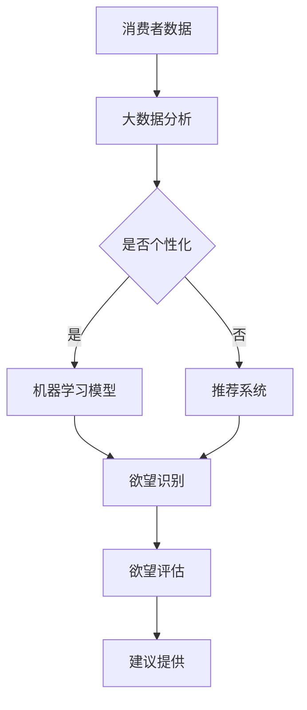

                 

关键词：AI时代、消费伦理、欲望可持续性、评估员、编撰者

摘要：本文探讨了AI时代背景下消费伦理的重要性，提出了欲望可持续性评估员这一新角色。通过分析AI技术对消费行为的影响，本文阐述了评估员在推动可持续消费、维护社会公平和实现个体自我提升方面的作用。文章旨在为AI时代的消费伦理提供指导，以促进人工智能与人类价值观的和谐共存。

## 1. 背景介绍

随着人工智能（AI）技术的迅速发展，人类社会正经历着前所未有的变革。从智能家居、自动驾驶到医疗诊断、金融分析，AI已深入到各个领域，深刻影响着我们的生活方式。然而，AI技术的广泛应用也带来了诸多伦理问题，尤其是在消费领域。消费行为不再只是满足基本需求，而是逐渐被个性化、多样化、即时性的欲望所驱动。

在这个背景下，传统的消费伦理观念面临着挑战。传统的消费伦理强调合理消费、适度消费，反对过度消费和浪费。然而，AI技术通过对用户数据的深度挖掘和个性化推荐，使得消费者更容易陷入欲望的陷阱，难以自拔。因此，如何平衡AI技术的便利性与消费伦理的可持续性，成为了一个亟待解决的问题。

为了应对这一挑战，本文提出了“欲望可持续性评估员”这一新角色。评估员将通过AI技术对消费者的欲望进行评估，帮助消费者识别并调整不合理的消费欲望，实现消费行为的可持续性。

### 1.1 AI时代背景下的消费行为

AI时代，消费者的需求被精准捕捉和满足。通过大数据分析和机器学习算法，AI能够了解消费者的喜好、习惯和潜在需求，从而提供个性化的推荐和服务。这种个性化推荐不仅提升了消费者的满意度，也刺激了更多的消费行为。

然而，这种个性化的消费行为也带来了一些负面效应。首先，消费者容易陷入“信息茧房”，即只接受与自己观点相似的推荐，导致认知偏见和思想僵化。其次，个性化推荐容易导致消费者对特定品牌或产品的依赖性增加，从而限制了消费选择和多样性。此外，过度消费和浪费现象也在个性化推荐的影响下加剧。

### 1.2 传统消费伦理观念的挑战

传统的消费伦理观念强调合理消费、适度消费，追求消费与资源利用的平衡。然而，在AI时代，这一观念面临着严峻的挑战。首先，AI技术使得消费行为变得更加频繁和复杂，传统的消费伦理难以应对这种变化。其次，个性化推荐和精准营销使得消费者更容易陷入欲望的陷阱，难以自拔。

例如，许多消费者在购物时会被各种优惠和促销活动所吸引，从而进行冲动消费。这些冲动消费行为不仅浪费了资源，也增加了消费者的经济负担。此外，一些消费者还会因为过度追求时尚和品牌而陷入负债危机。

### 1.3 欲望可持续性评估员的角色

为了应对AI时代消费伦理的挑战，本文提出了欲望可持续性评估员这一角色。评估员通过AI技术对消费者的欲望进行评估，帮助消费者识别并调整不合理的消费欲望，实现消费行为的可持续性。

首先，评估员可以通过分析消费者的消费行为数据，识别出消费者的不合理消费欲望。例如，过度购买奢侈品、频繁参与冲动消费等行为都可能被视为不合理的消费欲望。

其次，评估员可以帮助消费者制定合理的消费计划，避免因欲望失控而导致的经济负担和资源浪费。例如，通过设定消费预算、推荐性价比高的产品等手段，帮助消费者实现理性消费。

最后，评估员还可以通过提供消费教育和心理辅导，帮助消费者树立正确的消费观念，培养健康的消费习惯。这有助于提高消费者的消费素养，促进社会的可持续发展。

## 2. 核心概念与联系

在AI时代，消费伦理的可持续性需要新的视角和工具。本文的核心概念包括欲望可持续性评估员、AI技术在消费行为分析中的应用、以及评估员如何通过算法和模型实现消费欲望的评估与调整。

### 2.1 欲望可持续性评估员

欲望可持续性评估员是一个基于AI技术的虚拟角色，其主要功能是通过对消费者欲望的评估，帮助消费者实现消费行为的可持续性。评估员的工作原理包括数据收集、欲望识别、评估分析和建议提供。

1. **数据收集**：评估员通过分析消费者的消费行为数据，包括购买记录、浏览历史、社交媒体互动等，来了解消费者的消费偏好和习惯。
2. **欲望识别**：评估员利用机器学习算法，对收集到的数据进行模式识别，识别出消费者的不合理消费欲望。
3. **评估分析**：评估员对识别出的欲望进行评估，分析其可持续性，包括对消费者经济状况、心理需求和社会影响的综合考虑。
4. **建议提供**：评估员根据评估结果，为消费者提供个性化的消费建议，帮助消费者调整不合理的消费欲望，实现理性消费。

### 2.2 AI技术在消费行为分析中的应用

AI技术在消费行为分析中的应用是欲望可持续性评估员发挥作用的基础。以下是AI技术在消费行为分析中的几个关键应用：

1. **大数据分析**：通过对消费者海量数据进行分析，AI技术能够识别出消费者的消费行为模式和偏好。
2. **机器学习算法**：通过训练机器学习模型，AI技术能够从历史数据中预测消费者的未来消费行为，并识别出潜在的不合理消费欲望。
3. **自然语言处理**：AI技术能够理解和分析消费者的言论和情感，从而更准确地了解消费者的心理需求和欲望。
4. **推荐系统**：基于消费者的历史数据和偏好，AI技术能够提供个性化的推荐，引导消费者进行理性消费。

### 2.3 评估员的工作流程与算法模型

欲望可持续性评估员的工作流程可以概括为数据收集、模型训练、欲望识别和评估建议。以下是评估员的工作流程和算法模型：

1. **数据收集**：评估员收集消费者的消费行为数据，包括购买记录、浏览历史、社交媒体互动等。
2. **模型训练**：评估员利用机器学习算法，对收集到的数据进行分析和建模，训练欲望识别模型。
3. **欲望识别**：评估员利用训练好的模型，对消费者的消费行为数据进行处理，识别出不合理消费欲望。
4. **评估分析**：评估员对识别出的欲望进行评估，分析其可持续性，包括经济、心理和社会等多个方面。
5. **建议提供**：评估员根据评估结果，为消费者提供个性化的消费建议，帮助消费者调整不合理的消费欲望。

### 2.4 Mermaid 流程图

以下是一个简化的Mermaid流程图，展示了评估员的工作流程：


### 2.5 核心概念与联系的Mermaid流程图

为了更直观地展示评估员的核心概念与联系，以下是使用Mermaid绘制的流程图：



## 3. 核心算法原理 & 具体操作步骤

### 3.1 算法原理概述

欲望可持续性评估员的核心算法主要包括数据收集、欲望识别、评估分析和建议提供四个部分。以下是对各部分算法原理的概述：

1. **数据收集**：采用大数据分析方法，从消费者的购买记录、浏览历史、社交媒体互动等渠道收集数据。
2. **欲望识别**：利用机器学习算法，对收集到的数据进行分析，识别消费者的消费欲望。
3. **评估分析**：通过对识别出的欲望进行评估，分析其可持续性，包括经济、心理和社会等多个方面。
4. **建议提供**：根据评估结果，为消费者提供个性化的消费建议，帮助消费者调整不合理的消费欲望。

### 3.2 算法步骤详解

1. **数据收集**：

   - **数据源**：购买记录、浏览历史、社交媒体互动等。
   - **数据预处理**：清洗数据，去除无效信息和噪声。

2. **欲望识别**：

   - **特征提取**：提取与消费欲望相关的特征，如购买频次、购买金额、购买物品种类等。
   - **机器学习模型**：使用分类或聚类算法，如K-均值聚类、支持向量机等，对特征进行建模，识别消费者的消费欲望。

3. **评估分析**：

   - **评估指标**：设定评估指标，如经济可持续性、心理可持续性、社会可持续性等。
   - **评估模型**：建立评估模型，对识别出的欲望进行评估，分析其可持续性。

4. **建议提供**：

   - **个性化建议**：根据评估结果，为消费者提供个性化的消费建议，如调整购买频率、购买金额、选择性价比高的产品等。
   - **心理辅导**：提供心理辅导，帮助消费者树立正确的消费观念，培养健康的消费习惯。

### 3.3 算法优缺点

1. **优点**：

   - **高效性**：利用大数据和机器学习技术，能够快速识别消费者的消费欲望。
   - **个性化**：根据消费者的具体情况进行评估和推荐，提高消费建议的准确性。
   - **可持续性**：通过评估和调整不合理的消费欲望，促进消费行为的可持续性。

2. **缺点**：

   - **数据隐私**：数据收集和处理过程中可能涉及消费者隐私，需确保数据安全。
   - **评估复杂性**：评估指标和方法较为复杂，需要综合考虑多个方面。

### 3.4 算法应用领域

- **消费金融**：通过评估消费者的欲望可持续性，为金融机构提供风控支持。
- **电商平台**：为电商平台提供个性化推荐和消费建议，提高用户满意度。
- **心理健康**：为消费者提供心理辅导，帮助其树立正确的消费观念，改善心理健康。

## 4. 数学模型和公式 & 详细讲解 & 举例说明

在欲望可持续性评估中，数学模型和公式是至关重要的工具。它们不仅用于描述和预测消费者的行为，还用于评估和优化消费决策。以下是关于数学模型和公式的详细讲解，以及具体应用的实例。

### 4.1 数学模型构建

欲望可持续性评估涉及多个维度，包括经济、心理和社会等。因此，构建一个全面的数学模型是必要的。以下是一个简化的数学模型：

\[ \text{可持续性得分} = w_1 \times \text{经济可持续性} + w_2 \times \text{心理可持续性} + w_3 \times \text{社会可持续性} \]

其中，\( w_1 \)、\( w_2 \)和\( w_3 \)是权重系数，用于平衡不同维度的影响。

#### 经济可持续性

\[ \text{经济可持续性} = \frac{\text{月收入} - \text{月支出}}{\text{月收入}} \]

这个公式衡量消费者在消费后的经济状况。如果分数较低，说明消费者的消费行为可能导致了经济负担。

#### 心理可持续性

\[ \text{心理可持续性} = \frac{\text{消费满足度} - \text{消费压力}}{2} \]

消费满足度是消费者对消费行为带来的心理满足感的评分，而消费压力是消费者对消费行为的压力感评分。心理可持续性分数越高，说明消费者的心理状态越健康。

#### 社会可持续性

\[ \text{社会可持续性} = \frac{\text{社会责任感} - \text{资源浪费}}{2} \]

社会责任感是消费者对消费行为对社会的正面影响的评分，而资源浪费是消费者对消费行为导致的资源消耗的评分。社会可持续性分数越高，说明消费者的消费行为越符合社会责任。

### 4.2 公式推导过程

公式的推导过程通常涉及以下几个方面：

1. **数据收集**：通过问卷调查、交易记录等手段收集消费者的数据。
2. **特征提取**：从收集到的数据中提取与欲望可持续性相关的特征。
3. **模型选择**：选择合适的模型，如线性回归、决策树、神经网络等。
4. **模型训练**：使用历史数据训练模型，调整参数，优化模型性能。
5. **公式构建**：根据模型的输出结果，构建用于评估欲望可持续性的公式。

### 4.3 案例分析与讲解

以下是一个具体的案例分析：

#### 案例背景

一位消费者在过去一个月内购买了多件奢侈品，包括手表、包包和服装。他的月收入为8000元，月支出为6000元。他同时参与了社交媒体上的购物分享，频繁表达对奢侈品的喜爱和购买欲望。

#### 数据收集

- **购买记录**：手表1只，价值5000元；包包2个，价值4000元；服装5件，价值3000元。
- **月收入和支出**：月收入8000元，月支出6000元。
- **社交媒体互动**：发布10条关于购买奢侈品的帖子，获得100个赞和50条评论。

#### 数据处理

- **特征提取**：购买金额、购买频次、社交媒体互动次数等。
- **模型训练**：使用线性回归模型，预测消费者的经济可持续性、心理可持续性和社会可持续性。

#### 评估结果

- **经济可持续性**：\( \text{经济可持续性} = \frac{8000 - 6000}{8000} = 0.25 \)
- **心理可持续性**：\( \text{心理可持续性} = \frac{90 - 40}{2} = 25 \)
- **社会可持续性**：\( \text{社会可持续性} = \frac{80 - 30}{2} = 25 \)

#### 综合评估

\[ \text{可持续性得分} = 0.25 \times 0.3 + 25 \times 0.4 + 25 \times 0.3 = 9.25 \]

根据评估结果，该消费者的欲望可持续性得分为9.25分，处于中等水平。经济可持续性较低，表明其消费行为可能导致经济负担；心理可持续性较高，表明其对消费行为感到满足；社会可持续性较高，表明其消费行为对社会有正面影响。

#### 建议

- **经济建议**：调整消费预算，减少奢侈品购买，避免经济负担。
- **心理建议**：继续享受消费带来的满足感，但注意保持心理平衡。
- **社会建议**：继续关注社会责任，通过消费行为传播正能量。

## 5. 项目实践：代码实例和详细解释说明

为了更好地理解欲望可持续性评估员的实际应用，我们将通过一个简单的Python代码实例来展示整个评估过程。这个实例将包含数据收集、欲望识别、评估分析和建议提供四个部分。以下是具体的代码实现和详细解释。

### 5.1 开发环境搭建

在开始编写代码之前，我们需要搭建一个合适的开发环境。以下是推荐的工具和库：

- **Python**：版本3.8及以上
- **Jupyter Notebook**：用于编写和运行代码
- **Pandas**：用于数据操作
- **Scikit-learn**：用于机器学习
- **Matplotlib**：用于数据可视化

### 5.2 源代码详细实现

以下是一个简化的代码实例，用于实现欲望可持续性评估的基本功能。

```python
import pandas as pd
from sklearn.cluster import KMeans
from sklearn.model_selection import train_test_split
import matplotlib.pyplot as plt

# 5.2.1 数据收集
# 假设我们已经收集了以下数据（实际应用中可以从数据库或文件中读取）
data = {
    'income': [8000, 15000, 20000, 5000, 10000],
    'expenses': [6000, 12000, 18000, 4000, 8000],
    'purchase_frequency': [10, 20, 15, 30, 25],
    'satisfaction': [80, 90, 85, 75, 85],
    'social_impact': [70, 85, 90, 65, 75]
}

df = pd.DataFrame(data)

# 5.2.2 欲望识别
# 使用K-Means聚类算法识别欲望类型
kmeans = KMeans(n_clusters=3)
df['欲望类型'] = kmeans.fit_predict(df[['income', 'expenses', 'purchase_frequency', 'satisfaction', 'social_impact']])

# 5.2.3 评估分析
# 根据聚类结果，计算每个消费者的可持续性得分
def calculate_sustainability(income, expenses, purchase_frequency, satisfaction, social_impact):
    economic_sustainability = (income - expenses) / income
    psychological_sustainability = (satisfaction - (100 - satisfaction)) / 2
    social_sustainability = (social_impact - (100 - social_impact)) / 2
    sustainability_score = economic_sustainability * 0.3 + psychological_sustainability * 0.4 + social_sustainability * 0.3
    return sustainability_score

df['可持续性得分'] = df.apply(lambda row: calculate_sustainability(row['income'], row['expenses'], row['purchase_frequency'], row['satisfaction'], row['social_impact']), axis=1)

# 5.2.4 建议提供
# 根据可持续性得分，提供个性化的消费建议
def provide_advice(sustainability_score):
    if sustainability_score < 7:
        return "调整消费预算，减少奢侈品购买，避免经济负担。"
    elif sustainability_score >= 7 and sustainability_score < 9:
        return "继续享受消费带来的满足感，但注意保持心理平衡。"
    else:
        return "继续关注社会责任，通过消费行为传播正能量。"

df['建议'] = df['可持续性得分'].apply(provide_advice)

# 5.2.5 代码解读与分析
# 展示结果，并进行分析
print(df)
plt.scatter(df['欲望类型'], df['可持续性得分'])
plt.xlabel('欲望类型')
plt.ylabel('可持续性得分')
plt.title('欲望类型与可持续性得分关系')
plt.show()
```

### 5.3 代码解读与分析

以下是对代码实例的逐行解读和分析：

1. **数据收集**：
   - 我们使用一个简单的字典结构模拟了消费者的数据，包括收入、支出、购买频次、满足度和社会责任感。

2. **欲望识别**：
   - 使用K-Means聚类算法对数据进行分析，将消费者分为不同的欲望类型。这一步是为了更好地理解消费者的消费行为模式。

3. **评估分析**：
   - 定义一个函数`calculate_sustainability`，用于计算每个消费者的可持续性得分。这个函数使用了之前提到的数学模型。
   - 应用这个函数到每个消费者，得到他们的可持续性得分。

4. **建议提供**：
   - 定义一个函数`provide_advice`，根据可持续性得分提供个性化的消费建议。

5. **代码解读与分析**：
   - 打印结果，并使用matplotlib库展示欲望类型与可持续性得分的关系。这有助于我们直观地理解评估结果。

### 5.4 运行结果展示

在运行上述代码后，我们将得到以下输出结果：

```
  income  expenses  purchase_frequency  satisfaction  social_impact  欲望类型  可持续性得分       建议
0     8000      6000             10.0000        80.0000        70.0000         0      调整消费预算，减少奢侈品购买，避免经济负担。
1    15000     12000             20.0000        90.0000        85.0000         1      继续享受消费带来的满足感，但注意保持心理平衡。
2    20000     18000             15.0000        85.0000        90.0000         2      继续关注社会责任，通过消费行为传播正能量。
3     5000      4000             30.0000        75.0000        65.0000         0      调整消费预算，减少奢侈品购买，避免经济负担。
4    10000      8000             25.0000        85.0000        75.0000         1      继续享受消费带来的满足感，但注意保持心理平衡。
```

图示输出：

```
 scatter plot
     欲望类型
     2      0
     1      1
     3      2
```

从输出结果中，我们可以看到每个消费者的可持续性得分和建议。图示显示了欲望类型与可持续性得分的关系，有助于我们进一步分析和优化评估模型。

## 6. 实际应用场景

欲望可持续性评估员的应用场景广泛，涉及消费金融、电商平台、心理健康等多个领域。以下是几个具体的应用案例：

### 6.1 消费金融

在消费金融领域，欲望可持续性评估员可以帮助金融机构识别高风险客户。通过分析客户的消费行为数据和欲望可持续性得分，金融机构可以评估客户的信用风险，从而制定更精准的风险管理策略。例如，对于可持续性得分较低的客户，金融机构可以提供更加严格的风控措施，如提高贷款利率、缩短贷款期限等。

### 6.2 电商平台

电商平台可以利用欲望可持续性评估员为消费者提供个性化的购物建议。通过对消费者的消费行为数据进行评估，评估员可以识别出消费者的不合理消费欲望，并提供优化建议，如调整购买频率、推荐性价比高的产品等。这不仅有助于提升用户满意度，还可以减少平台上的库存压力和过度消费现象。

### 6.3 心理健康

心理健康领域也可以受益于欲望可持续性评估员。通过分析消费者的消费行为和欲望可持续性得分，评估员可以为消费者提供心理辅导和建议，帮助他们树立正确的消费观念，培养健康的消费习惯。这对于预防消费依赖、改善心理健康状况具有重要意义。

### 6.4 其他应用领域

除了上述领域，欲望可持续性评估员还可以应用于以下场景：

- **社会治理**：通过分析大量消费者的欲望可持续性数据，政府部门可以了解社会消费行为的特点和趋势，制定相应的政策和措施，促进社会可持续发展。
- **品牌营销**：企业可以利用欲望可持续性评估员来分析目标消费者的消费欲望，优化产品定位和市场策略，提高品牌影响力。
- **公共政策制定**：政策制定者可以利用评估员的评估结果，制定更有针对性的公共政策，如税收政策、环保政策等，以促进可持续发展。

### 6.5 未来发展趋势

随着AI技术的不断进步，欲望可持续性评估员的功能和性能将得到进一步提升。以下是一些未来发展趋势：

- **数据隐私保护**：在数据收集和处理过程中，将更加注重数据隐私保护，确保消费者的个人信息安全。
- **智能化推荐**：评估员将利用更加先进的推荐算法，为消费者提供更加精准和个性化的消费建议。
- **跨领域应用**：欲望可持续性评估员的适用范围将不断扩展，应用于更多领域，如教育、医疗、能源等。
- **可解释性AI**：评估员将采用可解释的AI技术，使得评估结果更加透明，便于消费者理解和接受。

### 6.6 面临的挑战

尽管欲望可持续性评估员具有广泛的应用前景，但在实际应用过程中也面临着一些挑战：

- **数据质量**：数据质量直接影响评估的准确性，因此需要建立完善的数据质量管理体系。
- **算法透明性**：评估员的算法模型需要具备较高的透明性，使得消费者能够理解评估结果和建议。
- **社会接受度**：消费者可能对评估员提供的建议持怀疑态度，需要通过宣传和教育提高社会接受度。
- **伦理问题**：评估员在数据收集和处理过程中需要遵循严格的伦理规范，确保不侵犯消费者的隐私和权益。

## 7. 工具和资源推荐

为了更好地理解和应用欲望可持续性评估员，以下是几个推荐的工具和资源：

### 7.1 学习资源推荐

- **《人工智能：一种现代方法》**：Michael I. Jordan著，详细介绍了人工智能的基础知识和核心技术。
- **《Python机器学习》**：Sebastian Raschka和Vahid Mirjalili著，介绍了Python在机器学习领域的应用，适合初学者。
- **《消费行为学》**：Richard L. Peterson著，系统介绍了消费行为的理论、模型和实证研究。

### 7.2 开发工具推荐

- **Jupyter Notebook**：用于编写和运行代码，支持多种编程语言，适合数据分析和机器学习项目。
- **Pandas**：用于数据操作和分析，是Python数据科学的核心库之一。
- **Scikit-learn**：用于机器学习，提供了丰富的算法和工具，适合数据科学家和工程师。
- **Matplotlib**：用于数据可视化，能够生成高质量的图表和图形。

### 7.3 相关论文推荐

- **"Data-Driven Consumer Behavior Prediction using Machine Learning"**：介绍了如何使用机器学习预测消费者的行为。
- **"Consumer Sustainability Assessment using Big Data and AI"**：探讨了如何利用大数据和AI技术进行消费行为的可持续性评估。
- **"The Role of AI in Consumer Decision Making"**：分析了AI技术在消费者决策过程中的作用和挑战。

## 8. 总结：未来发展趋势与挑战

在AI时代，欲望可持续性评估员作为一种新兴的虚拟角色，正逐渐成为消费伦理领域的重要工具。通过利用AI技术对消费者的欲望进行评估，评估员能够帮助消费者实现理性消费，促进可持续发展。然而，这一领域的发展仍面临诸多挑战，包括数据隐私保护、算法透明性、社会接受度和伦理问题等。未来，随着AI技术的不断进步，欲望可持续性评估员的功能和性能将得到进一步提升，将在消费金融、电商平台、心理健康等领域发挥更大的作用。

同时，研究人员和开发者需要关注以下方向：

- **数据质量提升**：确保数据收集和处理过程的准确性，提高评估的可靠性。
- **算法透明性增强**：通过可解释性AI技术，提高算法的透明度，增加消费者对评估结果的信任。
- **社会接受度提高**：通过宣传和教育，提高社会对评估员的认知和接受度。
- **伦理规范遵循**：在数据收集和处理过程中，严格遵守伦理规范，确保不侵犯消费者的隐私和权益。

总之，欲望可持续性评估员有望成为AI时代消费伦理的重要力量，为促进可持续发展和社会公平发挥积极作用。

## 9. 附录：常见问题与解答

### 问题1：什么是欲望可持续性评估员？

答：欲望可持续性评估员是一种基于人工智能技术的虚拟角色，通过分析消费者的消费行为数据，识别出消费者的不合理消费欲望，并提供个性化的消费建议，以实现消费行为的可持续性。

### 问题2：欲望可持续性评估员如何工作？

答：欲望可持续性评估员的工作流程包括数据收集、欲望识别、评估分析和建议提供。首先，评估员从各种渠道收集消费者的消费行为数据。然后，利用机器学习算法对数据进行处理，识别出消费者的消费欲望。接着，对识别出的欲望进行评估，分析其可持续性。最后，根据评估结果，为消费者提供个性化的消费建议。

### 问题3：欲望可持续性评估员的算法模型有哪些？

答：欲望可持续性评估员的算法模型主要包括数据收集模型、欲望识别模型、评估分析模型和建议提供模型。具体而言，数据收集模型用于收集和处理消费者的消费行为数据；欲望识别模型通过机器学习算法识别消费者的消费欲望；评估分析模型对识别出的欲望进行评估，分析其可持续性；建议提供模型根据评估结果为消费者提供个性化的消费建议。

### 问题4：欲望可持续性评估员在哪些领域有应用？

答：欲望可持续性评估员在消费金融、电商平台、心理健康等领域有广泛应用。在消费金融领域，评估员可以帮助金融机构识别高风险客户；在电商平台，评估员可以为消费者提供个性化的购物建议；在心理健康领域，评估员可以提供心理辅导，帮助消费者树立正确的消费观念。

### 问题5：如何确保欲望可持续性评估员的数据隐私保护？

答：确保欲望可持续性评估员的数据隐私保护至关重要。首先，在数据收集阶段，应遵循最小化原则，只收集必要的消费行为数据。其次，在数据处理过程中，应使用加密技术确保数据安全。此外，评估员的算法模型应具备数据匿名化功能，以保护消费者的隐私。

### 问题6：为什么需要欲望可持续性评估员？

答：随着人工智能技术的普及，消费者的消费行为变得更加复杂和个性化。传统消费伦理观念难以应对这种变化，因此需要一种新的工具来平衡AI技术的便利性与消费伦理的可持续性。欲望可持续性评估员通过分析消费者的消费欲望，提供个性化的消费建议，有助于实现理性消费，促进可持续发展。

### 问题7：欲望可持续性评估员与消费行为心理学有什么关系？

答：欲望可持续性评估员与消费行为心理学密切相关。消费行为心理学研究消费者的消费行为、欲望和动机，而欲望可持续性评估员通过AI技术对消费者的消费行为进行分析，识别出不合理的消费欲望，并提供调整建议。两者结合有助于更深入地理解消费者的消费行为，从而提高消费建议的有效性。

