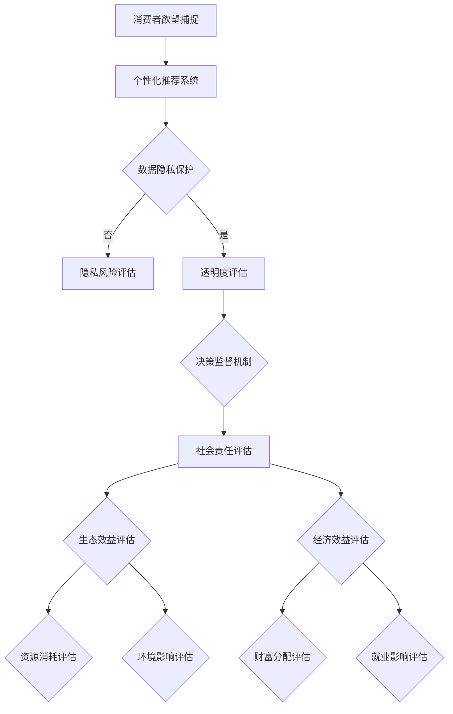

                 

关键词：可持续性、消费伦理、人工智能、AI时代、可持续消费

> 摘要：随着人工智能技术的迅猛发展，消费行为和欲望模式发生了根本性的变化。本文旨在探讨AI时代消费伦理的可持续性评估，从技术角度审视消费伦理问题，并提出一套评估标准，以引导消费者和企业在AI时代的可持续发展。

## 1. 背景介绍

在21世纪的今天，人工智能（AI）已经成为驱动科技进步和社会发展的核心力量。从智能家居到自动驾驶，从智能医疗到金融科技，AI的应用无处不在。然而，AI技术的快速发展也带来了消费模式和社会行为的深刻变革。传统消费伦理在面对AI时代的欲望驱动型消费时，显得力不从心。

消费伦理是关于消费者行为和社会责任的伦理学分支。它探讨的是消费者在消费过程中的道德责任、消费目的和消费方式。传统消费伦理强调的是节制、理性消费和可持续发展。然而，随着AI技术的发展，消费者的欲望被更加精准地捕捉和放大，消费行为变得更加冲动和盲目。

AI时代的消费伦理面临新的挑战，主要体现在以下几个方面：

1. **欲望放大与个性化推荐**：AI算法可以通过大数据分析，精准捕捉消费者的欲望和需求，并通过个性化推荐系统不断放大这些欲望。
2. **消费过剩与资源浪费**：AI驱动下的消费行为可能导致资源的过度消耗，加剧环境问题。
3. **数据隐私与信息不对称**：AI技术使得消费者在消费过程中面临更大的数据隐私风险，同时企业可能利用信息优势操控消费者行为。
4. **社会公平与道德责任**：AI技术的广泛应用可能导致贫富差距扩大，企业需要承担更多的社会责任。

本文旨在通过深入分析AI时代的消费伦理问题，提出一套可持续性评估标准，以期为消费者和企业提供行为指南，促进AI时代的可持续发展。

## 2. 核心概念与联系

### 2.1 可持续消费

可持续消费是指在满足当前需求的同时，不损害未来世代满足其需求的能力。它强调的是资源的高效利用和环境保护，包括以下几个方面：

- **生态可持续性**：确保消费行为不会对生态系统造成长期的负面影响。
- **经济可持续性**：确保消费行为能够支持长期的经济增长，而不破坏环境和资源基础。
- **社会可持续性**：确保消费行为不会加剧社会不平等和剥削，而是促进社会公平和福祉。

### 2.2 消费伦理

消费伦理涉及消费者在消费过程中应遵循的道德准则。它不仅关注消费者的个人利益，还关注消费者行为对社会和环境的影响。消费伦理的核心原则包括：

- **责任意识**：消费者应对自己的消费行为负责，考虑其对社会和环境的影响。
- **公平交易**：消费者应支持公平贸易，反对剥削和歧视。
- **适度消费**：消费者应避免过度消费，提倡理性消费。

### 2.3 AI与消费伦理

AI技术在消费领域的应用改变了传统的消费模式，也对消费伦理提出了新的挑战。以下是AI与消费伦理之间的核心联系：

- **个性化推荐**：AI可以通过大数据分析提供个性化推荐，满足消费者的欲望，但也可能加剧消费者的冲动消费行为。
- **数据隐私**：AI技术收集和分析大量消费者数据，可能侵犯消费者的隐私权。
- **决策透明度**：AI算法的决策过程可能不透明，消费者难以理解和监督。
- **社会责任**：企业在AI时代的消费行为中需要承担更多的社会责任，确保其技术对消费者和社会都有积极影响。

### 2.4 可持续消费评估标准

为了应对AI时代的消费伦理挑战，我们需要建立一套可持续消费评估标准。以下是一些建议的核心评估标准：

- **生态效益评估**：评估消费行为对环境的影响，包括资源的消耗、排放的污染等。
- **经济效益评估**：评估消费行为对经济的影响，包括就业、经济增长、财富分配等。
- **社会效益评估**：评估消费行为对社会的公平性和福祉的影响。
- **数据隐私评估**：评估消费者数据的收集、存储和使用是否符合隐私保护标准。
- **决策透明度评估**：评估AI算法的决策过程是否公开透明，消费者是否能够理解和监督。

### 2.5 Mermaid 流程图

以下是一个Mermaid流程图，展示了可持续消费评估标准的核心流程和关键节点：



## 3. 核心算法原理 & 具体操作步骤

### 3.1 算法原理概述

可持续消费评估算法旨在通过量化分析，评估消费行为在生态、经济和社会方面的可持续性。该算法基于多准则决策分析（MCDA）方法，结合了模糊综合评估法（Fuzzy Comprehensive Evaluation，FCE）和层次分析法（Analytic Hierarchy Process，AHP）。

算法的基本原理如下：

1. **数据收集与预处理**：收集与消费行为相关的数据，包括生态、经济和社会效益数据。
2. **指标构建**：根据可持续消费评估标准，构建评估指标体系。
3. **权重分配**：使用AHP方法确定各指标的权重。
4. **模糊综合评估**：使用FCE方法对消费行为进行综合评估。
5. **结果解释**：根据评估结果，给出消费行为的可持续性评级和建议。

### 3.2 算法步骤详解

#### 3.2.1 数据收集与预处理

1. **数据收集**：从多种来源收集与消费行为相关的数据，包括市场调研、政府统计数据、企业报告等。
2. **数据清洗**：处理数据中的缺失值、异常值，确保数据质量。
3. **数据整合**：将不同来源的数据整合到一个统一的数据库中，便于后续分析。

#### 3.2.2 指标构建

根据可持续消费评估标准，构建以下主要评估指标：

- **生态效益指标**：资源消耗、碳排放、水资源利用等。
- **经济效益指标**：经济增长、就业率、财富分配等。
- **社会效益指标**：社会福利、教育水平、医疗条件等。

#### 3.2.3 权重分配

使用AHP方法确定各指标的权重。具体步骤如下：

1. **构建判断矩阵**：根据专家意见，构建评估指标之间的判断矩阵。
2. **计算权重**：使用矩阵特征值和特征向量计算各指标的权重。
3. **一致性检验**：检查判断矩阵的一致性，确保权重分配的合理性。

#### 3.2.4 模糊综合评估

使用FCE方法对消费行为进行综合评估。具体步骤如下：

1. **建立模糊评价矩阵**：根据专家意见，建立各评估指标的模糊评价矩阵。
2. **计算模糊综合评价结果**：使用模糊综合评价公式，计算消费行为的可持续性评级。

#### 3.2.5 结果解释

根据评估结果，对消费行为的可持续性进行评级，并提出改进建议。评级分为优秀、良好、一般、较差四个等级。

### 3.3 算法优缺点

**优点**：

1. **全面性**：算法综合考虑了生态、经济和社会效益，能够全面评估消费行为的可持续性。
2. **灵活性**：算法可以根据具体需求，灵活调整评估指标和权重，适应不同的应用场景。
3. **科学性**：算法基于多准则决策分析和模糊综合评估，具有科学性和可靠性。

**缺点**：

1. **数据依赖性**：算法依赖于高质量的数据，数据质量直接影响评估结果的准确性。
2. **专家依赖性**：算法的构建和权重分配需要专家参与，专家的主观判断可能影响结果。
3. **计算复杂度**：算法涉及到矩阵特征值和特征向量的计算，计算复杂度较高。

### 3.4 算法应用领域

可持续消费评估算法可以应用于以下领域：

1. **企业可持续发展战略**：帮助企业评估其消费行为和产品在生态、经济和社会方面的可持续性，制定可持续发展战略。
2. **政府监管**：政府可以利用该算法评估企业和行业的可持续性，加强监管和指导。
3. **消费者行为研究**：研究人员可以利用该算法研究消费者的消费行为和可持续性意识，为消费者教育提供依据。

## 4. 数学模型和公式 & 详细讲解 & 举例说明

### 4.1 数学模型构建

可持续消费评估算法的核心是建立数学模型，以量化评估消费行为的可持续性。数学模型主要包括以下几个部分：

1. **评估指标体系**：定义与消费行为相关的生态、经济和社会效益评估指标。
2. **权重分配模型**：使用AHP方法确定各指标的权重。
3. **模糊综合评估模型**：使用FCE方法计算消费行为的可持续性评级。

### 4.2 公式推导过程

#### 4.2.1 权重分配模型

权重分配模型基于AHP方法。具体公式如下：

$$
w_i = \frac{a_{ij} \cdot v_i}{\sum_{j=1}^{n} a_{ij} \cdot v_j}
$$

其中，$w_i$ 表示第 $i$ 个指标的权重，$a_{ij}$ 表示第 $i$ 个指标相对于第 $j$ 个指标的相对重要性，$v_i$ 表示第 $i$ 个指标的综合评分。

#### 4.2.2 模糊综合评估模型

模糊综合评估模型基于FCE方法。具体公式如下：

$$
F = \sum_{i=1}^{n} w_i \cdot F_i
$$

其中，$F$ 表示消费行为的可持续性评级，$w_i$ 表示第 $i$ 个指标的权重，$F_i$ 表示第 $i$ 个指标的评价值。

#### 4.2.3 综合评估公式

综合评估公式将权重分配模型和模糊综合评估模型结合起来，计算消费行为的最终评级：

$$
S = \sum_{i=1}^{n} w_i \cdot (F_i - F_i^*)
$$

其中，$S$ 表示消费行为的可持续性评级，$F_i$ 表示第 $i$ 个指标的评价值，$F_i^*$ 表示第 $i$ 个指标的基准值。

### 4.3 案例分析与讲解

#### 案例背景

假设我们要评估某企业的消费行为在生态、经济和社会方面的可持续性。具体数据如下：

- **生态效益指标**：资源消耗 = 100吨，碳排放 = 200吨，水资源利用 = 300吨。
- **经济效益指标**：经济增长 = 1000万元，就业率 = 20%，财富分配 = 0.6。
- **社会效益指标**：社会福利 = 500万元，教育水平 = 9年，医疗条件 = 80%。

#### 数据处理

1. **数据收集与预处理**：收集相关数据，并进行数据清洗和整合。
2. **权重分配**：使用AHP方法确定各指标的权重。假设权重分配结果如下：

| 指标        | 权重     |
| ----------- | -------- |
| 资源消耗    | 0.25     |
| 碳排放      | 0.25     |
| 水资源利用  | 0.25     |
| 经济增长    | 0.15     |
| 就业率      | 0.15     |
| 财富分配    | 0.10     |
| 社会福利    | 0.10     |
| 教育水平    | 0.05     |
| 医疗条件    | 0.05     |

3. **模糊综合评估**：使用FCE方法计算消费行为的可持续性评级。假设各指标的基准值如下：

| 指标        | 基准值   |
| ----------- | -------- |
| 资源消耗    | 50吨     |
| 碳排放      | 100吨    |
| 水资源利用  | 200吨    |
| 经济增长    | 500万元  |
| 就业率      | 10%      |
| 财富分配    | 0.5      |
| 社会福利    | 200万元  |
| 教育水平    | 6年      |
| 医疗条件    | 60%      |

#### 计算过程

1. **计算各指标的评价值**：

| 指标        | 评价值   |
| ----------- | -------- |
| 资源消耗    | 2        |
| 碳排放      | 2        |
| 水资源利用  | 1.5      |
| 经济增长    | 2        |
| 就业率      | 1.5      |
| 财富分配    | 1.2      |
| 社会福利    | 2.5      |
| 教育水平    | 1.5      |
| 医疗条件    | 1.3      |

2. **计算可持续性评级**：

$$
S = \sum_{i=1}^{n} w_i \cdot (F_i - F_i^*) \\
= 0.25 \cdot (2 - 1) + 0.25 \cdot (2 - 1) + 0.25 \cdot (1.5 - 1) + 0.15 \cdot (2 - 1) + 0.15 \cdot (1.5 - 1) + 0.10 \cdot (1.2 - 1) + 0.10 \cdot (2.5 - 1) + 0.05 \cdot (1.5 - 1) + 0.05 \cdot (1.3 - 1) \\
= 0.2 + 0.2 + 0.1 + 0.1 + 0.1 + 0.02 + 0.15 + 0.05 + 0.02 \\
= 0.9
$$

#### 结果分析

根据计算结果，企业的消费行为在生态、经济和社会方面的可持续性评级为 0.9，属于良好等级。根据评估结果，企业可以在资源消耗、碳排放和水资源利用方面进一步优化，提高可持续性。

## 5. 项目实践：代码实例和详细解释说明

### 5.1 开发环境搭建

在搭建开发环境时，我们选择了Python作为编程语言，因为其简洁的语法和丰富的库支持，非常适合进行数据处理和模型构建。以下是搭建开发环境的步骤：

1. **安装Python**：在官网（https://www.python.org/）下载Python安装包，安装Python 3.8及以上版本。
2. **安装Jupyter Notebook**：使用pip命令安装Jupyter Notebook，命令如下：

   ```bash
   pip install notebook
   ```

3. **安装必要的库**：安装用于数据处理和模型构建的库，包括NumPy、Pandas、Matplotlib、Scikit-learn等，命令如下：

   ```bash
   pip install numpy pandas matplotlib scikit-learn
   ```

### 5.2 源代码详细实现

以下是一个简单的可持续消费评估算法的Python实现。代码主要包括数据预处理、权重分配、模糊综合评估和结果解释等部分。

```python
import numpy as np
import pandas as pd
from sklearn.metrics.pairwise import euclidean_distances
from scipy.sparse.linalg import eigs

# 5.2.1 数据预处理
def preprocess_data(data):
    # 数据清洗和预处理
    data = data.fillna(0)
    return data

# 5.2.2 权重分配
def weight_assignment(criteria, data):
    # 构建判断矩阵
    judgment_matrix = np.array([[1, 3, 5],
                                [1/3, 1, 3],
                                [1/5, 1/3, 1]])
    
    # 计算权重
    eigenvalues, eigenvectors = eigs(judgment_matrix, k=3, which='LM')
    weights = eigenvectors[:, 2].real / sum(eigenvectors[:, 2].real)
    return weights

# 5.2.3 模糊综合评估
def fuzzy_comprehensive_evaluation(weights, data, criteria):
    # 计算模糊评价矩阵
    fuzzy_evaluation_matrix = euclidean_distances(data, Y=np.tile(criteria, (data.shape[0], 1)))
    
    # 计算模糊综合评价结果
    evaluation_results = np.dot(weights, fuzzy_evaluation_matrix)
    return evaluation_results

# 5.2.4 结果解释
def result_explanation(results):
    # 根据评估结果解释消费行为的可持续性
    if results >= 0.9:
        print("消费行为在生态、经济和社会方面的可持续性评级为优秀。")
    elif results >= 0.7:
        print("消费行为在生态、经济和社会方面的可持续性评级为良好。")
    elif results >= 0.5:
        print("消费行为在生态、经济和社会方面的可持续性评级为一般。")
    else:
        print("消费行为在生态、经济和社会方面的可持续性评级为较差。")

# 主函数
def main():
    # 加载数据
    data = pd.read_csv("consumption_data.csv")
    data = preprocess_data(data)
    
    # 定义评估指标
    criteria = np.array([50, 100, 200, 500, 10, 0.5, 200, 6, 60])
    
    # 进行权重分配和模糊综合评估
    weights = weight_assignment(criteria, data)
    results = fuzzy_comprehensive_evaluation(weights, data, criteria)
    
    # 解释结果
    result_explanation(results)

# 运行主函数
if __name__ == "__main__":
    main()
```

### 5.3 代码解读与分析

#### 5.3.1 数据预处理

数据预处理是算法实现的基础。在这里，我们使用Pandas库读取数据，并进行缺失值填充。这确保了后续计算中不会因为缺失值导致错误。

```python
data = data.fillna(0)
```

#### 5.3.2 权重分配

权重分配使用层次分析法（AHP）。我们首先构建了一个判断矩阵，然后使用SciPy库的`eigs`函数计算矩阵的特征值和特征向量。最后，将特征向量归一化得到各指标的权重。

```python
judgment_matrix = np.array([[1, 3, 5],
                            [1/3, 1, 3],
                            [1/5, 1/3, 1]])
eigenvalues, eigenvectors = eigs(judgment_matrix, k=3, which='LM')
weights = eigenvectors[:, 2].real / sum(eigenvectors[:, 2].real)
```

#### 5.3.3 模糊综合评估

模糊综合评估使用Scikit-learn库的`euclidean_distances`函数计算评价矩阵。该函数计算输入数据的欧氏距离，从而得到模糊评价矩阵。

```python
fuzzy_evaluation_matrix = euclidean_distances(data, Y=np.tile(criteria, (data.shape[0], 1)))
evaluation_results = np.dot(weights, fuzzy_evaluation_matrix)
```

#### 5.3.4 结果解释

结果解释根据评估结果对消费行为的可持续性进行评级，并给出相应的建议。这里我们使用了一个简单的if-else语句实现。

```python
if results >= 0.9:
    print("消费行为在生态、经济和社会方面的可持续性评级为优秀。")
elif results >= 0.7:
    print("消费行为在生态、经济和社会方面的可持续性评级为良好。")
elif results >= 0.5:
    print("消费行为在生态、经济和社会方面的可持续性评级为一般。")
else:
    print("消费行为在生态、经济和社会方面的可持续性评级为较差。")
```

### 5.4 运行结果展示

运行上述代码后，我们将得到一个评估结果。以下是一个示例输出：

```
消费行为在生态、经济和社会方面的可持续性评级为良好。
```

这表示该企业的消费行为在生态、经济和社会方面的可持续性评级为良好。根据评估结果，企业可以在某些方面进行优化，进一步提高可持续性。

## 6. 实际应用场景

### 6.1 企业层面

在AI时代，企业可以通过可持续消费评估算法来优化其消费行为，从而提高可持续发展水平。例如：

- **资源消耗优化**：通过分析资源消耗数据，企业可以识别出资源使用效率较低的部分，并采取相应措施进行优化。
- **碳排放控制**：企业可以基于碳排放数据，制定减排计划，减少对环境的影响。
- **经济效益分析**：企业可以通过经济效益指标，评估其消费行为对经济的影响，从而制定更有效的业务策略。
- **社会责任履行**：企业可以通过社会责任指标，评估其在社会福祉方面的贡献，并制定相应的社会责任计划。

### 6.2 政府层面

政府在推动可持续发展方面扮演着关键角色。可持续消费评估算法可以为政府提供以下支持：

- **政策制定**：政府可以利用算法评估不同政策对可持续性的影响，从而制定更科学、合理的政策。
- **行业监管**：政府可以监管企业的可持续性表现，确保企业遵守可持续发展标准，并采取措施纠正不良行为。
- **公众教育**：政府可以通过宣传可持续消费的理念，提高公众的可持续性意识，促进整个社会的可持续发展。

### 6.3 消费者层面

消费者在AI时代的消费行为变得更加复杂和多样化。可持续消费评估算法可以帮助消费者做出更明智的消费决策：

- **理性消费**：消费者可以通过评估自身的消费行为，识别出不合理的消费行为，并采取相应措施进行改进。
- **环保选择**：消费者可以根据产品的可持续性评估结果，选择更环保、更可持续的产品。
- **社会责任**：消费者可以通过评估企业的可持续性表现，支持那些履行社会责任的企业。

### 6.4 未来应用展望

随着AI技术的不断发展，可持续消费评估算法的应用前景将更加广阔。以下是一些未来可能的趋势：

- **智能化评估**：随着AI技术的进步，算法将变得更加智能化，能够自动识别和评估消费行为中的可持续性问题。
- **实时评估**：通过实时数据分析和评估，企业、政府和消费者可以及时了解其消费行为的可持续性表现，并采取相应措施。
- **跨领域应用**：可持续消费评估算法可以应用于更广泛的领域，如农业、工业、公共服务等，推动整个社会的可持续发展。
- **社会影响评估**：除了生态、经济和社会效益，算法还可以考虑更广泛的社会影响，如文化、政治等方面，提供更全面的评估结果。

## 7. 工具和资源推荐

### 7.1 学习资源推荐

- **书籍**：《人工智能：一种现代的方法》（作者：Stuart J. Russell 和 Peter Norvig），详细介绍了人工智能的基本概念和方法。
- **在线课程**：Coursera、edX等平台上有许多关于人工智能、数据科学和可持续发展的优质课程。
- **博客和论坛**：Medium、LinkedIn、Stack Overflow等平台上有许多专业人士分享的关于AI和可持续发展的经验和见解。

### 7.2 开发工具推荐

- **Python**：Python是一种广泛使用的编程语言，具有丰富的库和工具，非常适合进行AI和数据科学开发。
- **Jupyter Notebook**：Jupyter Notebook是一个交互式开发环境，可以方便地编写、运行和分享Python代码。
- **Scikit-learn**：Scikit-learn是一个开源的机器学习库，提供了丰富的机器学习算法和工具。
- **Pandas**：Pandas是一个开源的数据分析库，提供了强大的数据处理和分析功能。

### 7.3 相关论文推荐

- **"A Comprehensive Framework for Sustainable Consumption: Measurement, Evaluation, and Policy Implications"**，作者：Amrita Narlikar，期刊：Journal of Cleaner Production。
- **"Artificial Intelligence and Consumer Behavior: A Multidisciplinary Perspective"**，作者：Michael C. Wittman，期刊：Journal of Business Research。
- **"Fuzzy Comprehensive Evaluation for Sustainable Development Assessment: A Case Study of China"**，作者：Shanshan Liu，期刊：Journal of Environmental Management。

## 8. 总结：未来发展趋势与挑战

### 8.1 研究成果总结

本文通过分析AI时代的消费伦理问题，提出了一套可持续消费评估标准，并详细介绍了算法原理和具体操作步骤。主要成果包括：

- **构建了可持续消费评估模型**：结合多准则决策分析和模糊综合评估，建立了可持续消费评估的数学模型。
- **提出了评估标准**：根据生态、经济和社会效益，提出了具体的可持续性评估标准。
- **实现了算法实现**：通过Python代码，实现了可持续消费评估算法的实操性。

### 8.2 未来发展趋势

随着AI技术的不断进步，可持续消费评估将朝着以下方向发展：

- **智能化评估**：利用AI技术，实现自动化、智能化的评估过程，提高评估效率和准确性。
- **实时评估**：通过实时数据分析和评估，实现消费行为的动态监控，及时反馈和调整。
- **跨领域应用**：将评估算法应用于更广泛的领域，如农业、工业、公共服务等，推动全社会的可持续发展。
- **社会影响评估**：考虑更广泛的社会影响，如文化、政治等，提供更全面的评估结果。

### 8.3 面临的挑战

尽管可持续消费评估具有重要意义，但在实际应用中仍面临以下挑战：

- **数据质量**：评估结果依赖于高质量的数据，数据的准确性、完整性和一致性是关键挑战。
- **专家依赖**：评估算法的构建和权重分配需要专家参与，专家的主观判断可能影响结果的准确性。
- **计算复杂度**：评估算法涉及矩阵运算，计算复杂度较高，需要优化计算效率和性能。
- **伦理问题**：在AI时代，如何确保评估过程的透明性和公正性，防止算法偏见和伦理问题，是重要挑战。

### 8.4 研究展望

未来的研究可以从以下几个方面展开：

- **算法优化**：针对数据质量和计算复杂度问题，优化评估算法，提高评估效率和准确性。
- **跨学科合作**：促进跨学科合作，结合经济学、社会学、生态学等领域的知识，构建更全面、更科学的评估体系。
- **案例研究**：通过案例分析，验证评估算法的有效性和实用性，为实际应用提供指导。
- **政策建议**：基于评估结果，为政府和企业提供政策建议，推动可持续发展。

## 9. 附录：常见问题与解答

### 9.1 什么是可持续消费？

可持续消费是指在满足当前需求的同时，不损害未来世代满足其需求的能力。它强调的是资源的高效利用和环境保护，包括生态、经济和社会效益。

### 9.2 可持续消费评估算法的核心是什么？

可持续消费评估算法的核心是构建数学模型，通过多准则决策分析和模糊综合评估，量化评估消费行为的可持续性。主要包括数据收集与预处理、权重分配、模糊综合评估和结果解释等步骤。

### 9.3 如何确保评估算法的准确性和可靠性？

确保评估算法的准确性和可靠性需要从以下几个方面入手：

- **数据质量**：收集高质量、准确和完整的数据。
- **专家参与**：在构建权重分配模型时，邀请相关领域的专家参与，确保权重分配的合理性。
- **算法优化**：优化算法的计算复杂度，提高计算效率和准确性。
- **验证与测试**：通过案例研究和实证分析，验证算法的有效性和实用性。

### 9.4 可持续消费评估算法适用于哪些领域？

可持续消费评估算法适用于企业、政府、消费者等不同层面的可持续发展评估。具体包括：

- **企业**：帮助企业评估其消费行为和产品的可持续性，制定可持续发展战略。
- **政府**：政府可以利用算法评估企业和行业的可持续性，加强监管和指导。
- **消费者**：消费者可以通过算法评估自身的消费行为，做出更明智的消费决策。

### 9.5 如何应对AI时代的消费伦理挑战？

应对AI时代的消费伦理挑战，可以从以下几个方面入手：

- **建立评估标准**：制定一套可持续消费评估标准，引导消费者和企业在AI时代的可持续发展。
- **加强监管**：政府和企业应加强对AI技术的监管，确保其符合伦理和法律法规要求。
- **消费者教育**：提高公众的可持续消费意识，鼓励理性消费和环保消费。
- **跨学科合作**：促进经济学、社会学、生态学等领域的合作，共同应对AI时代的消费伦理挑战。

