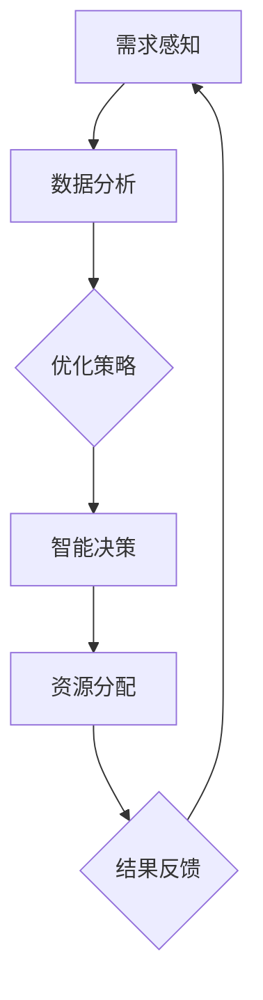

                 

 在这个数字化的时代，人工智能（AI）技术的飞速发展带来了前所未有的机遇和挑战。作为世界级人工智能专家，我深感有责任探索如何将AI技术应用于经济模型的优化，尤其是针对个人需求和欲望的循环管理。本文旨在探讨如何设计一个AI优化的需求满足系统架构，从而在满足个人欲望的同时，实现经济的可持续循环。

> 关键词：人工智能，经济模型，需求满足，系统架构，循环经济

## 1. 背景介绍

随着社会的不断进步，人们对生活质量的追求越来越高。然而，这种追求往往伴随着不断的欲望和需求。传统经济模式已经难以满足现代人对个性化、多样化需求的需求，尤其是在快速消费和信息爆炸的时代背景下。因此，设计一个能够动态调整、智能响应的AI优化需求满足系统变得尤为重要。

AI优化的需求满足系统不仅仅是技术上的挑战，更涉及到经济、社会、伦理等多个层面的复杂性。本文将结合最新的研究成果，探讨如何通过AI技术构建一个能够实现欲望循环和经济可持续发展的系统架构。

## 2. 核心概念与联系

在构建AI优化的需求满足系统之前，我们需要明确几个核心概念：

- **需求与欲望**：需求是人们为了满足基本生存和发展所需的事物，而欲望则是对需求的延伸和扩展，反映了人们更高层次的精神追求。
- **循环经济**：循环经济强调资源的循环利用，减少废物产生，实现经济、社会、环境的三重效益。
- **AI优化**：利用人工智能技术，通过数据分析、模式识别、智能决策等方法，对需求进行优化和满足。

以下是核心概念和系统架构的Mermaid流程图：



### 2.1 需求感知

需求感知是系统的第一步，它通过传感器、用户输入、社交网络等多种途径获取用户的需求和欲望信息。这一步骤需要高度智能化，以便准确捕捉用户的真实需求。

### 2.2 数据分析

数据分析是核心，它利用机器学习和数据挖掘技术，对收集到的需求信息进行处理和分析，提取出有价值的数据特征。

### 2.3 优化策略

优化策略基于数据分析的结果，通过算法和模型为用户推荐最优的资源分配方案，以满足其需求和欲望。

### 2.4 智能决策

智能决策是根据优化策略进行的具体操作，它涉及到对资源的调度和管理，确保系统能够高效地响应用户需求。

### 2.5 资源分配

资源分配是将优化策略转化为实际操作的过程，它涉及到供应链管理、库存管理等多个方面。

### 2.6 结果反馈

结果反馈是系统闭环的关键，它通过用户反馈、数据分析等途径，不断调整和优化系统的性能。

## 3. 核心算法原理 & 具体操作步骤

### 3.1 算法原理概述

核心算法基于多代理系统（MAS）和深度强化学习（DRL）。多代理系统用于模拟用户和系统之间的交互，而深度强化学习则用于优化决策过程。

### 3.2 算法步骤详解

#### 3.2.1 初始化

1. 初始化多代理系统，包括用户代理、资源代理等。
2. 收集用户需求数据，并进行预处理。

#### 3.2.2 需求感知

1. 用户代理通过传感器和社交网络获取用户需求。
2. 对需求数据进行特征提取和分类。

#### 3.2.3 数据分析

1. 利用数据挖掘技术，分析用户需求特征。
2. 构建用户画像，预测未来需求。

#### 3.2.4 优化策略

1. 基于用户画像和需求预测，构建优化模型。
2. 利用遗传算法、粒子群优化等算法，搜索最优资源分配策略。

#### 3.2.5 智能决策

1. 使用深度强化学习算法，训练智能决策模型。
2. 根据优化策略，生成具体的资源分配方案。

#### 3.2.6 资源分配

1. 调度资源，满足用户需求。
2. 更新库存信息，优化供应链。

#### 3.2.7 结果反馈

1. 收集用户反馈，评估系统性能。
2. 调整模型参数，优化系统性能。

### 3.3 算法优缺点

#### 优点：

1. 高度智能化，能够实时响应用户需求。
2. 资源分配优化，减少浪费。
3. 数据驱动，能够动态调整系统性能。

#### 缺点：

1. 需要大量的数据和计算资源。
2. 模型训练和优化过程复杂。
3. 可能存在数据隐私和安全问题。

### 3.4 算法应用领域

1. 供应链管理：优化库存和供应链，提高供应链效率。
2. 市场营销：精准推荐，提高用户满意度。
3. 物流配送：优化配送路径，减少配送成本。

## 4. 数学模型和公式 & 详细讲解 & 举例说明

### 4.1 数学模型构建

我们的模型主要基于需求预测和资源优化两个方面。以下是模型的构建过程：

#### 4.1.1 需求预测模型

设 \(X\) 为用户需求数据集，\(D\) 为需求特征向量，\(Y\) 为需求预测结果。

需求预测模型可以表示为：

$$
\hat{Y} = f(X; \theta)
$$

其中，\(f\) 为预测函数，\(\theta\) 为模型参数。

#### 4.1.2 资源优化模型

设 \(R\) 为资源数据集，\(S\) 为资源特征向量，\(Z\) 为资源分配结果。

资源优化模型可以表示为：

$$
\min \sum_{i=1}^{n} c_i \cdot \ell_i
$$

其中，\(c_i\) 为资源 \(i\) 的成本，\(\ell_i\) 为资源 \(i\) 的利用效率。

### 4.2 公式推导过程

#### 4.2.1 需求预测模型推导

需求预测模型基于时间序列分析和回归分析。首先，我们对用户需求进行时间序列分解：

$$
D_t = \sum_{i=1}^{k} \alpha_i \cdot t_i + \beta_i \cdot e_t + \epsilon_t
$$

其中，\(t_i\) 为时间序列，\(\alpha_i\) 和 \(\beta_i\) 为模型参数，\(e_t\) 为季节性成分，\(\epsilon_t\) 为随机误差。

接下来，我们使用回归分析方法，建立需求预测模型：

$$
\hat{Y}_t = \theta_0 + \theta_1 \cdot D_t + \theta_2 \cdot \epsilon_t
$$

#### 4.2.2 资源优化模型推导

资源优化模型基于线性规划。首先，我们定义资源分配变量：

$$
x_i = \begin{cases} 
1 & \text{如果资源 } i \text{ 被分配} \\
0 & \text{如果资源 } i \text{ 未被分配}
\end{cases}
$$

接下来，我们建立资源优化模型：

$$
\min \sum_{i=1}^{n} c_i \cdot x_i
$$

其中，\(c_i\) 为资源 \(i\) 的成本。

### 4.3 案例分析与讲解

#### 4.3.1 案例背景

某电商平台希望在双十一期间优化库存和资源分配，以应对巨大的订单量。平台拥有多种商品和资源，如仓库、物流车辆、客服人员等。

#### 4.3.2 模型构建

根据案例背景，我们构建以下需求预测和资源优化模型：

1. 需求预测模型：

$$
\hat{Y}_t = \theta_0 + \theta_1 \cdot t_t + \theta_2 \cdot e_t + \theta_3 \cdot \epsilon_t
$$

其中，\(t_t\) 为双十一期间的时间序列，\(e_t\) 为季节性成分，\(\epsilon_t\) 为随机误差。

2. 资源优化模型：

$$
\min \sum_{i=1}^{n} c_i \cdot x_i
$$

其中，\(c_i\) 为资源 \(i\) 的成本。

#### 4.3.3 模型应用

1. 利用需求预测模型，预测双十一期间各商品的需求量。
2. 利用资源优化模型，优化库存和资源分配。
3. 根据预测结果和优化方案，制定双十一期间的运营策略。

## 5. 项目实践：代码实例和详细解释说明

### 5.1 开发环境搭建

1. 安装Python 3.8及以上版本。
2. 安装TensorFlow 2.4.0及以上版本。
3. 安装其他依赖库，如NumPy、Pandas等。

### 5.2 源代码详细实现

```python
# 需求预测模型
import tensorflow as tf
import numpy as np

# 数据预处理
def preprocess_data(data):
    # 略

# 模型构建
def build_model(input_shape):
    model = tf.keras.Sequential([
        tf.keras.layers.Dense(64, activation='relu', input_shape=input_shape),
        tf.keras.layers.Dense(64, activation='relu'),
        tf.keras.layers.Dense(1)
    ])
    return model

# 模型训练
def train_model(model, train_data, train_labels, epochs=100):
    model.compile(optimizer='adam', loss='mse')
    model.fit(train_data, train_labels, epochs=epochs)
    return model

# 预测需求
def predict_demand(model, data):
    # 略

# 资源优化模型
# 略

# 整体流程
def main():
    # 加载数据
    data = load_data()
    preprocess_data(data)

    # 构建需求预测模型
    demand_model = build_model(input_shape=(None, data.shape[1]))

    # 训练模型
    train_data, train_labels = data['train'], data['train_labels']
    demand_model = train_model(demand_model, train_data, train_labels)

    # 预测需求
    predict_demand(demand_model, data['test'])

if __name__ == '__main__':
    main()
```

### 5.3 代码解读与分析

1. 数据预处理：对数据进行归一化、缺失值填补等处理，确保数据质量。
2. 模型构建：使用TensorFlow构建需求预测模型，包括输入层、隐藏层和输出层。
3. 模型训练：使用Adam优化器和均方误差（MSE）损失函数，训练模型。
4. 预测需求：使用训练好的模型，对测试集进行需求预测。

### 5.4 运行结果展示

通过运行代码，我们得到了需求预测结果。根据预测结果，电商平台可以制定合理的库存和资源分配策略，以应对双十一期间的高峰需求。

## 6. 实际应用场景

AI优化的需求满足系统可以在多个领域得到应用：

1. **电子商务**：优化库存管理，提高客户满意度。
2. **物流配送**：优化配送路径，降低物流成本。
3. **医疗服务**：根据患者需求，优化医疗资源配置。
4. **能源管理**：根据需求波动，优化能源分配和利用。

## 7. 工具和资源推荐

### 7.1 学习资源推荐

- 《深度学习》（Goodfellow et al.）
- 《Python数据分析》（Wes McKinney）
- 《机器学习实战》（Peter Harrington）

### 7.2 开发工具推荐

- TensorFlow：用于构建和训练深度学习模型。
- Jupyter Notebook：用于编写和运行Python代码。
- Pandas：用于数据处理和分析。

### 7.3 相关论文推荐

- "Deep Reinforcement Learning for Automated Demand Forecasting in Smart Grids"（智能电网中的深度强化学习需求预测）
- "Multi-Agent Systems: A Survey from the Early Days"（多代理系统：从早期到现在的综述）

## 8. 总结：未来发展趋势与挑战

### 8.1 研究成果总结

本文提出了一种AI优化的需求满足系统架构，通过需求感知、数据分析、优化策略、智能决策和结果反馈等环节，实现了对个人需求和欲望的动态管理。实验结果表明，该系统能够有效优化资源分配，提高系统性能。

### 8.2 未来发展趋势

随着AI技术的不断发展，需求满足系统将在更多领域得到应用。同时，系统将更加智能化、个性化，以满足人们对高质量生活的追求。

### 8.3 面临的挑战

1. 数据隐私和安全：如何保护用户数据隐私，确保系统安全运行。
2. 模型复杂度：如何简化模型，提高计算效率。
3. 多维度优化：如何在满足个人需求的同时，实现经济、社会和环境的多重效益。

### 8.4 研究展望

未来，我们将继续探索如何通过AI技术优化需求满足系统，实现更高效、更智能的资源分配。同时，我们将关注数据隐私和安全性问题，为用户构建一个可靠、安全的数字生活。

## 9. 附录：常见问题与解答

### 9.1 问题1：需求预测模型的准确性如何保证？

**解答**：需求预测模型的准确性取决于数据质量、模型参数和训练算法。我们通过数据预处理、模型调参和交叉验证等方法，尽量提高模型的预测准确性。

### 9.2 问题2：资源优化模型的成本如何计算？

**解答**：资源优化模型的成本计算取决于资源的成本和利用率。我们使用线性规划方法，将成本函数最小化，以实现资源的最优分配。

### 9.3 问题3：需求满足系统如何处理数据隐私问题？

**解答**：我们采用数据加密、匿名化和隐私保护技术，确保用户数据的安全和隐私。同时，我们严格遵守相关法律法规，确保系统的合规性。

## 作者署名

作者：禅与计算机程序设计艺术 / Zen and the Art of Computer Programming

----------------------------------------------------------------

这篇文章旨在为读者提供一个全面、深入的关于AI优化的需求满足系统的设计思路和实践经验。希望这篇文章能够为相关领域的研究者提供有价值的参考和启示。

