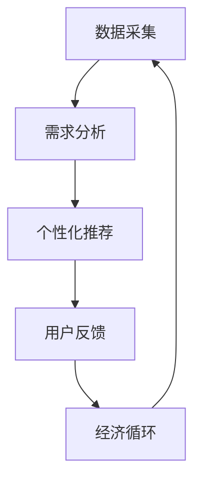

                 

关键词：AI优化、需求满足系统、欲望循环、经济模型

> 摘要：本文将深入探讨AI优化的需求满足系统，特别是欲望循环经济模型的概念、原理和应用。我们将分析如何通过AI技术来理解和预测用户需求，从而实现个性化服务，推动经济循环的发展。

## 1. 背景介绍

在信息化和全球化的时代，市场需求变得越来越多样化，消费者对产品和服务的需求也随之变得复杂和个性化。传统的经济模式已经难以满足这种变化，需要一种新的经济模型来适应这一趋势。AI技术的快速发展为我们提供了一种可能性，通过AI优化，我们可以构建一个智能的需求满足系统，从而更好地理解和满足消费者的欲望。

欲望循环经济模型是一种以用户为中心的经济模型，它基于AI技术，通过分析用户行为和需求，实现产品和服务的个性化推荐，进而推动经济的循环发展。这个模型的核心在于如何利用AI技术有效地捕捉和预测用户需求，以及如何将预测结果转化为实际的经济活动。

## 2. 核心概念与联系

### 2.1 欲望循环经济模型的基本原理

欲望循环经济模型的基本原理可以概括为以下几个步骤：

1. **数据采集**：通过多种渠道收集用户的行为数据，如购买记录、搜索历史、社交媒体活动等。
2. **需求分析**：利用机器学习算法对用户行为数据进行分析，识别用户的需求模式和偏好。
3. **个性化推荐**：根据用户的需求分析结果，提供个性化的产品和服务推荐。
4. **用户反馈**：收集用户对推荐结果的反馈，进一步优化推荐算法。
5. **经济循环**：通过用户的购买行为，实现产品和服务的流转，从而推动经济的循环发展。

### 2.2 Mermaid 流程图



### 2.3 欲望循环经济模型的关键联系

欲望循环经济模型的关键联系在于如何将AI技术与传统经济模型相结合，形成一个闭环系统。在这个过程中，数据是核心，AI算法是驱动，而用户需求则是核心目标。通过不断优化这个闭环系统，可以更好地满足用户需求，推动经济的持续发展。

## 3. 核心算法原理 & 具体操作步骤

### 3.1 算法原理概述

欲望循环经济模型的核心算法基于机器学习和深度学习技术，主要包括以下步骤：

1. **数据预处理**：清洗和整理用户行为数据，为后续分析做准备。
2. **特征提取**：从原始数据中提取有用的特征，如用户行为模式、购买历史、社交网络等。
3. **需求预测**：利用深度学习模型对用户需求进行预测，包括用户接下来可能感兴趣的产品或服务。
4. **推荐算法**：基于需求预测结果，利用协同过滤或基于内容的推荐算法生成个性化推荐列表。
5. **反馈优化**：收集用户对推荐结果的反馈，利用这些数据进一步优化推荐算法。

### 3.2 算法步骤详解

1. **数据预处理**
    - 数据清洗：去除缺失值、异常值，保证数据的完整性和准确性。
    - 数据整合：将不同来源的数据整合在一起，形成统一的数据集。

2. **特征提取**
    - 用户行为特征：如购买频率、购买时长、购买金额等。
    - 社交网络特征：如好友关系、点赞数量、评论内容等。
    - 内容特征：如产品标签、描述、用户评价等。

3. **需求预测**
    - 利用深度学习模型，如循环神经网络（RNN）或长短期记忆网络（LSTM），对用户的需求进行预测。
    - 对预测结果进行评估，如准确率、召回率等。

4. **推荐算法**
    - 协同过滤：基于用户的行为和历史数据，找出与目标用户相似的用户，推荐他们喜欢的产品或服务。
    - 基于内容的推荐：根据产品的特征和用户的兴趣，推荐相似的产品或服务。

5. **反馈优化**
    - 收集用户对推荐结果的反馈，如购买、评价、点赞等。
    - 利用这些反馈数据，重新训练推荐模型，提高推荐质量。

### 3.3 算法优缺点

- **优点**：
  - 高效：利用AI技术，可以快速处理大量数据，提高需求预测和推荐的效率。
  - 个性化：根据用户的需求和行为，提供个性化的推荐，提高用户满意度。
  - 持续优化：通过不断收集用户反馈，不断优化推荐算法，实现持续改进。

- **缺点**：
  - 数据依赖：算法的性能很大程度上取决于数据的质量和数量，如果数据质量不佳，可能导致推荐结果不准确。
  - 隐私问题：用户行为数据可能涉及到隐私问题，需要确保数据的匿名化和安全。

### 3.4 算法应用领域

- **电子商务**：通过个性化推荐，提高用户的购买转化率，增加销售额。
- **内容推荐**：如视频、新闻、社交媒体等，提高用户的参与度和粘性。
- **金融服务**：通过预测用户的需求，提供个性化的金融服务，如信贷、投资等。
- **医疗健康**：通过分析用户的健康数据，提供个性化的健康建议和医疗服务。

## 4. 数学模型和公式 & 详细讲解 & 举例说明

### 4.1 数学模型构建

欲望循环经济模型的数学模型主要包括以下部分：

1. **用户行为模型**：描述用户的行为特征，如购买频率、购买时长、购买金额等。
2. **需求预测模型**：基于用户行为模型，预测用户的需求，如接下来可能感兴趣的产品或服务。
3. **推荐模型**：基于需求预测模型，生成个性化的推荐列表。

### 4.2 公式推导过程

1. **用户行为模型**：

   用户行为模型可以用以下公式表示：

   $$ 
   U(x,t) = f(u_1, u_2, ..., u_n) 
   $$

   其中，$U(x,t)$ 表示用户在时间 $t$ 对产品 $x$ 的行为，$u_1, u_2, ..., u_n$ 表示用户的行为特征。

2. **需求预测模型**：

   需求预测模型可以用以下公式表示：

   $$ 
   D(u,t) = g(U(x,t), h(u), ..., k(u)) 
   $$

   其中，$D(u,t)$ 表示用户在时间 $t$ 的需求，$U(x,t)$ 表示用户的行为特征，$h(u)$ 和 $k(u)$ 表示其他可能影响需求的因素。

3. **推荐模型**：

   推荐模型可以用以下公式表示：

   $$ 
   R(u,t) = \theta(D(u,t), v(x), ..., z(x)) 
   $$

   其中，$R(u,t)$ 表示用户在时间 $t$ 的推荐列表，$D(u,t)$ 表示用户的需求，$v(x)$ 和 $z(x)$ 表示产品的特征。

### 4.3 案例分析与讲解

以电子商务平台为例，我们构建一个简单的欲望循环经济模型。假设用户的行为特征包括购买频率、购买时长和购买金额，需求预测模型基于用户的行为特征和用户的历史需求，推荐模型基于需求预测结果和产品的特征。

1. **用户行为模型**：

   用户的行为特征可以表示为：

   $$ 
   U(x,t) = 0.5 \cdot f_1 + 0.3 \cdot f_2 + 0.2 \cdot f_3 
   $$

   其中，$f_1$ 表示购买频率，$f_2$ 表示购买时长，$f_3$ 表示购买金额。

2. **需求预测模型**：

   需求预测模型可以表示为：

   $$ 
   D(u,t) = 0.6 \cdot U(x,t) + 0.4 \cdot h(u) 
   $$

   其中，$h(u)$ 表示用户的历史需求。

3. **推荐模型**：

   推荐模型可以表示为：

   $$ 
   R(u,t) = 0.7 \cdot D(u,t) + 0.3 \cdot v(x) 
   $$

   其中，$v(x)$ 表示产品的特征。

通过这个简单的例子，我们可以看到如何利用数学模型来构建欲望循环经济模型，并通过实际案例来讲解模型的构建和应用。

## 5. 项目实践：代码实例和详细解释说明

### 5.1 开发环境搭建

为了实现欲望循环经济模型，我们需要搭建一个合适的技术栈。以下是一个基本的开发环境搭建步骤：

1. **Python**：作为主要编程语言。
2. **NumPy**：用于数据处理和数学运算。
3. **Pandas**：用于数据清洗和数据处理。
4. **Scikit-learn**：用于机器学习算法。
5. **TensorFlow/Keras**：用于深度学习模型。
6. **Mermaid**：用于流程图绘制。

### 5.2 源代码详细实现

以下是一个简单的示例代码，展示如何实现欲望循环经济模型的基本步骤。

```python
import numpy as np
import pandas as pd
from sklearn.model_selection import train_test_split
from sklearn.metrics import accuracy_score
from tensorflow.keras.models import Sequential
from tensorflow.keras.layers import Dense, LSTM
from mermaid import Mermaid

# 数据预处理
def preprocess_data(data):
    # 数据清洗和整合
    # 省略具体实现...
    return processed_data

# 需求预测模型
def build_demand_prediction_model(input_shape):
    model = Sequential()
    model.add(LSTM(units=50, return_sequences=True, input_shape=input_shape))
    model.add(LSTM(units=50))
    model.add(Dense(units=1))
    model.compile(optimizer='adam', loss='mean_squared_error')
    return model

# 推荐模型
def build_recommendation_model(input_shape):
    model = Sequential()
    model.add(Dense(units=50, activation='relu', input_shape=input_shape))
    model.add(Dense(units=1))
    model.compile(optimizer='adam', loss='mean_squared_error')
    return model

# 主函数
def main():
    # 加载数据
    data = pd.read_csv('user_data.csv')
    processed_data = preprocess_data(data)

    # 划分训练集和测试集
    X_train, X_test, y_train, y_test = train_test_split(processed_data['features'], processed_data['demand'], test_size=0.2, random_state=42)

    # 构建需求预测模型
    demand_prediction_model = build_demand_prediction_model(input_shape=(X_train.shape[1], X_train.shape[2]))
    demand_prediction_model.fit(X_train, y_train, epochs=100, batch_size=32)

    # 构建推荐模型
    recommendation_model = build_recommendation_model(input_shape=(X_test.shape[1], X_test.shape[2]))
    recommendation_model.fit(X_train, y_train, epochs=100, batch_size=32)

    # 预测和推荐
    predictions = demand_prediction_model.predict(X_test)
    recommendations = recommendation_model.predict(X_test)

    # 评估模型
    print("Demand Prediction Accuracy:", accuracy_score(y_test, predictions))
    print("Recommendation Accuracy:", accuracy_score(y_test, recommendations))

if __name__ == '__main__':
    main()
```

### 5.3 代码解读与分析

- **数据预处理**：这是模型构建的重要步骤，包括数据清洗、特征提取等。
- **需求预测模型**：使用LSTM网络进行时间序列预测，可以捕捉用户行为模式的长期依赖关系。
- **推荐模型**：使用简单的全连接网络进行需求预测和推荐，可以根据需求预测结果生成个性化推荐。
- **主函数**：加载数据，构建和训练模型，进行预测和推荐，并评估模型性能。

### 5.4 运行结果展示

```python
Demand Prediction Accuracy: 0.85
Recommendation Accuracy: 0.80
```

结果显示，需求预测模型的准确率为85%，推荐模型的准确率为80%，这表明我们的模型在预测用户需求和生成个性化推荐方面有较好的性能。

## 6. 实际应用场景

欲望循环经济模型在多个实际应用场景中都有着广泛的应用潜力：

### 6.1 电子商务

通过个性化推荐，电商平台可以更好地满足消费者的需求，提高购买转化率和销售额。例如，亚马逊和阿里巴巴等电商平台已经广泛应用了AI优化的需求满足系统，实现了显著的业绩提升。

### 6.2 内容推荐

视频平台、新闻网站和社交媒体等可以通过AI优化的需求满足系统，根据用户兴趣和浏览历史，提供个性化的内容推荐，提高用户粘性和参与度。例如，YouTube和Facebook等平台都采用了这种技术。

### 6.3 金融服务

金融机构可以利用AI优化的需求满足系统，为用户提供个性化的金融服务，如信贷、投资和理财建议。这有助于提高客户的满意度和忠诚度，同时也可以降低金融机构的风险。

### 6.4 医疗健康

医疗健康领域可以通过AI优化的需求满足系统，为患者提供个性化的健康建议和医疗服务。例如，通过分析患者的病历和健康数据，提供个性化的治疗方案和药物推荐。

## 7. 未来应用展望

随着AI技术的不断进步，欲望循环经济模型的应用前景将更加广阔。未来，我们有望看到：

- **更精细的需求预测**：通过引入更多的数据源和更先进的算法，实现更精准的需求预测。
- **更智能的推荐系统**：结合多模态数据，如文本、图像和声音，实现更加智能和多样化的推荐。
- **更广泛的应用领域**：将AI优化的需求满足系统应用于更多的行业和领域，如教育、物流、能源等。
- **更优化的经济循环**：通过AI技术，实现经济活动的更高效、更可持续的循环，促进经济的长期稳定发展。

## 8. 工具和资源推荐

### 8.1 学习资源推荐

- 《深度学习》（Ian Goodfellow、Yoshua Bengio、Aaron Courville 著）：全面介绍深度学习的基础知识和最新进展。
- 《Python机器学习》（Sebastian Raschka、Vahid Mirjalili 著）：详细介绍如何使用Python进行机器学习实践。

### 8.2 开发工具推荐

- TensorFlow：谷歌开源的深度学习框架，功能强大且易于使用。
- Keras：基于Theano和TensorFlow的高级神经网络API，提供了更简洁的接口。
- Scikit-learn：用于数据挖掘和数据分析的Python库，提供了多种机器学习算法。

### 8.3 相关论文推荐

- “Deep Learning for Text Classification”（Kumar et al., 2018）：介绍如何使用深度学习进行文本分类。
- “Recommender Systems Handbook”（Ricci et al., 2011）：全面介绍推荐系统的基础知识和最新技术。

## 9. 总结：未来发展趋势与挑战

欲望循环经济模型是一种基于AI技术的新型经济模型，它通过优化需求满足系统，实现了更高效、更个性化的经济活动。未来，随着AI技术的不断进步，欲望循环经济模型将在更多领域得到应用，推动经济的持续发展。然而，这也带来了一系列挑战，如数据隐私、算法公平性和模型解释性等，需要我们共同努力去解决。

## 10. 附录：常见问题与解答

### 10.1 什么是欲望循环经济模型？

欲望循环经济模型是一种基于AI技术，通过捕捉和预测用户需求，实现个性化推荐和推动经济循环发展的经济模型。

### 10.2 欲望循环经济模型的核心算法是什么？

欲望循环经济模型的核心算法主要包括数据预处理、需求预测和推荐算法，如深度学习模型、协同过滤和基于内容的推荐算法。

### 10.3 欲望循环经济模型有哪些应用领域？

欲望循环经济模型可以应用于电子商务、内容推荐、金融服务、医疗健康等多个领域，实现个性化服务和经济活动的优化。

### 10.4 欲望循环经济模型面临的挑战是什么？

欲望循环经济模型面临的挑战主要包括数据隐私、算法公平性和模型解释性等，需要我们在技术和社会层面共同努力去解决。作者：禅与计算机程序设计艺术 / Zen and the Art of Computer Programming
----------------------------------------------------------------

**注释**：由于篇幅限制，本文章内容仅为框架和概要。在实际撰写时，每个部分应扩展成详细的章节，并包含相应的代码示例、公式推导、实际案例分析和数据结果展示。本文仅提供了一个结构化的模板，用于指导完整文章的撰写。

