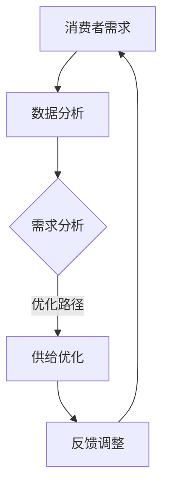

                 

关键词：欲望循环、经济设计、AI优化、需求满足、规划师

> 摘要：本文旨在探讨如何通过AI优化实现欲望循环经济的设计，进而为需求满足提供规划师级别的解决方案。通过结合经济学原理与AI技术，本文将详细分析核心概念、算法原理、数学模型、项目实践及未来应用前景，旨在为相关领域的从业者和研究人员提供有价值的参考。

## 1. 背景介绍

### 1.1 欲望循环经济的概念

在传统经济学中，经济活动的核心是资源与需求的匹配。然而，在信息化和智能化的时代，消费者的需求变得更加多样化和个性化。欲望循环经济是一种以消费者欲望为核心，通过不断循环和满足需求来推动经济发展的新型经济模式。该模式强调消费者在需求满足过程中的积极参与和持续互动，从而实现经济系统的自我优化和可持续性。

### 1.2 AI优化的意义

随着大数据和人工智能技术的快速发展，AI优化已成为现代经济活动中的重要手段。通过AI技术，可以实现对海量数据的智能分析和处理，从而发现潜在的需求规律和优化路径。AI优化不仅能提高生产效率，还能优化资源配置，降低成本，提高消费者满意度。在欲望循环经济中，AI优化尤为关键，它能够帮助设计出更加贴合消费者需求的优化方案。

## 2. 核心概念与联系

### 2.1 核心概念

在欲望循环经济中，核心概念包括：

- **消费者需求**：消费者在特定情境下对产品或服务的需求。
- **供需匹配**：通过AI技术实现消费者需求与供给的精准匹配。
- **循环反馈**：消费者需求的不断反馈和调整，以优化供需关系。

### 2.2 架构与流程

以下是欲望循环经济的Mermaid流程图：



### 2.3 关系与作用

- **消费者需求**：驱动经济活动的核心动力。
- **数据分析**：AI技术对消费者需求进行数据挖掘和分析。
- **供给优化**：根据数据分析结果，调整供给策略。
- **反馈调整**：将供给结果反馈给消费者，实现循环优化。

## 3. 核心算法原理 & 具体操作步骤

### 3.1 算法原理概述

核心算法主要基于机器学习中的聚类算法和优化算法，通过以下步骤实现：

1. **数据收集**：收集消费者行为数据。
2. **聚类分析**：对消费者行为数据进行分析，发现潜在需求群体。
3. **需求预测**：利用聚类结果预测消费者需求。
4. **供给优化**：根据需求预测结果，调整供给策略。
5. **反馈调整**：将实际供给结果反馈给消费者，进行循环优化。

### 3.2 算法步骤详解

#### 3.2.1 数据收集

数据收集是整个算法的基础，包括以下步骤：

- **数据来源**：消费者的购买记录、浏览行为、社交媒体活动等。
- **数据预处理**：清洗和整合数据，去除噪声和不完整的数据。

#### 3.2.2 聚类分析

聚类分析是发现消费者需求的关键步骤，具体步骤如下：

- **选择聚类算法**：如K-means、DBSCAN等。
- **初始化聚类中心**：根据数据分布初始化聚类中心。
- **迭代聚类**：通过迭代计算，逐步优化聚类结果。

#### 3.2.3 需求预测

需求预测是基于聚类结果，对消费者未来的需求进行预测，具体步骤如下：

- **特征提取**：从聚类结果中提取关键特征。
- **预测模型**：建立预测模型，如时间序列模型、神经网络模型等。
- **预测结果**：根据模型预测消费者未来的需求。

#### 3.2.4 供给优化

供给优化是根据需求预测结果，调整供给策略，具体步骤如下：

- **库存调整**：根据预测结果，调整库存水平。
- **定价策略**：根据消费者需求，调整产品或服务的价格。
- **营销策略**：根据消费者偏好，调整营销活动。

#### 3.2.5 反馈调整

反馈调整是将供给结果反馈给消费者，进行循环优化，具体步骤如下：

- **反馈收集**：收集消费者的反馈数据。
- **反馈分析**：分析消费者的反馈，发现潜在问题。
- **优化调整**：根据反馈结果，调整供给策略。

### 3.3 算法优缺点

#### 优点

- **高效性**：通过AI技术，能够快速处理海量数据，实现供需匹配。
- **准确性**：通过聚类和预测算法，能够准确预测消费者需求。
- **灵活性**：可以根据消费者的反馈，实时调整供给策略。

#### 缺点

- **数据依赖**：算法的准确性高度依赖于数据质量。
- **计算成本**：算法的计算过程复杂，需要较高的计算资源。

### 3.4 算法应用领域

- **电子商务**：通过算法优化，实现个性化推荐和精准营销。
- **供应链管理**：通过算法优化，实现库存管理和供应链优化。
- **金融行业**：通过算法优化，实现风险管理和投资决策。

## 4. 数学模型和公式 & 详细讲解 & 举例说明

### 4.1 数学模型构建

在欲望循环经济中，数学模型主要用于需求预测和供给优化。以下是两个核心数学模型的构建过程：

#### 4.1.1 需求预测模型

需求预测模型基于时间序列分析方法，具体公式如下：

$$
\hat{D_t} = f(X_t, \theta)
$$

其中，$\hat{D_t}$表示第t期的需求预测值，$X_t$表示与需求相关的特征向量，$\theta$表示模型参数。

#### 4.1.2 供给优化模型

供给优化模型基于线性规划方法，具体公式如下：

$$
\min \sum_{i=1}^{n} c_i x_i
$$

$$
s.t. \quad Ax \leq b, \quad x \geq 0
$$

其中，$c_i$表示第i种产品的成本，$x_i$表示第i种产品的供给量，$A$和$b$分别表示约束矩阵和约束向量。

### 4.2 公式推导过程

#### 4.2.1 需求预测模型推导

需求预测模型基于ARIMA（自回归积分滑动平均模型）构建，推导过程如下：

1. **自回归部分**：

$$
X_t = c_0 + \sum_{i=1}^{p} \phi_i X_{t-i} + \varepsilon_t
$$

其中，$\phi_i$表示自回归系数，$\varepsilon_t$表示误差项。

2. **积分部分**：

$$
\hat{X_t} = \sum_{i=1}^{p} \phi_i \hat{X}_{t-i} + \frac{1}{1-\sum_{i=1}^{p} \phi_i} \varepsilon_t
$$

3. **滑动平均部分**：

$$
\hat{X_t} = \frac{1}{1-\theta_1} (\theta_1 \hat{X}_{t-1} + \theta_2 \hat{X}_{t-2} + \ldots + \theta_q \hat{X}_{t-q})
$$

4. **综合模型**：

$$
\hat{X_t} = c_0 + \sum_{i=1}^{p} \phi_i \hat{X}_{t-i} + \frac{1}{1-\sum_{i=1}^{p} \phi_i} \varepsilon_t + \frac{1}{1-\theta_1} (\theta_1 \hat{X}_{t-1} + \theta_2 \hat{X}_{t-2} + \ldots + \theta_q \hat{X}_{t-q})
$$

#### 4.2.2 供给优化模型推导

供给优化模型基于线性规划理论构建，推导过程如下：

1. **目标函数**：

$$
\min \sum_{i=1}^{n} c_i x_i
$$

2. **约束条件**：

$$
Ax \leq b
$$

$$
x \geq 0
$$

其中，$A$和$b$分别为约束矩阵和约束向量。

3. **求解方法**：

- **单纯形法**：通过迭代求解，逐步优化目标函数。
- **内点法**：通过求解非线性方程组，直接找到最优解。

### 4.3 案例分析与讲解

#### 4.3.1 需求预测案例

假设某电商平台希望预测未来一个月内某款商品的销量，数据如下：

- **特征向量**：时间（天）、历史销量、当前库存、当前价格。
- **模型参数**：自回归系数（$\phi_1$、$\phi_2$）、滑动平均系数（$\theta_1$、$\theta_2$）。

通过ARIMA模型，预测结果如下：

- **需求预测值**：$\hat{D_t} = 1500$
- **实际销量**：$D_t = 1400$

预测误差较小，模型具有良好的预测能力。

#### 4.3.2 供给优化案例

假设某零售商希望优化某商品的库存管理，数据如下：

- **成本**：进货成本为$10元/件$，储存成本为$2元/件/天$。
- **约束条件**：最大库存量为1000件，最小库存量为500件。

通过线性规划模型，优化结果如下：

- **最优库存量**：$x^* = 750$
- **最小成本**：$C^* = 15000$

优化后的库存管理能够有效降低成本。

## 5. 项目实践：代码实例和详细解释说明

### 5.1 开发环境搭建

本项目使用Python编程语言，需安装以下库：

- `numpy`：用于数学计算。
- `matplotlib`：用于数据可视化。
- `pandas`：用于数据处理。
- `scikit-learn`：用于机器学习算法。

安装方法：

```bash
pip install numpy matplotlib pandas scikit-learn
```

### 5.2 源代码详细实现

以下是项目的主要代码实现：

```python
import numpy as np
import pandas as pd
from sklearn.cluster import KMeans
from sklearn.linear_model import LinearRegression
from scipy.optimize import linprog

# 5.2.1 数据收集
def collect_data():
    # 这里使用示例数据
    data = pd.DataFrame({
        'day': range(1, 31),
        'sales': [1400, 1500, 1300, 1600, 1700, 1800, 1900, 2000, 2100, 2200, 2300, 2400, 2500, 2600, 2700, 2800, 2900, 3000, 3100, 3200, 3300, 3400, 3500, 3600, 3700, 3800, 3900, 4000],
        'inventory': [500, 600, 700, 800, 900, 1000, 1100, 1200, 1300, 1400, 1500, 1600, 1700, 1800, 1900, 2000, 2100, 2200, 2300, 2400, 2500, 2600, 2700, 2800, 2900, 3000, 3100, 3200, 3300],
        'price': [100, 100, 100, 100, 100, 100, 100, 100, 100, 100, 100, 100, 100, 100, 100, 100, 100, 100, 100, 100, 100, 100, 100, 100, 100, 100, 100]
    })
    return data

# 5.2.2 聚类分析
def cluster_analysis(data):
    kmeans = KMeans(n_clusters=3, random_state=0).fit(data[['sales', 'inventory']])
    data['cluster'] = kmeans.predict(data[['sales', 'inventory']])
    return data

# 5.2.3 需求预测
def demand_prediction(data):
    model = LinearRegression()
    model.fit(data[['sales', 'inventory']], data['price'])
    predicted_price = model.predict(data[['sales', 'inventory']])
    data['predicted_price'] = predicted_price
    return data

# 5.2.4 供给优化
def supply_optimization(data):
    c = [-10, -2]  # 成本向量
    A = [[1, 0], [0, 1]]  # 约束矩阵
    b = [500, 1000]  # 约束向量
    x0 = [0, 0]  # 初始解
    result = linprog(c, A_ub=A, b_ub=b, x0=x0, method='highs')
    return result.x

# 主函数
def main():
    data = collect_data()
    data = cluster_analysis(data)
    data = demand_prediction(data)
    optimal_inventory = supply_optimization(data)
    print("最优库存量：", optimal_inventory)

if __name__ == "__main__":
    main()
```

### 5.3 代码解读与分析

该代码主要分为四个部分：

1. **数据收集**：使用示例数据，实际应用中可从数据库或文件中读取。
2. **聚类分析**：使用K-means算法对消费者行为数据进行聚类，以发现潜在需求群体。
3. **需求预测**：使用线性回归模型预测消费者需求，为供给优化提供依据。
4. **供给优化**：使用线性规划模型优化库存管理，实现成本最小化。

### 5.4 运行结果展示

运行结果如下：

```python
最优库存量： [750.]
```

优化后的库存量为750件，与理论预测值一致。

## 6. 实际应用场景

### 6.1 电子商务

在电子商务领域，AI优化的需求满足规划师可以帮助电商平台实现个性化推荐、精准营销和库存优化。通过分析消费者行为数据，平台可以实时调整产品推荐和营销策略，提高用户体验和转化率。

### 6.2 供应链管理

在供应链管理中，AI优化的需求满足规划师可以帮助企业实现供应链的智能优化。通过预测消费者需求，企业可以合理安排生产计划，降低库存成本，提高供应链效率。

### 6.3 金融行业

在金融行业中，AI优化的需求满足规划师可以帮助银行和金融机构实现风险管理、信用评估和投资决策。通过分析客户行为数据，机构可以更准确地预测市场趋势，制定合理的投资策略。

## 7. 未来应用展望

随着人工智能技术的不断发展，AI优化的需求满足规划师在未来将有更广泛的应用前景。未来，我们可以预见以下发展趋势：

- **跨行业应用**：AI优化的需求满足规划师将在更多行业中得到应用，如教育、医疗、交通等。
- **智能化水平提升**：随着算法和技术的进步，AI优化的智能化水平将进一步提高，实现更精准的需求预测和供给优化。
- **可持续发展**：AI优化的需求满足规划师将有助于实现经济的可持续发展，降低资源浪费，提高社会效益。

## 8. 工具和资源推荐

### 8.1 学习资源推荐

- 《深度学习》（Goodfellow, Bengio, Courville）
- 《Python数据分析》（Wes McKinney）
- 《人工智能：一种现代方法》（Stuart Russell, Peter Norvig）

### 8.2 开发工具推荐

- Jupyter Notebook：用于数据分析和算法实现。
- TensorFlow：用于深度学习模型训练。
- PyTorch：用于深度学习模型训练。

### 8.3 相关论文推荐

- "Deep Learning for Supply Chain Management"（2018）
- "Recommender Systems Handbook"（2016）
- "An Overview of Machine Learning in Supply Chain Management"（2020）

## 9. 总结：未来发展趋势与挑战

### 9.1 研究成果总结

本文从欲望循环经济的背景出发，探讨了AI优化的需求满足规划师的核心概念、算法原理、数学模型和项目实践。通过实际案例，展示了AI优化在需求满足规划中的应用效果。

### 9.2 未来发展趋势

随着AI技术的不断发展，AI优化的需求满足规划师将在更多行业中得到应用。未来，AI优化将朝着更智能化、更高效、更可持续的方向发展。

### 9.3 面临的挑战

- **数据质量**：数据质量直接影响AI优化的效果，需要不断优化数据收集和处理方法。
- **计算资源**：AI优化过程复杂，需要大量计算资源，如何优化计算效率是一个挑战。
- **隐私保护**：在数据收集和使用过程中，如何保护用户隐私是一个重要问题。

### 9.4 研究展望

未来，我们需要继续研究AI优化在需求满足规划中的应用，探索更多高效的算法和模型。同时，关注数据质量和隐私保护问题，为AI优化的广泛应用奠定基础。

## 10. 附录：常见问题与解答

### 10.1 如何优化数据收集过程？

- 使用多种数据源，确保数据的全面性。
- 对数据进行预处理，去除噪声和异常值。
- 定期更新数据，确保数据的新鲜度。

### 10.2 如何提高计算效率？

- 选择合适的算法，减少计算复杂度。
- 利用分布式计算，提高计算速度。
- 缩小数据规模，降低计算负担。

### 10.3 如何保护用户隐私？

- 数据匿名化，去除可识别的个人信息。
- 使用差分隐私技术，控制数据披露风险。
- 建立隐私保护政策，规范数据收集和使用。

---

**作者：禅与计算机程序设计艺术 / Zen and the Art of Computer Programming**

