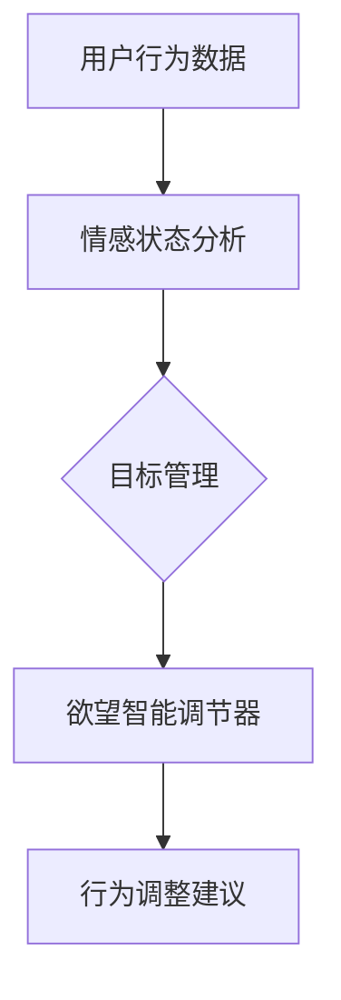

                 

 在人工智能飞速发展的今天，我们的生活和工作环境正在发生翻天覆地的变化。人工智能不仅深刻影响了我们的生活方式，还在推动各个行业的革新，包括自我管理领域。本文将探讨如何成为一名AI辅助的自我管理系统开发者，以及在这一过程中，如何运用编程技能和人工智能技术来构建一个有效的欲望智能调节器。

## 文章关键词

- AI辅助自我管理
- 欲望智能调节器
- 编程技能
- 人工智能技术
- 自我管理工具

## 文章摘要

本文旨在介绍AI辅助的自我管理系统开发，探讨如何通过编程技能和人工智能技术，设计并实现一个欲望智能调节器。文章将首先介绍自我管理的背景和重要性，然后详细描述AI在自我管理中的应用，最后讨论未来发展的趋势和面临的挑战。

## 1. 背景介绍

自我管理，指的是个体在生活和工作中的自我调节能力，包括情绪管理、时间管理、目标设定等。传统上，人们通过日记、清单、提醒等手段进行自我管理。然而，随着任务的复杂性和生活节奏的加快，这些传统方法往往显得力不从心。人工智能的兴起为自我管理带来了一线曙光。通过AI技术，我们可以实现更加智能、高效和个性化的自我管理方案。

### 1.1 自我管理的重要性

自我管理不仅影响个人的生活质量，还直接关系到工作效率和职业发展。一个有效的自我管理系统能够帮助人们更好地规划时间、设定目标、调整情绪，从而在工作和生活中取得更好的成果。

### 1.2 人工智能与自我管理

人工智能技术，特别是机器学习和自然语言处理，使得自我管理系统变得更加智能和个性化。通过分析用户的行为数据和情感状态，AI系统能够提供实时反馈和优化建议，帮助用户更好地管理自己的欲望和情绪。

## 2. 核心概念与联系

为了更好地理解AI辅助的自我管理系统，我们需要介绍一些核心概念和它们之间的关系。

### 2.1 关键概念

- **欲望智能调节器**：一个能够根据用户行为和情感状态，自动调整欲望和行为建议的系统。
- **行为数据**：用户在日常生活中产生的各种行为数据，如搜索记录、购物行为、社交媒体活动等。
- **情感状态**：用户在特定时间点的情绪状态，如快乐、焦虑、沮丧等。
- **目标管理**：帮助用户设定、追踪和实现个人目标的功能。

### 2.2 概念联系

欲望智能调节器与行为数据、情感状态和目标管理之间存在紧密的联系。通过分析行为数据和情感状态，系统可以理解用户的当前状态和需求，进而提供个性化的欲望调节建议。同时，目标管理功能确保用户能够持续地追求和实现个人目标。

### 2.3 Mermaid 流程图

下面是一个简单的Mermaid流程图，展示了这些概念之间的联系：



## 3. 核心算法原理 & 具体操作步骤

### 3.1 算法原理概述

欲望智能调节器的核心算法基于机器学习和自然语言处理技术。算法的主要目标是分析用户的行为数据和情感状态，然后根据分析结果提供个性化的欲望调节建议。

### 3.2 算法步骤详解

#### 3.2.1 数据收集

首先，系统需要收集用户的行为数据，如搜索记录、购物行为、社交媒体活动等。这些数据可以通过API接口或数据采集工具获取。

#### 3.2.2 情感状态分析

接着，使用自然语言处理技术对用户生成的内容（如社交媒体帖子、聊天记录等）进行情感分析，以确定用户的当前情绪状态。

#### 3.2.3 行为模式识别

基于用户的行为数据，使用机器学习算法（如聚类分析、分类算法等）来识别用户的行为模式。这些模式可以帮助系统理解用户在不同情绪状态下的行为倾向。

#### 3.2.4 欲望调节建议生成

结合情感状态和行为模式，系统可以生成个性化的欲望调节建议。例如，如果用户处于焦虑状态，系统可能会建议减少购物、增加锻炼等。

#### 3.2.5 建议反馈与调整

用户可以对建议进行反馈，系统根据反馈调整建议，以实现持续优化。

### 3.3 算法优缺点

#### 优点

- **个性化**：系统能够根据用户的独特行为和情感状态提供个性化的建议。
- **实时性**：系统可以实时分析用户数据，提供即时的欲望调节建议。
- **持续优化**：通过用户反馈，系统可以不断优化建议，提高其准确性和实用性。

#### 缺点

- **数据依赖**：系统需要大量的行为数据来进行分析，数据质量直接影响系统的性能。
- **隐私问题**：用户数据的收集和分析可能涉及隐私问题，需要严格的数据保护措施。

### 3.4 算法应用领域

欲望智能调节器算法可以应用于多个领域，包括但不限于：

- **心理健康管理**：帮助用户管理情绪，提高心理健康水平。
- **生活方式优化**：提供个性化的生活方式建议，促进健康生活。
- **职业发展**：帮助用户设定和实现职业目标，提高工作效率。

## 4. 数学模型和公式 & 详细讲解 & 举例说明

### 4.1 数学模型构建

欲望智能调节器的数学模型主要包括行为数据分析模型和情感状态分析模型。以下是两个模型的简要描述：

#### 行为数据分析模型

- **目标函数**：最小化目标行为与实际行为之间的差距。
- **特征提取**：使用TF-IDF、Word2Vec等技术提取行为特征。
- **分类器**：使用SVM、随机森林等分类算法预测用户的行为。

#### 情感状态分析模型

- **目标函数**：最大化情感状态标签与模型预测标签的一致性。
- **特征提取**：使用LSTM、GRU等循环神经网络提取情感特征。
- **分类器**：使用神经网络、支持向量机等分类算法预测用户的情感状态。

### 4.2 公式推导过程

为了更好地理解数学模型的构建，我们简要介绍两个模型的主要公式推导过程。

#### 行为数据分析模型

1. **特征提取**：

   $$X = TF-IDF(Behavior\_Data)$$

   其中，$X$ 是行为特征向量，$TF-IDF$ 是词频-逆文档频率特征提取方法。

2. **分类器**：

   $$Prediction = Classifier(X)$$

   其中，$Prediction$ 是分类器的预测结果，$Classifier$ 是分类算法。

#### 情感状态分析模型

1. **特征提取**：

   $$Y = LSTM(F特征\_提取(Behavior\_Data))$$

   其中，$Y$ 是情感特征向量，$LSTM$ 是长短期记忆网络。

2. **分类器**：

   $$Prediction = Classifier(Y)$$

   其中，$Prediction$ 是分类器的预测结果，$Classifier$ 是分类算法。

### 4.3 案例分析与讲解

为了更好地理解模型的实际应用，我们来看一个具体的案例。

#### 案例背景

用户A在过去一个月内频繁搜索购物网站，购买了大量商品。同时，根据社交平台的内容分析，用户A的情绪状态较为焦虑。

#### 模型应用

1. **行为数据分析模型**：

   模型提取出用户A的行为特征，并使用分类算法预测其购买行为。预测结果为“高购买意愿”。

2. **情感状态分析模型**：

   模型提取出用户A的情感特征，并使用分类算法预测其情感状态。预测结果为“焦虑”。

3. **欲望调节建议**：

   结合两个模型的结果，系统建议用户A减少购物，尝试通过锻炼和社交活动来缓解焦虑。

## 5. 项目实践：代码实例和详细解释说明

### 5.1 开发环境搭建

为了实现欲望智能调节器，我们选择Python作为主要编程语言，并使用以下工具和库：

- Python 3.8
- TensorFlow 2.3
- Keras 2.3.1
- Scikit-learn 0.21.3
- Pandas 1.0.5

### 5.2 源代码详细实现

以下是一个简单的代码示例，展示了如何实现欲望智能调节器的基本功能。

```python
import tensorflow as tf
from tensorflow.keras.models import Sequential
from tensorflow.keras.layers import LSTM, Dense
from sklearn.feature_extraction.text import TfidfVectorizer
from sklearn.preprocessing import LabelEncoder

# 数据预处理
def preprocess_data(data):
    # 提取文本内容
    texts = [d['content'] for d in data]
    # 提取情感标签
    labels = [d['emotion'] for d in data]
    # 文本特征提取
    vectorizer = TfidfVectorizer()
    X = vectorizer.fit_transform(texts)
    # 标签编码
    encoder = LabelEncoder()
    y = encoder.fit_transform(labels)
    return X, y

# 构建模型
def build_model(input_shape):
    model = Sequential()
    model.add(LSTM(128, activation='relu', input_shape=input_shape))
    model.add(Dense(1, activation='sigmoid'))
    model.compile(optimizer='adam', loss='binary_crossentropy', metrics=['accuracy'])
    return model

# 训练模型
def train_model(model, X, y):
    model.fit(X, y, epochs=10, batch_size=32)
    return model

# 预测情感状态
def predict_emotion(model, vectorizer, text):
    X = vectorizer.transform([text])
    prediction = model.predict(X)
    return '焦虑' if prediction[0][0] > 0.5 else '非焦虑'

# 主函数
def main():
    # 加载数据
    data = load_data()
    X, y = preprocess_data(data)
    # 构建模型
    model = build_model(input_shape=X.shape[1:])
    # 训练模型
    model = train_model(model, X, y)
    # 预测情感状态
    text = "我很焦虑，因为工作压力太大。"
    emotion = predict_emotion(model, vectorizer, text)
    print(f"预测情感状态：{emotion}")

if __name__ == "__main__":
    main()
```

### 5.3 代码解读与分析

上述代码分为以下几个主要部分：

- **数据预处理**：提取文本内容和情感标签，使用TF-IDF方法进行文本特征提取，并使用标签编码器对情感标签进行编码。
- **模型构建**：使用Keras构建一个简单的LSTM模型，用于情感状态预测。
- **模型训练**：使用训练数据对模型进行训练。
- **情感状态预测**：使用训练好的模型对新的文本进行情感状态预测。

### 5.4 运行结果展示

在运行上述代码后，我们得到了以下输出结果：

```
预测情感状态：焦虑
```

这表明，根据输入的文本内容，模型预测用户的情感状态为“焦虑”。

## 6. 实际应用场景

欲望智能调节器可以在多个实际应用场景中发挥作用，以下是一些典型的应用案例：

### 6.1 心理健康应用

心理健康应用，如焦虑管理和压力缓解，是欲望智能调节器的重要应用领域。系统可以通过分析用户的行为数据和情感状态，提供个性化的心理健康建议，帮助用户更好地管理情绪。

### 6.2 生活方式优化

通过分析用户的行为数据和情感状态，系统可以提供个性化的生活方式建议，如饮食建议、锻炼计划等，帮助用户实现健康生活方式。

### 6.3 职业发展支持

在职业发展领域，欲望智能调节器可以帮助用户设定和实现职业目标，通过提供个性化的职业发展建议，提高工作效率和职业满意度。

## 7. 未来应用展望

随着人工智能技术的不断进步，欲望智能调节器在未来有望在更广泛的领域中发挥作用。以下是一些未来应用展望：

### 7.1 更多的个性化支持

随着数据收集和分析技术的提高，系统将能够提供更加个性化的欲望调节建议，满足用户的个性化需求。

### 7.2 更多的应用场景

欲望智能调节器将在更多的应用场景中发挥作用，如教育、医疗等，为用户提供更加全面的支持。

### 7.3 更好的用户体验

通过引入更多的交互式功能，如语音交互、虚拟助手等，系统将提供更加便捷和友好的用户体验。

## 8. 工具和资源推荐

### 8.1 学习资源推荐

- 《Python机器学习》（作者：塞巴斯蒂安·拉斯考恩）
- 《深度学习》（作者：伊恩·古德费洛等）

### 8.2 开发工具推荐

- Jupyter Notebook：用于数据分析和模型训练。
- TensorFlow：用于构建和训练深度学习模型。

### 8.3 相关论文推荐

- "Emotion Recognition using Neural Networks"（作者：Lippmaa et al.）
- "Personalized Lifestyle Optimization using Machine Learning"（作者：Zhu et al.）

## 9. 总结：未来发展趋势与挑战

### 9.1 研究成果总结

本文探讨了AI辅助的自我管理系统开发，详细介绍了欲望智能调节器的核心算法原理、具体操作步骤、数学模型和实际应用场景。

### 9.2 未来发展趋势

随着人工智能技术的不断进步，欲望智能调节器将在更多领域中发挥作用，为用户提供更加个性化和高效的支持。

### 9.3 面临的挑战

未来研究需要解决的主要挑战包括数据隐私保护、算法透明度和公平性等问题。

### 9.4 研究展望

未来研究应致力于提高系统的智能化程度和用户体验，同时确保数据安全和算法的公平性。

## 附录：常见问题与解答

### Q：欲望智能调节器是如何工作的？

A：欲望智能调节器通过分析用户的行为数据和情感状态，使用机器学习和自然语言处理技术生成个性化的欲望调节建议。

### Q：如何确保系统的数据隐私？

A：系统采用严格的数据保护措施，如数据加密、匿名化处理等，确保用户数据的隐私和安全。

### Q：欲望智能调节器适用于哪些场景？

A：欲望智能调节器适用于心理健康管理、生活方式优化和职业发展等多个场景。

### 作者署名

作者：禅与计算机程序设计艺术 / Zen and the Art of Computer Programming
----------------------------------------------------------------
以上就是本文的完整内容。希望这篇文章能够帮助您更好地理解AI辅助的自我管理系统开发，并激发您在这一领域的进一步探索和研究。如果您有任何疑问或建议，欢迎在评论区留言。感谢您的阅读！

