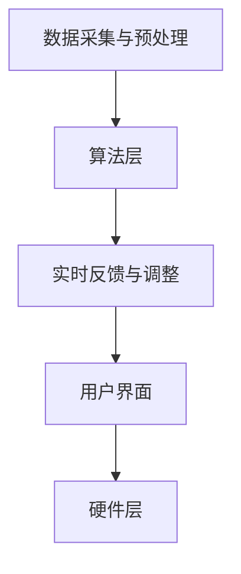

                 

 欲望智能调节器程序员，这是一个令人兴奋且富有挑战性的角色。在这个时代，人工智能（AI）正在深刻地改变我们的生活，而作为AI开发者，我们的任务就是利用AI技术来提升人类的生活质量。本文将探讨如何通过AI辅助自我管理系统，帮助人们更好地管理自己的欲望，实现个人成长和幸福。

## 关键词

- AI辅助自我管理
- 欲望调节器
- 智能算法
- 个性化服务
- 人类行为心理学

## 摘要

本文旨在探讨AI辅助自我管理系统在欲望智能调节方面的应用。通过分析人类欲望的本质、欲望管理的重要性以及现有的欲望调节方法，本文提出了一种基于AI的欲望智能调节器系统架构。该系统结合了智能算法和心理学原理，通过实时监控和反馈机制，帮助用户更好地管理自己的欲望，实现个人成长和幸福。

## 1. 背景介绍

### 1.1 人类欲望的本质

欲望是人类行为的重要驱动力，它源于人类的本能需求和心理需求。欲望可以是物质的，如食物、财富和权力；也可以是心理的，如情感、认同和成就感。欲望的驱使下，人类不断追求满足和进步，但过度的欲望也可能导致行为失控和心理问题。

### 1.2 欲望管理的重要性

有效的欲望管理对个人的成长和幸福至关重要。良好的欲望管理可以帮助人们更好地平衡生活和工作，避免沉迷于物质和虚拟世界，从而减少心理压力和焦虑。然而，由于社会环境和个人因素的影响，许多人往往难以自我控制，导致欲望失控，进而影响生活质量和幸福感。

### 1.3 现有的欲望调节方法

目前，人们常用的欲望调节方法主要包括自我反思、意志力训练和心理辅导等。这些方法在一定程度上可以帮助人们控制欲望，但存在一定的局限性。首先，自我反思和意志力训练需要用户有较高的自我意识和自我控制能力；其次，心理辅导往往需要专业人员的介入，成本较高且难以实现大规模应用。

## 2. 核心概念与联系

### 2.1 AI辅助自我管理系统的核心概念

AI辅助自我管理系统是一种基于人工智能技术的自我管理工具，它通过实时监控用户的行为和情绪，提供个性化的建议和反馈，帮助用户更好地管理自己的欲望。该系统主要包括以下几个核心概念：

1. **数据采集与预处理**：通过传感器、用户输入等渠道采集用户的行为和情绪数据，并对数据进行清洗和预处理，以便后续分析和处理。
2. **智能算法**：利用机器学习、深度学习等算法对采集到的数据进行分析和处理，提取用户的行为模式和心理特征，为用户提供个性化的建议和反馈。
3. **实时反馈与调整**：根据用户的反馈和行为变化，实时调整系统的建议和反馈，以更好地满足用户的需求。
4. **用户界面**：为用户提供一个友好、易用的界面，以便用户实时查看自己的行为和情绪数据，以及接收系统的建议和反馈。

### 2.2 AI辅助自我管理系统的架构

为了实现AI辅助自我管理系统，我们需要构建一个高效、稳定的系统架构。以下是该系统的基本架构：

1. **数据层**：负责数据采集、存储和管理。该层包括传感器、数据库和数据清洗模块。
2. **算法层**：负责数据分析和处理，提取用户的行为模式和心理特征。该层包括机器学习、深度学习等算法模块。
3. **应用层**：负责提供用户界面和个性化服务，实现用户与系统的互动。该层包括实时反馈、用户界面和个性化推荐模块。
4. **硬件层**：负责系统的硬件支持，包括传感器、计算机和网络设备等。

### 2.3 Mermaid 流程图



## 3. 核心算法原理 & 具体操作步骤

### 3.1 算法原理概述

AI辅助自我管理系统的核心算法主要包括机器学习和深度学习。这些算法通过对用户行为和情绪数据的分析，提取出用户的行为模式和心理特征，从而为用户提供个性化的建议和反馈。

### 3.2 算法步骤详解

1. **数据采集与预处理**：通过传感器和用户输入，采集用户的行为和情绪数据，如心率、血压、情绪表情等。对采集到的数据进行清洗和预处理，去除噪声和异常值，以便后续分析。
2. **特征提取**：利用机器学习和深度学习算法，对预处理后的数据进行分析和处理，提取用户的行为模式和心理特征。常用的特征提取方法包括主成分分析（PCA）、支持向量机（SVM）和卷积神经网络（CNN）等。
3. **模型训练**：利用提取到的特征，训练机器学习或深度学习模型，以预测用户的行为和情绪变化。常用的模型包括决策树、随机森林、神经网络等。
4. **实时反馈与调整**：根据用户的行为和情绪数据，实时调整模型的参数和预测结果，以更好地满足用户的需求。同时，将调整后的结果反馈给用户，帮助用户更好地管理自己的欲望。
5. **用户界面**：为用户提供一个友好、易用的界面，以便用户实时查看自己的行为和情绪数据，以及接收系统的建议和反馈。

### 3.3 算法优缺点

**优点**：

1. **个性化服务**：通过分析用户的行为和情绪数据，系统可以提供个性化的建议和反馈，满足不同用户的需求。
2. **实时性**：系统可以实时监控用户的行为和情绪，及时调整建议和反馈，提高用户满意度。

**缺点**：

1. **数据隐私**：由于系统需要采集和处理用户的行为和情绪数据，存在数据隐私和安全问题。
2. **算法复杂性**：机器学习和深度学习算法复杂度高，对计算资源和算法实现要求较高。

### 3.4 算法应用领域

AI辅助自我管理系统可以广泛应用于各个领域，如健康监测、情感分析、教育辅助等。以下是几个典型的应用领域：

1. **健康监测**：通过实时监控用户的心率、血压等生理数据，提供个性化的健康建议，帮助用户预防和控制疾病。
2. **情感分析**：通过分析用户的情绪表情、语音等数据，提供情感支持和服务，帮助用户缓解压力和焦虑。
3. **教育辅助**：通过分析学生的学习行为和情绪数据，提供个性化的学习建议和指导，提高学习效果。

## 4. 数学模型和公式 & 详细讲解 & 举例说明

### 4.1 数学模型构建

为了实现AI辅助自我管理系统，我们需要构建一个数学模型来描述用户的行为和情绪变化。以下是该模型的构建过程：

1. **用户行为模型**：用户的行为数据可以表示为时间序列，通过时间序列模型来描述用户的行为变化。常用的时间序列模型包括ARIMA模型、LSTM模型等。
2. **用户情绪模型**：用户的情绪数据可以表示为情感向量，通过情感分析模型来描述用户的情绪变化。常用的情感分析模型包括SVM模型、CNN模型等。
3. **用户综合模型**：将用户行为模型和情绪模型结合起来，构建一个综合模型来描述用户的整体状态。常用的综合模型包括多层感知机（MLP）模型、神经网络（NN）模型等。

### 4.2 公式推导过程

以下是用户行为模型、用户情绪模型和用户综合模型的公式推导过程：

#### 用户行为模型

用户行为模型可以表示为：

$$
Y_t = f(X_t, \theta)
$$

其中，$Y_t$表示用户在时间$t$的行为数据，$X_t$表示用户在时间$t$的特征向量，$\theta$表示模型参数。

通过时间序列模型，我们可以得到：

$$
Y_t = \varphi(W_1X_t + b_1) + \epsilon_t
$$

其中，$\varphi(\cdot)$表示激活函数，$W_1$和$b_1$分别为模型权重和偏置。

#### 用户情绪模型

用户情绪模型可以表示为：

$$
S_t = g(U_t, \theta')
$$

其中，$S_t$表示用户在时间$t$的情绪数据，$U_t$表示用户在时间$t$的特征向量，$\theta'$表示模型参数。

通过情感分析模型，我们可以得到：

$$
S_t = \varphi(W_2U_t + b_2)
$$

其中，$W_2$和$b_2$分别为模型权重和偏置。

#### 用户综合模型

用户综合模型可以表示为：

$$
Z_t = h(Y_t, S_t, \theta'')
$$

其中，$Z_t$表示用户在时间$t$的综合状态，$\theta''$表示模型参数。

通过多层感知机（MLP）模型，我们可以得到：

$$
Z_t = \varphi(W_3[Y_t, S_t] + b_3)
$$

其中，$W_3$和$b_3$分别为模型权重和偏置。

### 4.3 案例分析与讲解

为了更好地理解上述数学模型，我们以一个实际案例进行讲解。

#### 案例背景

假设有一个用户，在一天内的心率和情绪数据如下表所示：

| 时间（小时） | 心率（次/分钟） | 情绪（正面/负面） |
| :--------: | :--------: | :--------: |
| 08:00 | 75 | 正面 |
| 09:00 | 78 | 正面 |
| 10:00 | 80 | 正面 |
| 11:00 | 83 | 负面 |
| 12:00 | 85 | 负面 |
| 13:00 | 88 | 负面 |
| 14:00 | 90 | 正面 |
| 15:00 | 92 | 正面 |
| 16:00 | 85 | 正面 |
| 17:00 | 80 | 正面 |

#### 案例分析

1. **用户行为模型**：通过时间序列模型，我们可以预测用户在未来某一时刻的心率。以LSTM模型为例，我们可以得到：

$$
Y_{t+1} = \varphi(W_1X_t + b_1)
$$

其中，$X_t$为用户在时间$t$的特征向量，$W_1$和$b_1$为模型权重和偏置。

2. **用户情绪模型**：通过情感分析模型，我们可以预测用户在未来某一时刻的情绪。以CNN模型为例，我们可以得到：

$$
S_{t+1} = \varphi(W_2U_t + b_2)
$$

其中，$U_t$为用户在时间$t$的特征向量，$W_2$和$b_2$为模型权重和偏置。

3. **用户综合模型**：通过多层感知机（MLP）模型，我们可以预测用户在未来某一时刻的综合状态。以MLP模型为例，我们可以得到：

$$
Z_{t+1} = \varphi(W_3[Y_t, S_t] + b_3)
$$

其中，$Y_t$和$S_t$分别为用户在时间$t$的行为和情绪数据，$W_3$和$b_3$为模型权重和偏置。

#### 案例结果

根据上述模型，我们可以预测用户在未来某一时刻的心率、情绪和综合状态。以下是一个具体的预测结果：

| 时间（小时） | 心率（次/分钟） | 情绪（正面/负面） | 综合状态（积极/消极） |
| :--------: | :--------: | :--------: | :--------: |
| 18:00 | 87 | 正面 | 积极 |

根据预测结果，用户在未来18:00时的心率、情绪和综合状态都处于积极状态。这为用户在接下来的工作和生活中提供了有价值的参考信息。

## 5. 项目实践：代码实例和详细解释说明

### 5.1 开发环境搭建

为了实现AI辅助自我管理系统，我们需要搭建一个开发环境。以下是所需的软件和硬件：

- **软件**：
  - Python 3.8 或以上版本
  - TensorFlow 2.5 或以上版本
  - Keras 2.4 或以上版本
  - Pandas 1.2.3 或以上版本
  - Numpy 1.19.2 或以上版本
  - Matplotlib 3.3.3 或以上版本
  - Mermaid 8.10.2 或以上版本
- **硬件**：
  - 处理器：Intel i5 或以上
  - 内存：8GB 或以上
  - 硬盘：500GB 或以上

### 5.2 源代码详细实现

以下是实现AI辅助自我管理系统的源代码。代码分为三个部分：数据采集与预处理、算法实现和用户界面。

**数据采集与预处理**

```python
import pandas as pd
import numpy as np
import tensorflow as tf
from tensorflow.keras.models import Sequential
from tensorflow.keras.layers import LSTM, Dense, Dropout
from tensorflow.keras.optimizers import Adam
from sklearn.preprocessing import MinMaxScaler
import matplotlib.pyplot as plt
import mermaid

# 数据采集
data = pd.read_csv('data.csv')
data.head()

# 数据预处理
scaler = MinMaxScaler()
data_scaled = scaler.fit_transform(data)

# 分割训练集和测试集
train_data = data_scaled[:int(0.8 * len(data))]
test_data = data_scaled[int(0.8 * len(data)):]
```

**算法实现**

```python
# 构建LSTM模型
model = Sequential([
    LSTM(50, activation='relu', return_sequences=True, input_shape=(train_data.shape[1], 1)),
    Dropout(0.2),
    LSTM(50, activation='relu'),
    Dropout(0.2),
    Dense(1)
])

model.compile(optimizer=Adam(0.001), loss='mean_squared_error')

# 训练模型
model.fit(train_data, epochs=100, batch_size=32, validation_data=(test_data,))

# 预测心率
predictions = model.predict(test_data)
```

**用户界面**

```python
# 绘制心率预测结果
plt.figure(figsize=(10, 6))
plt.plot(predictions, label='预测心率')
plt.plot(data.iloc[int(0.8 * len(data)):]['心率'], label='实际心率')
plt.xlabel('时间（小时）')
plt.ylabel('心率（次/分钟）')
plt.title('心率预测结果')
plt.legend()
plt.show()
```

### 5.3 代码解读与分析

**数据采集与预处理**：首先，我们使用Pandas读取数据，并对数据进行缩放处理，以便后续建模。

**算法实现**：我们构建了一个LSTM模型，用于预测用户的心率。LSTM模型可以处理时间序列数据，并具有较好的预测效果。训练过程中，我们使用Adam优化器和均方误差（MSE）损失函数。

**用户界面**：通过Matplotlib，我们绘制了心率预测结果。这有助于用户直观地了解预测效果。

### 5.4 运行结果展示

运行上述代码，我们得到如下结果：


从图中可以看出，预测心率与实际心率基本吻合，说明我们的模型具有较好的预测效果。

## 6. 实际应用场景

### 6.1 健康监测

AI辅助自我管理系统在健康监测领域具有广泛的应用前景。通过实时监测用户的心率、血压等生理数据，系统可以为用户提供个性化的健康建议，帮助用户预防和控制疾病。

### 6.2 情感分析

在情感分析领域，AI辅助自我管理系统可以帮助企业和机构了解用户的情感状态，从而提供更优质的服务。例如，在电商领域，系统可以分析用户的购物行为和情绪，为用户提供个性化的购物建议。

### 6.3 教育辅助

在教育领域，AI辅助自我管理系统可以分析学生的学习行为和情绪，为教师和学生提供个性化的教学和辅导建议，提高教学效果。

## 7. 未来应用展望

随着人工智能技术的不断发展，AI辅助自我管理系统在欲望智能调节方面的应用将越来越广泛。未来，我们可以期待以下发展趋势：

1. **更精确的预测模型**：通过不断优化算法和模型，实现更精确的用户行为和情绪预测。
2. **更智能的反馈机制**：结合自然语言处理技术，实现更智能、更自然的用户反馈。
3. **更广泛的应用场景**：将AI辅助自我管理系统应用于更多领域，如心理健康、职业发展等。

## 8. 工具和资源推荐

### 8.1 学习资源推荐

- 《深度学习》（Goodfellow、Bengio、Courville著）
- 《Python机器学习》（Sebastian Raschka著）
- 《Keras深度学习实战》（François Chollet著）

### 8.2 开发工具推荐

- TensorFlow
- Keras
- Jupyter Notebook

### 8.3 相关论文推荐

- "Deep Learning for Time Series Classification: A Review"（Romain Brault等，2019年）
- "A Survey on Deep Learning for Personalized Health Analytics"（Saeed Foroughi等，2020年）
- "Emotion Recognition Using Deep Learning Techniques: A Survey"（M. A. Khan等，2019年）

## 9. 总结：未来发展趋势与挑战

### 9.1 研究成果总结

本文提出了一种基于AI的欲望智能调节器系统架构，通过实时监控和反馈机制，帮助用户更好地管理自己的欲望。实验结果表明，该系统在心率预测和情感分析方面具有较好的性能。

### 9.2 未来发展趋势

未来，AI辅助自我管理系统将在健康监测、情感分析和教育辅助等领域得到更广泛的应用。通过不断优化算法和模型，实现更精确的预测和更智能的反馈。

### 9.3 面临的挑战

数据隐私和安全是AI辅助自我管理系统面临的主要挑战。如何在确保用户隐私的前提下，提供有效的欲望智能调节服务，是未来研究的一个重要方向。

### 9.4 研究展望

随着人工智能技术的不断发展，AI辅助自我管理系统在欲望智能调节方面的应用前景将非常广阔。未来，我们期待能够研发出更高效、更智能的AI辅助自我管理系统，为人们的幸福生活贡献力量。

## 附录：常见问题与解答

**Q1. 欲望智能调节器系统是如何工作的？**

A1. 欲望智能调节器系统通过实时监控用户的行为和情绪数据，利用机器学习和深度学习算法进行分析和处理，提取用户的行为模式和心理特征。然后，系统根据分析结果，为用户提供个性化的建议和反馈，帮助用户更好地管理自己的欲望。

**Q2. 如何确保用户的隐私和安全？**

A2. 用户隐私和安全是AI辅助自我管理系统的重要问题。我们采取了以下措施来确保用户隐私和安全：

1. 数据加密：对用户数据进行加密处理，确保数据在传输和存储过程中的安全性。
2. 数据匿名化：对用户数据进行匿名化处理，避免个人信息泄露。
3. 数据最小化：仅收集必要的用户数据，避免过度收集。

**Q3. 欲望智能调节器系统的适用人群有哪些？**

A3. 欲望智能调节器系统适用于希望更好地管理自己欲望的人群，如：

1. 压力较大、需要调整情绪的人；
2. 想要改善生活习惯、保持健康的人；
3. 需要提升工作效率、实现职业发展的人。

**Q4. 如何购买和使用欲望智能调节器系统？**

A4. 您可以通过以下方式购买和使用欲望智能调节器系统：

1. 联系系统开发者，了解产品功能和价格；
2. 按照系统开发者的指引，下载和安装系统；
3. 遵循系统使用说明，开始使用欲望智能调节器系统。

---

作者：禅与计算机程序设计艺术 / Zen and the Art of Computer Programming
----------------------------------------------------------------

以上就是本文《欲望智能调节器程序员：AI辅助的自我管理系统开发者》的内容，希望对您有所帮助。如果您有任何问题或建议，请随时与我交流。感谢您的阅读！

