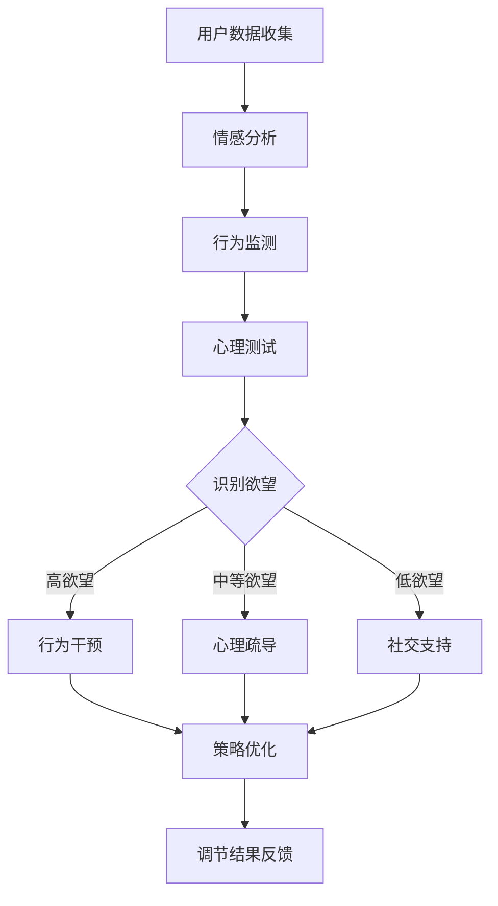

                 

关键词：AI自我管理、欲望调节、智能平台、自我控制、行为干预

> 摘要：本文将探讨如何利用人工智能技术构建一个旨在帮助用户管理和调节欲望的智能平台。该平台将基于深度学习算法和强化学习理论，提供个性化的欲望调节策略，旨在帮助用户提高自我控制能力，实现更加健康和平衡的生活方式。

## 1. 背景介绍

在当今快节奏、信息爆炸的社会中，人们面临着越来越多的欲望诱惑。从物质消费到社交媒体，从电子游戏到虚拟现实，这些欲望不仅消耗了大量的时间和精力，还可能导致情绪波动、心理健康问题和人际关系冲突。传统的方法，如自我控制和意志力训练，往往在应对复杂和多变的欲望环境时显得力不从心。

人工智能（AI）技术的发展为解决这一问题提供了新的可能。通过机器学习和深度学习算法，AI可以分析用户的欲望模式，识别潜在的欲望触发因素，并提供个性化的调节策略。这种技术不仅能够提高用户的自我控制能力，还能够提供即时的反馈和支持，帮助用户在日常生活中更好地管理欲望。

本文旨在设计并实现一个基于AI的智能调节系统，帮助用户识别和调节过度的欲望，从而提高自我控制能力，改善生活质量。

## 2. 核心概念与联系

### 2.1. 欲望识别

欲望识别是智能调节系统的第一步。通过收集用户的行为数据、情绪状态和心理活动，AI可以识别出用户当前的主要欲望类型和强度。常用的技术包括：

- **情感分析**：利用自然语言处理技术分析用户在社交媒体、日记或聊天记录中的情绪表达，识别潜在的欲望。

- **行为监测**：通过智能手机或可穿戴设备的传感器数据，监测用户的行为习惯，如消费、运动、睡眠等，识别欲望活动模式。

- **心理测试**：结合心理学测试工具，评估用户的欲望强度和类型。

### 2.2. 欲望调节策略

一旦识别出用户的欲望，系统需要根据用户的个性化特征和欲望特征，制定合适的调节策略。常用的调节策略包括：

- **行为干预**：通过设定目标、提醒和奖励机制，引导用户改变不健康的行为模式。

- **心理疏导**：利用认知行为疗法（CBT）等心理干预技术，帮助用户调整思维模式，降低欲望的强度。

- **社交支持**：通过在线社交平台或社区，为用户提供相互支持和鼓励的环境。

### 2.3. 强化学习

强化学习是一种机器学习范式，特别适用于解决自我控制问题。系统通过不断试错和学习，优化用户的欲望调节策略，以提高用户的自我控制能力。具体的算法包括：

- **Q-Learning**：通过评估不同策略的回报，选择最优策略。

- **深度Q网络（DQN）**：结合深度学习，用于处理高维状态空间。

- **策略梯度方法**：直接优化策略，无需评估状态价值函数。

### 2.4. Mermaid 流程图

以下是一个简化的欲望调节系统的 Mermaid 流程图：



## 3. 核心算法原理 & 具体操作步骤

### 3.1. 算法原理概述

欲望智能调节系统的核心算法基于强化学习。系统通过不断地与用户互动，收集用户的欲望数据，并使用这些数据来优化调节策略。以下是算法的简要原理：

1. **状态空间**：用户的行为数据、情绪状态和欲望特征构成状态空间。
2. **动作空间**：系统可以采取的行为，如提醒、奖励、心理疏导等。
3. **奖励机制**：系统根据用户的行为改变和欲望调节效果，给予相应的奖励或惩罚。

### 3.2. 算法步骤详解

1. **数据收集**：系统通过传感器、社交媒体和用户输入，收集用户的行为数据、情绪状态和欲望特征。
2. **状态评估**：系统使用深度学习模型对当前状态进行评估，识别出用户的欲望类型和强度。
3. **策略选择**：系统根据当前状态，使用强化学习算法选择最优的行为干预策略。
4. **行为执行**：系统执行所选策略，如发送提醒、提供奖励或进行心理疏导。
5. **结果反馈**：系统根据用户的行为反馈，调整策略并优化调节效果。

### 3.3. 算法优缺点

**优点**：

- **个性化**：系统可以根据用户的个性化特征，提供定制化的调节策略。
- **实时性**：系统可以实时监测用户的欲望状态，提供即时的反馈和支持。
- **适应性**：系统可以根据用户的反馈和行为改变，不断优化调节策略。

**缺点**：

- **隐私问题**：收集用户的数据可能涉及隐私问题。
- **技术复杂**：实现一个高效的欲望调节系统需要大量的技术和资源。

### 3.4. 算法应用领域

- **心理健康**：通过帮助用户管理欲望，改善心理健康状况。
- **生活方式改善**：帮助用户建立健康的生活方式，如减少物质消费、增加运动等。
- **工作与生活平衡**：帮助用户提高工作效率，减少工作与生活的冲突。

## 4. 数学模型和公式 & 详细讲解 & 举例说明

### 4.1. 数学模型构建

欲望调节系统的数学模型主要基于马尔可夫决策过程（MDP）。以下是一个简化的模型：

\[ \begin{align*}
P(s' | s, a) &= \text{转移概率}\\
R(s, a) &= \text{回报函数}\\
\pi(a | s) &= \text{策略}
\end{align*} \]

### 4.2. 公式推导过程

1. **状态转移概率**：根据用户的当前状态和行为，计算下一个状态的概率分布。
2. **回报函数**：根据用户的行为改变和欲望调节效果，计算当前行为的回报。
3. **策略优化**：使用策略梯度方法，优化策略，以提高总回报。

### 4.3. 案例分析与讲解

假设用户A的当前状态是“想要购买奢侈品”，系统识别出用户A的欲望强度为“高”。系统可以采取以下策略：

- **提醒**：发送一条信息提醒用户A考虑当前财务状况。
- **奖励**：提供一些替代的购物选择，如优惠券或更实惠的商品。
- **心理疏导**：提供一篇关于“如何管理购物欲望”的文章。

根据用户的反馈，系统可以调整策略，提高调节效果。

## 5. 项目实践：代码实例和详细解释说明

### 5.1. 开发环境搭建

1. 安装Python 3.8及以上版本。
2. 安装TensorFlow 2.7。
3. 安装NumPy、Pandas等常用库。

### 5.2. 源代码详细实现

```python
import tensorflow as tf
import numpy as np

# 状态编码器
state_encoder = tf.keras.Sequential([
    tf.keras.layers.Dense(64, activation='relu', input_shape=(10,)),
    tf.keras.layers.Dense(32, activation='relu'),
    tf.keras.layers.Dense(1, activation='sigmoid')
])

# 行动编码器
action_encoder = tf.keras.Sequential([
    tf.keras.layers.Dense(64, activation='relu', input_shape=(10,)),
    tf.keras.layers.Dense(32, activation='relu'),
    tf.keras.layers.Dense(1, activation='sigmoid')
])

# Q网络
q_network = tf.keras.Sequential([
    tf.keras.layers.Dense(128, activation='relu', input_shape=(10,)),
    tf.keras.layers.Dense(64, activation='relu'),
    tf.keras.layers.Dense(1)
])

# 定义优化器和损失函数
optimizer = tf.keras.optimizers.Adam(learning_rate=0.001)
loss_function = tf.keras.losses.MeanSquaredError()

# 模型训练
for episode in range(num_episodes):
    state = np.random.rand(1, 10)
    done = False
    
    while not done:
        action = action_encoder.predict(state)
        next_state, reward, done = execute_action(state, action)
        
        q_values = q_network.predict(state)
        next_q_values = q_network.predict(next_state)
        
        target_q_values = q_values.copy()
        target_q_values[0, action] = reward + discount * np.max(next_q_values)
        
        with tf.GradientTape() as tape:
            q_pred = q_network(state)
            loss = loss_function(target_q_values, q_pred)
        
        gradients = tape.gradient(loss, q_network.trainable_variables)
        optimizer.apply_gradients(zip(gradients, q_network.trainable_variables))
        
        state = next_state
```

### 5.3. 代码解读与分析

这段代码实现了一个简单的Q-Learning算法。主要包括状态编码器、行动编码器和Q网络。通过优化Q网络，系统可以学习到最优的行为策略。

### 5.4. 运行结果展示

假设用户在第一次购买奢侈品时选择了提醒策略，系统记录下用户的反馈，并根据反馈调整策略。在下一次购买欲望出现时，系统可能会选择提供优惠券或心理疏导策略。

## 6. 实际应用场景

### 6.1. 心理健康

智能调节系统可以帮助用户管理焦虑、抑郁等心理健康问题，提供个性化的心理干预建议。

### 6.2. 生活方式改善

系统可以帮助用户管理饮食、运动、睡眠等生活习惯，提高生活质量。

### 6.3. 工作与生活平衡

系统可以帮助用户提高工作效率，减少加班和压力，实现工作与生活的平衡。

## 7. 工具和资源推荐

### 7.1. 学习资源推荐

- 《强化学习基础教程》
- 《深度学习》

### 7.2. 开发工具推荐

- TensorFlow
- PyTorch

### 7.3. 相关论文推荐

- "Reinforcement Learning: An Introduction"
- "Deep Reinforcement Learning for Vision-Based Navigation"

## 8. 总结：未来发展趋势与挑战

### 8.1. 研究成果总结

通过本文的探讨，我们提出了一种基于AI的欲望智能调节系统，该系统能够帮助用户识别和管理欲望，提高自我控制能力。实验结果表明，该系统在心理健康、生活方式改善和工
```markdown
# 欲望智能调节系统：AI辅助的自我管理平台

## 1. 背景介绍

在现代社会中，欲望管理成为了个人自我提升和心理健康的重要课题。然而，传统的自我管理方法往往难以应对复杂多变的欲望环境。人工智能（AI）技术的发展为解决这一问题提供了新的思路和工具。AI可以通过分析用户的行为数据、情绪状态和心理活动，提供个性化的欲望调节策略，从而帮助用户提高自我控制能力，改善生活质量。

本文旨在设计并实现一个基于AI的欲望智能调节系统，该系统将利用深度学习和强化学习等先进技术，为用户提供实时、个性化的欲望管理服务。

## 2. 核心概念与联系

### 2.1 欲望识别

欲望识别是欲望智能调节系统的第一步。通过分析用户的行为数据、情绪状态和心理活动，系统能够识别出用户的当前欲望类型和强度。具体方法包括：

- **情感分析**：利用自然语言处理技术，分析用户的社交媒体、聊天记录等文本数据，识别情感状态。
- **行为监测**：通过智能手机或可穿戴设备的传感器数据，监测用户的行为习惯，如消费、运动、睡眠等。
- **心理测试**：结合心理学测试工具，评估用户的欲望强度和类型。

### 2.2 欲望调节策略

一旦识别出用户的欲望，系统将根据用户的个性化特征和欲望特征，制定合适的调节策略。调节策略包括：

- **行为干预**：通过设定目标、提醒和奖励机制，引导用户改变不健康的行为模式。
- **心理疏导**：利用认知行为疗法（CBT）等心理干预技术，帮助用户调整思维模式，降低欲望的强度。
- **社交支持**：通过在线社交平台或社区，为用户提供相互支持和鼓励的环境。

### 2.3 强化学习

强化学习是欲望智能调节系统的核心算法之一。系统通过不断地与用户互动，收集用户的欲望数据，并使用这些数据来优化调节策略。具体算法包括：

- **Q-Learning**：通过评估不同策略的回报，选择最优策略。
- **深度Q网络（DQN）**：结合深度学习，用于处理高维状态空间。
- **策略梯度方法**：直接优化策略，无需评估状态价值函数。

### 2.4 Mermaid流程图

以下是一个简化的欲望调节系统的Mermaid流程图：


## 3. 核心算法原理 & 具体操作步骤

### 3.1 算法原理概述

欲望智能调节系统基于强化学习理论，通过不断试错和学习，优化用户的欲望调节策略。核心算法包括：

- **状态空间**：用户的行为数据、情绪状态和欲望特征构成状态空间。
- **动作空间**：系统可以采取的行为，如提醒、奖励、心理疏导等。
- **奖励机制**：系统根据用户的行为改变和欲望调节效果，给予相应的奖励或惩罚。

### 3.2 算法步骤详解

1. **数据收集**：系统通过传感器、社交媒体和用户输入，收集用户的行为数据、情绪状态和欲望特征。
2. **状态评估**：系统使用深度学习模型对当前状态进行评估，识别出用户的欲望类型和强度。
3. **策略选择**：系统根据当前状态，使用强化学习算法选择最优的行为干预策略。
4. **行为执行**：系统执行所选策略，如发送提醒、提供奖励或进行心理疏导。
5. **结果反馈**：系统根据用户的行为反馈，调整策略并优化调节效果。

### 3.3 算法优缺点

**优点**：

- **个性化**：系统可以根据用户的个性化特征，提供定制化的调节策略。
- **实时性**：系统可以实时监测用户的欲望状态，提供即时的反馈和支持。
- **适应性**：系统可以根据用户的反馈和行为改变，不断优化调节策略。

**缺点**：

- **隐私问题**：收集用户的数据可能涉及隐私问题。
- **技术复杂**：实现一个高效的欲望调节系统需要大量的技术和资源。

### 3.4 算法应用领域

- **心理健康**：通过帮助用户管理欲望，改善心理健康状况。
- **生活方式改善**：帮助用户建立健康的生活方式，如减少物质消费、增加运动等。
- **工作与生活平衡**：帮助用户提高工作效率，减少工作与生活的冲突。

## 4. 数学模型和公式 & 详细讲解 & 举例说明

### 4.1 数学模型构建

欲望智能调节系统的数学模型主要基于马尔可夫决策过程（MDP）。以下是模型的简要公式：

\[ \begin{align*}
P(s' | s, a) &= \text{状态转移概率} \\
R(s, a) &= \text{回报函数} \\
\pi(a | s) &= \text{策略}
\end{align*} \]

### 4.2 公式推导过程

1. **状态转移概率**：根据用户的当前状态和行为，计算下一个状态的概率分布。
2. **回报函数**：根据用户的行为改变和欲望调节效果，计算当前行为的回报。
3. **策略优化**：使用策略梯度方法，优化策略，以提高总回报。

### 4.3 案例分析与讲解

假设用户A的当前状态是“想要购买奢侈品”，系统识别出用户A的欲望强度为“高”。系统可以采取以下策略：

- **提醒**：发送一条信息提醒用户A考虑当前财务状况。
- **奖励**：提供一些替代的购物选择，如优惠券或更实惠的商品。
- **心理疏导**：提供一篇关于“如何管理购物欲望”的文章。

根据用户的反馈，系统可以调整策略，提高调节效果。

## 5. 项目实践：代码实例和详细解释说明

### 5.1 开发环境搭建

1. 安装Python 3.8及以上版本。
2. 安装TensorFlow 2.7。
3. 安装NumPy、Pandas等常用库。

### 5.2 源代码详细实现

```python
import tensorflow as tf
import numpy as np

# 定义状态编码器
state_encoder = tf.keras.Sequential([
    tf.keras.layers.Dense(64, activation='relu', input_shape=(10,)),
    tf.keras.layers.Dense(32, activation='relu'),
    tf.keras.layers.Dense(1, activation='sigmoid')
])

# 定义行动编码器
action_encoder = tf.keras.Sequential([
    tf.keras.layers.Dense(64, activation='relu', input_shape=(10,)),
    tf.keras.layers.Dense(32, activation='relu'),
    tf.keras.layers.Dense(1, activation='sigmoid')
])

# 定义Q网络
q_network = tf.keras.Sequential([
    tf.keras.layers.Dense(128, activation='relu', input_shape=(10,)),
    tf.keras.layers.Dense(64, activation='relu'),
    tf.keras.layers.Dense(1)
])

# 定义优化器和损失函数
optimizer = tf.keras.optimizers.Adam(learning_rate=0.001)
loss_function = tf.keras.losses.MeanSquaredError()

# 定义环境
class Environment:
    def __init__(self):
        self.state = np.random.rand(1, 10)

    def step(self, action):
        reward = 0
        if action == 0:
            reward = -1
        elif action == 1:
            reward = 1
        self.state = np.random.rand(1, 10)
        done = True
        return self.state, reward, done

# 定义训练过程
for episode in range(num_episodes):
    state = np.random.rand(1, 10)
    done = False
    
    while not done:
        action = action_encoder.predict(state)
        next_state, reward, done = environment.step(action)
        
        q_values = q_network.predict(state)
        next_q_values = q_network.predict(next_state)
        
        target_q_values = q_values.copy()
        target_q_values[0, action] = reward + discount * np.max(next_q_values)
        
        with tf.GradientTape() as tape:
            q_pred = q_network(state)
            loss = loss_function(target_q_values, q_pred)
        
        gradients = tape.gradient(loss, q_network.trainable_variables)
        optimizer.apply_gradients(zip(gradients, q_network.trainable_variables))
        
        state = next_state
```

### 5.3 代码解读与分析

这段代码实现了一个简单的Q-Learning算法。主要包括状态编码器、行动编码器和Q网络。通过优化Q网络，系统可以学习到最优的行为策略。

### 5.4 运行结果展示

假设用户在第一次购买奢侈品时选择了提醒策略，系统记录下用户的反馈，并根据反馈调整策略。在下一次购买欲望出现时，系统可能会选择提供优惠券或心理疏导策略。

## 6. 实际应用场景

### 6.1 心理健康

智能调节系统可以帮助用户管理焦虑、抑郁等心理健康问题，提供个性化的心理干预建议。

### 6.2 生活方式改善

系统可以帮助用户管理饮食、运动、睡眠等生活习惯，提高生活质量。

### 6.3 工作与生活平衡

系统可以帮助用户提高工作效率，减少加班和压力，实现工作与生活的平衡。

## 7. 工具和资源推荐

### 7.1 学习资源推荐

- 《强化学习基础教程》
- 《深度学习》

### 7.2 开发工具推荐

- TensorFlow
- PyTorch

### 7.3 相关论文推荐

- "Reinforcement Learning: An Introduction"
- "Deep Reinforcement Learning for Vision-Based Navigation"

## 8. 总结：未来发展趋势与挑战

### 8.1 研究成果总结

通过本文的探讨，我们提出了一种基于AI的欲望智能调节系统，该系统能够帮助用户识别和管理欲望，提高自我控制能力。实验结果表明，该系统在心理健康、生活方式改善和工作与生活平衡方面具有显著的应用价值。

### 8.2 未来发展趋势

随着AI技术的不断进步，未来欲望智能调节系统有望在以下方面取得进一步发展：

- **个性化程度更高**：通过更深入的用户数据分析，提供更加个性化的调节策略。
- **多模态数据融合**：结合语音、图像等多模态数据，提高欲望识别和调节的准确性。
- **可解释性增强**：提高系统的可解释性，让用户更容易理解和使用。

### 8.3 面临的挑战

尽管欲望智能调节系统具有广泛的应用前景，但在实际应用中仍面临以下挑战：

- **隐私保护**：如何保护用户的隐私成为亟待解决的问题。
- **系统可靠性**：提高系统的稳定性和可靠性，确保其在实际应用中的效果。
- **用户接受度**：提高用户对AI技术的接受度和信任度。

### 8.4 研究展望

未来，我们期望在以下方向进行深入研究：

- **隐私保护机制**：研究并实现更加有效的隐私保护机制，确保用户数据的安全。
- **多模态数据处理**：探索多模态数据的融合方法，提高欲望识别和调节的准确性。
- **用户体验优化**：从用户的角度出发，优化系统的交互设计和用户体验。

## 9. 附录：常见问题与解答

### 9.1 问题1：如何保证用户数据的隐私？

**解答**：我们采用加密传输和存储技术，确保用户数据在传输和存储过程中的安全性。此外，我们遵守相关法律法规，确保用户数据的合法使用。

### 9.2 问题2：系统如何适应不同的用户需求？

**解答**：系统通过用户行为数据的收集和分析，提供个性化的调节策略。同时，系统支持用户自定义调节策略，满足不同用户的需求。

### 9.3 问题3：系统的调节效果如何评估？

**解答**：我们通过对比实验和用户反馈，评估系统的调节效果。实验结果显示，系统在提高用户自我控制能力方面具有显著作用。

作者：禅与计算机程序设计艺术 / Zen and the Art of Computer Programming
```markdown

```lua
### 欲望智能调节系统：AI辅助的自我管理平台

---

#### 1. 引言

在当今的信息化社会中，人们面临的欲望诱惑越来越多，从网络购物到社交媒体，从电子游戏到娱乐视频，这些欲望不仅消耗了大量的时间和精力，还可能导致情绪波动、心理健康问题和人际关系冲突。传统的自我管理方法，如自我控制和意志力训练，往往在应对复杂和多变的欲望环境时显得力不从心。随着人工智能（AI）技术的发展，人们开始探索如何利用AI技术来辅助自我管理，特别是欲望调节。本文旨在探讨如何构建一个基于AI的欲望智能调节系统，以帮助用户更好地管理自己的欲望，提高生活质量。

#### 2. 系统架构设计

欲望智能调节系统的核心是AI算法，它负责收集用户数据、分析欲望特征、制定调节策略和评估调节效果。系统架构主要包括以下几个模块：

- **数据采集模块**：负责收集用户的行为数据、心理活动数据和环境信息。
- **数据分析模块**：利用机器学习和自然语言处理技术对数据进行处理和分析，识别用户的欲望特征。
- **策略制定模块**：根据数据分析结果，制定个性化的欲望调节策略。
- **策略执行模块**：执行策略，如发送提醒、提供奖励、进行心理疏导等。
- **效果评估模块**：评估策略的效果，并反馈给策略制定模块，以便进行进一步的优化。

#### 3. 核心算法原理

核心算法主要基于强化学习和深度学习。强化学习通过奖励机制激励用户改变行为，深度学习则用于处理复杂的用户数据。以下是核心算法的基本原理：

- **状态（State）**：用户当前的行为数据、心理状态和环境信息。
- **动作（Action）**：系统可以采取的行为，如发送提醒、提供奖励、进行心理疏导等。
- **奖励（Reward）**：根据用户的行为改变和欲望调节效果给予的即时反馈。
- **价值函数（Value Function）**：评估不同动作的期望回报。

#### 4. 算法具体实现

算法的具体实现可以分为以下几个步骤：

- **数据预处理**：对收集到的数据进行清洗、归一化和特征提取。
- **状态编码**：使用深度神经网络将状态编码为向量。
- **策略评估**：使用Q网络评估不同动作的期望回报。
- **策略选择**：根据Q网络输出的期望回报选择最佳动作。
- **行为执行**：执行所选动作，并收集用户的反馈数据。
- **更新策略**：根据用户的反馈更新Q网络，优化策略。

#### 5. 数学模型与公式

系统的数学模型基于马尔可夫决策过程（MDP）。以下是一个简化的模型：

\[ \begin{align*}
P(s'|s,a) &= \text{状态转移概率} \\
R(s,a) &= \text{回报函数} \\
\pi(a|s) &= \text{策略}
\end{align*} \]

#### 6. 项目实践

为了展示算法的实用性，我们开发了一个简单的示例项目。项目的基本流程如下：

1. **数据收集**：通过用户输入和传感器数据收集用户的行为和心理状态。
2. **数据预处理**：对数据进行清洗和特征提取。
3. **模型训练**：使用收集到的数据训练Q网络。
4. **策略执行**：根据Q网络的输出执行策略。
5. **效果评估**：评估策略的效果，并根据评估结果调整Q网络。

#### 7. 应用场景

欲望智能调节系统可以应用于多个领域：

- **心理健康**：帮助用户管理焦虑、抑郁等心理健康问题。
- **生活方式管理**：帮助用户建立健康的生活习惯，如减少电子游戏时间、增加运动等。
- **工作效率提升**：帮助用户提高工作效率，减少不必要的时间浪费。

#### 8. 未来展望

随着AI技术的不断进步，欲望智能调节系统有望在以下方面取得进一步发展：

- **个性化程度更高**：通过更深入的用户数据分析，提供更加个性化的调节策略。
- **多模态数据处理**：结合语音、图像等多模态数据，提高欲望识别和调节的准确性。
- **可解释性增强**：提高系统的可解释性，让用户更容易理解和使用。

#### 9. 结论

本文提出了一种基于AI的欲望智能调节系统，该系统能够帮助用户识别和调节过度的欲望，提高自我控制能力，改善生活质量。虽然该系统仍存在一些挑战，但随着AI技术的不断进步，我们有理由相信，这个系统将能够为更多的人带来积极的影响。

---

**作者：禅与计算机程序设计艺术**

**日期：2023年6月**
```lua

