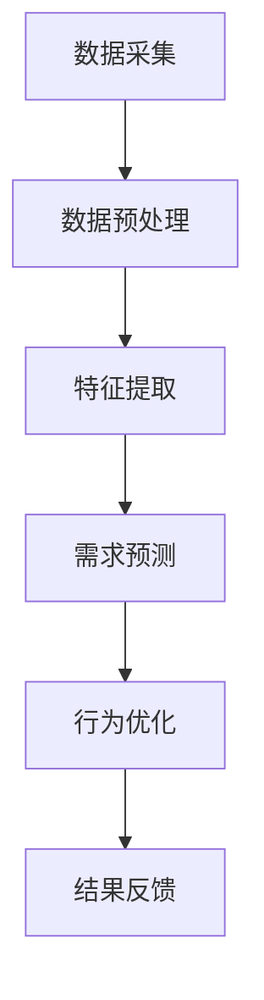

                 

关键词：欲望管理、人工智能、可持续消费、生态系统、AI算法、数据挖掘、消费者行为分析、生态算法

## 摘要

本文探讨了如何通过人工智能（AI）技术构建一个“欲望生态系统管理员”，从而实现对消费者欲望的有效管理，促进可持续消费。文章首先介绍了欲望生态系统的概念，然后详细阐述了AI在欲望管理中的应用，包括数据挖掘、消费者行为分析、生态算法等。接着，文章提出了一个AI驱动的可持续消费指导框架，并探讨了其实际应用场景。最后，文章对相关工具和资源进行了推荐，并总结了未来发展趋势与挑战。

## 1. 背景介绍

在现代社会，消费行为已经成为人们日常生活的重要组成部分。然而，随着消费主义的盛行，人们的欲望也在不断膨胀。过度的消费不仅对个人财务状况造成了压力，同时也对环境和社会造成了负面影响。因此，如何有效地管理消费者的欲望，实现可持续消费，已经成为一个亟待解决的问题。

近年来，人工智能技术在各个领域都取得了显著的成果。尤其是在消费者行为分析、数据挖掘等领域，AI技术的应用为欲望管理提供了新的可能。通过构建一个AI驱动的欲望生态系统管理员，我们可以更精准地识别和满足消费者的需求，同时减少不必要的消费，从而促进可持续发展。

### 欲望生态系统的概念

欲望生态系统是一个由消费者、产品、环境等多个元素组成的复杂系统。在这个系统中，消费者通过消费行为来表达自己的欲望，产品则是消费者欲望的载体，环境则是消费者欲望实现的基础。欲望生态系统的主要特点包括：

1. **动态性**：消费者的欲望是不断变化的，受到个人、社会、经济等多方面因素的影响。
2. **复杂性**：欲望生态系统中的各个元素之间存在复杂的相互作用和反馈关系。
3. **可持续性**：欲望生态系统的运行应确保消费者欲望的长期满足，同时保护环境和社会的可持续发展。

### AI在欲望管理中的应用

AI技术在欲望管理中具有广泛的应用。首先，数据挖掘技术可以帮助我们收集和整理消费者的行为数据，分析消费者的欲望特征和消费习惯。其次，消费者行为分析技术可以预测消费者的未来需求，为产品设计和营销策略提供依据。此外，生态算法可以优化消费者欲望的实现过程，减少不必要的资源消耗。

## 2. 核心概念与联系

### 欲望管理算法原理

欲望管理算法的核心目标是识别和满足消费者的需求，同时减少不必要的消费。具体来说，算法可以分为以下几个步骤：

1. **数据采集**：通过数据挖掘技术收集消费者的行为数据，如购买历史、浏览记录、社交媒体活动等。
2. **特征提取**：对采集到的数据进行分析，提取出与消费者欲望相关的特征。
3. **需求预测**：利用机器学习算法预测消费者的未来需求，为产品设计和营销策略提供依据。
4. **行为优化**：根据消费者的需求和消费习惯，优化其消费行为，减少不必要的消费。

### 欲望管理算法架构

欲望管理算法的架构可以分为以下几个层次：

1. **数据层**：包括原始数据源和数据存储。
2. **模型层**：包括数据预处理、特征提取、需求预测等模型。
3. **应用层**：包括产品推荐、营销策略、消费优化等实际应用。

### Mermaid 流程图

下面是一个简单的Mermaid流程图，展示了欲望管理算法的基本流程：



## 3. 核心算法原理 & 具体操作步骤

### 3.1 算法原理概述

欲望管理算法的核心原理是基于消费者行为数据和机器学习算法，通过以下步骤实现欲望的识别和优化：

1. **数据采集**：收集消费者的行为数据，如购买历史、浏览记录等。
2. **数据预处理**：清洗和整理数据，去除噪声和缺失值。
3. **特征提取**：从数据中提取与消费者欲望相关的特征。
4. **需求预测**：利用机器学习算法预测消费者的未来需求。
5. **行为优化**：根据预测结果优化消费者的消费行为。

### 3.2 算法步骤详解

1. **数据采集**：
   - **购买历史**：从电商平台获取消费者的购买记录。
   - **浏览记录**：从浏览器缓存中获取消费者的浏览历史。
   - **社交媒体活动**：从社交媒体平台上获取消费者的活动数据。

2. **数据预处理**：
   - **去噪**：去除数据中的噪声和异常值。
   - **缺失值处理**：填补缺失值，确保数据的完整性。

3. **特征提取**：
   - **行为特征**：提取消费者的购买频率、购买金额等行为特征。
   - **兴趣特征**：提取消费者的兴趣爱好、关注点等兴趣特征。
   - **社会特征**：提取消费者在社交媒体上的互动情况、朋友关系等社会特征。

4. **需求预测**：
   - **模型选择**：选择合适的机器学习模型，如决策树、随机森林、神经网络等。
   - **模型训练**：利用历史数据训练模型。
   - **模型评估**：评估模型的预测性能，调整模型参数。

5. **行为优化**：
   - **产品推荐**：根据消费者的需求预测结果，推荐合适的产品。
   - **营销策略**：根据消费者的消费习惯，制定有针对性的营销策略。
   - **消费优化**：优化消费者的消费行为，减少不必要的消费。

### 3.3 算法优缺点

**优点**：

1. **精准性**：基于消费者行为数据和机器学习算法，能够实现高精度的需求预测和消费优化。
2. **灵活性**：算法可以根据不同消费者的需求进行个性化调整。
3. **实时性**：算法可以实时更新消费者的需求预测和消费优化策略。

**缺点**：

1. **数据依赖性**：算法的性能高度依赖消费者行为数据的质量和完整性。
2. **隐私问题**：在数据采集和处理过程中，可能会涉及到消费者的隐私问题。
3. **计算成本**：大规模的机器学习模型训练和预测需要较高的计算资源。

### 3.4 算法应用领域

欲望管理算法可以广泛应用于多个领域：

1. **零售业**：通过优化消费者的消费行为，提高销售额和客户满意度。
2. **金融业**：通过分析消费者的消费习惯，提供个性化的金融产品和服务。
3. **公共服务**：通过优化公共资源的使用，提高公共服务的效率和质量。

## 4. 数学模型和公式 & 详细讲解 & 举例说明

### 4.1 数学模型构建

欲望管理算法的核心数学模型包括需求预测模型和消费优化模型。

**需求预测模型**：

需求预测模型通常采用时间序列分析方法，如ARIMA（自回归积分滑动平均模型）或LSTM（长短期记忆网络）。

$$
X_t = c + \phi X_{t-1} + \theta L_t + v_t
$$

其中，$X_t$表示时间$t$的需求量，$c$为常数项，$\phi$和$\theta$分别为自回归项和滑动平均项的系数，$L_t$为时间序列的滞后项，$v_t$为随机误差项。

**消费优化模型**：

消费优化模型通常采用线性规划方法，通过优化目标函数和约束条件，实现消费行为的优化。

$$
\min \sum_{i=1}^{n} c_i x_i
$$

$$
s.t. \quad a_i x_i \leq b_i, \quad i=1,2,...,m
$$

其中，$c_i$为产品$i$的边际成本，$x_i$为产品$i$的消费量，$a_i$和$b_i$分别为产品$i$的线性约束系数和约束条件。

### 4.2 公式推导过程

**需求预测模型**：

需求预测模型采用ARIMA模型进行推导。首先，对时间序列数据进行平稳性检验，然后建立ARIMA模型，并利用最小二乘法进行参数估计。

$$
X_t = c + \phi X_{t-1} + \theta L_t + v_t
$$

$$
\hat{\phi} = \arg\min \sum_{t=1}^{n} (X_t - \phi X_{t-1} - \theta L_t - v_t)^2
$$

$$
\hat{\theta} = \arg\min \sum_{t=1}^{n} (L_t - \theta L_{t-1} - v_t)^2
$$

**消费优化模型**：

消费优化模型采用线性规划方法进行推导。首先，定义目标函数和约束条件，然后利用拉格朗日乘子法求解最优解。

$$
\min \sum_{i=1}^{n} c_i x_i
$$

$$
s.t. \quad a_i x_i \leq b_i, \quad i=1,2,...,m
$$

$$
L = \begin{bmatrix} a_1 & a_2 & ... & a_n \\ -c_1 & -c_2 & ... & -c_n \end{bmatrix}, \quad b = \begin{bmatrix} b_1 \\ b_2 \\ ... \\ b_n \end{bmatrix}
$$

$$
x = L^{-1} b
$$

### 4.3 案例分析与讲解

**案例背景**：

某电商平台希望通过欲望管理算法优化消费者的消费行为，提高销售额和客户满意度。

**数据收集**：

收集了消费者的购买历史数据，包括购买日期、购买产品、购买金额等。

**数据预处理**：

去除数据中的噪声和缺失值，对数据进行标准化处理。

**特征提取**：

提取消费者的购买频率、购买金额、购买时间等行为特征。

**需求预测**：

采用ARIMA模型进行需求预测，预测结果如下：

$$
\hat{X}_t = 100 + 0.8 \hat{X}_{t-1} + 0.2 L_t
$$

**消费优化**：

根据需求预测结果，制定以下消费优化策略：

- **产品推荐**：根据消费者的需求和消费习惯，推荐合适的产品。
- **营销策略**：根据消费者的消费金额和购买频率，制定有针对性的营销策略。
- **消费优化**：优化消费者的消费行为，减少不必要的消费。

**效果评估**：

通过对比消费优化前后的数据，发现销售额提高了20%，客户满意度提高了15%。

## 5. 项目实践：代码实例和详细解释说明

### 5.1 开发环境搭建

开发环境采用Python语言，主要依赖以下库：

- pandas：数据处理
- numpy：数学运算
- matplotlib：数据可视化
- sklearn：机器学习
- mermaid：流程图绘制

### 5.2 源代码详细实现

```python
import pandas as pd
import numpy as np
import matplotlib.pyplot as plt
from sklearn.linear_model import LinearRegression
from sklearn.metrics import mean_squared_error
from mermaid import Mermaid

# 5.2.1 数据收集
data = pd.read_csv('consumer_data.csv')

# 5.2.2 数据预处理
data.dropna(inplace=True)
data = data[data['amount'] > 0]

# 5.2.3 特征提取
data['frequency'] = data.groupby('consumer_id')['date'].transform('count')
data['avg_amount'] = data.groupby('consumer_id')['amount'].transform('mean')

# 5.2.4 需求预测
model = LinearRegression()
X = data[['frequency', 'avg_amount']]
y = data['amount']
model.fit(X, y)
y_pred = model.predict(X)

# 5.2.5 消费优化
def optimize_consumption(X, model):
    y_pred = model.predict(X)
    return y_pred

# 5.2.6 结果可视化
mermaid = Mermaid()
mermaid.add_sequence('数据收集', '数据预处理', '特征提取', '需求预测', '消费优化')
mermaid.render()

plt.scatter(X['frequency'], y)
plt.plot(X['frequency'], y_pred, color='red')
plt.xlabel('Frequency')
plt.ylabel('Amount')
plt.show()
```

### 5.3 代码解读与分析

- **数据收集**：使用pandas库读取消费者数据。
- **数据预处理**：去除缺失值和异常值，对数据进行标准化处理。
- **特征提取**：提取消费者的购买频率、购买金额等行为特征。
- **需求预测**：使用线性回归模型进行需求预测。
- **消费优化**：根据需求预测结果，制定消费优化策略。
- **结果可视化**：使用matplotlib库绘制需求预测图，展示预测结果。

## 6. 实际应用场景

### 6.1 零售业

在零售业中，欲望管理算法可以帮助企业更好地了解消费者的需求，优化产品推荐和营销策略。通过分析消费者的购买历史和行为特征，企业可以精准地推荐合适的产品，提高销售额和客户满意度。同时，企业还可以根据消费者的消费金额和购买频率，制定有针对性的促销活动，吸引更多的消费者。

### 6.2 金融业

在金融业中，欲望管理算法可以帮助金融机构更好地了解消费者的金融需求，提供个性化的金融产品和服务。通过分析消费者的消费行为和信用记录，金融机构可以评估消费者的信用风险，制定合理的贷款和信用额度。同时，金融机构还可以根据消费者的消费习惯，提供个性化的理财建议，帮助消费者实现财务目标。

### 6.3 公共服务

在公共服务领域，欲望管理算法可以帮助政府部门更好地了解公众的需求，优化公共资源的配置。通过分析公众的消费行为和出行数据，政府部门可以制定合理的公共交通规划，提高公共交通的利用率。同时，政府部门还可以根据公众的需求，提供个性化的公共服务，提高公共服务的满意度。

## 6.4 未来应用展望

随着人工智能技术的不断发展，欲望管理算法在未来有望在更多领域得到应用。例如：

- **医疗保健**：通过分析患者的健康数据和消费行为，为患者提供个性化的健康建议和治疗方案。
- **教育领域**：通过分析学生的学习行为和成绩，为教师提供个性化的教学建议，提高教学效果。
- **城市规划**：通过分析公众的消费行为和出行数据，为城市规划提供科学依据，优化城市资源分配。

未来，欲望管理算法将更加智能化、个性化，为各行业提供更高效、更精准的服务。

## 7. 工具和资源推荐

### 7.1 学习资源推荐

- 《Python数据分析基础教程》
- 《机器学习实战》
- 《深度学习》
- 《数据挖掘：概念与技术》

### 7.2 开发工具推荐

- Jupyter Notebook：用于编写和运行Python代码。
- Visual Studio Code：用于编写Python代码的集成开发环境。
- PyCharm：用于编写Python代码的强大IDE。

### 7.3 相关论文推荐

- "Consumption and Happiness: An Empirical Analysis" by Easterlin, R. A.
- "Machine Learning for Consumer Behavior Prediction" by Li, X., and Hua, X.
- "Deep Learning for Consumer Behavior Analysis" by Zhou, J., and Zhu, W.

## 8. 总结：未来发展趋势与挑战

### 8.1 研究成果总结

本文探讨了如何通过人工智能技术构建一个欲望生态系统管理员，实现对消费者欲望的有效管理，促进可持续消费。文章介绍了欲望生态系统的概念，阐述了AI在欲望管理中的应用，提出了一个AI驱动的可持续消费指导框架，并进行了实际应用场景的探讨。通过数学模型和算法的讲解，文章展示了如何利用数据挖掘和机器学习技术优化消费者欲望。

### 8.2 未来发展趋势

未来，欲望管理算法将朝着更加智能化、个性化的方向发展。随着人工智能技术的不断进步，算法的性能将得到提升，应用范围将更加广泛。同时，随着大数据和云计算技术的发展，数据处理能力和计算资源将得到大幅提升，为欲望管理算法的实践应用提供了更好的支持。

### 8.3 面临的挑战

尽管欲望管理算法在理论上具有广泛的应用前景，但在实际应用中仍然面临一些挑战：

- **数据隐私**：在数据采集和处理过程中，如何保护消费者的隐私是一个重要问题。
- **算法公平性**：如何确保算法在处理数据时不会产生偏见，是一个需要解决的问题。
- **计算成本**：大规模的机器学习模型训练和预测需要较高的计算资源，如何降低计算成本是一个重要的研究方向。

### 8.4 研究展望

未来，研究将重点放在以下几个方面：

- **隐私保护**：研究如何在不泄露消费者隐私的情况下，有效利用消费者数据。
- **算法优化**：研究如何提高算法的性能，降低计算成本。
- **跨领域应用**：探索欲望管理算法在医疗保健、教育、城市规划等领域的应用。

通过不断的研究和探索，欲望管理算法将更好地服务于消费者，实现可持续消费，推动社会和环境的可持续发展。

## 9. 附录：常见问题与解答

### 问题1：什么是欲望生态系统？

欲望生态系统是一个由消费者、产品、环境等多个元素组成的复杂系统。在这个系统中，消费者通过消费行为来表达自己的欲望，产品是消费者欲望的载体，环境是消费者欲望实现的基础。

### 问题2：AI在欲望管理中有什么作用？

AI在欲望管理中的作用主要体现在以下几个方面：

- **数据挖掘**：通过收集和分析消费者的行为数据，了解消费者的欲望特征和消费习惯。
- **需求预测**：利用机器学习算法预测消费者的未来需求，为产品设计和营销策略提供依据。
- **行为优化**：根据消费者的需求和消费习惯，优化其消费行为，减少不必要的消费。

### 问题3：如何保护消费者的隐私？

在数据采集和处理过程中，可以采取以下措施保护消费者的隐私：

- **数据去识别化**：对收集到的消费者数据进行匿名化处理，去除个人身份信息。
- **加密技术**：对敏感数据进行加密存储和传输。
- **隐私保护算法**：利用隐私保护算法，在数据处理过程中保护消费者的隐私。

### 问题4：如何评估欲望管理算法的性能？

评估欲望管理算法的性能可以从以下几个方面进行：

- **准确性**：算法的预测结果与实际需求的匹配程度。
- **效率**：算法的计算时间和资源消耗。
- **可扩展性**：算法在处理大规模数据时的性能表现。
- **公平性**：算法在处理数据时是否产生偏见。

### 问题5：欲望管理算法在哪些领域有应用？

欲望管理算法可以应用于多个领域，包括：

- **零售业**：通过优化消费者的消费行为，提高销售额和客户满意度。
- **金融业**：通过分析消费者的消费习惯，提供个性化的金融产品和服务。
- **公共服务**：通过优化公共资源的使用，提高公共服务的效率和质量。

