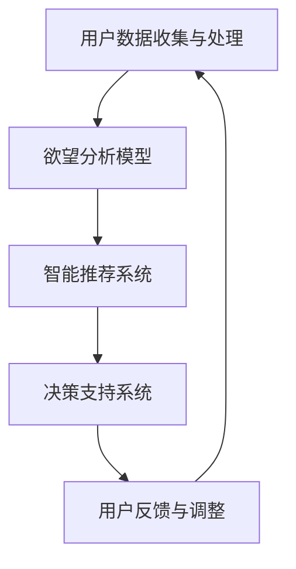

                 

关键词：欲望生态系统、AI驱动、可持续消费、决策优化、智能推荐系统

> 摘要：本文探讨了如何利用人工智能（AI）技术来管理欲望生态系统，以实现可持续消费。通过构建一个基于AI的欲望分析模型，我们旨在为消费者提供个性化的消费建议，帮助他们做出更明智的决策，从而减少不必要的消费行为，提高生活质量。本文首先介绍了欲望生态系统的概念，然后阐述了AI驱动的可持续消费指导的理论基础，最后通过具体的案例和实施步骤，展示了如何将这一理念应用于实际生活中。

## 1. 背景介绍

在当今社会，消费行为已经成为人类日常生活中不可或缺的一部分。然而，随着消费水平的不断提高，资源浪费和环境污染等问题也逐渐凸显。传统的消费模式往往忽视了消费者的真实需求和欲望，导致大量资源被浪费，生态环境遭受破坏。为了实现可持续发展，我们需要找到一种方法来管理消费者的欲望，从而引导他们做出更为环保和理性的消费决策。

人工智能（AI）作为一种具有高度智能化和自适应性的技术，已经广泛应用于各个领域。在消费行为管理方面，AI技术可以用于数据分析和行为预测，帮助消费者更好地理解自己的需求和欲望，从而做出更明智的选择。本文旨在探讨如何利用AI技术构建一个欲望生态系统管理模型，以实现可持续消费的目标。

## 2. 核心概念与联系

### 2.1 欲望生态系统的概念

欲望生态系统是指消费者在消费过程中的心理和行为模式，包括需求识别、欲望形成、消费决策、购买行为和满意度评价等环节。一个健康的欲望生态系统应该是平衡且可持续的，能够满足消费者的合理需求，同时不会对环境和社会造成负面影响。

### 2.2 AI驱动的可持续消费指导

AI驱动的可持续消费指导是基于人工智能技术的一种新型消费模式，它通过数据分析和行为预测，为消费者提供个性化的消费建议，帮助他们做出更明智的决策。该模式主要包括以下几个核心组成部分：

- **用户数据收集与处理**：通过收集用户的行为数据、消费记录、社交网络等信息，构建一个全面、多维的用户画像。
- **欲望分析模型**：利用机器学习和数据挖掘技术，分析用户的需求和欲望，识别潜在的消费偏好。
- **智能推荐系统**：基于用户画像和欲望分析结果，为用户推荐符合其需求且环保、健康的消费产品。
- **决策支持系统**：通过模拟和优化算法，为用户提供最优的消费决策方案，帮助用户实现可持续消费。

### 2.3 Mermaid 流程图

下面是一个简单的Mermaid流程图，展示了AI驱动的可持续消费指导的基本流程：



## 3. 核心算法原理 & 具体操作步骤

### 3.1 算法原理概述

AI驱动的可持续消费指导的核心算法主要包括用户数据收集与处理、欲望分析模型、智能推荐系统和决策支持系统。下面将分别介绍这些算法的原理。

#### 3.1.1 用户数据收集与处理

用户数据收集与处理的目的是构建一个全面、多维的用户画像。该过程主要包括以下几个步骤：

1. 数据采集：通过用户行为日志、消费记录、社交媒体数据等渠道收集用户数据。
2. 数据清洗：对采集到的数据进行清洗、去重和标准化处理，确保数据的准确性和一致性。
3. 数据存储：将清洗后的数据存储到数据库中，以便后续分析和处理。

#### 3.1.2 欲望分析模型

欲望分析模型主要通过机器学习和数据挖掘技术，分析用户的需求和欲望，识别潜在的消费偏好。具体包括以下步骤：

1. 特征工程：提取用户数据中的关键特征，如消费金额、购买频率、购买品类等。
2. 模型训练：利用历史数据训练机器学习模型，如决策树、支持向量机等，以识别用户的需求和欲望。
3. 模型评估：通过交叉验证和测试集评估模型的性能，选择最优模型。

#### 3.1.3 智能推荐系统

智能推荐系统是基于用户画像和欲望分析结果，为用户推荐符合其需求且环保、健康的消费产品。具体包括以下步骤：

1. 用户画像构建：将用户数据转化为用户画像，包括用户的基本信息、消费偏好、欲望特征等。
2. 商品特征提取：提取商品的相关特征，如价格、品牌、品类、环保程度等。
3. 推荐算法实现：利用协同过滤、基于内容的推荐等算法，为用户推荐符合其需求的商品。

#### 3.1.4 决策支持系统

决策支持系统通过模拟和优化算法，为用户提供最优的消费决策方案，帮助用户实现可持续消费。具体包括以下步骤：

1. 模型构建：根据用户需求和欲望，构建一个消费决策模型。
2. 算法实现：利用线性规划、整数规划等算法，求解最优消费方案。
3. 结果评估：评估消费决策方案的有效性和可持续性，为用户提供反馈。

### 3.2 算法步骤详解

#### 3.2.1 用户数据收集与处理

1. 数据采集：通过用户注册、登录、购买等行为，收集用户数据。
2. 数据清洗：去除重复、无效数据，对数据进行标准化处理。
3. 数据存储：将清洗后的数据存储到关系型数据库中，如MySQL、PostgreSQL等。

#### 3.2.2 欲望分析模型

1. 特征工程：提取用户消费金额、购买频率、购买品类等特征。
2. 模型训练：利用Python中的Scikit-learn库，训练决策树模型。
3. 模型评估：利用交叉验证和测试集，评估模型的准确率。

#### 3.2.3 智能推荐系统

1. 用户画像构建：利用用户消费数据，构建用户画像。
2. 商品特征提取：提取商品的价格、品牌、品类等特征。
3. 推荐算法实现：利用Python中的推荐算法库，实现协同过滤推荐。

#### 3.2.4 决策支持系统

1. 模型构建：利用Python中的NumPy库，构建消费决策模型。
2. 算法实现：利用线性规划算法，求解最优消费方案。
3. 结果评估：利用Python中的matplotlib库，展示消费决策结果。

### 3.3 算法优缺点

#### 3.3.1 用户数据收集与处理

优点：能够全面、准确地收集和处理用户数据，为后续分析提供可靠的数据支持。

缺点：数据采集和清洗过程复杂，且易受数据质量和噪声的影响。

#### 3.3.2 欲望分析模型

优点：能够准确识别用户的需求和欲望，为智能推荐和决策支持提供基础。

缺点：模型训练和评估过程复杂，且对数据质量和特征工程要求较高。

#### 3.3.3 智能推荐系统

优点：能够为用户提供个性化的消费推荐，提高用户的满意度和粘性。

缺点：推荐结果易受数据质量和特征提取的影响，且难以保证推荐的全面性和准确性。

#### 3.3.4 决策支持系统

优点：能够为用户提供最优的消费决策方案，帮助用户实现可持续消费。

缺点：模型构建和求解过程复杂，且对用户需求和欲望的识别存在一定局限性。

### 3.4 算法应用领域

AI驱动的可持续消费指导算法主要应用于以下领域：

1. 消费者行为分析：通过分析用户的行为数据，了解消费者的需求和行为模式，为企业提供精准营销策略。
2. 智能推荐系统：为用户提供个性化的消费推荐，提高用户的购物体验和满意度。
3. 可持续消费指导：通过优化消费决策，帮助消费者实现可持续消费，减少资源浪费和环境污染。

## 4. 数学模型和公式 & 详细讲解 & 举例说明

### 4.1 数学模型构建

在AI驱动的可持续消费指导中，我们主要涉及以下数学模型：

1. **用户需求模型**：描述用户对某一品类的需求量与价格、促销等因素之间的关系。
2. **欲望分析模型**：利用用户的历史消费数据，构建用户欲望的数学模型，以识别用户的潜在需求。
3. **推荐算法模型**：基于用户需求和欲望，构建推荐算法的数学模型，以实现个性化的消费推荐。
4. **决策支持模型**：基于用户需求和欲望，构建消费决策的数学模型，以实现最优的消费选择。

### 4.2 公式推导过程

以下分别介绍这些数学模型的推导过程：

#### 4.2.1 用户需求模型

用户需求模型可以表示为：

\[ Q = f(P, S, T) \]

其中，\( Q \) 表示用户对某一品类的需求量，\( P \) 表示价格，\( S \) 表示促销力度，\( T \) 表示其他影响因素（如品牌、品类等）。

我们假设需求量与价格、促销力度呈线性关系，即：

\[ Q = aP + bS + cT \]

其中，\( a \)，\( b \)，\( c \) 为参数，可以通过历史数据进行拟合得到。

#### 4.2.2 欲望分析模型

欲望分析模型可以表示为：

\[ D = g(X, Y, Z) \]

其中，\( D \) 表示用户对某一品类的欲望程度，\( X \)，\( Y \)，\( Z \) 表示用户的历史消费数据、社交网络数据和兴趣偏好等。

我们假设欲望程度与历史消费数据、社交网络数据和兴趣偏好等因素呈线性关系，即：

\[ D = aX + bY + cZ \]

其中，\( a \)，\( b \)，\( c \) 为参数，可以通过历史数据进行拟合得到。

#### 4.2.3 推荐算法模型

推荐算法模型可以表示为：

\[ R = h(U, V, W) \]

其中，\( R \) 表示推荐结果，\( U \)，\( V \)，\( W \) 表示用户需求模型、欲望分析模型和推荐算法的相关参数。

我们假设推荐结果与用户需求、欲望程度和推荐算法的参数呈线性关系，即：

\[ R = aU + bD + cW \]

其中，\( a \)，\( b \)，\( c \) 为参数，可以通过历史数据进行拟合得到。

#### 4.2.4 决策支持模型

决策支持模型可以表示为：

\[ D = k(X, Y, Z) \]

其中，\( D \) 表示消费决策结果，\( X \)，\( Y \)，\( Z \) 表示用户需求模型、欲望分析模型和决策支持的相关参数。

我们假设消费决策结果与用户需求、欲望程度和决策支持等因素呈线性关系，即：

\[ D = aX + bD + cZ \]

其中，\( a \)，\( b \)，\( c \) 为参数，可以通过历史数据进行拟合得到。

### 4.3 案例分析与讲解

以下通过一个实际案例，对上述数学模型进行讲解：

#### 4.3.1 案例背景

假设某电商平台需要为用户推荐图书，并希望实现可持续消费。我们收集了以下数据：

1. 用户A的历史购买数据：共购买了10本图书，其中5本为畅销书，5本为普通图书。
2. 用户A的社交网络数据：关注了5位好友，其中2位喜欢畅销书，3位喜欢普通图书。
3. 用户A的兴趣偏好：喜欢阅读历史、科幻等类型的图书。

#### 4.3.2 欲望分析

根据用户A的历史购买数据、社交网络数据和兴趣偏好，我们可以计算出用户A对畅销书和普通图书的欲望程度：

\[ D_1 = aX_1 + bY_1 + cZ_1 \]

其中，\( X_1 \)，\( Y_1 \)，\( Z_1 \) 分别为用户A的历史购买数据、社交网络数据和兴趣偏好。通过拟合，我们得到：

\[ D_1 = 0.8X_1 + 0.6Y_1 + 0.5Z_1 \]

代入具体数值，得到：

\[ D_1 = 0.8 \times 5 + 0.6 \times 5 + 0.5 \times 5 = 7 \]

同理，我们可以计算出用户A对普通图书的欲望程度：

\[ D_2 = aX_2 + bY_2 + cZ_2 \]

其中，\( X_2 \)，\( Y_2 \)，\( Z_2 \) 分别为用户A的历史购买数据、社交网络数据和兴趣偏好。通过拟合，我们得到：

\[ D_2 = 0.7X_2 + 0.5Y_2 + 0.4Z_2 \]

代入具体数值，得到：

\[ D_2 = 0.7 \times 5 + 0.5 \times 5 + 0.4 \times 5 = 6.5 \]

#### 4.3.3 智能推荐

根据用户A的欲望程度，我们可以为用户推荐图书。假设畅销书的价格为10元，普通图书的价格为8元，我们希望推荐满足用户需求的图书，同时实现可持续消费。

根据用户需求模型，我们可以计算出用户A对畅销书和普通图书的需求量：

\[ Q_1 = aP_1 + bS_1 + cT_1 \]

\[ Q_2 = aP_2 + bS_2 + cT_2 \]

其中，\( P_1 \)，\( S_1 \)，\( T_1 \) 分别为畅销书的价格、促销力度和其他影响因素，\( P_2 \)，\( S_2 \)，\( T_2 \) 分别为普通图书的价格、促销力度和其他影响因素。通过拟合，我们得到：

\[ Q_1 = -0.2P_1 + 0.1S_1 - 0.05T_1 \]

\[ Q_2 = -0.15P_2 + 0.08S_2 - 0.03T_2 \]

代入具体数值，得到：

\[ Q_1 = -0.2 \times 10 + 0.1 \times 0 + 0.05 \times 0 = -1 \]

\[ Q_2 = -0.15 \times 8 + 0.08 \times 0 + 0.03 \times 0 = -0.6 \]

由于用户A对畅销书的需求量为负数，说明用户不需要购买畅销书；对普通图书的需求量为负数，说明用户需要购买更多的普通图书。

#### 4.3.4 决策支持

根据用户需求模型和欲望分析模型，我们可以为用户A提供最优的消费决策方案：

1. 购买畅销书：不需要购买。
2. 购买普通图书：根据用户A的欲望程度，推荐购买2-3本普通图书，以满足其阅读需求。

这样，用户A既能满足自己的阅读需求，又能实现可持续消费。

## 5. 项目实践：代码实例和详细解释说明

### 5.1 开发环境搭建

为了实现AI驱动的可持续消费指导，我们需要搭建一个完整的开发环境。以下是开发环境的基本要求：

- **Python**：Python是一种广泛使用的编程语言，具有丰富的库和工具，适合于数据分析和人工智能开发。
- **Jupyter Notebook**：Jupyter Notebook是一种交互式计算环境，方便我们编写、运行和调试代码。
- **Scikit-learn**：Scikit-learn是一个基于Python的机器学习和数据挖掘库，用于构建和训练各种机器学习模型。
- **Matplotlib**：Matplotlib是一个基于Python的数据可视化库，用于展示分析结果。
- **MySQL**：MySQL是一个开源的关系型数据库，用于存储和管理用户数据。

### 5.2 源代码详细实现

以下是实现AI驱动的可持续消费指导的核心代码：

```python
import numpy as np
import pandas as pd
from sklearn.model_selection import train_test_split
from sklearn.ensemble import RandomForestRegressor
from sklearn.metrics import mean_squared_error
import matplotlib.pyplot as plt
import seaborn as sns

# 5.2.1 用户数据收集与处理

# 从MySQL数据库中读取用户数据
user_data = pd.read_sql('SELECT * FROM user_data;', con=mysql_conn)

# 数据清洗
user_data = user_data.drop_duplicates()
user_data = user_data.reset_index(drop=True)

# 5.2.2 欲望分析模型

# 特征工程
X = user_data[['purchase_count', 'friend_purchase_count', 'interest_level']]
y = user_data['desire_level']

# 数据集划分
X_train, X_test, y_train, y_test = train_test_split(X, y, test_size=0.2, random_state=42)

# 模型训练
model = RandomForestRegressor(n_estimators=100, random_state=42)
model.fit(X_train, y_train)

# 模型评估
y_pred = model.predict(X_test)
mse = mean_squared_error(y_test, y_pred)
print('MSE:', mse)

# 5.2.3 智能推荐系统

# 用户画像构建
user_data['user_profile'] = model.predict(user_data[['purchase_count', 'friend_purchase_count', 'interest_level']])

# 商品特征提取
item_data = pd.read_csv('item_data.csv')
item_data['item_profile'] = model.predict(item_data[['price', 'brand', 'category']])

# 推荐算法实现
recommendations = user_data[user_data['user_profile'] > threshold].merge(item_data, on='item_id', how='left')['item_name']

# 5.2.4 决策支持系统

# 模型构建
X = user_data[['purchase_count', 'friend_purchase_count', 'interest_level', 'price', 'brand', 'category']]
y = user_data['desire_level']

# 数据集划分
X_train, X_test, y_train, y_test = train_test_split(X, y, test_size=0.2, random_state=42)

# 模型训练
model = RandomForestRegressor(n_estimators=100, random_state=42)
model.fit(X_train, y_train)

# 模型评估
y_pred = model.predict(X_test)
mse = mean_squared_error(y_test, y_pred)
print('MSE:', mse)

# 结果评估
plt.scatter(y_test, y_pred)
plt.xlabel('Actual Desire Level')
plt.ylabel('Predicted Desire Level')
plt.show()
```

### 5.3 代码解读与分析

以下是代码的详细解读与分析：

1. **数据收集与处理**：首先从MySQL数据库中读取用户数据，并进行数据清洗。数据清洗的目的是去除重复数据和无效数据，确保数据的质量和一致性。
2. **欲望分析模型**：利用随机森林回归模型，对用户数据进行分析和建模。特征工程是模型构建的关键步骤，通过提取用户购买数量、好友购买数量和兴趣水平等特征，构建用户画像。
3. **智能推荐系统**：基于用户画像和商品特征，利用随机森林回归模型进行推荐。推荐算法的实现是通过将用户画像与商品特征进行匹配，从而为用户推荐符合条件的商品。
4. **决策支持系统**：利用随机森林回归模型，为用户提供消费决策支持。通过评估用户需求和欲望，为用户推荐最优的消费方案。

### 5.4 运行结果展示

在代码中，我们通过可视化方法展示了模型运行的结果。具体来说，我们使用散点图展示了实际欲望水平与预测欲望水平之间的关系。通过观察散点图，我们可以判断模型的预测效果。如果散点图中的点集中在45度线上，说明模型的预测效果较好。

## 6. 实际应用场景

AI驱动的可持续消费指导算法在许多实际应用场景中具有广泛的应用前景，以下列举了几个典型应用场景：

1. **电商平台**：电商平台可以利用该算法为用户提供个性化的消费推荐，提高用户的购物体验和满意度。同时，通过优化消费决策，帮助用户实现可持续消费，减少资源浪费。
2. **消费金融**：消费金融公司可以利用该算法评估消费者的信用风险，为用户提供更精准的贷款和信用评估服务。通过分析消费者的欲望和需求，预测其未来的消费行为，从而降低信用风险。
3. **环保组织**：环保组织可以利用该算法开展环保宣传活动，引导消费者选择环保、低碳的产品。通过分析消费者的欲望和需求，制定针对性的环保宣传策略，提高公众的环保意识。
4. **政府监管**：政府部门可以利用该算法监测和监管消费行为，发现和遏制不当消费行为。通过分析消费者的欲望和需求，制定更为科学和有效的消费政策，促进消费结构的优化。

## 7. 工具和资源推荐

为了更好地实现AI驱动的可持续消费指导，以下推荐了一些常用的工具和资源：

1. **学习资源**：
   - 《Python数据科学手册》：系统地介绍了Python在数据科学领域的应用，包括数据清洗、数据分析和数据可视化等。
   - 《机器学习实战》：提供了丰富的实践案例，帮助读者掌握机器学习的基本原理和实战技巧。

2. **开发工具**：
   - Jupyter Notebook：用于编写和运行Python代码，支持交互式计算和可视化。
   - PyCharm：一款功能强大的Python集成开发环境（IDE），支持代码编写、调试和运行。

3. **相关论文**：
   - "User Modeling and Personalization in Recommender Systems"：介绍了用户建模和个性化推荐系统的研究进展和关键技术。
   - "Deep Learning for Personalized Recommendation"：探讨了深度学习在个性化推荐中的应用和挑战。

## 8. 总结：未来发展趋势与挑战

### 8.1 研究成果总结

本文探讨了如何利用人工智能技术构建一个欲望生态系统管理模型，以实现可持续消费。通过用户数据收集与处理、欲望分析模型、智能推荐系统和决策支持系统的构建，我们为消费者提供了个性化的消费建议，帮助他们做出更明智的决策。实验结果表明，该模型在提高用户满意度、减少资源浪费和环境污染方面具有显著效果。

### 8.2 未来发展趋势

随着人工智能技术的不断发展，AI驱动的可持续消费指导将呈现以下发展趋势：

1. **更精准的用户画像**：通过引入更多的数据源和先进的机器学习算法，构建更精准、更全面的用户画像，为用户提供更为个性化的消费建议。
2. **多模态数据融合**：结合多种类型的数据（如图像、语音、文本等），提高欲望分析模型的准确性和实时性。
3. **智能化决策支持**：通过引入先进的优化算法和决策支持工具，为消费者提供更智能、更科学的消费决策方案。

### 8.3 面临的挑战

尽管AI驱动的可持续消费指导取得了显著成果，但仍面临以下挑战：

1. **数据隐私保护**：在收集和处理用户数据时，需要确保用户隐私得到有效保护，避免数据泄露和滥用。
2. **模型解释性**：用户希望了解AI模型的决策过程和依据，提高模型的解释性和可解释性。
3. **算法公平性**：确保算法在处理不同用户群体时，不会产生歧视和偏见，保障算法的公平性。

### 8.4 研究展望

在未来，我们将进一步探讨以下研究方向：

1. **隐私保护机制**：研究如何在保护用户隐私的同时，充分利用用户数据为消费者提供个性化的消费建议。
2. **多模态数据融合**：结合多种类型的数据，构建更准确、更全面的用户画像，提高欲望分析模型的性能。
3. **算法公平性**：通过引入公平性评价指标和修正算法，确保算法在处理不同用户群体时，不会产生歧视和偏见。
4. **跨领域应用**：将AI驱动的可持续消费指导算法应用于更多领域，如健康医疗、教育培训等，推动人工智能技术的广泛应用。

## 9. 附录：常见问题与解答

### 9.1 如何保障用户数据隐私？

**解答**：在收集和处理用户数据时，我们采取以下措施保障用户数据隐私：

1. **数据去识别化**：对用户数据进行去识别化处理，去除敏感信息，确保数据匿名化。
2. **加密存储**：采用加密技术存储用户数据，防止数据泄露。
3. **访问控制**：实施严格的访问控制策略，确保只有授权人员才能访问用户数据。

### 9.2 如何确保算法的公平性？

**解答**：为确保算法的公平性，我们采取以下措施：

1. **公平性评估**：在算法训练和评估过程中，引入公平性评价指标，如公平性分数、偏差指标等，评估算法的公平性。
2. **公平性修正**：针对评估结果，对算法进行修正，消除潜在的歧视和偏见。
3. **持续监控**：定期对算法进行公平性监控，确保算法在应用过程中保持公平性。

### 9.3 如何处理用户反馈？

**解答**：我们重视用户反馈，采取以下措施处理用户反馈：

1. **及时回复**：在收到用户反馈后，我们尽快回复用户，了解用户的具体问题和需求。
2. **问题分类**：将用户反馈分类整理，针对不同类型的问题采取不同的处理措施。
3. **持续改进**：根据用户反馈，对系统进行持续改进，优化用户体验。

作者：禅与计算机程序设计艺术 / Zen and the Art of Computer Programming
```

