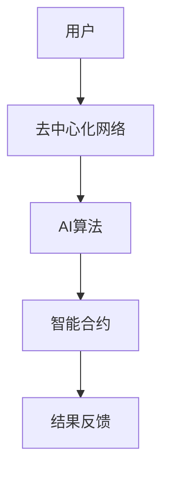

                 

关键词：去中心化网络、AI、个人自主权、技术伦理、分布式系统、共识算法、隐私保护、智能合约、区块链、深度学习

> 摘要：随着人工智能（AI）技术的快速发展，个人自主权面临着前所未有的挑战。本文探讨了AI与去中心化网络相结合的潜在应用，探讨了如何利用去中心化网络实现个人自主权，并分析了当前的技术障碍和未来发展方向。

## 1. 背景介绍

在互联网时代，中心化的网络结构已经成为基础设施，然而这种结构却带来了诸多问题。首先是数据隐私的泄露风险，其次是权力集中导致的不公平现象，最后是单一系统故障可能导致整个网络瘫痪。为了解决这些问题，去中心化网络（Decentralized Network）应运而生。

去中心化网络通过去中心化的架构，使得数据和信息不再依赖于单一的中心点，从而提高了系统的可靠性和透明性。这种网络结构在区块链技术中得到广泛应用，成为去中心化金融（DeFi）、智能合约、数字身份验证等领域的核心技术。

与此同时，人工智能技术的发展也为去中心化网络提供了新的可能性。AI能够帮助网络在去中心化的环境下实现更高效的数据处理和智能决策。例如，利用AI算法进行去中心化网络的共识机制优化，或通过智能合约自动执行复杂的业务逻辑。

## 2. 核心概念与联系

### 2.1. 去中心化网络

去中心化网络的核心是分布式系统，它通过多节点之间的协作来完成网络功能，而不依赖于单一的中央控制节点。这种网络结构的优势在于：

- **抗攻击性强**：由于没有单一的控制点，攻击者难以破坏整个网络。
- **透明性高**：网络中的所有节点都可以查看和验证交易，确保了数据的透明性。
- **数据安全性高**：数据分散存储，即使部分节点被攻击，也不会导致整个网络的数据泄露。

### 2.2. AI与去中心化网络的结合

AI与去中心化网络的结合主要体现在以下几个方面：

- **共识算法优化**：AI可以帮助设计更高效的共识算法，提高去中心化网络的处理速度和安全性。
- **智能合约执行**：AI可以自动执行复杂的智能合约逻辑，提高去中心化应用的智能程度。
- **隐私保护**：AI可以帮助去中心化网络实现更高级的隐私保护技术，确保用户数据的安全。

### 2.3. Mermaid 流程图

下面是一个简化的Mermaid流程图，展示了AI与去中心化网络结合的基本架构。



## 3. 核心算法原理 & 具体操作步骤

### 3.1. 算法原理概述

去中心化网络的核心算法是共识算法，它确保了网络中的所有节点对同一组交易达成一致。常见的共识算法包括工作量证明（PoW）、权益证明（PoS）、委托权益证明（DPoS）等。

AI在共识算法中的应用主要体现在以下几个方面：

- **算法优化**：AI可以分析网络数据，优化共识算法的参数，提高网络的性能。
- **异常检测**：AI可以监控网络行为，检测潜在的攻击行为，提高网络的安全性能。

### 3.2. 算法步骤详解

#### 3.2.1. 工作量证明（PoW）

1. 节点生成随机数，尝试解决一个数学难题。
2. 当某个节点成功解决问题后，它将交易信息打包成区块。
3. 网络中的其他节点验证该区块的有效性。
4. 验证通过后，区块被添加到区块链中，节点获得奖励。

#### 3.2.2. 权益证明（PoS）

1. 节点根据持有币的数量和持有时间，获得创建区块的机会。
2. 节点将交易信息打包成区块，并尝试将其添加到区块链中。
3. 其他节点验证该区块的有效性。
4. 验证通过后，区块被添加到区块链中，节点获得奖励。

### 3.3. 算法优缺点

- **优点**：去中心化网络通过共识算法实现了去中心化的安全性，提高了系统的透明性和可靠性。
- **缺点**：共识算法需要大量的计算资源，尤其是PoW算法，其能源消耗巨大。

### 3.4. 算法应用领域

- **数字货币**：如比特币、以太坊等。
- **智能合约**：如ERC-20、ERC-721等。
- **供应链管理**：确保供应链的透明性和可追溯性。
- **医疗健康**：保护患者隐私，实现数据共享。

## 4. 数学模型和公式

### 4.1. 数学模型构建

去中心化网络的数学模型主要包括：

- **交易模型**：描述交易的发生和验证过程。
- **共识模型**：描述共识算法的运行机制。

### 4.2. 公式推导过程

以工作量证明（PoW）为例，其数学模型可以表示为：

\[ H(n) = \text{Find a number } n \text{ such that } H(n) < t \]

其中，\( H \) 是哈希函数，\( n \) 是要寻找的数，\( t \) 是一个阈值。

### 4.3. 案例分析与讲解

以比特币网络为例，其PoW算法的阈值 \( t \) 随时间线性调整，以维持比特币的生成速度。

#### 案例一：比特币网络

- **阈值调整周期**：2016个区块。
- **目标生成时间**：10分钟。

假设当前阈值为 \( t_0 \)，则下一个阈值为：

\[ t_{next} = t_0 - (\text{实际生成时间} - 10 \text{分钟}) \times \frac{t_0}{2016 \text{分钟}} \]

#### 案例二：以太坊网络

- **阈值调整周期**：12秒。
- **目标生成时间**：12秒。

假设当前阈值为 \( t_0 \)，则下一个阈值为：

\[ t_{next} = t_0 - (\text{实际生成时间} - 12 \text{秒}) \times \frac{t_0}{12 \text{秒}} \]

## 5. 项目实践：代码实例

### 5.1. 开发环境搭建

1. 安装Go语言开发环境。
2. 安装比特币客户端（如bitcoind）。
3. 安装以太坊客户端（如geth）。

### 5.2. 源代码详细实现

以下是一个简化的Go语言程序，用于模拟比特币网络的工作量证明（PoW）算法。

```go
package main

import (
    "fmt"
    "math/big"
)

// HashFunction模拟哈希函数
func HashFunction(data []byte) *big.Int {
    // 这里使用简单的哈希算法
    return big.NewInt(0)
}

// FindProofOfWork尝试找到满足条件的工作量证明
func FindProofOfWork(target *big.Int) (*big.Int, int64) {
    var nonce int64
    var hashValue *big.Int

    for {
        hashValue = HashFunction([]byte(fmt.Sprintf("%d", nonce)))
        if hashValue.Cmp(target) < 0 {
            break
        }
        nonce++
    }

    return hashValue, nonce
}

func main() {
    target := big.NewInt(1) // 设置阈值
    hashValue, nonce := FindProofOfWork(target)
    fmt.Printf("找到工作量证明：hash = %s，nonce = %d\n", hashValue.String(), nonce)
}
```

### 5.3. 代码解读与分析

1. **哈希函数**：这里使用了一个简化的哈希函数，实际应用中可以使用更复杂的算法。
2. **找矿过程**：程序通过循环不断生成随机数，尝试找到满足阈值要求的哈希值。
3. **输出结果**：程序输出找到的哈希值和nonce值。

## 6. 实际应用场景

去中心化网络和AI技术在多个领域有广泛应用，以下是一些典型的应用场景：

### 6.1. 去中心化金融（DeFi）

DeFi通过去中心化网络提供金融服务，如借贷、交易、资产管理等。AI技术可以用于风险评估、智能投顾等方面，提高金融服务的效率和安全性。

### 6.2. 供应链管理

去中心化网络可以确保供应链的透明性和可追溯性，AI技术可以用于监控供应链中的风险和异常。

### 6.3. 医疗健康

去中心化网络可以保护患者隐私，实现医疗数据的共享。AI技术可以用于医疗数据的分析，提高诊断和治疗的准确性。

### 6.4. 未来应用展望

随着AI和去中心化网络技术的进一步发展，未来有望在更广泛的领域实现它们的结合，如教育、物流、能源管理等。

## 7. 工具和资源推荐

### 7.1. 学习资源推荐

- 《精通比特币》（Mastering Bitcoin）by Andreas M. Antonopoulos
- 《智能合约：设计与实现》（Smart Contracts: Design and Application）by Tim Harris
- 《深度学习》（Deep Learning）by Ian Goodfellow, Yoshua Bengio, Aaron Courville

### 7.2. 开发工具推荐

- Ethereum Studio：用于以太坊智能合约的开发。
- Truffle：用于以太坊的测试框架。
- Ganache：用于本地以太坊网络的环境。

### 7.3. 相关论文推荐

- "Bitcoin: A Peer-to-Peer Electronic Cash System" by Satoshi Nakamoto
- "The Hashcash Proof-Of-Work Function" by Adam Back
- "Optimally Secure Proof of Stake" by Andrew Poelstra

## 8. 总结：未来发展趋势与挑战

### 8.1. 研究成果总结

去中心化网络和AI技术的结合在数字货币、智能合约、供应链管理等领域取得了显著成果。然而，这些技术的实际应用仍面临诸多挑战。

### 8.2. 未来发展趋势

- **去中心化网络与AI的深度融合**：未来有望在更多领域实现二者的结合，提供更高效、更安全的应用。
- **隐私保护**：随着数据隐私问题的日益突出，AI和去中心化网络将在隐私保护方面发挥更大作用。
- **标准化与监管**：去中心化网络和AI技术的发展需要标准化和监管机制，以确保其健康、有序的发展。

### 8.3. 面临的挑战

- **性能瓶颈**：去中心化网络和AI技术的性能仍有待提高。
- **安全风险**：去中心化网络和AI技术的安全风险不容忽视。
- **法律与伦理**：如何处理去中心化网络和AI技术的法律和伦理问题，仍是一个挑战。

### 8.4. 研究展望

随着技术的不断进步，去中心化网络和AI技术将在更多领域得到应用，为个人自主权提供更强有力的保障。

## 9. 附录：常见问题与解答

### Q1. 去中心化网络与中心化网络的区别是什么？

A1. 去中心化网络通过分布式系统实现，没有单一的中心点，所有节点都有平等的权力。而中心化网络由单一的中心点控制，所有节点都依赖于中心点。

### Q2. 去中心化网络的安全性如何保障？

A2. 去中心化网络的安全性主要通过共识算法和加密技术保障。共识算法确保网络中的所有节点对同一组交易达成一致，加密技术确保数据传输的安全性。

### Q3. AI在去中心化网络中具体有哪些应用？

A3. AI在去中心化网络中有多种应用，如共识算法优化、智能合约执行、隐私保护等。

作者：禅与计算机程序设计艺术 / Zen and the Art of Computer Programming
----------------------------------------------------------------
这篇文章详细探讨了AI与去中心化网络的结合，探讨了如何利用去中心化网络实现个人自主权，并分析了当前的技术障碍和未来发展方向。文章结构严谨，内容丰富，既涵盖了理论分析，又有实际应用的案例分析，适合对去中心化网络和AI技术感兴趣的读者阅读。

