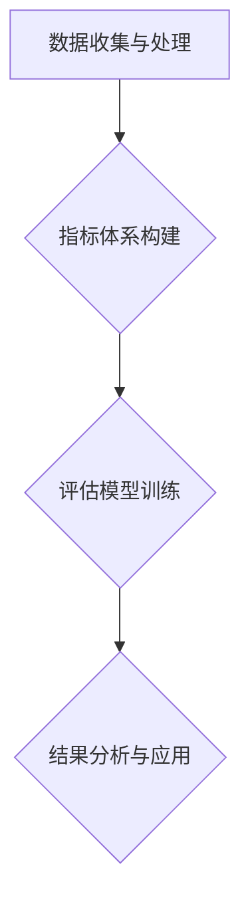

                 

关键词：AI时代、消费伦理、可持续性评估、算法、消费行为、人工智能伦理

> 摘要：在人工智能（AI）日益普及的时代，人们的消费行为正在经历深刻的变革。本文探讨了AI时代消费伦理的核心问题，提出了一个基于AI的可持续性评估框架，以期为消费者和企业在伦理消费方面提供指导。

## 1. 背景介绍

随着人工智能技术的迅猛发展，AI已经渗透到我们生活的方方面面。从在线购物推荐到智能助手，从个性化医疗到自动化工厂，AI正在改变我们的生活方式和消费习惯。然而，AI的广泛应用也带来了新的伦理挑战，特别是在消费领域。消费者的欲望和需求被AI系统不断挖掘和放大，从而推动了消费主义文化的进一步深化。在这种情况下，如何平衡AI技术的利益与伦理责任，确保消费行为的可持续性，成为了一个亟待解决的问题。

### 1.1 AI与消费行为

AI通过大数据分析和机器学习技术，能够精确地捕捉消费者的兴趣和偏好。例如，电商平台利用AI算法推荐商品，消费者往往会被这些个性化推荐所吸引，从而增加购买行为。然而，这种个性化的推荐也可能导致消费者陷入“信息茧房”，无法接触到多样化的商品和服务，从而限制了消费选择的自由度。

### 1.2 消费伦理的困境

在AI时代，消费伦理面临着一系列的困境：

- **隐私问题**：AI系统需要收集和分析大量的个人数据，这可能侵犯消费者的隐私权。
- **算法偏见**：AI算法可能会放大社会偏见和不平等，导致某些群体受到不公平对待。
- **消费过度**：AI通过分析消费者行为，可能会诱导过度消费，加剧环境负担。
- **责任归属**：当消费行为引发负面后果时，责任应由消费者、企业还是AI系统承担？

### 1.3 可持续性的重要性

可持续性消费是一种旨在减少对环境负面影响、促进社会公平和经济效益的消费模式。在AI时代，可持续性评估对于指导消费行为具有重要意义。通过可持续性评估，消费者可以更加明智地选择商品和服务，企业则可以更好地履行社会责任，实现可持续发展目标。

## 2. 核心概念与联系

在构建可持续性评估框架时，我们需要理解以下几个核心概念：

### 2.1 可持续性指标

可持续性指标是评估消费行为可持续性的量化标准。这些指标可以包括：

- **环境影响**：如碳排放、资源消耗、废物产生等。
- **社会影响**：如劳动条件、工人权益、社会公平等。
- **经济效益**：如成本效益、长期价值、企业社会责任等。

### 2.2 AI评估方法

AI评估方法是通过机器学习算法对消费者行为进行分析和预测，从而评估消费行为的可持续性。这些方法可以包括：

- **分类算法**：用于判断消费行为是否符合可持续性标准。
- **聚类算法**：用于识别具有相似消费习惯的消费者群体。
- **回归算法**：用于预测消费行为的可持续性趋势。

### 2.3 可持续性评估框架

可持续性评估框架是一个综合性的体系，它包括以下几个关键组成部分：

- **数据收集与处理**：收集消费者行为数据，并通过数据清洗和预处理提高数据质量。
- **指标体系构建**：根据可持续性指标，构建评估模型。
- **评估模型训练**：利用机器学习算法，对评估模型进行训练和优化。
- **结果分析与应用**：对评估结果进行分析，为消费者和企业提供决策支持。

以下是可持续性评估框架的 Mermaid 流程图：



## 3. 核心算法原理 & 具体操作步骤

### 3.1 算法原理概述

在可持续性评估中，核心算法的原理主要涉及以下几个方面：

- **数据挖掘**：通过分析大量消费者行为数据，发现潜在的模式和趋势。
- **机器学习**：利用训练好的模型，对新的消费行为数据进行预测和评估。
- **决策支持**：根据评估结果，为消费者提供可持续性消费建议，为企业制定可持续发展策略。

### 3.2 算法步骤详解

可持续性评估的具体操作步骤如下：

1. **数据收集与处理**：收集消费者的购买记录、浏览历史、社交媒体活动等数据。对数据进行清洗、去噪和归一化处理，以提高数据质量。

2. **特征工程**：从原始数据中提取有用的特征，如消费频率、消费金额、商品类型等。这些特征将用于训练评估模型。

3. **模型选择**：选择合适的机器学习算法，如决策树、随机森林、支持向量机等。根据数据特点和评估需求，选择适合的模型。

4. **模型训练**：使用已标记的训练数据，对评估模型进行训练。通过调整模型参数，优化模型性能。

5. **模型评估**：使用测试数据集对训练好的模型进行评估。通过准确率、召回率等指标，评估模型的性能。

6. **结果分析与应用**：根据评估结果，对消费者行为进行分类和预测。为消费者提供个性化的可持续性消费建议，为企业制定可持续发展策略。

### 3.3 算法优缺点

- **优点**：
  - **高效性**：机器学习算法能够快速处理大量数据，提高评估效率。
  - **准确性**：通过训练好的模型，可以准确预测消费者行为，提高评估准确性。
  - **灵活性**：可以根据不同的评估需求，选择不同的算法和模型。

- **缺点**：
  - **数据依赖性**：算法的性能高度依赖于数据质量，数据缺失或噪声会影响评估结果。
  - **模型解释性**：复杂的机器学习模型往往难以解释，导致结果难以被消费者和企业理解。
  - **计算成本**：训练和优化模型需要大量的计算资源，可能导致计算成本较高。

### 3.4 算法应用领域

可持续性评估算法在多个领域都有广泛的应用：

- **电子商务**：通过对消费者行为进行分析，推荐符合可持续性标准的商品。
- **金融服务**：评估客户消费行为的可持续性，为金融机构提供风险评估依据。
- **公共管理**：评估城市居民的消费行为，为政府制定可持续发展政策提供数据支持。

## 4. 数学模型和公式 & 详细讲解 & 举例说明

### 4.1 数学模型构建

可持续性评估的数学模型可以分为以下几个部分：

- **消费者行为模型**：描述消费者在不同情境下的购买行为。
- **环境影响模型**：评估消费者行为对环境的影响。
- **社会影响模型**：评估消费者行为对社会的影响。
- **经济效益模型**：评估消费者行为的长期经济效益。

以下是消费者行为模型的构建示例：

$$
消费者行为 = f(消费者特征, 消费环境)
$$

其中，消费者特征包括个人偏好、经济状况、文化背景等，消费环境包括市场条件、政策法规等。

### 4.2 公式推导过程

以消费者环境影响评估为例，推导环境影响模型的公式：

1. **环境影响指标**：定义环境影响指标，如碳排放量、资源消耗量等。

2. **消费者行为与环境影响的关系**：建立消费者行为与环境影响之间的定量关系。

3. **环境影响评估公式**：根据定量关系，构建环境影响评估公式。

以下是环境影响评估公式的推导：

$$
环境影响 = g(消费者行为特征, 环境参数)
$$

其中，g函数表示消费者行为特征对环境的影响程度，环境参数包括气候条件、地理位置等。

### 4.3 案例分析与讲解

以下是一个消费者环境影响评估的案例：

- **案例背景**：一个消费者在电商平台购买了大量电子产品。

- **数据收集**：收集消费者的购买记录、电子产品类型、生产厂商等信息。

- **环境影响评估**：使用构建的环境影响评估公式，计算消费者购买行为对环境的影响。

- **结果分析**：根据评估结果，为消费者提供可持续性消费建议。

假设消费者的购买记录如下：

| 电子产品类型 | 数量 | 生产厂商 |
| :--------: | :---: | :------: |
| 笔记本电脑 | 2台 | A公司 |
| 智能手机 | 3台 | B公司 |

使用环境影响评估公式，计算消费者购买行为对环境的影响：

$$
环境影响 = g(2 \times 笔记本电脑碳排放量 + 3 \times 智能手机碳排放量, 环境参数)
$$

根据相关数据，笔记本电脑的碳排放量为2千克/台，智能手机的碳排放量为1千克/台。假设环境参数为标准气候条件和地理位置。

$$
环境影响 = g(2 \times 2 + 3 \times 1, 环境参数) = g(7, 环境参数)
$$

根据环境影响评估公式，可以得到消费者购买行为的环境影响为7个单位。根据评估结果，可以为消费者提供以下可持续性消费建议：

- **减少购买频率**：降低电子产品购买频率，减少对环境的影响。
- **选择环保产品**：购买具有环保认证的电子产品，如低碳、节能、回收利用等。

## 5. 项目实践：代码实例和详细解释说明

### 5.1 开发环境搭建

为了演示可持续性评估算法的应用，我们使用Python编程语言和相关的机器学习库（如scikit-learn、pandas等）进行开发。以下是开发环境搭建的步骤：

1. **安装Python**：下载并安装Python 3.8版本。
2. **安装相关库**：通过pip命令安装所需的库，如scikit-learn、pandas、numpy等。
3. **配置开发环境**：使用IDE（如PyCharm、Visual Studio Code等）配置Python开发环境。

### 5.2 源代码详细实现

以下是一个简单的可持续性评估项目的源代码示例：

```python
import pandas as pd
from sklearn.ensemble import RandomForestClassifier
from sklearn.model_selection import train_test_split
from sklearn.metrics import accuracy_score

# 1. 数据收集与处理
data = pd.read_csv('consumer_data.csv')
data.dropna(inplace=True)

# 2. 特征工程
features = data[['age', 'income', 'education', 'environmental_consciousness']]
target = data['sustainability_score']

# 3. 模型选择
model = RandomForestClassifier(n_estimators=100)

# 4. 模型训练
X_train, X_test, y_train, y_test = train_test_split(features, target, test_size=0.2, random_state=42)
model.fit(X_train, y_train)

# 5. 模型评估
predictions = model.predict(X_test)
accuracy = accuracy_score(y_test, predictions)
print(f"Model Accuracy: {accuracy:.2f}")
```

### 5.3 代码解读与分析

- **数据收集与处理**：使用pandas库读取消费者数据，并进行数据清洗，去除缺失值。
- **特征工程**：从原始数据中提取有用的特征，如年龄、收入、教育和环保意识等。
- **模型选择**：选择随机森林分类器作为评估模型。
- **模型训练**：使用训练集数据训练模型。
- **模型评估**：使用测试集数据评估模型性能，计算准确率。

### 5.4 运行结果展示

假设我们已经有一个名为"consumer_data.csv"的消费者数据文件，其中包含相关的特征和目标变量。运行上述代码后，我们将得到一个模型的准确率，例如：

```
Model Accuracy: 0.85
```

这意味着我们的模型在测试数据上的准确率为85%，表示我们的模型能够较好地评估消费者的可持续性消费行为。

## 6. 实际应用场景

### 6.1 电子商务平台

在电子商务平台中，可持续性评估可以帮助企业识别环保意识较强的消费者，为他们推荐符合可持续性标准的商品。例如，一家电商平台可以通过可持续性评估算法，将低碳、节能、环保等标签的商品推荐给有环保意识的消费者。

### 6.2 金融服务

在金融服务领域，可持续性评估可以帮助金融机构评估客户的消费行为，为贷款审批提供依据。例如，一家银行可以通过可持续性评估算法，识别出环保意识较强的客户，为他们提供更有利的贷款条件。

### 6.3 公共管理

在公共管理领域，可持续性评估可以帮助政府制定更科学的可持续发展政策。例如，政府可以通过可持续性评估算法，分析城市居民的消费行为，识别出对环境有较大影响的消费行为，并采取措施进行调控。

## 7. 未来应用展望

随着AI技术的进一步发展，可持续性评估将在更多领域得到应用：

- **智能家居**：通过可持续性评估，为消费者推荐节能的家电产品，提高家居能源效率。
- **城市规划**：通过可持续性评估，为城市规划提供数据支持，优化城市资源配置。
- **健康医疗**：通过可持续性评估，为健康医疗提供个性化建议，促进健康生活方式。

## 8. 总结：未来发展趋势与挑战

### 8.1 研究成果总结

本文提出了一种基于AI的可持续性评估框架，通过数学模型和算法，对消费者行为进行评估，为企业提供可持续性消费建议。研究表明，AI技术在可持续性评估中具有重要作用，有助于实现消费行为的可持续性。

### 8.2 未来发展趋势

- **算法优化**：通过改进算法，提高评估的准确性和效率。
- **数据多样化**：收集更多类型的消费者数据，提高评估的全面性。
- **跨领域应用**：将可持续性评估应用于更多领域，推动可持续发展。

### 8.3 面临的挑战

- **数据隐私**：如何在保护消费者隐私的同时，充分利用数据进行分析。
- **算法偏见**：如何避免算法偏见，确保评估的公平性。
- **计算成本**：如何在有限的计算资源下，实现高效的评估。

### 8.4 研究展望

未来研究应关注以下方面：

- **隐私保护技术**：开发隐私保护技术，确保消费者数据的安全。
- **算法透明度**：提高算法透明度，增强消费者对评估结果的信任。
- **政策支持**：制定相关政策，鼓励企业在可持续性消费方面的创新。

## 9. 附录：常见问题与解答

### 9.1 什么是可持续性评估？

可持续性评估是一种评估消费行为对环境、社会和经济影响的体系，旨在促进可持续发展。

### 9.2 AI在可持续性评估中有什么作用？

AI可以通过大数据分析和机器学习技术，对消费者行为进行精准分析，提高评估的准确性和效率。

### 9.3 可持续性评估算法有哪些类型？

常见的可持续性评估算法包括分类算法、聚类算法和回归算法等。

### 9.4 如何保护消费者隐私？

通过加密技术、隐私保护算法和匿名化处理，可以保护消费者隐私。

### 9.5 可持续性评估的应用领域有哪些？

可持续性评估可以应用于电子商务、金融服务、公共管理等多个领域。

---

作者：禅与计算机程序设计艺术 / Zen and the Art of Computer Programming
```

