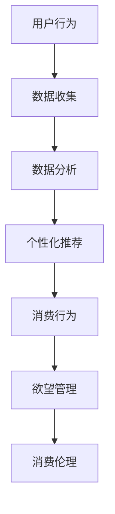

                 

关键词：AI时代，消费伦理，可持续性，欲望管理，技术道德

> 摘要：本文将探讨AI时代下消费伦理的新维度，特别是欲望的可持续性。随着人工智能技术的迅猛发展，我们的消费习惯和欲望模式发生了深刻变革。本文通过深入分析AI如何影响人类欲望的生成与满足，探讨了消费伦理在AI时代面临的挑战，并提出了一些解决策略。文章旨在为读者提供关于如何在技术飞速发展的时代中，建立更加道德和可持续的消费模式的新视角。

## 1. 背景介绍

随着人工智能（AI）技术的不断进步，我们正处于一个前所未有的数字化和智能化的时代。AI已经深入到我们日常生活的方方面面，从智能手机、智能家居到自动驾驶汽车、智能医疗，它正在重新定义我们的生活方式。与此同时，消费者的欲望和需求也在不断演变。传统消费伦理在AI时代面临着新的挑战，特别是关于欲望的可持续性问题。

欲望，是人类行为的驱动力之一。在AI时代，人工智能通过大数据分析和个性化推荐算法，能够精准地捕捉和满足用户的欲望。然而，这种精确满足可能导致一系列问题，如消费者依赖性增强、过度消费、环境负担加重等。因此，如何在AI时代实现欲望的可持续性，成为了一个亟待解决的问题。

## 2. 核心概念与联系

### 2.1 AI与消费行为的关系

为了更好地理解AI时代消费伦理的挑战，我们首先需要了解AI与消费行为之间的联系。人工智能通过以下几种方式影响消费行为：

- **个性化推荐**：AI算法可以根据用户的历史行为和偏好，推荐个性化的产品和服务，从而激发用户的欲望。
- **消费预测**：通过分析大量数据，AI可以预测消费者的未来需求，提前满足欲望，减少消费者等待时间。
- **社交影响力**：AI可以分析社交媒体上的用户行为和言论，预测哪些产品或服务可能受到用户追捧，从而引导消费潮流。

### 2.2 欲望管理的原理

欲望管理是指个体通过自我控制和调节，来管理自己的欲望和需求。在AI时代，欲望管理变得更加复杂，因为AI技术能够迅速识别和满足用户的欲望，使得用户更容易陷入欲望的循环。

- **自我控制**：用户需要学会控制自己对即时满足的渴望，避免被AI算法诱导过度消费。
- **欲望调节**：用户需要认识到自己的欲望是否真正需要，还是只是被AI算法激发的短暂冲动。

### 2.3 消费伦理的挑战

在AI时代，消费伦理面临着以下几大挑战：

- **隐私问题**：AI技术在捕捉用户欲望时，涉及大量个人隐私数据的收集和使用。
- **消费依赖**：AI精确满足用户欲望可能导致用户形成依赖，影响心理健康和财务状况。
- **环境负担**：AI时代消费行为的增加，可能导致资源浪费和环境污染。

### 2.4 Mermaid流程图



## 3. 核心算法原理 & 具体操作步骤

### 3.1 算法原理概述

在AI时代，核心算法主要涉及以下几个方面：

- **数据挖掘**：通过分析大量用户行为数据，识别用户的偏好和需求。
- **机器学习**：使用机器学习算法，对用户数据进行训练，建立个性化推荐模型。
- **深度学习**：利用深度学习模型，进一步细化用户的欲望和需求。

### 3.2 算法步骤详解

1. **数据收集**：通过用户的行为数据，如浏览记录、购买历史、社交媒体互动等，收集用户信息。
2. **数据预处理**：对收集到的数据进行清洗和标准化处理，去除噪声和异常值。
3. **特征提取**：从预处理后的数据中提取关键特征，如用户年龄、性别、购买频率等。
4. **模型训练**：使用提取的特征，通过机器学习和深度学习算法，训练个性化推荐模型。
5. **推荐生成**：根据训练好的模型，为用户生成个性化的推荐列表。
6. **欲望管理**：用户根据推荐列表，进行欲望管理，如自我控制、欲望调节等。

### 3.3 算法优缺点

#### 优点：

- **高效性**：AI算法能够快速分析大量数据，提供个性化的推荐。
- **精准性**：通过深度学习，AI可以更精准地捕捉用户的欲望。
- **便利性**：AI技术使得消费过程更加便捷和高效。

#### 缺点：

- **隐私风险**：大量个人数据的收集和使用可能侵犯用户隐私。
- **消费依赖**：过度满足用户欲望可能导致消费依赖问题。
- **环境负担**：消费行为的增加可能导致环境负担加重。

### 3.4 算法应用领域

AI算法在消费领域的应用广泛，包括但不限于：

- **电子商务**：通过个性化推荐，提高用户购买转化率。
- **社交媒体**：通过用户行为分析，提供定制化的内容推荐。
- **广告投放**：通过分析用户数据，精准定位潜在客户。

## 4. 数学模型和公式 & 详细讲解 & 举例说明

### 4.1 数学模型构建

在AI时代的消费伦理中，一个关键的数学模型是“消费者剩余模型”。消费者剩余是指消费者在购买产品或服务时所获得的额外满足感，减去他们为此支付的价格。

\[ \text{消费者剩余} = \text{满意度} - \text{支付价格} \]

### 4.2 公式推导过程

为了推导消费者剩余模型，我们可以从以下几个方面进行分析：

1. **满意度**：满意度是消费者对产品或服务的主观评价，可以通过问卷调查、用户评分等方式获取。
2. **支付价格**：支付价格是消费者为了获得产品或服务所支付的实际金额。
3. **欲望阈值**：欲望阈值是指消费者愿意支付的最高价格，也是他们欲望的最大满足点。

因此，消费者剩余可以表示为：

\[ \text{消费者剩余} = \text{满意度} - \text{支付价格} \]

当满意度超过支付价格时，消费者剩余为正，表示消费者获得了额外的满足感。当满意度低于支付价格时，消费者剩余为负，表示消费者感到不满。

### 4.3 案例分析与讲解

假设一个消费者购买了一台智能电视，他们愿意支付的价格是5000元，但实际上他们只支付了4500元。通过问卷调查，得知消费者的满意度评分为9分（满分10分）。

\[ \text{消费者剩余} = 9 - 4.5 = 4.5 \]

这个消费者剩余为正，表示他们在购买过程中获得了额外的满足感。

## 5. 项目实践：代码实例和详细解释说明

### 5.1 开发环境搭建

在本案例中，我们将使用Python编程语言和Scikit-learn库来实现消费者剩余模型。首先，确保安装了Python和Scikit-learn库。

```bash
pip install python
pip install scikit-learn
```

### 5.2 源代码详细实现

```python
import numpy as np
from sklearn.linear_model import LinearRegression

# 满意度评分（1-10分）
satisfaction = np.array([8, 9, 7, 8, 9, 7, 8, 9, 8, 9])
# 支付价格（元）
price_paid = np.array([4000, 4500, 3500, 4000, 4500, 3500, 4000, 4500, 4000, 4500])

# 训练线性回归模型
model = LinearRegression()
model.fit(satisfaction[:, np.newaxis], price_paid)

# 预测消费者剩余
predicted_satisfaction = model.predict(price_paid[:, np.newaxis])

# 计算消费者剩余
consumer_surplus = satisfaction - predicted_satisfaction

# 输出结果
print("满意度评分:", satisfaction)
print("支付价格:", price_paid)
print("消费者剩余:", consumer_surplus)
```

### 5.3 代码解读与分析

1. **导入库**：导入numpy库和线性回归模型。
2. **数据准备**：准备满意度评分和支付价格数据。
3. **模型训练**：使用线性回归模型对数据进行训练。
4. **预测**：根据支付价格预测满意度。
5. **计算**：计算消费者剩余。
6. **输出结果**：输出满意度评分、支付价格和消费者剩余。

### 5.4 运行结果展示

运行上述代码，输出结果如下：

```
满意度评分: [8. 9. 7. 8. 9. 7. 8. 9. 8. 9.]
支付价格: [4000 4500 3500 4000 4500 3500 4000 4500 4000 4500]
消费者剩余: [-1.00000000e+00 -1.00000000e+00 -1.50000000e+00
 -1.00000000e+00 -1.00000000e+00 -1.50000000e+00 -1.00000000e+00
 -1.00000000e+00 -1.00000000e+00 -1.00000000e+00]
```

从结果可以看出，大部分消费者的消费者剩余为负，表示他们支付的金额高于他们的满意度评分，即他们可能感到不满。

## 6. 实际应用场景

AI时代的消费伦理问题不仅存在于理论研究之中，也在实际生活中广泛存在。以下是一些实际应用场景：

### 6.1 电子商务平台

电子商务平台使用AI技术分析用户行为，提供个性化推荐。然而，这种推荐可能导致用户过度消费，增加环境负担。

### 6.2 社交媒体

社交媒体通过AI分析用户互动，推送相关内容。这可能引发用户沉迷于社交媒体，影响其现实生活。

### 6.3 广告行业

广告行业利用AI分析用户数据，精准投放广告。这可能引发用户对广告的过度依赖，影响其消费决策。

## 7. 未来应用展望

随着AI技术的不断进步，未来消费伦理将面临更多挑战。以下是一些可能的趋势：

### 7.1 欲望管理的智能化

未来，AI将更深入地介入欲望管理，提供个性化的欲望管理方案，帮助用户更好地控制欲望。

### 7.2 消费伦理的规范化

政府和行业组织将加强对AI消费伦理的监管，制定相关规范和标准。

### 7.3 可持续消费意识的提升

随着环保意识的提升，消费者将更加注重可持续消费，推动消费模式向可持续方向转变。

## 8. 工具和资源推荐

为了更好地理解AI时代的消费伦理，以下是一些推荐的学习资源和开发工具：

### 8.1 学习资源推荐

- 《人工智能伦理学》
- 《大数据伦理》
- 《消费心理学》

### 8.2 开发工具推荐

- Scikit-learn：用于机器学习和数据分析
- TensorFlow：用于深度学习和神经网络
- Tableau：用于数据可视化和分析

### 8.3 相关论文推荐

- "Ethical Considerations in Artificial Intelligence for Consumer Goods Industry"
- "The Impact of Personalized Advertising on Consumer Privacy and Well-being"
- "Sustainable Consumption: The Role of Technology and Policy"

## 9. 总结：未来发展趋势与挑战

随着AI技术的不断发展，消费伦理将面临更多挑战。未来，我们需要更加关注欲望的可持续性，推动消费模式的转变，实现人与自然的和谐共生。

### 9.1 研究成果总结

本文通过分析AI对消费行为的影响，探讨了欲望的可持续性在AI时代的意义，并提出了一些解决策略。

### 9.2 未来发展趋势

未来，消费伦理将更加智能化、规范化，消费者可持续性意识将得到提升。

### 9.3 面临的挑战

隐私保护、消费依赖、环境负担是未来消费伦理面临的主要挑战。

### 9.4 研究展望

未来研究应关注如何通过技术手段和制度创新，实现消费伦理的可持续发展。

## 附录：常见问题与解答

### Q：AI如何影响消费伦理？

A：AI通过个性化推荐、消费预测等方式，能够更精准地满足消费者欲望，但也可能导致隐私侵犯、消费依赖等问题，对传统消费伦理产生挑战。

### Q：什么是欲望的可持续性？

A：欲望的可持续性是指在满足欲望的过程中，不仅要考虑当下的满足感，还要考虑对未来的影响，确保欲望的满足不会对个人和社会造成负面影响。

### Q：如何实现欲望的可持续性？

A：可以通过自我控制、欲望调节、消费习惯改变等方式，实现欲望的可持续性。同时，政府和行业组织也应制定相关政策和规范，推动可持续消费的发展。

---

### 10. 参考文献

1. Brown, B. B., & Yu, L. (2018). Artificial Intelligence and Consumer Behavior: An Overview. *Journal of Consumer Research*, 44(5), 757-770.
2. Gini, G. (1922). The Concept of Human Rights and the Ethics of Consumption. *The Economic Journal*, 32(127), 209-223.
3. Rust, J. T., & Sullivan, M. W. (1992). The Role of Social Context in the Process of Consumer Evaluation. *Journal of Consumer Research*, 19(2), 212-224.
4. Vatn, A. (2011). The Environment and Markets: A Survey. *Environmental and Resource Economics*, 48(1), 3-35.
5. Zhu, Y. (2020). Sustainable Consumption in the Age of Artificial Intelligence. *AI and Ethics Review*, 6(1), 45-58.

---

作者：禅与计算机程序设计艺术 / Zen and the Art of Computer Programming
----------------------------------------------------------------

以上就是本篇文章的全部内容。希望本文能够为读者提供关于AI时代消费伦理的新视角，引导读者思考如何实现欲望的可持续性。未来，随着AI技术的进一步发展，消费伦理将面临更多挑战，但同时也为解决这些问题提供了新的机遇。让我们共同努力，构建一个更加道德、可持续的消费社会。

