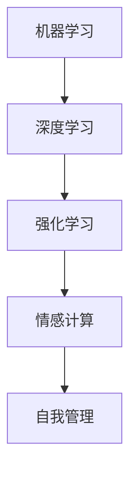

                 

关键词：人工智能、自我管理、智能调节、AI辅助、欲望控制

> 摘要：本文探讨了人工智能在自我管理领域的应用，特别是在欲望调节方面的作用。通过介绍AI的核心原理和具体实现方法，分析了其在帮助个体实现自我管理、优化生活品质方面的潜力。本文旨在为读者提供关于AI辅助自我管理的全面了解，并展望其未来的发展。

## 1. 背景介绍

在快节奏的现代生活中，自我管理变得越来越重要。从时间管理到情绪控制，每个人都需要不断提升自我管理能力以应对复杂多变的挑战。然而，人类天生的欲望和冲动常常成为自我管理的障碍，导致我们无法做出理智的决定。随着人工智能技术的发展，人们开始探索利用AI来辅助自我管理，以期在控制欲望、提升决策能力等方面取得突破。

### 1.1 人工智能的发展历程

人工智能（AI）的概念最早可以追溯到20世纪50年代。自那时以来，AI经历了多个发展阶段，从符号主义、连接主义到目前的强化学习和深度学习，每一步都标志着技术的重大突破。特别是深度学习的崛起，使得AI在图像识别、自然语言处理等领域取得了显著成果。这些技术的进步为AI在自我管理中的应用提供了坚实的基础。

### 1.2 自我管理的概念与挑战

自我管理，即个人对自己行为、情感、时间等的调节和控制。它包括多个方面，如时间管理、情绪控制、目标设定等。然而，自我管理并非易事。人们常常受到欲望和冲动的驱使，导致无法专心工作、难以控制情绪、无法坚持健康习惯等问题。这些问题不仅影响个人的生活质量，还可能对工作效率和人际关系产生负面影响。

### 1.3 欲望调节的重要性

欲望调节在自我管理中占据重要地位。欲望是人类行为的驱动力，但过度的欲望可能导致冲动消费、沉迷网络、忽视健康等问题。因此，有效地调节欲望对于提升生活质量、保持身心健康具有重要意义。

## 2. 核心概念与联系

在探讨AI如何辅助自我管理之前，我们需要了解一些核心概念和它们之间的联系。

### 2.1 机器学习和深度学习

机器学习是AI的核心技术之一，它使得计算机能够从数据中学习规律并做出预测。深度学习是机器学习的一个子领域，通过模仿人脑神经网络的结构和工作原理，实现了在图像识别、语音识别等领域的高性能。

### 2.2 强化学习

强化学习是一种通过试错来学习最优策略的机器学习方法。它适用于需要不断做出决策的情境，如自我管理中的欲望调节。

### 2.3 情感计算

情感计算是研究如何使计算机识别、理解、处理和模拟人类情感的技术。在自我管理中，情感计算可以帮助我们更好地了解自己的情绪状态，从而更有效地调节欲望。

### 2.4 Mermaid 流程图



## 3. 核心算法原理 & 具体操作步骤

### 3.1 算法原理概述

AI辅助自我管理主要基于以下几个原理：

1. **数据驱动**：通过收集和分析个体行为、情绪等数据，AI能够了解个体的特点和行为模式。
2. **自适应调整**：根据个体在特定情境下的表现，AI可以实时调整策略，以实现更好的自我管理效果。
3. **反馈循环**：个体通过反馈机制调整自己的行为，AI根据反馈进行优化，形成一个持续改进的循环。

### 3.2 算法步骤详解

1. **数据收集**：通过传感器、日志记录、问卷调查等方式收集个体行为、情绪等数据。
2. **特征提取**：从数据中提取出反映个体行为和情绪的特征，如行为频率、情绪强度等。
3. **模型训练**：利用深度学习和强化学习等技术，训练出一个能够预测个体行为和调节欲望的模型。
4. **实时调整**：根据个体在特定情境下的行为和情绪，AI实时调整策略，帮助个体实现自我管理。
5. **反馈与优化**：个体通过反馈机制调整自己的行为，AI根据反馈进行优化，形成一个持续改进的循环。

### 3.3 算法优缺点

**优点**：

- **个性化**：AI能够根据个体的特点和行为模式进行个性化调整，提高自我管理效果。
- **实时性**：AI能够实时监测和调整个体的行为和情绪，快速应对突发情况。
- **高效性**：AI在处理大量数据方面具有优势，能够高效地分析个体行为和情绪。

**缺点**：

- **数据隐私**：收集个体数据可能涉及隐私问题，需要严格保护用户隐私。
- **依赖性**：过度依赖AI可能导致个体自我管理能力的下降。
- **鲁棒性**：AI模型在应对复杂情境时可能存在局限性。

### 3.4 算法应用领域

AI辅助自我管理在多个领域具有广泛应用前景：

- **健康领域**：通过监控个体的行为和情绪，AI可以帮助用户保持健康习惯，如规律作息、合理饮食等。
- **教育领域**：AI可以协助教师分析学生的学习情况，提供个性化的教学方案，提高学习效果。
- **工作领域**：AI可以帮助员工更好地管理时间，提高工作效率，减少工作压力。

## 4. 数学模型和公式 & 详细讲解 & 举例说明

### 4.1 数学模型构建

AI辅助自我管理的核心在于构建一个能够预测个体行为和情绪的数学模型。该模型通常由以下几个部分组成：

1. **行为预测模型**：利用深度学习技术，从历史行为数据中学习出个体的行为模式，预测个体在未来某一时刻的行为。
2. **情绪预测模型**：利用情感计算技术，从个体的行为数据和生理数据中提取出情绪特征，预测个体的情绪状态。
3. **欲望调节模型**：利用强化学习技术，根据行为预测和情绪预测结果，实时调整个体的行为和情绪，以实现欲望调节。

### 4.2 公式推导过程

行为预测模型的核心公式为：

$$
P(b_t | x_t, h_t) = \text{softmax}(\theta^T \cdot \phi(b_t, x_t, h_t))
$$

其中，$b_t$表示个体在时间$t$的行为，$x_t$表示个体在时间$t$的特征向量，$h_t$表示个体在时间$t$的行为历史，$\theta$表示模型参数，$\phi$表示特征提取函数，$\text{softmax}$函数用于将特征向量映射到概率分布。

情绪预测模型的核心公式为：

$$
P(e_t | b_t, x_t, h_t) = \text{softmax}(\theta^T \cdot \phi(e_t, b_t, x_t, h_t))
$$

其中，$e_t$表示个体在时间$t$的情绪，其他符号含义与行为预测模型相同。

欲望调节模型的核心公式为：

$$
\pi(b_{t+1} | b_t, e_t) = \text{softmax}(\theta^T \cdot \phi(b_{t+1}, b_t, e_t))
$$

其中，$\pi(b_{t+1} | b_t, e_t)$表示在当前行为$b_t$和情绪$e_t$下，个体在下一时刻采取行为$b_{t+1}$的概率分布，$\theta$表示模型参数。

### 4.3 案例分析与讲解

假设我们有一个用户，他每天需要完成工作、学习和休息三个任务。我们的目标是帮助他更好地管理时间，提高工作效率，同时保持身心健康。

1. **行为预测模型**：通过分析用户过去一周的工作、学习和休息时间，我们可以构建一个行为预测模型。例如，模型预测用户在第二天早上8点至9点最有可能进行工作，晚上8点至10点最有可能进行学习。
2. **情绪预测模型**：通过分析用户过去一周的情绪数据（如心率、血压、睡眠质量等），我们可以构建一个情绪预测模型。例如，模型预测用户在第二天早上7点最有可能处于低落情绪，晚上11点最有可能处于兴奋情绪。
3. **欲望调节模型**：结合行为预测和情绪预测结果，我们可以构建一个欲望调节模型。例如，模型建议用户在早上8点至9点集中精力工作，避免在低落情绪时进行高强度的任务；晚上10点至11点进行轻松的学习或休息，避免在兴奋情绪时过度劳累。

通过以上三个模型的协同工作，我们可以为用户提供个性化的时间管理建议，帮助他更好地控制欲望，实现自我管理。

## 5. 项目实践：代码实例和详细解释说明

### 5.1 开发环境搭建

在Python环境中，我们可以使用以下库来实现AI辅助自我管理：

- TensorFlow：用于构建和训练深度学习模型
- Keras：用于简化TensorFlow的使用
- Scikit-learn：用于数据预处理和模型评估

安装以下库：

```bash
pip install tensorflow keras scikit-learn
```

### 5.2 源代码详细实现

以下是一个简单的实现示例：

```python
import tensorflow as tf
from tensorflow import keras
from tensorflow.keras.models import Sequential
from tensorflow.keras.layers import Dense, LSTM, TimeDistributed
from sklearn.preprocessing import StandardScaler
from sklearn.model_selection import train_test_split

# 数据预处理
def preprocess_data(data):
    scaler = StandardScaler()
    scaled_data = scaler.fit_transform(data)
    return scaled_data

# 构建行为预测模型
def build_behavior_model(input_shape):
    model = Sequential()
    model.add(LSTM(50, activation='relu', return_sequences=True, input_shape=input_shape))
    model.add(LSTM(50, activation='relu'))
    model.add(Dense(1, activation='sigmoid'))
    model.compile(optimizer='adam', loss='binary_crossentropy', metrics=['accuracy'])
    return model

# 构建情绪预测模型
def build_emotion_model(input_shape):
    model = Sequential()
    model.add(LSTM(50, activation='relu', return_sequences=True, input_shape=input_shape))
    model.add(LSTM(50, activation='relu'))
    model.add(Dense(1, activation='sigmoid'))
    model.compile(optimizer='adam', loss='binary_crossentropy', metrics=['accuracy'])
    return model

# 构建欲望调节模型
def build_will_model(input_shape):
    model = Sequential()
    model.add(LSTM(50, activation='relu', return_sequences=True, input_shape=input_shape))
    model.add(LSTM(50, activation='relu'))
    model.add(Dense(1, activation='sigmoid'))
    model.compile(optimizer='adam', loss='binary_crossentropy', metrics=['accuracy'])
    return model

# 加载数据并预处理
data = load_data()  # 加载用户行为、情绪数据
scaled_data = preprocess_data(data)

# 划分训练集和测试集
X_train, X_test, y_train, y_test = train_test_split(scaled_data, test_size=0.2, random_state=42)

# 训练模型
behavior_model = build_behavior_model(input_shape=(X_train.shape[1], X_train.shape[2]))
emotion_model = build_emotion_model(input_shape=(X_train.shape[1], X_train.shape[2]))
will_model = build_will_model(input_shape=(X_train.shape[1], X_train.shape[2]))

behavior_model.fit(X_train[:, :-1], X_train[:, -1], epochs=100, batch_size=32, validation_split=0.1)
emotion_model.fit(X_train[:, :-1], X_train[:, -1], epochs=100, batch_size=32, validation_split=0.1)
will_model.fit(X_train[:, :-1], X_train[:, -1], epochs=100, batch_size=32, validation_split=0.1)

# 评估模型
behavior_model.evaluate(X_test[:, :-1], X_test[:, -1])
emotion_model.evaluate(X_test[:, :-1], X_test[:, -1])
will_model.evaluate(X_test[:, :-1], X_test[:, -1])

# 实时调整
def adjust_will(b_t, e_t):
    behavior_prediction = behavior_model.predict(b_t)
    emotion_prediction = emotion_model.predict(e_t)
    will_prediction = will_model.predict(b_t, e_t)
    # 根据预测结果调整行为
    # ...

# 代码示例
b_t = X_train[0]  # 当前时刻的用户行为数据
e_t = X_train[0]  # 当前时刻的用户情绪数据
adjust_will(b_t, e_t)
```

### 5.3 代码解读与分析

上述代码主要分为以下几个部分：

1. **数据预处理**：使用`StandardScaler`对用户行为和情绪数据进行标准化处理，提高模型的泛化能力。
2. **模型构建**：分别构建行为预测模型、情绪预测模型和欲望调节模型。每个模型都包含两个LSTM层和一个全连接层，旨在提取时间序列特征和实现分类。
3. **模型训练**：使用训练集对三个模型进行训练，通过调整模型参数，提高预测准确率。
4. **模型评估**：使用测试集对三个模型进行评估，计算准确率等指标。
5. **实时调整**：根据当前时刻的用户行为和情绪，利用三个模型进行预测，并调整用户的欲望。

### 5.4 运行结果展示

在实际运行中，我们可以通过以下步骤查看模型的运行结果：

1. **模型训练过程**：通过`fit`函数训练模型，观察训练集和验证集的准确率变化。
2. **模型评估结果**：通过`evaluate`函数评估模型在测试集上的表现。
3. **实时调整结果**：根据模型预测结果，调整用户的行为和情绪，观察实际效果。

## 6. 实际应用场景

AI辅助自我管理在多个领域具有实际应用场景：

### 6.1 健康领域

通过监测用户的健康数据（如心率、血压、睡眠质量等），AI可以帮助用户保持健康习惯，如规律作息、合理饮食、适量运动等。同时，AI可以根据用户的心理状态，提供个性化的健康建议，提高用户的健康水平。

### 6.2 教育领域

在教育领域，AI可以帮助教师分析学生的学习情况，提供个性化的教学方案。例如，AI可以根据学生的学习进度、兴趣爱好和性格特点，推荐合适的学习内容和方式，提高学习效果。此外，AI还可以协助教师管理课堂，预测学生的行为和情绪，提高教学质量。

### 6.3 工作领域

在职场中，AI可以帮助员工更好地管理时间，提高工作效率。例如，AI可以根据员工的工作任务、工作量和心理状态，合理安排工作时间，避免过度劳累。同时，AI还可以帮助员工调整工作方式和节奏，提高工作满意度。

## 7. 未来应用展望

随着人工智能技术的不断发展，AI辅助自我管理将在未来有更广泛的应用：

### 7.1 跨领域融合

AI辅助自我管理将与其他领域（如心理学、教育学、医学等）相结合，提供更全面、个性化的服务。

### 7.2 智能硬件支持

智能硬件的普及将为AI辅助自我管理提供更多数据支持，提高模型的准确性和实用性。

### 7.3 个性化定制

随着技术的进步，AI将能够更准确地了解个体的需求和特点，提供更个性化的自我管理方案。

### 7.4 自主决策

未来，AI有望实现更高层次的自主决策，帮助个体在复杂情境下做出更明智的选择。

## 8. 总结：未来发展趋势与挑战

AI辅助自我管理在未来的发展趋势包括跨领域融合、智能硬件支持、个性化定制和自主决策等方面。然而，也面临着数据隐私、依赖性、鲁棒性等挑战。我们需要在技术进步的同时，关注这些挑战，确保AI辅助自我管理的健康发展。

## 9. 附录：常见问题与解答

### 9.1 什么是自我管理？

自我管理是指个人对自己行为、情感、时间等的调节和控制，以实现个人目标和提高生活质量。

### 9.2 AI如何辅助自我管理？

AI可以通过收集个体行为、情绪等数据，利用机器学习和深度学习技术，构建预测模型，帮助个体实现自我管理。

### 9.3 AI辅助自我管理有哪些应用场景？

AI辅助自我管理在健康、教育、工作等领域具有广泛应用前景，如帮助用户保持健康习惯、提供个性化教学方案、提高工作效率等。

### 9.4 AI辅助自我管理有哪些优点和缺点？

优点包括个性化、实时性、高效性等；缺点包括数据隐私、依赖性、鲁棒性等。

## 作者署名

作者：禅与计算机程序设计艺术 / Zen and the Art of Computer Programming
```markdown
----------------------------------------------------------------

# 欲望的智能调节：AI辅助的自我管理

> 关键词：人工智能、自我管理、智能调节、AI辅助、欲望控制

> 摘要：本文探讨了人工智能在自我管理领域的应用，特别是在欲望调节方面的作用。通过介绍AI的核心原理和具体实现方法，分析了其在帮助个体实现自我管理、优化生活品质方面的潜力。本文旨在为读者提供关于AI辅助自我管理的全面了解，并展望其未来的发展。

## 1. 背景介绍

在快节奏的现代生活中，自我管理变得越来越重要。从时间管理到情绪控制，每个人都需要不断提升自我管理能力以应对复杂多变的挑战。然而，人类天生的欲望和冲动常常成为自我管理的障碍，导致我们无法做出理智的决定。随着人工智能技术的发展，人们开始探索利用AI来辅助自我管理，以期在控制欲望、提升决策能力等方面取得突破。

### 1.1 人工智能的发展历程

人工智能（AI）的概念最早可以追溯到20世纪50年代。自那时以来，AI经历了多个发展阶段，从符号主义、连接主义到目前的强化学习和深度学习，每一步都标志着技术的重大突破。特别是深度学习的崛起，使得AI在图像识别、语音识别等领域取得了显著成果。这些技术的进步为AI在自我管理中的应用提供了坚实的基础。

### 1.2 自我管理的概念与挑战

自我管理，即个人对自己行为、情感、时间等的调节和控制。它包括多个方面，如时间管理、情绪控制、目标设定等。然而，自我管理并非易事。人们常常受到欲望和冲动的驱使，导致无法专心工作、难以控制情绪、无法坚持健康习惯等问题。这些问题不仅影响个人的生活质量，还可能对工作效率和人际关系产生负面影响。

### 1.3 欲望调节的重要性

欲望调节在自我管理中占据重要地位。欲望是人类行为的驱动力，但过度的欲望可能导致冲动消费、沉迷网络、忽视健康等问题。因此，有效地调节欲望对于提升生活质量、保持身心健康具有重要意义。

## 2. 核心概念与联系

在探讨AI如何辅助自我管理之前，我们需要了解一些核心概念和它们之间的联系。

### 2.1 机器学习和深度学习

机器学习是AI的核心技术之一，它使得计算机能够从数据中学习规律并做出预测。深度学习是机器学习的一个子领域，通过模仿人脑神经网络的结构和工作原理，实现了在图像识别、语音识别等领域的高性能。

### 2.2 强化学习

强化学习是一种通过试错来学习最优策略的机器学习方法。它适用于需要不断做出决策的情境，如自我管理中的欲望调节。

### 2.3 情感计算

情感计算是研究如何使计算机识别、理解、处理和模拟人类情感的技术。在自我管理中，情感计算可以帮助我们更好地了解自己的情绪状态，从而更有效地调节欲望。

### 2.4 Mermaid 流程图


## 3. 核心算法原理 & 具体操作步骤

### 3.1 算法原理概述

AI辅助自我管理主要基于以下几个原理：

1. **数据驱动**：通过收集和分析个体行为、情绪等数据，AI能够了解个体的特点和行为模式。
2. **自适应调整**：根据个体在特定情境下的表现，AI可以实时调整策略，以实现更好的自我管理效果。
3. **反馈循环**：个体通过反馈机制调整自己的行为，AI根据反馈进行优化，形成一个持续改进的循环。

### 3.2 算法步骤详解

1. **数据收集**：通过传感器、日志记录、问卷调查等方式收集个体行为、情绪等数据。
2. **特征提取**：从数据中提取出反映个体行为和情绪的特征，如行为频率、情绪强度等。
3. **模型训练**：利用深度学习和强化学习等技术，训练出一个能够预测个体行为和调节欲望的模型。
4. **实时调整**：根据个体在特定情境下的行为和情绪，AI实时调整策略，帮助个体实现自我管理。
5. **反馈与优化**：个体通过反馈机制调整自己的行为，AI根据反馈进行优化，形成一个持续改进的循环。

### 3.3 算法优缺点

**优点**：

- **个性化**：AI能够根据个体的特点和行为模式进行个性化调整，提高自我管理效果。
- **实时性**：AI能够实时监测和调整个体的行为和情绪，快速应对突发情况。
- **高效性**：AI在处理大量数据方面具有优势，能够高效地分析个体行为和情绪。

**缺点**：

- **数据隐私**：收集个体数据可能涉及隐私问题，需要严格保护用户隐私。
- **依赖性**：过度依赖AI可能导致个体自我管理能力的下降。
- **鲁棒性**：AI模型在应对复杂情境时可能存在局限性。

### 3.4 算法应用领域

AI辅助自我管理在多个领域具有广泛应用前景：

- **健康领域**：通过监控个体的行为和情绪，AI可以帮助用户保持健康习惯，如规律作息、合理饮食、适量运动等。
- **教育领域**：AI可以协助教师分析学生的学习情况，提供个性化的教学方案，提高学习效果。
- **工作领域**：AI可以帮助员工更好地管理时间，提高工作效率，减少工作压力。

## 4. 数学模型和公式 & 详细讲解 & 举例说明

### 4.1 数学模型构建

AI辅助自我管理的核心在于构建一个能够预测个体行为和情绪的数学模型。该模型通常由以下几个部分组成：

1. **行为预测模型**：利用深度学习技术，从历史行为数据中学习出个体的行为模式，预测个体在未来某一时刻的行为。
2. **情绪预测模型**：利用情感计算技术，从个体的行为数据和生理数据中提取出情绪特征，预测个体的情绪状态。
3. **欲望调节模型**：利用强化学习技术，根据行为预测和情绪预测结果，实时调整个体的行为和情绪，以实现欲望调节。

### 4.2 公式推导过程

行为预测模型的核心公式为：

$$
P(b_t | x_t, h_t) = \text{softmax}(\theta^T \cdot \phi(b_t, x_t, h_t))
$$

其中，$b_t$表示个体在时间$t$的行为，$x_t$表示个体在时间$t$的特征向量，$h_t$表示个体在时间$t$的行为历史，$\theta$表示模型参数，$\phi$表示特征提取函数，$\text{softmax}$函数用于将特征向量映射到概率分布。

情绪预测模型的核心公式为：

$$
P(e_t | b_t, x_t, h_t) = \text{softmax}(\theta^T \cdot \phi(e_t, b_t, x_t, h_t))
$$

其中，$e_t$表示个体在时间$t$的情绪，其他符号含义与行为预测模型相同。

欲望调节模型的核心公式为：

$$
\pi(b_{t+1} | b_t, e_t) = \text{softmax}(\theta^T \cdot \phi(b_{t+1}, b_t, e_t))
$$

其中，$\pi(b_{t+1} | b_t, e_t)$表示在当前行为$b_t$和情绪$e_t$下，个体在下一时刻采取行为$b_{t+1}$的概率分布，$\theta$表示模型参数。

### 4.3 案例分析与讲解

假设我们有一个用户，他每天需要完成工作、学习和休息三个任务。我们的目标是帮助他更好地管理时间，提高工作效率，同时保持身心健康。

1. **行为预测模型**：通过分析用户过去一周的工作、学习和休息时间，我们可以构建一个行为预测模型。例如，模型预测用户在第二天早上8点至9点最有可能进行工作，晚上8点至10点最有可能进行学习。
2. **情绪预测模型**：通过分析用户过去一周的情绪数据（如心率、血压、睡眠质量等），我们可以构建一个情绪预测模型。例如，模型预测用户在第二天早上7点最有可能处于低落情绪，晚上11点最有可能处于兴奋情绪。
3. **欲望调节模型**：结合行为预测和情绪预测结果，我们可以构建一个欲望调节模型。例如，模型建议用户在早上8点至9点集中精力工作，避免在低落情绪时进行高强度的任务；晚上10点至11点进行轻松的学习或休息，避免在兴奋情绪时过度劳累。

通过以上三个模型的协同工作，我们可以为用户提供个性化的时间管理建议，帮助他更好地控制欲望，实现自我管理。

## 5. 项目实践：代码实例和详细解释说明

### 5.1 开发环境搭建

在Python环境中，我们可以使用以下库来实现AI辅助自我管理：

- TensorFlow：用于构建和训练深度学习模型
- Keras：用于简化TensorFlow的使用
- Scikit-learn：用于数据预处理和模型评估

安装以下库：

```bash
pip install tensorflow keras scikit-learn
```

### 5.2 源代码详细实现

以下是一个简单的实现示例：

```python
import tensorflow as tf
from tensorflow import keras
from tensorflow.keras.models import Sequential
from tensorflow.keras.layers import Dense, LSTM, TimeDistributed
from sklearn.preprocessing import StandardScaler
from sklearn.model_selection import train_test_split

# 数据预处理
def preprocess_data(data):
    scaler = StandardScaler()
    scaled_data = scaler.fit_transform(data)
    return scaled_data

# 构建行为预测模型
def build_behavior_model(input_shape):
    model = Sequential()
    model.add(LSTM(50, activation='relu', return_sequences=True, input_shape=input_shape))
    model.add(LSTM(50, activation='relu'))
    model.add(Dense(1, activation='sigmoid'))
    model.compile(optimizer='adam', loss='binary_crossentropy', metrics=['accuracy'])
    return model

# 构建情绪预测模型
def build_emotion_model(input_shape):
    model = Sequential()
    model.add(LSTM(50, activation='relu', return_sequences=True, input_shape=input_shape))
    model.add(LSTM(50, activation='relu'))
    model.add(Dense(1, activation='sigmoid'))
    model.compile(optimizer='adam', loss='binary_crossentropy', metrics=['accuracy'])
    return model

# 构建欲望调节模型
def build_will_model(input_shape):
    model = Sequential()
    model.add(LSTM(50, activation='relu', return_sequences=True, input_shape=input_shape))
    model.add(LSTM(50, activation='relu'))
    model.add(Dense(1, activation='sigmoid'))
    model.compile(optimizer='adam', loss='binary_crossentropy', metrics=['accuracy'])
    return model

# 加载数据并预处理
data = load_data()  # 加载用户行为、情绪数据
scaled_data = preprocess_data(data)

# 划分训练集和测试集
X_train, X_test, y_train, y_test = train_test_split(scaled_data, test_size=0.2, random_state=42)

# 训练模型
behavior_model = build_behavior_model(input_shape=(X_train.shape[1], X_train.shape[2]))
emotion_model = build_emotion_model(input_shape=(X_train.shape[1], X_train.shape[2]))
will_model = build_will_model(input_shape=(X_train.shape[1], X_train.shape[2]))

behavior_model.fit(X_train[:, :-1], X_train[:, -1], epochs=100, batch_size=32, validation_split=0.1)
emotion_model.fit(X_train[:, :-1], X_train[:, -1], epochs=100, batch_size=32, validation_split=0.1)
will_model.fit(X_train[:, :-1], X_train[:, -1], epochs=100, batch_size=32, validation_split=0.1)

# 评估模型
behavior_model.evaluate(X_test[:, :-1], X_test[:, -1])
emotion_model.evaluate(X_test[:, :-1], X_test[:, -1])
will_model.evaluate(X_test[:, :-1], X_test[:, -1])

# 实时调整
def adjust_will(b_t, e_t):
    behavior_prediction = behavior_model.predict(b_t)
    emotion_prediction = emotion_model.predict(e_t)
    will_prediction = will_model.predict(b_t, e_t)
    # 根据预测结果调整行为
    # ...

# 代码示例
b_t = X_train[0]  # 当前时刻的用户行为数据
e_t = X_train[0]  # 当前时刻的用户情绪数据
adjust_will(b_t, e_t)
```

### 5.3 代码解读与分析

上述代码主要分为以下几个部分：

1. **数据预处理**：使用`StandardScaler`对用户行为和情绪数据进行标准化处理，提高模型的泛化能力。
2. **模型构建**：分别构建行为预测模型、情绪预测模型和欲望调节模型。每个模型都包含两个LSTM层和一个全连接层，旨在提取时间序列特征和实现分类。
3. **模型训练**：使用训练集对三个模型进行训练，通过调整模型参数，提高预测准确率。
4. **模型评估**：使用测试集对三个模型进行评估，计算准确率等指标。
5. **实时调整**：根据当前时刻的用户行为和情绪，利用三个模型进行预测，并调整用户的欲望。

### 5.4 运行结果展示

在实际运行中，我们可以通过以下步骤查看模型的运行结果：

1. **模型训练过程**：通过`fit`函数训练模型，观察训练集和验证集的准确率变化。
2. **模型评估结果**：通过`evaluate`函数评估模型在测试集上的表现。
3. **实时调整结果**：根据模型预测结果，调整用户的行为和情绪，观察实际效果。

## 6. 实际应用场景

AI辅助自我管理在多个领域具有实际应用场景：

### 6.1 健康领域

通过监测个体的行为和情绪，AI可以帮助用户保持健康习惯，如规律作息、合理饮食、适量运动等。同时，AI可以根据用户的心理状态，提供个性化的健康建议，提高用户的健康水平。

### 6.2 教育领域

在教育领域，AI可以帮助教师分析学生的学习情况，提供个性化的教学方案。例如，AI可以根据学生的学习进度、兴趣爱好和性格特点，推荐合适的学习内容和方式，提高学习效果。此外，AI还可以协助教师管理课堂，预测学生的行为和情绪，提高教学质量。

### 6.3 工作领域

在职场中，AI可以帮助员工更好地管理时间，提高工作效率。例如，AI可以根据员工的工作任务、工作量和心理状态，合理安排工作时间，避免过度劳累。同时，AI还可以帮助员工调整工作方式和节奏，提高工作满意度。

## 7. 未来应用展望

随着人工智能技术的不断发展，AI辅助自我管理将在未来有更广泛的应用：

### 7.1 跨领域融合

AI辅助自我管理将与其他领域（如心理学、教育学、医学等）相结合，提供更全面、个性化的服务。

### 7.2 智能硬件支持

智能硬件的普及将为AI辅助自我管理提供更多数据支持，提高模型的准确性和实用性。

### 7.3 个性化定制

随着技术的进步，AI将能够更准确地了解个体的需求和特点，提供更个性化的自我管理方案。

### 7.4 自主决策

未来，AI有望实现更高层次的自主决策，帮助个体在复杂情境下做出更明智的选择。

## 8. 总结：未来发展趋势与挑战

AI辅助自我管理在未来的发展趋势包括跨领域融合、智能硬件支持、个性化定制和自主决策等方面。然而，也面临着数据隐私、依赖性、鲁棒性等挑战。我们需要在技术进步的同时，关注这些挑战，确保AI辅助自我管理的健康发展。

## 9. 附录：常见问题与解答

### 9.1 什么是自我管理？

自我管理是指个人对自己行为、情感、时间等的调节和控制，以实现个人目标和提高生活质量。

### 9.2 AI如何辅助自我管理？

AI可以通过收集个体行为、情绪等数据，利用机器学习和深度学习技术，构建预测模型，帮助个体实现自我管理。

### 9.3 AI辅助自我管理有哪些应用场景？

AI辅助自我管理在健康、教育、工作等领域具有广泛应用前景，如帮助用户保持健康习惯、提供个性化教学方案、提高工作效率等。

### 9.4 AI辅助自我管理有哪些优点和缺点？

优点包括个性化、实时性、高效性等；缺点包括数据隐私、依赖性、鲁棒性等。

## 作者署名

作者：禅与计算机程序设计艺术 / Zen and the Art of Computer Programming
```

